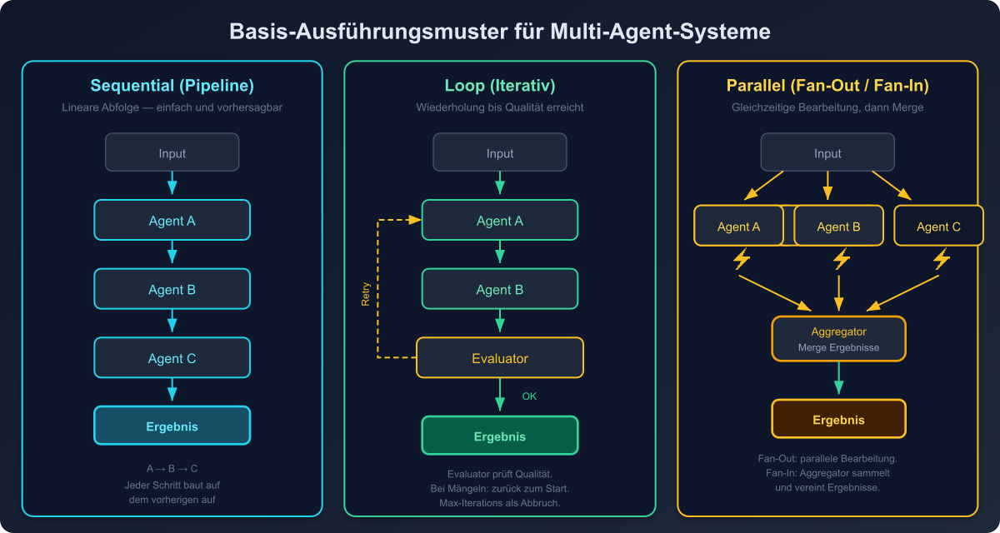
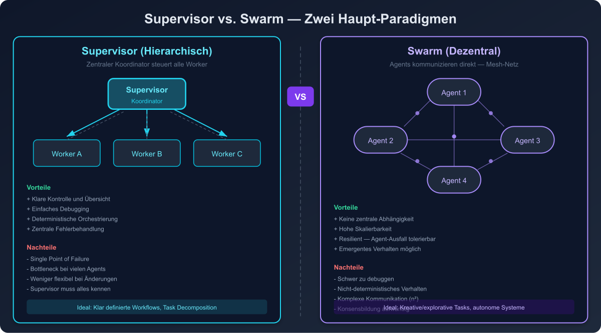
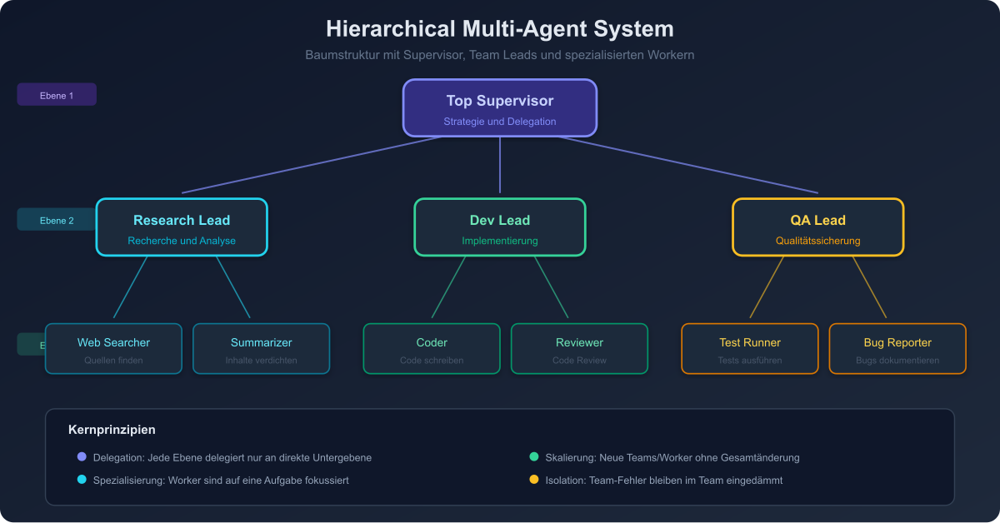
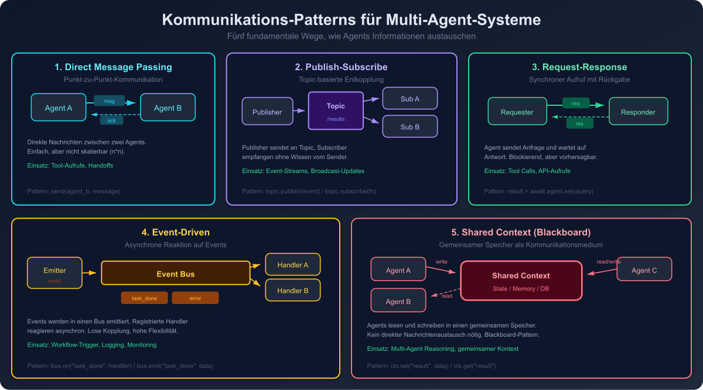

# 05 — Multi-Agent Patterns

## Überblick

Multi-Agent-Systeme koordinieren mehrere spezialisierte Agents, um komplexe Aufgaben zu lösen. Google hat acht fundamentale Multi-Agent-Architekturen identifiziert, die auf drei Basis-Ausführungsmustern (Sequential, Loop, Parallel) aufbauen.

---

## Basis-Ausführungsmuster



### Sequential (Pipeline)
```
Agent A → Agent B → Agent C → Ergebnis
```
Agents sind wie ein Fließband angeordnet. Jeder Agent reicht seinen Output an den nächsten weiter. Linear, deterministisch, einfach zu debuggen.

### Loop
```
Agent A → Agent B → Evaluator → (zurück zu A falls nötig) → Ergebnis
```
Iterative Verarbeitung mit Feedback-Schleife bis ein Qualitätskriterium erfüllt ist.

### Parallel
```
     ┌→ Agent A ──┐
Input ├→ Agent B ──┤→ Aggregator → Ergebnis
     └→ Agent C ──┘
```
Unabhängige Agents arbeiten gleichzeitig, Ergebnisse werden aggregiert.

---

## Pattern 1: Supervisor (Hierarchisch)



### Beschreibung
Ein übergeordneter Supervisor-Agent koordiniert mehrere untergeordnete Worker-Agents. Der Supervisor trifft alle Routing- und Orchestrierungsentscheidungen.

### Architektur
```
              ┌──→ [Research Agent]
[Supervisor] ─┼──→ [Analysis Agent]
              └──→ [Writing Agent]
```

### Wann einsetzen
- Klare Aufgabentrennung zwischen spezialisierten Agents
- Wenn zentrale Kontrolle und Oversight benötigt wird
- Wenn der Workflow vorhersehbar ist

### Implementierungsdetails
- Supervisor erhält die Gesamtaufgabe und entscheidet über Delegation
- Worker-Agents berichten an den Supervisor zurück
- Supervisor synthetisiert die Ergebnisse
- Supervisor kann bei Bedarf weitere Iterationen anordnen

### Trade-offs
- **Pro**: Klare Hierarchie, einfache Kontrolle, guter Überblick
- **Contra**: Supervisor als Bottleneck und Single Point of Failure

---

## Pattern 2: Swarm (Dezentral)

### Beschreibung
Agents kommunizieren direkt miteinander ohne zentralen Koordinator. Jeder Agent entscheidet selbstständig, ob und an wen er Aufgaben delegiert. Der "Handoff" erfolgt direkt zwischen Agents.

### Architektur
```
[Agent A] ←──→ [Agent B]
    ↕               ↕
[Agent C] ←──→ [Agent D]
```

### Wann einsetzen
- Dynamische, unvorhersehbare Workflows
- Wenn kein einzelner Agent den Gesamtüberblick braucht
- Für emergentes Verhalten aus Agent-Interaktionen
- OpenAI Swarm Framework als Referenz-Implementierung

### Implementierungsdetails
- Jeder Agent hat definierte "Handoff"-Regeln
- Kontext wird bei Übergabe mitgegeben
- Kein zentraler State — jeder Agent hält seinen eigenen Zustand
- Emergentes Verhalten durch Interaktion

### Trade-offs
- **Pro**: Hochflexibel, kein Single Point of Failure, skalierbar
- **Contra**: Schwer zu debuggen, unvorhersehbar, mögliche Endlosschleifen

---

## Pattern 3: Hierarchical Multi-Agent



### Beschreibung
Verschachtelte Supervisor-Hierarchie. Ein Top-Level-Supervisor delegiert an Mid-Level-Supervisors, die wiederum an Worker-Agents delegieren.

### Architektur
```
[Top Supervisor]
├── [Team Lead: Research]
│   ├── [Web Researcher]
│   └── [Data Analyst]
├── [Team Lead: Development]
│   ├── [Backend Dev]
│   └── [Frontend Dev]
└── [Team Lead: QA]
    ├── [Test Writer]
    └── [Security Reviewer]
```

### Wann einsetzen
- Sehr komplexe Aufgaben mit vielen Teilbereichen
- Enterprise-Szenarien mit Spezialisierungsbedarf
- Wenn verschiedene "Abteilungen" unabhängig arbeiten sollen

---

## Pattern 4: Shared Workspace (Blackboard)

### Beschreibung
Agents teilen sich einen gemeinsamen Arbeitsbereich (Shared State), in den sie lesen und schreiben können. Es gibt keinen expliziten Message-Passing zwischen Agents — die Kommunikation läuft über den gemeinsamen Zustand.

### Architektur
```
[Agent A] ──┐                  ┌── [Agent A]
[Agent B] ──┼──→ [Shared State] ──→├── [Agent B]
[Agent C] ──┘     (Lesen/Schreiben) └── [Agent C]
```

### Wann einsetzen
- Wenn Agents iterativ an demselben Artefakt arbeiten
- Kollaborative Dokument-Erstellung
- Wenn Agent-Reihenfolge dynamisch sein soll

### Implementierungsdetails
- Shared State als zentrale Datenstruktur (z.B. JSON-Dokument, Graph, Datenbank)
- Agents lesen den aktuellen Zustand, führen ihre Spezialisierung aus, schreiben das Ergebnis zurück
- Conflict Resolution bei gleichzeitigem Schreiben
- Revival in LLM-Powered Multi-Agent-Systemen als Alternative zu hart verdrahtetem Message-Passing

---

## Pattern 5: Scatter-Gather

### Beschreibung
Eine Aufgabe wird an mehrere Agents "gestreut" (Scatter), die unabhängig arbeiten. Die Ergebnisse werden anschließend "gesammelt" (Gather) und konsolidiert.

### Architektur
```
                    ┌→ [Agent A: Region EU] ────┐
[Scatter Controller]├→ [Agent B: Region US] ────┼→ [Gather/Aggregator]
                    └→ [Agent C: Region APAC] ──┘
```

### Wann einsetzen
- Aufgaben, die parallel auf verschiedene Datenquellen/Regionen anwendbar sind
- Recherche-Aufgaben (mehrere Quellen parallel durchsuchen)
- Datenanalyse über partitionierte Datensätze

---

## Pattern 6: Pipeline Parallelism

### Beschreibung
Verschiedene Agents bearbeiten sequentielle Phasen, aber arbeiten gleichzeitig an verschiedenen Inputs — ähnlich einer Fließband-Parallelisierung.

### Architektur
```
Input 1 → [Parsing] → [Analysis] → [Output]
Input 2 →    [Parsing] → [Analysis] → [Output]
Input 3 →       [Parsing] → [Analysis] → [Output]
```

### Wann einsetzen
- Batch-Verarbeitung mit mehreren Inputs
- Wenn die Pipeline-Stufen unterschiedlich lange dauern
- Throughput-Optimierung

---

## Pattern 7: Agent-to-Agent Protocol (A2A)

### Beschreibung
Von Google entwickeltes Protokoll für standardisierte Inter-Agent-Kommunikation. Ermöglicht Interoperabilität zwischen Agents verschiedener Frameworks und Anbieter.

### Kernkonzepte
- **Agent Card**: Maschinenlesbare Beschreibung der Agent-Fähigkeiten
- **Standardisierte Messages**: Einheitliches Nachrichtenformat
- **Capability Discovery**: Agents können die Fähigkeiten anderer Agents entdecken
- **Task Delegation**: Formale Delegation mit Ergebnisrückgabe

### Wann einsetzen
- Enterprise-Umgebungen mit heterogenen Agent-Systemen
- Wenn Agents verschiedener Frameworks zusammenarbeiten müssen
- Für skalierbare, erweiterbare Multi-Agent-Architekturen

---

## Pattern 8: Ensemble / Voting

### Beschreibung
Mehrere Agents verarbeiten dieselbe Aufgabe unabhängig. Die Ergebnisse werden aggregiert, um Single-Model-Bias und Varianz zu reduzieren.

### Varianten
- **Majority Voting**: Häufigste Antwort gewinnt
- **Weighted Voting**: Gewichtung nach Agent-Expertise oder historischer Genauigkeit
- **Best-of-N**: Alle Antworten evaluieren, beste auswählen
- **Ensemble mit verschiedenen Modellen**: GPT-4, Claude, Gemini jeweils befragen

### Wann einsetzen
- Kritische Entscheidungen, bei denen Fehler teuer sind
- Wenn ein einzelnes Modell unzuverlässig ist
- Für erhöhte Robustheit und Zuverlässigkeit

---

## Kommunikations-Patterns zwischen Agents



### Direct Message Passing
Agents senden Nachrichten direkt an spezifische andere Agents.

### Publish-Subscribe
Agents publizieren Ereignisse, interessierte Agents abonnieren relevante Topics.

### Request-Response
Synchrone Kommunikation: Agent A fragt Agent B und wartet auf Antwort.

### Event-Driven
Agents reagieren auf Events aus einer zentralen Event-Queue.

### Shared Context
Alle Agents lesen/schreiben in einen gemeinsamen Kontext (s. Shared Workspace).

---

## Framework-Implementierungen (2026)

| Framework | Paradigma | State Management | Stärke |
|-----------|-----------|-----------------|--------|
| **LangGraph** | Graph/State Machine | Checkpoint-basiert, persistent | Fein-granulare Kontrolle, Production-ready |
| **CrewAI** | Role-based | Aufgaben-basiert | Einfache Agent-Definition, schneller Start |
| **AutoGen** | Conversation | Konversationsbasiert | Flexible Multi-Agent-Gespräche |
| **Google ADK** | Sequential/Loop/Parallel | A2A Protocol | Enterprise-Integration, Google Cloud |
| **OpenAI Agents SDK** | Swarm/Handoff | Kontext-Übergabe | Einfaches Handoff-Modell |
