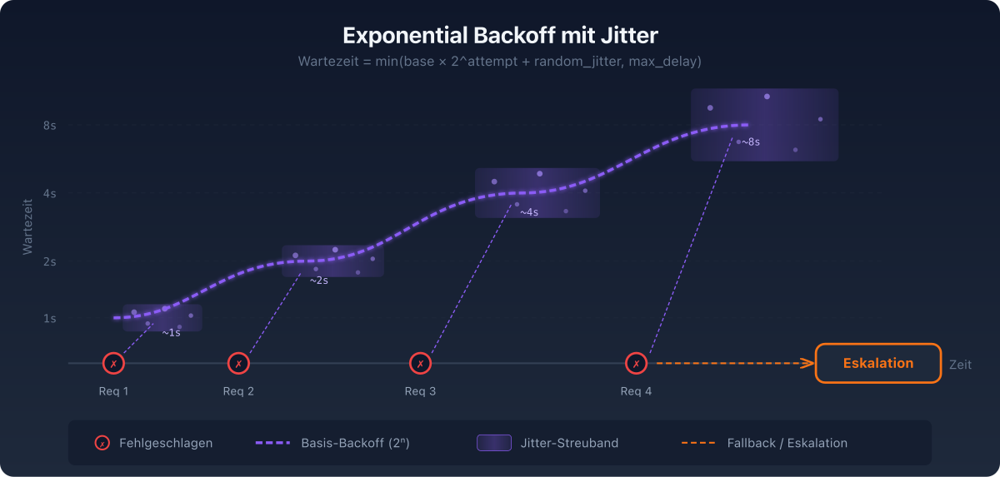
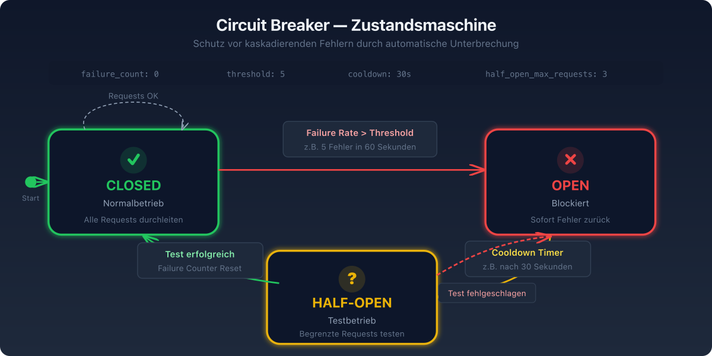
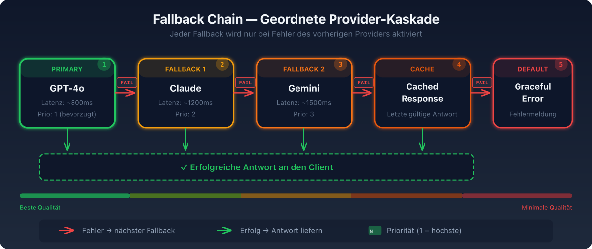
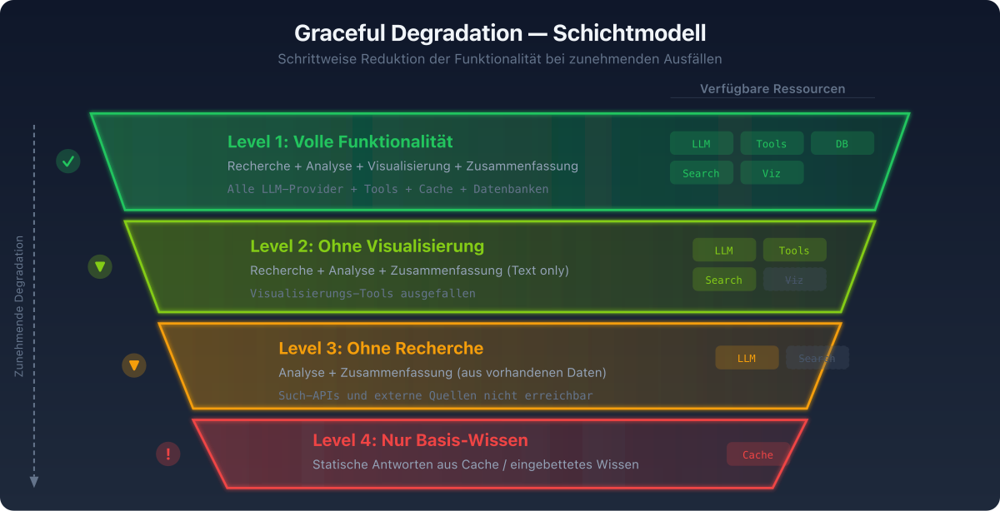

# 07 — Resilience und Error Handling Patterns

## Überblick

Agent-Systeme operieren in nicht-deterministischen Umgebungen mit externen Abhängigkeiten. Robuste Fehlerbehandlung ist keine optionale Ergänzung, sondern eine architektonische Notwendigkeit. Die folgenden Patterns stammen aus der Praxis und sind für Produktionssysteme erprobt.

---

## Pattern 1: Exponential Backoff mit Jitter



### Beschreibung
Bei transienten Fehlern (Rate Limits, Netzwerk-Timeouts) wird mit exponentiell steigenden Wartezeiten wiederholt. Jitter (zufällige Variation) verhindert das "Thundering Herd"-Problem bei Multi-Agent-Systemen.

### Implementierung
```
Versuch 1: Warte 1s + random(0, 0.5s)
Versuch 2: Warte 2s + random(0, 1.0s)
Versuch 3: Warte 4s + random(0, 2.0s)
Versuch 4: Warte 8s + random(0, 4.0s)
→ Danach: Fallback oder Eskalation
```

### Konfiguration
- **Max Retries**: 3-5 für idempotente Operationen
- **Base Delay**: 1 Sekunde
- **Max Delay**: 30-60 Sekunden
- **Jitter**: Full Jitter (random zwischen 0 und berechneter Delay)

### Wann einsetzen
- API Rate Limits (429 Responses)
- Netzwerk-Timeouts
- Temporäre Service-Ausfälle
- Alle idempotenten Operationen

---

## Pattern 2: Circuit Breaker



### Beschreibung
Verhindert kaskierende Fehler, indem Anfragen an nicht reagierende Services temporär blockiert werden. Hat drei Zustände:

### Zustandsmaschine
```
┌─────────┐    Failure Rate > Threshold    ┌─────────┐
│ CLOSED  │──────────────────────────────→│  OPEN   │
│ (normal)│                                │ (block) │
└────┬────┘                                └────┬────┘
     ↑                                          │
     │ Test erfolgreich                Cooldown Timer
     │                                          │
     └───────────────┐                ┌────────┘
                     │                │
                  ┌──┴────────────────┴──┐
                  │     HALF-OPEN       │
                  │  (1 Test-Request)   │
                  └─────────────────────┘
```

### Konfiguration
```
circuit_breaker:
  failure_threshold: 50%     # der letzten 100 Requests
  cooldown_period: 30s       # Wartezeit im OPEN-State
  test_requests: 1           # Anzahl Test-Requests in HALF-OPEN
  monitoring_window: 60s     # Zeitfenster für Failure-Rate
```

### Wann einsetzen
- Externe API-Abhängigkeiten
- Datenbank-Verbindungen
- Jede Abhängigkeit, die ausfallen kann

### Alerting
- Jeder OPEN/CLOSE-Übergang → Alert auslösen
- Häufiges Cycling (OPEN ↔ CLOSED) → instabile Abhängigkeit → manueller Eingriff

---

## Pattern 3: Fallback Chain



### Beschreibung
Geordnete Liste alternativer Ausführungspfade. Wenn der primäre Pfad fehlschlägt, wird der nächste in der Kette versucht.

### Implementierung
```
Fallback Chain:
1. Primary:  OpenAI GPT-4o      → Versuch
2. Fallback: Anthropic Claude    → Versuch bei Fehler
3. Fallback: Google Gemini       → Versuch bei Fehler
4. Fallback: Cached Response     → Letzte bekannte gute Antwort
5. Default:  Graceful Error Msg  → Benutzerfreundliche Fehlermeldung
```

### Varianten
- **Provider Fallback**: Alternative LLM-Provider
- **Model Fallback**: Alternatives Modell desselben Providers (Opus → Sonnet → Haiku)
- **Strategy Fallback**: Alternative Lösungsstrategie (Agent → Rule-based → Default)
- **Quality Fallback**: Reduzierte Qualität, aber funktionsfähig

---

## Pattern 4: Graceful Degradation



### Beschreibung
Das System liefert weiterhin nützliche (wenn auch reduzierte) Ergebnisse, selbst wenn Teilkomponenten ausfallen.

### Implementierung
```
Volle Funktionalität:
  Recherche + Analyse + Visualisierung + Zusammenfassung

Bei Ausfall der Visualisierung:
  Recherche + Analyse + Zusammenfassung (ohne Grafiken)

Bei Ausfall der Recherche:
  Analyse auf Basis vorhandener Daten + Zusammenfassung

Minimale Funktionalität:
  Zusammenfassung auf Basis des Basis-Wissens
```

### Prinzipien
- Partial Results > No Results
- Dem Nutzer transparent kommunizieren, was fehlt
- Kern-Funktionalität priorisieren

---

## Pattern 5: Timeout-Management

### Beschreibung
Intelligentes Timeout-Handling für verschiedene Agent-Operationen.

### Konfiguration nach Operationstyp
```
timeouts:
  llm_call: 60s          # LLM-Aufruf
  tool_execution: 30s     # Tool-Ausführung
  web_fetch: 15s          # Web-Abruf
  agent_task: 300s         # Gesamte Agent-Aufgabe
  human_approval: 3600s    # Human-in-the-Loop
```

### Best Practices
- Separate Timeouts für verschiedene Operationstypen
- Timeout-Kaskade: Gesamt-Timeout > Summe der Teil-Timeouts
- Bei Timeout: Partial Results zurückgeben, nicht schweigend fehlschlagen

---

## Pattern 6: Error Recovery mit Reflexion

### Beschreibung
Wenn ein Agent auf einen Fehler stößt, analysiert er den Fehler, reflektiert über die Ursache und passt seine Strategie an — statt blind zu wiederholen.

### Ablauf
```
1. Agent versucht Aktion → Fehler
2. Agent analysiert Fehlermeldung
3. Agent reflektiert: "Was ging schief? Was sollte ich anders machen?"
4. Agent passt Strategie an
5. Agent versucht korrigierte Aktion
```

### Beispiel
```
Versuch 1: SQL Query → Fehler: "Table 'users' does not exist"
Reflexion: "Die Tabelle existiert nicht. Ich sollte zuerst das Schema abfragen."
Versuch 2: SHOW TABLES → Ergebnis: "user_accounts, ..."
Versuch 3: SQL Query auf "user_accounts" → Erfolg
```

---

## Pattern 7: Idempotenz-Pattern

### Beschreibung
Operationen so gestalten, dass sie sicher wiederholt werden können, ohne ungewollte Seiteneffekte.

### Implementierung
- **Idempotency Keys**: Eindeutige IDs für jede Operation
- **Check-before-Act**: Vor der Aktion prüfen, ob sie bereits ausgeführt wurde
- **Upsert statt Insert**: Einfügen oder Aktualisieren, nicht doppelt einfügen
- **Deterministische Ergebnisse**: Gleicher Input → Gleiches Ergebnis

---

## Pattern 8: Dead Letter Queue

### Beschreibung
Fehlgeschlagene Agent-Tasks werden in eine spezielle Queue verschoben, wo sie manuell analysiert und ggf. wiederholt werden können.

### Wann einsetzen
- Wenn Tasks nach allen Retry-Versuchen immer noch fehlschlagen
- Für Post-Mortem-Analyse von Agent-Fehlern
- Als Sicherheitsnetz für kritische Operationen

---

## Production-Monitoring Empfehlungen

### Metriken für Error Handling
- **Retry Rate pro Provider**: Spike über 20% = Degradation upstream → Alert
- **Circuit Breaker Transitions**: Jeder OPEN/CLOSE-Übergang → Alert
- **Fallback Activation Rate**: Wie oft wird der Fallback genutzt?
- **Error Recovery Success Rate**: Wie oft gelingt die automatische Fehlerkorrektur?
- **Dead Letter Queue Tiefe**: Wie viele Tasks scheitern endgültig?
