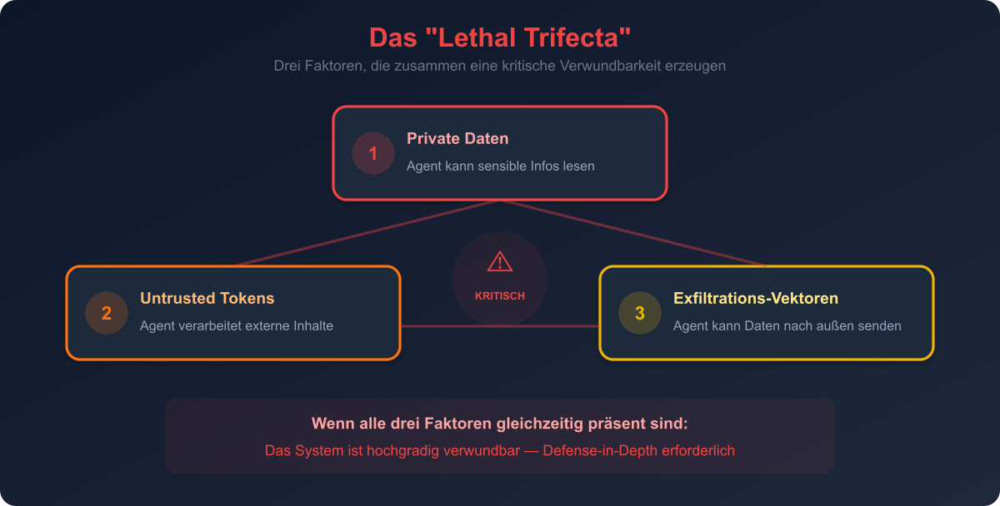
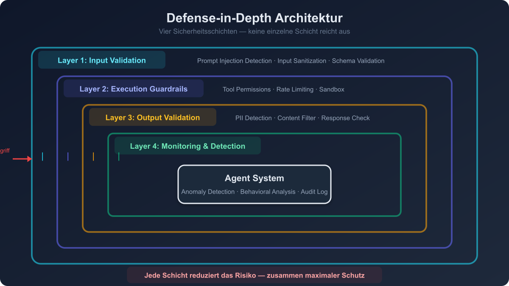
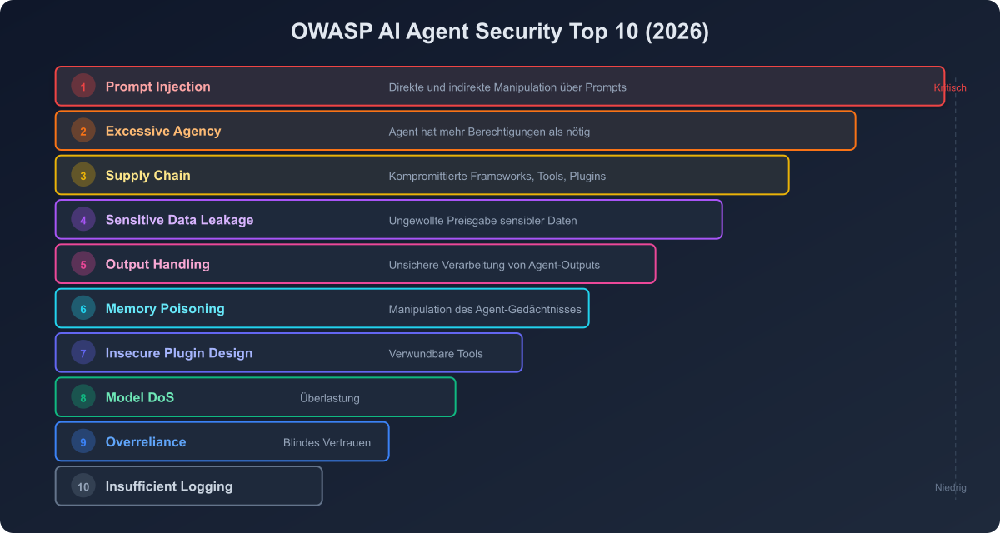

# 08 — Safety, Security und Guardrails

## Überblick

Die Absicherung von Agent-Systemen ist eine der kritischsten Herausforderungen im Agentic Engineering. Agents interagieren autonom mit externen Systemen und treffen eigenständige Entscheidungen — das erfordert mehrschichtige Sicherheitsarchitekturen.

---

## Das "Lethal Trifecta" (Airia, 2026)



Drei Faktoren, die zusammen eine kritische Verwundbarkeit erzeugen:

1. **Zugang zu privaten Daten** — Der Agent kann sensible Informationen lesen
2. **Exposition gegenüber nicht vertrauenswürdigen Tokens** — Der Agent verarbeitet externe Inhalte
3. **Exfiltrations-Vektoren** — Der Agent kann Daten nach außen senden

> Wenn alle drei Faktoren gleichzeitig präsent sind, ist das System hochgradig verwundbar.

---

## Bedrohungs-Landschaft 2026

### Indirect Prompt Injection (IPI)
- Schadhafte Anweisungen werden über externe Datenquellen eingeschleust (nicht direkt vom Nutzer)
- Höchste Erfolgsrate aller Angriffsvektoren
- Ziel: System-Prompt-Extraktion, Daten-Exfiltration, Agent-Manipulation

### Memory Poisoning
- Manipulation des Agent-Gedächtnisses (Long-term Memory)
- Einschleusen falscher Fakten oder Anweisungen in den Langzeitspeicher
- Persistente Kompromittierung über Sessions hinweg

### Supply Chain Attacks
- Manipulation von Agent-Frameworks oder MCP-Servern
- OpenClaw-Krise 2026: Erste große AI-Agent Supply Chain-Attacke
- Schadhafte Marketplace-Plugins und Tool-Definitionen

### System Prompt Extraction
- Häufigster Angriffszieltyp
- Gibt Angreifern Einblick in: Rollendefinition, Tool-Beschreibungen, Policy-Grenzen, Workflow-Logik

---

## Defense-in-Depth Architektur



```
┌──────────────────────────────────────┐
│ Layer 1: Input Validation            │
│   Prompt Injection Detection         │
│   Input Sanitization                 │
├──────────────────────────────────────┤
│ Layer 2: Execution Guardrails        │
│   Tool Permission Control            │
│   Rate Limiting                      │
│   Sandbox Execution                  │
├──────────────────────────────────────┤
│ Layer 3: Output Validation           │
│   Content Filtering                  │
│   PII Detection                      │
│   Response Verification              │
├──────────────────────────────────────┤
│ Layer 4: Monitoring & Detection      │
│   Anomaly Detection                  │
│   Behavioral Analysis                │
│   Audit Logging                      │
└──────────────────────────────────────┘
```

---

## Pattern 1: Input Guardrails

### Beschreibung
Validierung und Filterung aller Inputs, bevor sie den Agent erreichen.

### Implementierung
- **Prompt Injection Detection**: Classifier-Modell, das Injection-Versuche erkennt
- **Input Sanitization**: Bereinigung potenziell schädlicher Inhalte
- **Schema Validation**: Strukturelle Validierung von Tool-Inputs
- **Content Classification**: Erkennung von Themen außerhalb des Agent-Scopes

### Best Practices
- Dediziertes, schnelles Modell für Injection Detection (nicht der Haupt-Agent)
- Allowlisting statt Blocklisting wo möglich
- Logging aller blockierten Inputs für Analyse

---

## Pattern 2: Output Guardrails

### Beschreibung
Validierung und Filterung aller Agent-Outputs, bevor sie den Nutzer oder externe Systeme erreichen.

### Implementierung
- **PII Detection**: Erkennung personenbezogener Daten im Output
- **Content Filtering**: Blockierung unangemessener Inhalte
- **Factual Consistency Check**: Abgleich mit bekannten Fakten
- **Format Validation**: Sicherstellen, dass der Output das erwartete Format hat
- **Sensitive Data Leakage Prevention**: Verhinderung der Preisgabe interner Systeminformationen

---

## Pattern 3: Sandboxing

### Beschreibung
Agents operieren in isolierten Umgebungen mit eingeschränktem Zugriff auf das Host-System.

### Implementierung
- **Container-Isolation**: Jeder Agent läuft in einem eigenen Container
- **Dateisystem-Beschränkung**: Nur Zugriff auf definierte Verzeichnisse
- **Netzwerk-Isolation**: Nur Zugriff auf erlaubte Endpunkte
- **Ressourcen-Limits**: CPU, Memory, Disk-Grenzen
- **Zeitbeschränkung**: Maximale Ausführungszeit

### Best Practices
> "Agent Sandboxes sind essenziell — lasst Agents in ihrer eigenen isolierten Umgebung laufen, wo selbst bei totalem Versagen kein Schaden entsteht."
> — Agentic Engineering for Software Teams (2026)

---

## Pattern 4: Tool Permission Control (Least Privilege)

### Beschreibung
Granulare Kontrolle darüber, welche Tools ein Agent nutzen darf, mit welchen Parametern und in welchem Kontext.

### Implementierung
```
permissions:
  research_agent:
    allowed_tools: [web_search, fetch_url, summarize]
    denied_tools: [file_write, db_execute, send_email]
    constraints:
      web_search:
        max_queries_per_minute: 10
        allowed_domains: ["*.wikipedia.org", "*.arxiv.org"]
      fetch_url:
        max_size_mb: 5
        allowed_content_types: ["text/html", "application/json"]
```

### Prinzipien
- **Whitelist-Ansatz**: Nur explizit erlaubte Tools freigeben
- **Kontext-abhängig**: Verschiedene Permissions für verschiedene Aufgabentypen
- **Temporär**: Elevated Permissions nur für die Dauer einer spezifischen Aufgabe
- **Revocable**: Permissions können jederzeit entzogen werden

---

## Pattern 5: Rate Limiting und Cost Control

### Beschreibung
Begrenzung der Agent-Aktivität, um Kosten zu kontrollieren und Missbrauch zu verhindern.

### Implementierung
```
rate_limits:
  llm_calls_per_minute: 30
  tool_calls_per_minute: 60
  tokens_per_task: 100000
  cost_per_task_usd: 5.00
  max_iterations_per_task: 20
```

### Eskalation bei Limit-Überschreitung
1. Warning-Log bei 80% des Limits
2. Soft-Limit: Agent wird informiert, dass er sparsamer sein soll
3. Hard-Limit: Aktion wird blockiert
4. Kill-Switch: Task wird abgebrochen

---

## Pattern 6: Supply Chain Security

### Beschreibung
Absicherung der gesamten Agent-Infrastruktur gegen Supply-Chain-Angriffe.

### Maßnahmen
- **Signed Manifests** für Tool-Definitionen
- **Sandboxed Execution** für Drittanbieter-Komponenten
- **Runtime Verification**: Tool-Verhalten wird gegen deklarierte Capabilities geprüft
- **Dependency Scanning**: Regelmäßige Überprüfung aller Abhängigkeiten
- **Version Pinning**: Fixe Versionen für alle Frameworks und Tools

### Lektionen aus der OpenClaw-Krise (2026)
- MCP-Server und Marketplace-Plugins können kompromittiert werden
- Vertraue keinem externen Tool ohne Verifizierung
- Führe regelmäßige Security Audits der Agent-Infrastruktur durch

---

## Pattern 7: Behavioral Guardrails

### Beschreibung
Regeln und Constraints für das Verhalten des Agents, die über einfache Input/Output-Filterung hinausgehen.

### Implementierung
- **Constitutional Rules**: Definierte Prinzipien, gegen die der Agent sein Verhalten prüft
- **Action Budgets**: Maximale Anzahl bestimmter Aktionstypen
- **Scope Boundaries**: Agent darf nur innerhalb definierter Themen/Domains operieren
- **Escalation Triggers**: Automatische Eskalation an Menschen bei bestimmten Bedingungen
- **Confirmation Gates**: Bestimmte Aktionen erfordern explizite Bestätigung

---

## OWASP AI Agent Security Top 10 (2026)



| Rang | Risiko | Beschreibung |
|------|--------|--------------|
| 1 | Prompt Injection | Direkte und indirekte Manipulation über Prompts |
| 2 | Excessive Agency | Agent hat mehr Berechtigungen als nötig |
| 3 | Supply Chain | Kompromittierte Frameworks, Tools, Plugins |
| 4 | Sensitive Data Leakage | Ungewollte Preisgabe sensibler Daten |
| 5 | Output Handling | Unsichere Verarbeitung von Agent-Outputs |
| 6 | Memory Poisoning | Manipulation des Agent-Gedächtnisses |
| 7 | Insecure Plugin Design | Verwundbare Tool-/Plugin-Implementierungen |
| 8 | Model Denial of Service | Überlastung durch teure Operationen |
| 9 | Overreliance | Blindes Vertrauen in Agent-Outputs |
| 10 | Insufficient Logging | Fehlende Audit-Trails und Monitoring |
