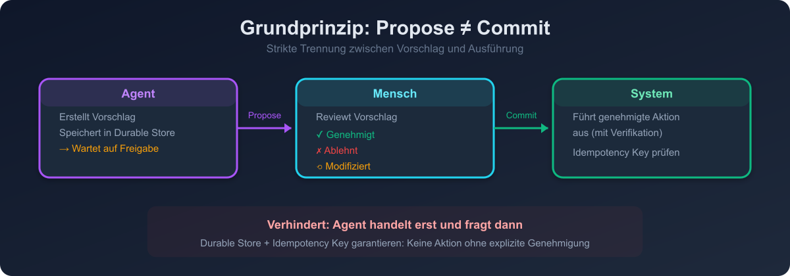
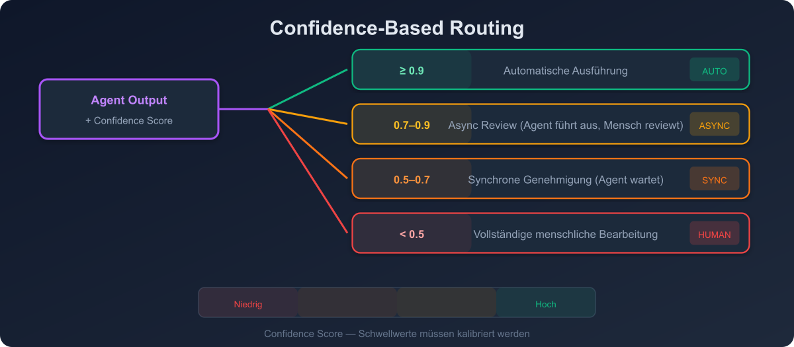
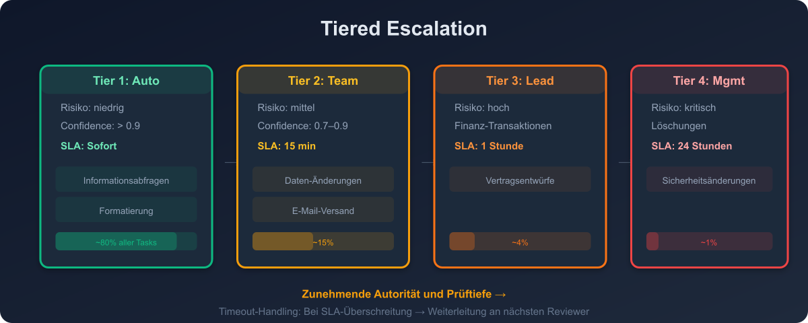

# 09 — Human-in-the-Loop Patterns

## Überblick

Human-in-the-Loop (HITL) ist ein AI-Governance-Ansatz, bei dem trainierte Menschen Entscheidungsgewalt über risikoreiche Agent-Aktionen behalten. HITL ist kein Notbehelf, sondern ein bewusstes Architektur-Pattern für sichere und skalierbare Agent-Systeme.

> "A qualified person with timely context, authority to intervene, and defensible rationale — embedded at critical decision points."
> — Strata.io, Human-in-the-Loop Guide (2026)

---

## Grundprinzip: Propose ≠ Commit



Die zuverlässigste Grundregel für HITL: **Strikte Trennung zwischen Vorschlag und Ausführung.**

```
Agent: Erstellt strukturierten Aktions-Vorschlag
       → Speichert in Durable Store (mit Idempotency Key)
       → Wartet auf Freigabe

Mensch: Reviewt Vorschlag
       → Genehmigt / Ablehnt / Modifiziert

System: Führt genehmigte Aktion aus (mit Verifikation)
```

Dies verhindert, dass der Agent "erst handelt und dann fragt".

---

## Pattern 1: Confidence-Based Routing



### Beschreibung
Der Agent bewertet seine eigene Konfidenz. Aufgaben mit hoher Konfidenz werden automatisch verarbeitet, Aufgaben mit niedriger Konfidenz an Menschen eskaliert.

### Architektur
```
Agent Output + Confidence Score
│
├── Score ≥ 0.9 → Automatische Ausführung
├── Score 0.7-0.9 → Async Review (Agent führt aus, Mensch reviewt)
├── Score 0.5-0.7 → Synchrone Genehmigung (Agent wartet)
└── Score < 0.5 → Vollständige menschliche Bearbeitung
```

### Implementierungsdetails
- Confidence Score kann vom LLM selbst geschätzt werden
- Besser: Externer Classifier für Konfidenz-Einschätzung
- Schwellwerte müssen kalibriert werden (basierend auf Feedback-Daten)
- Regelmäßige Überprüfung der Schwellwerte

### Wann einsetzen
- Wenn die Automatisierung schnell sein soll, aber riskante Entscheidungen abgesichert werden müssen
- Wenn das Volumen zu hoch für vollständiges menschliches Review ist

---

## Pattern 2: Tiered Escalation



### Beschreibung
Aktionen werden basierend auf Risiko-Klassifikation und Confidence Scores an progressiv höhere Autoritätslevel eskaliert.

### Implementierung
```
Tier 1: Auto-Approve
  Bedingung: Risiko = niedrig UND Confidence > 0.9
  SLA: Sofort
  Beispiel: Informations-Abfragen, Formatierung

Tier 2: Team-Member Review
  Bedingung: Risiko = mittel ODER Confidence 0.7-0.9
  SLA: 15 Minuten
  Beispiel: Daten-Änderungen, E-Mail-Versand

Tier 3: Team-Lead Review
  Bedingung: Risiko = hoch
  SLA: 1 Stunde
  Beispiel: Finanzielle Transaktionen, Vertragsentwürfe

Tier 4: Management Approval
  Bedingung: Risiko = kritisch
  SLA: 24 Stunden
  Beispiel: Löschungen, Sicherheitsänderungen
```

### Timeout-Handling
- Wenn kein Reviewer innerhalb des SLA reagiert → Weiterleitung an nächsten verfügbaren Reviewer
- Eskalationspfade definieren, damit nichts "durchfällt"
- Fallback: Aufgabe zurück an den Nutzer mit Erklärung

---

## Pattern 3: Pre-Approval Gating

### Beschreibung
Bestimmte Aktions-Kategorien erfordern *immer* eine vorherige Genehmigung, unabhängig von Confidence Scores.

### Implementierung
```
always_require_approval:
  - financial_transactions > $100
  - data_deletion
  - external_communication (E-Mail, Slack, API)
  - permission_changes
  - infrastructure_modifications
  - code_deployment
```

### Best Practices
- Gate-Definitionen als Konfiguration, nicht hardcoded
- Approval-Log mit Zeitstempel, Approver, Begründung
- Idempotency Keys für genehmigte Aktionen
- Genehmigte Aktionen haben ein Ablaufdatum

---

## Pattern 4: Review-After-Action (Async Audit)

### Beschreibung
Der Agent führt die Aktion aus, ein Mensch reviewt nachträglich. Geeignet für niedrig-riskante, hochvolumige Operationen.

### Architektur
```
Agent → Aktion ausführen → Log erstellen → Review-Queue
                                              ↓
                                    Mensch reviewt stichprobenartig
                                              ↓
                                    Feedback → Agent-Verbesserung
```

### Wann einsetzen
- Hohes Volumen, niedriges Risiko pro Einzelaktion
- Wenn Latenz kritisch ist und synchrones Approval zu langsam wäre
- Als Ergänzung zu automatisiertem Quality Monitoring

---

## Pattern 5: Collaborative Editing

### Beschreibung
Agent und Mensch arbeiten gleichzeitig am selben Artefakt. Der Agent schlägt Änderungen vor, der Mensch akzeptiert, modifiziert oder verwirft sie.

### Beispiel: Code Review
```
Agent: Erstellt Pull Request mit Änderungen
Mensch: Reviewt, kommentiert, fordert Änderungen an
Agent: Überarbeitet basierend auf Review-Kommentaren
Mensch: Genehmigt und merged
```

### Beispiel: Dokument-Erstellung
```
Agent: Erstellt Entwurf
Mensch: Markiert Abschnitte mit Kommentaren
Agent: Überarbeitet markierte Abschnitte
Mensch: Finalisiert
```

---

## Anti-Patterns vermeiden

### 1. Automation Complacency
**Problem**: Menschen vertrauen dem Agent blind und rationalisieren Anomalien weg.
**Gegenmaßnahme**: Regelmäßig bewusste "Challenge"-Phasen einbauen, bei denen der Mensch den Agent-Output aktiv hinterfragt.

### 2. Unpracticed Teamwork
**Problem**: Handoffs zwischen Agent und Mensch werden nachlässig, Eskalationspfade unklar.
**Gegenmaßnahme**: Eskalations-Prozesse dokumentieren, regelmäßig üben, Metriken erheben.

### 3. Alert Fatigue
**Problem**: Zu viele Approval-Anfragen führen zu oberflächlichem Rubber-Stamping.
**Gegenmaßnahme**: Schwellwerte so kalibrieren, dass nur wirklich relevante Fälle eskaliert werden.

### 4. Missing Context
**Problem**: Der Reviewer erhält den Approval-Request ohne ausreichend Kontext, um eine fundierte Entscheidung zu treffen.
**Gegenmaßnahme**: Approval-Requests müssen alle relevanten Informationen enthalten: Was will der Agent tun? Warum? Was sind die Risiken?

---

## Metriken für HITL-Systeme

| Metrik | Beschreibung | Zielwert |
|--------|-------------|----------|
| Approval Latency | Zeit bis zur menschlichen Entscheidung | < SLA |
| Override Rate | Wie oft wird der Agent-Vorschlag geändert | < 20% |
| False Escalation Rate | Unnötige Eskalationen | < 10% |
| Missed Escalation Rate | Fehlende notwendige Eskalationen | 0% |
| Reviewer Satisfaction | Zufriedenheit der Reviewer | > 4/5 |
