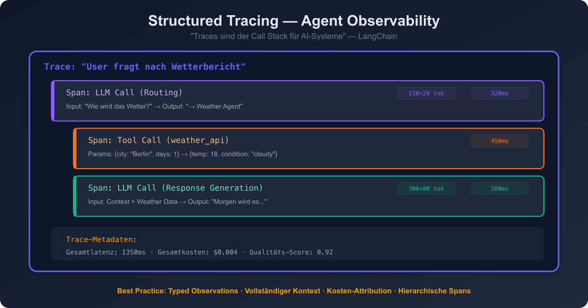
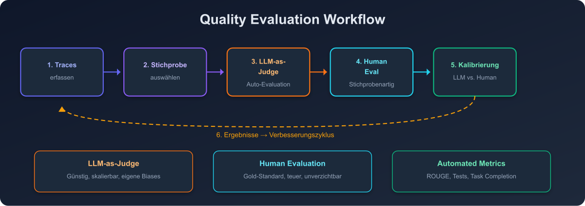

# 10 — Observability und Evaluation

## Überblick

AI-Agent-Observability unterscheidet sich fundamental von traditionellem Software-Monitoring. Agents operieren nicht-deterministisch mit mehrstufigen Reasoning-Ketten, die LLM-Calls, Tool-Nutzung, Retrieval-Systeme und komplexe Entscheidungsbäume umfassen.

> "Traces serve as the 'call stack' for AI systems — they show how and why something happened."
> — LangChain, Agent Observability (2026)

---

## Grundlagen: Warum Agent-Observability anders ist

| Aspekt | Traditionelles Monitoring | Agent-Observability |
|--------|--------------------------|-------------------|
| Verhalten | Deterministisch | Nicht-deterministisch |
| Fehler | Reproduzierbar | Schwer reproduzierbar |
| Call Stack | Klar definiert | Dynamisch, verzweigt |
| Metriken | Latenz, Errors, Throughput | + Token, Kosten, Qualität, Reasoning |
| Root Cause | Stack Trace reicht | Vollständiger Decision Trail nötig |

---

## Pattern 1: Structured Tracing



### Beschreibung
Jede Agent-Interaktion wird als vollständiger Trace erfasst, der den kompletten Entscheidungspfad rekonstruiert: LLM-Calls, Tool-Aufrufe, Retrieval-Schritte und Zwischenentscheidungen.

### Implementierung
```
Trace: "User fragt nach Wetterbericht"
├── Span: LLM Call (Routing)
│   ├── Input: "Wie wird das Wetter morgen?"
│   ├── Output: "→ Weather Agent"
│   ├── Tokens: 150 in, 20 out
│   └── Latenz: 320ms
├── Span: Tool Call (weather_api)
│   ├── Parameters: {city: "Berlin", days: 1}
│   ├── Response: {temp: 18, condition: "cloudy"}
│   └── Latenz: 450ms
├── Span: LLM Call (Response Generation)
│   ├── Input: Context + Weather Data
│   ├── Output: "Morgen wird es..."
│   ├── Tokens: 300 in, 80 out
│   └── Latenz: 580ms
└── Trace-Metadaten:
    ├── Gesamtlatenz: 1350ms
    ├── Gesamtkosten: $0.004
    └── Qualitäts-Score: 0.92
```

### Best Practices
- **Typed Observations**: Jede Observation mit semantischem Typ versehen (tool_call, retriever_step, guardrail_check)
- **Vollständiger Kontext**: Inputs UND Outputs jedes Schritts erfassen
- **Kosten-Attribution**: Pro-Trace-Kosten berechnen
- **Hierarchische Spans**: Verschachtelte Spans für Sub-Agent-Calls

---

## Pattern 2: OpenTelemetry für Agents

### Beschreibung
OpenTelemetry (OTEL) hat sich als Standard für Agent-Telemetrie etabliert. Es verhindert Vendor Lock-in und ermöglicht Interoperabilität.

### Integration
- **Traces**: Distributed Tracing über Agent-Ketten
- **Metrics**: Token-Verbrauch, Latenz, Kosten, Fehlerrate
- **Logs**: Structured Logging mit Trace-Kontext

### Vorteile
- Vendor-unabhängig
- Breite Ökosystem-Unterstützung
- Standard-Exporteure für alle gängigen Observability-Plattformen
- Wachsende AI-spezifische Semantic Conventions

---

## Pattern 3: Quality Evaluation



### Beschreibung
Systematische Bewertung der Agent-Output-Qualität durch automatisierte und menschliche Evaluation.

### Evaluations-Ansätze

#### LLM-as-Judge
- Ein (anderes) LLM bewertet die Qualität des Agent-Outputs
- Kriterien: Korrektheit, Vollständigkeit, Relevanz, Tonalität
- Günstig und skalierbar, aber mit eigenen Biases

#### Human Evaluation
- Menschliche Bewerter beurteilen Agent-Outputs
- Gold-Standard für Qualitätsbewertung
- Teuer, aber unverzichtbar für Kalibrierung

#### Automated Metrics
- ROUGE, BLEU für Textqualität
- Code-Execution-Tests für Code-Generierung
- Factual Accuracy durch Knowledge-Base-Abgleich
- Task Completion Rate

### Evaluation-Workflow
```
1. Production Traces erfassen
2. Repräsentative Stichprobe auswählen
3. Automatisierte Evaluation durchführen (LLM-as-Judge)
4. Stichprobenartig menschliche Evaluation
5. Kalibrierung: LLM-Judge gegen menschliche Urteile abgleichen
6. Ergebnisse in Verbesserungs-Zyklus einspeisen
```

---

## Pattern 4: A/B Testing für Agents

### Beschreibung
Verschiedene Agent-Konfigurationen (Prompts, Modelle, Tools) parallel testen und die bessere Variante identifizieren.

### Implementierung
- **Traffic Splitting**: Zufällige Zuweisung zu Varianten
- **Metriken**: Qualitäts-Score, Latenz, Kosten, User Satisfaction
- **Statistische Signifikanz**: Ausreichend große Stichproben
- **Rollback**: Schneller Wechsel zurück bei negativen Ergebnissen

---

## Pattern 5: Regression Testing

### Beschreibung
Automatisierte Tests, die sicherstellen, dass Agent-Änderungen keine bestehende Qualität verschlechtern.

### Implementierung
```
Test Suite:
├── Golden Dataset: 200 Frage-Antwort-Paare
├── Edge Cases: 50 bekannte schwierige Fälle
├── Regression Cases: Alle bisherigen Bugs als Tests
└── Performance Benchmarks: Latenz- und Kosten-Grenzen

CI/CD Pipeline:
1. Neue Agent-Konfiguration deployen (Staging)
2. Golden Dataset durchlaufen
3. Metriken berechnen und mit Baseline vergleichen
4. Bei Regression: Deployment blockieren
5. Bei Verbesserung: Zur Produktion freigeben
```

---

## Pattern 6: Cost Monitoring und Optimization

### Beschreibung
Echtzeitüberwachung und Optimierung der Agent-Kosten.

### Metriken
```
cost_monitoring:
  per_trace_cost: true          # Kosten pro Trace
  per_user_cost: true           # Kosten pro Nutzer
  per_feature_cost: true        # Kosten pro Feature
  daily_budget: $500            # Tagesbudget
  alert_threshold: 80%          # Alert bei 80% des Budgets
  anomaly_detection: true       # Ungewöhnliche Kosten-Spikes
```

### Optimierungs-Strategien
- **Model Routing**: Günstigeres Modell für einfache Aufgaben
- **Token Caching**: KV-Cache und Prompt Caching nutzen
- **Context Compression**: Nur relevante Informationen im Kontext
- **Early Stopping**: Aufhören, wenn das Ergebnis gut genug ist
- **Batch Processing**: Ähnliche Anfragen bündeln

---

## Leading Observability-Plattformen (2026)

| Plattform | Stärke | Besonderheit |
|-----------|--------|-------------|
| **Langfuse** | Open Source, umfassend | Self-hosted möglich, breite Integration |
| **LangSmith** | LangChain-Ökosystem | Tiefe LangGraph-Integration |
| **Braintrust** | Evaluation-fokussiert | Starke Eval-Pipeline |
| **Maxim AI** | Enterprise | Compliance-Features |
| **OpenTelemetry** | Standard | Framework-agnostisch |

---

## Empfehlungen für Architekten

1. **Observability von Tag 1**: Nicht nachträglich hinzufügen
2. **OpenTelemetry als Basis**: Vendor Lock-in vermeiden
3. **Kosten immer tracken**: Per-Trace-Kostenattribution von Anfang an
4. **Golden Dataset aufbauen**: Regelmäßig aus Produktions-Traces kuratieren
5. **LLM-as-Judge + Human Eval**: Beides kombinieren, nicht nur eines
6. **Alerting klug konfigurieren**: Nur relevante Alerts, keine Alert Fatigue
