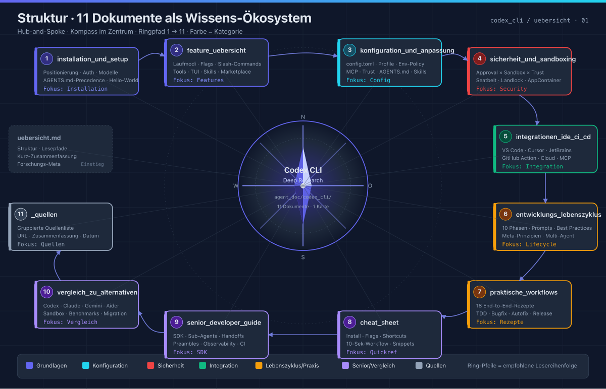
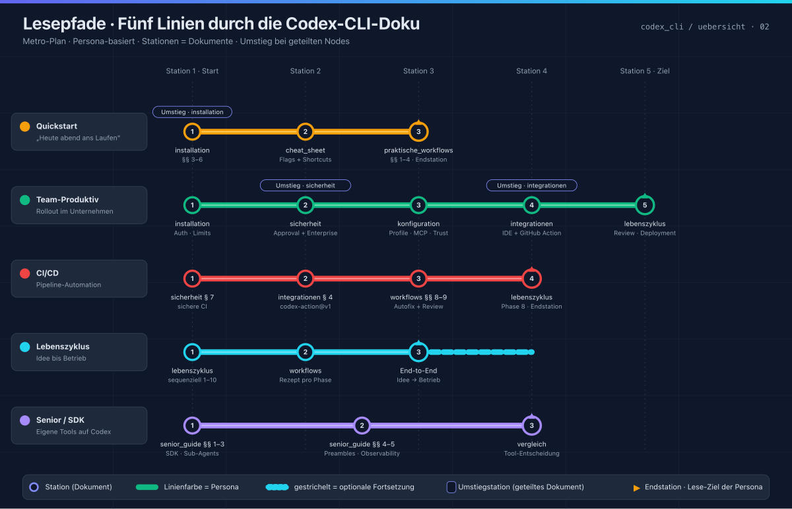
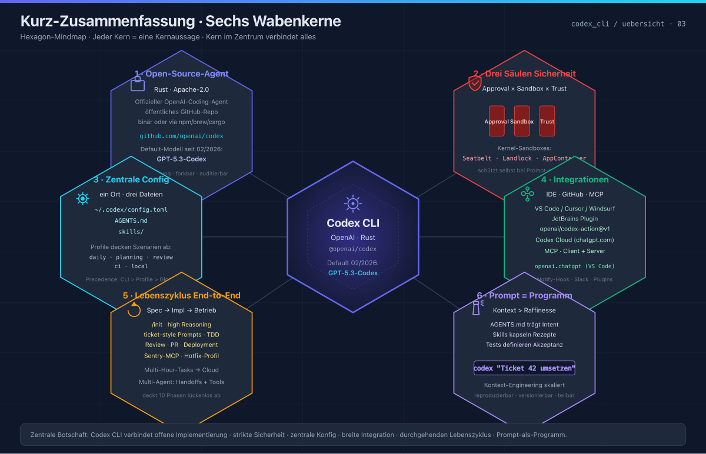
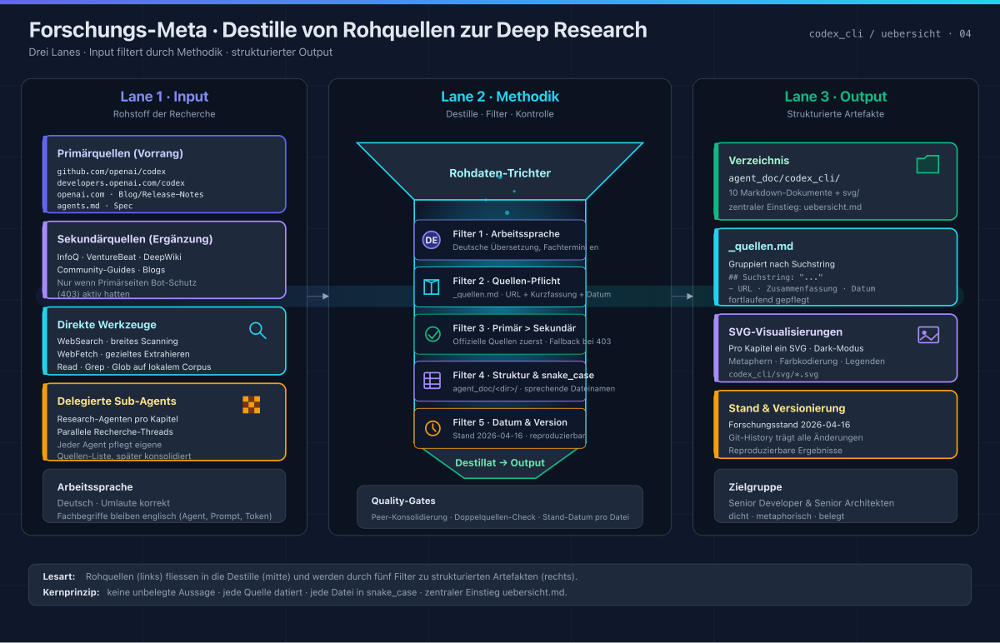

# Codex CLI — Deep Research Übersicht

> Stand: 2026-04-16 · Forschungsverzeichnis: `agent_doc/codex_cli/`

Diese Sammlung dokumentiert **OpenAI Codex CLI** (`@openai/codex`, Open-Source-Rust-Agent, Apache-2.0) — was sie kann, wie man sie einsetzt und wie man damit den kompletten Softwareentwicklungs-Lebenszyklus abbildet.

## Struktur

| # | Datei | Inhalt |
|---|---|---|
| 1 | [installation_und_setup](CDX-01-Installation-und-Setup) | Positionierung, Historie, Installation (npm/brew/cargo), Auth (ChatGPT/API-Key/Provider), Modelle, `~/.codex/`-Layout, AGENTS.md-Precedence, Hello-World. |
| 2 | [feature_uebersicht](CDX-02-Feature-Uebersicht) | Komplette Feature-Liste: Laufmodi, Eingabe, Slash-Commands, Flags, Kontext-Management, Custom Prompts/Skills/Marketplace, Tools, Modelle/Reasoning, TUI, IDE, MCP, GitHub, Notify, Provider, Kosten. |
| 3 | [konfiguration_und_anpassung](CDX-03-Konfiguration-und-Anpassung) | `config.toml`-Referenz: Precedence, Top-Level-Keys, Profile, Model-Providers, MCP, Sandbox, Shell-Env-Policy, Tools, Notify, History, TUI, Trust, Env-Vars, AGENTS.md, Skills, Logging, Sample-Config. |
| 4 | [sicherheit_und_sandboxing](CDX-04-Sicherheit-und-Sandboxing) | Approval × Sandbox-Matrix, Kernel-Mechanismen (Seatbelt/Landlock/bwrap/AppContainer), Trust, Secrets/ZDR, Prompt-Injection, Enterprise-Governance, sicheres GitHub-Actions-Template, Risiko-Checkliste. |
| 5 | [integrationen_ide_ci_cd](CDX-05-Integrationen-IDE-CI-CD) | IDE-Extensions (VS Code/Cursor/Windsurf/JetBrains), Terminal-Ökosystem, Codex Cloud, GitHub Action v1 (Autofix + Review-Patterns), andere CI/CD-Systeme, MCP-Client/Server, Notify-Hook, Plugins, Muster-Setup. |
| 6 | [entwicklungs_lebenszyklus](CDX-06-Entwicklungs-Lebenszyklus) | 10 Phasen von der Idee bis zum Betrieb mit Prompts, Best Practices und Anti-Patterns. 10 Meta-Prinzipien, Multi-Agent-Muster, Greenfield-Skizze. |
| 7 | [praktische_workflows](CDX-07-Praktische-Workflows) | 18 End-to-End-Rezepte (TDD, Bug-Repro, Security-Review, Dependency-Upgrade, Autofix-Bot, PR-Review-Action, Slack-Notifier, Cloud-Refactor, Rename, Release-Skill, Hotfix, Doc-Sync, Cost-Control, OSS-Modelle). |
| 8 | [cheat_sheet](CDX-10-Cheat-Sheet) | Kompakt-Referenz: Install, Start-Befehle, Flags, Slash-Commands, Shortcuts, `config.toml`-Snippet, AGENTS.md-Skelett, Notify-Payload, GitHub-Action-Minimal, Pfade, 10-Sek-Workflow. |
| 9 | [senior_developer_guide](CDX-08-Senior-Developer-Guide) | Codex SDK (TypeScript: startThread/runStreamed/outputSchema), Sub-Agents, OpenAI Agents SDK (Handoffs, Tools), Advanced Prompting (Preambles, Phase-Parameter), Observability, fortgeschrittene CI-Patterns, Enterprise-Betrieb, Anti-Patterns, Senior-Ready-Checkliste. |
| 10 | [vergleich_zu_alternativen](CDX-09-Vergleich-zu-Alternativen) | Positionierungs-Matrix Codex / Claude Code / Gemini CLI / Aider / Copilot CLI. Sandbox-, Kontext- und Benchmark-Vergleich, Ökosystem, Entscheidungs-Flowchart, Hybrid- und Migrationspfade. |
| 11 | [_quellen](CDX-Quellen) | Gruppierte Quellenliste aller verwendeten Web-Recherchen, versioniert mit Datum. |

## Lesepfade

### "Ich will Codex heute abend zum Laufen bringen"

1. [installation_und_setup](CDX-01-Installation-und-Setup) §§ 3–6
2. [cheat_sheet](CDX-10-Cheat-Sheet)
3. [praktische_workflows](CDX-07-Praktische-Workflows) §§ 1–4

### "Ich will Codex in unserem Team produktiv einsetzen"

1. [installation_und_setup](CDX-01-Installation-und-Setup) (Authentifizierung, Rate Limits)
2. [sicherheit_und_sandboxing](CDX-04-Sicherheit-und-Sandboxing) (Approval-Matrix + Enterprise)
3. [konfiguration_und_anpassung](CDX-03-Konfiguration-und-Anpassung) §§ 3, 5, 11 (Profile, MCP, Trust)
4. [integrationen_ide_ci_cd](CDX-05-Integrationen-IDE-CI-CD) (IDE + GitHub Action)
5. [entwicklungs_lebenszyklus](CDX-06-Entwicklungs-Lebenszyklus) (Phase 6 Review, Phase 8 Deployment)

### "Ich will Codex in CI/CD nutzen"

1. [sicherheit_und_sandboxing](CDX-04-Sicherheit-und-Sandboxing) § 7 (sichere CI)
2. [integrationen_ide_ci_cd](CDX-05-Integrationen-IDE-CI-CD) § 4 (openai/codex-action@v1)
3. [praktische_workflows](CDX-07-Praktische-Workflows) §§ 8–9 (Autofix + Review)
4. [entwicklungs_lebenszyklus](CDX-06-Entwicklungs-Lebenszyklus) Phase 8

### "Ich will den kompletten Lebenszyklus abbilden"

→ [entwicklungs_lebenszyklus](CDX-06-Entwicklungs-Lebenszyklus) sequenziell, dann passende Rezepte aus [praktische_workflows](CDX-07-Praktische-Workflows) pro Phase.

### "Ich baue Codex in eigene Tools ein / bin Senior"

1. [senior_developer_guide](CDX-08-Senior-Developer-Guide) §§ 1–3 (SDK, Sub-Agents, Agents SDK)
2. [senior_developer_guide](CDX-08-Senior-Developer-Guide) §§ 4–5 (Preambles, Phase, Observability)
3. [vergleich_zu_alternativen](CDX-09-Vergleich-zu-Alternativen) für Tool-Entscheidung im Team

## Kurz-Zusammenfassung

- **Codex CLI** ist OpenAIs offener Coding-Agent (Rust, Apache-2.0). Default-Modell seit 02/2026: **GPT-5.3-Codex**.
- **Sicherheit** ruht auf drei Säulen: **Approval-Policy × Sandbox-Mode × Workspace-Trust**. Kernel-Sandboxes (Seatbelt/Landlock/AppContainer) schützen selbst bei Prompt-Injection.
- **Konfiguration** zentral in `~/.codex/config.toml` + `AGENTS.md` + `skills/` im Repo. Profile decken Szenarien ab (daily, planning, review, ci, local).
- **Integrationen**: VS Code/Cursor/Windsurf-Extension (`openai.chatgpt`), GitHub Action (`openai/codex-action@v1`), Codex Cloud (chatgpt.com/codex), MCP als Client & Server.
- **Lebenszyklus**: Codex trägt die gesamte Kette von Spec (`/init`, high Reasoning) über Implementation (ticket-style Prompts, TDD) bis Betrieb (Sentry-MCP, Hotfix-Profil). Multi-Hour-Tasks gehören in die Cloud.
- **Prinzip**: *Prompt = Programm.* Kontext-Engineering (AGENTS.md + Skills + Tests) skaliert besser als Prompt-Raffinesse.

## Forschungs-Meta

- **Arbeitssprache**: Deutsch, Fachbegriffe englisch.
- **Quellen**: [_quellen](CDX-Quellen), gruppiert nach Suchstring, jede Quelle mit URL, Zusammenfassung und Datum (2026-04-16).
- **Methodik**: Kombination aus delegierten Research-Subagenten und direkter WebSearch/WebFetch. Primärquellen (github.com/openai/codex, developers.openai.com/codex, openai.com Blog, agents.md) hatten Vorrang; Sekundärquellen (InfoQ, VentureBeat, deepwiki, Community-Guides) ergänzten Stellen, an denen die offiziellen Seiten Bot-Schutz (403) aktiv hatten.
