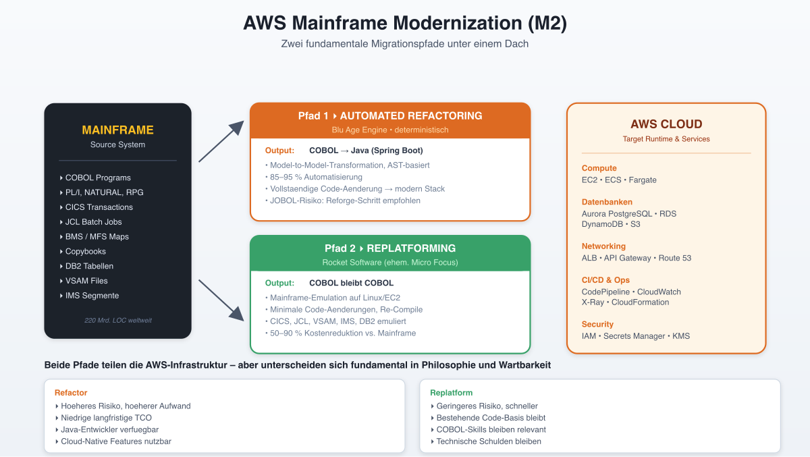
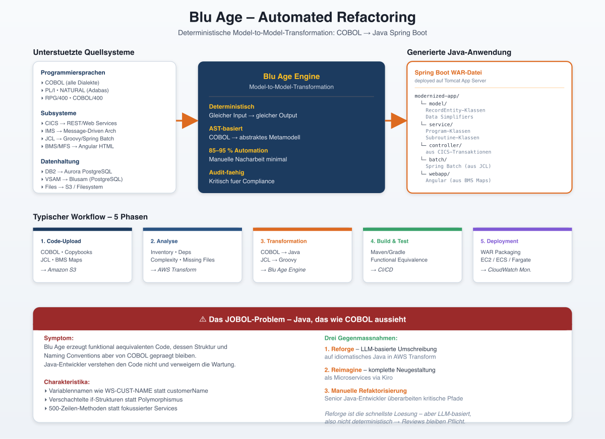
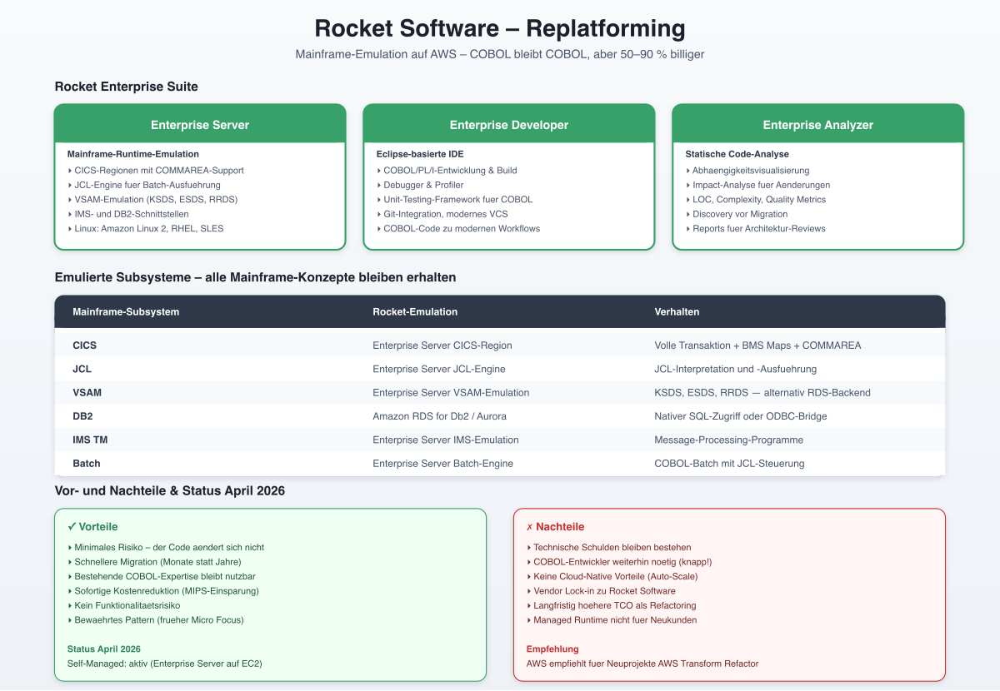
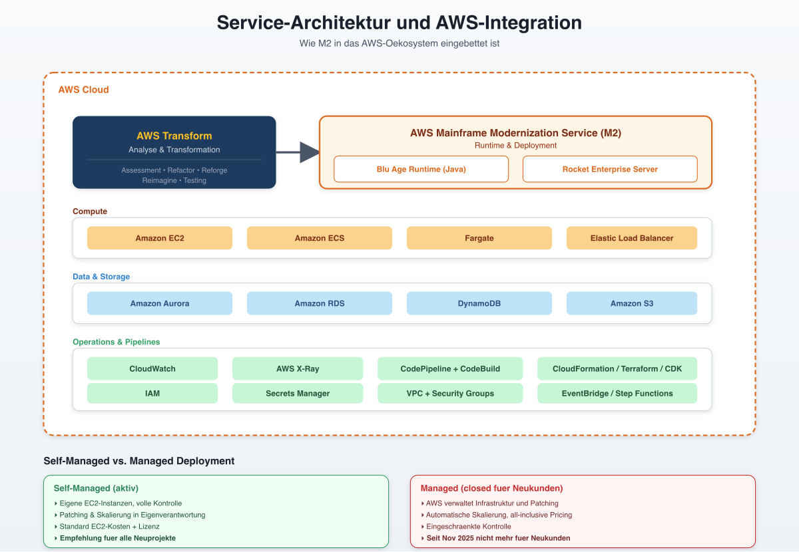
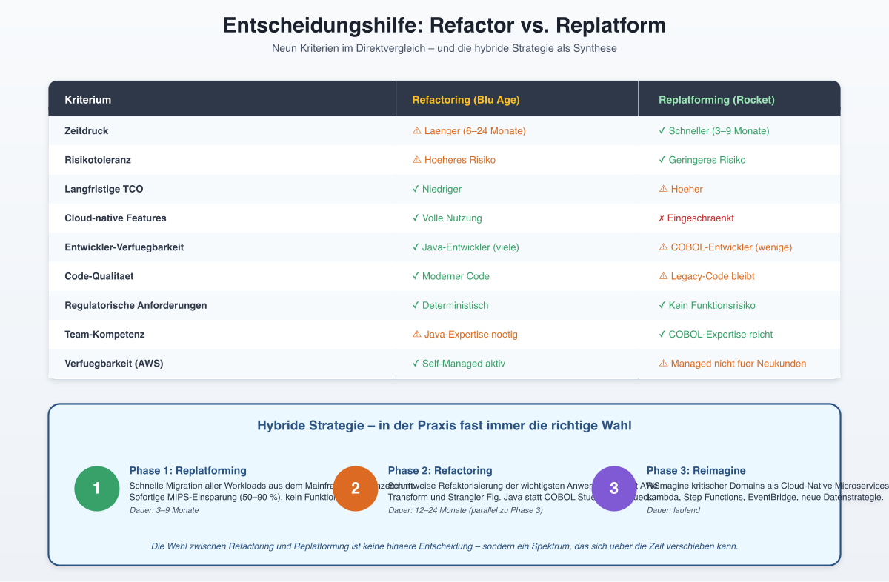
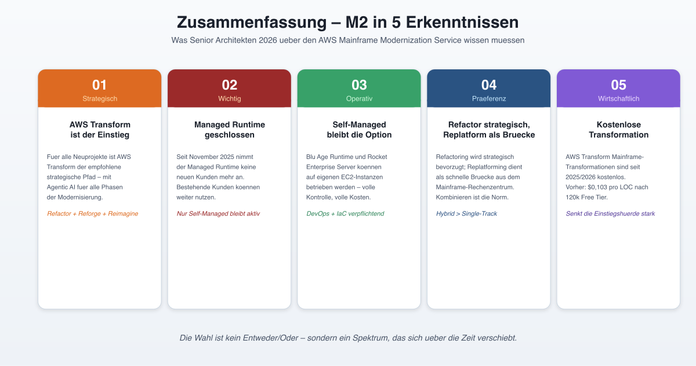

# AWS Mainframe Modernization Service -- Deep Dive

> Stand: April 2026 | Zielgruppe: Senior Developer & Senior Architekten

---

## 1. Überblick



Der **AWS Mainframe Modernization Service** (intern: M2) ist der zentrale, verwaltete Service von Amazon Web Services für die Migration von Mainframe-Workloads in die Cloud. Er bietet zwei grundlegend verschiedene Migrationspfade:

| Pfad | Technologie | Ansatz | Code-Änderungen |
|------|------------|--------|-----------------|
| **Automated Refactoring** | Blu Age | COBOL → Java (Spring Boot) | Vollständige Transformation |
| **Replatforming** | Rocket Software (ehem. Micro Focus) | COBOL bleibt COBOL | Minimale Änderungen |

Beide Pfade teilen sich eine gemeinsame Infrastrukturebene auf AWS, unterscheiden sich aber fundamental in Philosophie, Zielarchitektur und langfristiger Wartbarkeit.

---

## 2. Blu Age -- Automated Refactoring



### 2.1 Funktionsprinzip

Blu Age ist eine **regelbasierte Transformation Engine**, die COBOL-Programme automatisch in Java-Anwendungen konvertiert. Der Prozess basiert auf **Model-to-Model-Transformationen** -- der COBOL-Code wird zunächst in ein abstraktes Zwischenmodell (AST/Metamodell) überführt und dann in Java-Code generiert.

**Wichtiger Unterschied zu KI-basierter Übersetzung:** Blu Age arbeitet **deterministisch**. Gleicher Input erzeugt immer gleichen Output. Dies ist für die Validierung und regulatorische Compliance entscheidend.

### 2.2 Unterstützte Quellsysteme

Blu Age unterstützt eine breite Palette von Mainframe-Technologien:

**Programmiersprachen:**
- COBOL (alle gängigen Dialekte: IBM Enterprise COBOL, COBOL/400, Tandem, OpenVMS)
- PL/I
- NATURAL (Adabas)
- RPG/400
- Generiertes COBOL (aus 4GL-Tools)

**Subsysteme und Middleware:**
- **CICS** (Customer Information Control System) → Web Services / REST APIs
- **IMS** (Information Management System) → Message-Driven Architecture
- **Batch/JCL** (Job Control Language) → Groovy-Skripte / Spring Batch
- **BMS/MFS Maps** (Bildschirmmasken) → Angular/HTML + JavaScript

**Datenhaltung:**
- **DB2** → Amazon Aurora PostgreSQL / Amazon RDS
- **VSAM** (Virtual Storage Access Method) → Blusam (PostgreSQL-basiert)
- **Sequentielle Dateien** → S3 / Dateisystem
- **IMS DB** → Relationale Datenbanken

### 2.3 Architektur des generierten Java-Codes

Eine modernisierte Blu Age-Anwendung ist eine **Java Spring Boot-Applikation**, die als **WAR-Datei** paketiert und auf einem Tomcat Application Server deployed wird.

#### Projektstruktur

```
modernized-app/
├── model/          # Datenstrukturen (aus COBOL Copybooks)
│   ├── RecordEntity-Klassen
│   └── Data Simplifiers
├── service/        # Business-Logik (aus COBOL Paragraphs/Sections)
│   ├── Program-Klassen
│   └── Subroutine-Klassen
├── controller/     # Eintrittspunkte (aus CICS-Transaktionen)
├── batch/          # Batch-Jobs (aus JCL)
└── webapp/         # Frontend (aus BMS Maps → Angular)
```

#### Schlüsselkonzepte der Code-Generierung

**Record Interface und RecordEntity:**
Jede COBOL 01-Level-Datenstruktur wird zu einer Java-Klasse im `model`-Package. Das **Record Interface** abstrahiert ein Byte-Array fester Größe mit typisierten Gettern und Settern. Dies bildet die COBOL-Speichersemantik ab, insbesondere:

- **REDEFINES**: Mehrere RecordEntity-Subklassen greifen auf denselben Speicherbereich zu
- **PIC-Klauseln**: Werden durch typisierte Getter/Setter mit automatischer Konvertierung abgebildet
- **COMP-3 (Packed Decimal)**: Wird durch BigDecimal-basierte Zugriffsmethoden unterstützt

**Data Simplifiers:**
Für den Übergang zu idiomatischem Java stellt Blu Age sog. Data Simplifiers bereit, die den Zugriff auf Record-Felder über Java-konforme APIs ermöglichen.

**Programm-Klassen:**
Jedes COBOL-Programm wird zu einer Java-Klasse mit einer `run()`-Methode als Eintrittspunkt. PERFORM-Anweisungen werden zu Methodenaufrufen, SECTIONs und PARAGRAPHs zu privaten Methoden.

### 2.4 Typischer Workflow

```
Phase 1: Code-Upload
    └─ COBOL-Quellcode, Copybooks, JCL, BMS Maps → Amazon S3

Phase 2: Analyse (AWS Transform / Blu Insights)
    ├─ Automatische Kategorisierung aller Artefakte
    ├─ Abhängigkeitsanalyse (Dependency Graph)
    ├─ Cyclomatic Complexity & LOC-Metriken
    └─ Identifikation fehlender Artefakte

Phase 3: Transformation (Blu Age Engine)
    ├─ COBOL → Java (Spring Boot)
    ├─ JCL → Groovy
    ├─ BMS → Angular/HTML
    ├─ VSAM → Blusam (PostgreSQL)
    └─ DB2 SQL → PostgreSQL SQL

Phase 4: Build & Test
    ├─ Maven/Gradle Build
    ├─ Unit Tests
    ├─ Functional Equivalence Testing
    └─ Performance-Benchmarking

Phase 5: Deployment
    ├─ WAR-Paketierung
    ├─ Deployment auf EC2 / ECS / Fargate
    └─ CloudWatch Monitoring
```

### 2.5 Rolle von Copybooks, JCL und CICS Maps

**COBOL Copybooks:**
Copybooks sind die „Header-Dateien" von COBOL -- sie definieren gemeinsam genutzte Datenstrukturen. Bei der Migration werden sie zu Java-Model-Klassen transformiert. **Kritisch**: Fehlende Copybooks führen zu unvollständiger Transformation. AWS Transform erkennt fehlende Artefakte automatisch.

**JCL (Job Control Language):**
JCL definiert Batch-Abläufe, Datei-Zuweisungen und Job-Abhängigkeiten. Die Transformation erzeugt:
- **Groovy-Skripte** für die Job-Steuerung
- **Spring Batch-Konfigurationen** für die Ausführungslogik
- **Scheduler-Integration** für zeitgesteuerte Abläufe

**CICS Maps (BMS):**
BMS-Definitionen (Basic Mapping Support) beschreiben die Bildschirmmasken von CICS-Transaktionen. Sie werden zu:
- **Angular-Komponenten** (Frontend)
- **HTML/Sass Templates**
- **REST API-Endpoints** (Backend-Controller)

### 2.6 Automatisierungsgrad und JOBOL-Problem

Blu Age automatisiert **85-95 % der Transformation**. Der generierte Code ist funktional äquivalent, aber strukturell noch COBOL-beeinflusst -- das sogenannte **JOBOL-Problem** (Java-Code, der wie COBOL aussieht).

**Gegenmaßnahmen:**
1. **Reforge** (AWS Transform): LLM-basierte Umschreibung zu idiomatischem Java
2. **Reimagine** (AWS Transform): Komplette Neugestaltung als Microservices
3. **Manuelle Refaktorisierung**: Nachbearbeitung durch Java-Entwickler

### 2.7 Preismodell

| Komponente | Preis |
|------------|-------|
| **Transformation** (via AWS Transform) | **Kostenlos** (seit 2025/2026) |
| **Blu Age Runtime** (Self-Managed auf EC2) | Standard EC2-Kosten + Lizenz |
| **Managed Runtime** (M2 Managed) | Nicht mehr für Neukunden (seit Nov. 2025) |

Historisch lag der Preis bei **$0,103 pro Line of Code** nach einem Free Tier von 120.000 LOC.

---

## 3. Rocket Software -- Replatforming



### 3.1 Konzept

Beim Replatforming bleibt der **COBOL-Quellcode erhalten**. Er wird lediglich für eine andere Plattform **rekompiliert** und läuft dann in einer emulierten Mainframe-Umgebung auf AWS-Infrastruktur.

**Kernversprechen**: Die Anwendung funktioniert auf AWS exakt so wie auf dem Mainframe -- mit **50-90 % Kostenreduktion**.

### 3.2 Rocket Enterprise Suite

Die Rocket Enterprise Suite (ehemals Micro Focus Enterprise Suite) umfasst:

**Rocket Enterprise Server:**
- Emuliert die Mainframe-Runtime-Umgebung
- Unterstützt CICS-Regionen, JCL-Ausführung, VSAM-Dateiverwaltung
- Stellt IMS- und DB2-kompatible Schnittstellen bereit
- Läuft auf Linux (Amazon Linux 2, RHEL, SLES)

**Rocket Enterprise Developer:**
- IDE für COBOL/PL/I-Entwicklung (Eclipse-basiert)
- Debugging und Profiling von COBOL-Programmen
- Unit-Testing-Framework für COBOL
- Integration mit Git und modernen VCS

**Rocket Enterprise Analyzer:**
- Statische Code-Analyse für COBOL-Programme
- Abhängigkeitsvisualisierung
- Impact-Analyse für Änderungen
- Metrik-Erhebung (LOC, Complexity)

### 3.3 Emulierte Subsysteme

| Mainframe-Subsystem | Rocket-Emulation | Verhalten |
|---------------------|------------------|-----------|
| **CICS** | Enterprise Server CICS-Region | Volle Transaktionsunterstützung, BMS Maps, COMMAREA |
| **JCL** | Enterprise Server JCL-Engine | JCL-Interpretation und -Ausführung |
| **VSAM** | Enterprise Server VSAM-Emulation | KSDS, ESDS, RRDS, alternativ: RDS-Backend |
| **DB2** | Amazon RDS for Db2 / Aurora | Nativer SQL-Zugriff oder ODBC-Bridge |
| **IMS TM** | Enterprise Server IMS-Emulation | Message-Processing-Programme |
| **Batch** | Enterprise Server Batch-Engine | COBOL-Batch-Programme mit JCL-Steuerung |

### 3.4 Migrationspfad

```
Phase 1: Assessment
    ├─ Inventarisierung aller COBOL-Programme
    ├─ Abhängigkeitsanalyse
    └─ Identifikation von Inkompatibilitäten

Phase 2: Vorbereitung
    ├─ AWS Landing Zone einrichten
    ├─ Enterprise Server auf EC2 installieren
    ├─ Netzwerkkonnektivität (Direct Connect / VPN)
    └─ Datenbank-Migration (DB2 → RDS)

Phase 3: Rekompilierung
    ├─ COBOL-Quellcode mit Rocket Compiler kompilieren
    ├─ Copybooks und Includes verifizieren
    └─ Linkage-Prüfung

Phase 4: Testing
    ├─ Funktionale Tests aller Transaktionen
    ├─ Batch-Job-Validierung
    ├─ Performance-Benchmarking
    └─ Parallelbetrieb (Dual-Run)

Phase 5: Cutover
    ├─ Datenmigration und -synchronisation
    ├─ DNS/Routing-Umstellung
    └─ Mainframe-Decommissioning (phasenweise)
```

### 3.5 Vor- und Nachteile des Replatforming

**Vorteile:**
- Minimales Risiko -- der Code ändert sich nicht
- Schnellere Migration (Monate statt Jahre)
- Bestehende COBOL-Expertise bleibt nutzbar
- Sofortige Kostenreduktion (MIPS-Einsparung)
- Kein Funktionalitätsrisiko

**Nachteile:**
- Technische Schulden bleiben bestehen
- COBOL-Entwickler werden weiterhin benötigt (schrumpfender Pool)
- Keine Cloud-native Vorteile (Auto-Scaling, Serverless)
- Vendor Lock-in zu Rocket Software
- Langfristig höhere TCO als bei Refactoring
- Managed Runtime nicht mehr für Neukunden verfügbar (seit Nov. 2025)

### 3.6 Status und Verfügbarkeit (Stand April 2026)

- **Managed Runtime**: Seit November 2025 nicht mehr für neue Kunden verfügbar
- **Self-Managed Runtime**: Weiterhin verfügbar -- Enterprise Server wird auf eigenen EC2-Instanzen betrieben
- **Empfehlung von AWS**: Für neue Projekte wird **AWS Transform** mit Refactoring empfohlen

---

## 4. Service-Architektur und AWS-Integration



### 4.1 Architektonischer Aufbau

```
┌─────────────────────────────────────────────────────┐
│                   AWS Cloud                          │
│                                                      │
│  ┌─────────────────┐    ┌─────────────────────────┐ │
│  │  AWS Transform   │    │  AWS Mainframe Modern.  │ │
│  │  (Analyse &      │───▶│  (Runtime & Deployment) │ │
│  │   Transformation)│    │                         │ │
│  └─────────────────┘    │  ┌───────┐ ┌──────────┐│ │
│                          │  │Blu Age│ │ Rocket   ││ │
│                          │  │Runtime│ │ Enterpr. ││ │
│                          │  │(Java) │ │ Server   ││ │
│                          │  └───┬───┘ └────┬─────┘│ │
│                          └──────┼──────────┼──────┘ │
│                                 │          │        │
│  ┌──────────┐ ┌────────┐ ┌────┴──────────┴──────┐ │
│  │ Amazon S3 │ │CloudW. │ │  Amazon Aurora/RDS   │ │
│  │ (Source)  │ │(Monit.)│ │  (Datenbanken)       │ │
│  └──────────┘ └────────┘ └──────────────────────┘ │
│                                                      │
│  ┌──────────┐ ┌────────┐ ┌──────────────────────┐ │
│  │ EC2/ECS  │ │  ALB   │ │  CodePipeline/       │ │
│  │ (Compute)│ │(LB)    │ │  CodeBuild (CI/CD)   │ │
│  └──────────┘ └────────┘ └──────────────────────┘ │
└─────────────────────────────────────────────────────┘
```

### 4.2 Integration mit AWS-Services

| AWS-Service | Rolle in der Migration |
|-------------|----------------------|
| **Amazon S3** | Quellcode-Upload, Artefakt-Speicherung, Batch-Dateien |
| **Amazon Aurora/RDS** | Zieldatenbank für DB2/VSAM-Daten (PostgreSQL) |
| **Amazon EC2** | Runtime für Blu Age (Tomcat) und Enterprise Server |
| **Amazon ECS/Fargate** | Container-basiertes Deployment modernisierter Apps |
| **Elastic Load Balancing** | Traffic-Verteilung für modernisierte Anwendungen |
| **Amazon CloudWatch** | Monitoring, Logging, Alarme |
| **AWS X-Ray** | Distributed Tracing für modernisierte Services |
| **AWS CodePipeline** | CI/CD-Pipeline für Build, Test, Deploy |
| **AWS CodeBuild** | Automatisierte Builds (Maven/Gradle) |
| **AWS IAM** | Zugriffskontrolle und Sicherheit |
| **AWS CloudFormation/CDK** | Infrastructure as Code |
| **AWS Secrets Manager** | Verwaltung von Datenbank-Credentials |

### 4.3 Monitoring und Observability

**Für Blu Age-Anwendungen:**
- CloudWatch Metrics: JVM-Metriken, HTTP-Metriken, Custom Business-Metriken
- CloudWatch Logs: Application Logs, Tomcat Access Logs
- X-Ray Tracing: End-to-End Request Tracing über Microservices
- CloudWatch Alarms: Schwellwert-basierte Alarme für Latenz, Fehlerrate, etc.

**Für Rocket Enterprise Server:**
- Enterprise Server eigene Monitoring Console
- Integration mit CloudWatch über Custom Metrics
- JCL Job Status Monitoring
- CICS Region Health Checks

### 4.4 Self-Managed vs. Managed Deployment

| Aspekt | Self-Managed | Managed (nicht mehr für Neukunden) |
|--------|-------------|-----------------------------------|
| **Infrastruktur** | Eigene EC2-Instanzen | AWS verwaltet |
| **Patching** | Eigenverantwortung | AWS übernimmt |
| **Skalierung** | Manuell / Auto Scaling Groups | Automatisch |
| **Kosten** | EC2 + Lizenz | All-inclusive Pricing |
| **Kontrolle** | Volle Kontrolle | Eingeschränkt |
| **Verfügbarkeit** | Aktiv | Nicht für Neukunden |

---

## 5. Entscheidungshilfe: Refactoring vs. Replatforming



### 5.1 Entscheidungsmatrix

| Kriterium | Refactoring (Blu Age) | Replatforming (Rocket) |
|-----------|-----------------------|------------------------|
| **Zeitdruck** | ⚠️ Länger (6-24 Monate) | ✅ Schneller (3-9 Monate) |
| **Risikotoleranz** | ⚠️ Höheres Risiko | ✅ Geringeres Risiko |
| **Langfristige TCO** | ✅ Niedriger | ⚠️ Höher |
| **Cloud-native Features** | ✅ Volle Nutzung | ❌ Eingeschränkt |
| **Entwickler-Verfügbarkeit** | ✅ Java-Entwickler (viele) | ⚠️ COBOL-Entwickler (wenige) |
| **Code-Qualität** | ✅ Moderner Code | ⚠️ Legacy-Code bleibt |
| **Regulatorische Anforderungen** | ✅ Deterministisch | ✅ Kein Funktionsrisiko |
| **Team-Kompetenz** | ⚠️ Java-Expertise nötig | ✅ COBOL-Expertise reicht |
| **Verfügbarkeit (AWS)** | ✅ Self-Managed aktiv | ⚠️ Managed nicht für Neukunden |

### 5.2 Empfohlene Szenarien

**Refactoring empfohlen wenn:**
- Langfristige Strategie: Cloud-native Zielarchitektur
- Ausreichend Zeit und Budget für Transformation
- Java-Entwicklerteam vorhanden oder aufbaubar
- Innovative Business-Features geplant (APIs, Mobile, Analytics)
- COBOL-Expertise im Team schwindet

**Replatforming empfohlen wenn:**
- Schnelle Migration aus dem Rechenzentrum nötig (Vertragsende, Kosten)
- Minimales Änderungsrisiko erforderlich (regulatorisch)
- Erfahrene COBOL-Entwickler verfügbar
- Brücke zu späterer Modernisierung
- Batch-intensive Workloads mit komplexer JCL

### 5.3 Hybride Strategie

In der Praxis wird häufig ein **hybrider Ansatz** gewählt:

1. **Phase 1**: Replatforming aller Workloads für schnelle Kostenreduktion
2. **Phase 2**: Schrittweises Refactoring der wichtigsten Anwendungen (Strangler Fig Pattern)
3. **Phase 3**: Reimagine kritischer Domänen als Cloud-native Microservices

Dies ermöglicht sofortige MIPS-Einsparungen bei gleichzeitiger langfristiger Modernisierung.

---

## 6. Zusammenfassung



Der AWS Mainframe Modernization Service bietet mit Blu Age und Rocket Software zwei komplementäre Migrationspfade. Die Landschaft hat sich 2025/2026 signifikant verändert:

1. **AWS Transform** ist der empfohlene Einstiegspunkt für neue Projekte
2. **Managed Runtimes** sind nicht mehr für Neukunden verfügbar
3. **Self-Managed Deployment** bleibt die aktive Option
4. **Refactoring** wird strategisch bevorzugt, Replatforming als Brücke genutzt
5. **Kostenlose Transformation** durch AWS Transform senkt die Einstiegshürde

Für Senior Architekten ist die Schlüsselerkenntnis: Die Wahl zwischen Refactoring und Replatforming ist keine binäre Entscheidung, sondern ein Spektrum, das sich über die Zeit verschieben kann und sollte.
