# State-of-the-Art Guide: COBOL zu Java Migration mit AWS Tooling

> Stand: April 2026 | Zielgruppe: Senior Developer & Senior Architekten

Dieser Guide zeigt den vollstaendigen End-to-End-Workflow fuer eine COBOL-zu-Java-Migration mit AWS-Tooling, basierend auf dem Stand der Technik im Jahr 2026.

---

## 1. Der AWS-Toolstack 2026 im Ueberblick

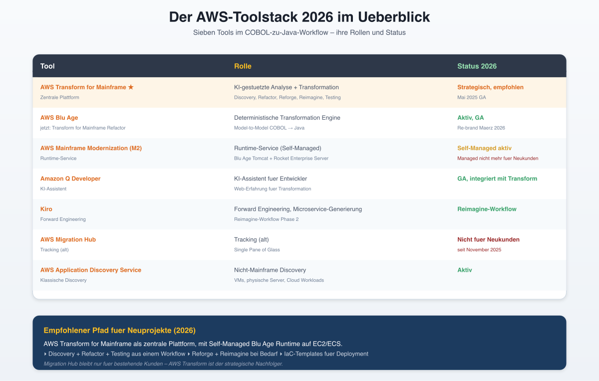

| Tool | Rolle | Status 2026 |
|------|-------|-------------|
| **AWS Transform for Mainframe** | KI-gestuetzte Analyse + Transformation | Strategisch, empfohlen |
| **AWS Blu Age** (jetzt: AWS Transform for Mainframe Refactor) | Deterministische Transformation Engine | Aktiv, GA |
| **AWS Mainframe Modernization (M2)** | Runtime-Service (Self-Managed) | Aktiv (Managed nicht fuer Neukunden) |
| **Amazon Q Developer** | KI-Assistent fuer Entwickler | GA, integriert mit Transform |
| **Kiro** | Forward Engineering, Microservice-Generierung | Reimagine-Workflow |
| **AWS Migration Hub** | Tracking (alt) | Nicht fuer Neukunden |
| **AWS Application Discovery Service** | Nicht-Mainframe Discovery | Aktiv |

**Empfohlener Pfad fuer Neuprojekte (2026):** AWS Transform for Mainframe als zentrale Plattform, mit Self-Managed Blu Age Runtime auf EC2/ECS.

---

## 2. End-to-End Workflow: Phasen und Schritte

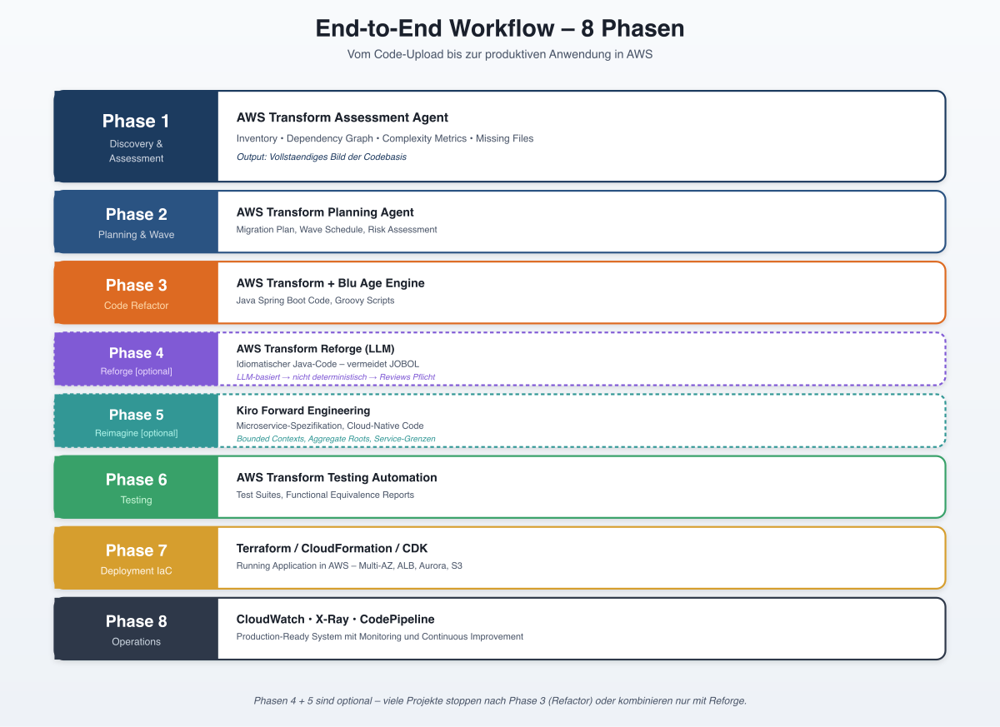

### Phasen-Uebersicht

```
┌─────────────────────────────────────────────────────────────┐
│  Phase 1: Discovery & Assessment                             │
│  ───────────────────────────────                             │
│  Tool: AWS Transform Assessment Agent                        │
│  Output: Inventory, Dependency Graph, Complexity Metrics    │
└─────────────────────────────────────────────────────────────┘
                          │
                          ▼
┌─────────────────────────────────────────────────────────────┐
│  Phase 2: Planning & Wave Definition                         │
│  ───────────────────────────────                             │
│  Tool: AWS Transform Planning Agent                          │
│  Output: Migration Plan, Wave Schedule, Risk Assessment     │
└─────────────────────────────────────────────────────────────┘
                          │
                          ▼
┌─────────────────────────────────────────────────────────────┐
│  Phase 3: Code Transformation (Refactor)                     │
│  ───────────────────────────────                             │
│  Tool: AWS Transform + Blu Age Engine                        │
│  Output: Java Spring Boot Code, Groovy Scripts              │
└─────────────────────────────────────────────────────────────┘
                          │
                          ▼
┌─────────────────────────────────────────────────────────────┐
│  Phase 4: Code Optimization (Reforge) [Optional]             │
│  ───────────────────────────────                             │
│  Tool: AWS Transform Reforge (LLM-basiert)                   │
│  Output: Idiomatischer Java-Code                             │
└─────────────────────────────────────────────────────────────┘
                          │
                          ▼
┌─────────────────────────────────────────────────────────────┐
│  Phase 5: Architecture Reimagine [Optional]                  │
│  ───────────────────────────────                             │
│  Tool: Kiro Forward Engineering                              │
│  Output: Microservice-Spezifikation, Cloud-Native Code      │
└─────────────────────────────────────────────────────────────┘
                          │
                          ▼
┌─────────────────────────────────────────────────────────────┐
│  Phase 6: Testing & Validation                               │
│  ───────────────────────────────                             │
│  Tool: AWS Transform Testing Automation                      │
│  Output: Test Suites, Functional Equivalence Reports        │
└─────────────────────────────────────────────────────────────┘
                          │
                          ▼
┌─────────────────────────────────────────────────────────────┐
│  Phase 7: Deployment via IaC                                 │
│  ───────────────────────────────                             │
│  Tool: Terraform / CloudFormation / CDK                      │
│  Output: Running Application in AWS                          │
└─────────────────────────────────────────────────────────────┘
                          │
                          ▼
┌─────────────────────────────────────────────────────────────┐
│  Phase 8: Operations & Continuous Improvement                │
│  ───────────────────────────────                             │
│  Tool: CloudWatch, X-Ray, CodePipeline                       │
│  Output: Production-Ready System                             │
└─────────────────────────────────────────────────────────────┘
```

---

## 3. Phase 1: Discovery & Assessment

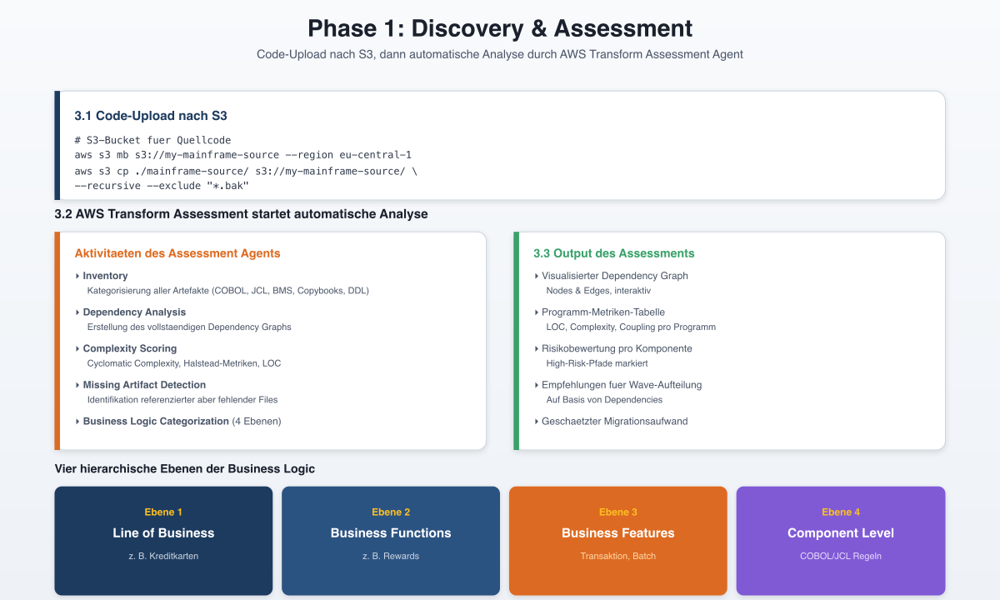

### 3.1 Code-Upload nach S3

```bash
# Vorbereitung: S3-Bucket fuer Quellcode
aws s3 mb s3://my-mainframe-source --region eu-central-1
aws s3 cp ./mainframe-source/ s3://my-mainframe-source/ \
  --recursive \
  --exclude "*.bak"
```

### 3.2 AWS Transform Assessment starten

Ueber die Amazon Q Developer Web-Erfahrung wird ein neuer Transformations-Job angelegt. Der Assessment-Agent fuehrt automatisch durch:

- **Inventory**: Kategorisierung aller Artefakte (COBOL, JCL, BMS, Copybooks, DB2 DDL)
- **Dependency Analysis**: Erstellung des vollstaendigen Dependency Graphs
- **Complexity Scoring**: Cyclomatic Complexity, Halstead-Metriken, LOC
- **Missing Artifact Detection**: Identifikation referenzierter aber fehlender Files
- **Business Logic Categorization** (4 Ebenen):
  1. Line of Business
  2. Business Functions/Domains
  3. Business Features
  4. Component Level

### 3.3 Output des Assessments

Der Assessment-Agent erzeugt einen umfangreichen Report mit:
- Visualisierter Dependency Graph (Nodes & Edges)
- Programm-Metriken-Tabelle
- Risikobewertung pro Komponente
- Empfehlungen fuer Wave-Aufteilung
- Geschaetzter Migrationsaufwand

---

## 4. Phase 2: Planning & Wave Definition

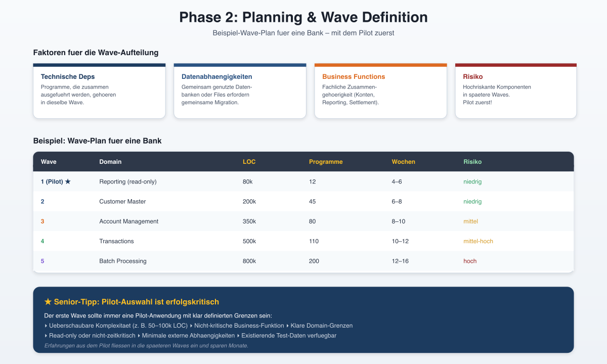

Der Planning Agent von AWS Transform schlaegt eine Wave-Aufteilung vor, die folgende Faktoren beruecksichtigt:

- **Technische Abhaengigkeiten**: Programme, die zusammen ausgefuehrt werden
- **Datenabhaengigkeiten**: Gemeinsam genutzte Datenbanken/Files
- **Business Functions**: Fachliche Zusammengehoerigkeit
- **Risiko**: Hochriskante Komponenten in spaetere Waves

**Senior-Tipp:** Der erste Wave sollte immer eine **Pilot-Anwendung** mit klar definierten Grenzen, ueberschaubarer Komplexitaet und nicht-kritischer Business-Funktion sein. Erfahrungen aus dem Pilot fliessen in die spaeteren Waves ein.

### Beispiel: Wave-Plan fuer eine Bank

| Wave | Domain | LOC | Programme | Wochen |
|------|--------|-----|-----------|--------|
| 1 (Pilot) | Reporting (read-only) | 80k | 12 | 4-6 |
| 2 | Customer Master | 200k | 45 | 6-8 |
| 3 | Account Management | 350k | 80 | 8-10 |
| 4 | Transactions | 500k | 110 | 10-12 |
| 5 | Batch Processing | 800k | 200 | 12-16 |

---

## 5. Phase 3: Code Transformation (Refactor)

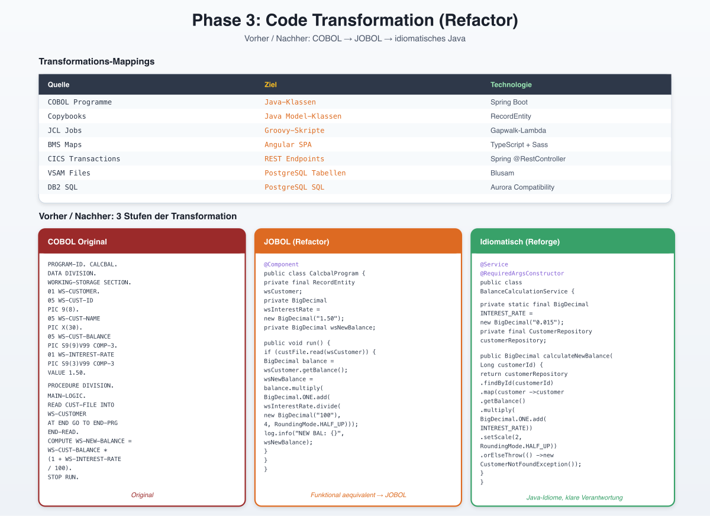

### 5.1 Der Transformationsprozess

Der Transformations-Agent von AWS Transform fuehrt die deterministische Konvertierung durch. Unter der Haube nutzt er die **AWS Blu Age Engine**, die folgende Mappings vornimmt:

| Quelle | Ziel | Technologie |
|--------|------|-------------|
| COBOL Programme | Java-Klassen | Spring Boot |
| Copybooks | Java Model-Klassen | RecordEntity |
| JCL Jobs | Groovy-Skripte | Gapwalk-Lambda |
| BMS Maps | Angular SPA | TypeScript + Sass |
| CICS Transactions | REST Endpoints | Spring @RestController |
| VSAM Files | PostgreSQL Tabellen | Blusam |
| DB2 SQL | PostgreSQL SQL | Aurora Compatibility |
| IMS Segments | Document/Relational | DynamoDB / Aurora |

### 5.2 Code-Beispiel: Vorher / Nachher

**COBOL Original:**

```cobol
       IDENTIFICATION DIVISION.
       PROGRAM-ID. CALCBAL.
       DATA DIVISION.
       WORKING-STORAGE SECTION.
       01  WS-CUSTOMER.
           05  WS-CUST-ID      PIC 9(8).
           05  WS-CUST-NAME    PIC X(30).
           05  WS-CUST-BALANCE PIC S9(9)V99 COMP-3.
       01  WS-INTEREST-RATE    PIC S9(3)V99 COMP-3 VALUE 1.50.
       01  WS-NEW-BALANCE      PIC S9(9)V99 COMP-3.
       PROCEDURE DIVISION.
       MAIN-LOGIC.
           READ CUST-FILE INTO WS-CUSTOMER
               AT END GO TO END-PROGRAM
           END-READ.
           COMPUTE WS-NEW-BALANCE =
               WS-CUST-BALANCE * (1 + WS-INTEREST-RATE / 100).
           DISPLAY 'NEW BALANCE: ' WS-NEW-BALANCE.
       END-PROGRAM.
           STOP RUN.
```

**Nach Refactor (JOBOL-Style):**

```java
@Component
public class CalcbalProgram {
    private final RecordEntity wsCustomer;
    private BigDecimal wsInterestRate = new BigDecimal("1.50");
    private BigDecimal wsNewBalance;

    public void run() {
        if (custFile.read(wsCustomer)) {
            BigDecimal balance = wsCustomer.getBalance();
            wsNewBalance = balance.multiply(
                BigDecimal.ONE.add(wsInterestRate.divide(
                    new BigDecimal("100"), 4, RoundingMode.HALF_UP))
            );
            log.info("NEW BALANCE: {}", wsNewBalance);
        }
    }
}
```

**Nach Reforge (idiomatischer Java):**

```java
@Service
@RequiredArgsConstructor
public class BalanceCalculationService {
    private static final BigDecimal INTEREST_RATE = new BigDecimal("0.015");
    private final CustomerRepository customerRepository;

    public BigDecimal calculateNewBalance(Long customerId) {
        return customerRepository.findById(customerId)
            .map(customer -> customer.getBalance()
                .multiply(BigDecimal.ONE.add(INTEREST_RATE))
                .setScale(2, RoundingMode.HALF_UP))
            .orElseThrow(() -> new CustomerNotFoundException(customerId));
    }
}
```

### 5.3 Wichtige Konzepte im generierten Code

**RecordEntity:** Bildet COBOL 01-Level-Strukturen ab und stellt typsicheren Zugriff auf Felder bereit, inkl. korrekter Behandlung von COMP-3, REDEFINES und PIC-Klauseln.

**Gapwalk-Application:** Ein Spring Boot Service, der die Eintrittspunkte fuer Transaktionen und Batch-Jobs bereitstellt. AWS Lambda triggert Gapwalk-Endpoints, um Groovy-Skripte (ehemalige JCL-Jobs) auszufuehren.

**Blusam:** PostgreSQL-basierte Bibliothek, die VSAM-Semantik (KSDS, ESDS, RRDS) auf relationalen Tabellen abbildet. Erlaubt schrittweise Migration zu nativen RDBMS-Strukturen.

---

## 6. Phase 4: Code Optimization (Reforge)

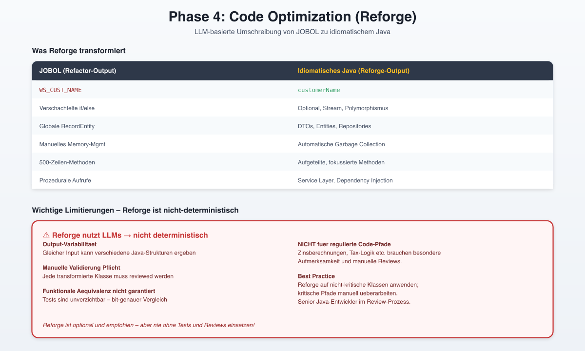

Reforge ist ein **optionaler aber dringend empfohlener** Schritt nach dem Refactor. Er nutzt LLMs, um JOBOL-Code in idiomatisches Java umzuschreiben.

### Was Reforge transformiert

| JOBOL (Refactor-Output) | Idiomatisches Java (Reforge-Output) |
|-------------------------|-------------------------------------|
| `WS_CUST_NAME` | `customerName` |
| Verschachtelte if/else | `Optional`, `Stream`, Polymorphismus |
| Globale RecordEntity | DTOs, Entities, Repositories |
| Manuelles Memory-Mgmt | Automatische Garbage Collection |
| 500-Zeilen-Methoden | Aufgeteilte, fokussierte Methoden |
| Prozedurale Aufrufe | Service Layer, Dependency Injection |

### Wichtige Limitierungen

Reforge nutzt LLMs und ist daher **nicht deterministisch**. Folgende Punkte sind kritisch:

- **Output-Variabilitaet**: Gleicher Input kann verschiedene Java-Strukturen ergeben
- **Manuelle Validierung Pflicht**: Jede transformierte Klasse muss reviewed werden
- **Funktionale Aequivalenz nicht garantiert**: Tests sind unverzichtbar
- **Nicht fuer regulierte Code-Pfade ohne Zusatzpruefung**: Zinsberechnungen, Tax-Logik etc. brauchen besondere Aufmerksamkeit

---

## 7. Phase 5: Architecture Reimagine [Optional]

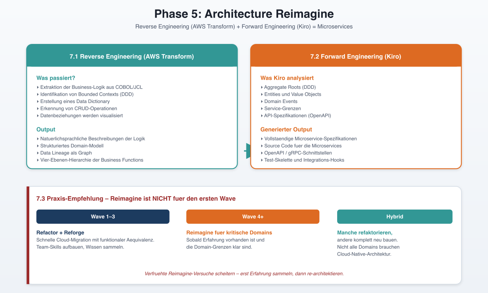

Reimagine geht ueber Refactoring hinaus und transformiert eine COBOL-Anwendung in **Cloud-native Microservices**. Es nutzt zwei Phasen:

### 7.1 Reverse Engineering (AWS Transform)

- Extraktion der Business-Logik aus COBOL/JCL
- Identifikation von Bounded Contexts (Domain-Driven Design)
- Erstellung eines Data Dictionary
- Erkennung von CRUD-Operationen und Datenbeziehungen

### 7.2 Forward Engineering (Kiro)

Kiro ist ein KI-Coding-Assistent, der die extrahierte Business-Logik analysiert und vorschlaegt:

- **Aggregate Roots** (DDD)
- **Entities und Value Objects**
- **Domain Events**
- **Service-Grenzen**
- **API-Spezifikationen** (OpenAPI)

Daraus generiert Kiro vollstaendige Microservice-Spezifikationen und Source Code.

### 7.3 Praxis-Empfehlung

Reimagine ist **nicht fuer den ersten Wave geeignet**. Empfohlen ist:
- Wave 1-3: Refactor + Reforge fuer schnelle Cloud-Migration
- Wave 4+: Reimagine fuer kritische Domains, sobald Erfahrung vorhanden ist
- Hybrid: Manche Domains werden refaktoriert, andere komplett neu gebaut

---

## 8. Phase 6: Testing & Validation

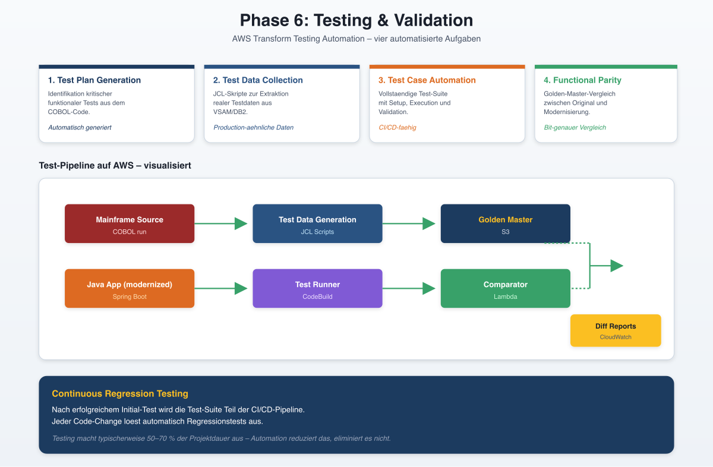

### 8.1 AWS Transform Testing Automation

Der Test-Agent von AWS Transform automatisiert vier Aufgaben:

1. **Test Plan Generation**: Identifikation kritischer funktionaler Tests aus dem COBOL-Code
2. **Test Data Collection Scripts**: JCL-Skripte zur Extraktion realer Testdaten aus VSAM/DB2
3. **Test Case Automation**: Vollstaendige Test-Suite mit Setup, Execution und Validation
4. **Functional Parity Checks**: Golden-Master-Vergleich zwischen Original und Modernisierung

### 8.2 Test-Pipeline auf AWS

```
┌──────────────────┐    ┌──────────────────┐    ┌──────────────────┐
│ Mainframe Source │───▶│ Test Data        │───▶│ Golden Master    │
│   (COBOL run)    │    │ Generation (JCL) │    │ (S3)             │
└──────────────────┘    └──────────────────┘    └──────────────────┘
                                                          │
                                                          ▼
┌──────────────────┐    ┌──────────────────┐    ┌──────────────────┐
│ Java App         │───▶│ Test Runner      │───▶│ Comparator       │
│ (modernized)     │    │ (CodeBuild)      │    │ (Lambda)         │
└──────────────────┘    └──────────────────┘    └──────────────────┘
                                                          │
                                                          ▼
                                                ┌──────────────────┐
                                                │ Diff Reports     │
                                                │ (CloudWatch)     │
                                                └──────────────────┘
```

### 8.3 Continuous Regression Testing

Nach erfolgreichem Initial-Test wird die Test-Suite Teil der CI/CD-Pipeline. Jeder Code-Change loest automatisch Regressionstests aus.

---

## 9. Phase 7: Deployment via Infrastructure as Code

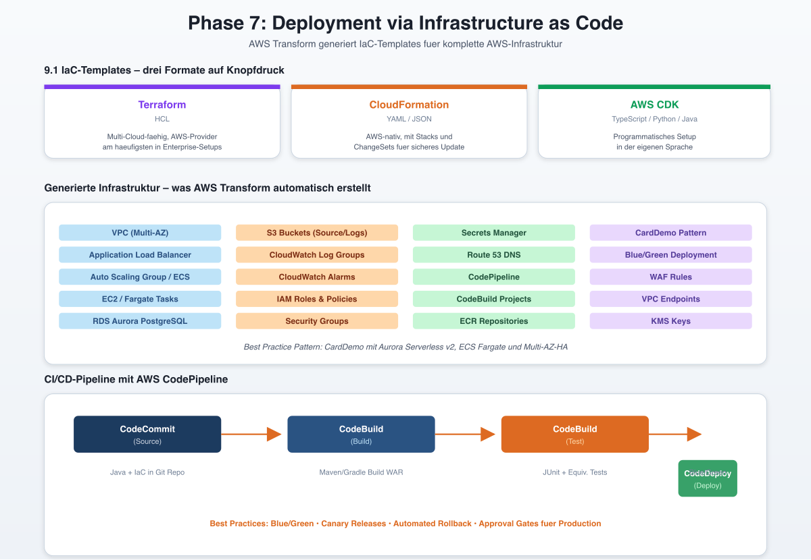

### 9.1 IaC-Templates

AWS Transform generiert vorgefertigte IaC-Templates in drei Formaten:

- **Terraform** (HCL)
- **AWS CloudFormation** (YAML/JSON)
- **AWS CDK** (TypeScript/Python/Java)

Die Templates erstellen die komplette Infrastruktur:

```
Generated Infrastructure
├── VPC (Multi-AZ)
├── Application Load Balancer
├── Auto Scaling Group / ECS Service
├── EC2 Instances (Tomcat + Blu Age Runtime) / Fargate Tasks
├── RDS Aurora PostgreSQL (DB2-Ersatz)
├── S3 Buckets (Source, Logs, Backups)
├── CloudWatch Log Groups & Alarms
├── IAM Roles & Policies
├── Security Groups
├── Secrets Manager (DB Credentials)
└── Route 53 DNS
```

### 9.2 Beispiel: Terraform Pattern

AWS bietet ein offizielles Prescriptive Guidance Pattern fuer das Deployment der CardDemo-Anwendung mit Terraform. Es zeigt Best Practices fuer:

- VPC-Design mit privaten/oeffentlichen Subnets
- ECS Fargate-basiertes Deployment
- Aurora Serverless v2 als DB2-Ersatz
- ALB mit HTTPS und WAF
- Multi-AZ-Hochverfuegbarkeit

### 9.3 CI/CD Pipeline mit AWS CodePipeline

```
┌────────────┐    ┌────────────┐    ┌────────────┐    ┌────────────┐
│ CodeCommit │───▶│ CodeBuild  │───▶│ CodeBuild  │───▶│ CodeDeploy │
│  (Source)  │    │  (Build)   │    │  (Test)    │    │  (Deploy)  │
└────────────┘    └────────────┘    └────────────┘    └────────────┘
       │                │                  │                 │
       ▼                ▼                  ▼                 ▼
   Java + IaC      Maven/Gradle      JUnit + Equiv.    Blue/Green
   in Git Repo     Build WAR         Tests             Deployment
```

**Best Practices:**
- **Blue/Green Deployment**: Zero-Downtime-Updates
- **Canary Releases**: Schrittweise Ausrollung neuer Versionen
- **Automated Rollback**: Bei Fehlerquoten ueber Schwellwert
- **Approval Gates**: Manuelle Genehmigung fuer Production-Deployments

---

## 10. Phase 8: Operations & Continuous Improvement

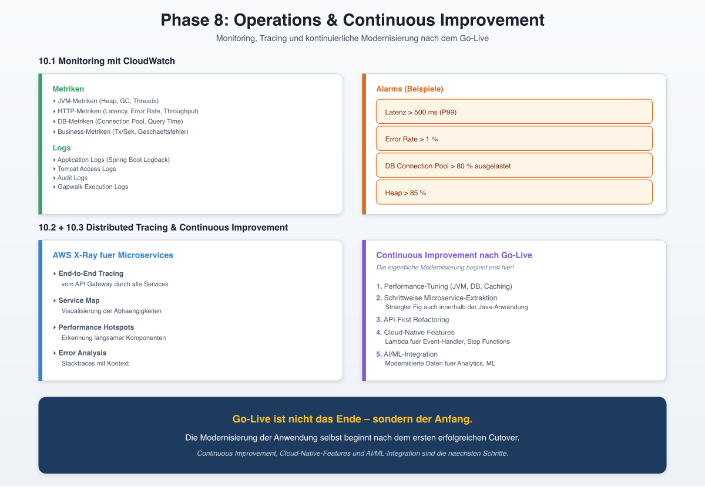

### 10.1 Monitoring mit CloudWatch

**Metriken (Custom + Standard):**
- JVM-Metriken (Heap, GC, Threads)
- HTTP-Metriken (Latency, Error Rate, Throughput)
- DB-Metriken (Connection Pool, Query Time)
- Business-Metriken (Transaktionen pro Sekunde, Geschaeftsfehler)

**Logs:**
- Application Logs (Spring Boot Logback)
- Tomcat Access Logs
- Audit Logs
- Gapwalk Execution Logs

**Alarms:**
- Latenz > 500ms (P99)
- Error Rate > 1 %
- DB Connection Pool > 80 % ausgelastet
- Heap > 85 %

### 10.2 Distributed Tracing mit AWS X-Ray

Fuer Microservices-basierte Migrationen ist X-Ray essentiell:

- **End-to-End Tracing**: Vom API Gateway durch alle Services
- **Service Map**: Visualisierung der Abhaengigkeiten
- **Performance Hotspots**: Erkennung langsamer Komponenten
- **Error Analysis**: Stacktraces mit Kontext

### 10.3 Continuous Improvement

Nach erfolgreichem Go-Live beginnt die eigentliche Modernisierung:

1. **Performance-Tuning**: JVM, DB, Caching
2. **Schrittweise Microservice-Extraktion**: Strangler Fig auch innerhalb der Java-Anwendung
3. **API-First Refactoring**: Bestehende REST-Endpoints durch saubere APIs ersetzen
4. **Cloud-Native Features**: Lambda fuer Event-Handler, Step Functions fuer Workflows
5. **AI/ML-Integration**: Nutzung der modernisierten Daten fuer Analytics, ML

---

## 11. CardDemo: Die Referenz-Anwendung

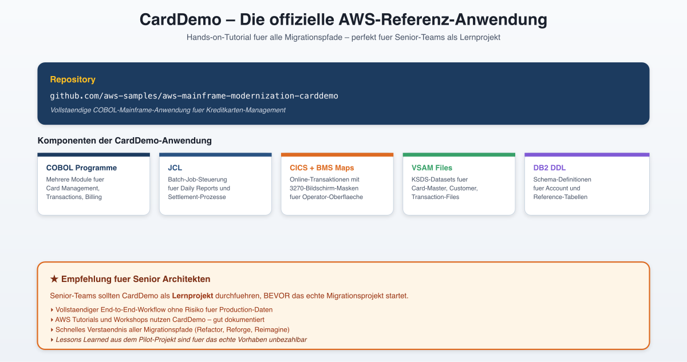

AWS stellt eine vollstaendige Beispiel-Anwendung **CardDemo** zur Verfuegung:

- **GitHub**: github.com/aws-samples/aws-mainframe-modernization-carddemo
- **Inhalt**: Komplette COBOL-Mainframe-Anwendung fuer Kreditkarten-Management
- **Komponenten**: COBOL-Programme, JCL, CICS, BMS Maps, VSAM, DB2 DDL
- **Verwendung**: Hands-on-Tutorial fuer alle Migrationspfade

CardDemo wird in offiziellen AWS-Tutorials und Workshops verwendet, um den End-to-End-Workflow zu demonstrieren. Empfehlung: Senior-Teams sollten CardDemo als Lernprojekt durchfuehren, **bevor** das echte Migrationsprojekt startet.

---

## 12. Senior-Architekt-Checkliste

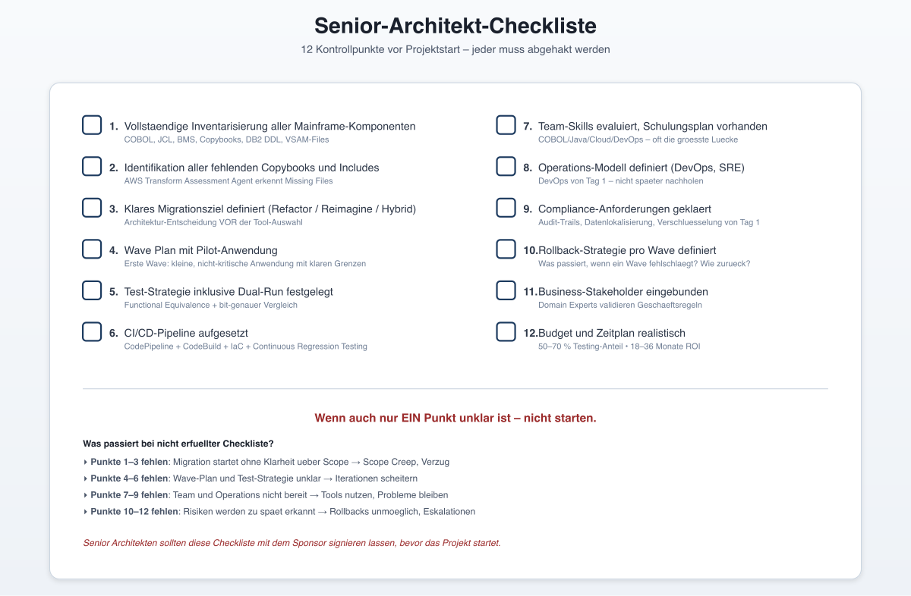

Vor Projektstart pruefen:

- [ ] Vollstaendige Inventarisierung aller Mainframe-Komponenten
- [ ] Identifikation aller fehlenden Copybooks und Includes
- [ ] Klares Migrationsziel definiert (Refactor / Reimagine / Hybrid)
- [ ] Wave Plan mit Pilot-Anwendung
- [ ] Test-Strategie inklusive Dual-Run festgelegt
- [ ] CI/CD-Pipeline aufgesetzt
- [ ] Team-Skills evaluiert, Schulungsplan vorhanden
- [ ] Operations-Modell definiert (DevOps, SRE)
- [ ] Compliance-Anforderungen geklaert
- [ ] Rollback-Strategie pro Wave definiert
- [ ] Business-Stakeholder eingebunden
- [ ] Budget und Zeitplan realistisch

---

## 13. Zusammenfassung

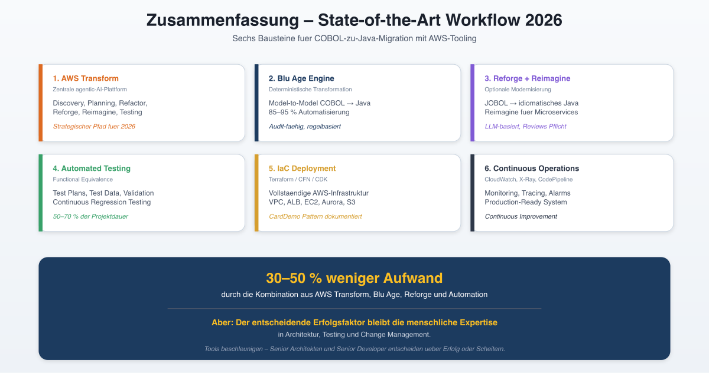

Der State-of-the-Art-Workflow fuer COBOL-zu-Java-Migrationen mit AWS-Tooling umfasst:

1. **AWS Transform** als zentrale agentic-AI-Plattform
2. **Blu Age Engine** als deterministische Transformations-Engine
3. **Reforge + Reimagine** fuer modernen, idiomatischen Code
4. **Automated Testing** fuer funktionale Aequivalenz
5. **IaC-basiertes Deployment** auf AWS-Infrastruktur
6. **Continuous Operations** mit CloudWatch, X-Ray und CodePipeline

Die Kombination dieser Tools verkuerzt Modernisierungsprojekte laut AWS-Erfahrungen um **30-50 %** und reduziert Risiken durch Automatisierung und KI-Unterstuetzung. Der entscheidende Erfolgsfaktor bleibt jedoch die **menschliche Expertise** in Architektur, Testing und Change Management.
