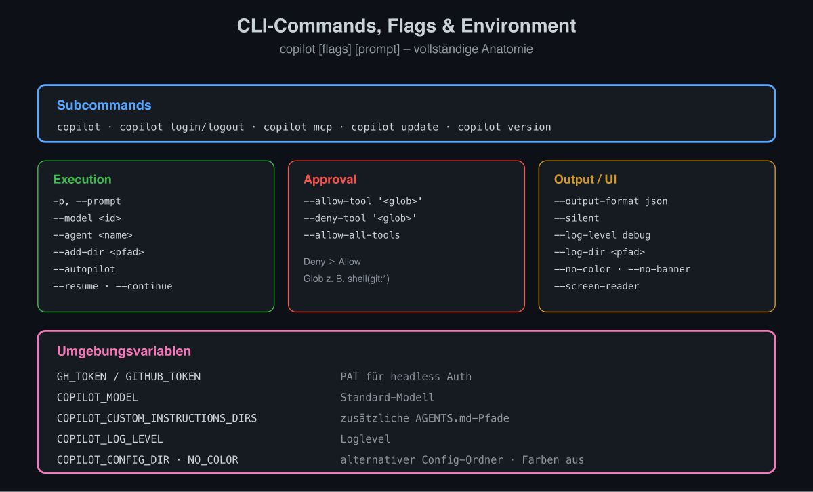
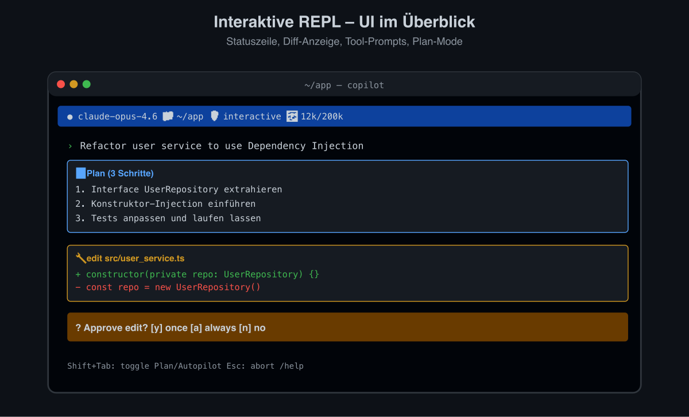
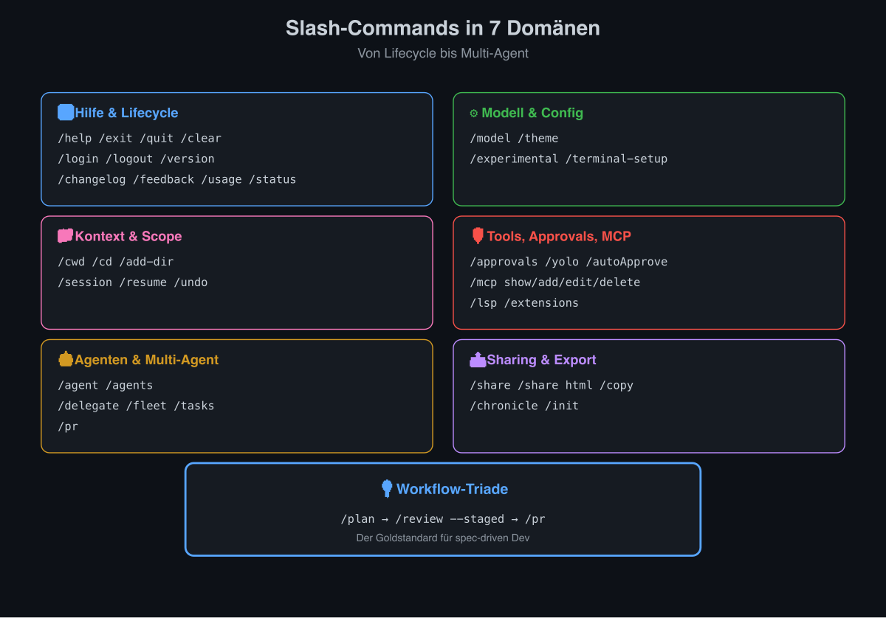
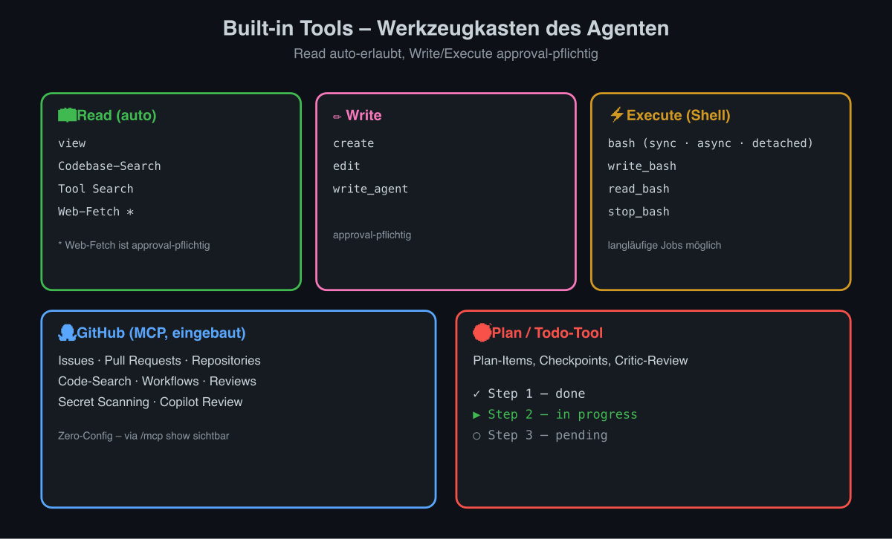
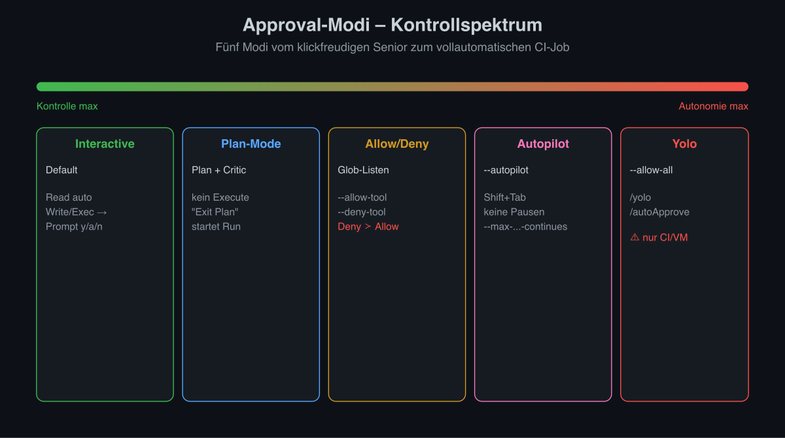
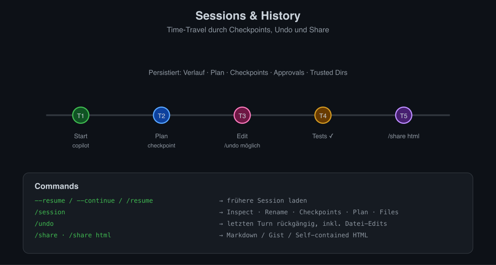
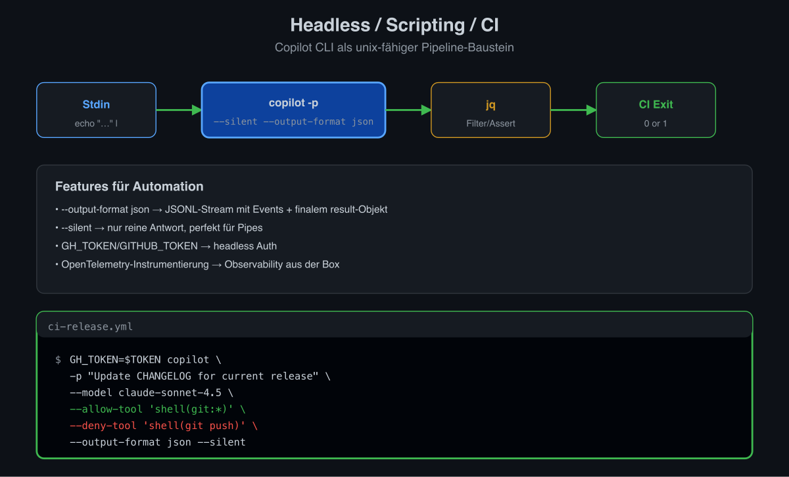
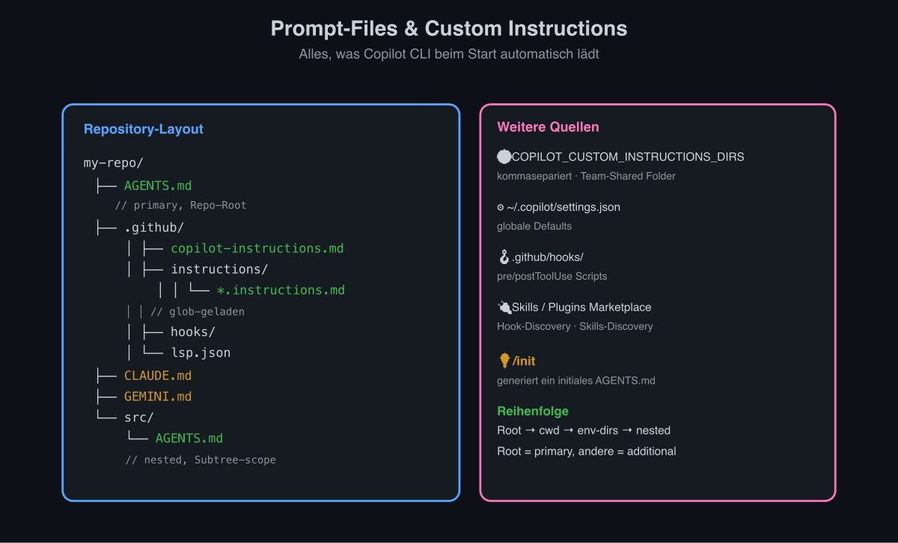
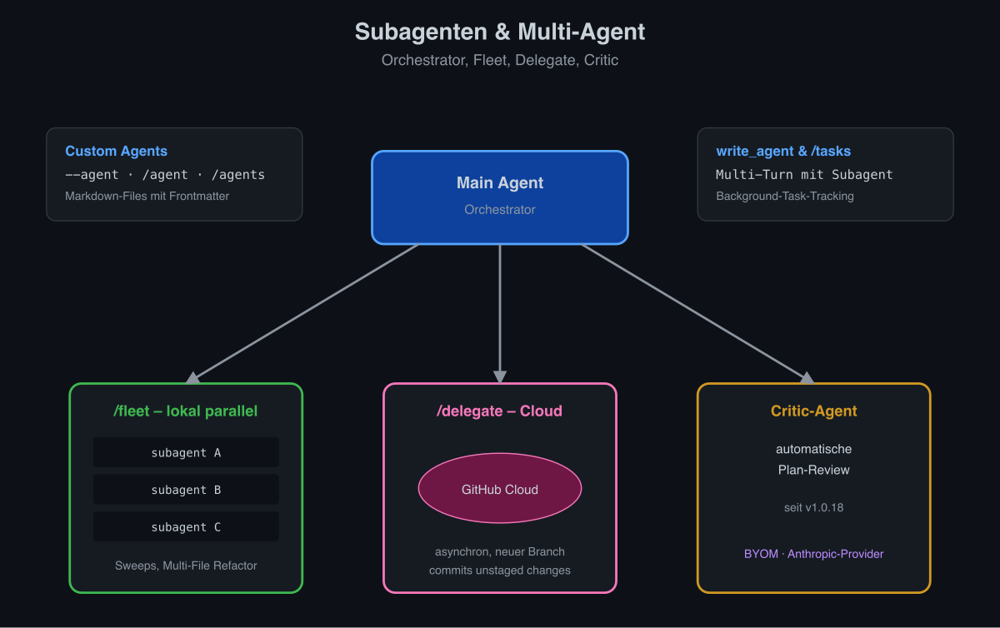

# GitHub Copilot CLI – Vollständige Feature-Übersicht (Stand 2026-04-06)

Die GitHub Copilot CLI (`copilot`) ist seit Februar 2026 generell verfügbar (GA). Sie bringt den Copilot Coding Agent direkt ins Terminal: interaktive REPL, Slash-Commands, Built-in-Tools, MCP-Integration, Subagenten (Fleet/Delegate) sowie ein Headless-Modus für CI/Scripting.

---

## 1. CLI-Commands & Flags



Aufruf: `copilot [flags] [prompt]`

### Wichtige Flags

| Flag | Beschreibung |
|---|---|
| `-p, --prompt "<text>"` | Headless/Non-Interactive: Prompt direkt übergeben, einmalig ausführen, danach beenden. Geeignet für Scripts/CI. |
| `--model <name>` | Modell wählen (z. B. `claude-sonnet-4.5`, `claude-sonnet-4`, `gpt-5`, `gpt-5.1`, `gemini-3-pro`, `claude-haiku-4.5`). |
| `--allow-tool '<pattern>'` | Tool/Befehlsmuster ohne Rückfrage erlauben (Glob). Beispiel: `--allow-tool 'shell(git:*)'`, `--allow-tool 'shell(npm run test:*)'`. Mehrfach verwendbar. |
| `--deny-tool '<pattern>'` | Tool/Befehlsmuster komplett verbieten. Hat Vorrang vor `--allow-tool` und `--allow-all-tools`. |
| `--allow-all-tools` | Alle Tools ohne Rückfrage erlauben (Yolo/Auto-Approve). |
| `--autopilot` | Autopilot-Modus: arbeitet ohne Approval-Pausen weiter, bis Aufgabe fertig (auch via Shift+Tab in REPL). |
| `--add-dir <pfad>` | Zusätzliches Verzeichnis dem Trust/Context hinzufügen. Mehrfach möglich. |
| `--resume [session-id]` | Vorherige Session wieder aufnehmen. Ohne ID erscheint Auswahlliste. |
| `--continue` | Letzte Session fortsetzen. |
| `--log-level <level>` | Loglevel: `error`, `warn`, `info`, `debug`. |
| `--log-dir <pfad>` | Verzeichnis für Logdateien. |
| `--no-color` / `NO_COLOR` env | Farbausgabe deaktivieren. |
| `--banner` | Animiertes ASCII-Begrüßungsbanner erzwingen. |
| `--no-banner` | Banner unterdrücken. |
| `--screen-reader` | Accessibility-Modus (kein Banner, keine Animationen, screen-reader-freundlich). |
| `--output-format <fmt>` | `text` (Standard) oder `json` (JSONL, eine Zeile pro Event/Result). Für headless. |
| `--silent` | Statistik/Usage unterdrücken, nur reine Antwort ausgeben. |
| `--agent <name>` | Custom Agent direkt aktivieren. |
| `--config <pfad>` | Alternative Config-Datei. |
| `--version` / `-v` | Version anzeigen. |
| `--help` / `-h` | Hilfe. |

### Subcommands

- `copilot` (ohne Argumente) → interaktive REPL.
- `copilot login` / `copilot logout` → Authentifizierung (`GH_TOKEN`/`GITHUB_TOKEN` als PAT alternativ).
- `copilot mcp` → MCP-Server-Verwaltung von der Shell.
- `copilot update` → Self-Update.
- `copilot version` → Version.

### Umgebungsvariablen

| Variable | Funktion |
|---|---|
| `GH_TOKEN` / `GITHUB_TOKEN` | PAT für nicht-interaktive Auth. |
| `COPILOT_MODEL` | Standard-Modell. |
| `COPILOT_CUSTOM_INSTRUCTIONS_DIRS` | Komma-Liste zusätzlicher Verzeichnisse, in denen `AGENTS.md` gesucht wird. |
| `NO_COLOR` | Farben aus. |
| `COPILOT_LOG_LEVEL` | Loglevel. |
| `COPILOT_CONFIG_DIR` | Alternativer Config-Ordner (`~/.copilot/`). |

---

## 2. Interaktive REPL – UI & Keybindings



Die REPL bietet:

- Animiertes ASCII-Banner beim Start (skipbar via `--no-banner`/`--screen-reader`).
- **Statuszeile** mit aktuellem Modell, Verzeichnis, Approval-Modus, Token-/Quota-Verbrauch.
- **Diff-Anzeige** für Datei-Edits mit Syntax-Highlighting (17 Sprachen) und Approval-Prompt.
- **Tool-Call-Anzeige** mit Beschreibung, vor Ausführung Approval-Prompt (Ja / Immer / Session-Allow / Nein).
- **Plan-Mode/Critic** für strukturiertes Vorgehen, „Exit Plan Mode"-Aktion.
- **Mouse-Support**, Text-Selektion und Copy.
- **Alt-Screen-Buffer** für saubere Darstellung.

### Keybindings

| Taste | Wirkung |
|---|---|
| `Enter` | Prompt absenden |
| `Shift+Enter` | Neue Zeile (Multiline; in Kitty-Protokoll-fähigen Terminals oder via `/terminal-setup`) |
| `Shift+Tab` | Autopilot-Modus toggeln |
| `Esc` | Laufende Operation abbrechen / Prompt verwerfen |
| `Ctrl+C` | Abbrechen |
| `Ctrl+D` | Beenden (bei leerem Input) |
| `↑` / `↓` | Prompt-Historie |
| `Tab` | Auto-Completion bei `/cwd`, `/add-dir`, Slash-Commands |
| `/` | Slash-Command-Auswahl/Autocomplete öffnen |

Multiline-Setup für VS-Code-Terminal: `/terminal-setup`.

---

## 3. Slash-Commands (Auswahl, in REPL via `/`)



Stand der Cheat-Sheet-Veröffentlichung umfasste 17 Commands; zusätzliche kamen über Changelog-Updates dazu.

### Hilfe & Lifecycle
- `/help` – alle verfügbaren Slash-Commands listen.
- `/exit`, `/quit` – Session sauber beenden.
- `/clear` – Kontext/Verlauf der aktuellen Session löschen (setzt Session-Approvals zurück).
- `/login`, `/logout` – Authentifizierung.
- `/version` – Version anzeigen, Update prüfen.
- `/changelog` – Letzte Updates/News anzeigen.
- `/feedback` – Feedback-Survey, Bugreport, Feature-Request.
- `/usage` – Session-Statistiken & Premium-Request-Verbrauch.
- `/status` – Zustand der Session.

### Modell & Konfiguration
- `/model` – Modell on-the-fly wechseln (Claude, GPT, Gemini, Haiku …).
- `/theme` – Farbschema (GitHub Dark, Light, Colorblind-Varianten).
- `/experimental [show]` – Preview-Features ein-/ausschalten.
- `/terminal-setup` – Terminal-Keybindings (z. B. Multiline) konfigurieren.

### Kontext & Scope
- `/cwd <pfad>`, `/cd <pfad>` – Arbeitsverzeichnis wechseln (Tab-Completion).
- `/add-dir <pfad>` – Zusätzliches Verzeichnis ins Trust/Context aufnehmen.
- `/session` – Session-Info: Checkpoints, Files, Plan; Rename möglich.
- `/resume` – Vorherige Session laden.
- `/undo` – Letzten Turn inkl. Datei-Änderungen rückgängig.

### Tools, Approvals, MCP
- `/approvals` – Approval-Regeln anzeigen/anpassen.
- `/yolo`, `/autoApprove` – Auto-Approval aller Tools toggeln.
- `/mcp` – MCP-Server verwalten: `show`, `add`, `edit`, `delete`, `enable`, `disable`, `auth` (OAuth Re-Auth, Account-Switch).
- `/lsp` – LSP-Server-Status anzeigen.
- `/extensions` – CLI-Extensions/Plugins anzeigen, aktivieren, deaktivieren.

### Agenten & Multi-Agent
- `/agent <name>` – Custom Agent explizit aktivieren.
- `/agents` – verfügbare Custom Agents auflisten.
- `/delegate <task>` – Aufgabe an den **Copilot Coding Agent** in der GitHub-Cloud auslagern (committet unstaged Änderungen auf neuen Branch, arbeitet asynchron weiter).
- `/fleet <task>` – Mehrere **Subagenten parallel** im lokalen CLI starten (Orchestrator zerlegt das Ziel in unabhängige Tasks).
- `/tasks` – Hintergrund-Tasks tracken.
- `/pr` – Pull-Request erstellen/verwalten, CI-Failures fixen, Review-Feedback adressieren.

### Sharing & Export
- `/share` – Session als Markdown exportieren oder als GitHub Gist teilen.
- `/share html` – Self-contained interaktives HTML der Session exportieren.
- `/copy` – Letzte Antwort in Zwischenablage.
- `/chronicle` – Standup-/Session-Zusammenfassung generieren.
- `/init` – Neues `AGENTS.md` im Repo initialisieren.

---

## 4. Built-in Tools



Copilot CLI hat ein definiertes Set an Built-in-Tools, die der Agent (mit Approval) aufrufen kann. Read-only-Operationen werden meist automatisch erlaubt; modifizierende Operationen erfordern Approval.

| Tool | Zweck |
|---|---|
| `view` | Datei oder Verzeichnis anzeigen (mit Zeilennummern). |
| `create` | Neue Datei mit Inhalt anlegen. |
| `edit` | String-Replacement/Patch in bestehender Datei. |
| `bash` | Shell-Befehle ausführen. Modi: synchron, asynchron, detached. |
| `write_bash` | Input in laufende Bash-Session senden. |
| `read_bash` | Output einer asynchronen Bash-Session lesen. |
| `stop_bash` | Laufende Bash-Session stoppen. |
| **Web-Fetch** | URLs/Webinhalte abrufen (Approval-pflichtig). |
| **Codebase-Search** | Repository-weite Suche. |
| **Git/GitHub** | Git-Operationen via `bash`; GitHub-API über den **eingebauten GitHub-MCP-Server**. |
| **Todo / Plan-Tool** | Plan-Items, Checkpoints, Critic-Review. |
| **Tool Search** | Dynamisches Auffinden weiterer Tools (insbes. MCP). |
| **`write_agent`** | Multi-Turn-Konversation mit Subagenten. |

Built-in MCP-Server (z. B. GitHub) sind ohne Setup verfügbar; weitere Server via `/mcp add` oder `~/.copilot/mcp-config.json`. Plugin-System mit Marketplace existiert.

---

## 5. Approval-Modi



| Modus | Aktivierung | Verhalten |
|---|---|---|
| **Interactive (Default)** | Standard | Read-only auto-erlaubt; modifizierende Tools fragen pro Aufruf nach. Optionen: einmal, immer in Session, immer dauerhaft, ablehnen. |
| **Plan-Mode** | über Plan/Critic-Workflow | Agent erstellt Plan, lässt ihn vom Critic prüfen, bevor Aktionen ausgeführt werden. „Exit Plan Mode" startet Ausführung. |
| **Allow-/Deny-Listen** | `--allow-tool`/`--deny-tool`, `/approvals` | Glob-basierte Whitelist/Blacklist (z. B. `shell(git:*)`). Deny schlägt Allow. |
| **Autopilot** | `--autopilot` oder `Shift+Tab` | Agent arbeitet ohne Approval-Pausen weiter. |
| **Yolo / Full-Auto** | `--allow-all-tools`, `/yolo`, `/autoApprove` | Alle Tools ohne Rückfrage. Für Headless/CI. |

Session-Approvals werden bei `/clear` oder neuer Session zurückgesetzt.

---

## 6. Sessions & History



- Sessions werden persistiert (Verlauf, Plan, Checkpoints, Approvals, Trusted Dirs).
- `--resume` / `--continue` / `/resume` – frühere Session laden.
- `/session` – Inspect, Rename, Checkpoints, Plan, Files.
- `/undo` – letzten Turn rückgängig.
- `/share` – Export (Markdown/Gist/HTML) für Doku, Debugging, Mentoring.
- VS Code Integration: Copilot CLI Sessions können in VS Code visualisiert werden.

---

## 7. Headless / Scripting / CI-Modus



- `copilot -p "<prompt>"` – einmaliger Lauf, kein REPL.
- `--output-format json` – JSONL-Stream, ein JSON-Objekt pro Zeile, finales Result-Objekt mit `result`-Feld und Session-Metadaten.
- `--silent` – nur reine Antwort, keine Statistiken (ideal für `| jq`).
- `--allow-all-tools` bzw. fein-granular `--allow-tool` / `--deny-tool` für sichere Automationen.
- `--autopilot` für unbeaufsichtigte Läufe.
- Auth via `GH_TOKEN`/`GITHUB_TOKEN`.
- OpenTelemetry-Instrumentierung für Observability.
- Pipes/Stdin: Prompt kann via Stdin geliefert werden (`echo "..." | copilot -p -`).
- Programmatic Reference (offizielle Doku) beschreibt JSON-Eventtypen.

Beispiel CI:
```bash
GH_TOKEN=$TOKEN copilot \
  -p "Update CHANGELOG for current release" \
  --model claude-sonnet-4.5 \
  --allow-tool 'shell(git:*)' \
  --deny-tool 'shell(git push)' \
  --output-format json --silent
```

---

## 8. Prompt-Files & Custom Instructions



Copilot CLI lädt automatisch Custom-Instruction-Dateien:

- **`AGENTS.md`** – Primäre Instruction-Datei. Kann im Repo-Root, im aktuellen Working Directory, oder in über `COPILOT_CUSTOM_INSTRUCTIONS_DIRS` konfigurierten Pfaden liegen. Mehrere `AGENTS.md` möglich; Root-Datei = primary, andere = additional.
- **`.github/copilot-instructions.md`** – wird parallel zu `AGENTS.md` verwendet, falls beide vorhanden.
- **`.github/instructions/**/*.instructions.md`** – glob-basiert geladen.
- **`CLAUDE.md`** und **`GEMINI.md`** – ebenfalls erkannt (Repo-Root).
- `/init` – Generiert ein initiales `AGENTS.md`.
- Settings: `~/.copilot/settings.json`, `.github/hooks/` für Hook-Konfiguration, `~/.copilot/lsp-config.json` bzw. `.github/lsp.json` für LSP.
- Skills/Plugins: Plugin-System mit Marketplace, Hook-Discovery, Skills-Discovery.

---

## 9. Subagenten & Multi-Agent-Features



- **Custom Agents** – per `--agent` / `/agent` aktivierbar; mit eigener Expertise/Tools/Prompt. Definition über Markdown-Files.
- **Subagent-Delegation** – Hauptagent kann automatisch an Subagenten delegieren, wenn er es für sinnvoll hält.
- **`/fleet`** – Orchestrator startet **mehrere lokale Subagenten parallel**. Unabhängige Work-Items werden gleichzeitig erledigt – ideal für große Refactorings, Sweeps, Multi-File-Tasks.
- **`/delegate`** – Aufgaben an den **Copilot Coding Agent in der GitHub-Cloud** auslagern. Der Cloud-Agent arbeitet asynchron auf einem neuen Branch und meldet zurück.
- **Critic-Agent** – automatische Plan-Review (eingeführt v1.0.18).
- **`write_agent`** – Multi-Turn-Konversation mit Subagenten.
- **`/tasks`** – Tracking laufender Hintergrund-Subagenten-Tasks.
- **BYOM** – Bring Your Own Model (Anthropic-Provider) für Subagenten.

---

## 10. Quellen

Siehe [_quellen](GCC-Quellen) im selben Verzeichnis.
