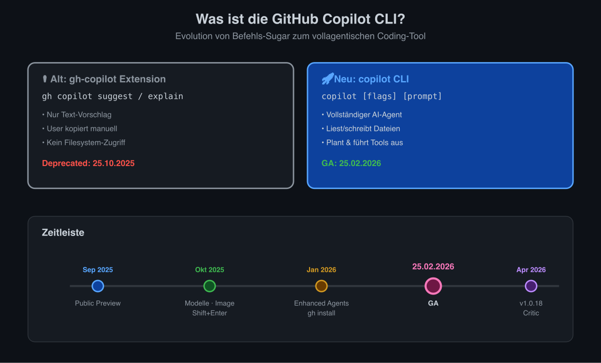
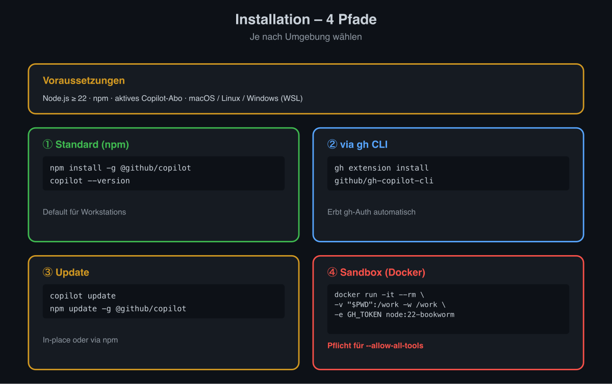
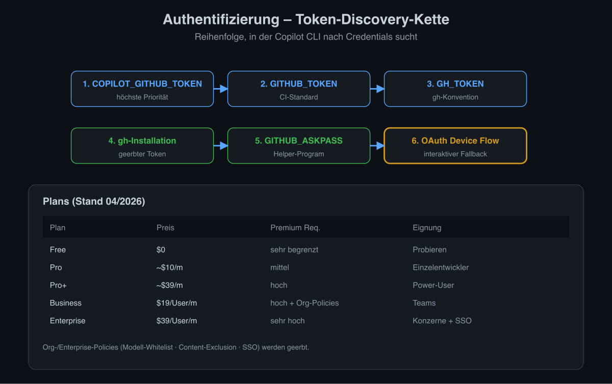
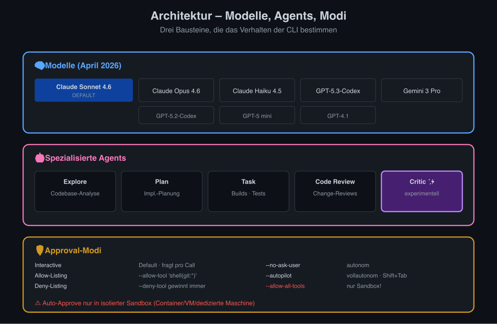
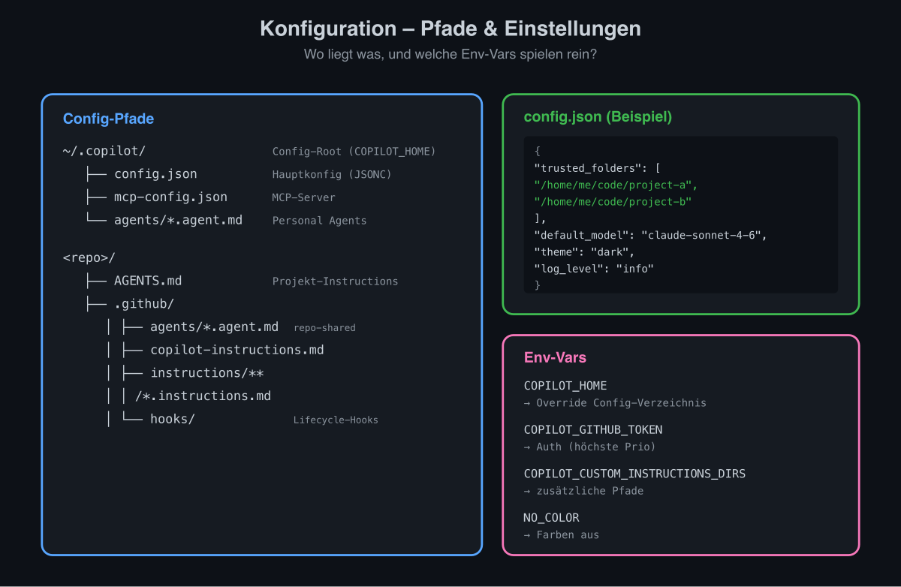
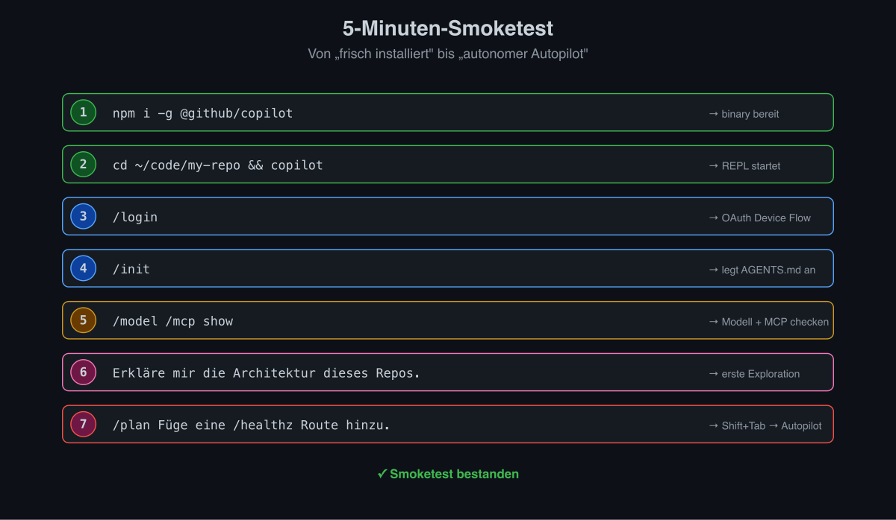
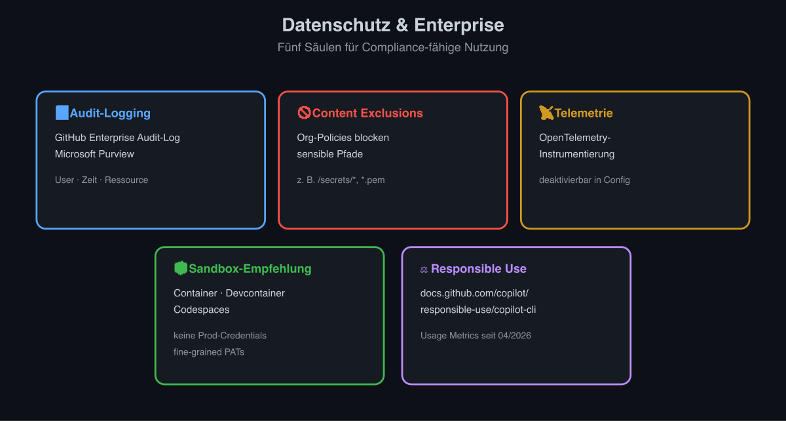
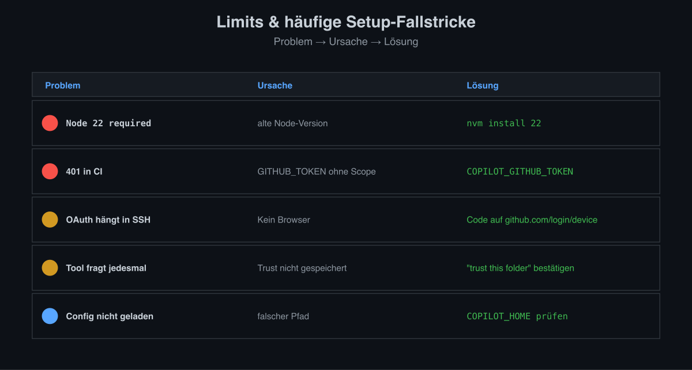

# Installations- und Setup-Guide – GitHub Copilot CLI

> Stand: 2026-04-06 · Zielgruppe: Senior Developer & Architekten

## 1. Was ist die GitHub Copilot CLI?



Die **GitHub Copilot CLI** (`copilot`) ist ein terminalbasiertes, **agentisches** Coding-Tool, das den GitHub Copilot Coding Agent direkt in die Shell bringt. Sie ist klar abzugrenzen von der älteren `gh copilot` Extension (`suggest` / `explain`), die am **25.10.2025 deprecated** wurde.

| Aspekt | Alte `gh-copilot` Extension | Neue `copilot` CLI |
|---|---|---|
| Zweck | Shell-Befehle vorschlagen / erklären | Vollständiger AI-Agent |
| Aktion | Nur Text-Output, User kopiert | Liest/schreibt Dateien, führt Tools aus, plant |
| Status | Deprecated | **GA seit 25.02.2026** |

### Zeitleiste

| Datum | Ereignis |
|---|---|
| Sep 2025 | Public Preview |
| Okt 2025 | Erweiterte Modellauswahl, Image-Support, Multiline (Shift+Enter) |
| Jan 2026 | Enhanced Agents, Context Management, Install via `gh` |
| **25.02.2026** | **General Availability** |
| Apr 2026 | v1.0.18 mit experimentellem **Critic Agent** |

## 2. Installation



### Voraussetzungen

- **Node.js ≥ 22**
- **npm**
- Aktives Copilot-Abo: Free (limitiert), Pro, Pro+, Business oder Enterprise
- OS: macOS, Linux, Windows (WSL empfohlen)

### Standardinstallation (npm)

```bash
npm install -g @github/copilot
copilot --version
```

### Alternative über `gh` CLI (seit Januar 2026)

```bash
gh extension install github/gh-copilot-cli   # falls eingerichtet
gh copilot                                    # startet die agentische CLI
```

### Update

```bash
copilot update          # In-place Update
npm update -g @github/copilot
```

### Sandbox-Variante (empfohlen für `--allow-all-tools`)

```bash
docker run -it --rm \
  -v "$PWD":/work -w /work \
  -e GH_TOKEN \
  node:22-bookworm \
  bash -c "npm i -g @github/copilot && copilot"
```

## 3. Authentifizierung



### Token-Discovery (Reihenfolge)

1. `COPILOT_GITHUB_TOKEN`
2. `GITHUB_TOKEN`
3. `GH_TOKEN`
4. Token einer authentifizierten `gh`-Installation
5. `GITHUB_ASKPASS`
6. **OAuth Device Flow** (interaktiver Fallback)

### Methoden im Detail

**OAuth Device Flow** – Default für Workstations:
```bash
copilot
> /login        # generiert One-Time-Code, Browser-Autorisierung
```

**Headless / CI** – via Env-Var:
```bash
export GH_TOKEN=ghp_…           # fine-grained PAT mit Copilot-Scope
copilot -p "review the diff"
```

**Multi-Account** – `/login` mehrfach, `/status` zeigt aktiven Account.

### Plans (Stand 04/2026)

| Plan | Preis | Premium Requests | Eignung |
|---|---|---|---|
| Free | $0 | sehr begrenzt | Probieren |
| Pro | ~$10/Monat | mittel | Einzelentwickler |
| Pro+ | ~$39/Monat | hoch | Power-User |
| Business | $19/User/Monat | hoch + Org-Policies | Teams |
| Enterprise | $39/User/Monat | sehr hoch + SSO/Audit | Konzerne |

Org-/Enterprise-Policies (Modell-Whitelist, Content-Exclusion, SSO/SAML) werden automatisch geerbt. Per-User-CLI-Aktivität ist seit **April 2026** in den **Copilot Usage Metrics** sichtbar.

## 4. Architektur



### Modelle (Stand April 2026)

- **Default**: Claude Sonnet 4.6
- **Verfügbar** je nach Plan/Policy: Claude Opus 4.6, Claude Sonnet 4.6, Claude Haiku 4.5, GPT-5.3-Codex, GPT-5.2-Codex, GPT-5 mini, GPT-4.1, Gemini 3 Pro
- Modellwechsel: `/model` – die Conversation-History inkl. Tool-Calls bleibt erhalten.

### Spezialisierte Agents

| Agent | Aufgabe |
|---|---|
| **Explore** | Schnelle Codebase-Analyse |
| **Plan** | Implementierungs-Planung |
| **Task** | Builds, Tests |
| **Code Review** | Change-Reviews |
| **Critic** *(neu, experimentell)* | Reviewt Pläne mit Komplementärmodell |

### Approval-Modi (Sandbox)

| Modus | Flag/Command | Beschreibung |
|---|---|---|
| Interactive (Default) | – | Mutating-Tools fragen nach |
| Allow-Listing | `--allow-tool 'shell(git:*)'` | Granulare Freigabe |
| Deny-Listing | `--deny-tool 'shell(rm:*)'` | Deny gewinnt immer |
| `--allow-all-tools` | – | Alle Tools ohne Rückfrage |
| Yolo / `/yolo` | `--allow-all` | Alle Tools+Pfade+URLs |
| `--no-ask-user` | – | Agent entscheidet autonom |
| Autopilot | `Shift+Tab` / `--autopilot` | Vollautonom mehrstufig |

> ⚠️ Auto-Approve nur in isolierter Sandbox (Container/VM/dedizierte Maschine).

## 5. Konfiguration



### Pfade

| Pfad | Inhalt |
|---|---|
| `~/.copilot/` | Config-Root (override mit `COPILOT_HOME`) |
| `~/.copilot/config.json` | Hauptkonfiguration (JSONC) |
| `~/.copilot/mcp-config.json` | MCP-Server |
| `~/.copilot/agents/*.agent.md` | Persönliche Custom Agents |
| `.github/agents/*.agent.md` | Repo-shared Agents |
| `AGENTS.md` (Repo-Root) | Projekt-Instruktionen |
| `.github/copilot-instructions.md` | Parallele Instruktionen |
| `.github/instructions/**/*.instructions.md` | Granulare Instruktionen |
| `.github/hooks/` | Lifecycle-Hooks |

### Wichtige Settings

```jsonc
{
  "trusted_folders": [
    "/home/me/code/project-a",
    "/home/me/code/project-b"
  ],
  "default_model": "claude-sonnet-4-6",
  "theme": "dark",
  "log_level": "info"
}
```

### Env-Vars

| Variable | Zweck |
|---|---|
| `COPILOT_HOME` | Override Config-Verzeichnis |
| `COPILOT_GITHUB_TOKEN` / `GH_TOKEN` / `GITHUB_TOKEN` | Auth |
| `COPILOT_CUSTOM_INSTRUCTIONS_DIRS` | Zusätzliche Instruction-Pfade |
| `NO_COLOR` | Farbausgabe deaktivieren |

## 6. Erste Schritte – 5-Minuten-Smoketest



```bash
npm i -g @github/copilot
cd ~/code/my-repo
copilot
> /login
> /init                              # legt AGENTS.md an
> /model                             # Modell wählen
> /mcp show                          # MCP-Server prüfen
> Erkläre mir die Architektur dieses Repos.
> /plan Füge eine /healthz Route hinzu.
> # Plan reviewen → Shift+Tab → Autopilot
```

## 7. Datenschutz & Enterprise



- **Audit-Logging**: GitHub Enterprise Audit-Log + Microsoft Purview erfassen User, Zeit, Ressourcen.
- **Content Exclusions**: Org-Policies blockieren sensible Pfade.
- **Telemetrie**: OpenTelemetry-Instrumentierung, deaktivierbar in Config.
- **Sandbox-Empfehlung**: Containerisierte Ausführung, keine Prod-Credentials, fine-grained PATs.
- **Responsible Use**: Siehe `docs.github.com/copilot/responsible-use/copilot-cli`.

## 8. Limits & häufige Setup-Fallstricke



| Problem | Ursache | Lösung |
|---|---|---|
| `Node 22 required` | Alte Node-Version | `nvm install 22` |
| 401 in CI | `GITHUB_TOKEN` ohne Copilot-Scope | Fine-grained PAT in `COPILOT_GITHUB_TOKEN` |
| OAuth hängt in SSH | Kein Browser | Code manuell auf github.com/login/device |
| Tool fragt jedesmal nach | Trust-Workspace nicht gespeichert | Beim Start "trust this folder" bestätigen |
| Config nicht geladen | Falscher Pfad | `COPILOT_HOME` prüfen, `~/.copilot/` anlegen |

---

Weiterführend: [feature_uebersicht](GCC-01-Feature-Uebersicht), [agentic_engineering_mcp_security](GCC-04-Agentic-MCP-Security), [workflows_und_vergleich](GCC-05-Workflows-und-Vergleich), [senior_developer_guide](GCC-03-Senior-Developer-Guide), [cheat_sheet](GCC-06-Cheat-Sheet).
