# GitHub Copilot CLI – Cheat Sheet

> Stand: 2026-04-06 · Druckreife Kurzreferenz für Senior Developer

## 1. Install & Update

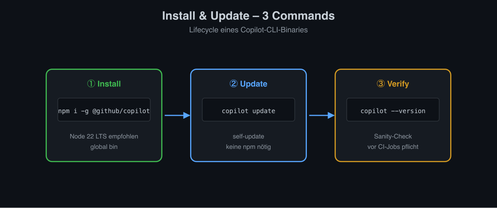

```bash
npm i -g @github/copilot          # Install
copilot update                    # Update
copilot --version                 # Version
```

## 2. Start & Auth

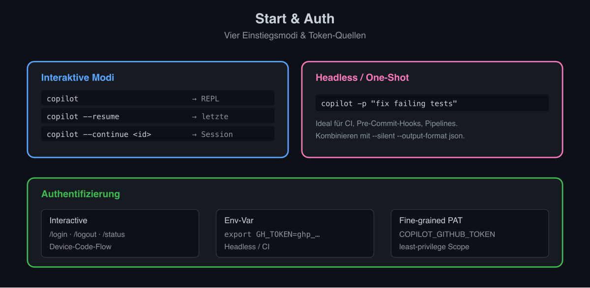

```bash
copilot                           # interaktive REPL
copilot -p "fix failing tests"    # One-Shot (headless)
copilot --resume                  # letzte Session
copilot --continue <id>           # Session fortsetzen

export GH_TOKEN=ghp_…             # Headless-Auth
```

In Session: `/login`, `/logout`, `/status`

## 3. Wichtige CLI-Flags

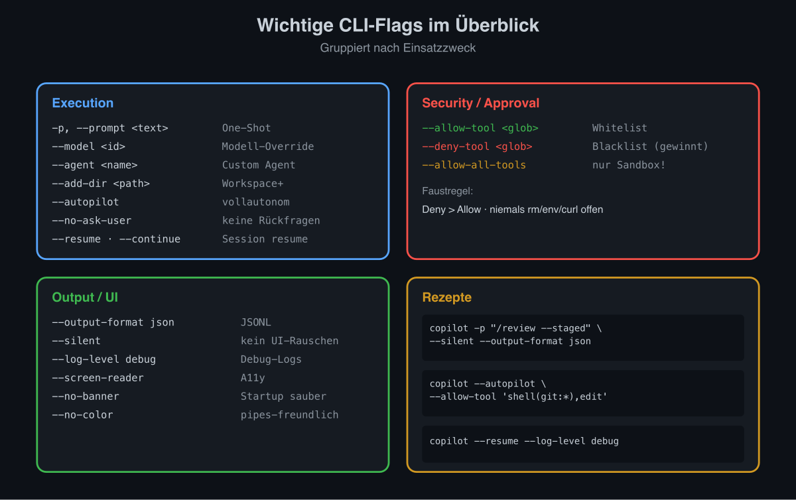

| Flag | Wirkung |
|---|---|
| `-p, --prompt <text>` | One-Shot, non-interaktiv |
| `--model <id>` | Modell setzen |
| `--agent <name>` | Custom Agent starten |
| `--add-dir <path>` | Verzeichnis zum Workspace |
| `--allow-tool <glob>` | Tool granular erlauben |
| `--deny-tool <glob>` | Tool sperren (gewinnt) |
| `--allow-all-tools` | Alle Tools erlauben (Sandbox!) |
| `--autopilot` | Vollautonom |
| `--no-ask-user` | Keine Rückfragen |
| `--output-format json` | JSONL Output |
| `--silent` | Kein UI-Rauschen |
| `--log-level debug` | Debug-Logs |
| `--screen-reader` | A11y-Modus |
| `--no-banner` / `--no-color` | UI-Tweaks |
| `--resume` / `--continue` | Session-Wiederaufnahme |

## 4. Slash-Commands (Auswahl)

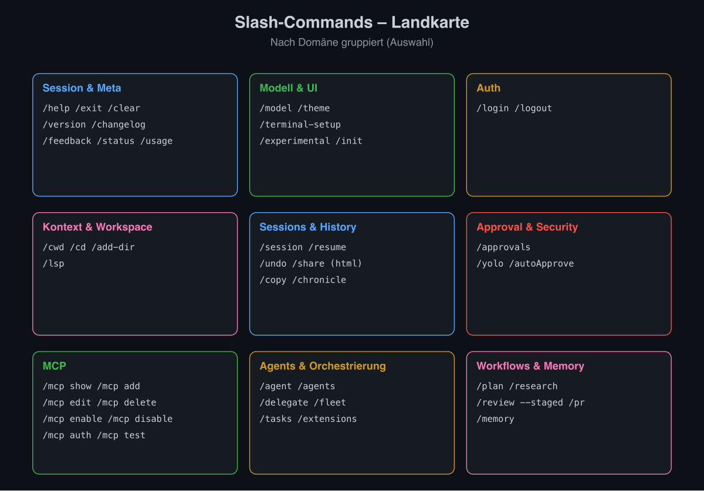

### Session & Meta
`/help` `/exit` `/clear` `/version` `/changelog` `/feedback` `/status` `/usage`

### Modell & UI
`/model` `/theme` `/terminal-setup` `/experimental` `/init`

### Auth
`/login` `/logout`

### Kontext & Workspace
`/cwd` (`/cd`) `/add-dir` `/lsp`

### Sessions & History
`/session` `/resume` `/undo` `/share` (`/share html`) `/copy` `/chronicle`

### Approval & Sicherheit
`/approvals` `/yolo` (`/autoApprove`)

### MCP
`/mcp show` `/mcp add` `/mcp edit <name>` `/mcp delete <name>` `/mcp enable` `/mcp disable` `/mcp auth` `/mcp test`

### Agents & Orchestrierung
`/agent` `/agents` `/delegate` `/fleet` `/tasks` `/extensions`

### Coding-Workflows
`/plan` `/research` `/review` (`--staged`) `/pr`

### Memory
`/memory`

## 5. Keybindings (REPL)

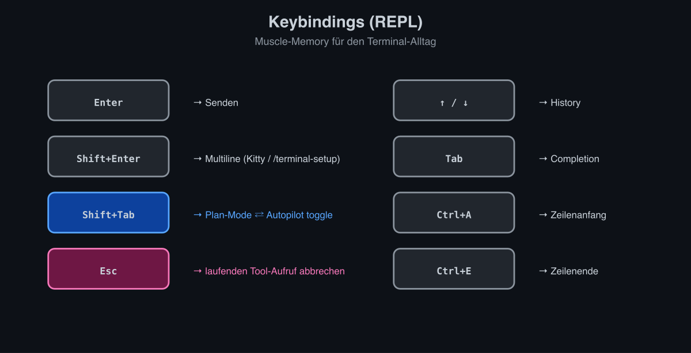

| Taste | Aktion |
|---|---|
| `Enter` | Senden |
| `Shift+Enter` | Multiline (Kitty/`/terminal-setup`) |
| `Shift+Tab` | Plan-Mode / Autopilot toggle |
| `Esc` | Tool-Aufruf abbrechen |
| `↑ / ↓` | History |
| `Tab` | Completion |
| `Ctrl+A / Ctrl+E` | Zeilenanfang/-ende |

## 6. Built-in Tools

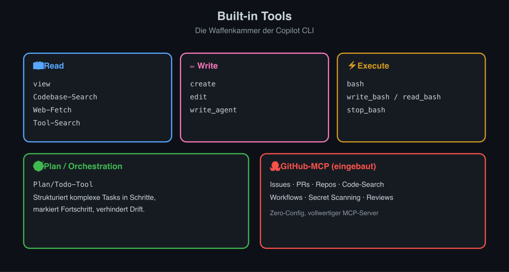

`view`, `create`, `edit`, `bash`, `write_bash`, `read_bash`, `stop_bash`, Web-Fetch, Codebase-Search, Plan/Todo-Tool, Tool-Search, `write_agent`. GitHub-Operationen via eingebautem GitHub-MCP-Server.

## 7. Approval-Modi auf einen Blick

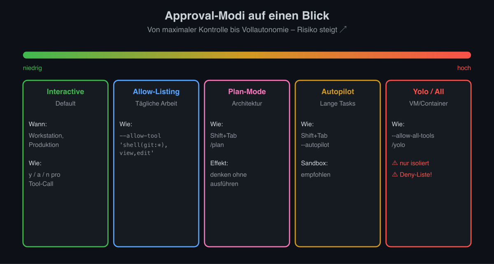

| Modus | Wann | Wie |
|---|---|---|
| Interactive | Default, Workstation | – |
| Allow-Listing | Tägliche Arbeit | `--allow-tool 'shell(git:*),view,edit'` |
| Plan-Mode | Architekturänderungen | `Shift+Tab` / `/plan` |
| Autopilot | Lange Tasks, Sandbox | `Shift+Tab` (toggle) / `--autopilot` |
| Yolo / All | Container/VM only | `--allow-all-tools` / `/yolo` |

**Deny gewinnt** immer:

```bash
copilot --allow-all-tools \
  --deny-tool 'shell(rm:*),shell(curl:*),shell(env:*)'
```

## 8. AGENTS.md – Mini-Template

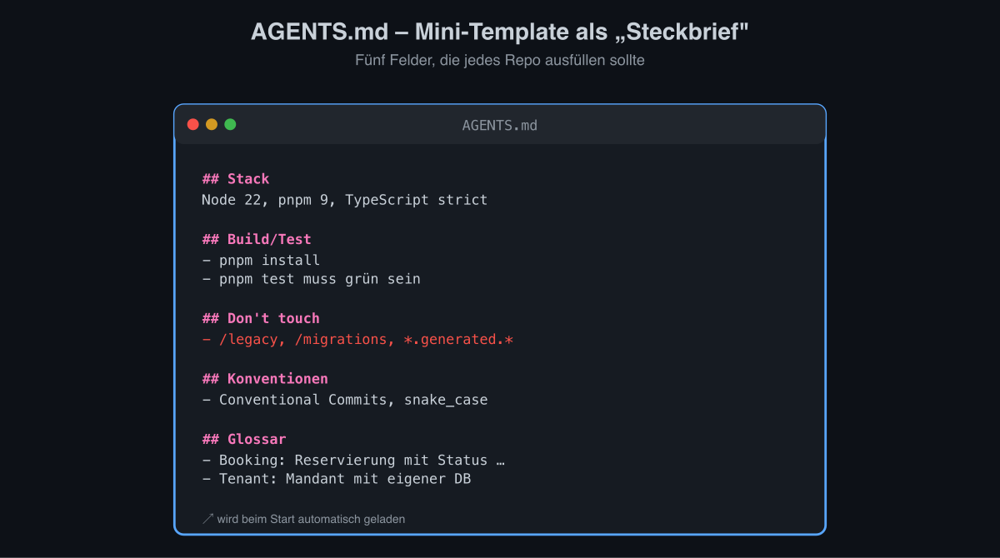

```markdown
# AGENTS.md
## Stack
Node 22, pnpm 9, TypeScript strict
## Build/Test
- `pnpm install`, `pnpm test` muss grün sein
## Don't touch
- /legacy, /migrations, *.generated.*
## Konventionen
- Conventional Commits, snake_case
## Glossar
- Booking: Reservierung mit Status …
```

## 9. MCP-Config – Mini-Beispiele

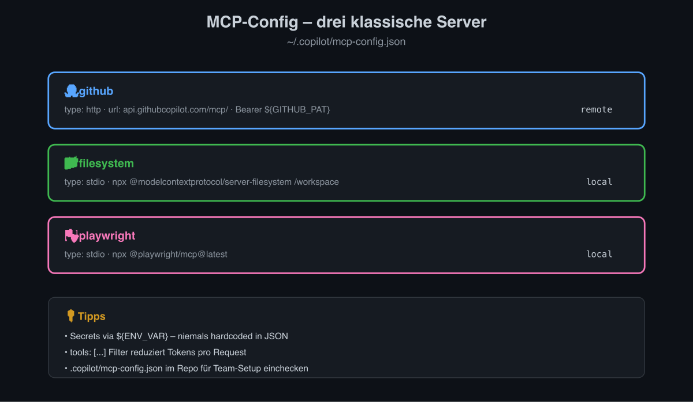

`~/.copilot/mcp-config.json`:

```json
{
  "mcpServers": {
    "github": {
      "type": "http",
      "url": "https://api.githubcopilot.com/mcp/",
      "headers": { "Authorization": "Bearer ${GITHUB_PAT}" }
    },
    "filesystem": {
      "type": "stdio",
      "command": "npx",
      "args": ["-y", "@modelcontextprotocol/server-filesystem", "/workspace"]
    },
    "playwright": {
      "type": "stdio",
      "command": "npx",
      "args": ["-y", "@playwright/mcp@latest"]
    }
  }
}
```

## 10. Headless-Snippets

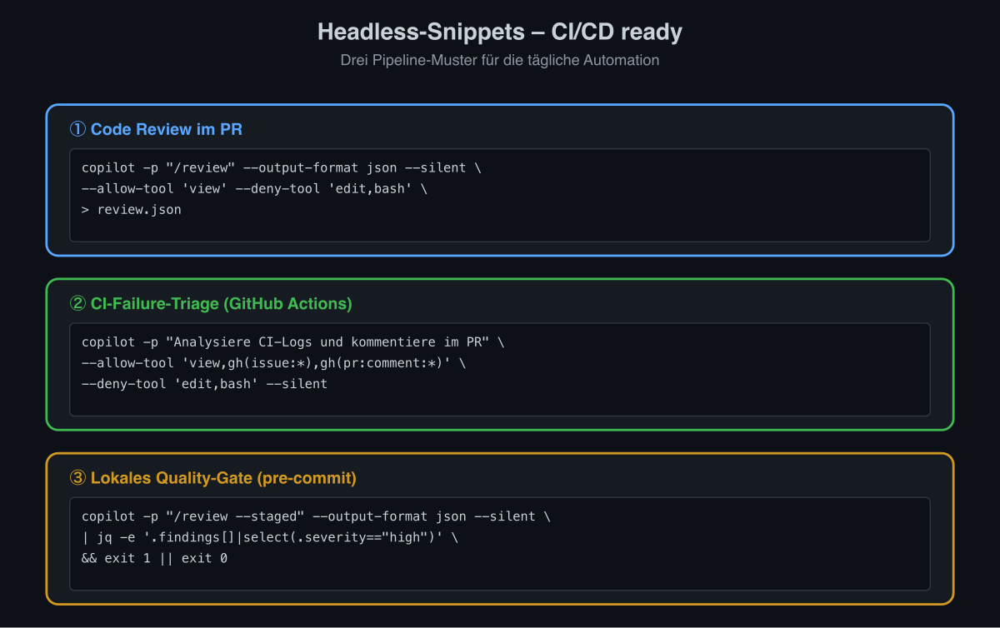

**Code Review im PR:**
```bash
copilot -p "/review" --output-format json --silent \
  --allow-tool 'view' --deny-tool 'edit,bash' \
  > review.json
```

**CI-Failure-Triage in GitHub Actions:**
```bash
copilot -p "Analysiere CI-Logs und kommentiere im PR" \
  --allow-tool 'view,gh(issue:*),gh(pr:comment:*)' \
  --deny-tool 'edit,bash' --silent
```

**Lokales Quality-Gate (pre-commit):**
```bash
copilot -p "/review --staged" --output-format json --silent \
  | jq -e '.findings[]|select(.severity=="high")' && exit 1 || exit 0
```

## 11. Modell-Wahl-Daumenregel

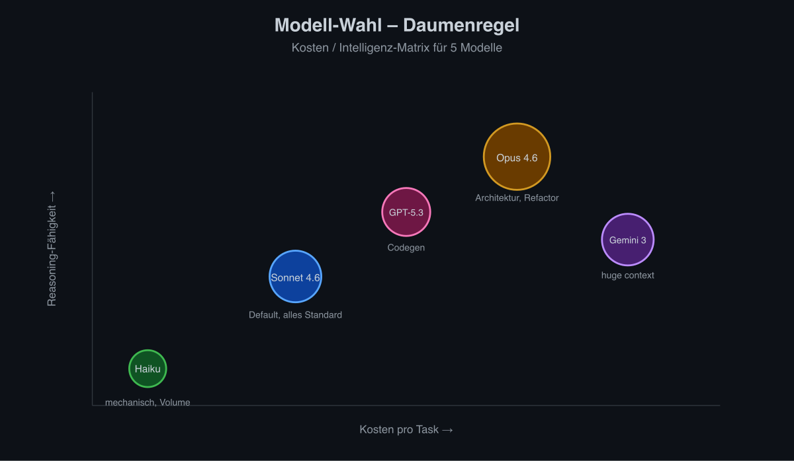

| Modell | Wofür |
|---|---|
| **Claude Haiku 4.5** | Mechanisch, hohes Volumen, billig |
| **Claude Sonnet 4.6** | Default, alles Standard |
| **Claude Opus 4.6** | Architektur, große Refactors, Reasoning |
| **GPT-5.3-Codex** | Codegen-spezifisch |
| **Gemini 3 Pro** | Sehr großer Kontext |

## 12. Troubleshooting Express

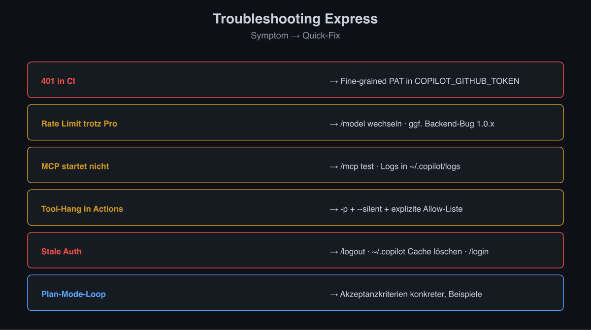

| Symptom | Quick-Fix |
|---|---|
| 401 in CI | Fine-grained PAT in `COPILOT_GITHUB_TOKEN` |
| Rate Limit trotz Pro | `/model` wechseln, ggf. Backend-Bug 1.0.x |
| MCP startet nicht | `/mcp test`, Logs in `~/.copilot/logs` |
| Tool-Hang in Actions | `-p` + `--silent` + explizite Allow-Liste |
| Stale Auth | `/logout` → `~/.copilot` Cache löschen → `/login` |
| Plan-Mode-Loop | Akzeptanzkriterien konkreter, Beispiele geben |

## 13. Sicherheits-Mantras

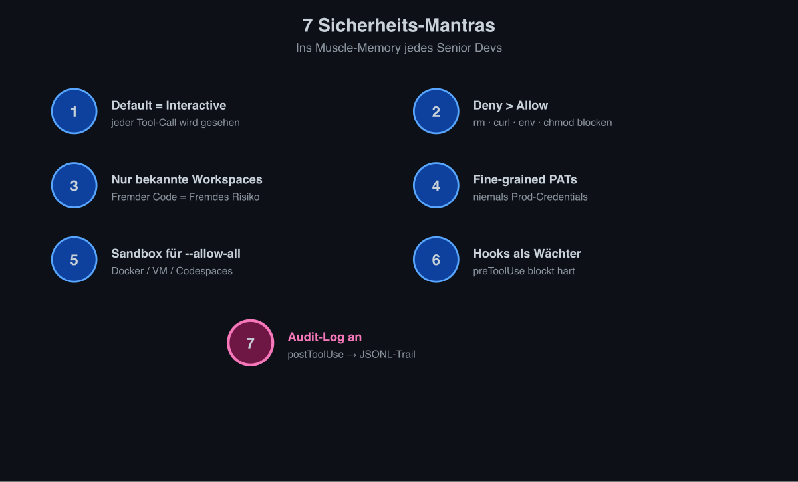

1. **Default = Interactive**.
2. **Deny > Allow** für `rm`, `curl`, `env`, `chmod`.
3. **Trust nur bekannte Workspaces.**
4. **Fine-grained PATs**, niemals Prod-Credentials.
5. **Sandbox** für alles `--allow-all`.
6. **Hooks** als post-tool Wächter.
7. **Audit-Log an.**

## 14. Hidden Gems

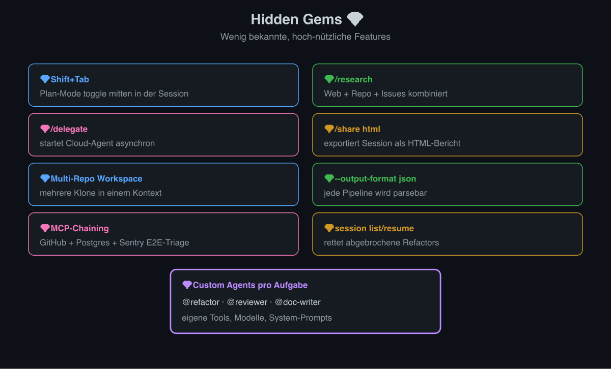

- `Shift+Tab` = Plan-Mode toggle mitten in Session
- `/research` kombiniert Web + Repo + Issues
- `/delegate` startet Cloud-Agent asynchron
- `/share html` exportiert Session als HTML-Bericht
- Multi-Repo: mehrere Klone in einem Workspace
- `--output-format json` macht jede Pipeline parsebar
- MCP-Chaining: GitHub + Postgres + Sentry für Ende-zu-Ende-Triage
- `copilot session list/resume` rettet abgebrochene Refactors
- Custom Agents pro Aufgabe (refactor, reviewer, doc-writer)

---

Weiterführend: [senior_developer_guide](GCC-03-Senior-Developer-Guide) · [installations_und_setup_guide](GCC-02-Installation-und-Setup) · [feature_uebersicht](GCC-01-Feature-Uebersicht) · [agentic_engineering_mcp_security](GCC-04-Agentic-MCP-Security) · [workflows_und_vergleich](GCC-05-Workflows-und-Vergleich)
