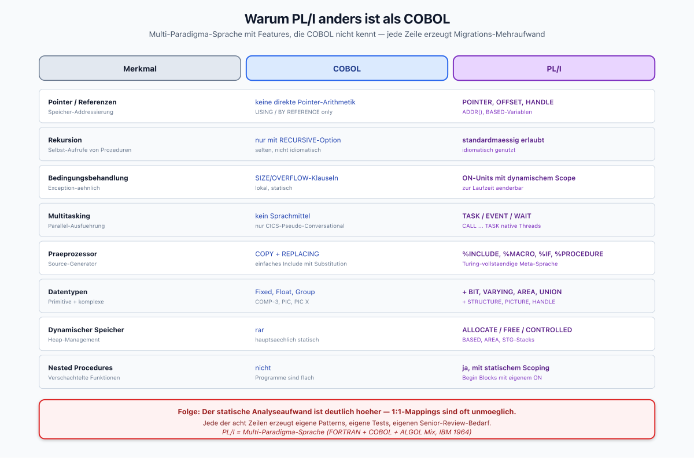
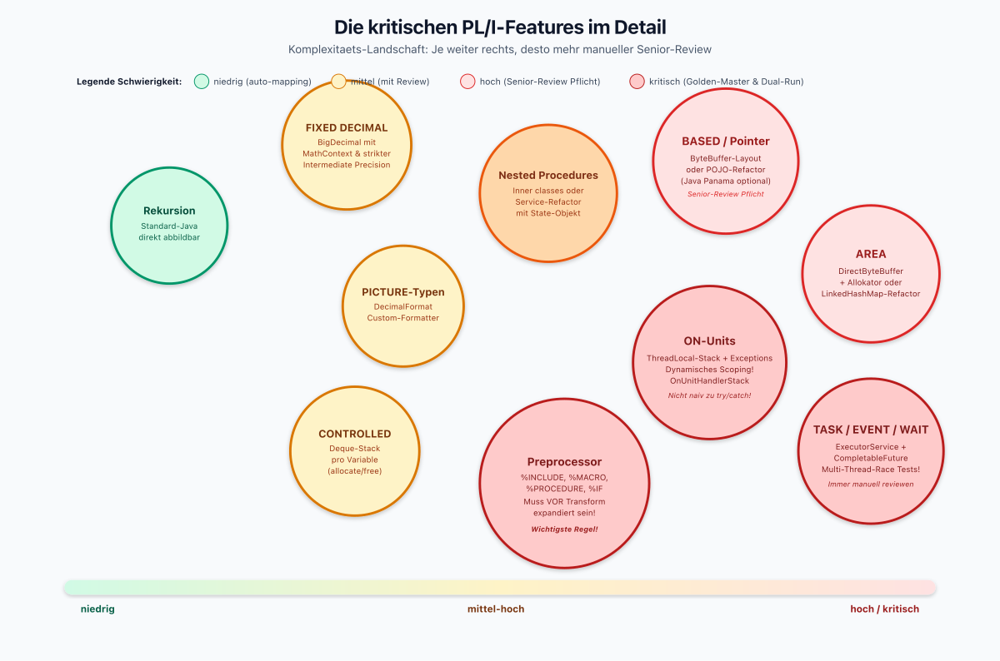
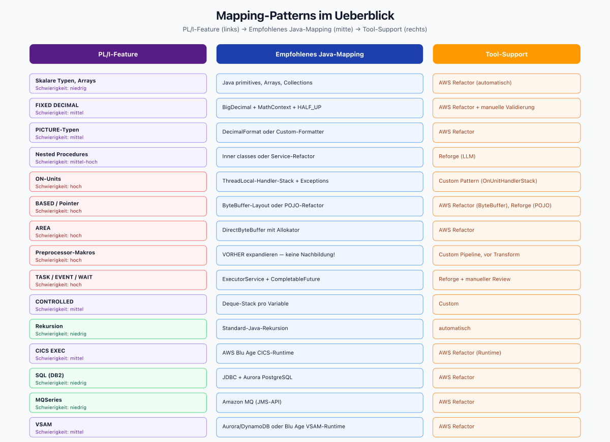
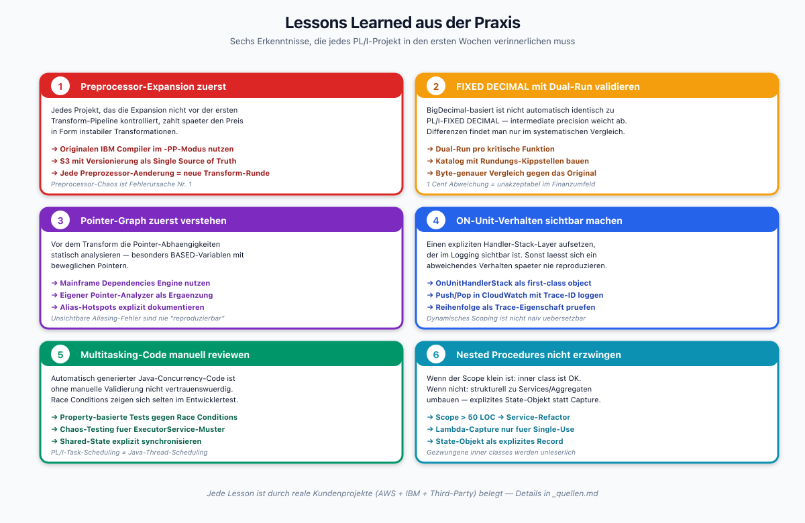
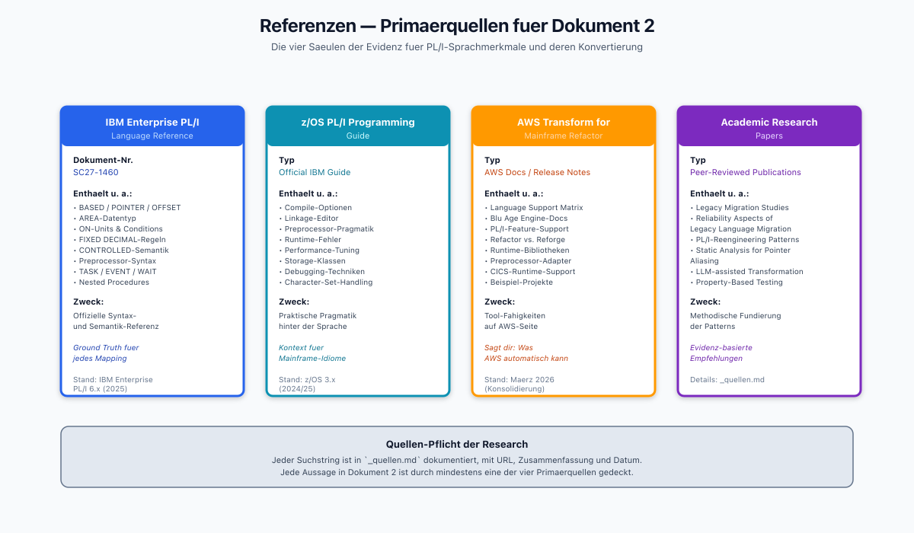

# PL/I-Sprachmerkmale und deren Konvertierung nach Java

> Dokument 2 der PL/I-zu-Java-Research | Stand: April 2026
>
> Dieses Dokument beschreibt die Eigenheiten von PL/I, die eine Migration nach Java **anspruchsvoller** machen als bei COBOL, und zeigt konkrete Mapping-Patterns.

---

## 1. Warum PL/I anders ist als COBOL



*Gegenueberstellung der acht zentralen Sprachmerkmale: Jede Zeile zeigt, wie COBOL ein Thema loest und wie PL/I es loest. Der rote Banner unten fasst zusammen, warum diese Unterschiede den statischen Analyseaufwand dramatisch erhoehen.*

PL/I (Programming Language One) wurde ab 1964 von IBM als Kompromiss zwischen FORTRAN, COBOL und ALGOL entwickelt. Das Resultat ist eine **Multi-Paradigma-Sprache** mit folgenden Eigenschaften, die es in COBOL so nicht gibt:

| Merkmal | COBOL | PL/I |
|---------|-------|------|
| Pointer / Referenzen | keine direkte Pointer-Arithmetik | `POINTER`, `OFFSET`, `HANDLE`, `ADDR()`, `BASED`-Variablen |
| Rekursion | nur mit `RECURSIVE`-Option (selten) | standardmäßig erlaubt, idiomatisch |
| Bedingungsbehandlung | SIZE/OVERFLOW-Klauseln | `ON`-Units (Exception-ähnliches System) |
| Multitasking | kein Sprachmittel | `TASK`, `EVENT`, `WAIT`, `CALL … TASK` |
| Präprozessor | `COPY` + `REPLACING` | vollständiger PL/I-Präprozessor mit `%INCLUDE`, `%MACRO`, `%PROCEDURE`, `%IF` |
| Datentypen | Fixed, Float, Group | zusätzlich `BIT`, `CHARACTER VARYING`, `AREA`, `STRUCTURE`, `UNION`, `PICTURE` |
| Dynamischer Speicher | rar | `ALLOCATE`, `FREE`, `CONTROLLED`, `BASED`, `AREA` |
| Nested Procedures | nicht | ja, mit statischem Scoping |
| Begin Blocks | nicht | ja, mit eigenen Variablen und `ON`-Units |

Diese Features machen den **statischen Analyseaufwand** deutlich höher und verhindern 1:1-Mappings.

---

## 2. Die kritischen Features im Detail



*Karte der kritischen Features nach Schwierigkeitsgrad: links (gruen) die automatisch mappbaren Konstrukte, in der Mitte (gelb) die mit Review, rechts (rot) die kritischen mit Senior-Review-Pflicht. Die Groesse der Blasen deutet den relativen Aufwand an.*

### 2.1 BASED-Variablen und Pointer-Arithmetik

`BASED` ist das PL/I-Äquivalent zu einem typisierten Pointer-Dereference. Beispiel:

```pli
DCL P POINTER;
DCL X FIXED BIN(31) BASED(P);
ALLOCATE X;
X = 42;
```

**Java-Mapping-Strategien:**

1. **Direkt-Mapping auf `ByteBuffer` + Layout-Metadaten.** Wird von AWS Blu Age / Transform for Mainframe Refactor default genutzt, wenn Pointer-Arithmetik erhalten bleiben muss. Vorteil: strukturidentisch. Nachteil: nicht idiomatisch.
2. **Restrukturierung zu Java-Objekten.** Wenn Pointer nur als Referenzen auf Datensätze genutzt werden, Umwandlung in `record`-Typen oder POJOs. Wird von Reforge (LLM-basiert) bevorzugt, erfordert aber manuelle Verifikation des Lebenszyklus.
3. **Off-Heap via `java.lang.foreign` (Panama).** Seit Java 21 stabil. Vorteil: exakte Memory-Semantik. Nachteil: benötigt Senior-Java-Know-how und ist für Fachentwickler schwer lesbar.

**Empfehlung:** Für neu zu refactorende Module primär Option 2, für Legacy-Module mit tiefer Pointer-Nutzung Option 1. Option 3 nur in Performance-Hotspots.

### 2.2 AREA-Datentypen

`AREA` ist ein kontiguer Speicherbereich, in dem `BASED`-Strukturen allokiert werden. Das kennt Java gar nicht.

**Java-Mapping:**
- Standard: `ByteBuffer.allocateDirect(size)` + interner Freelisten-Allokator.
- Für moderne Portierungen: Umformung des AREA-Konzepts zu einer in-memory Collection (`LinkedHashMap<Key, Record>`), wenn die Pointer-Arithmetik nicht essentiell ist.

### 2.3 ON-Units (Bedingungsbehandlung)

`ON`-Units sind PL/Is Antwort auf Exceptions — aber mit einer Besonderheit: sie sind **dynamisch scoped** und können beim Aufruf verändert werden.

```pli
ON ZERODIVIDE BEGIN;
    PUT SKIP LIST('Division durch Null');
    GO TO FEHLER;
END;
```

**Java-Mapping-Strategien:**

| PL/I-Condition | Java-Mapping |
|----------------|--------------|
| `ZERODIVIDE` | `ArithmeticException` |
| `OVERFLOW` / `SIZE` | `ArithmeticException` + BigDecimal-Range-Check |
| `ENDFILE` | `EOFException` bzw. Return-Wert |
| `UNDEFINEDFILE` | `FileNotFoundException` |
| `FIXEDOVERFLOW` | explizite `MathContext`-Prüfung |
| `STORAGE` | `OutOfMemoryError` (Catch-Policy!) |
| `KEY` (VSAM) | Custom `KeyNotFoundException` |
| `RECORD` | I/O-Error |
| `ERROR` / `FINISH` | globaler `Thread.UncaughtExceptionHandler` |
| `CONDITION(name)` | benutzerdefinierte Exceptions |

Das dynamische Scoping lässt sich in Java nur über **ThreadLocal-Stacks von Handlern** nachbilden. AWS Transform Reforge erzeugt hierfür i. d. R. einen Utility-Layer (`OnUnitHandlerStack`) und macht den Kontext explizit.

### 2.4 PICTURE-Datentypen und FIXED DECIMAL

PL/I kennt `PICTURE`-Datentypen (wie COBOL) und `FIXED DECIMAL (p, q)` mit **exakter**, kaufmännischer Arithmetik.

**Java-Mapping:**
- `FIXED DECIMAL` → `BigDecimal` mit explizitem `MathContext` und `RoundingMode.HALF_UP` bzw. dem von PL/I dokumentierten `NEAREST`-Mode.
- `PICTURE 'ZZZ9.99'` → `DecimalFormat` oder String-Formatter.

**Kritischer Fallstrick:** PL/I-`FIXED DECIMAL`-Operationen haben Regeln für **intermediate precision**, die nicht 1:1 zu `BigDecimal` passen. Ergebnis: 1 Cent Abweichung in Kredit-/Zins-Rechnungen — unakzeptabel im Finanzumfeld. Jede FIXED-DECIMAL-Rechnung muss **durch einen Dual-Run** gegen das Original validiert werden.

### 2.5 Präprozessor (%INCLUDE, %MACRO, %PROCEDURE)

Der PL/I-Präprozessor ist eine **eigene Turing-vollständige Sprache** innerhalb von PL/I. Er wird vor der Compilation ausgeführt und erzeugt Source-Code.

Beispiel:
```pli
%DECLARE LIMIT FIXED; %LIMIT = 100;
DCL TABELLE(1:%LIMIT) FIXED BIN(31);
```

**Konsequenzen für Migration:**

1. **Ohne vollständige Preprocessor-Expansion ist jede Transformation instabil.** Das ist die wichtigste Regel.
2. Die Expansion muss reproduzierbar sein — idealerweise mit dem originalen IBM Enterprise PL/I-Compiler im `-PP`-Modus (Precompile-only), damit die Java-Ziel-Codebasis aus demselben expandierten Source entstanden ist, den auch das Original zur Laufzeit verwendet.
3. AWS Blu Age / Transform for Mainframe Refactor hat dafür einen dedizierten Preprocessor-Adapter, der aber je nach Makro-Komplexität manuelles Nachsteuern erfordert.
4. Der Preprocessor kann zur Laufzeit **aktuellen Source-Code erzeugen**, der im Mainframe compiliert und deployed wird. Solche Setups müssen vor der Transform-Phase entfernt oder entschärft werden.

### 2.6 Multitasking (TASK, EVENT, WAIT)

PL/I-OS-Multitasking (nicht zu verwechseln mit dem zustandslosen CICS-Transaction-Processing) nutzt native OS-Prozesse oder -Threads:

```pli
CALL PROZ_A TASK(T1) EVENT(E1);
WAIT(E1);
```

**Java-Mapping:**
- `TASK` → `ExecutorService.submit(...)`.
- `EVENT` → `CompletableFuture` oder `CountDownLatch`.
- `WAIT` → `Future.get()` oder `CompletableFuture.join()`.

**Fallstricke:**
- PL/I-Tasks können geteilte Variablen in Elternprozeduren sehen. In Java muss dieser geteilte Zustand explizit **synchronisiert** werden (`AtomicReference`, `ReentrantLock` etc.).
- Reihenfolge-Annahmen aus der ursprünglichen Mainframe-Scheduling-Semantik gelten unter Java nicht — daher **Property-basierte Tests** gegen Race Conditions.

### 2.7 Nested Procedures und Begin Blocks

PL/I erlaubt verschachtelte Prozeduren mit statischem Scoping:

```pli
HAUPT: PROC OPTIONS(MAIN);
    DCL X FIXED BIN(31);
    INNER: PROC;
        X = X + 1;   /* sieht X aus HAUPT */
    END INNER;
    CALL INNER;
END HAUPT;
```

Nested procedures sehen die Variablen der umgebenden Prozedur — das ist in Java nur mit Lambdas oder inner classes abbildbar und erfordert häufig eine strukturelle Umformung zu **Service-Klassen mit expliziten State-Objekten**.

### 2.8 CONTROLLED und Allocation-Stacks

`CONTROLLED`-Variablen sind Stacks identisch benannter Instanzen, die dynamisch auf- und abgebaut werden:

```pli
DCL TEMP FIXED BIN(31) CONTROLLED;
ALLOCATE TEMP; TEMP = 10;
ALLOCATE TEMP; TEMP = 20;  /* die zweite Instanz beschattet die erste */
FREE TEMP;                  /* jetzt ist TEMP wieder 10 */
```

**Java-Mapping:** Explizite `Deque<Integer>` pro CONTROLLED-Variable, mit Wrapper-Methoden `allocate()`/`free()`. Kein natürliches Äquivalent, daher manueller Review Pflicht.

---

## 3. Mapping-Patterns im Überblick



*15 PL/I-Features und ihre empfohlenen Java-Mappings plus Tool-Support, farblich sortiert nach Schwierigkeit. Diese Tabelle ist die Referenz fuer den technischen Transformations-Plan.*

| PL/I-Feature | Schwierigkeit | Empfohlenes Java-Mapping | Tool-Support |
|-------------|--------------|--------------------------|--------------|
| Skalare Typen, arrays | niedrig | Java primitives, Arrays / Collections | AWS Refactor |
| `FIXED DECIMAL` | mittel | `BigDecimal` mit MathContext | AWS Refactor + manuelle Validierung |
| `PICTURE`-Typen | mittel | `DecimalFormat` / Custom-Formatter | AWS Refactor |
| Nested Procedures | mittel-hoch | Inner classes oder Service-Refactor | Reforge (LLM) |
| `ON`-Units | hoch | ThreadLocal-Handler-Stack + Exceptions | Custom Pattern |
| `BASED`/Pointer | hoch | `ByteBuffer`-Layout oder POJO-Refactor | AWS Refactor (ByteBuffer), Reforge (POJO) |
| `AREA` | hoch | DirectByteBuffer mit Allokator | AWS Refactor |
| Preprocessor-Makros | hoch | vorexpandieren, keine Nachbildung | Custom, vor Transform nötig |
| `TASK`/`EVENT`/`WAIT` | hoch | `ExecutorService` + `CompletableFuture` | Reforge + manueller Review |
| `CONTROLLED` | mittel | `Deque`-Stack pro Variable | Custom |
| Rekursion | niedrig | Standard-Java-Rekursion | automatisch |
| CICS EXEC | mittel | AWS Blu Age CICS-Runtime (für Refactor) | AWS Refactor |
| SQL (DB2) | niedrig | JDBC + Aurora PostgreSQL | AWS Refactor |
| MQSeries | niedrig | Amazon MQ (JMS) | AWS Refactor |
| VSAM | mittel | Aurora/DynamoDB oder Blu Age VSAM-Runtime | AWS Refactor |

---

## 4. Lessons Learned aus der Praxis



*Sechs Lessons Learned als Karten — je mit konkreten Handlungsempfehlungen (→) und einem italicized Praxis-Zitat. Farbcodierung pro Lesson fuer leichte Wiedererkennung in Diskussionen und Reviews.*

1. **Preprocessor-Expansion zuerst.** Jedes PL/I-Projekt, das die Expansion nicht vor der ersten Transform-Pipeline kontrolliert, zahlt später den Preis in Form instabiler Transformationen.
2. **Exakte Dezimalarithmetik mit Dual-Run validieren.** `BigDecimal`-basiert ist nicht automatisch identisch zu PL/I-`FIXED DECIMAL`. Die Differenz findet man nur im systematischen Vergleich gegen das Original.
3. **Pointer-Graph zuerst verstehen.** Vor dem Transform die Pointer-Abhängigkeiten statisch analysieren (mittels AWS Transform Mainframe Dependencies Engine oder eigenen Tools). Besonders `BASED`-Variablen mit beweglichen Pointern.
4. **ON-Unit-Verhalten sichtbar machen.** Einen expliziten Handler-Stack-Layer aufsetzen, der im Logging sichtbar ist. Sonst lässt sich ein abweichendes Verhalten später kaum reproduzieren.
5. **Multitasking-Code immer manuell reviewen.** Automatisch generierter Java-Concurrency-Code ist ohne manuelle Validierung nicht vertrauenswürdig.
6. **Nested Procedures nicht in inner classes erzwingen.** Wenn der Scope klein ist: OK. Wenn nicht: strukturell zu Services/Aggregaten umbauen.

---

## 5. Referenzen



*Die vier Primaerquellen als Buch-Saeulen: IBM Language Reference (SC27-1460), IBM z/OS Programming Guide, AWS Transform for Mainframe Refactor Docs und die Academic Papers zum Legacy-Reengineering. Jede Saeule zeigt Dokument-Typ, Inhalte und Zweck in der Research.*

Alle verwendeten Quellen sind in [_quellen](PTJ-Quellen) dokumentiert. Die zentralen Primärquellen für dieses Dokument sind:
- IBM Enterprise PL/I Language Reference (SC27-1460)
- IBM z/OS PL/I Programming Guide
- AWS Blu Age / AWS Transform for Mainframe Refactor — Language Support Matrix (2025/2026)
- Academic: "Reliability aspects of legacy language migration" (diverse Papers zum Thema PL/I-Reengineering)
