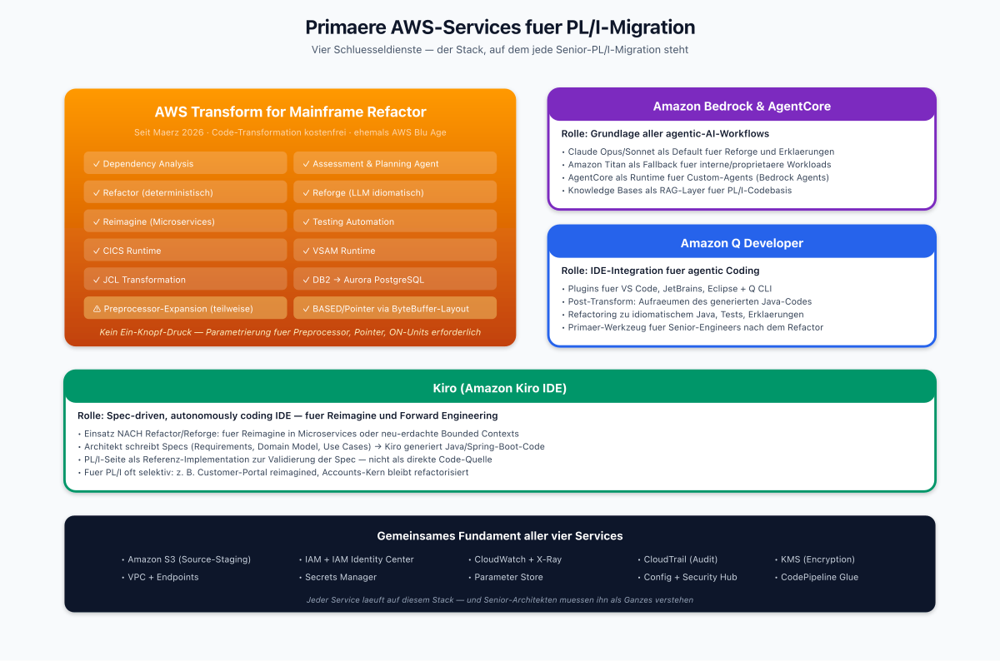
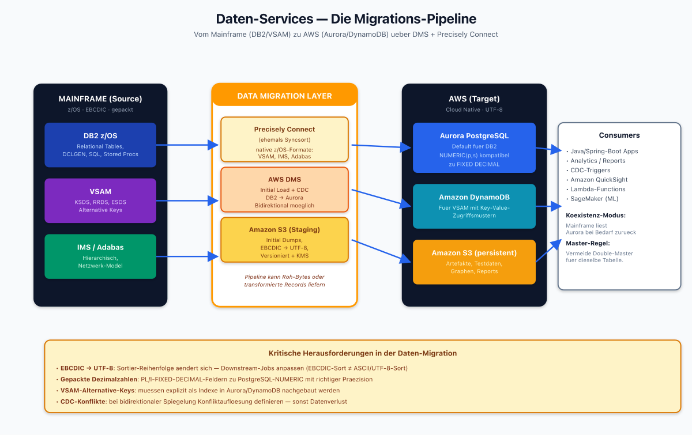
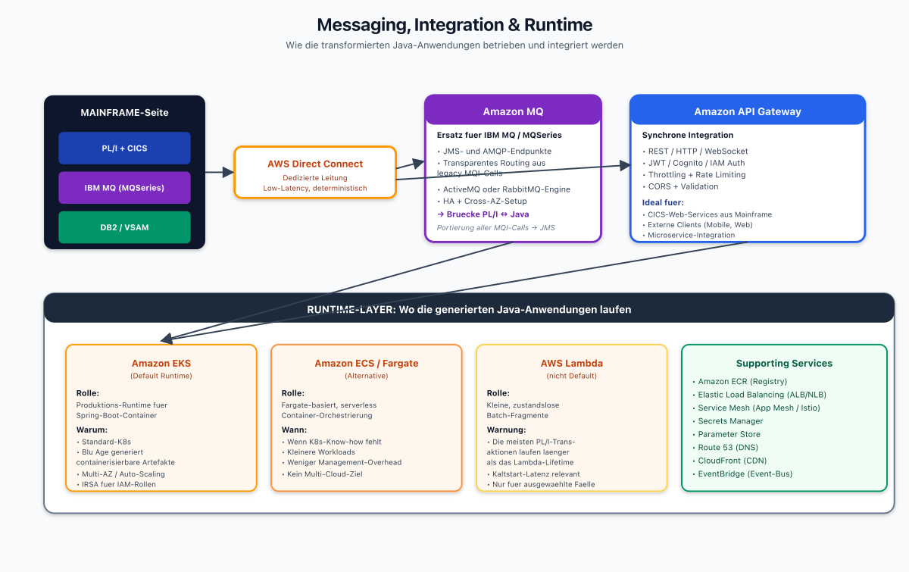
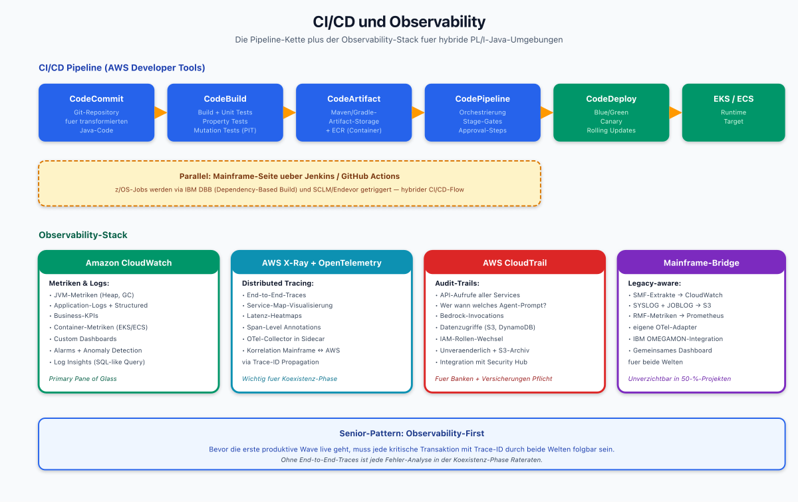
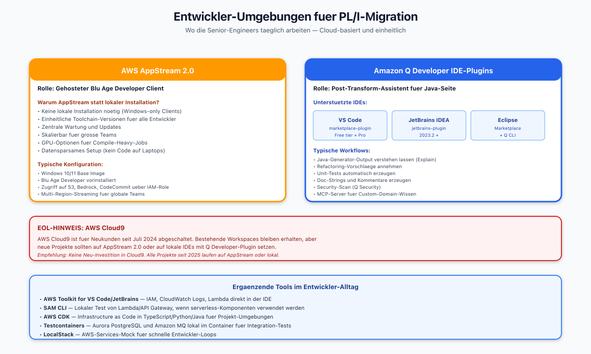
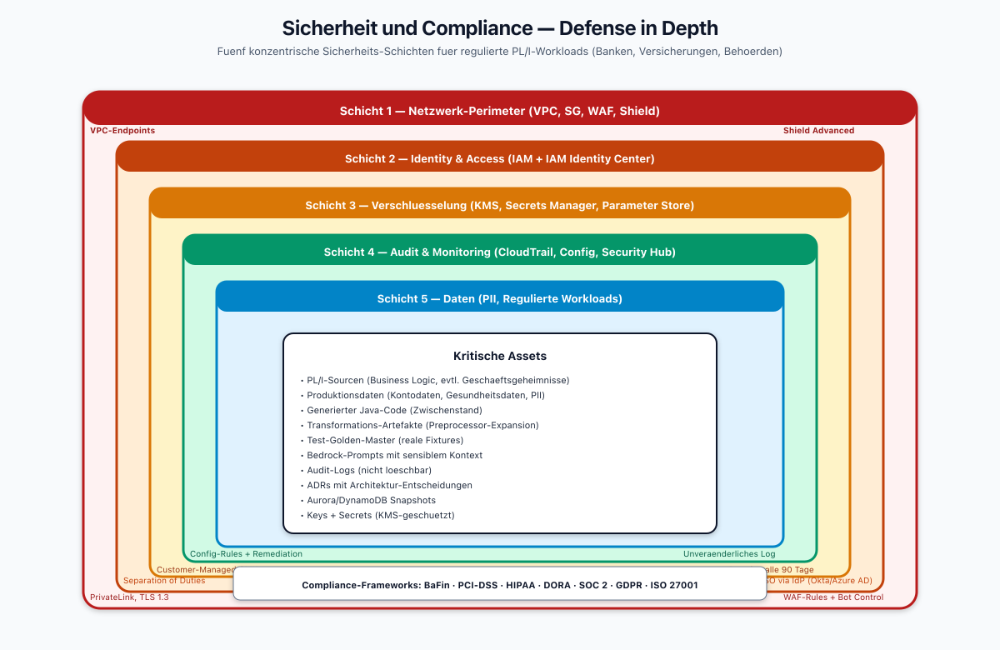
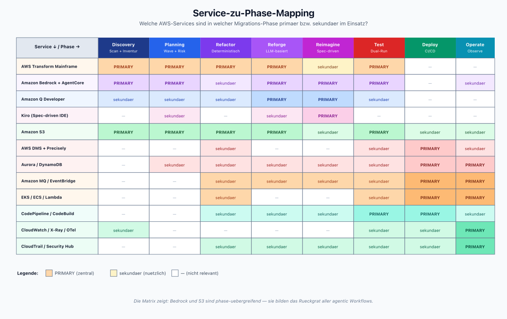
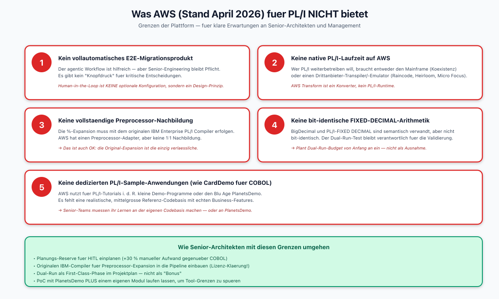
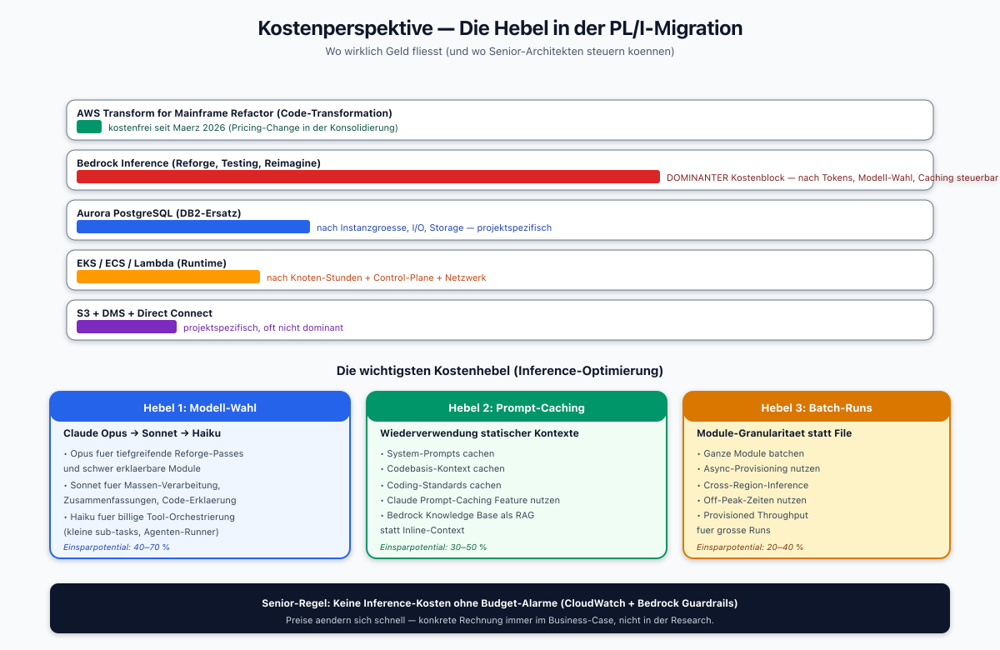
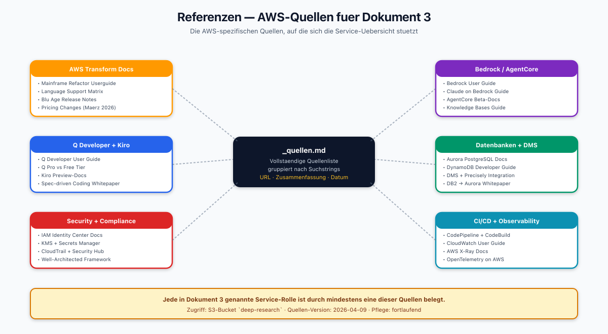

# AWS-Feature-Übersicht für PL/I-Migration

> Dokument 3 der PL/I-zu-Java-Research | Stand: April 2026
>
> Dieses Dokument listet alle AWS-Services, die in einer PL/I-zu-Java-Migration relevant sind, und beschreibt deren Rolle.

---

## 1. Primäre Migrations-Services

*Die vier Kern-Services (AWS Transform for Mainframe Refactor, Amazon Bedrock + AgentCore, Amazon Q Developer, Kiro) plus das gemeinsame Fundament aus S3, IAM, CloudWatch, KMS. Jeder Service hat seine Rolle im Lifecycle — Transform fuer die Code-Konvertierung, Bedrock als AI-Brain, Q als IDE-Assistent, Kiro fuer Reimagine.*

### 1.1 AWS Transform for Mainframe Refactor (ehemals AWS Blu Age)

**Status (April 2026):** Seit März 2026 offiziell unter dem Namen *AWS Transform for Mainframe Refactor* geführt. Die Transformations-Phase ist seither **kostenfrei** — abgerechnet werden nur die darunterliegenden EC2/Bedrock/Storage-Kosten.

**PL/I-Support im Detail:**

| Feature | COBOL | PL/I |
|---------|-------|------|
| Dependency Analysis | ✅ | ✅ |
| Assessment & Planning Agent | ✅ | ✅ |
| Refactor (deterministisch) | ✅ | ✅ |
| Reforge (LLM-basiert idiomatisch) | ✅ | ✅ (neuer) |
| Reimagine (Microservices) | ✅ | ✅ (seit Dez 2025) |
| Testing Automation | ✅ | ✅ |
| CICS Runtime | ✅ | ✅ |
| VSAM Runtime | ✅ | ✅ |
| JCL Transformation | ✅ | ✅ |
| DB2 → Aurora PostgreSQL | ✅ | ✅ |
| Preprocessor-Expansion | n/a | ⚠️ teilweise, je nach Makro-Komplexität manuell |
| BASED/Pointer-Handling | n/a | ✅ via ByteBuffer-Layout |
| Multitasking | n/a | ⚠️ nur mit manuellem Review |

**Wichtig:** Die Transform-Pipeline ist **kein Ein-Knopf-Druck**. Für PL/I muss sie parametriert werden (Preprocessor-Optionen, Pointer-Mapping-Strategy, ON-Unit-Handling).

### 1.2 Amazon Q Developer

Die IDE-Integration für agentic Coding (VS Code, JetBrains, Eclipse, Amazon Q CLI). Für PL/I-Migrationen wird sie primär in der **Post-Transform-Phase** eingesetzt:
- Aufräumen des generierten Java-Codes
- Hinzufügen von Tests
- Refactoring zu idiomatischem Java
- Verständnis von schwer lesbarem generiertem Code durch Erklärung

### 1.3 Amazon Bedrock und Bedrock AgentCore

Die Grundlage jedes agentic-AI-Workflows. Für PL/I:
- **Claude Opus/Sonnet** als Default-Modelle für Reforge und Erklärungen (Anthropic auf Bedrock).
- **Amazon Titan** als Fallback für interne/proprietäre Workloads.
- **Bedrock AgentCore** als Runtime für Custom-Agents (siehe Dokument 4 zu Workflows).
- **Knowledge Bases** zum Speichern der PL/I-Codebasis und referenz-Dokumentation (RAG).

### 1.4 Kiro (Amazon Kiro IDE)

Kiro ist Amazons spec-driven, autonomously coding IDE. Für PL/I-Migration wird Kiro vorrangig **nach** der Refactor/Reforge-Phase eingesetzt: für das **Reimagine** in Microservices oder als Basis für neu-erdachte Bounded Contexts.

---

## 2. Daten-Services

*End-to-End-Datenfluss vom Mainframe (DB2, VSAM, IMS/Adabas) ueber die Migrations-Layer (Precisely Connect, AWS DMS, S3-Staging) zu den AWS-Zielsystemen (Aurora PostgreSQL, DynamoDB, S3 persistent). Der gelbe Warnbanner listet die vier kritischen Herausforderungen: EBCDIC-Konvertierung, gepackte Dezimalen, VSAM-Alternative-Keys und CDC-Konfliktaufloesung.*

### 2.1 Amazon Aurora PostgreSQL

Default-Zielsystem für DB2-Migrationen. PL/I-SQL-Statements (EXEC SQL) werden zu JDBC umgebaut. Besonderheiten:
- DB2-spezifische SQL-Features (ROW-Typ, arrays) müssen gemappt werden.
- Aurora PostgreSQL unterstützt `NUMERIC(p,s)` — direkt kompatibel zu PL/I-`FIXED DECIMAL`.

### 2.2 Amazon DynamoDB

Für VSAM-Migrationen, wenn Key-Value-Zugriffsmuster dominieren. Alternative: Aurora mit Indexed Tables oder Blu Age VSAM-Runtime.

### 2.3 AWS Database Migration Service + Precisely Connect

Für die eigentliche Datenübernahme:
- **Initial Load** + **CDC** (Change Data Capture) von DB2/VSAM nach Aurora/DynamoDB.
- Precisely Connect (ehemals Syncsort) kann native z/OS-Datenformate lesen (VSAM, IMS, Adabas).
- DMS orchestriert den Transfer und kann in Hybrid-Szenarien beide Richtungen abdecken.

### 2.4 Amazon S3

Die Basis für alle Migrations-Artefakte:
- Source-Code-Staging (PL/I-Sourcen, Includes, JCL, Copybooks).
- Expandierte Sourcen nach Preprocessor-Lauf.
- Generierte Java-Sourcen als Zwischenstand.
- Testdaten (auch große Produktionsextrakte).
- Dependency-Graphen und Assessment-Reports.

---

## 3. Messaging, Integration und Runtime

*Die Integration-Layer: Mainframe-Seite (PL/I + CICS + MQ + DB2) verbunden ueber AWS Direct Connect mit der AWS-Seite (Amazon MQ, API Gateway). Darunter der Runtime-Stack mit EKS, ECS/Fargate, Lambda und den Supporting Services (ECR, ALB, Service Mesh, Secrets).*

### 3.1 Amazon MQ

Ersatz für MQSeries (IBM MQ) auf dem Mainframe. Bietet JMS- und AMQP-Endpunkte. Alle PL/I-Anwendungen, die MQI-Calls absetzen, werden nach JMS portiert.

### 3.2 AWS Direct Connect

Unverzichtbar für 50%-Projekte: dedizierte Netzwerk-Verbindung zwischen Mainframe und AWS, niedrige Latenzen für synchrone Aufrufe während der Koexistenzphase.

### 3.3 Amazon EKS / ECS

Runtime für die migrierten Java-Anwendungen. Blu Age generiert standardmäßig Spring-Boot-basierte Container, die auf EKS deployt werden können.

### 3.4 AWS Lambda

Für kleine, zustandslose Batch-Fragmente, die aus PL/I herausgelöst wurden. Nicht der Default — die meisten PL/I-Transaktionen sind langlaufender als das Lambda-Lifetime-Limit.

---

## 4. CI/CD und Observability

*Oben die CI/CD-Kette (CodeCommit → CodeBuild → CodeArtifact → CodePipeline → CodeDeploy → EKS) mit paralleler Mainframe-Spur (Jenkins/GitHub Actions). Unten der Observability-Stack mit CloudWatch, X-Ray/OpenTelemetry, CloudTrail und der Mainframe-Bridge fuer hybride Szenarien. Senior-Pattern: Observability-First.*

### 4.1 AWS CodeCommit / CodeBuild / CodePipeline / CodeArtifact

Die Standard-CI/CD-Kette. Für PL/I-Projekte mit hybriden Stacks (Mainframe + AWS) typischerweise ergänzt durch Jenkins- oder GitHub-Actions-Integration für die Mainframe-Seite.

### 4.2 Amazon CloudWatch, X-Ray, OpenTelemetry

Für Observability. Besonders wichtig in der Koexistenz-Phase: korrelierte Traces zwischen Mainframe-Transaktionen und Java-Services. Requires OpenTelemetry-Instrumentierung der generierten Java-Klassen.

### 4.3 AWS CloudTrail

Für Audit-Trails regulierter Workloads (Banken, Versicherungen).

---

## 5. Entwickler-Umgebungen

*Die zwei Haupt-Umgebungen fuer Senior-Engineers: AppStream 2.0 (gehosteter Blu Age Developer Client) und Amazon Q Developer IDE-Plugins (VS Code, JetBrains, Eclipse). Darunter der EOL-Hinweis zu Cloud9 und die ergaenzenden Tools (AWS Toolkit, SAM CLI, CDK, Testcontainers, LocalStack).*

### 5.1 AWS AppStream 2.0

Hier läuft der Blu Age Developer Client. Vorteil: keine lokale Installation, einheitliche Toolchain-Versionen für das gesamte Team.

### 5.2 Amazon Q Developer IDE-Plugins

In der Post-Transform-Phase für VS Code, JetBrains IDEA, Eclipse.

### 5.3 Cloud9 (EOL-Hinweis)

AWS Cloud9 ist für Neukunden seit Juli 2024 abgeschaltet. Nicht mehr für neue Projekte verwenden.

---

## 6. Sicherheit und Compliance

*Fuenf konzentrische Schichten nach dem Defense-in-Depth-Prinzip: Netzwerk-Perimeter, Identity &amp; Access, Verschluesselung, Audit &amp; Monitoring, Daten. Im Zentrum die kritischen Assets (PL/I-Sourcen, Produktionsdaten, ADRs, Keys). Am Rand die relevanten Compliance-Frameworks (BaFin, PCI-DSS, HIPAA, DORA, SOC 2, GDPR, ISO 27001).*

### 6.1 AWS IAM und IAM Identity Center

Rollen-Trennung zwischen Transform-Service-Accounts, Entwickler-Accounts und Produktions-Accounts. Kritisch, weil die generierten Java-Anwendungen oft Zugriff auf Produktionsdaten bekommen sollen.

### 6.2 AWS Secrets Manager / Parameter Store

Für Datenbank-Zugangsdaten (Aurora), MQ-Credentials, Zertifikate.

### 6.3 AWS KMS

Verschlüsselung von Source-Code im S3, Datenbanken, Backups. Für regulierte Umgebungen (PCI, HIPAA, BaFin): Kundengesteuerte CMKs verwenden.

### 6.4 AWS Config + Security Hub

Compliance-Überwachung der neuen Java-Infrastruktur.

---

## 7. Service-zu-Phase-Mapping

*Matrix mit 12 Services (Zeilen) und 8 Phasen (Spalten): PRIMARY = dunkler Zellton, sekundaer = heller Zellton, — = nicht relevant. Das visuelle Muster macht sofort sichtbar, dass Bedrock und S3 phase-uebergreifend das Rueckgrat aller agentic Workflows bilden.*

| Phase | Primäre Services | Sekundäre Services |
|-------|------------------|---------------------|
| **Discovery** | AWS Transform Assessment, S3, Bedrock | CloudWatch, Q Developer |
| **Planning** | AWS Transform Planning Agent, Bedrock AgentCore | Q Developer |
| **Transform (Refactor)** | AWS Transform for Mainframe Refactor, Bedrock, S3 | EC2 (AppStream) |
| **Transform (Reforge)** | AWS Transform Reforge, Bedrock (Claude) | S3, Q Developer |
| **Transform (Reimagine)** | Kiro, Bedrock, AgentCore | Q Developer |
| **Test** | AWS Transform Testing Automation, Bedrock | CodeBuild, EKS (Testumgebung) |
| **Data Migration** | AWS DMS, Precisely Connect, S3 | Aurora, DynamoDB |
| **Deploy** | CodePipeline, ECR, EKS, ECS | CloudFormation/CDK |
| **Operate** | CloudWatch, X-Ray, CloudTrail, Security Hub | Config, GuardDuty |

---

## 8. Was AWS (Stand April 2026) für PL/I NICHT bietet

*Fuenf konkrete Grenzen als Karten visualisiert: keine E2E-Automatik, keine native PL/I-Runtime, keine komplette Preprocessor-Nachbildung, keine bit-identische FIXED DECIMAL, keine PL/I-CardDemo. Der gruene Banner unten fasst die Senior-Gegenmassnahmen zusammen.*

Zur klaren Erwartungshaltung einige Grenzen:

1. **Kein vollautomatisches Ende-zu-Ende-Migrationsprodukt.** Der agentic Workflow ist hilfreich, aber Senior-Engineering bleibt Pflicht.
2. **Keine native PL/I-Laufzeit auf AWS.** Wer PL/I weiterbetreiben will, braucht entweder den Mainframe (Koexistenz) oder einen Drittanbieter-Transpiler/-Emulator.
3. **Keine PL/I-Preprocessor-vollständige-Nachbildung.** Die Expansion muss mit dem originalen Compiler erfolgen.
4. **Keine Garantie bit-identischer FIXED-DECIMAL-Arithmetik.** Der Dual-Run-Test bleibt verantwortlich.
5. **Keine dedizierten PL/I-Sample-Anwendungen (wie CardDemo für COBOL).** AWS nutzt für Tutorials i. d. R. kleine PL/I-Demo-Programme oder den Blu Age PlanetsDemo.

---

## 9. Kostenperspektive

*Oben die relative Kostenstruktur als Balken (Bedrock Inference = DOMINANTER Block; Transform-Service = kostenfrei seit Maerz 2026). Unten die drei wichtigsten Hebel: Modell-Wahl (Opus/Sonnet/Haiku), Prompt-Caching, Batch-Runs — mit typischen Einsparpotentialen pro Hebel.*

Preise ändern sich schnell; eine konkrete Rechnung gehört in den Business Case. Als Orientierung (April 2026):

- **AWS Transform for Mainframe Refactor (Code-Transformation):** kostenfrei seit März 2026.
- **Bedrock Inference:** nach Tokens, dominanter Kostenblock bei Reforge und Reimagine.
- **Aurora PostgreSQL:** nach Instanzgröße und I/O.
- **EKS:** nach Knoten-Stunden + Control-Plane-Fee.
- **S3 / DMS / Direct Connect:** projektspezifisch, oft nicht dominanter Posten.

Der größte Kostenhebel ist die **Inference-Optimierung**: Batch-Runs, Prompt-Caching und Nutzung kleinerer Modelle (Sonnet/Haiku) für nicht-kritische Sub-Agents.

---

## 10. Referenzen

*Sechs AWS-Quellenkategorien (Transform Docs, Bedrock/AgentCore, Q Developer + Kiro, Datenbanken + DMS, Security + Compliance, CI/CD + Observability) stroemen in [_quellen](PTJ-Quellen) zusammen. Jede Service-Aussage in Dokument 3 ist durch mindestens eine dieser Quellen belegt.*

Siehe [_quellen](PTJ-Quellen).
