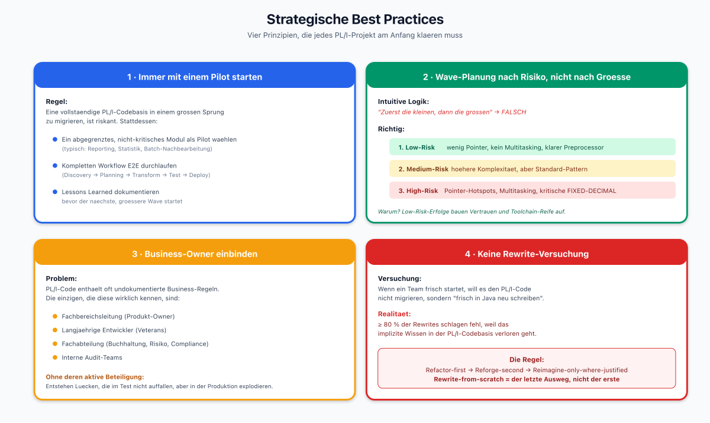
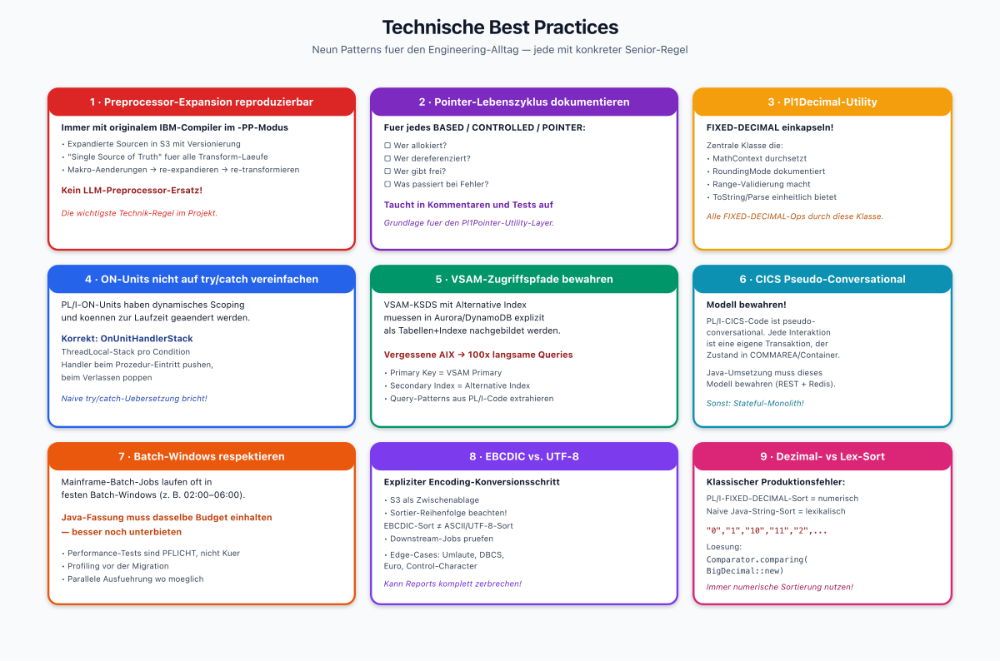
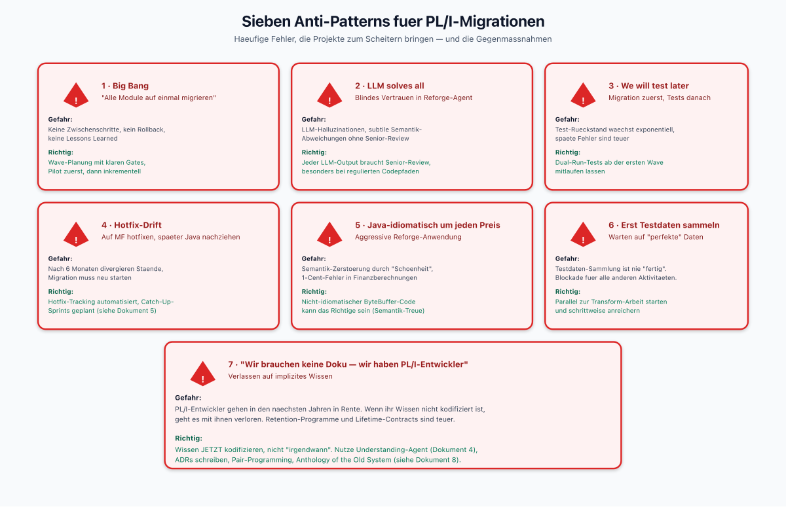
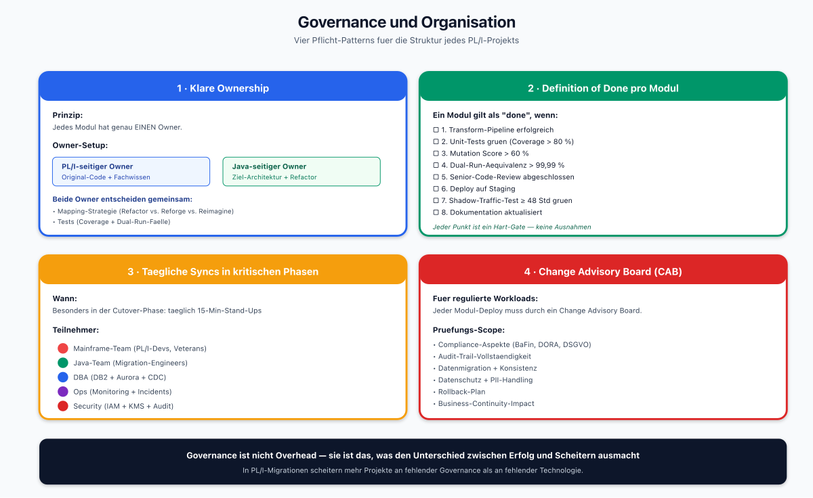
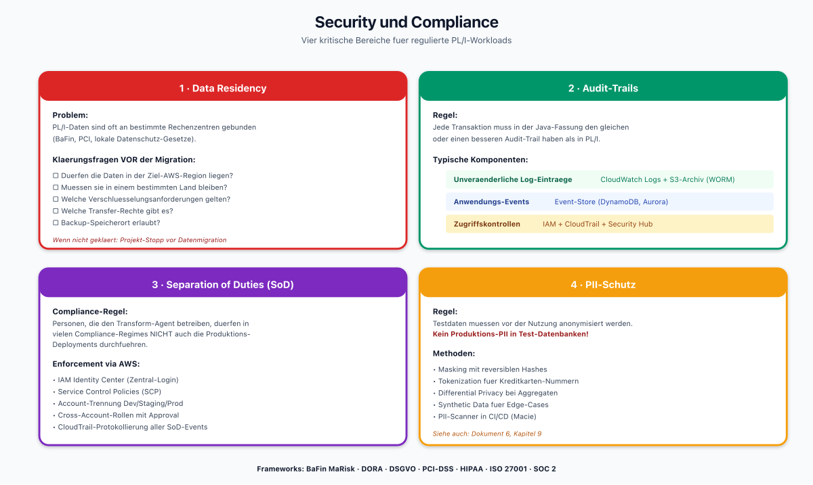
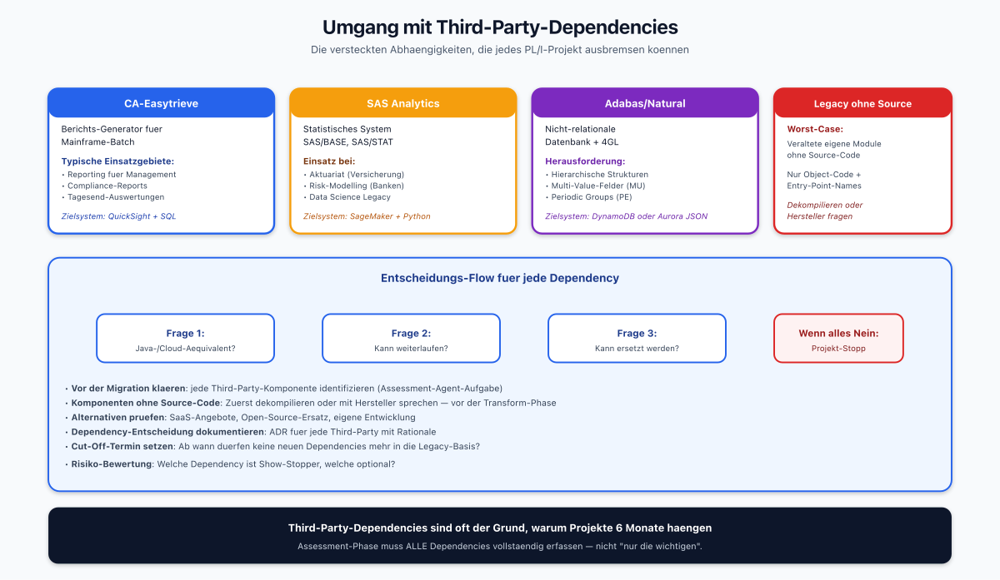
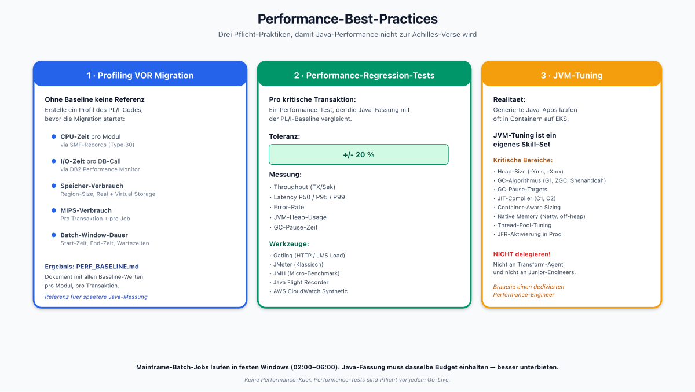
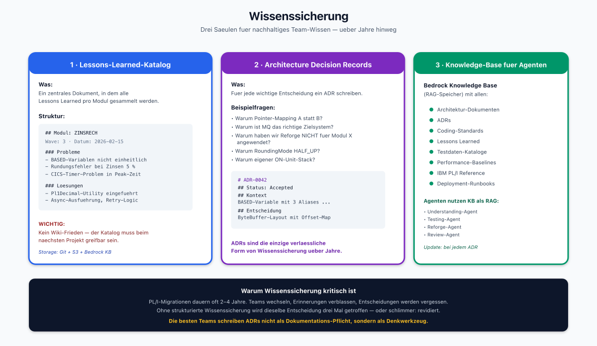
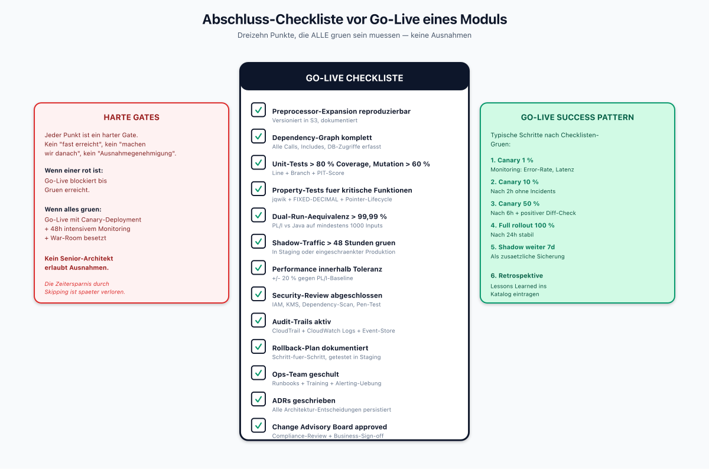
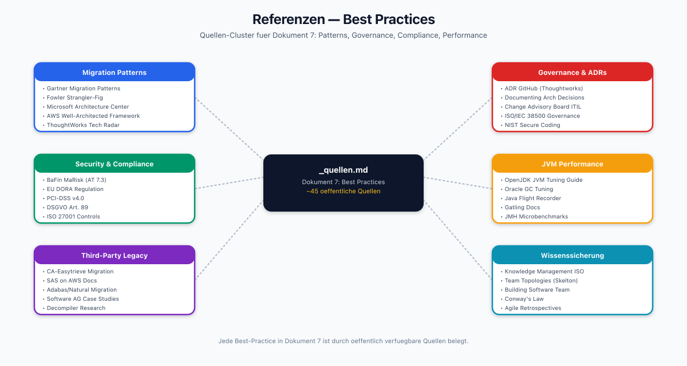

# Best Practices für PL/I-zu-Java-Migration

> Dokument 7 der PL/I-zu-Java-Research | Stand: April 2026
>
> Dieses Dokument sammelt PL/I-spezifische Best Practices und Fallstricke. Es ist als fortlaufende Referenz gedacht, nicht zum Einmal-Lesen.

---

## 1. Strategische Best Practices

*Vier Pillar-Karten: Pilot-First, Wave-by-Risk, Business-Owner einbinden, Rewrite als letzter Ausweg. Jede mit konkreten Handlungsempfehlungen und visuellen Beispielen (Risk-Matrix, Rollen-Bullets).*

### 1.1 Immer mit einem Pilot starten

Eine vollständige PL/I-Codebasis in einem großen Sprung zu migrieren, ist riskant. Empfehlung:
1. Ein **abgegrenztes, nicht-kritisches** Modul als Pilot wählen (typisch: Reporting, Statistik, Batch-Nachbearbeitung).
2. Den kompletten Workflow (Discovery → Planning → Transform → Test → Deploy) an diesem Modul **end-to-end** durchlaufen.
3. Lessons Learned dokumentieren, bevor der nächste, größere Wave startet.

### 1.2 Wave-Planung nach Risiko, nicht nach Größe

Intuitiv klingt "zuerst die kleinen, dann die großen". In PL/I-Projekten ist das **falsch**. Richtig:
1. Zuerst die Module mit **geringem Risiko** (wenig Pointer, kein Multitasking, klarer Preprocessor).
2. Dann die **mittleren** (höhere Komplexität, aber noch mit Standard-Pattern lösbar).
3. Zuletzt die **hochriskanten** (Pointer-Hotspots, Multitasking, regulatorisch kritische FIXED-DECIMAL-Operationen).

### 1.3 Business-Owner einbinden

PL/I-Code enthält oft undokumentierte Business-Regeln. Die einzigen, die diese wirklich kennen, sind die Fachbereichsleitungen und die langjährigen Entwickler. Ohne deren aktive Beteiligung entstehen Lücken, die im Test nicht auffallen.

### 1.4 Keine Rewrite-Versuchung

Wenn ein Team frisch startet, ist die Versuchung groß, den PL/I-Code nicht zu migrieren, sondern "frisch in Java neu zu schreiben" (Rewrite-from-scratch). Das schlägt in > 80 % der Fälle fehl, weil das implizite Wissen in der PL/I-Codebasis verloren geht. Die Regel:

> **Refactor-first, Reforge-second, Reimagine-only-where-justified. Rewrite-from-scratch ist der letzte Ausweg.**

---

## 2. Technische Best Practices

*Neun Patterns als Karten in 3x3-Grid: Preprocessor-Expansion, Pointer-Lifecycle, Pl1Decimal-Utility, ON-Units (kein try/catch), VSAM-AIX, CICS Pseudo-Conversational, Batch-Windows, EBCDIC/UTF-8, Dezimal-Sort. Jede mit konkreter Regel und Warnung.*

### 2.1 Preprocessor-Expansion reproduzierbar machen

1. Immer mit dem **originalen IBM Enterprise PL/I Compiler** im `-PP`-Modus expandieren.
2. Die expandierten Sourcen in S3 mit Versionierung ablegen.
3. Diese expandierten Sourcen sind ab sofort die **Single Source of Truth** für alle Transform-Läufe.
4. Änderungen an den Präprozessor-Makros werden über die **originale** Mainframe-Pipeline nachgepflegt und re-expandiert. Der Java-Zielcode wird dann neu transformiert.

### 2.2 Pointer-Lebenszyklus explizit dokumentieren

Für jede `BASED`-Variable und jede `CONTROLLED`-Variable:
- Wer allokiert?
- Wer dereferenziert?
- Wer gibt frei?
- Was passiert bei Fehler?

Diese Doku ist Pflicht, weil sie in der Java-Version in **Kommentaren und Tests** auftauchen muss.

### 2.3 FIXED-DECIMAL-Mathematik einkapseln

Statt überall im Code `BigDecimal`-Operationen zu verstreuen, eine **zentrale Utility-Klasse** (`Pl1Decimal`, `Money`, etc.) erstellen, die:
- den MathContext durchsetzt,
- den RoundingMode explizit dokumentiert,
- Validierung der Ranges durchführt,
- einen einheitlichen ToString-/Parse-Mechanismus bietet.

Alle FIXED-DECIMAL-Operationen laufen durch diese Klasse.

### 2.4 ON-Units nicht auf try/catch vereinfachen

Es ist verführerisch, ON-Units nach Java-`try/catch` zu übersetzen. Aber: PL/I-ON-Units haben **dynamisches Scoping** und können zur Laufzeit geändert werden. Wenn diese Semantik im Original ausgenutzt wird, bricht die naive Übersetzung.

**Korrekter Ansatz:** Ein `OnUnitHandlerStack` pro Thread, der den aktuellen Handler pro Bedingung hält. Beim Eintritt in eine Prozedur werden die relevanten Handler gepusht, beim Verlassen gepoppt.

### 2.5 VSAM-Zugriffspfade bewahren

VSAM-KSDS (Key-Sequenced) mit Alternative Index müssen in Aurora/DynamoDB explizit als Tabellen+Indexe nachgebildet werden. Vergessene Alternativschlüssel führen zu 100-fach langsameren Queries.

### 2.6 CICS-Pseudo-Conversational-Modell erhalten

PL/I-CICS-Code ist oft **pseudo-conversational**: jede Interaktion ist eine eigene Transaktion, der Zustand wird in COMMAREA oder im Container gespeichert. Die Java-Umsetzung muss dieses Modell bewahren — sonst wird aus einem einfachen Screen-Flow ein komplexes Stateful-Service.

### 2.7 Batch-Windows respektieren

Mainframe-Batch-Jobs laufen oft in einem festen **Batch-Window** (z. B. 02:00–06:00 Uhr). Die Java-Fassung muss dasselbe Zeitbudget einhalten — oder besser noch unterbieten. Performance-Tests sind Pflicht, nicht Kür.

### 2.8 Zeichensätze beachten: EBCDIC vs. UTF-8

PL/I-Daten auf z/OS sind oft EBCDIC-kodiert. Bei der Migration:
- Expliziter Encoding-Konversionsschritt (S3 als Zwischenablage).
- Sortier-Reihenfolge beachten: EBCDIC-Sort ≠ ASCII-Sort ≠ UTF-8-Sort. Wenn die Java-Fassung eine andere Reihenfolge liefert, bricht die Downstream-Verarbeitung.
- Edge-Cases: nationale Zeichen (Umlaute, japanische DBCS), Euro-Zeichen, nicht-druckbare Control-Character.

### 2.9 Dezimal-Sort vs. Lexikalischer Sort

PL/I-`FIXED DECIMAL`-Sortierung ist numerisch. Eine naive Java-String-Sortierung ("0", "1", "10", "11", "2", ...) ist lexikalisch. Das ist ein **klassischer Produktionsfehler**. Immer `Comparator.comparing(BigDecimal::new)` oder direkt numerische Sortierung nutzen.

---

## 3. Anti-Patterns

*Sieben rote Warnkarten: Big Bang, LLM solves all, We will test later, Hotfix-Drift, Java-idiomatisch um jeden Preis, Erst Testdaten sammeln, Wissen nur in Koepfen. Jede Karte mit Gefahr und "Richtig:"-Block.*

### 3.1 "Big Bang"

Alle Module auf einmal migrieren. Gefahr: keine Zwischenschritte, kein Rollback, keine Lessons Learned.

### 3.2 "LLM solves all"

Blindes Vertrauen in den Reforge-Agent. Jeder LLM-Output braucht einen Senior-Review, besonders bei regulierten Codepfaden.

### 3.3 "We will test later"

Migration zuerst, Tests danach. In PL/I-Projekten ein direkter Weg ins Chaos. Dual-Run-Tests müssen **ab der ersten Wave** mitlaufen.

### 3.4 "Hotfix auf dem Mainframe, später auf Java nachziehen"

Ohne Disziplin entsteht schnell eine Backlog aus Hotfixes, die nicht mehr auf die Java-Seite kommen. Nach sechs Monaten divergieren die beiden Stände so weit, dass die Migration effektiv neu starten muss.

### 3.5 "Java-idiomatisch um jeden Preis"

Zu aggressive Reforge-Anwendung kann die Semantik zerstören. Manchmal ist nicht-idiomatischer Java-Code (z. B. ByteBuffer-Layouts) das **Richtige**, weil er die Semantik bewahrt.

### 3.6 "Lasst uns erst die Testdaten sammeln"

Testdaten-Sammlung ist nie "fertig". Parallel zur Transform-Arbeit starten — und frühzeitig mit weniger Daten arbeiten. Warten auf "perfekte" Testdaten ist eine Ausrede.

### 3.7 "Unser Team hat PL/I-Entwickler, wir brauchen keine Doku"

PL/I-Entwickler gehen in den nächsten Jahren in Rente. Wissen muss **jetzt** kodifiziert werden, nicht "irgendwann".

---

## 4. Governance und Organisation

*Vier Karten: Klare Ownership (PL/I- und Java-Owner), Definition of Done (8 Pflicht-Gates), Taegliche Syncs (5 Rollen), Change Advisory Board (Scope). Unten die Senior-Weisheit: Governance ist kein Overhead.*

### 4.1 Klare Ownership

Jedes Modul hat genau einen Owner (PL/I-seitig + Java-seitig). Owner entscheidet über Mapping-Strategie, Tests, Deploy.

### 4.2 Definition of Done pro Modul

Ein Modul gilt als **done**, wenn:
1. Transform-Pipeline erfolgreich
2. Unit-Tests grün (Coverage > 80 %, Mutation Score > 60 %)
3. Dual-Run-Äquivalenz > 99,99 %
4. Code-Review durch Senior abgeschlossen
5. Deploy auf Staging
6. Shadow-Traffic-Test (mindestens 48 Stunden)
7. Dokumentation aktualisiert

### 4.3 Tägliche Syncs in kritischen Phasen

Besonders in der Cutover-Phase: tägliche 15-Min-Stand-Ups mit Mainframe-Team, Java-Team, DBA, Ops, Security.

### 4.4 Change Advisory Board

Für regulierte Workloads: jeder Modul-Deploy muss durch ein Change Advisory Board, das auch die Compliance-Aspekte prüft (Audit-Trail, Datenmigration, Datenschutz).

---

## 5. Security und Compliance

*Vier Karten fuer die kritischen Bereiche: Data Residency (Region-Fragen), Audit-Trails (drei Komponenten), Separation of Duties (via IAM/SCP), PII-Schutz (Anonymisierungs-Methoden). Frameworks-Liste unten.*

### 5.1 Data Residency

PL/I-Daten sind oft an bestimmte Rechenzentren gebunden (BaFin, PCI, lokale Datenschutz-Gesetze). Vor der Migration klären:
- Dürfen die Daten in der Ziel-AWS-Region liegen?
- Müssen sie in einem bestimmten Land bleiben?
- Welche Verschlüsselungsanforderungen gelten?

### 5.2 Audit-Trails

Jede Transaktion muss in der Java-Fassung den gleichen oder einen besseren Audit-Trail haben als in PL/I. Üblicherweise:
- Unveränderliche Log-Einträge in CloudWatch Logs (+ S3-Archiv).
- Anwendungs-Events in einem Event-Store (DynamoDB, Aurora).
- Zugriffskontrollen per IAM mit CloudTrail.

### 5.3 Separation of Duties

Die Personen, die den Transform-Agent betreiben, dürfen in vielen Compliance-Regimes **nicht** auch die Produktions-Deployments durchführen. AWS IAM Identity Center + Service Control Policies enforcen diese Trennung.

### 5.4 PII-Schutz

Testdaten müssen vor der Nutzung anonymisiert werden. Kein Produktions-PII in Test-Datenbanken.

---

## 6. Umgang mit Third-Party-Dependencies

*Oben vier typische Third-Parties (CA-Easytrieve, SAS, Adabas/Natural, Legacy ohne Source) mit Zielsystemen. Unten der Entscheidungs-Flow mit drei Fragen (Aequivalent? Weiterlaufen? Ersetzen?) und den kritischen Senior-Regeln.*

PL/I-Anwendungen nutzen oft Third-Party-Komponenten:
- **CA-Easytrieve** für Reports
- **SAS** für Analytics
- **Adabas/Natural** für nicht-relationale Datenbanken
- **Veraltete eigene Module** ohne Source-Code

Vor der Migration klären:
- Gibt es Java-/Cloud-Äquivalente?
- Kann die Komponente neben der Java-Seite weiterlaufen?
- Kann sie ersetzt werden?

Für Komponenten ohne Source-Code: **Zuerst dekompilieren oder mit dem Originalhersteller sprechen**, bevor die Transform-Phase startet.

---

## 7. Performance-Best-Practices

*Drei vertikale Saeulen: Profiling VOR Migration (CPU, I/O, Speicher, MIPS), Performance-Regression-Tests (Toleranz +/- 20 %, Tools), JVM-Tuning (kritische Bereiche, nicht delegieren). Unten die Batch-Window-Regel.*

### 7.1 Profiling vor der Migration

Ein Profil des PL/I-Codes (CPU-Zeit, I/O-Zeit, Speicher) erstellen, bevor die Migration startet. Ohne Baseline gibt es keine Referenz für die Java-Seite.

### 7.2 Performance-Regression-Tests

Für jede kritische Transaktion ein Performance-Test, der die Java-Fassung mit der PL/I-Baseline vergleicht. Toleranz: typisch +/- 20 %.

### 7.3 JVM-Tuning

Die generierten Java-Anwendungen laufen oft in Container auf EKS. JVM-Tuning (Heap, GC, JIT) ist ein eigener Skill — nicht delegieren an den Transform-Agent.

---

## 8. Wissenssicherung

*Drei Saeulen: Lessons-Learned-Katalog (mit Beispiel-Struktur), Architecture Decision Records (mit ADR-Template), Knowledge-Base fuer Agenten (Bedrock KB mit allen Artefakten als RAG). Unten die Motivation.*

### 8.1 Lessons-Learned-Katalog

Ein zentrales Dokument, in dem alle Lessons Learned pro Modul gesammelt werden. Kein Wiki-Frieden — der Katalog muss beim nächsten Projekt greifbar sein.

### 8.2 Architecture Decision Records (ADRs)

Für jede wichtige Entscheidung ein ADR schreiben:
- Warum haben wir Pointer-Mapping A statt B gewählt?
- Warum ist MQ das richtige Zielsystem?
- Warum haben wir Reforge nicht für Modul X angewendet?

ADRs sind die **einzige verlässliche Form** von Wissenssicherung über Jahre hinweg.

### 8.3 Knowledge-Base für Agenten

Die Bedrock Knowledge Base mit allen Architektur-Dokumenten, ADRs, Coding-Standards und Lessons Learned füttern, sodass die Agents sie als RAG nutzen können.

---

## 9. Abschluss-Checkliste

*Die dreizehn Pflicht-Punkte als Checkbox-Liste. Links der rote Banner "Harte Gates — keine Ausnahmen". Rechts der gruene Go-Live-Success-Pattern mit Canary-Stufen 1 % → 10 % → 50 % → 100 %.*

Vor dem Go-Live eines Moduls:

- [ ] Preprocessor-Expansion reproduzierbar dokumentiert
- [ ] Dependency-Graph komplett
- [ ] Unit-Tests > 80 % Coverage, Mutation > 60 %
- [ ] Property-Tests für kritische Funktionen
- [ ] Dual-Run-Äquivalenz > 99,99 %
- [ ] Shadow-Traffic > 48 Stunden grün
- [ ] Performance innerhalb Toleranz
- [ ] Security-Review abgeschlossen
- [ ] Audit-Trails aktiv
- [ ] Rollback-Plan dokumentiert
- [ ] Ops-Team geschult
- [ ] ADRs geschrieben
- [ ] Change Advisory Board approved

---

## 10. Referenzen

*Sechs Quellen-Cluster: Migration Patterns, Governance &amp; ADRs, Security &amp; Compliance, JVM Performance, Third-Party Legacy, Wissenssicherung. ~45 oeffentliche Quellen in [_quellen](PTJ-Quellen).*

Siehe [_quellen](PTJ-Quellen).
