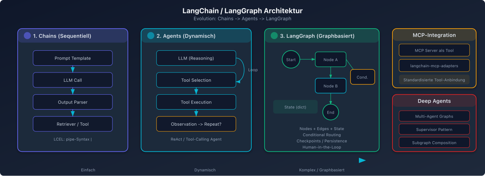

# LangChain / LangGraph - Tools und Skills Architektur

## Ueberblick

LangChain ist eines der aeltesten und am weitesten verbreiteten AI Agent Frameworks. Mit LangGraph wurde 2024/2025 eine graphbasierte Erweiterung eingefuehrt, die heute als empfohlener Standard fuer produktionsreife Agents gilt.

## Architektur-Konzepte

### Chains (klassisch)
Chains bilden das Rueckgrat von LangChains modularem System. Sie verknuepfen mehrere AI-Tasks zu sequenziellen Workflows. Jede Chain nimmt einen Input, verarbeitet ihn und gibt den Output an die naechste Chain weiter.

### Agents (dynamisch)
Im Gegensatz zu Chains folgen Agents keinen vordefinierten Pfaden. Sie analysieren Probleme dynamisch und waehlen eigenstaendig, welche Tools sie wann einsetzen. Der Agent entscheidet zur Laufzeit ueber die naechste Aktion.

### LangGraph (graphbasiert)
LangGraph fuehrt eine graphbasierte Architektur ein:
- **Nodes** repraesentieren Agents oder Prozessschritte
- **Edges** definieren den Kontrollfluss zwischen Nodes
- Unterstuetzt Retries, Error Handling und feingranulare Flusskontrolle
- Kompatibel mit MCP (Model Context Protocol) Integrationen

## Tools-System

Tools in LangChain sind Python-basierte Funktionen, die LLMs die Interaktion mit externen Systemen ermoeglichen (APIs, Datenbanken, Dateisysteme). Sie werden definiert durch:

1. **`@tool` Decorator** - fuer einfache Funktionen
2. **`BaseTool` Subclassing** - fuer komplexe Tools mit State Management
3. **Structured Tool** - mit explizitem Input-Schema (Pydantic)

### Tool-Kategorien
- Web Search Tools (Tavily, Serper, Google)
- Database Tools (SQL, Vector Stores)
- File System Tools
- API Integration Tools
- Code Execution Tools

## Skills-Konzept (2025/2026)

Skills sind eine neuere Abstraktionsebene, die ueber Tools hinausgeht:

- **Definition:** Kuratierte Instruktionen, Scripts und Ressourcen, die die Performance von Coding Agents in spezialisierten Domaenen verbessern
- **Progressive Disclosure:** Skills werden dynamisch geladen - der Agent ruft ein Skill erst ab, wenn es fuer die aktuelle Aufgabe relevant ist
- **Prompt-getrieben:** Skills sind primaer prompt-basierte Spezialisierungen, die ein Agent on-demand abrufen kann
- **SKILL.md Kompatibilitaet:** LangChain unterstuetzt den offenen SKILL.md-Standard

### Deep Agents (ab LangChain v1.1.0, Dezember 2025)
- Komplexe autonome Systeme mit Planungsfaehigkeiten fuer mehrtaegige Workflows
- Delegation an spezialisierte Subagents
- Dateisystem-Zugriff und erweiterte Tool-Orchestrierung

## MCP-Integration

Die `langchain-mcp-adapters`-Bibliothek ermoeglicht die Integration von MCP-Tools:

- **Multi-Server Support:** Ein Agent kann gleichzeitig mit mehreren MCP-Servern interagieren
- **Tool Gateway Pattern:** Einheitliche Bridge zu diversen Backend-Ressourcen
- **Automatische Tool-Discovery:** Der Agent entdeckt Tools von allen verbundenen MCP-Servern
- **Sofortiger Zugang** zu Services wie Gmail, GitHub, Slack, Notion etc.

## Staerken und Schwaechen

### Staerken
- Groesstes Ecosystem und Community
- Sehr flexible Tool-Definition
- Starke MCP-Integration
- LangGraph bietet Production-Grade Orchestrierung
- LangSmith fuer Tracing und Monitoring

### Schwaechen
- Steile Lernkurve durch viele Abstraktionsschichten
- Checkpointing in LangGraph ist State-Persistenz, kein semantisches Memory
- Haeufige API-Aenderungen zwischen Versionen
