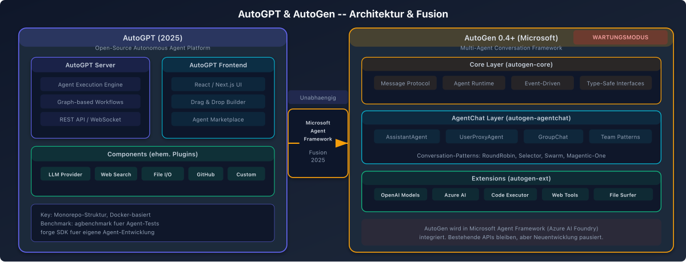

# AutoGPT und AutoGen - Skills und Erweiterbarkeit

## AutoGPT

### Ueberblick
AutoGPT war eines der ersten autonomen AI-Agent-Systeme und hat sich von einem experimentellen Projekt zu einer produktionsreifen Plattform entwickelt.

### Architektur-Evolution
- **Alte Plugins:** Das urspruengliche Plugin-System ist veraltet und funktioniert nicht mehr mit aktuellen Versionen
- **Neue Components:** Plugins wurden durch "Components" ersetzt, die einfacher zu entwickeln und besser in AutoGPT integriert sind

### Aktuelle Plattform-Architektur (2025)
Zweiteilige Architektur:

1. **AutoGPT Server:**
   - Core Logic
   - Infrastruktur
   - Marketplace-Funktionalitaet

2. **AutoGPT Frontend:**
   - Agent Builder
   - Workflow Management
   - Monitoring Tools

### Skills und Erweiterbarkeit
- **Custom Blocks:** Modulare Python-Erweiterungen fuer spezifische APIs, Datenbanken oder domaenenspezifische Logik
- **Agent Protocol Standard:** Vom AI Engineer Foundation definierter Standard fuer einheitliche Kompatibilitaet
- **Built-in Faehigkeiten:**
  - Web-Browser-Zugriff
  - Code-Ausfuehrungsumgebung
  - Dateisystem-Zugriff
  - API-Endpunkte
  - Web Scraping und Datenextraktion

### Anwendungsbereiche
Marketing, Reporting, Customer Service und forschungsbasierte Aufgaben.

---

## AutoGen (Microsoft)

### Ueberblick
AutoGen wurde von Microsoft als Multi-Agent-Conversational-Framework entwickelt. Es befindet sich seit Oktober 2025 im Wartungsmodus und wird vom Microsoft Agent Framework abgeloest.

### Architektur (Version 0.4, Januar 2025)
Drei-Schichten-Architektur:

1. **Core Layer:**
   - Grundlegende Bausteine fuer event-getriebene agentenbasierte Systeme
   - Messaging und Routing

2. **AgentChat Layer:**
   - Task-getriebene High-Level-API
   - Group Chat Funktionalitaet
   - Vorgefertigte Agent-Typen

3. **Extensions Layer:**
   - Third-Party-Integrationen
   - Custom Tool-Anbindungen

### Skills in AutoGen
- **AutoGen Studio:** Visuelle Oberflaeche zum Erstellen von Agents ohne Code
- **MCP-Integration:** Das Repository `autogenstudio-skills` stellt Skills bereit, die Model Context Protocol nutzen
- **Funktionale Agents:** In unter 20 Zeilen Code erstellbar

### Strategische Entwicklung
- **Oktober 2025:** Microsoft kuendigt den "Microsoft Agent Framework" an - eine Fusion von AutoGen und Semantic Kernel
- **Wartungsmodus:** AutoGen erhaelt nur noch Bugfixes und Security Patches, keine neuen Features
- **Ziel:** Microsoft Agent Framework 1.0 GA bis Ende Q1 2026 mit stabilen, versionierten APIs
- **Azure-Integration:** Native Integration mit Azure AI Foundry fuer Cloud-Deployment

### Staerken und Schwaechen

#### Staerken
- Starke Multi-Agent-Conversation-Patterns
- Einfache Erstellung funktionaler Agents
- AutoGen Studio fuer No-Code-Entwicklung
- Azure-Ecosystem-Integration

#### Schwaechen
- Im Wartungsmodus - keine neuen Features
- Community wird auf Microsoft Agent Framework umgelenkt
- Unklare Zukunft als eigenstaendiges Framework
