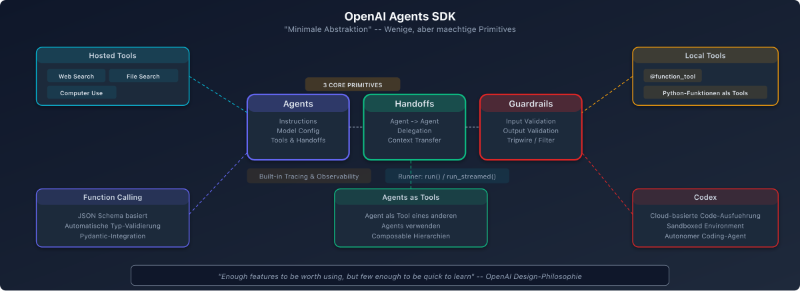

# OpenAI Agents SDK - Tool/Function Calling als Skill-Mechanismus

## Ueberblick

Das OpenAI Agents SDK ist ein Open-Source-SDK fuer Python und TypeScript, das als produktionsreifer Nachfolger des experimentellen "Swarm"-Frameworks eingefuehrt wurde (Maerz 2025). Es bietet wenige, aber durchdachte Abstraktionen fuer den Bau agentenbasierter Systeme.

## Core Primitives



Das SDK basiert auf drei Grundkonzepten:

1. **Agents:** LLMs ausgestattet mit Instruktionen und Tools
2. **Handoffs / Agents as Tools:** Agents koennen an andere Agents delegieren
3. **Guardrails:** Validierung von Agent Inputs und Outputs

## Tool-Kategorien

### 1. Hosted OpenAI Tools
Tools, die auf OpenAI-Servern neben dem Modell laufen:
- **WebSearchTool:** Web-Suche
- **FileSearchTool:** Informationsabruf aus OpenAI Vector Stores
- **CodeInterpreterTool:** Code-Ausfuehrung

### 2. Local/Runtime Execution Tools
Tools, die in der lokalen Umgebung ausgefuehrt werden:
- **ComputerTool:** Computer-Steuerung
- **ApplyPatchTool:** Code-Aenderungen anwenden
- **ShellTool:** Shell-Befehle ausfuehren (lokal oder in gehostetem Container)

### 3. Function Calling
Jede Python-Funktion kann als Tool gewrapped werden:
```python
@function_tool
def get_weather(city: str) -> str:
    """Ruft das aktuelle Wetter ab."""
    return weather_api.get(city)
```

### 4. Agents as Tools
Ein Agent kann als aufrufbares Tool exponiert werden, ohne einen vollstaendigen Handoff durchzufuehren. Dies ermoeglicht spezialisierte Sub-Agents fuer bestimmte Teilaufgaben.

### 5. Experimental Codex Tool
Workspace-scoped Codex-Tasks koennen als Tool-Call ausgefuehrt werden.

## Function Calling - Details

### Structured Outputs (seit Juni 2024)
Mit `strict: true` in der Function Definition garantiert das Modell, dass die generierten Argumente exakt dem JSON Schema entsprechen.

### Ablauf
1. Entwickler definiert Funktionen mit Name, Beschreibung und Parametern
2. Modell erkennt die Notwendigkeit eines Tool-Aufrufs
3. Modell generiert strukturierte Argumente
4. Entwickler fuehrt die Funktion aus
5. Ergebnis wird zurueck an das Modell gegeben

## Tracing

Das SDK bringt integriertes Tracing mit, das die Nachvollziehbarkeit von Agent-Aktionen und Tool-Aufrufen ermoeglicht.

## Provider-Agnostisch

Obwohl von OpenAI entwickelt, ist das SDK provider-agnostisch mit dokumentierten Pfaden fuer die Nutzung von Nicht-OpenAI-Modellen.

## Staerken und Schwaechen

### Staerken
- Minimale, saubere Abstraktionen
- Integriertes Tracing
- Structured Outputs fuer zuverlaessiges Function Calling
- Provider-agnostisch
- Handoff-Pattern fuer elegante Agent-Delegation

### Schwaechen
- Kein eingebautes Memory-System
- Kein visueller Agent Builder
- Vergleichsweise junges Ecosystem
- Weniger Built-in Tools als CrewAI
