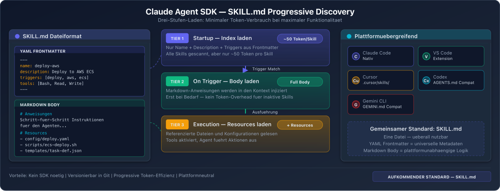

# Anthropic Claude Agent SDK - Tool Use und Skill-Integration

## Ueberblick

Anthropic hat mit dem Claude Agent SDK und dem Agent Skills Standard einen bedeutenden Beitrag zur Standardisierung von Skill-Systemen in AI Agents geleistet. Der im Dezember 2025 veroeffentlichte offene Standard hat breite Akzeptanz gefunden.

## Agent Skills Standard



### Entstehung
- **Oktober 2025:** Erstmalige oeffentliche Vorstellung von Agent Skills
- **Dezember 2025:** Veroeffentlichung als offener Standard fuer plattformuebergreifende Portabilitaet
- **Spezifikation:** https://agentskills.io/specification

### SKILL.md Format

Jede Skill ist ein Verzeichnis mit mindestens einer `SKILL.md`-Datei:

```
.claude/skills/
  my-skill/
    SKILL.md          # Pflicht: Metadaten + Instruktionen
    scripts/           # Optional: Ausfuehrbare Scripts
    references/        # Optional: Referenzmaterial
    assets/            # Optional: Weitere Ressourcen
```

#### SKILL.md Aufbau
Zwei Teile:
1. **YAML Frontmatter:** Metadaten (name, description, version)
2. **Markdown Body:** Die eigentlichen Instruktionen

#### Namenskonventionen
- Nur Kleinbuchstaben, Zahlen und Bindestriche
- Maximal 64 Zeichen
- Darf nicht mit Bindestrich beginnen oder enden
- Keine aufeinanderfolgenden Bindestriche
- Description maximal 1024 Zeichen

### Drei-Stufen-Discovery-Modell (Kontext-Effizienz)

| Stufe | Zeitpunkt | Was wird geladen | Tokens |
|-------|-----------|------------------|--------|
| Tier 1 | Startup | Nur Name und Description | ~50 Tokens/Skill |
| Tier 2 | Skill-Trigger | Vollstaendiger SKILL.md Body | ~500-5.000 Tokens |
| Tier 3 | Ausfuehrung | References, Scripts etc. | variabel |

Bei 20 Skills werden beim Startup nur ca. 1.000 Tokens an Metadaten geladen. Der Agent weiss, was er kann, traegt aber keine detaillierten Instruktionen mit sich.

## Claude Agent SDK Integration

### Konfiguration
Skills werden ueber Filesystem-basierte Konfiguration eingebunden:
- Verzeichnisse in `.claude/skills/` oder `~/.claude/skills/`
- Aktivierung durch Aufnahme von "Skill" in `allowed_tools`
- Automatische Discovery beim SDK-Start

### Hot-Reloading (seit Januar 2026)
Skills, die waehrend einer Sitzung erstellt oder geaendert werden, aktivieren sich sofort ohne Neustart.

## Plattformuebergreifende Kompatibilitaet

Der SKILL.md-Standard funktioniert mit:
- **Claude Code** (Anthropic)
- **Codex CLI** (OpenAI)
- **Cursor** (IDE)
- **Gemini CLI** (Google)
- **VS Code / GitHub Copilot** (Microsoft)
- **Antigravity IDE**

## Skills-Ecosystem (Stand Maerz 2026)

- Offizielle Anthropic Skills
- Verifizierte Third-Party Skills
- Tausende community-beigetragene Skills
- Universelles SKILL.md-Format als Grundlage

## Tool Use (API-Level)

Neben Skills unterstuetzt die Claude API auch klassisches Tool Use:
- Function Definitions mit JSON Schema
- Structured Tool Results
- Multi-Tool-Aufrufe in einem Turn
- Computer Use (Beta) fuer Desktop-Interaktion

## Staerken und Schwaechen

### Staerken
- Offener Standard mit breiter Industrieakzeptanz
- Elegantes Drei-Stufen-Discovery-Modell fuer Token-Effizienz
- Hot-Reloading fuer schnelle Iteration
- Plattformuebergreifende Kompatibilitaet
- Starkes wachsendes Ecosystem

### Schwaechen
- Standard ist noch relativ jung (< 6 Monate als offener Standard)
- Ecosystem kleiner als LangChain-Oekosystem
- Skills sind primaer prompt-basiert, nicht code-basiert
