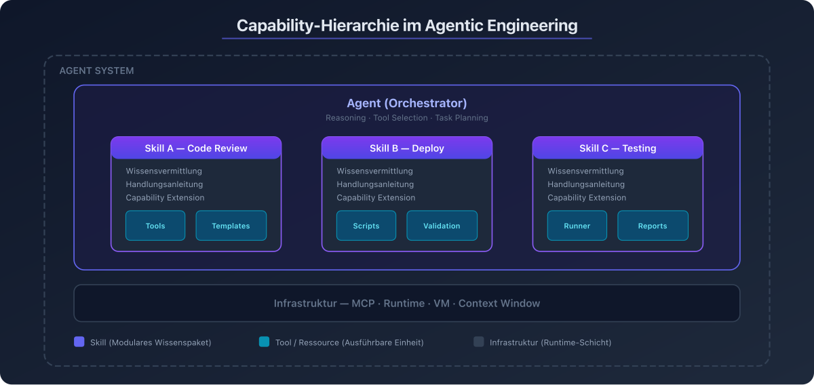
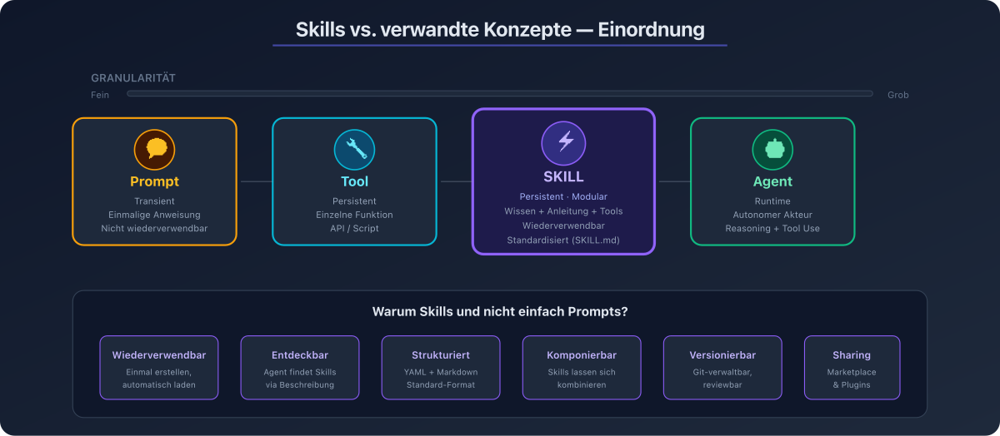
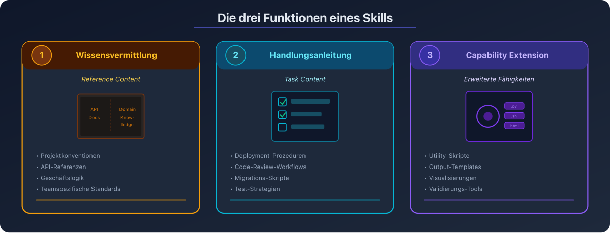
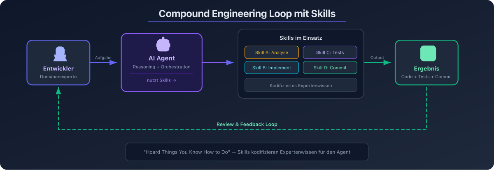

# 01 — Grundlagen: Was sind Skills?

## Definition

> "Skills are folders containing instructions, scripts, and resources that tell AI systems how to perform specific tasks consistently — packaging procedural knowledge into reusable modules."
> — Agent Skills Standard (agentskills.io)

Ein **Skill** ist ein modulares, wiederverwendbares Bündel aus Anweisungen, Metadaten und optionalen Ressourcen (Skripte, Templates, Referenzmaterial), das einem AI Agent domänenspezifisches Wissen und Fähigkeiten vermittelt. Skills transformieren allgemeine Agents in Spezialisten.

---

## Einordnung im Agentic Engineering

### Die Capability-Hierarchie



```
┌─────────────────────────────────────────────────┐
│                  Agent System                     │
│                                                   │
│  ┌───────────────────────────────────────────┐   │
│  │            Agent (Orchestrator)             │   │
│  │                                             │   │
│  │  ┌─────────┐ ┌─────────┐ ┌─────────┐     │   │
│  │  │ Skill A │ │ Skill B │ │ Skill C │     │   │
│  │  │         │ │         │ │         │     │   │
│  │  │ ┌─────┐ │ │ ┌─────┐ │ │ ┌─────┐ │     │   │
│  │  │ │Tools│ │ │ │Tools│ │ │ │Tools│ │     │   │
│  │  │ └─────┘ │ │ └─────┘ │ │ └─────┘ │     │   │
│  │  └─────────┘ └─────────┘ └─────────┘     │   │
│  └───────────────────────────────────────────┘   │
│                                                   │
│  ┌───────────────────────────────────────────┐   │
│  │     Infrastruktur (MCP, Runtime, VM)       │   │
│  └───────────────────────────────────────────┘   │
└─────────────────────────────────────────────────┘
```

### Abgrenzung: Skills vs. verwandte Konzepte



| Konzept | Beschreibung | Persistenz | Granularität |
|---------|-------------|-----------|--------------|
| **Prompt** | Einmalige Anweisung für eine Konversation | Transient | Fein |
| **Skill** | Wiederverwendbares Wissensmodul mit Metadaten | Persistent | Mittel |
| **Tool** | Einzelne ausführbare Funktion (API, Script) | Persistent | Fein |
| **Agent** | Autonomer Akteur mit Reasoning und Tool Use | Runtime | Grob |
| **Plugin** | Paket aus mehreren Skills und Konfigurationen | Persistent | Grob |

### Warum Skills und nicht einfach Prompts?

| Aspekt | Prompt | Skill |
|--------|--------|-------|
| Wiederverwendbarkeit | Muss jedes Mal neu formuliert werden | Einmal erstellen, automatisch laden |
| Entdeckbarkeit | Nicht entdeckbar | Agent entdeckt Skills automatisch via Beschreibung |
| Struktur | Unstrukturiert | Standardisierte Struktur (YAML + Markdown) |
| Komposition | Schwer kombinierbar | Mehrere Skills komponierbar |
| Versionierung | Nicht versionierbar | Als Dateien in Git versionierbar |
| Sharing | Copy-Paste | Plugin-System, Marketplace |
| Ressourcen | Nur Text | Skripte, Templates, Referenzmaterial bündelbar |

---

## Die drei Funktionen eines Skills



### 1. Wissensvermittlung (Reference Content)

Skills vermitteln domänenspezifisches Wissen, das der Agent nicht aus seinem Training kennt:

- Projektkonventionen und Coding Standards
- API-Referenzen und Schema-Definitionen
- Geschäftslogik und Domänenwissen
- Teamspezifische Workflows

### 2. Handlungsanleitung (Task Content)

Skills geben dem Agent Schritt-für-Schritt-Anweisungen für spezifische Aufgaben:

- Deployment-Prozeduren
- Code-Review-Workflows
- Migrations-Skripte
- Test-Strategien

### 3. Capability Extension

Skills erweitern die Fähigkeiten des Agents durch mitgelieferte Skripte und Ressourcen:

- Utility-Skripte für deterministische Operationen
- Templates für standardisierte Outputs
- Visualisierungen und Reports
- Validierungs-Tools

---

## Skills im Kontext des Agentic Engineering 2026



### Flow Engineering als Leit-Disziplin

> "Flow engineering is the discipline of designing the control flow, state transitions, and decision boundaries around LLM calls rather than optimizing the calls themselves."

Skills sind ein zentrales Element des Flow Engineering:

1. **Kontrollfluss**: Skills definieren Workflows mit klaren Schritten
2. **Zustandsübergänge**: Skills können in Subagents mit isoliertem Kontext laufen
3. **Entscheidungsgrenzen**: Skills steuern, welche Tools verfügbar sind und wer sie aufrufen darf

### Der Compound Engineering Loop

```
Entwickler ──→ Aufgabe definieren ──→ Agent
     ↑                                   │
     │                                   ▼
  Feedback ←── Review ←── Agent nutzt Skills:
                           ├── Skill A: Codebase analysieren
                           ├── Skill B: Implementation
                           ├── Skill C: Tests schreiben
                           └── Skill D: Commit erstellen
```

Skills kodifizieren das Expertenwissen des Entwicklers ("Hoard Things You Know How to Do" — Simon Willison, 2026) und machen es für den Agent wiederholbar verfügbar.

### Marktadoption 2026

Der Agent Skills Standard wird von über 30 Produkten unterstützt:

- **Anthropic**: Claude Code, Claude.ai, Claude API, Claude Agent SDK
- **Microsoft**: VS Code Copilot, GitHub Copilot
- **OpenAI**: Codex
- **Weitere**: Cursor, JetBrains Junie, Goose, Amp, OpenCode u.v.m.

Ein Community-Marketplace (claudemarketplace.com) listet über 150 Skills (Stand März 2026).

---

## Zusammenfassung

Skills sind das zentrale Abstraktionsmittel, um AI Agents domänenspezifisches Wissen und Fähigkeiten zu vermitteln. Sie überbrücken die Lücke zwischen einmaligen Prompts und komplexen Agent-Systemen und ermöglichen:

- **Wiederverwendbarkeit**: Einmal erstellen, überall nutzen
- **Standardisierung**: Offener Standard, plattformübergreifend
- **Skalierbarkeit**: Von einzelnen Entwicklern bis zu Enterprise-Teams
- **Qualitätssicherung**: Testbar, versionierbar, reviewbar
