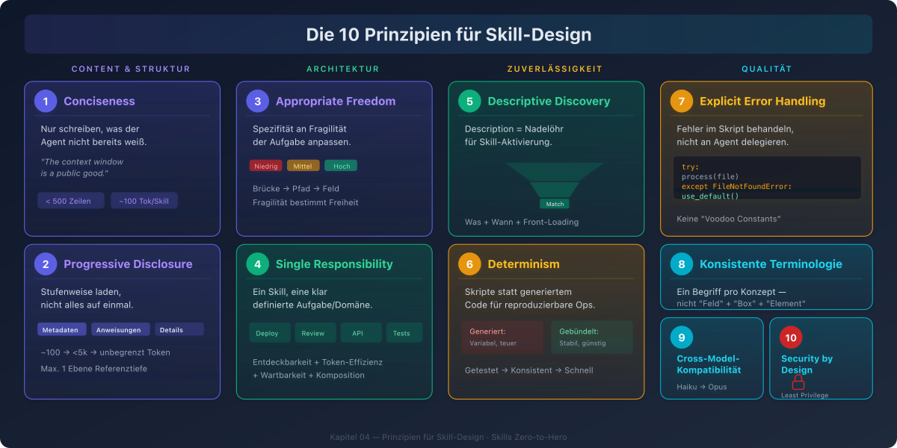
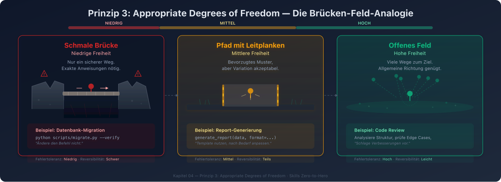

# 04 — Prinzipien für Skill-Design

## Überblick

Dieses Kapitel dokumentiert die fundamentalen Prinzipien, nach denen Skills entworfen werden sollten. Diese Prinzipien stammen aus der offiziellen Dokumentation, aus Best Practices der Community und aus praktischer Erfahrung.

---



## Prinzip 1: Conciseness (Prägnanz)

> "The context window is a public good."
> — Anthropic, Skill Authoring Best Practices

### Kernaussage

Jeder Token in einem Skill konkurriert mit Konversationshistorie, anderen Skills und der eigentlichen Anfrage. Schreibe nur, was der Agent nicht bereits weiß.

### Leitfragen

Vor jeder Zeile im Skill fragen:
- "Weiß der Agent das nicht schon?"
- "Muss ich das wirklich erklären?"
- "Rechtfertigt dieser Absatz seine Token-Kosten?"

### Beispiel

**Schlecht** (~150 Token):
```markdown
PDF (Portable Document Format) Dateien sind ein häufiges Dateiformat,
das Text, Bilder und andere Inhalte enthält. Um Text aus einer PDF
zu extrahieren, benötigt man eine Bibliothek. Es gibt viele Bibliotheken
für PDF-Verarbeitung, aber pdfplumber wird empfohlen, weil es einfach
zu verwenden ist und die meisten Fälle abdeckt...
```

**Gut** (~50 Token):
````markdown
## PDF-Text extrahieren

Verwende pdfplumber:

```python
import pdfplumber
with pdfplumber.open("file.pdf") as pdf:
    text = pdf.pages[0].extract_text()
```
````

### Metriken

- **SKILL.md Body**: Unter 500 Zeilen halten
- **Description**: Unter 250 Zeichen für die Kernaussage
- **Gesamte Metadaten**: ~100 Token pro Skill bei Discovery

---

## Prinzip 2: Progressive Disclosure (Stufenweise Offenlegung)

### Kernaussage

Nicht alles gleichzeitig laden. Informationen in Stufen bereitstellen — nur das, was für den aktuellen Schritt relevant ist.

### Die drei Stufen

```
Stufe 1: Metadaten     ──→ Immer im Kontext    (~100 Token)
         "Was gibt es?"

Stufe 2: Anweisungen   ──→ Bei Aktivierung      (<5k Token)
         "Wie geht es?"

Stufe 3: Details        ──→ Bei Bedarf           (unbegrenzt)
         "Was sind die Einzelheiten?"
```

### Architektur-Implikation

SKILL.md ist ein **Inhaltsverzeichnis**, kein Buch. Es zeigt den Weg zu Details, enthält sie aber nicht vollständig:

```markdown
# SKILL.md — Übersicht und Navigation

## Quick Start
[Grundlegende Anleitung direkt in SKILL.md]

## Erweiterte Features
**Formular-Ausfüllung**: Siehe [FORMS.md](FORMS.md)
**API-Referenz**: Siehe [REFERENCE.md](REFERENCE.md)
**Beispiele**: Siehe [EXAMPLES.md](EXAMPLES.md)
```

### Referenz-Tiefe

**Maximal eine Ebene** tief referenzieren. Verschachtelte Referenzen (Datei A → Datei B → Datei C) führen dazu, dass der Agent Dateien nur teilweise liest.

```
✓ SKILL.md → reference.md        (eine Ebene)
✓ SKILL.md → examples.md         (eine Ebene)
✗ SKILL.md → advanced.md → details.md  (zu tief!)
```

---

## Prinzip 3: Appropriate Degrees of Freedom (Angemessene Freiheitsgrade)



### Kernaussage

Passe den Spezifitätsgrad an die Fragilität und Variabilität der Aufgabe an.

### Die Brücken-Feld-Analogie

> Think of Claude as a robot exploring a path:
> - **Schmale Brücke mit Klippen**: Nur ein sicherer Weg → genaue Anweisungen (niedrige Freiheit)
> - **Offenes Feld ohne Gefahren**: Viele Wege zum Ziel → allgemeine Richtung (hohe Freiheit)

### Drei Freiheits-Stufen

#### Hohe Freiheit (Text-basierte Anweisungen)

**Wann**: Mehrere Ansätze sind valide, Entscheidungen hängen vom Kontext ab

```markdown
## Code-Review Prozess

1. Analysiere die Code-Struktur und Organisation
2. Prüfe auf potenzielle Bugs oder Edge Cases
3. Schlage Verbesserungen für Lesbarkeit vor
4. Überprüfe Einhaltung der Projektkonventionen
```

#### Mittlere Freiheit (Pseudocode/Templates mit Parametern)

**Wann**: Ein bevorzugtes Muster existiert, aber Variation ist akzeptabel

````markdown
## Report generieren

Verwende dieses Template und passe es nach Bedarf an:

```python
def generate_report(data, format="markdown", include_charts=True):
    # Daten verarbeiten
    # Output im angegebenen Format generieren
    # Optional Visualisierungen einschließen
```
````

#### Niedrige Freiheit (Spezifische Skripte, wenige Parameter)

**Wann**: Operationen sind fragil, Konsistenz ist kritisch

````markdown
## Datenbank-Migration

Führe exakt dieses Skript aus:

```bash
python scripts/migrate.py --verify --backup
```

Ändere den Befehl nicht und füge keine zusätzlichen Flags hinzu.
````

### Entscheidungsmatrix

| Kriterium | Hohe Freiheit | Mittlere Freiheit | Niedrige Freiheit |
|-----------|--------------|-------------------|-------------------|
| Fehlertoleranz | Hoch | Mittel | Niedrig |
| Variabilität | Hoch | Mittel | Niedrig |
| Reversibilität | Leicht umkehrbar | Teils umkehrbar | Schwer umkehrbar |
| Beispiele | Code Review | Report-Generierung | DB-Migration |

---

## Prinzip 4: Single Responsibility

### Kernaussage

Ein Skill sollte eine klar definierte Aufgabe oder ein klar definiertes Wissensgebiet abdecken — nicht alles auf einmal.

### Anwendung

```
✓ Ein Skill pro Domäne/Aufgabe:
  ├── deploy-production/    → Deployment
  ├── code-review/          → Code Review
  ├── api-conventions/      → API-Konventionen
  └── test-strategy/        → Test-Strategie

✗ Ein Monolith-Skill:
  └── everything/           → Deployment + Review + Konventionen + Tests
```

### Begründung

- **Entdeckbarkeit**: Klare Beschreibung pro Skill → besseres Matching
- **Token-Effizienz**: Nur der relevante Skill wird geladen
- **Wartbarkeit**: Änderungen betreffen nur einen Skill
- **Komposition**: Einzelne Skills können flexibel kombiniert werden

---

## Prinzip 5: Descriptive Discovery (Beschreibungsbasierte Entdeckung)

### Kernaussage

Die `description` ist das Nadelöhr — sie bestimmt, ob und wann ein Skill aktiviert wird. Sie ist das "Prompt Engineering für Skills".

### Regeln für effektive Beschreibungen

1. **Dritte Person verwenden** — Die Beschreibung wird in den System Prompt injiziert
   - Gut: "Analysiert Excel-Dateien und erstellt Pivot-Tabellen"
   - Schlecht: "Ich kann Excel-Dateien analysieren"

2. **Schlüsselbegriffe einschließen** — Was macht der Skill, und bei welchen Begriffen soll er aktiviert werden?
   ```yaml
   description: Analysiert Excel-Tabellen, erstellt Pivot-Tabellen, generiert
     Charts. Verwenden bei Excel-Dateien, Tabellenkalkulation, .xlsx-Dateien
     oder tabellarischen Daten.
   ```

3. **Was UND Wann** — Nicht nur beschreiben was, sondern auch wann
   ```yaml
   # Gut: Was + Wann
   description: Generiert beschreibende Commit-Messages durch Analyse von
     Git Diffs. Verwenden wenn Hilfe beim Schreiben von Commit-Messages
     oder beim Überprüfen gestaged Änderungen benötigt wird.
   
   # Schlecht: Nur Was
   description: Hilft bei Commits
   ```

4. **Front-Loading** — Die ersten 250 Zeichen sind entscheidend (Truncation-Grenze)

---

## Prinzip 6: Determinism Where Possible (Determinismus wo möglich)

### Kernaussage

Für reproduzierbare, fehleranfällige Operationen: Skripte verwenden statt den Agent Code generieren zu lassen.

### Vorteile von Utility-Skripten

| Aspekt | Generierter Code | Gebündeltes Skript |
|--------|-----------------|-------------------|
| Zuverlässigkeit | Variabel | Getestet und stabil |
| Token-Kosten | Hoch (Code im Kontext) | Niedrig (nur Output) |
| Konsistenz | Kann variieren | Immer gleich |
| Geschwindigkeit | Generierung nötig | Sofort ausführbar |

### Beispiel

**Statt** den Agent SQL-Queries generieren zu lassen:

```markdown
## Datenbank-Analyse

Verwende das gebündelte Analyse-Skript:

```bash
python scripts/analyze_form.py input.pdf > fields.json
```

Output-Format:
```json
{
  "field_name": {"type": "text", "x": 100, "y": 200}
}
```
```

---

## Prinzip 7: Explicit Error Handling (Explizite Fehlerbehandlung)

### Kernaussage

Skripte sollen Fehler selbst behandeln, nicht an den Agent "delegieren".

### Beispiel

**Gut** — Fehler werden behandelt:
```python
def process_file(path):
    try:
        with open(path) as f:
            return f.read()
    except FileNotFoundError:
        print(f"Datei {path} nicht gefunden, erstelle Standard")
        with open(path, "w") as f:
            f.write("")
        return ""
    except PermissionError:
        print(f"Zugriff auf {path} verweigert, verwende Standard")
        return ""
```

**Schlecht** — Agent muss Fehler interpretieren:
```python
def process_file(path):
    return open(path).read()  # Wirft bei fehlendem File
```

### Keine "Voodoo Constants"

Jeder Konfigurationswert muss begründet und dokumentiert sein:

```python
# Gut: Selbstdokumentierend
REQUEST_TIMEOUT = 30   # HTTP-Requests dauern typisch <30s
MAX_RETRIES = 3        # Meiste intermittierende Fehler lösen sich nach 2 Retries

# Schlecht: Magic Numbers
TIMEOUT = 47   # Warum 47?
RETRIES = 5    # Warum 5?
```

---

## Prinzip 8: Konsistente Terminologie

### Kernaussage

Im gesamten Skill einen Begriff pro Konzept verwenden.

| Konsistent (Gut) | Inkonsistent (Schlecht) |
|-------------------|----------------------|
| Immer "API Endpoint" | Mix: "API Endpoint", "URL", "API Route", "Pfad" |
| Immer "Feld" | Mix: "Feld", "Box", "Element", "Control" |
| Immer "extrahieren" | Mix: "extrahieren", "holen", "abrufen", "ziehen" |

---

## Prinzip 9: Cross-Model-Kompatibilität

### Kernaussage

Skills müssen mit allen Modellen funktionieren, auf denen sie eingesetzt werden.

### Überlegungen nach Modell

| Modell | Charakteristik | Skill-Anforderung |
|--------|---------------|-------------------|
| Claude Haiku | Schnell, ökonomisch | Mehr Guidance nötig |
| Claude Sonnet | Ausgewogen | Klare, effiziente Anweisungen |
| Claude Opus | Starkes Reasoning | Über-Erklärung vermeiden |

### Empfehlung

Was für Opus perfekt funktioniert, braucht möglicherweise mehr Detail für Haiku. Ziel: Anweisungen die mit **allen** geplanten Modellen gut funktionieren.

---

## Prinzip 10: Security by Design

### Kernaussage

Skills sind mächtiges Werkzeug — ein bösartiger Skill kann Tools aufrufen und Code ausführen, der nicht dem angegebenen Zweck entspricht.

### Sicherheitsregeln

1. **Nur Skills aus vertrauenswürdigen Quellen** verwenden (selbst erstellt oder von Anthropic)
2. **Alle Dateien auditieren** vor der Nutzung — SKILL.md, Skripte, Bilder, Ressourcen
3. **Externe URLs sind besonders risikoreich** — geholte Inhalte können bösartige Anweisungen enthalten
4. **Principle of Least Privilege** — `allowed-tools` auf das Minimum beschränken
5. **Skills wie Software-Installation behandeln** — gleiche Sorgfalt wie bei npm packages

### Tool-Einschränkung als Sicherheitsmechanismus

```yaml
---
name: safe-reader
description: Liest Dateien ohne Änderungen vorzunehmen
allowed-tools: Read Grep Glob
---
```

---

## Zusammenfassung: Die 10 Prinzipien auf einen Blick

| # | Prinzip | Kernaussage |
|---|---------|-------------|
| 1 | Conciseness | Nur schreiben was der Agent nicht weiß |
| 2 | Progressive Disclosure | Stufenweise laden, nicht alles auf einmal |
| 3 | Appropriate Freedom | Spezifität an Fragilität der Aufgabe anpassen |
| 4 | Single Responsibility | Ein Skill, eine Aufgabe/Domäne |
| 5 | Descriptive Discovery | Beschreibung ist das Nadelöhr für Aktivierung |
| 6 | Determinism | Skripte für reproduzierbare Operationen |
| 7 | Explicit Error Handling | Fehler im Skript behandeln, nicht delegieren |
| 8 | Konsistente Terminologie | Ein Begriff pro Konzept |
| 9 | Cross-Model-Kompatibilität | Mit allen Zielmodellen testen |
| 10 | Security by Design | Least Privilege, auditieren, vertrauenswürdige Quellen |
