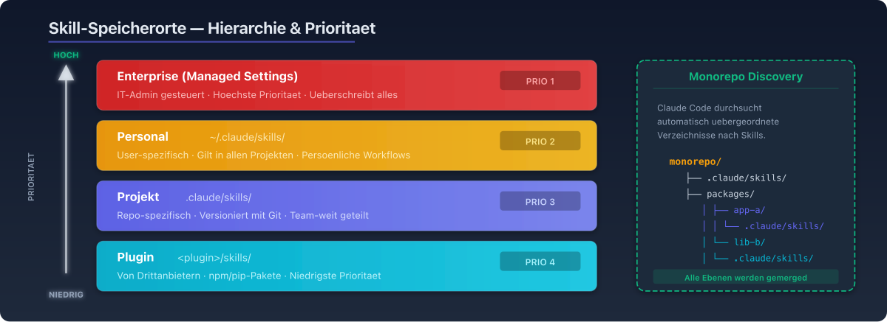
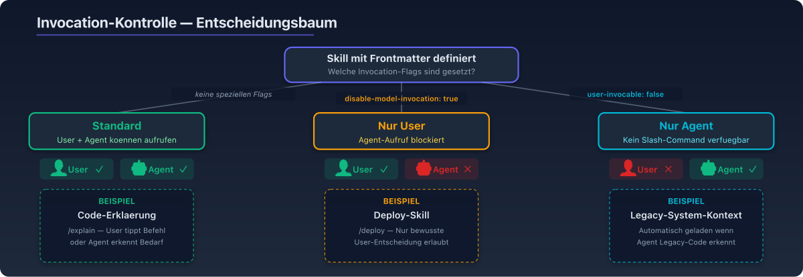

# 07 — Skills in Claude Code

## Überblick

Claude Code ist die primäre Plattform für die Entwicklung und Nutzung von Skills. Dieses Kapitel dokumentiert das vollständige Skill-System in Claude Code — von Bundled Skills über Custom Skills bis hin zu fortgeschrittenen Features wie Subagent-Integration und Hooks.

---

## Bundled Skills

Bundled Skills werden mit Claude Code ausgeliefert und sind in jeder Session verfügbar. Anders als Built-in Commands (`/help`, `/compact`) sind Bundled Skills **Prompt-basiert** — sie geben Claude ein detailliertes Playbook und lassen ihn die Arbeit mit seinen Tools orchestrieren.

### Verfügbare Bundled Skills

| Skill | Zweck |
|-------|-------|
| `/batch <instruction>` | Orchestriert großflächige Codebase-Änderungen parallel. Recherchiert die Codebase, zerlegt in 5–30 unabhängige Einheiten, präsentiert Plan. Bei Genehmigung: ein Background-Agent pro Einheit in isoliertem Git Worktree. |
| `/claude-api` | Lädt Claude API-Referenzmaterial für Projekt-Sprache (Python, TypeScript, Java, Go, Ruby, C#, PHP, cURL). Aktiviert sich automatisch bei `anthropic`/`@anthropic-ai/sdk`-Imports. |
| `/debug [description]` | Aktiviert Debug-Logging und analysiert Session-Debug-Logs. |
| `/loop [interval] <prompt>` | Führt Prompt wiederholt in Intervallen aus (z.B. `/loop 5m check if deploy finished`). |
| `/simplify [focus]` | Prüft kürzlich geänderte Dateien auf Code-Qualität. Startet drei parallele Review-Agents, aggregiert Findings, wendet Fixes an. |

---

## Custom Skills erstellen

### Minimales Beispiel

```bash
# 1. Verzeichnis erstellen
mkdir -p ~/.claude/skills/explain-code

# 2. SKILL.md schreiben
cat > ~/.claude/skills/explain-code/SKILL.md << 'EOF'
---
name: explain-code
description: Erklärt Code mit visuellen Diagrammen und Analogien.
  Verwenden bei Code-Erklärungen oder wenn gefragt wird wie etwas funktioniert.
---

Beim Erklären von Code immer einschließen:

1. **Mit einer Analogie beginnen**: Code mit Alltagsbeispiel vergleichen
2. **Diagramm zeichnen**: ASCII-Art für Fluss, Struktur oder Beziehungen
3. **Code durchgehen**: Schritt für Schritt erklären
4. **Gotcha hervorheben**: Häufiger Fehler oder Missverständnis?

Erklärungen gesprächig halten. Bei komplexen Konzepten mehrere Analogien.
EOF

# 3. Testen
# Automatisch: "Wie funktioniert dieser Code?"
# Direkt: /explain-code src/auth/login.ts
```

### Speicherorte und Prioritäten



| Ebene | Pfad | Geltungsbereich |
|-------|------|----------------|
| **Enterprise** | Managed Settings | Alle Nutzer der Organisation |
| **Personal** | `~/.claude/skills/<name>/SKILL.md` | Alle Projekte des Nutzers |
| **Projekt** | `.claude/skills/<name>/SKILL.md` | Nur dieses Projekt |
| **Plugin** | `<plugin>/skills/<name>/SKILL.md` | Wo Plugin aktiviert |

**Priorität**: Enterprise > Personal > Projekt.

### Automatische Discovery in Monorepos

Bei Bearbeitung von Dateien in Unterverzeichnissen entdeckt Claude Code automatisch Skills aus verschachtelten `.claude/skills/` Verzeichnissen:

```
monorepo/
├── .claude/skills/          # Projekt-weite Skills
├── packages/
│   ├── frontend/
│   │   └── .claude/skills/  # Frontend-spezifische Skills
│   └── backend/
│       └── .claude/skills/  # Backend-spezifische Skills
```

### Hot Reload

Seit Januar 2026: Skills in `~/.claude/skills` oder `.claude/skills` werden **sofort aktiv** — kein Neustart der Session nötig. Dies eliminiert die Stop-Start-Friktion bei der Skill-Entwicklung.

---

## Migration von Commands zu Skills

Custom Commands (`.claude/commands/`) und Skills (`.claude/skills/`) wurden **zusammengeführt**:

```
.claude/commands/deploy.md   → erzeugt /deploy
.claude/skills/deploy/SKILL.md → erzeugt /deploy (gleichwertig)
```

**Bestehende `.claude/commands/`-Dateien funktionieren weiter.** Skills werden empfohlen, da sie zusätzliche Features unterstützen (Supporting Files, Frontmatter-Optionen).

Bei Namenskonflikt: Skill hat Vorrang vor Command.

---

## Invocation-Kontrolle



### Konfigurationsmatrix

| Szenario | Frontmatter | Beispiel |
|----------|-------------|---------|
| Jeder kann aufrufen | (Standard) | Code-Erklärung, Review |
| Nur User | `disable-model-invocation: true` | Deploy, Commit |
| Nur Agent | `user-invocable: false` | Legacy-System-Kontext |

### Praxis-Beispiel: Deploy-Skill

```yaml
---
name: deploy
description: Deployt die Anwendung in die Produktionsumgebung
disable-model-invocation: true
---

Deploy $ARGUMENTS in Produktion:

1. Test-Suite ausführen
2. Anwendung bauen
3. Zum Deployment-Target pushen
4. Deployment-Erfolg verifizieren
```

### Argument-Übergabe

```yaml
---
name: fix-issue
description: Behebt ein GitHub Issue
disable-model-invocation: true
---

Behebe GitHub Issue $ARGUMENTS gemäß unserer Coding Standards.

1. Issue-Beschreibung lesen
2. Anforderungen verstehen
3. Fix implementieren
4. Tests schreiben
5. Commit erstellen
```

Aufruf: `/fix-issue 123`

---

## Subagent-Integration

### Skill mit `context: fork`

```yaml
---
name: deep-research
description: Recherchiert ein Thema gründlich
context: fork
agent: Explore
---

Recherchiere $ARGUMENTS gründlich:
1. Finde relevante Dateien
2. Analysiere den Code
3. Fasse Ergebnisse zusammen
```

### Verfügbare Agent-Typen

| Agent-Typ | Beschreibung | Tools |
|-----------|-------------|-------|
| `general-purpose` | Standard-Agent (Default) | Alle Tools |
| `Explore` | Codebase-Exploration (Read-only) | Read, Glob, Grep |
| `Plan` | Architektur-Planung | Read, Glob, Grep |
| Custom (`.claude/agents/`) | Selbst definierte Agents | Konfigurierbar |

### Skills + Subagents: Zwei Richtungen

| Ansatz | System Prompt | Task | Lädt zusätzlich |
|--------|-------------|------|----------------|
| Skill mit `context: fork` | Vom Agent-Typ | SKILL.md Content | CLAUDE.md |
| Subagent mit `skills`-Feld | Subagent-Body | Delegation vom Agent | Preloaded Skills + CLAUDE.md |

---

## Tool-Einschränkungen

### allowed-tools Konfiguration

```yaml
---
name: safe-reader
description: Liest Dateien ohne Änderungen
allowed-tools: Read Grep Glob
---
```

### Permission-Regeln für Skills

In `/permissions`:

```
# Nur bestimmte Skills erlauben
Skill(commit)
Skill(review-pr *)

# Bestimmte Skills verbieten
Skill(deploy *)
```

Syntax: `Skill(name)` für exakte Übereinstimmung, `Skill(name *)` für Prefix-Match.

---

## Hooks in Skills

Skills können **Lifecycle-Hooks** definieren — Shell-Befehle, die bei bestimmten Ereignissen ausgeführt werden:

```yaml
---
name: deploy
hooks:
  pre_tool_use:
    - command: echo "Tool wird aufgerufen"
  post_tool_use:
    - command: ./scripts/validate.sh
---
```

---

## Shell-Preprocessing

### Inline-Befehle

`` !`command` `` führt Shell-Befehle **vor dem Senden** an den Agent aus:

```yaml
---
name: pr-review
---

## Aktueller PR-Status
- Branch: !`git branch --show-current`
- Änderungen: !`git diff --stat`
```

### Multi-Line-Befehle

````markdown
## Umgebungsinfo
```!
node --version
npm --version
git status --short
```
````

### Sicherheitshinweis

Shell-Execution kann für User-/Projekt-/Plugin-Skills deaktiviert werden:
```json
{
  "disableSkillShellExecution": true
}
```
Bundled und Managed Skills sind davon nicht betroffen.

---

## Extended Thinking in Skills

Um Extended Thinking (Deep Reasoning) zu aktivieren, das Wort **"ultrathink"** irgendwo im Skill-Content platzieren:

```markdown
---
name: complex-analysis
description: Führt tiefgehende Analyse durch
---

Analysiere das folgende Problem gründlich. ultrathink

1. Alle relevanten Faktoren identifizieren
2. Trade-offs abwägen
3. Empfehlung formulieren
```

---

## Skill-Sharing

### Distributionswege

| Methode | Scope | Wie |
|---------|-------|-----|
| Projekt | Team/Repo | `.claude/skills/` committen |
| Plugin | Plugin-Nutzer | `skills/` im Plugin-Verzeichnis |
| Managed | Organisation | Managed Settings (Enterprise) |
| Marketplace | Community | claudemarketplace.com |

### Plugin-Installation

```bash
# Vom Marketplace
/plugin marketplace add anthropics/skills

# Direkt
/plugin install document-skills@anthropic-agent-skills
```

---

## Troubleshooting

### Skill wird nicht aktiviert

1. Beschreibung prüfen — enthält sie die Schlüsselwörter, die der User verwendet?
2. Verfügbarkeit prüfen — "Welche Skills sind verfügbar?"
3. Anfrage umformulieren — näher an die Beschreibung
4. Direkt aufrufen — `/skill-name` wenn der Skill user-invocable ist

### Skill wird zu oft aktiviert

1. Beschreibung spezifischer machen
2. `disable-model-invocation: true` setzen

### Beschreibungen werden abgeschnitten

Budget skaliert dynamisch (1% des Context Window, Fallback: 8.000 Zeichen).
Kern-Use-Case in den ersten 250 Zeichen platzieren.
Budget erhöhen via `SLASH_COMMAND_TOOL_CHAR_BUDGET` Umgebungsvariable.
