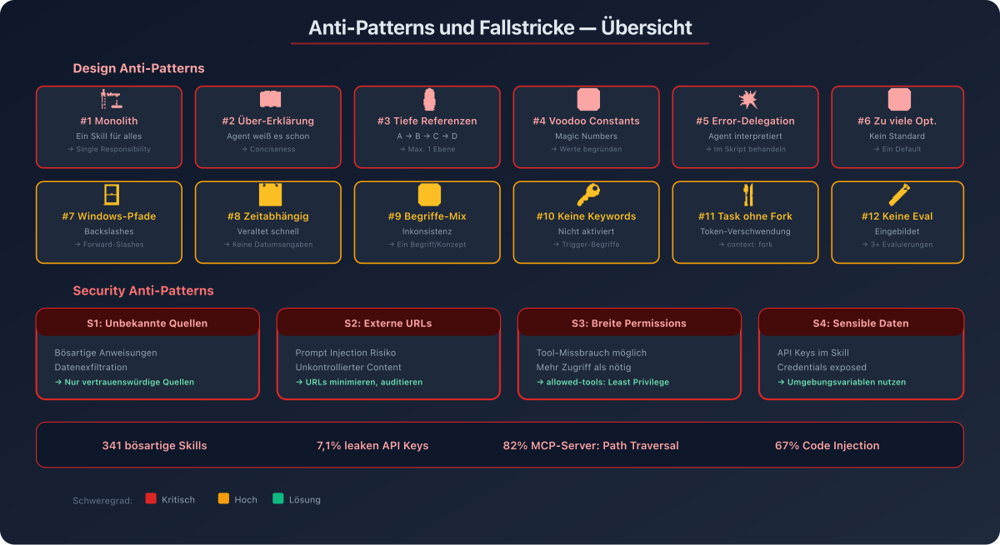

# 10 — Anti-Patterns und Fallstricke

## Überblick

Dieses Kapitel dokumentiert die häufigsten Fehler bei der Skill-Erstellung und -Nutzung. Anti-Patterns zu kennen ist ebenso wichtig wie Best Practices — sie helfen, kostspielige Fehler zu vermeiden.

---



## Anti-Pattern 1: Der Monolith-Skill

### Problem
Ein einzelner Skill versucht, alles abzudecken — Code Review, Deployment, Testing, Dokumentation.

### Warum schlecht
- **Discovery-Problem**: Beschreibung muss zu vage sein, um alles abzudecken
- **Token-Verschwendung**: Gesamter Content wird geladen, obwohl nur ein Teil relevant
- **Wartbarkeits-Albtraum**: Jede Änderung kann andere Bereiche beeinflussen

### Lösung
Single Responsibility: Ein Skill pro Aufgabe/Domäne.

```
✗ everything-skill/
  └── SKILL.md (500+ Zeilen, alles drin)

✓ code-review/
  └── SKILL.md
✓ deploy/
  └── SKILL.md
✓ testing-strategy/
  └── SKILL.md
```

---

## Anti-Pattern 2: Über-Erklärung

### Problem
Der Skill erklärt Dinge, die der Agent bereits weiß.

### Warum schlecht
- Token-Verschwendung
- Kann den Agent dazu verleiten, unnötige Informationen in den Output einzubauen
- Verletzt das Conciseness-Prinzip

### Beispiel

```markdown
# Schlecht — erklärt was eine API ist
APIs (Application Programming Interfaces) sind Schnittstellen,
über die verschiedene Software-Systeme miteinander kommunizieren.
Eine REST API verwendet HTTP-Methoden wie GET, POST, PUT und DELETE,
um CRUD-Operationen durchzuführen. JSON (JavaScript Object Notation)
ist das am häufigsten verwendete Datenformat...

# Gut — sagt dem Agent was er tun soll
## API-Endpoints

- RESTful Naming: `/users/{id}/orders`
- Input-Validierung mit Zod
- Error Response: `{ "error": { "code": "...", "message": "..." } }`
```

---

## Anti-Pattern 3: Tief verschachtelte Referenzen

### Problem
SKILL.md verweist auf Datei A, die auf Datei B verweist, die auf Datei C verweist.

### Warum schlecht
Der Agent liest verschachtelte Referenzen oft nur teilweise (z.B. `head -100`).

### Lösung
Maximal eine Ebene tief referenzieren. Alle Referenzen direkt von SKILL.md:

```
✗ SKILL.md → advanced.md → details.md → final.md

✓ SKILL.md → reference.md
✓ SKILL.md → examples.md
✓ SKILL.md → advanced.md
```

---

## Anti-Pattern 4: Voodoo Constants

### Problem
Konfigurationswerte ohne Begründung ("Magic Numbers").

### Warum schlecht
Der Agent kann die Werte nicht anpassen, weil er die Begründung nicht kennt.

```python
# Schlecht
TIMEOUT = 47
RETRIES = 5
CHUNK_SIZE = 137

# Gut
TIMEOUT = 30        # HTTP-Requests typisch <30s
RETRIES = 3         # Meiste intermittierende Fehler lösen sich nach 2 Retries
CHUNK_SIZE = 128    # 128KB optimal für Streaming-Performance
```

---

## Anti-Pattern 5: Fehler-Delegation an den Agent

### Problem
Skripte werfen Exceptions ohne sie zu behandeln und überlassen dem Agent die Interpretation.

### Warum schlecht
- Agent sieht kryptische Stacktraces
- Verbraucht Token für Fehler-Analyse
- Agent-Fixes sind weniger zuverlässig als Skript-Fixes

### Lösung
Skripte sollen Fehler explizit behandeln und hilfreiche Messages ausgeben.

```python
# Schlecht — Agent muss FileNotFoundError verstehen
def process(path):
    return open(path).read()

# Gut — Skript behandelt den Fehler
def process(path):
    try:
        return open(path).read()
    except FileNotFoundError:
        print(f"FEHLER: Datei '{path}' nicht gefunden.")
        print(f"Verfügbare Dateien: {os.listdir('.')}")
        return None
```

---

## Anti-Pattern 6: Zu viele Optionen

### Problem
Der Skill bietet mehrere alternative Ansätze, ohne einen Standard zu empfehlen.

### Warum schlecht
Der Agent muss zwischen Optionen wählen → Entscheidungs-Overhead → inkonsistente Ergebnisse.

```markdown
# Schlecht — zu viele Optionen
Du kannst pypdf, pdfplumber, PyMuPDF, pdf2image oder camelot verwenden...

# Gut — ein Standard mit Escape Hatch
Verwende pdfplumber für Text-Extraktion:
```python
import pdfplumber
```

Für gescannte PDFs mit OCR: pdf2image mit pytesseract statt pdfplumber.
```

---

## Anti-Pattern 7: Windows-Pfade

### Problem
Backslashes in Dateipfaden.

### Warum schlecht
Unix-Style-Pfade funktionieren überall. Windows-Style-Pfade brechen auf Unix.

```
✗ scripts\helper.py
✗ reference\guide.md

✓ scripts/helper.py
✓ reference/guide.md
```

---

## Anti-Pattern 8: Zeitabhängige Informationen

### Problem
Skills enthalten Datumsangaben oder zeitgebundene Anweisungen.

### Warum schlecht
Skills veralten schnell und liefern falsche Informationen.

```markdown
# Schlecht
Wenn du das vor August 2025 machst, verwende die alte API.
Nach August 2025 verwende die neue API.

# Gut
## Aktuelle Methode
Verwende den v2 API Endpoint: `api.example.com/v2/messages`

## Alte Patterns
<details>
<summary>Legacy v1 API (deprecated)</summary>
Der v1 Endpoint `api.example.com/v1/messages` wird nicht mehr unterstützt.
</details>
```

---

## Anti-Pattern 9: Inkonsistente Terminologie

### Problem
Verschiedene Begriffe für dasselbe Konzept innerhalb eines Skills.

### Warum schlecht
Der Agent versteht nicht, dass die Begriffe dasselbe meinen → Verwirrung, Fehler.

```
✗ Mix: "API Endpoint" / "URL" / "Route" / "Pfad"
✓ Konsistent: Immer "API Endpoint"

✗ Mix: "extrahieren" / "holen" / "abrufen" / "ziehen"
✓ Konsistent: Immer "extrahieren"
```

---

## Anti-Pattern 10: Fehlende Beschreibungs-Schlüsselwörter

### Problem
Die Description enthält nicht die Begriffe, die User tatsächlich verwenden.

### Warum schlecht
Der Skill wird nicht aktiviert, wenn er relevant wäre.

```yaml
# Schlecht — zu abstrakt
description: Hilft bei Dokumentenverarbeitung

# Gut — enthält konkrete Trigger-Begriffe
description: Extrahiert Text und Tabellen aus PDF-Dateien, füllt Formulare
  aus, führt Dokumente zusammen. Verwenden bei PDF-Dateien, Formularen,
  Dokumentenextraktion oder .pdf-Dateien.
```

---

## Anti-Pattern 11: Task-Skills ohne `context: fork`

### Problem
Ein Skill mit Schritt-für-Schritt-Aufgabe läuft inline im Hauptkontext.

### Warum problematisch
- Verbraucht Token im Hauptkontext
- Kann durch vorherige Konversation beeinflusst werden
- Keine Isolation

### Wann `context: fork` verwenden

```
Reference Content (Konventionen, Wissen) → Inline (Standard)
Task Content (Deploy, Migration, Analyse) → context: fork
```

---

## Anti-Pattern 12: Skill ohne Evaluation

### Problem
Ein Skill wird geschrieben ohne zu testen, ob er die tatsächlichen Lücken schließt.

### Warum schlecht
- Skill löst ein eingebildetes Problem
- Zu viel oder zu wenig Content
- Keine Baseline zum Vergleich

### Lösung
Evaluation-Driven Development:
1. Lücken identifizieren (Agent ohne Skill testen)
2. Evaluierungen erstellen (mindestens 3 Szenarien)
3. Baseline messen
4. Minimalen Skill schreiben
5. Iterieren

---

## Security Anti-Patterns

### Alarmierende Statistiken (Stand Q1 2026)

- **341 bösartige Skills** auf Community-Hubs identifiziert (Datenexfiltration, Credential-Diebstahl)
- **7,1% der Skills** auf ClawHub leaken API Keys durch hardcodierte Credentials
- **82% der MCP-Server** anfällig für Path Traversal (CData-Audit von 2.600+ Servern)
- **67% der MCP-Server** anfällig für Code Injection

### Anti-Pattern S1: Skills aus unbekannten Quellen

**Risiko**: Bösartige Anweisungen, Datenexfiltration, Tool-Missbrauch

**Regel**: Nur Skills aus vertrauenswürdigen Quellen (selbst erstellt oder Anthropic).

### Anti-Pattern S2: Externe URLs in Skills

**Risiko**: Geholte Inhalte können Prompt Injection enthalten.

**Regel**: Externe URLs minimieren. Wenn nötig, Inhalte auditieren.

### Anti-Pattern S3: Zu breite Tool-Berechtigungen

**Risiko**: Skill kann mehr als nötig — z.B. Dateien löschen obwohl nur Lesen nötig.

**Regel**: `allowed-tools` auf das Minimum beschränken.

```yaml
# Schlecht — keine Einschränkung
---
name: analyzer
---

# Gut — Read-only
---
name: analyzer
allowed-tools: Read Grep Glob
---
```

### Anti-Pattern S4: Sensible Daten in Skills

**Risiko**: API-Keys, Passwörter, interne URLs im Skill.

**Regel**: Keine Credentials in Skills. Umgebungsvariablen verwenden.

---

## Zusammenfassung: Anti-Pattern Checkliste

| # | Anti-Pattern | Risiko | Prüfung |
|---|-------------|--------|---------|
| 1 | Monolith-Skill | Token, Wartung | < 500 Zeilen? Single Responsibility? |
| 2 | Über-Erklärung | Token | Weiß der Agent das schon? |
| 3 | Tiefe Verschachtelung | Unvollständiges Lesen | Max. 1 Ebene? |
| 4 | Voodoo Constants | Fehlkonfiguration | Alle Werte begründet? |
| 5 | Fehler-Delegation | Unzuverlässigkeit | Error Handling im Skript? |
| 6 | Zu viele Optionen | Inkonsistenz | Ein Standard + Escape Hatch? |
| 7 | Windows-Pfade | Cross-Platform-Bruch | Nur Forward-Slashes? |
| 8 | Zeitabhängig | Veraltung | Keine Datumsangaben? |
| 9 | Inkonsistente Begriffe | Verwirrung | Ein Begriff pro Konzept? |
| 10 | Fehlende Keywords | Nicht-Aktivierung | Trigger-Begriffe enthalten? |
| 11 | Task ohne Fork | Token-Verschwendung | Task-Skills als Fork? |
| 12 | Keine Evaluation | Eingebildetes Problem | 3+ Evaluierungen? |
| S1 | Unbekannte Quellen | Sicherheit | Vertrauenswürdig? |
| S2 | Externe URLs | Prompt Injection | URLs minimiert? |
| S3 | Breite Permissions | Missbrauch | Least Privilege? |
| S4 | Sensible Daten | Datenleck | Keine Credentials? |
