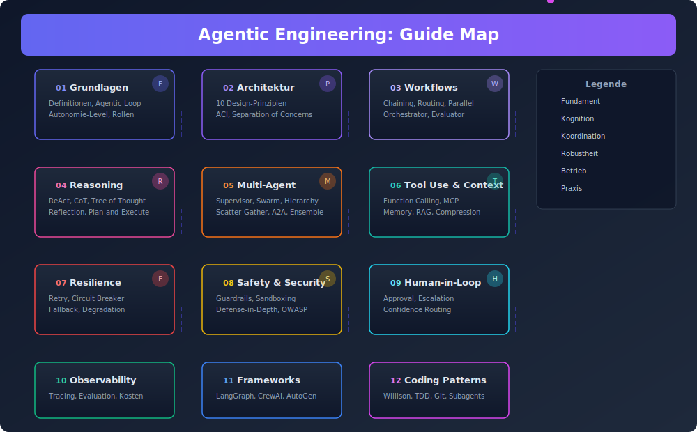
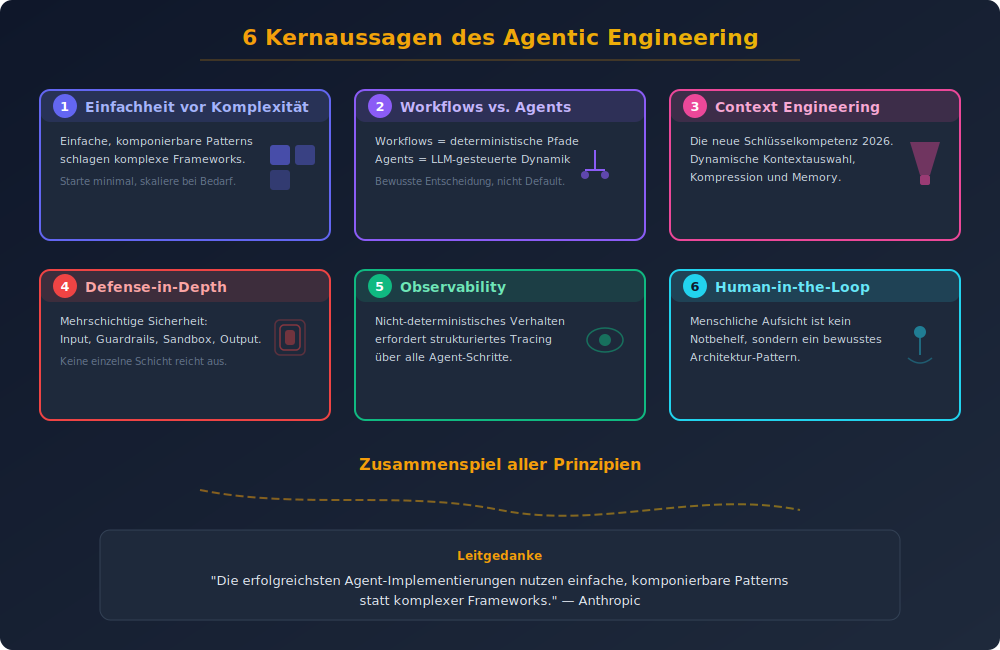

# Agentic Engineering: Prinzipien und Patterns

## Vollständiger Guide für Senior Developer und Senior Architekten

**Stand:** 2026-04-04

---

## Inhaltsverzeichnis

| Nr. | Dokument | Inhalt |
|-----|----------|--------|
| 01 | [Grundlagen und Definitionen](01_grundlagen.md) | Was ist Agentic Engineering? Kernkonzepte, Abgrenzungen |
| 02 | [Architektur-Prinzipien](02_architektur_prinzipien.md) | Fundamentale Design-Prinzipien für Agent-Systeme |
| 03 | [Workflow Patterns](03_workflow_patterns.md) | Prompt Chaining, Routing, Parallelization, Orchestrator-Worker, Evaluator-Optimizer |
| 04 | [Reasoning und Planning Patterns](04_reasoning_planning_patterns.md) | ReAct, Chain of Thought, Tree of Thought, Reflection, Planning |
| 05 | [Multi-Agent Patterns](05_multi_agent_patterns.md) | Orchestrierung, Kommunikation, Delegation, Swarm, Hierarchisch |
| 06 | [Tool Use und Context Engineering](06_tool_use_context_engineering.md) | Function Calling, MCP, Memory, RAG, Context Management |
| 07 | [Resilience und Error Handling Patterns](07_resilience_error_handling.md) | Retry, Fallback, Circuit Breaker, Graceful Degradation |
| 08 | [Safety, Security und Guardrails](08_safety_security_guardrails.md) | Prompt Injection Defense, Sandboxing, Input/Output Validation |
| 09 | [Human-in-the-Loop Patterns](09_human_in_the_loop.md) | Approval Workflows, Escalation, Confidence-Based Routing |
| 10 | [Observability und Evaluation](10_observability_evaluation.md) | Tracing, Monitoring, Testing, Benchmarking |
| 11 | [Praxis: Frameworks und Implementierung](11_frameworks_implementierung.md) | LangGraph, CrewAI, AutoGen, Claude Code, OpenAI Agents SDK |
| 12 | [Agentic Coding Patterns (Simon Willison)](12_agentic_coding_patterns.md) | Patterns für die Arbeit mit Coding Agents |

---

## Zusammenfassung

Agentic Engineering ist die Disziplin des Entwerfens, Bauens und Betreibens von KI-Agent-Systemen, die autonom Aufgaben ausführen können. Dieser Guide dokumentiert die etablierten Prinzipien und Patterns, die sich bis 2026 als Standard herauskristallisiert haben.

### Kernaussagen

1. **Einfachheit vor Komplexität** — Die erfolgreichsten Agent-Implementierungen nutzen einfache, komponierbare Patterns statt komplexer Frameworks (Anthropic).

2. **Workflows vs. Agents** — Es gibt eine fundamentale Unterscheidung zwischen vordefinierten Workflows (deterministische Pfade) und echten Agents (LLM-gesteuerte Entscheidungen).

3. **Context Engineering ist die neue Schlüsselkompetenz** — Performance-Gewinne kommen 2026 nicht mehr aus cleveren Prompts, sondern aus dynamischer Kontextauswahl, Kompression und Memory-Management.

4. **Defense-in-Depth für Safety** — Mehrere Sicherheitsschichten sind unverzichtbar: Input-Validierung, Guardrails, Sandboxing, Output-Filterung.

5. **Observability als Grundvoraussetzung** — Nicht-deterministisches Verhalten erfordert strukturiertes Tracing über alle Agent-Schritte hinweg.

6. **Human-in-the-Loop als Design-Pattern** — Menschliche Aufsicht ist kein Notbehelf, sondern ein bewusstes Architektur-Pattern.
