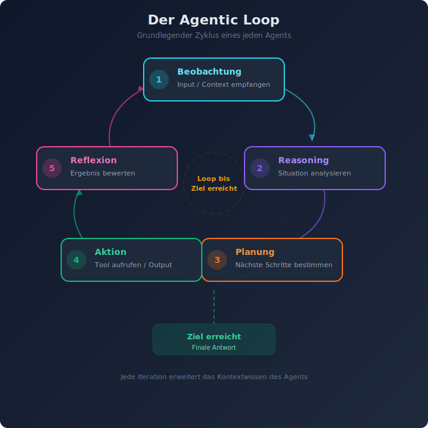
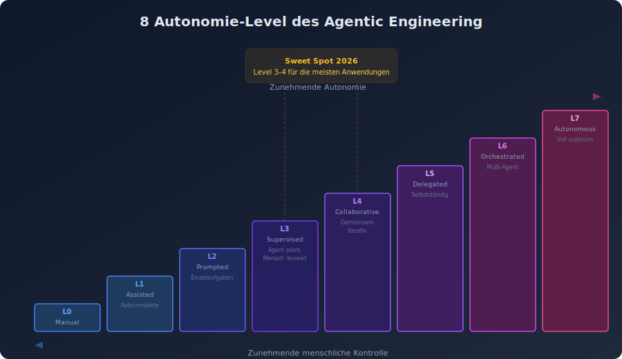
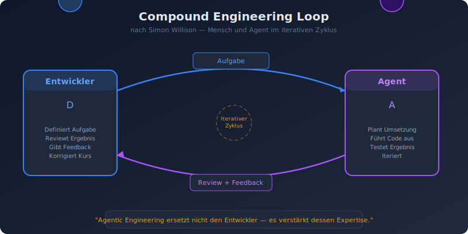
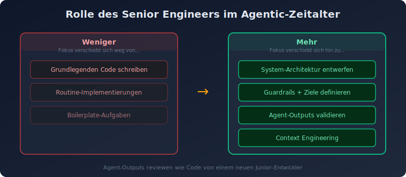

# 01 — Grundlagen und Definitionen

## Was ist Agentic Engineering?

**Agentic Engineering** bezeichnet die Disziplin, Software unter Einsatz von KI-Agents zu entwerfen, zu bauen und zu betreiben. Der Begriff umfasst sowohl das *Bauen von Agent-Systemen* als auch das *Arbeiten mit Coding Agents* (wie Claude Code, OpenAI Codex, Cursor).

> "Agentic Engineering is when professional software engineers use coding agents to improve and accelerate their work by amplifying their existing expertise."
> — Simon Willison, Agentic Engineering Patterns (2026)

### Abgrenzung: Workflow vs. Agent


Anthropic definiert eine fundamentale Unterscheidung:

| Eigenschaft | Workflow | Agent |
|-------------|----------|-------|
| **Steuerung** | Vordefinierte Code-Pfade | LLM steuert dynamisch |
| **Entscheidungen** | Deterministisch | Modell-basiert |
| **Flexibilität** | Gering, aber vorhersagbar | Hoch, aber weniger vorhersagbar |
| **Anwendung** | Gut definierte Aufgaben | Offene Problemstellungen |
| **Debugging** | Einfach (deterministische Pfade) | Komplex (nicht-deterministisch) |

**Workflows** sind Systeme, in denen LLMs und Tools durch *vordefinierten Code* orchestriert werden. **Agents** sind Systeme, in denen LLMs *dynamisch ihren eigenen Prozess und Tool-Einsatz steuern*.

### Wann Agents einsetzen?

Agents eignen sich für Anwendungen, die:
- **Offene Problemstellungen** lösen müssen
- **Autonome Entscheidungsfindung** erfordern
- **Komplexe, mehrstufige Workflows** managen
- **Echtzeit-Interaktion** mit externen Datenquellen benötigen
- **Wissensintensive Aufgaben** automatisieren

### Wann *keine* Agents einsetzen?

- Wenn eine einfache API-Anfrage oder ein deterministic Workflow ausreicht
- Wenn die Aufgabe klar definiert und unveränderlich ist
- Wenn die Fehlertoleranz gering ist und jeder Fehler kritisch wäre
- Wenn Latenz- oder Kostenanforderungen eng sind

## Fundamentale Konzepte

### Der Agentic Loop



Der grundlegende Zyklus eines Agents:

```
┌─────────────────────────────────┐
│  1. Beobachtung (Observation)   │
│     Input/Context empfangen     │
├─────────────────────────────────┤
│  2. Reasoning (Denken)          │
│     Situation analysieren       │
├─────────────────────────────────┤
│  3. Planung (Planning)          │
│     Nächste Schritte bestimmen  │
├─────────────────────────────────┤
│  4. Aktion (Action)             │
│     Tool aufrufen / Output      │
├─────────────────────────────────┤
│  5. Reflexion (Reflection)      │
│     Ergebnis bewerten           │
└──────────┬──────────────────────┘
           │ Loop bis Ziel erreicht
           └──────────────────────→
```

### Autonomie-Level



Die 8 Level des Agentic Engineering (nach AICraftGuide 2026):

| Level | Bezeichnung | Beschreibung |
|-------|-------------|--------------|
| 0 | Manual | Kein Agent-Einsatz |
| 1 | Assisted | Agent als Autocomplete (Copilot-Style) |
| 2 | Prompted | Agent führt einzelne Aufgaben auf Anfrage aus |
| 3 | Supervised | Agent plant und führt aus, Mensch reviewt |
| 4 | Collaborative | Agent und Mensch arbeiten gemeinsam iterativ |
| 5 | Delegated | Agent arbeitet selbstständig an definierten Tasks |
| 6 | Orchestrated | Mehrere Agents mit automatischer Koordination |
| 7 | Autonomous | Voll autonome Agent-Systeme mit Selbstüberwachung |

### Compound Engineering Loop



Simon Willison beschreibt den **Compound Engineering Loop** als zentrales Konzept:

1. Der Entwickler gibt dem Agent eine Aufgabe
2. Der Agent plant, führt aus und testet
3. Der Entwickler reviewt das Ergebnis
4. Der Entwickler gibt Feedback / korrigiert
5. Der Agent iteriert basierend auf dem Feedback

Dieses Modell betont: **Agentic Engineering ersetzt nicht den Entwickler — es verstärkt dessen Expertise.**

## Die Rolle des Senior Engineers im Agentic-Zeitalter



Senior Engineers und Architekten verschieben ihren Fokus:

- **Weniger**: Grundlegenden Code schreiben
- **Mehr**: System-Architektur entwerfen, Ziele und Guardrails für Agents definieren, Outputs validieren
- **Kernkompetenz**: Agent-Outputs mit der gleichen Sorgfalt reviewen wie Code von einem neuen Junior-Entwickler
- **Neue Fähigkeit**: Context Engineering — die richtige Information zum richtigen Zeitpunkt in den richtigen Kontext bringen
