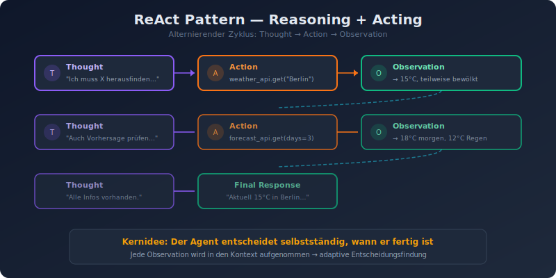
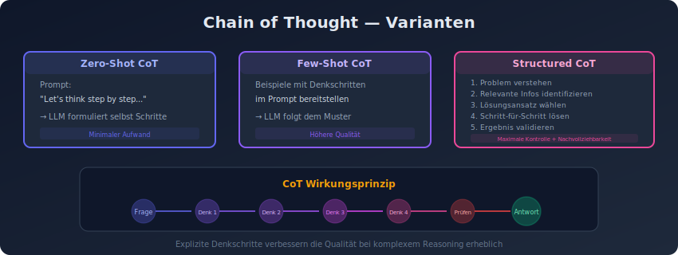
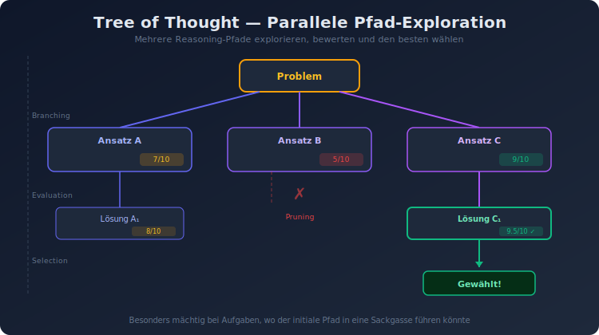
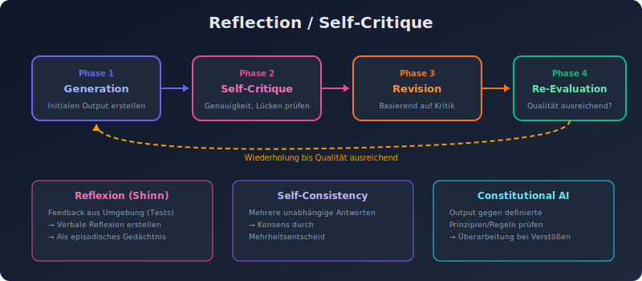
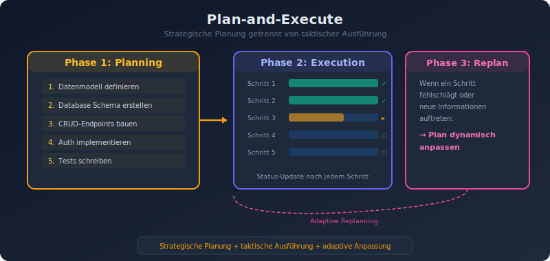
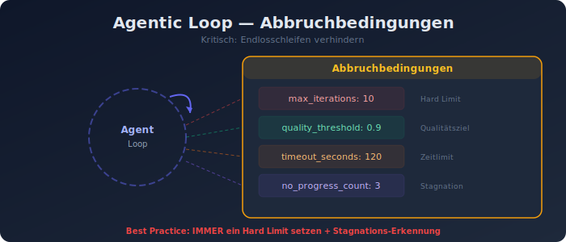

# 04 — Reasoning und Planning Patterns

## Überblick

Reasoning- und Planning-Patterns bilden das kognitive Fundament von Agent-Systemen. Sie bestimmen, *wie* ein Agent denkt, plant und seine Entscheidungen trifft. Diese Patterns transformieren einfache LLM-Aufrufe in strukturierte, nachvollziehbare Problemlösungsprozesse.

---

## Pattern 1: ReAct (Reasoning + Acting)



### Beschreibung
ReAct (Yao et al., 2022) ist das fundamentalste Agentic Pattern. Es kombiniert Reasoning (Denken) mit Acting (Handeln) in einem alternierenden Zyklus von **Thought → Action → Observation**.

### Funktionsweise
```
Thought: Ich muss die aktuelle Temperatur in Berlin herausfinden.
Action: weather_api.get_temperature(city="Berlin")
Observation: 15°C, teilweise bewölkt
Thought: Jetzt habe ich die Temperatur. Ich sollte auch die Vorhersage prüfen.
Action: weather_api.get_forecast(city="Berlin", days=3)
Observation: Morgen 18°C, übermorgen 12°C mit Regen
Thought: Ich habe alle Informationen. Ich erstelle die Zusammenfassung.
Action: respond("Aktuell 15°C in Berlin...")
```

### Wann einsetzen
- Aufgaben, die Echtzeit-Informationen aus externen Quellen erfordern
- Wenn der Agent seine Entscheidungen basierend auf Beobachtungen anpassen muss
- Für nachvollziehbare, schrittweise Problemlösung

### Implementierungsdetails
- System-Prompt definiert das Thought/Action/Observation-Format
- Tools werden als verfügbare Actions definiert
- Jede Observation wird in den Kontext aufgenommen
- Der Agent entscheidet selbstständig, wann er fertig ist

### Varianten
- **ReAct mit Self-Consistency**: Mehrere ReAct-Ketten parallel, Konsens-Bildung
- **ReAct mit Reflexion**: Nach jeder Observation zusätzliche Selbstbewertung

### Trade-offs
- **Pro**: Nachvollziehbar, adaptiv, ground truth durch Tool-Nutzung
- **Contra**: Latenz durch sequentielle Schritte, Token-intensiv

---

## Pattern 2: Chain of Thought (CoT)



### Beschreibung
Chain of Thought zwingt das LLM, seine Denkschritte explizit zu formulieren, bevor es eine Antwort gibt. Dies verbessert die Qualität bei komplexen Reasoning-Aufgaben erheblich.

### Varianten

#### Standard CoT
```
Prompt: "Denke Schritt für Schritt nach..."
→ LLM formuliert Zwischenschritte
→ Finale Antwort basiert auf den Schritten
```

#### Zero-Shot CoT
Einfach "Let's think step by step" an den Prompt anhängen.

#### Few-Shot CoT
Beispiele mit ausgeschriebenen Denkschritten im Prompt bereitstellen.

#### Structured CoT
Vorgegebenes Format für die Denkschritte:
```
1. Problem verstehen: ...
2. Relevante Informationen identifizieren: ...
3. Lösungsansatz wählen: ...
4. Schritt-für-Schritt-Lösung: ...
5. Ergebnis validieren: ...
```

### Wann einsetzen
- Mathematische Aufgaben und logisches Reasoning
- Komplexe Analyse-Aufgaben
- Wenn Nachvollziehbarkeit wichtiger als Geschwindigkeit ist

---

## Pattern 3: Tree of Thought (ToT)



### Beschreibung
Tree of Thought erweitert Chain of Thought, indem der Agent mehrere Reasoning-Pfade parallel exploriert und jeden Pfad bewertet, bevor er sich festlegt. Es ist besonders mächtig für Aufgaben, bei denen der initiale Reasoning-Pfad in eine Sackgasse führen könnte.

### Funktionsweise
```
Problem
├── Ansatz A
│   ├── Bewertung: 7/10
│   └── Weiterführung → Lösung A₁ (Score: 8/10)
├── Ansatz B
│   ├── Bewertung: 5/10
│   └── → Abbruch (zu niedrig)
└── Ansatz C
    ├── Bewertung: 9/10
    └── Weiterführung → Lösung C₁ (Score: 9.5/10) ✓ Gewählt
```

### Wann einsetzen
- Mathematische Problemlösung
- Strategische Planung
- Ambige, mehrstufige Reasoning-Aufgaben
- Wenn Backtracking nötig sein könnte

### Implementierungsdetails
- **Branching**: Mehrere Lösungsansätze generieren
- **Evaluation**: Jeden Ast mit einem Score bewerten
- **Pruning**: Schwache Äste frühzeitig abschneiden
- **Selection**: Den besten Pfad wählen oder Ergebnisse kombinieren

### Trade-offs
- **Pro**: Bessere Ergebnisse bei komplexen Problemen, Backtracking möglich
- **Contra**: Deutlich höherer Token-Verbrauch, Latenz

---

## Pattern 4: Reflection / Self-Critique



### Beschreibung
Der Agent generiert einen initialen Output und wechselt dann explizit in einen Kritik-Modus, um seine eigene Arbeit zu bewerten. Bei identifizierten Problemen überarbeitet er den Output iterativ.

### Funktionsweise
```
Phase 1: Generation
→ Agent erstellt initialen Output

Phase 2: Kritik
→ Agent bewertet: Genauigkeit, Constraints, logische Lücken

Phase 3: Revision (falls nötig)
→ Agent überarbeitet basierend auf Self-Critique

Phase 4: Re-Evaluation
→ Wiederholung bis Qualität ausreichend
```

### Varianten

#### Reflexion (Shinn et al., 2023)
- Agent erhält Feedback aus der Umgebung (z.B. Testergebnisse)
- Erstellt eine verbale "Reflexion" über das Fehlverhalten
- Nutzt die Reflexion als zusätzlichen Kontext für den nächsten Versuch
- Speichert Reflexionen als "episodisches Gedächtnis"

#### Self-Consistency
- Mehrere unabhängige Antworten generieren
- Konsens durch Mehrheitsentscheid bilden

#### Constitutional AI-Ansatz
- Agent prüft eigenen Output gegen definierte Prinzipien/Regeln
- Überarbeitung bei Verstößen

### Wann einsetzen
- Aufgaben, bei denen Fehler kritisch sind
- Code-Generierung (Agent testet und korrigiert eigenen Code)
- Wenn klare Qualitätskriterien existieren

### Trade-offs
- **Pro**: Höhere Qualität, reduziert Halluzinationen, selbstkorrigierend
- **Contra**: Verdoppelt mindestens den Token-Verbrauch, Risiko der Überkorrektur

---

## Pattern 5: Plan-and-Execute



### Beschreibung
Der Agent erstellt zuerst einen vollständigen Plan und führt dann die einzelnen Schritte systematisch aus. Dies trennt die strategische Planung von der taktischen Ausführung.

### Funktionsweise
```
Phase 1: Planning
Input: "Erstelle eine REST API für User-Management"
Plan:
  1. Datenmodell definieren (User, Role)
  2. Database Schema erstellen
  3. CRUD-Endpoints implementieren
  4. Authentication/Authorization hinzufügen
  5. Input-Validierung implementieren
  6. Tests schreiben
  7. API-Dokumentation erstellen

Phase 2: Execution
→ Schritt-für-Schritt Ausführung des Plans
→ Nach jedem Schritt: Status-Update und ggf. Plan-Anpassung

Phase 3: Adaptive Replanning
→ Wenn ein Schritt fehlschlägt oder neue Informationen auftreten
→ Plan wird dynamisch angepasst
```

### Varianten

#### Hierarchical Planning
- High-Level-Plan → Sub-Plans für jeden Schritt
- Verschachtelte Planung für komplexe Aufgaben

#### Adaptive Planning
- Plan wird nach jedem Schritt re-evaluiert
- Dynamische Anpassung an neue Erkenntnisse

### Wann einsetzen
- Komplexe, mehrstufige Aufgaben
- Aufgaben mit Abhängigkeiten zwischen Schritten
- Wenn ein strukturierter Ansatz die Qualität verbessert

### Trade-offs
- **Pro**: Strukturiert, nachvollziehbar, weniger "planlos" als reiner ReAct
- **Contra**: Initialer Plan kann suboptimal sein, Overhead für einfache Aufgaben

---

## Pattern 6: Prompt Chaining für Reasoning

### Beschreibung
Komplexe Reasoning-Aufgaben werden in eine Kette spezialisierter Prompts aufgeteilt, wobei jeder Prompt einen Aspekt des Problems behandelt.

### Beispiel: Komplexe Analyse
```
Prompt 1: "Extrahiere die relevanten Fakten aus diesem Text."
→ Fakten-Liste

Prompt 2: "Identifiziere Widersprüche in diesen Fakten."
→ Widerspruchs-Analyse

Prompt 3: "Bewerte die Glaubwürdigkeit jeder Quelle."
→ Quellenbewertung

Prompt 4: "Erstelle eine Synthese unter Berücksichtigung der Widersprüche und Glaubwürdigkeit."
→ Finale Analyse
```

### Wann einsetzen
- Wenn ein einzelner Prompt zu komplex wäre
- Wenn verschiedene Reasoning-Fähigkeiten benötigt werden
- Wenn Zwischenergebnisse validiert werden sollen

---

## Pattern 7: Agentic Loop mit Abbruchbedingungen



### Beschreibung
Der Agent arbeitet in einer Schleife, bis eine definierte Abbruchbedingung erfüllt ist. Kritisch: Die Abbruchbedingungen müssen sorgfältig definiert werden, um Endlosschleifen zu vermeiden.

### Abbruchbedingungen
```
loop_control:
  max_iterations: 10          # Hard Limit
  quality_threshold: 0.9      # Qualitätsschwellwert
  timeout_seconds: 120        # Zeitlimit
  no_progress_count: 3        # Abbruch bei Stagnation
  human_approval: true        # Mensch entscheidet über Abbruch
```

### Best Practices
- **Immer** ein Hard Limit für maximale Iterationen setzen
- **Stagnations-Erkennung**: Abbruch, wenn sich der Output nicht mehr verbessert
- **Kosten-Limit**: Maximale Token-Kosten pro Task
- **Logging**: Jeden Iterationsschritt dokumentieren
