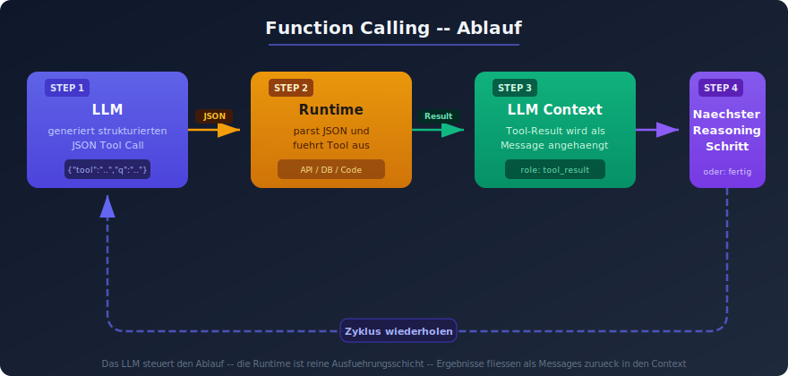
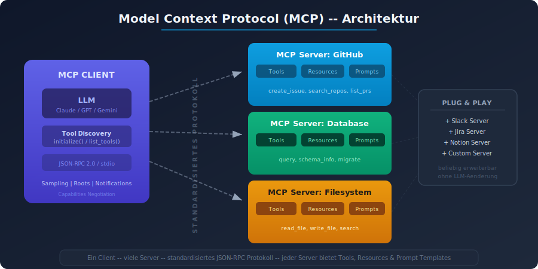
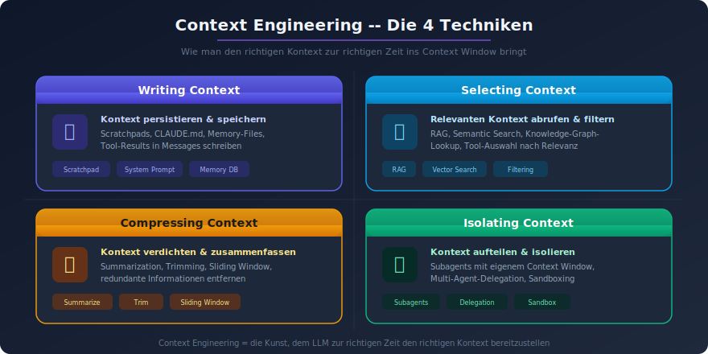
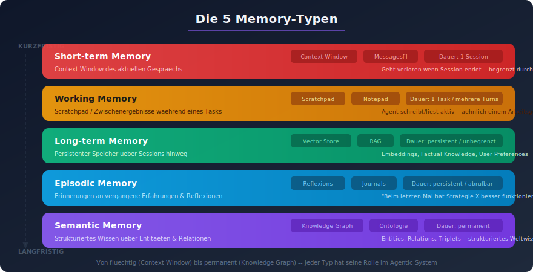

# 06 — Tool Use und Context Engineering

## Teil A: Tool Use Patterns

### Überblick
Tool Use ist die Fähigkeit eines Agents, externe APIs aufzurufen, Code auszuführen, Datenbanken abzufragen und mit Drittanbieter-Services zu interagieren. Es ist eines der definierenden Merkmale, das Agents von einfachen Chatbots unterscheidet.

---

### Pattern 1: Function Calling



#### Beschreibung
Das LLM generiert strukturierte Tool-Aufrufe (JSON), die von der Laufzeitumgebung ausgeführt und deren Ergebnisse zurück an das LLM geleitet werden.

#### Ablauf
```
LLM → {"tool": "search", "params": {"query": "..."}} → Runtime
Runtime → Tool Execution → Result
Result → LLM Context → Nächster Reasoning-Schritt
```

#### Best Practices
- **Tool-Beschreibungen**: Klar, eindeutig, mit Beispielen
- **Parameter-Typisierung**: Strenge Typen und Constraints
- **Error Responses**: Strukturierte Fehlermeldungen, die dem LLM helfen, sich zu korrigieren
- **Idempotenz**: Tools sollten bei Wiederholung dasselbe Ergebnis liefern

---

### Pattern 2: Tool Chaining

#### Beschreibung
Mehrere Tool-Aufrufe werden sequentiell verkettet, wobei das Ergebnis eines Tools den Input für den nächsten Tool-Aufruf bestimmt.

#### Beispiel
```
1. search_api("REST API Best Practices") → Ergebnisse
2. fetch_url(ergebnisse[0].url) → Seiteninhalt
3. extract_code(seiteninhalt) → Code-Beispiele
4. validate_code(code_beispiele) → Validierungsergebnis
```

---

### Pattern 3: Parallel Tool Execution

#### Beschreibung
Mehrere unabhängige Tool-Aufrufe werden gleichzeitig ausgeführt, um Latenz zu reduzieren.

#### Beispiel
```
Parallel:
├─ weather_api("Berlin") → 15°C
├─ news_api("Berlin") → Aktuelle Nachrichten
└─ events_api("Berlin") → Veranstaltungen
→ Aggregation: "Berlin heute: 15°C, ..."
```

---

### Pattern 4: Tool Selection Strategy

#### Beschreibung
Der Agent muss aus einer Menge verfügbarer Tools das richtige auswählen. Dies wird durch präzise Tool-Beschreibungen und strategisches Prompting gesteuert.

#### Strategien
- **Beschreibungsbasiert**: LLM wählt basierend auf Tool-Descriptions
- **Beispielbasiert**: Few-Shot-Beispiele für Tool-Nutzung im System-Prompt
- **Hierarchisch**: Erst Tool-Kategorie wählen, dann spezifisches Tool
- **Constraint-basiert**: Rules Engine filtert verfügbare Tools pro Kontext

---

### Pattern 5: Model Context Protocol (MCP)



#### Beschreibung
MCP (Anthropic, 2024) standardisiert die Verbindung zwischen LLMs und externen Datenquellen/Tools. Es definiert ein einheitliches Protokoll für Tool-Discovery, -Aufruf und -Ergebnisrückgabe.

#### Kernkonzepte
- **MCP Server**: Stellt Tools und Ressourcen bereit
- **MCP Client**: Verbindet LLM mit MCP Servern
- **Tool Discovery**: Dynamische Erkennung verfügbarer Tools
- **Resource Access**: Standardisierter Zugriff auf Datenquellen
- **Prompt Templates**: Wiederverwendbare Prompt-Bausteine

#### Vorteile
- Einheitliche Schnittstelle für alle externen Integrationen
- Plug-and-Play: Neue Tools ohne Code-Änderungen hinzufügen
- Standardisiertes Error Handling
- Community-Ökosystem von MCP Servern

---

## Teil B: Context Engineering

### Definition



> "Context Engineering is the practice of deciding what information an AI model sees, when it sees it, and how it is structured at runtime."
> — Anthropic, Effective Context Engineering for AI Agents (2026)

Context Engineering ist die natürliche Weiterentwicklung von Prompt Engineering. Während Prompt Engineering sich auf die *Formulierung* von Anweisungen konzentriert, befasst sich Context Engineering mit dem *Management des gesamten Informationsraums*, den ein Agent während seiner Arbeit nutzt.

### Kernunterscheidung

| Aspekt | Prompt Engineering | Context Engineering |
|--------|-------------------|-------------------|
| Fokus | Formulierung von Anweisungen | Management des gesamten Kontexts |
| Scope | Einzelner Prompt | Gesamter Agent-Lebenszyklus |
| Dynamik | Statisch | Dynamisch zur Laufzeit |
| Optimierung | Bessere Wortwahl | Relevanz, Kompression, Timing |

---

### Technik 1: Writing Context (Kontext schreiben)

#### Beschreibung
Informationen, die nicht sofort benötigt werden, aber später relevant sein könnten, werden *außerhalb* des Context Windows gespeichert (z.B. in Dateien, Datenbanken).

#### Implementierung
- Scratchpad-Files für Zwischenergebnisse
- Zusammenfassungen langer Dokumente erstellen und speichern
- Key Facts extrahieren und in strukturierten Speicher schreiben
- "Notizen an sich selbst" für spätere Agent-Iterationen

---

### Technik 2: Selecting Context (Kontext auswählen)

#### Beschreibung
Zur Laufzeit wird nur die *relevanteste* Information in das Context Window geladen. Mehr Kontext ≠ bessere Performance.

#### Implementierung
- **RAG**: Relevante Dokumente per Embedding-Suche finden
- **Tool-Results-Filtering**: Nur relevante Teile von Tool-Ergebnissen einfügen
- **Conditional Context**: Kontext-Blöcke basierend auf Aufgabentyp ein-/ausblenden
- **Recency Bias**: Neuere Informationen priorisieren

---

### Technik 3: Compressing Context (Kontext komprimieren)

#### Beschreibung
Vorhandenen Kontext auf die wesentlichen Informationen reduzieren, um das Context Window effizient zu nutzen.

#### Implementierung
- **Zusammenfassungen**: Lange Konversationen zusammenfassen
- **Key-Facts-Extraktion**: Nur Schlüsselinformationen behalten
- **Sliding Window**: Ältere Nachrichten zusammenfassen, neuere behalten
- **Structured Compression**: Fließtext in strukturierte Daten umwandeln

---

### Technik 4: Isolating Context (Kontext isolieren)

#### Beschreibung
Verschiedene Aufgaben oder Agent-Schritte erhalten jeweils nur den für sie relevanten Kontext — nicht den gesamten Zustand.

#### Implementierung
- **Subagents** mit isoliertem Context Window
- **Tool-spezifische Kontexte**: Jedes Tool erhält nur relevante Informationen
- **Konversations-Branching**: Parallele Kontexte für verschiedene Reasoning-Pfade

---

### Technik 5: System Prompt Design

#### Beschreibung
Der System-Prompt ist das Fundament eines zuverlässigen Agents. Er definiert Rolle, Tonalität, Grenzen und Verhaltensmuster.

#### Best Practices (aus Manus-Erfahrungen und Anthropic-Empfehlungen)
- **Rolle klar definieren**: Was der Agent ist und was nicht
- **Grenzen setzen**: Was der Agent nicht tun soll
- **Format vorgeben**: Wie Output strukturiert sein soll
- **Prioritäten definieren**: Welche Aspekte am wichtigsten sind
- **Keine Few-Shot-Prompts in Agent-Systemen**: LLMs imitieren Muster exzellent — auch wenn sie nicht mehr optimal sind

#### Warnung
> "Few-shot prompting can backfire in agent systems. Language models are excellent mimics and will imitate patterns in the context even when no longer optimal."
> — Anthropic

---

### Technik 6: Memory Management



#### Beschreibung
Langfristiges Kontextbewusstsein durch verschiedene Gedächtnis-Formen:

#### Memory-Typen
| Typ | Beschreibung | Implementierung |
|-----|-------------|-----------------|
| **Short-term** | Aktuelle Konversation | Context Window |
| **Working** | Aktuelle Aufgaben-State | Scratchpad, State Object |
| **Long-term** | Vergangene Interaktionen | Vector Store, DB |
| **Episodic** | Spezifische Erfahrungen | Reflexions-Speicher |
| **Semantic** | Faktenwissen | Knowledge Graph, RAG |

#### Lektionen aus Manus (2026)
- KV-Cache-Optimierung ist entscheidend für Produktions-Performance
- "Cache-freundlich" strukturieren: Statische Inhalte am Anfang, dynamische am Ende
- Kontext-Kompression erst unter Druck, nicht prophylaktisch
- Memory-Management ist der primäre Performance-Hebel 2026
