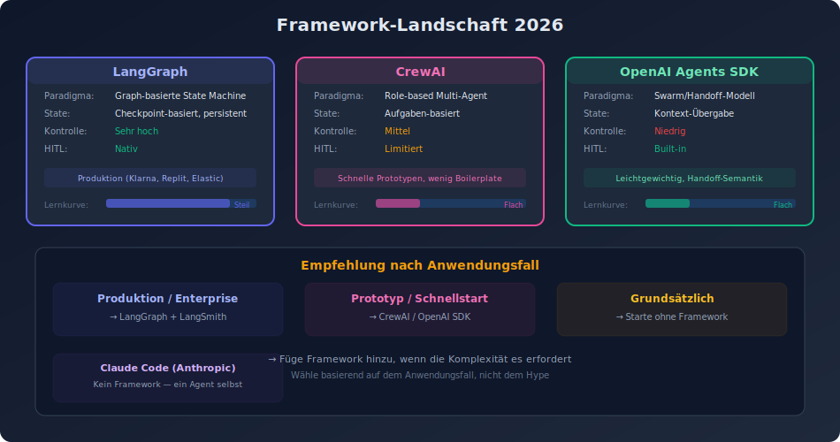

# 11 — Praxis: Frameworks und Implementierung

## Überblick



Drei Frameworks dominieren die AI-Agent-Orchestrierung in 2026: **LangGraph**, **CrewAI** und **AutoGen**. Daneben haben **OpenAI Agents SDK**, **Google ADK** und **Claude Code** (als Coding-Agent) bedeutende Marktanteile.

---

## LangGraph

### Paradigma
Graph-basierte State Machine. Agents werden als gerichtete Graphen modelliert, bei denen Knoten Funktionen sind, Kanten Übergänge definieren und der State nach jedem Schritt persistent gespeichert wird.

### Kernkonzepte
- **Nodes**: Funktionen/Agents, die State transformieren
- **Edges**: Übergänge zwischen Nodes (bedingt oder unbedingt)
- **State**: Immutable, nach jedem Node gespeichert (Checkpoint)
- **Conditional Edges**: Dynamische Pfadwahl basierend auf aktuellem State

### Architektur
```python
# Konzeptuell
graph = StateGraph(AgentState)
graph.add_node("researcher", research_agent)
graph.add_node("analyst", analysis_agent)
graph.add_node("writer", writing_agent)
graph.add_edge("researcher", "analyst")
graph.add_conditional_edges("analyst", route_function)
```

### Stärken
- Fein-granulare Kontrolle über Workflows
- Persistent State mit automatischem Crash Recovery
- Production-ready (genutzt von Klarna, Replit, Elastic)
- Unterstützt Human-in-the-Loop nativ
- State-Checkpointing mit MemorySaver, SqliteSaver, PostgresSaver

### Wann einsetzen
- Komplexe Workflows mit bedingter Logik
- Wenn State Persistence und Crash Recovery nötig sind
- Produktionssysteme mit hohen Zuverlässigkeitsanforderungen
- Wenn feingranulare Kontrolle über den Agent-Fluss benötigt wird

### Patterns in LangGraph
- **Pipeline of Agents**: Single Responsibility pro Node
- **Scatter-Gather**: Parallele Knoten mit Aggregation
- **Supervisor**: Ein Knoten als Supervisor mit konditionalen Edges zu Workers
- **Human-in-the-Loop**: Interrupt-Nodes für menschliche Genehmigung

---

## CrewAI

### Paradigma
Role-based Multi-Agent-Framework. Agents werden als Team-Mitglieder mit definierten Rollen, Zielen und Backstories konfiguriert.

### Kernkonzepte
- **Agent**: Definiert durch Role, Goal, Backstory, Tools
- **Task**: Beschreibung, erwarteter Output, zugewiesener Agent
- **Crew**: Zusammenstellung von Agents und Tasks
- **Process**: Sequential oder Hierarchical Execution

### Architektur
```python
# Konzeptuell
researcher = Agent(
    role="Research Analyst",
    goal="Finde alle relevanten Informationen",
    backstory="Du bist ein erfahrener Analyst...",
    tools=[search_tool, fetch_tool]
)

task = Task(
    description="Recherchiere zum Thema X",
    agent=researcher,
    expected_output="Strukturierter Bericht"
)

crew = Crew(agents=[researcher, writer], tasks=[research_task, write_task])
```

### Stärken
- Intuitive Agent-Definition über Rollen
- Schneller Einstieg, wenig Boilerplate
- Gute Dokumentation und Community
- Built-in Delegation zwischen Agents

### Wann einsetzen
- Schnelle Prototypen mit Multi-Agent-Setups
- Wenn Rollen-basierte Struktur natürlich passt
- Für Teams, die schnell produktiv sein wollen

---

## AutoGen (Microsoft)

### Paradigma
Konversationsbasiertes Multi-Agent-Framework. Agents kommunizieren über Nachrichten in einer Konversation.

### Kernkonzepte
- **ConversableAgent**: Basis-Klasse für alle Agents
- **AssistantAgent**: LLM-basierter Agent
- **UserProxyAgent**: Repräsentiert den menschlichen Nutzer
- **GroupChat**: Mehrere Agents in einer Konversation

### Stärken
- Flexible Multi-Agent-Konversationen
- Gute Integration von Human-in-the-Loop
- Code-Execution in isolierter Umgebung
- Unterstützt verschiedene LLM-Provider

### Wann einsetzen
- Wenn Agents in einem "Gesprächs"-Format zusammenarbeiten sollen
- Für kollaborative Aufgaben, die Diskussion erfordern
- Wenn flexible Agent-Interaktionsmuster benötigt werden

---

## OpenAI Agents SDK

### Paradigma
Swarm-basiertes Handoff-Modell. Agents geben Kontrolle über explizite Handoffs an andere Agents weiter.

### Kernkonzepte
- **Agent**: Definiert durch Instructions, Tools, Handoffs
- **Handoff**: Explizite Übergabe an einen anderen Agent
- **Runner**: Führt den Agent-Loop aus
- **Guardrails**: Input/Output-Validierung

### Stärken
- Einfaches, leichtgewichtiges Modell
- Intuitive Handoff-Semantik
- Built-in Guardrails
- Gute OpenAI-Integration

### Wann einsetzen
- Wenn Agents in einem OpenAI-Ökosystem operieren
- Für einfache Multi-Agent-Setups mit klaren Übergabe-Punkten
- Wenn ein leichtgewichtiges Framework gewünscht ist

---

## Google Agent Development Kit (ADK)

### Paradigma
Enterprise-orientiertes Framework mit drei Basis-Patterns: Sequential, Loop, Parallel.

### Kernkonzepte
- **Agent**: Grundbaustein mit definierten Capabilities
- **Sequential/Loop/Parallel**: Drei Ausführungsmuster
- **A2A Protocol**: Inter-Agent-Kommunikationsstandard
- **Agent Engine**: Managed Hosting auf Google Cloud

### Stärken
- Enterprise-Grade mit Google Cloud Integration
- A2A Protocol für Interoperabilität
- Managed Deployment über Agent Engine
- Native Integration mit Google-Services

---

## Claude Code (Anthropic)

### Paradigma
Coding Agent mit Terminal-Zugang. Claude Code ist kein Framework zum Bauen von Agents, sondern ein Agent selbst — ein leistungsfähiger Coding-Agent, der direkt im Terminal arbeitet.

### Kernkonzepte
- **Agentic Loop**: Claude plant, führt aus und iteriert autonom
- **Tool Use**: Bash, File-Operationen, Web-Suche
- **Subagents**: Spezialisierte Sub-Agents für Teilaufgaben
- **CLAUDE.md**: Projekt-spezifische Konfiguration als Context Engineering

### Patterns für Claude Code
- **Rules Files (CLAUDE.md)**: Projekt-spezifische Constraints und Anweisungen
- **Subagent-Delegation**: Komplexe Aufgaben an spezialisierte Subagents delegieren
- **Git-Integration**: Commits, Branches, PRs als natürliche Workflow-Grenzen
- **Test-Driven**: Agent schreibt und führt Tests aus

---

## Framework-Vergleich

| Kriterium | LangGraph | CrewAI | AutoGen | OpenAI SDK | Google ADK |
|-----------|-----------|--------|---------|------------|-----------|
| **Lernkurve** | Steil | Flach | Mittel | Flach | Mittel |
| **Kontrolle** | Sehr hoch | Mittel | Mittel | Niedrig | Mittel |
| **Production Readiness** | Hoch | Mittel | Mittel | Hoch | Hoch |
| **State Management** | Exzellent | Basisch | Basisch | Basisch | Gut |
| **Human-in-the-Loop** | Nativ | Limitiert | Gut | Built-in | Gut |
| **Multi-Agent** | Flexibel | Role-based | Chat-based | Handoff | Protocol-based |
| **Vendor Lock-in** | Niedrig | Niedrig | Niedrig | Hoch (OpenAI) | Hoch (Google) |

---

## Empfehlungen für die Praxis

### Für Prototypen
→ **CrewAI** oder **OpenAI Agents SDK**: Schneller Start, wenig Boilerplate

### Für Produktion
→ **LangGraph**: Wenn maximale Kontrolle und Zuverlässigkeit gefordert sind
→ **Google ADK**: Wenn Google Cloud das Ziel ist

### Für Enterprise
→ **LangGraph + LangSmith**: Vollständiges Observability-Ökosystem
→ **Google ADK + Agent Engine**: Managed Multi-Agent-Infrastruktur

### Grundsätzlich
- Starte ohne Framework (einfache LLM-Calls + Tools)
- Füge ein Framework hinzu, wenn die Komplexität es erfordert
- Wähle das Framework basierend auf dem konkreten Anwendungsfall, nicht dem Hype
