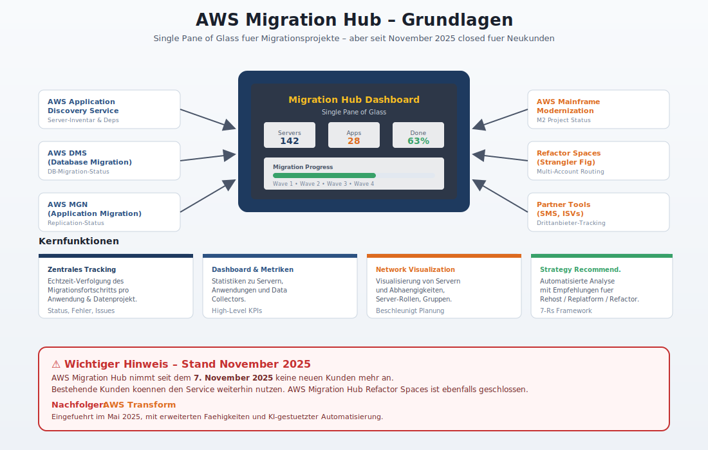
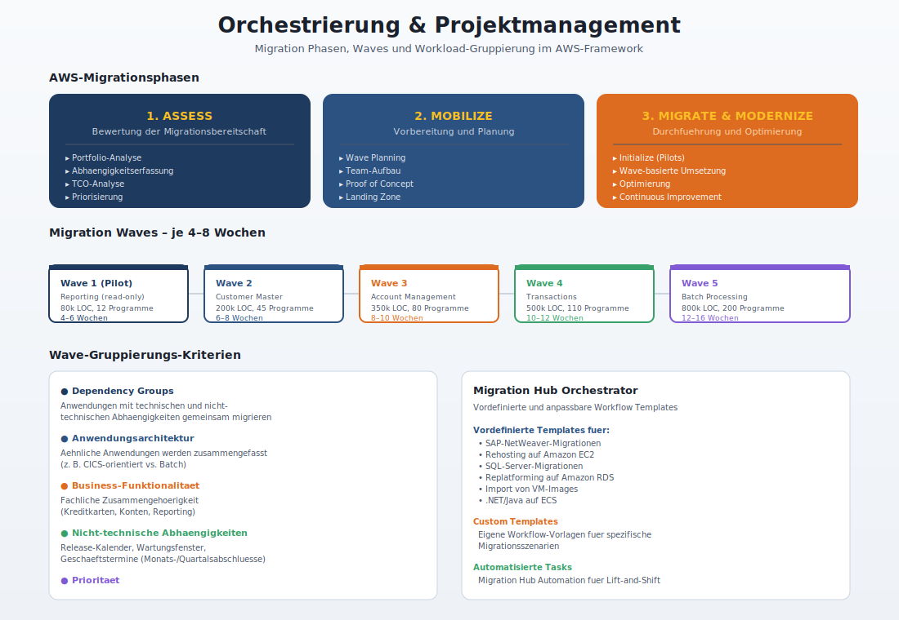
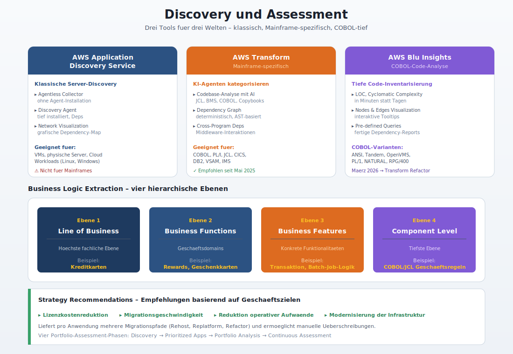
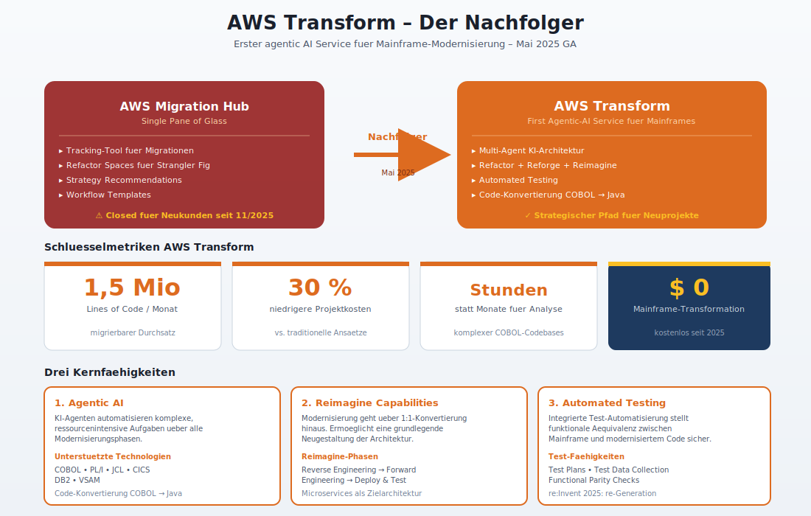
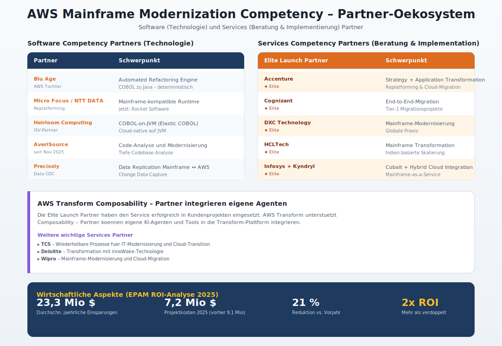
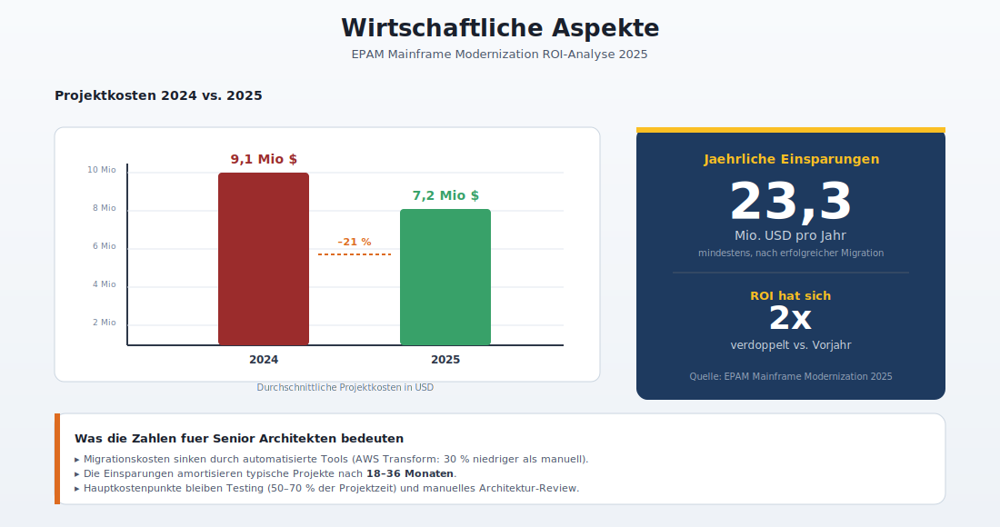
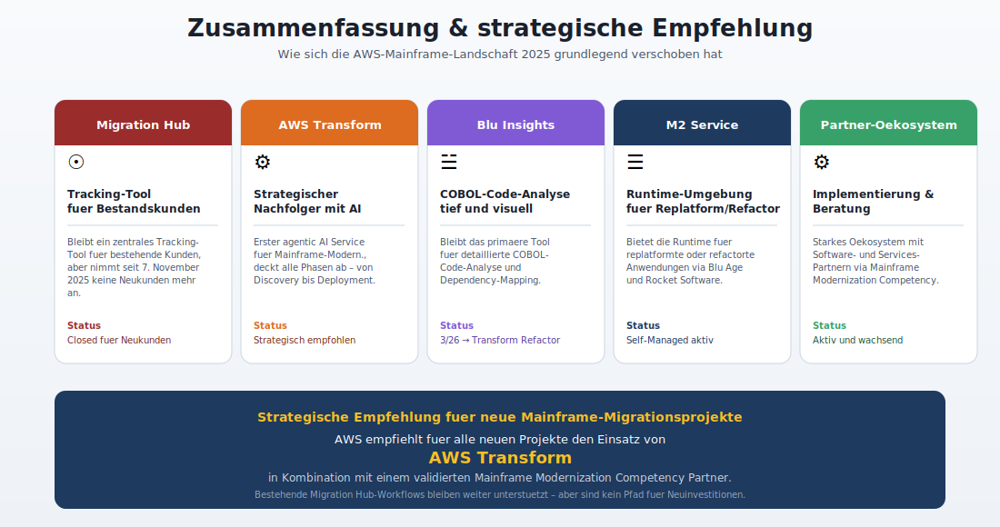

# AWS Migration Hub im Kontext von COBOL/Mainframe-Migrationen

## 1. AWS Migration Hub Grundlagen

### 1.1 Was ist AWS Migration Hub?

AWS Migration Hub ist ein zentraler Service von Amazon Web Services, der als **Single Pane of Glass** fuer die Planung, Verfolgung und Steuerung von Migrationsprojekten dient. Der Service fuehrt selbst keine Migration durch, sondern aggregiert den Status aus verschiedenen AWS- und Partner-Tools und stellt eine einheitliche Sicht bereit.

Migration Hub bietet folgende Kernfunktionen:

- **Zentrales Tracking**: Echtzeit-Verfolgung des Migrationsfortschritts fuer jede Anwendung oder jedes Datenmigrationsprojekt. Nutzer koennen Details wie die Anzahl migrierter Ressourcen, den Status einzelner Migrationsaufgaben sowie Fehler und Probleme einsehen.
- **Dashboard und Metriken**: Das Dashboard zeigt uebergeordnete Statistiken zu Servern, Anwendungen und Data Collectors (z. B. Application Discovery Service Agentless Collector, AWS Application Discovery Agent).
- **Network Visualization**: Beschleunigte Migrationsplanung durch Visualisierung von Servern und deren Abhaengigkeiten, Identifizierung von Server-Rollen und Gruppierung in Anwendungen.
- **Strategy Recommendations**: Automatisierte Analyse von Anwendungsportfolios mit Empfehlungen fuer Rehosting, Replatforming oder Refactoring.

### 1.2 Rolle bei Mainframe-Migrationen

Fuer Mainframe-Migrationen spielt Migration Hub primaer eine uebergeordnete Orchestrierungs- und Tracking-Rolle. Der Service integriert sich mit dem AWS Mainframe Modernization Service und dient als zentrale Steuerungsebene fuer das Gesamtprojekt.

**Wichtiger Hinweis (Stand November 2025):** AWS Migration Hub nimmt seit dem 7. November 2025 keine neuen Kunden mehr an. Bestehende Kunden koennen den Service weiterhin nutzen. Als Nachfolge-Service positioniert AWS den im Mai 2025 eingefuehrten Service **AWS Transform**, der erweiterte Faehigkeiten mit KI-gestuetzter Automatisierung bietet.

### 1.3 Integration mit AWS Mainframe Modernization

Die Integration zwischen Migration Hub und AWS Mainframe Modernization erfolgt ueber mehrere Mechanismen:

- **AWS Migration Hub Refactor Spaces** (ebenfalls seit November 2025 nicht mehr fuer neue Kunden offen): Verwaltung von Multi-Account-Refactoring-Umgebungen mit vereinfachtem Networking und Routing zwischen Mainframe und neuen Services. Refactor Spaces modelliert das **Strangler Fig Pattern** von Martin Fowler -- die schrittweise Abloesung eines Monolithen durch Microservices.
- **AWS Mainframe Modernization** unterstuetzt zwei Transformationsmuster:
  1. **Automated Refactoring**: Automatische Konvertierung von COBOL-Mainframe-Code zu Java
  2. **Replatforming**: Middleware-Emulation in einer Mainframe-kompatiblen Runtime-Umgebung (Micro Focus / NTT DATA Toolchains)

---

## 2. Orchestrierung und Projektmanagement

### 2.1 Migration Hub Orchestrator

AWS Migration Hub Orchestrator bietet vordefinierte und anpassbare **Workflow Templates**, die eine strukturierte Abfolge von Migrationsaufgaben, Tools und Automatisierungsmoeglichkeiten bereitstellen:

- **Vordefinierte Templates** fuer: SAP-NetWeaver-Migrationen, Rehosting auf Amazon EC2, SQL-Server-Migrationen, Replatforming auf Amazon RDS, Import von VM-Images, Replatforming von .NET/Java auf Amazon ECS
- **Custom Templates**: Erstellung eigener Workflow-Vorlagen fuer spezifische Migrationsszenarien
- **Automatisierte Tasks**: Integration von Migration Hub Automation fuer die Orchestrierung von Rehost-Migrationen (Lift-and-Shift)

### 2.2 Migration Journeys

Migration Hub Journeys machen Migrationen einfacher ausfuehrbar und nachverfolgbar, indem sie alle erforderlichen Schritte fuer eine erfolgreiche Migration zu AWS aufzeigen:

- Vorkonfigurierte Journeys mit definierten **Phasen, Modulen, Tasks und Subtasks**
- Templates bieten einen strukturierten Ansatz, der die Journey in logische Phasen und Module unterteilt
- Kombination aus automatisierten und manuellen Aufgaben

### 2.3 Migrationsphasen (AWS-Framework)

AWS definiert drei Hauptphasen fuer grosse Migrationen:

| Phase | Beschreibung | Aktivitaeten |
|---|---|---|
| **Assess** | Bewertung der Migrationsbereitschaft | Portfolio-Analyse, Abhaengigkeitserfassung, TCO-Analyse, Priorisierung |
| **Mobilize** | Vorbereitung und Planung | Wave Planning, Team-Aufbau, Proof of Concept, Landing Zone |
| **Migrate & Modernize** | Durchfuehrung der Migration | Initialisierung, wellenbasierte Umsetzung, Optimierung |

Die Migration selbst wird in zwei Stufen unterteilt: **Initialize** (Pilotprojekte) und **Implement** (skalierte Migration in Waves).

### 2.4 Migration Waves und Workload-Gruppierung

Migration Waves dauern typischerweise **4-8 Wochen** und werden nach folgenden Kriterien gruppiert:

- **Dependency Groups**: Anwendungen und Infrastruktur mit technischen und nicht-technischen Abhaengigkeiten, die gemeinsam migriert werden muessen
- **Anwendungsarchitektur**: Aehnliche Anwendungen werden zusammengefasst
- **Business-Funktionalitaet**: Fachliche Zusammengehoerigkeit
- **Nicht-technische Abhaengigkeiten**: Release-Kalender, Wartungsfenster, Geschaeftstermine (Monats-/Quartalsabschluesse)
- **Prioritaet**: Business-Kritikalitaet und strategische Bedeutung

---

## 3. Discovery und Assessment

### 3.1 AWS Application Discovery Service

Der Application Discovery Service ist in Migration Hub integriert und bietet:

- **Agentless Collector**: Erfassung von Server-Informationen ohne Installation eines Agents
- **Discovery Agent**: Tiefgehende Analyse mit installiertem Agent fuer detaillierte Abhaengigkeitsinformationen
- **Network Visualization**: Grafische Darstellung von Server-Abhaengigkeiten

### 3.2 Mainframe-spezifische Discovery mit AWS Transform

Fuer Mainframe-Workloads ist der traditionelle Application Discovery Service nicht direkt anwendbar. Stattdessen bietet **AWS Transform** (seit Mai 2025) spezialisierte Faehigkeiten:

- **Automatisierte Codebase-Analyse**: KI-Agenten kategorisieren Code-Komponenten inkl. JCL, BMS, COBOL-Programme und Copybooks
- **Dependency Graph Generation**: Deterministische Modellierung der gesamten Anwendungslandschaft mit Abhaengigkeitsgraphen, die auf tatsaechlicher Compiler-Semantik basieren
- **Cross-Program Dependencies**: Erfassung von Programm-Interaktionen, Middleware-Interaktionen und plattformspezifischem Verhalten
- **Business Logic Extraction**: KI-gestuetzte Kategorisierung auf vier hierarchischen Ebenen:
  1. **Line of Business** (z. B. Kreditkarten, Kredite)
  2. **Business Functions/Domains** (z. B. Rewards, Geschenkkarten)
  3. **Business Features** (Transaktions-/Batch-Job-Logik und Abhaengigkeiten)
  4. **Component Level** (spezifische Geschaeftsregeln aus COBOL- und JCL-Dateien)
- **Metriken**: Lines of Code, Cyclomatic Complexity, Dateityp-Verteilungen, Komponentenklassifizierung

### 3.3 AWS Blu Insights fuer COBOL-Analyse

AWS Blu Insights ist ein spezialisiertes Tool fuer die Analyse und Visualisierung von Mainframe-Codebases:

- **Unterstuetzte Sprachen**: COBOL, generiertes COBOL, PL/1, NATURAL, RPG/400, COBOL/400
- **Inventory-Analyse**: Volumen des Quellcodes, verwendete Sprachen, Cyclomatic Complexity -- Ergebnisse innerhalb weniger Minuten
- **Dependency-Analyse**: Erkennung von Abhaengigkeiten zwischen Dateien basierend auf ihrem Typ (Programm-Aufrufe, Copybook-Referenzen, Dataset-Zugriffe etc.)
- **Visualisierung**: Nodes-und-Edges-Darstellung mit Eigenschaften (Typ, Farbe, Name), interaktive Tooltips, Erkennung isolierter Knoten
- **COBOL-spezifisch**: Unterstuetzung verschiedener COBOL-Varianten (ANSI, Tandem, OpenVMS) und deren spezifische Verknuepfungsarten (CALL, COPY, etc.)
- **Vordefinierte Queries**: Fertige Abfragen fuer Dependency-Graphen

### 3.4 Strategy Recommendations und Portfolio-Assessment

AWS Migration Hub Strategy Recommendations analysiert laufende Anwendungen und gibt Empfehlungen basierend auf priorisierten Geschaeftszielen:

- **Lizenzkostenreduktion**
- **Migrationsgeschwindigkeit**
- **Reduktion operativer Aufwaende** durch Managed Services
- **Modernisierung der Infrastruktur** mit Cloud-nativen Technologien

Der Empfehlungsprozess liefert fuer jede Anwendung mehrere viable Migrationspfade (Rehost, Replatform, Refactor) und ermoeglicht manuelle Ueberschreibungen.

**Portfolio-Assessment-Phasen (AWS Prescriptive Guidance):**

1. **Discovery Acceleration und Initial Planning**: Ersterfassung und Planungsbeginn
2. **Prioritized Applications Assessment**: Detailbewertung priorisierter Anwendungen
3. **Portfolio Analysis und Migration Planning**: Portfolioweite Analyse und Wave Planning
4. **Continuous Assessment und Improvement**: Laufende Bewertung und Optimierung

---

## 4. AWS Transform -- Der Nachfolger fuer Mainframe-Migrationen

### 4.1 Ueberblick

AWS Transform wurde im **Mai 2025** als erster agentic AI Service fuer die Modernisierung von Mainframe-Workloads eingefuehrt. Er vereint und erweitert die Faehigkeiten mehrerer bestehender AWS-Services:

- **Agentic AI**: KI-Agenten automatisieren komplexe, ressourcenintensive Aufgaben ueber alle Modernisierungsphasen
- **Unterstuetzte Technologien**: COBOL, JCL, CICS, Db2, VSAM
- **Code-Konvertierung**: COBOL zu Java, JCL zu Groovy
- **Analyse-Geschwindigkeit**: Komplexe COBOL-Codebases in Stunden statt Monaten analysiert
- **Durchsatz**: 1,5 Millionen Lines of Code pro Monat migrierbar
- **Kostenvorteil**: 30 % niedrigere Projektkosten gegenueber traditionellen manuellen Ansaetzen

### 4.2 Reimagine-Faehigkeiten

AWS Transform bietet neben klassischem Refactoring auch **Reimagine Capabilities**, bei denen die Modernisierung ueber eine reine 1:1-Konvertierung hinausgeht und eine grundlegende Neugestaltung der Architektur ermoeglicht wird.

### 4.3 Automatisiertes Testing

Integrierte Test-Automatisierung stellt die funktionale Aequivalenz zwischen dem originalen Mainframe-Code und dem modernisierten Code sicher.

---

## 5. Partner-Integration

### 5.1 AWS Mainframe Modernization Competency

AWS hat eine spezifische **Mainframe Modernization Competency** eingefuehrt, die Partner in zwei Kategorien validiert:

#### Software Competency Partners (Technologie)
| Partner | Schwerpunkt |
|---|---|
| **Blu Age** | Automated Refactoring Engine (COBOL zu Java) |
| **Micro Focus / NTT DATA** | Replatforming mit Mainframe-kompatibler Runtime |
| **Heirloom Computing** | Mainframe-Modernisierung als ISV-Partner |
| **AveriSource** | Code-Analyse und Modernisierung (Competency seit November 2025) |
| **Precisely** | Data Replication zwischen Mainframe und AWS (CDC-Technologie) |

#### Services Competency Partners (Beratung und Implementierung)
| Partner | Schwerpunkt |
|---|---|
| **Accenture** | Strategie, Application Transformation, Replatforming, Cloud-Migration; Elite Launch Partner fuer AWS Transform |
| **Cognizant** | End-to-End-Migration von Mainframe-Workloads zu AWS; Elite Launch Partner fuer AWS Transform |
| **DXC Technology** | Mainframe-Modernisierung und Migration; Elite Launch Partner fuer AWS Transform |
| **HCLTech** | Mainframe-Transformation; Elite Launch Partner fuer AWS Transform |
| **Infosys** | Mainframe Modernization powered by Infosys Cobalt; Elite Launch Partner fuer AWS Transform |
| **Kyndryl** | Infrastructure Transformation, Hybrid Cloud Integration, Mainframe-as-a-Service; Elite Launch Partner fuer AWS Transform |
| **TCS** | Wiederholbare Prozesse fuer IT-Modernisierung und Cloud-Transition |
| **Deloitte** | Transformation mit innoWake-Technologie |
| **Wipro** | Mainframe-Modernisierung und Cloud-Migration |

### 5.2 AWS Transform Partner-Oekosystem

Die Elite Launch Partner fuer AWS Transform (Accenture, Cognizant, DXC Technology, HCLTech, Infosys, Kyndryl) haben den Service erfolgreich in Kundenprojekten eingesetzt. AWS Transform unterstuetzt **Composability** -- Partner koennen eigene Agenten und Tools in die Transform-Plattform integrieren.

### 5.3 Partner-Tools in Migration Hub

Migration Hub integriert Partner-Tools fuer das Tracking. Unterstuetzte Partner-Tools senden ihren Migrationsstatus an Migration Hub, wo dieser zentral aggregiert und visualisiert wird. Die wichtigsten Integrationen umfassen:

- **AWS Server Migration Service (SMS)**
- **AWS Database Migration Service (DMS)**
- **AWS Application Migration Service (MGN)**
- Diverse Drittanbieter-Migrationstools

---

## 6. Wirtschaftliche Aspekte

Laut der EPAM Mainframe Modernization ROI-Analyse (2025):

- **Durchschnittliche jaehrliche Einsparungen**: Mindestens 23,3 Millionen USD nach der Migration
- **Durchschnittliche Projektkosten 2024**: 9,1 Mio. USD
- **Durchschnittliche Projektkosten 2025**: 7,2 Mio. USD (21 % Reduktion)
- **ROI**: Mehr als verdoppelt im Vergleich zum Vorjahr

---

## 7. Zusammenfassung und Empfehlung

Die AWS-Landschaft fuer Mainframe-/COBOL-Migrationen hat sich 2025 signifikant veraendert:

1. **AWS Migration Hub** bleibt ein zentrales Tracking-Tool fuer bestehende Kunden, nimmt aber keine neuen Kunden mehr an.
2. **AWS Transform** ist der strategische Nachfolger mit agentic AI-Faehigkeiten, der speziell fuer Mainframe-Modernisierung entwickelt wurde.
3. **AWS Blu Insights** bleibt das primaere Tool fuer detaillierte COBOL-Code-Analyse und Dependency-Mapping.
4. **AWS Mainframe Modernization** bietet die Runtime-Umgebung fuer replatformte oder refactorte Anwendungen.
5. Ein starkes **Partner-Oekosystem** steht fuer Beratung und Implementierung zur Verfuegung.

Fuer neue Mainframe-Migrationsprojekte empfiehlt AWS den Einsatz von **AWS Transform** in Kombination mit einem validierten Partner aus dem Mainframe Modernization Competency-Programm.
