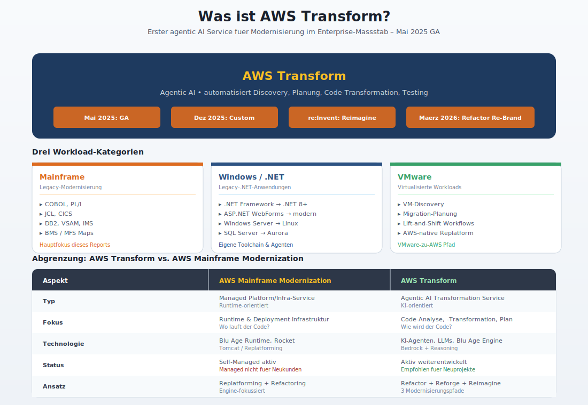
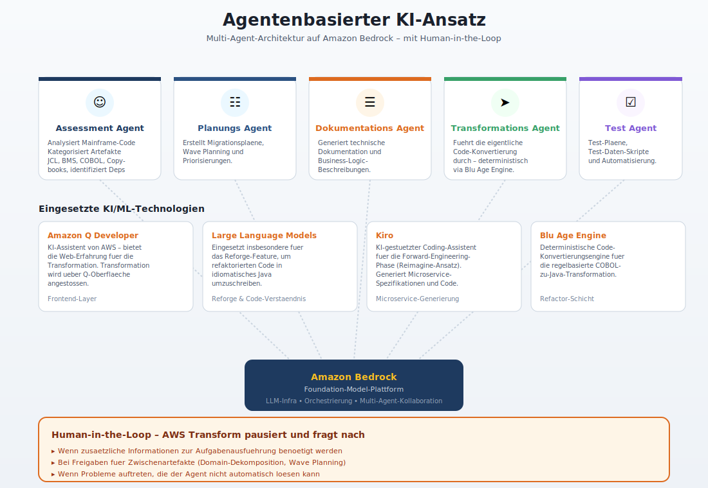
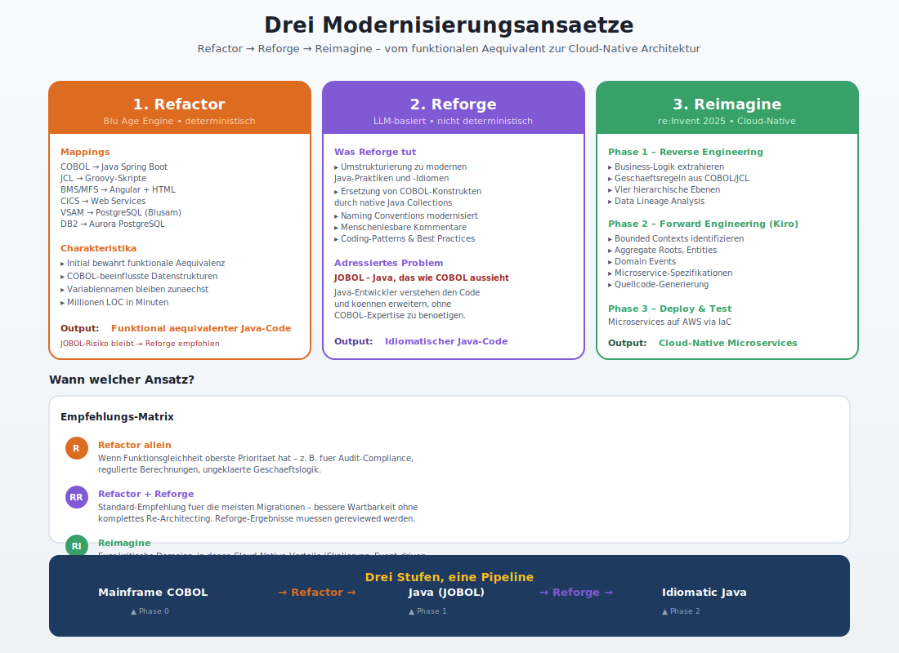
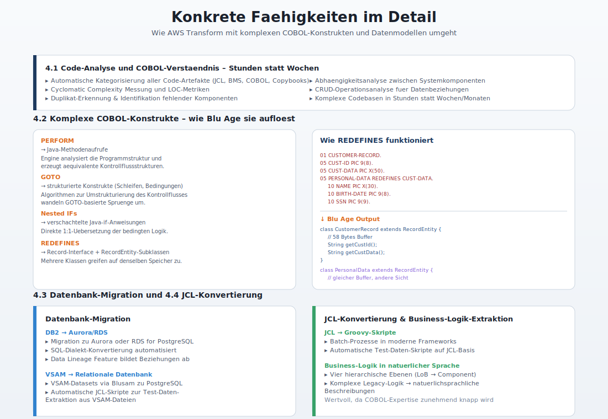
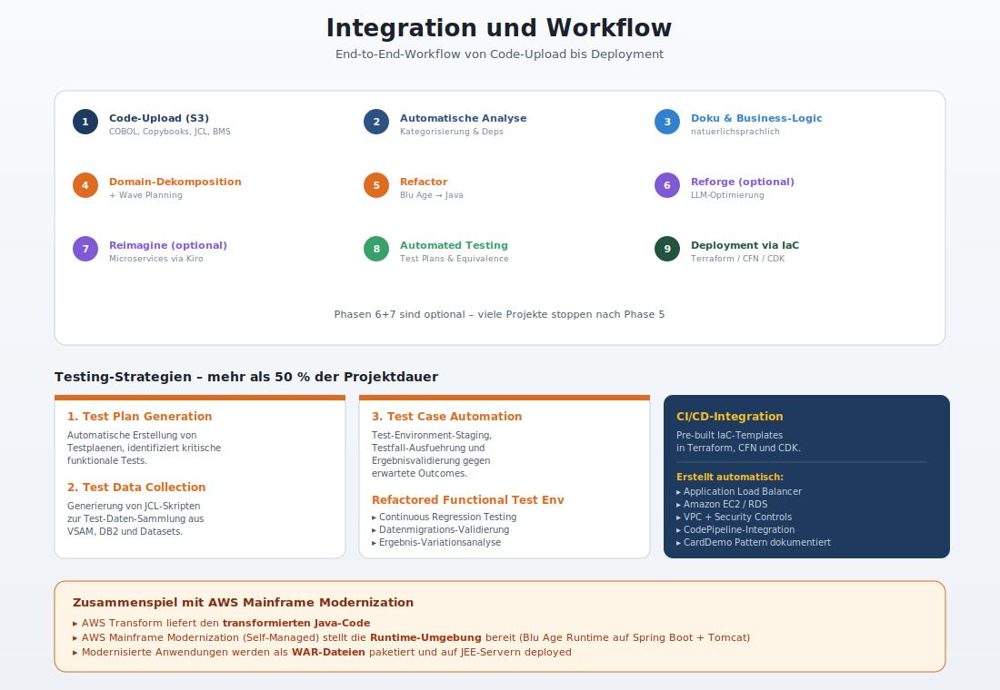
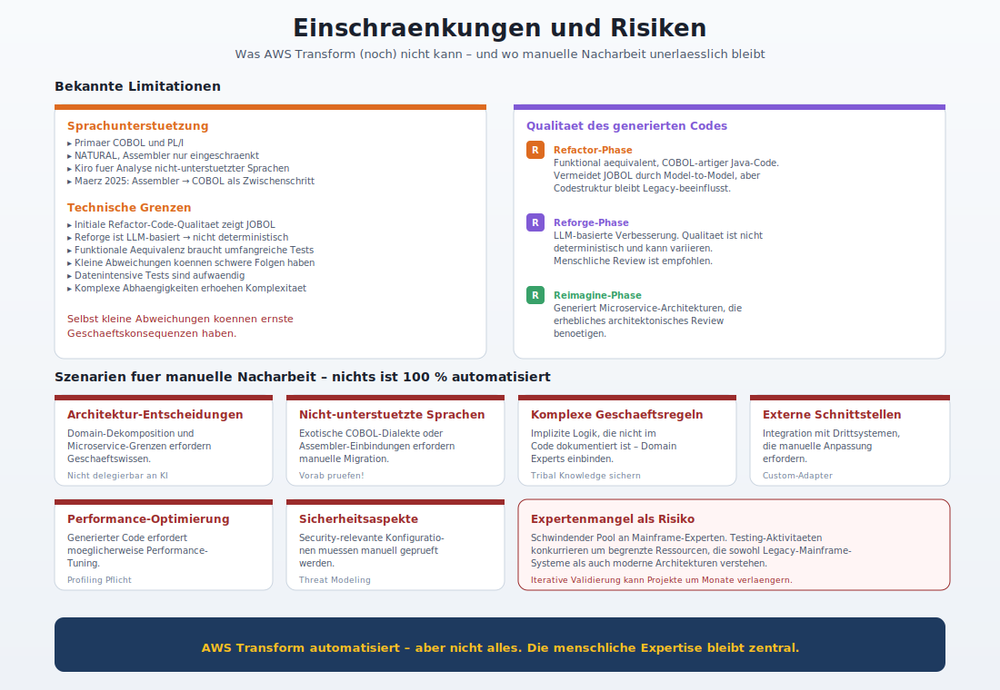
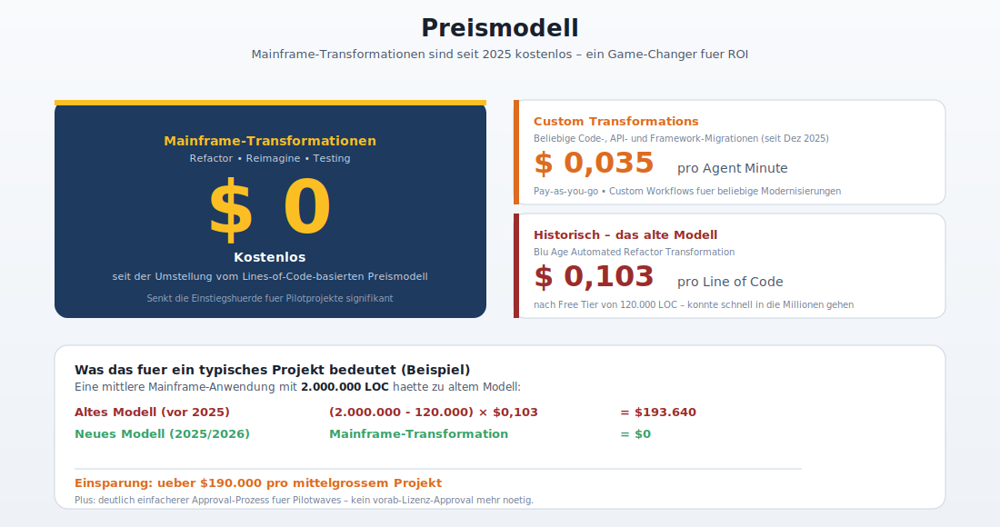
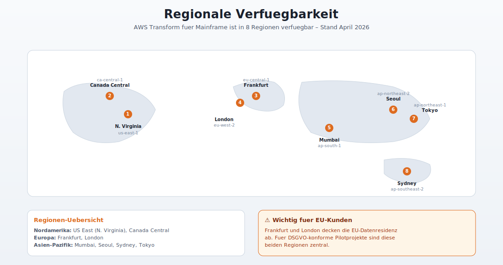
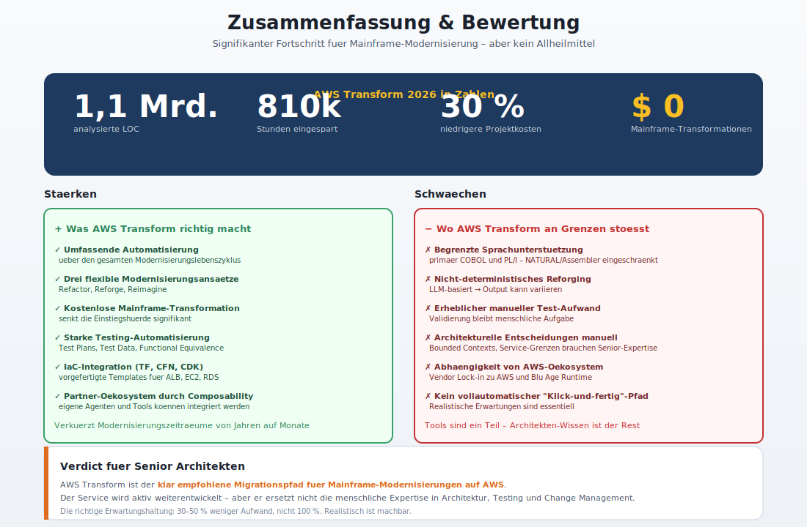

# AWS Transform fuer Mainframe -- Umfassender Bericht

> Stand: April 2026 | Recherchezeitraum: 2024--2026

---

## 1. Was ist AWS Transform?



### 1.1 Ueberblick

AWS Transform ist ein **agentenbasierter KI-Service** von Amazon Web Services, der im **Mai 2025** als General Availability (GA) gestartet wurde. AWS bezeichnet ihn als den **ersten Agentic-AI-Service fuer die Modernisierung von Mainframe-Workloads im Enterprise-Massstab**. Der Service automatisiert die komplexen, ressourcenintensiven Aufgaben ueber alle Phasen der Modernisierung hinweg -- von der initialen Analyse und Planung bis zur Code-Transformation und Anwendungsrestrukturierung.

AWS Transform deckt drei grosse Workload-Kategorien ab:
- **Mainframe** (COBOL, PL/I, JCL, CICS, DB2, VSAM)
- **Windows/.NET** (Legacy-.NET-Anwendungen)
- **VMware** (Virtualisierte Workloads)

Zusaetzlich bietet AWS Transform seit Dezember 2025 **Custom Transformations** fuer beliebige Code-, API- und Framework-Migrationen an.

### 1.2 Abgrenzung: AWS Transform vs. AWS Mainframe Modernization

| Aspekt | AWS Mainframe Modernization | AWS Transform |
|--------|----------------------------|---------------|
| **Typ** | Managed Platform/Infrastruktur-Service | Agentic-AI-Transformationsservice |
| **Fokus** | Runtime-Umgebung und Deployment-Infrastruktur | Automatisierte Code-Analyse, -Transformation und -Planung |
| **Technologie** | Blu Age Runtime, Rocket Software (Replatforming) | KI-Agenten, LLMs, Blu Age Transformation Engine |
| **Status** | Managed Runtime (Micro Focus) seit Nov. 2025 nicht mehr fuer Neukunden; Self-Managed weiterhin verfuegbar | Aktiv weiterentwickelt, empfohlener Pfad fuer neue Projekte |
| **Ansatz** | Replatforming + Refactoring | Refactoring + Reforging + Reimagining |

**Wichtig:** Im Maerz 2026 wurde **AWS Blu Insights in AWS Transform for Mainframe Refactor umbenannt**, was die Konsolidierung der Modernisierungswerkzeuge unter dem AWS-Transform-Dach unterstreicht.

AWS Mainframe Modernization bleibt als **Infrastruktur-Service** bestehen (Self-Managed Runtime fuer Blu Age und Rocket Software), waehrend AWS Transform die **intelligente Transformationsschicht** darstellt, die den Modernisierungsprozess durch KI-Agenten beschleunigt.

---

## 2. Agentenbasierter KI-Ansatz



### 2.1 Architektur

AWS Transform basiert auf einer **Multi-Agent-Architektur**, die auf **Amazon Bedrock** aufbaut. Spezialisierte KI-Agenten uebernehmen unterschiedliche Aufgaben im Modernisierungsprozess:

- **Assessment-Agent**: Analysiert den bestehenden Mainframe-Code, kategorisiert Artefakte (JCL, BMS, COBOL-Programme, Copybooks) und identifiziert Abhaengigkeiten.
- **Planungs-Agent**: Erstellt Migrationplaene, Wave Planning und Priorisierungen.
- **Dokumentations-Agent**: Generiert technische Dokumentation und Business-Logic-Beschreibungen.
- **Transformations-Agent**: Fuehrt die eigentliche Code-Konvertierung durch.
- **Test-Agent**: Generiert Testplaene, Testdaten-Sammlungsskripte und Test-Automatisierungsskripte.

### 2.2 Eingesetzte KI/ML-Technologien

- **Amazon Bedrock**: Foundation-Model-Plattform, auf der die Agenten operieren. Bedrock stellt die LLM-Infrastruktur bereit, einschliesslich Orchestrierung, Tool-Nutzung und Multi-Agent-Kollaboration.
- **Large Language Models (LLMs)**: Werden insbesondere fuer das **Reforge**-Feature eingesetzt, um refaktorierten Code in idiomatisches Java umzuschreiben.
- **Amazon Q Developer**: Der KI-Assistent von AWS ist eng integriert und bietet die Web-Erfahrung fuer die Transformation. Die Transformation wird ueber die Amazon-Q-Developer-Oberflaeche angestossen.
- **Kiro**: Ein KI-gestuetzter Coding-Assistent, der fuer die **Forward-Engineering-Phase** (Reimagine-Ansatz) eingesetzt wird und Microservice-Spezifikationen sowie Quellcode generiert.
- **AWS Blu Age Transformation Engine**: Die deterministische Code-Konvertierungsengine, die fuer die regelbasierte COBOL-zu-Java-Transformation verantwortlich ist.

### 2.3 Human-in-the-Loop

AWS Transform implementiert einen **Human-in-the-Loop-Ansatz**. Der Service pausiert und fordert menschliche Eingaben an, wenn:
- Zusaetzliche Informationen zur Ausfuehrung von Aufgaben benoetigt werden
- Freigaben fuer Zwischenartefakte erforderlich sind (z. B. Domain-Dekomposition oder Wave Planning)
- Probleme auftreten, die der Agent nicht automatisch loesen kann

---

## 3. Modernisierungsansaetze



AWS Transform bietet drei Hauptansaetze fuer die Mainframe-Modernisierung:

### 3.1 Refactor

Der **Refactor-Ansatz** ist die Kernfaehigkeit und nutzt die **AWS Blu Age Transformation Engine**:

1. **Code-Upload**: Der COBOL-Mainframe-Code wird in einen Amazon-S3-Bucket hochgeladen.
2. **Automatische Analyse**: AWS Transform kategorisiert Code-Komponenten (JCL, BMS, COBOL-Programme, Copybooks), fuehrt Abhaengigkeitsanalysen durch und erkennt fehlende Artefakte.
3. **Code-Transformation**: Automatische Konvertierung:
   - **COBOL** → **Java** (Spring Boot)
   - **JCL** → **Groovy-Skripte**
   - **BMS/MFS Screens** → **HTML (Sass) + JavaScript (Angular)**
   - **CICS-Transaktionen** → **Web Services**
   - **VSAM** → **Relationale Datenbanken** (PostgreSQL/Aurora via Blusam)
   - **DB2** → **Amazon Aurora/RDS for PostgreSQL**
4. **Funktionale Aequivalenz**: Die initiale Transformation bewahrt exakte funktionale Aequivalenz. COBOL-beeinflusste Datenstrukturen und Variablennamen bleiben zunaechst erhalten.

Der Service kann **Millionen von Lines of Code in Minuten** transformieren.

### 3.2 Reforge

**Reforge** ist eine optionale Nachbearbeitungsphase, die **Large Language Models** einsetzt:

- **Umstrukturierung** des refaktorierten Codes, um **modernen Java-Praktiken und -Idiomen** zu folgen
- **Ersetzung von COBOL-artigen Konstrukten** durch native Java-Collections und Naming Conventions
- **Hinzufuegen von menschenlesbaren Kommentaren** und Dokumentation
- **Implementierung moderner Coding-Patterns** und Best Practices
- **Ziel**: Java-Entwickler sollen den Code verstehen und erweitern koennen, **ohne COBOL-Expertise** zu benoetigen

Reforge adressiert das sogenannte **JOBOL-Problem** -- Java-Code, der die Struktur von COBOL nachahmt und fuer Java-Entwickler schwer wartbar ist.

### 3.3 Reimagine

Der **Reimagine-Ansatz** (angekuendigt auf der re:Invent 2025) geht ueber einfaches Refactoring hinaus und transformiert monolithische Mainframe-Anwendungen in **Cloud-native Microservices**:

**Phase 1 -- Reverse Engineering (AWS Transform):**
- Extraktion von Business-Logik und Geschaeftsregeln aus bestehendem COBOL/JCL-Code
- Kategorisierung auf vier hierarchischen Ebenen:
  1. **Line of Business** (Geschaeftsbereich)
  2. **Business Functions/Domains** (Geschaeftsfunktionen)
  3. **Business Features** (Geschaeftsmerkmale)
  4. **Component Level** (Komponentenebene)
- **Data Lineage Analysis**: Verstaendnis der Daten- und Quellcodebeziehungen
- **Automatische Data Dictionary Generation** aus Legacy-Quellcode

**Phase 2 -- Forward Engineering (Kiro):**
- Analyse der extrahierten Business-Logik
- Identifikation von **Bounded Contexts, Aggregate Roots, Entities und Domain Events**
- Generierung umfassender **Microservice-Spezifikationen** mit klaren Service-Grenzen und Integrationsmustern
- Quellcode-Generierung fuer die neuen Microservices

**Phase 3 -- Deploy & Test:**
- Deployment der generierten Microservices auf AWS mittels Infrastructure as Code

---

## 4. Konkrete Faehigkeiten im Detail



### 4.1 Code-Analyse und COBOL-Verstaendnis

- **Automatische Kategorisierung** aller Code-Artefakte (JCL, BMS, COBOL, Copybooks)
- **Cyclomatic Complexity Messung** und Lines-of-Code-Metriken
- **Duplikat-Erkennung** und Identifikation fehlender Komponenten
- **Abhaengigkeitsanalyse** zwischen Systemkomponenten
- **CRUD-Operationsanalyse** fuer Datenbeziehungen
- Analyse komplexer Codebasen in **Stunden oder Tagen** statt Wochen/Monaten

### 4.2 Handling komplexer COBOL-Konstrukte

AWS Blu Age (die zugrunde liegende Transformation Engine) nutzt **komplexe Control-Flow-Algorithmen** und **Code-Ausfuehrungssimulationen**, um moegliche Ausfuehrungspfade zu finden:

- **PERFORM**: Wird in entsprechende Java-Methodenaufrufe transformiert. Die Engine analysiert die Programmstruktur und erzeugt aequivalente Kontrollflussstrukturen.
- **GOTO**: Die Transformation nutzt Algorithmen zur Umstrukturierung des Kontrollflusses, um GOTO-basierte Spruenge in strukturierte Java-Konstrukte (Schleifen, Bedingungen) umzuwandeln.
- **Nested IFs**: Werden direkt in verschachtelte Java-if-Anweisungen uebersetzt.
- **REDEFINES**: Wird ueber das **Record-Interface** und **RecordEntity-Klassen** abgebildet. Das Record-Interface ist eine Abstraktion eines Byte-Arrays fester Groesse mit Gettern und Settern. REDEFINES wird durch mehrere RecordEntity-Subklassen abgebildet, die auf denselben Speicherbereich zugreifen.
- **01-Level-Datenstrukturen**: Jede 01-Level-COBOL-Datenstruktur wird zu einer Klasse im Model-Subpackage. Untergeordnete Levels werden zu Properties der uebergeordneten Struktur.

Die Engine vermeidet **JOBOL** durch Model-to-Model-Transformationen, wiederverwendbare Klassen und nicht-prozedurale Patterns.

### 4.3 Datenbank-Migration

**DB2 → Aurora/RDS:**
- DB2-Datenbanken werden zu **Amazon Aurora** oder **RDS for PostgreSQL** migriert
- SQL-Dialekt-Konvertierung wird automatisiert
- **Data Lineage Feature** bildet Datenbeziehungen und CRUD-Operationen ab

**VSAM → Relationale Datenbank:**
- VSAM-Datasets werden ueber **Blusam** zu einer relationalen Datenbank (PostgreSQL via RDS oder Aurora) migriert
- Automatische Generierung von JCL-Skripten zur Testdaten-Extraktion aus VSAM-Dateien

### 4.4 JCL-Konvertierung

- **JCL** (Job Control Language) wird zu **Groovy-Skripten** konvertiert
- Batch-Prozesse werden in moderne Batch-Frameworks ueberfuehrt
- Automatische Generierung von Testdaten-Sammlungsskripten auf JCL-Basis

### 4.5 Business-Logik-Extraktion

AWS Transform nutzt KI-Agenten zur **automatischen Kategorisierung von Mainframe-Anwendungen** auf vier Ebenen:
1. Line of Business
2. Business Functions/Domains
3. Business Features
4. Component Level

Die komplexe Legacy-Logik wird in **natuerlichsprachliche Beschreibungen** uebersetzt. Dies ist besonders wertvoll, da COBOL-Expertise zunehmend knapp wird.

---

## 5. Integration und Workflow



### 5.1 Gesamtmigrationsprozess

Der typische End-to-End-Workflow mit AWS Transform:

```
1. Code-Upload (S3)
   ↓
2. Automatische Analyse & Kategorisierung
   ↓
3. Dokumentations- und Business-Logic-Generierung
   ↓
4. Domain-Dekomposition & Wave Planning
   ↓
5. Code-Transformation (Refactor)
   ↓
6. Code-Optimierung (Reforge) [optional]
   ↓
7. Reimagine zu Microservices [optional]
   ↓
8. Automatisiertes Testing
   ↓
9. Deployment via IaC (Terraform/CloudFormation/CDK)
```

### 5.2 Zusammenspiel mit AWS Mainframe Modernization

- AWS Transform liefert den **transformierten Java-Code**
- AWS Mainframe Modernization (Self-Managed) stellt die **Runtime-Umgebung** bereit
- **Blu Age Runtime** (basierend auf Spring Boot und Tomcat) fuehrt die modernisierten Anwendungen aus
- Die modernisierten Anwendungen werden als **WAR-Dateien** paketiert und auf JEE-Servern deployed

### 5.3 CI/CD-Integration

- **Pre-built IaC-Templates**: AWS Transform bietet vorgefertigte Infrastructure-as-Code-Templates in **Terraform**, **AWS CloudFormation** und **AWS CDK** Formaten
- Die Templates erstellen die notwendige Infrastruktur:
  - Application Load Balancer
  - Amazon EC2 Instances
  - Amazon RDS Datenbanken
  - Security Controls
- **Terraform-Integration**: Ein dokumentiertes Prescriptive-Guidance-Pattern zeigt die Modernisierung und das Deployment einer Mainframe-Anwendung (CardDemo) mit Terraform
- Modernisierte Anwendungen koennen in Standard-CI/CD-Pipelines (z. B. AWS CodePipeline, CodeBuild) integriert werden
- **Continuous Regression Testing** wird durch die Test-Infrastruktur unterstuetzt

### 5.4 Testing-Strategien

Testing macht typischerweise **ueber 50 % der Projektdauer** bei Mainframe-Modernisierungen aus. AWS Transform adressiert dies mit drei automatisierten Testing-Faehigkeiten:

1. **Test Plan Generation**: Automatische Erstellung von Testplaenen, die kritische funktionale Tests identifizieren
2. **Test Data Collection Scripts**: Automatische Generierung von JCL-Skripten zur Testdaten-Sammlung aus VSAM-Dateien, DB2-Tabellen und sequentiellen Datasets
3. **Test Case Automation Scripts**: Automatisierung von Test-Environment-Staging, Testfall-Ausfuehrung und Ergebnisvalidierung gegen erwartete Outcomes

Zusaetzlich bietet AWS Transform eine **Refactored Functional Test Environment** mit Tools fuer:
- Continuous Regression Testing
- Datenmigrations-Validierung
- Ergebnis-Variationsanalyse

---

## 6. Einschraenkungen und Risiken



### 6.1 Bekannte Limitationen

**Sprachunterstuetzung:**
- Primaer auf **COBOL** und **PL/I** ausgerichtet
- Andere Mainframe-Sprachen (Natural, Assembler) werden nur eingeschraenkt oder nicht direkt unterstuetzt
- Kiro kann fuer die Analyse von Anwendungen in **nicht unterstuetzten Sprachen** verwendet werden, aber ohne automatische Transformation
- Im Maerz 2025 wurde ein Feature angekuendigt, um **Assembler-Programme zunaechst nach COBOL** zu transformieren als Zwischenschritt

**Technische Grenzen:**
- Die **initiale Refactored-Code-Qualitaet** spiegelt COBOL-Strukturen wider (JOBOL-Risiko) -- Reforge ist noetig, aber LLM-basiert und daher nicht deterministisch
- **Funktionale Aequivalenz** muss durch umfangreiche Tests sichergestellt werden; selbst kleine Abweichungen koennen ernste Geschaeftskonsequenzen haben
- **Datenintensive Tests**: Anwendungen, die Millionen von Datensaetzen verarbeiten, erfordern aufwaendige Testdaten-Uebersetzung zwischen Mainframe- und modernen Formaten
- **Komplexe Abhaengigkeiten**: Zahlreiche miteinander verbundene Komponenten und externe Abhaengigkeiten erhoehen die Komplexitaet

### 6.2 Qualitaet des generierten Codes

- **Refactor-Phase**: Erzeugt funktional aequivalenten, aber COBOL-artigen Java-Code. Das Blu Age Framework vermeidet JOBOL durch Model-to-Model-Transformationen, aber die Codestruktur bleibt Legacy-beeinflusst.
- **Reforge-Phase**: LLM-basierte Verbesserung; Qualitaet ist **nicht deterministisch** und kann variieren. Menschliche Review ist empfohlen.
- **Reimagine-Phase**: Generiert Microservice-Architekturen, die erhebliches architektonisches Review benoetigen.

### 6.3 Szenarien fuer manuelle Nacharbeit

- **Architektur-Entscheidungen**: Domain-Dekomposition und Microservice-Grenzen erfordern Geschaeftswissen
- **Nicht unterstuetzte Sprachkonstrukte**: Exotische COBOL-Dialekte oder Assembler-Einbindungen
- **Komplexe Geschaeftsregeln**: Implizite Logik, die nicht im Code dokumentiert ist
- **Externe Schnittstellen**: Integration mit Drittsystemen, die manuelle Anpassung erfordern
- **Performance-Optimierung**: Der generierte Code erfordert moeglicherweise Performance-Tuning
- **Sicherheitsaspekte**: Security-relevante Konfigurationen muessen manuell geprueft werden
- **Kaskadierendes Testing**: Iterative Validierungszyklen koennen Projekte um mehrere Monate verlaengern

### 6.4 Expertenmangel als Risiko

Ein kritischer Risikofaktor ist der **schwindende Pool an Mainframe-Experten**. Testing-Aktivitaeten konkurrieren um begrenzte Ressourcen, die sowohl Legacy-Mainframe-Systeme als auch moderne Architekturen verstehen. AWS Transform adressiert dies teilweise durch Automatisierung und Business-Logic-Extraktion in natuerlicher Sprache.

---

## 7. Preismodell



- **Mainframe-Transformationen** (Refactor, Reimagine, Testing): **Kostenlos** (seit der Umstellung vom Lines-of-Code-basierten Preismodell)
- **Custom Transformations**: **$0,035 pro Agent Minute**
- **Historisch**: Blu Age Automated Refactor Transformation kostete $0,103 pro LOC (nach einem Free Tier von 120.000 LOC)

---

## 8. Regionale Verfuegbarkeit



AWS Transform fuer Mainframe ist verfuegbar in:
- US East (N. Virginia)
- Asia Pacific (Mumbai, Seoul, Sydney, Tokyo)
- Canada (Central)
- Europe (Frankfurt, London)

---

## 9. Zusammenfassung und Bewertung



AWS Transform stellt einen **signifikanten Fortschritt** in der Mainframe-Modernisierung dar. Die Kombination aus deterministischer Code-Transformation (Blu Age Engine), LLM-basierter Code-Verbesserung (Reforge) und agentenbasierter Automatisierung (Assessment, Planning, Testing) verkuerzt Modernisierungszeitraeume erheblich -- laut AWS von Jahren auf Monate.

**Staerken:**
- Umfassende Automatisierung ueber den gesamten Modernisierungslebenszyklus
- Drei flexible Modernisierungsansaetze (Refactor, Reforge, Reimagine)
- Kostenlose Mainframe-Transformation
- Starke Testing-Automatisierung
- IaC-Integration (Terraform, CloudFormation, CDK)
- Partner-Oekosystem durch Composability

**Schwaechen:**
- Begrenzte Sprachunterstuetzung (primaer COBOL/PL/I)
- Nicht-deterministisches Reforging (LLM-basiert)
- Erheblicher manueller Aufwand fuer Testing-Validierung bleibt bestehen
- Architekturelle Entscheidungen erfordern weiterhin menschliche Expertise
- Abhaengigkeit von AWS-Oekosystem und Blu Age Runtime

AWS hat ueber **1,1 Milliarden Lines of Code** mit AWS Transform analysiert und mehr als **810.000 Stunden manuellen Aufwand** eingespart (Stand 2026). Der Service wird aktiv weiterentwickelt und ist der klar empfohlene Migrationspfad fuer Mainframe-Modernisierungen auf AWS.
