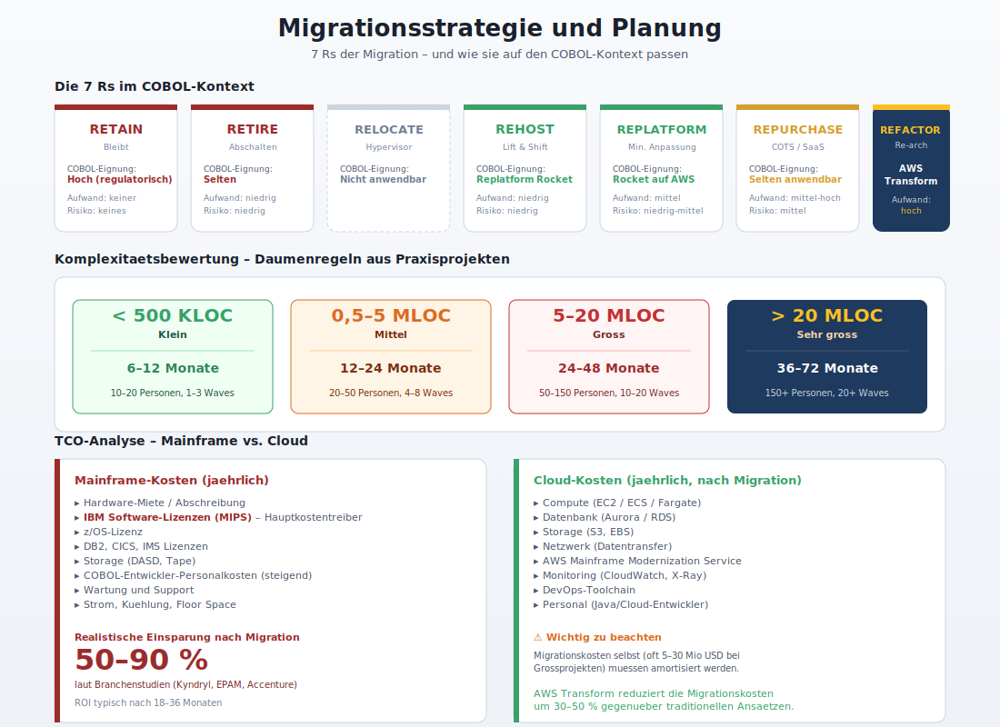
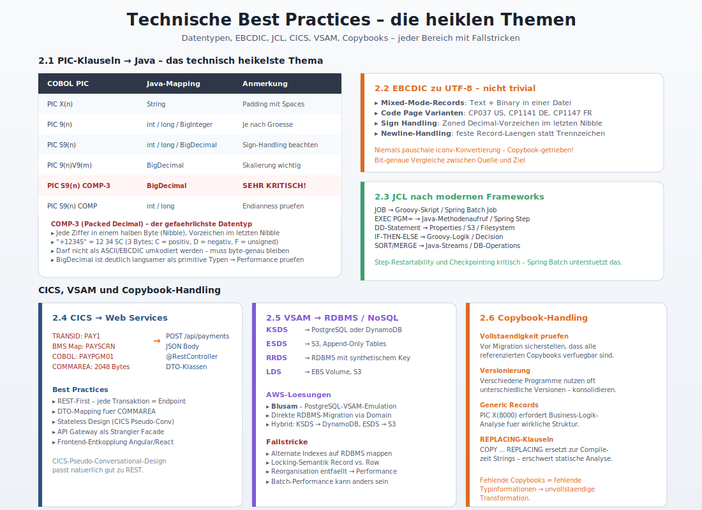
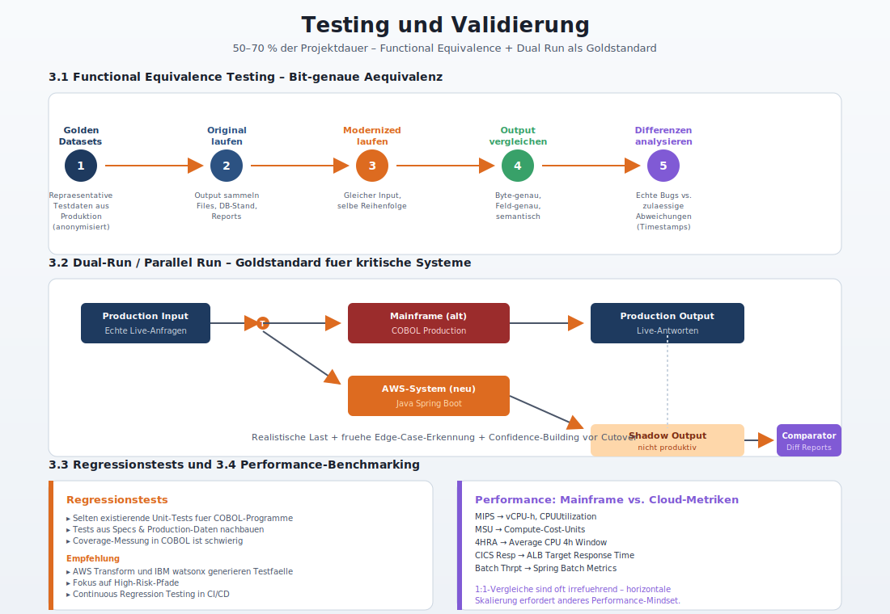
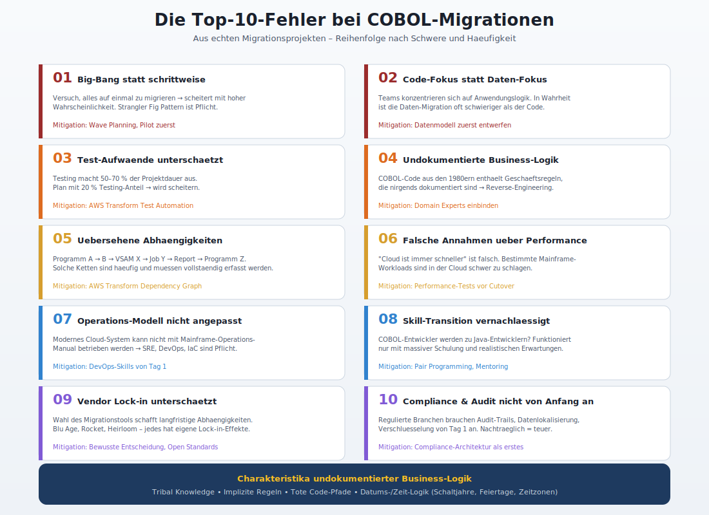
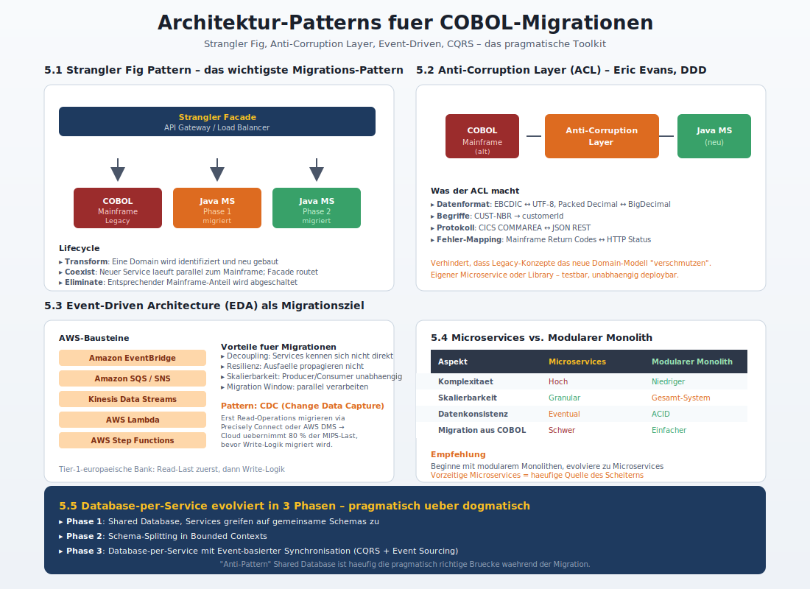
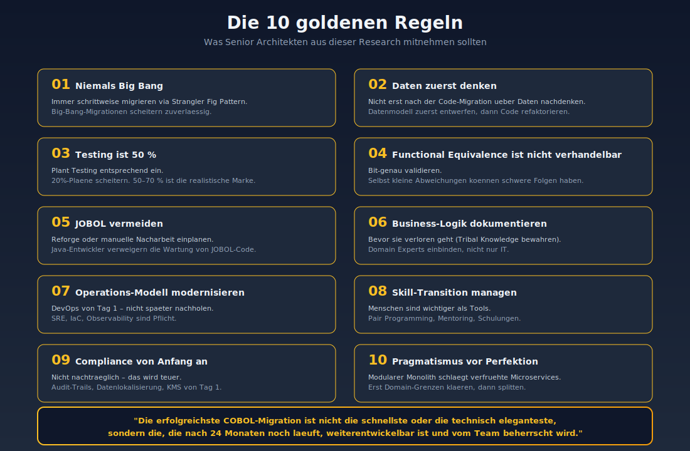

# Best Practices, Patterns und Fallstricke bei COBOL-Migrationen

> Stand: April 2026 | Zielgruppe: Senior Developer & Senior Architekten

---

## 1. Migrationsstrategie und Planung



### 1.1 Die 7 Rs der Migration im COBOL-Kontext

Das von AWS popularisierte 7-Rs-Framework definiert sieben strategische Optionen. Im Mainframe-/COBOL-Kontext ergeben sich folgende Auspraegungen:

| Strategie | Beschreibung | COBOL-Eignung | Aufwand | Risiko |
|-----------|--------------|---------------|---------|--------|
| **Retain** | System bleibt wo es ist | Hoch (regulatorisch) | Keiner | Keines |
| **Retire** | Funktion wird abgeschaltet | Selten | Niedrig | Niedrig |
| **Relocate** | Hypervisor-Wechsel | Nicht anwendbar | -- | -- |
| **Rehost** | Lift-and-Shift, kein Code-Change | Replatforming via Rocket | Niedrig | Niedrig |
| **Replatform** | Minimale Anpassung | Rocket Software auf AWS | Mittel | Niedrig-Mittel |
| **Repurchase** | Wechsel zu COTS/SaaS | Selten anwendbar | Mittel-Hoch | Mittel |
| **Refactor/Re-architect** | COBOL → Java, Microservices | Blu Age, AWS Transform | Hoch | Mittel-Hoch |

**Wichtig fuer Architekten:** Diese Strategien sind kein Entweder-Oder. Eine grosse Mainframe-Landschaft sollte in der Regel nach **mehreren Strategien parallel** migriert werden -- abhaengig vom Wert, der Komplexitaet und der strategischen Bedeutung der jeweiligen Anwendung.

### 1.2 Entscheidungsmatrix: Refactoring vs. Replatforming

| Faktor | Refactoring waehlen wenn... | Replatforming waehlen wenn... |
|--------|----------------------------|------------------------------|
| **Zeitdruck** | 12-24 Monate verfuegbar | Schnellstmoeglich (Rechenzentrum-Exit) |
| **Code-Qualitaet** | Code soll modernisiert werden | Code-Aenderungen gelten als Risiko |
| **Team-Skills** | Java-Entwickler verfuegbar | COBOL-Expertise dominiert |
| **Cloud-Native Ziel** | Microservices, Serverless geplant | "Lift-and-Improve" reicht aus |
| **TCO-Horizont** | 5+ Jahre, langfristige Optimierung | 1-3 Jahre, kurzfristige Einsparungen |
| **Regulatorik** | Funktionale Aequivalenz nachweisbar | Bit-perfekte Reproduktion noetig |
| **Innovation** | Neue Features geplant (APIs, Mobile) | Stabile Funktionalitaet |

### 1.3 Komplexitaetsbewertung einer COBOL-Codebasis

Die Komplexitaet bestimmt Aufwand und Risiko massgeblich. Folgende Metriken sollten **vor jedem Migrationsprojekt** erhoben werden:

**Quantitative Metriken:**
- **Lines of Code (LOC)**: Gesamt + pro Programm
- **Anzahl Programme**: COBOL-Programme, Subroutinen, Copybooks
- **Anzahl JCL-Jobs** und deren Verschachtelungstiefe
- **Anzahl CICS-Transaktionen** und BMS Maps
- **Datenbank-Objekte**: DB2-Tabellen, VSAM-Files, IMS-Segmente
- **Cyclomatic Complexity** pro Programm (McCabe-Metrik)
- **Halstead-Metriken** (Volume, Difficulty, Effort)

**Qualitative Indikatoren:**
- Anteil **GOTO-basierter Logik** (hoeher = komplexer)
- Vorkommen von **REDEFINES** und **OCCURS DEPENDING ON**
- **Dynamische CALLs** (vs. statische CALLs)
- **Assembler-Einsprungpunkte** und Inline-Assembler
- **Selbstmodifizierender Code** (extrem selten, aber kritisch)
- **Undokumentierte Business-Logik** (keine Kommentare, keine Specs)

**Daumenregeln (aus Praxisprojekten):**
- < 500 KLOC: Klein, 6-12 Monate
- 500 KLOC - 5 MLOC: Mittel, 12-24 Monate
- 5-20 MLOC: Gross, 24-48 Monate
- > 20 MLOC: Sehr gross, mehrjaehrige Programme mit Wave Planning

### 1.4 TCO-Analyse: Mainframe vs. Cloud

Die TCO-Berechnung muss **alle** Kostenkomponenten einschliessen:

**Mainframe-Kosten (jaehrlich):**
- Hardware-Miete/Abschreibung
- IBM Software-Lizenzen (MIPS-basiert -- der grosse Kostentreiber)
- z/OS-Lizenz
- DB2, CICS, IMS Lizenzen
- Storage (DASD, Tape)
- Personalkosten (COBOL-Entwickler werden teurer)
- Wartung und Support
- Strom, Kuehlung, Floor Space

**Cloud-Kosten (jaehrlich, nach Migration):**
- Compute (EC2/ECS/Fargate)
- Datenbank (Aurora/RDS)
- Storage (S3, EBS)
- Netzwerk (Datentransfer)
- AWS Mainframe Modernization Service (falls Managed)
- Monitoring (CloudWatch, X-Ray)
- DevOps-Toolchain
- Personal (Java/Cloud-Entwickler)

**Realistische Einsparungen:**
Branchenstudien (Kyndryl, EPAM, Accenture) berichten **50-90 % Kostenreduktion** nach erfolgreicher Migration. Der ROI tritt typischerweise nach **18-36 Monaten** ein. Wichtig: Die Migrationskosten selbst (oft 5-30 Mio. USD bei Grossprojekten) muessen amortisiert werden.

### 1.5 Projektlaufzeiten und Teamgroessen

Typische Profile aus realen Projekten:

| Projektgroesse | Dauer | Team (Peak) | Anzahl Waves |
|----------------|-------|-------------|--------------|
| Klein (< 1 MLOC) | 6-12 Mon. | 10-20 Personen | 1-3 |
| Mittel (1-5 MLOC) | 12-24 Mon. | 20-50 Personen | 4-8 |
| Gross (5-20 MLOC) | 24-48 Mon. | 50-150 Personen | 10-20 |
| Sehr gross (> 20 MLOC) | 36-72 Mon. | 150+ Personen | 20+ |

Mit AWS Transform laesst sich die Dauer laut AWS-Angaben um **30-50 %** reduzieren.

---

## 2. Technische Best Practices



### 2.1 Datentyp-Mapping: COBOL PIC-Klauseln nach Java

Die korrekte Abbildung der COBOL-Datentypen ist eines der **technisch heikelsten Themen**. Fehler hier sind oft nicht offensichtlich und werden erst spaet entdeckt -- typischerweise bei Edge Cases im produktiven Betrieb.

| COBOL PIC-Klausel | Bedeutung | Java-Mapping (Blu Age) | Anmerkung |
|-------------------|-----------|------------------------|-----------|
| `PIC X(n)` | Alphanumerisch, n Bytes | `String` (fixed length) | Padding mit Spaces! |
| `PIC 9(n)` | Numerisch ohne Vorzeichen | `int` / `long` / `BigInteger` | Je nach Groesse |
| `PIC S9(n)` | Numerisch mit Vorzeichen | `int` / `long` / `BigDecimal` | Sign-Handling beachten |
| `PIC 9(n)V9(m)` | Dezimal mit implizitem Komma | `BigDecimal` | Skalierung wichtig |
| `PIC S9(n) COMP` | Binary | `int` / `long` | Endianness pruefen |
| `PIC S9(n) COMP-3` | Packed Decimal | `BigDecimal` | **Sehr kritisch!** |
| `PIC S9(n) COMP-4` | Binary (USAGE BINARY) | `int` / `long` | Wie COMP |
| `PIC S9(n) COMP-5` | Native Binary | `int` / `long` | Plattform-abhaengig |

**COMP-3 (Packed Decimal) -- der gefaehrlichste Datentyp:**

Packed Decimal ist eine speichersparende Repraesentation, bei der jede Ziffer in einem halben Byte (Nibble) gespeichert wird. Das Vorzeichen steht im letzten Nibble. Beispiel: `+12345` wird als `12 34 5C` (3 Bytes) gespeichert (`C` = positiv, `D` = negativ, `F` = unsigned).

**Fallstricke:**
- COMP-3-Felder duerfen **nicht** als ASCII/EBCDIC umkodiert werden
- Bei der Datenmigration muessen sie **byte-genau** kopiert oder explizit dekodiert werden
- Java-Mapping erfordert `BigDecimal` mit korrekter Skalierung
- Performance-Implikation: BigDecimal ist deutlich langsamer als primitive Typen

### 2.2 EBCDIC zu ASCII/UTF-8 Konvertierung

**Das Grundproblem:** Mainframes nutzen EBCDIC (Extended Binary Coded Decimal Interchange Code), waehrend moderne Systeme ASCII oder UTF-8 verwenden. Eine 1:1-Konvertierung ist nicht trivial.

**Kritische Punkte:**

1. **Mixed-Mode-Records**: Eine Datei kann sowohl Text (EBCDIC) als auch Binaerdaten (COMP/COMP-3) enthalten. Eine pauschale Konvertierung **zerstoert** die Binaerdaten.

2. **Code Page Varianten**: Es gibt nicht "ein" EBCDIC, sondern dutzende Code Pages (CP037 US, CP1141 DE, CP1147 FR, etc.). Falsche Code Page → falsche Sonderzeichen.

3. **Sign Handling bei Zoned Decimal**: PIC S9(5) ohne USAGE wird als Zoned Decimal gespeichert. Das Vorzeichen ist im letzten Nibble der letzten Ziffer codiert. Naive ASCII-Konvertierung produziert kryptische Zeichen wie `1234E` statt `+12345`.

4. **Newline-Handling**: Mainframe-Dateien haben oft **keine** Newlines, sondern feste Record-Laengen. Bei der Konvertierung muessen explizite Trennzeichen eingefuegt werden.

**Best Practice:**
- **Niemals** pauschale `iconv`-Konvertierung auf Mainframe-Dateien
- Stattdessen: **Copybook-getriebene** Konvertierung, die jedes Feld einzeln nach Typ behandelt
- AWS Blu Age und vergleichbare Tools nutzen die Copybooks fuer typsichere Konvertierung
- Testdaten-Validierung: Bit-genaue Vergleiche zwischen Quelle und Ziel

### 2.3 Batch-Processing: JCL nach modernen Frameworks

JCL (Job Control Language) ist die Skriptsprache zur Steuerung von Mainframe-Batch-Jobs. Sie definiert:
- Welches Programm ausgefuehrt wird (`EXEC`)
- Welche Dateien zugewiesen werden (`DD`-Statements)
- Job-Abhaengigkeiten und Conditional Execution
- Resource-Allokation (Speicher, CPU)

**Migrationspfade:**

| JCL-Konstrukt | Modernes Aequivalent (Blu Age) | Alternative |
|---------------|-------------------------------|-------------|
| `JOB`-Card | Groovy-Skript | Spring Batch Job |
| `EXEC PGM=` | Java-Methodenaufruf | Spring Batch Step |
| `DD`-Statements | Properties / S3 / Filesystem | Spring Resource |
| `IF-THEN-ELSE` | Groovy-Logik | Spring Batch Decision |
| `COND`-Parameter | Exit-Code-Behandlung | Spring Batch Flow |
| Generation Data Groups (GDG) | S3 Versioning | RDS-basierter Counter |
| SORT/MERGE Utilities | Java-Streams / DB-Operations | Apache Camel |

**Fallstricke:**
- **Step-Restartability**: Mainframe-Batch-Jobs koennen ab einem Failed Step wiederaufgesetzt werden. Spring Batch unterstuetzt das, aber die Logik muss angepasst werden.
- **Checkpointing**: Lange Batch-Laeufe mit Commit-Frequenzen muessen aequivalent abgebildet werden.
- **Output Routing**: SYSOUT, SYSPRINT, REPORT-Files muessen auf Logging-Frameworks oder S3 umgeleitet werden.
- **Scheduler-Integration**: TWS, Control-M, OPC werden durch Apache Airflow, AWS Step Functions, Amazon EventBridge oder Quartz ersetzt.

### 2.4 CICS-Transaktionen zu Web Services

CICS (Customer Information Control System) ist die transaktionsorientierte Middleware fuer Online-Anwendungen auf z/OS. Eine CICS-Transaktion ist typischerweise ein 3270-Bildschirm mit Eingabefeldern, hinterlegt durch ein COBOL-Programm.

**Transformation:**

```
CICS-Transaktion (alt)              REST-Service (neu)
───────────────────                 ──────────────────
TRANSID: PAY1                       POST /api/payments
BMS Map: PAYSCRN                    JSON Request Body
COBOL Programm: PAYPGM01            Spring @RestController
COMMAREA: 2048 Bytes                DTO-Klassen
EIB (Exec Interface Block)          HttpServletRequest
EXEC CICS RETURN                    HTTP Response
```

**Best Practices:**
- **REST-First**: Jede CICS-Transaktion wird zu einem REST-Endpoint
- **DTO-Mapping**: COMMAREA-Strukturen werden zu Request/Response-DTOs
- **Stateless Design**: CICS-Pseudo-Conversational-Design passt gut zu REST
- **API Gateway**: Nutzung von Amazon API Gateway als Strangler Facade
- **Frontend-Entkopplung**: BMS Maps werden zu Angular/React-Komponenten, die die REST-API konsumieren

### 2.5 VSAM zu relationaler/NoSQL-Datenbank

VSAM (Virtual Storage Access Method) ist die Datei-orientierte Speichertechnologie auf z/OS. Es gibt vier Haupttypen:

| VSAM-Typ | Beschreibung | Migrationsziel |
|----------|--------------|----------------|
| **KSDS** (Key-Sequenced) | Indexbasierter Zugriff | RDBMS (PostgreSQL) oder DynamoDB |
| **ESDS** (Entry-Sequenced) | Sequentielle Speicherung | S3, Append-Only Tables |
| **RRDS** (Relative Record) | Position-basierter Zugriff | RDBMS mit synthetischem Key |
| **LDS** (Linear) | Byte-Stream | EBS Volume, S3 |

**AWS-Loesungen:**
- **Blusam**: PostgreSQL-basierte VSAM-Emulation in AWS Blu Age. Bietet API-Kompatibilitaet, lebt aber unter der Haube auf RDS/Aurora.
- **Direkte RDBMS-Migration**: Schema-Design durch Domain Modeling, statt VSAM 1:1 abzubilden.
- **Hybrid**: KSDS → DynamoDB (fuer hohe Throughput), ESDS → S3, andere → RDS.

**Fallstricke:**
- **Alternate Indexes**: VSAM unterstuetzt mehrere Indexe pro File. RDBMS sind hier maechtiger, aber das Mapping muss sauber sein.
- **Locking-Semantik**: VSAM-Locks sind Record-basiert. RDBMS nutzen Row-Locks. Verhalten kann subtil unterschiedlich sein.
- **Reorganisation**: VSAM erfordert regelmaessige Reorganisation (REORG). Bei RDBMS entfaellt das, aber Batch-Performance kann anders sein.

### 2.6 Copybook-Handling

Copybooks sind die zentralen Datenstruktur-Definitionen in COBOL. Sie werden mit `COPY` in Programme eingebunden und definieren typischerweise Record-Layouts.

**Best Practices:**
1. **Vollstaendigkeit pruefen**: Vor der Migration muss sichergestellt sein, dass **alle** referenzierten Copybooks verfuegbar sind. Fehlende Copybooks bedeuten fehlende Typinformationen.
2. **Versionierung**: Verschiedene Programme nutzen oft unterschiedliche Versionen desselben Copybooks. Diese muessen identifiziert und konsolidiert werden.
3. **Generic Records**: COBOL erlaubt sehr generische Records (z.B. `PIC X(8000)`). Hier muss die Business-Logik analysiert werden, um das tatsaechliche Datenformat zu rekonstruieren.
4. **REPLACING-Klauseln**: COBOL `COPY ... REPLACING` ersetzt zur Compilezeit Strings. Dies erschwert die statische Analyse.

---

## 3. Testing und Validierung



### 3.1 Functional Equivalence Testing

Das wichtigste Testprinzip bei COBOL-Migrationen lautet: **Bit-genaue funktionale Aequivalenz**. Das modernisierte System muss bei identischem Input exakt das gleiche Output produzieren wie das Original.

**Vorgehen:**
1. **Golden Datasets erstellen**: Repraesentative Testdaten aus Produktion (anonymisiert)
2. **Originalsystem laufen lassen**: Output sammeln (Files, DB-Stand, Reports)
3. **Modernisiertes System mit gleichem Input fuettern**
4. **Output-Vergleich**: Byte-genau, Feld-genau, semantisch
5. **Differenzen analysieren**: Echte Bugs vs. zulaessige Abweichungen (z.B. Timestamps)

### 3.2 Dual-Run / Parallel Run

Das **Dual-Run-Pattern** (auch Shadow Mode genannt) ist Goldstandard fuer kritische Systeme:

```
                       ┌──────────────┐
   Production Input ──▶│  Mainframe   │──▶ Production Output
        │              │   (alt)      │
        │              └──────────────┘
        │
        └─────────────▶┌──────────────┐
                       │  AWS-System  │──▶ Shadow Output
                       │   (neu)      │
                       └──────────────┘
                              │
                              ▼
                       ┌──────────────┐
                       │  Comparator  │──▶ Diff Reports
                       └──────────────┘
```

**Vorteile:**
- Realistische Last und Datenqualitaet
- Fruehe Erkennung von Edge Cases
- Confidence-Building vor Cutover
- Rollback-Sicherheit

**Tools:**
- **AWS Transform Testing Automation**: Generiert Testplaene, Testdaten und Vergleichsskripte
- **Google Cloud Dual Run**: Spielt Live-Events aus dem Mainframe gegen das modernisierte System
- **Custom Frameworks**: Oft mit Apache Kafka als Replay-Mechanismus

### 3.3 Regressionstests

Nach jedem Refactoring-Schritt muessen Regressionstests laufen. Bei COBOL-Migrationen ist die Herausforderung:
- Es gibt **selten existierende Unit-Tests** fuer COBOL-Programme
- Tests muessen aus Specs, Beispiel-Datensaetzen und Production-Daten **nachgebaut** werden
- Coverage-Messung in COBOL ist schwierig

**Empfehlung:**
- AWS Transform und IBM watsonx koennen automatisch Testfaelle aus COBOL-Code generieren
- Fokus auf **High-Risk-Pfade** (komplexe Berechnungen, Edge Cases, Fehlerbehandlung)
- Continuous Regression Testing als Teil der CI/CD-Pipeline

### 3.4 Performance-Benchmarking

**Mainframe-Metriken vs. Cloud-Metriken:**

| Mainframe | Cloud-Aequivalent |
|-----------|-------------------|
| MIPS (Million Instructions Per Second) | vCPU-Stunden, CloudWatch CPUUtilization |
| MSU (Millions of Service Units) | Compute-Cost-Units |
| 4-Hour Rolling Average (4HRA) | Average CPU over 4h Window |
| Response Time (CICS) | API Gateway Latency, ALB Target Response Time |
| Batch Throughput (Records/sec) | Spring Batch Metrics, DB Throughput |
| Job Elapsed Time | Step Functions Duration |

**Wichtig:** Direkte 1:1-Vergleiche sind oft irrefuehrend. Mainframes sind fuer bestimmte Workloads (besonders sequentielle Batch-Jobs) extrem effizient. Cloud-Architekturen koennen das durch **horizontale Skalierung** kompensieren -- das erfordert aber ein anderes Performance-Mindset.

---

## 4. Typische Fallstricke und Risiken



### 4.1 Die Top-10-Fehler bei COBOL-Migrationen

1. **Big-Bang-Migration statt schrittweiser Ansatz**: Der Versuch, alles auf einmal zu migrieren, fuehrt mit hoher Wahrscheinlichkeit zum Scheitern. Strangler Fig Pattern ist Pflicht.

2. **Code-Fokus statt Daten-Fokus**: Teams konzentrieren sich auf die Anwendungslogik und behandeln Daten als Nachgedanken. In Wahrheit ist die Daten-Migration oft schwieriger als die Code-Migration.

3. **Unterschaetzung der Test-Aufwaende**: Testing macht typischerweise **50-70 %** der Projektdauer aus. Ein Plan mit 20 % Testing-Anteil wird scheitern.

4. **Vernachlaessigung undokumentierter Business-Logik**: COBOL-Code aus den 1980er Jahren enthaelt oft kritische Geschaeftsregeln, die nirgends dokumentiert sind. Diese muessen aus dem Code rekonstruiert werden -- ein aufwaendiger Reverse-Engineering-Prozess.

5. **Uebersehene Abhaengigkeiten**: Programm A ruft Programm B, das auf VSAM-File X schreibt, das von Job Y verarbeitet wird, der einen Report erzeugt, der von Programm Z gelesen wird. Solche Ketten sind haeufig und muessen vollstaendig erfasst werden.

6. **Falsche Annahmen ueber Performance**: "Cloud ist immer schneller" ist falsch. Bestimmte Mainframe-Workloads sind in der Cloud schwer zu schlagen. Ohne Performance-Tests gibt es Boese Ueberraschungen.

7. **Operations-Modell nicht angepasst**: Ein modernes Cloud-System kann nicht mit dem Mainframe-Operations-Manual betrieben werden. SRE, DevOps, IaC sind Pflicht -- nicht optional.

8. **Skill-Transition vernachlaessigt**: COBOL-Entwickler werden zu Java-Entwicklern? Das funktioniert nur mit massiver Schulung und realistischen Erwartungen. Kulturelle Aspekte werden oft unterschaetzt.

9. **Vendor Lock-in unterschaetzt**: Die Wahl des Migrationstools schafft langfristige Abhaengigkeiten. Blu Age Runtime, Rocket Enterprise Server, Heirloom -- jedes hat seine eigenen Lock-in-Effekte.

10. **Compliance und Audit nicht von Anfang an**: Regulierte Branchen (Banken, Versicherungen, Healthcare) muessen Audit-Trails, Datenlokalisierung, Verschluesselung von Tag 1 an beruecksichtigen. Nachtraegliche Anpassung ist teuer.

### 4.2 Undokumentierte Business-Logik

Das groesste Risiko bei jeder Mainframe-Migration ist **Code, den niemand mehr versteht**. Charakteristika:

- **Tribal Knowledge**: Die einzigen Personen, die das System verstehen, sind kurz vor der Pensionierung
- **Implizite Regeln**: Geschaeftsregeln, die durch jahrzehntelange Patches entstanden sind
- **Tote Code-Pfade**: Funktionen, die nie aufgerufen werden -- oder doch, einmal pro Jahr beim Jahresabschluss
- **Datums- und Zeit-Logik**: Schaltjahre, Feiertage, Zeitzonen -- haeufig fehlerhaft, aber durch Patches "korrigiert"

**Best Practices:**
- **AWS Transform Business Logic Extraction**: KI-gestuetzte Generierung natuerlichsprachiger Beschreibungen
- **IBM watsonx Code Assistant for Z**: Erklaerung komplexer COBOL-Logik
- **Code-Archaeologie-Phase**: Bewusste Phase zur Dokumentation **bevor** transformiert wird
- **Domain Experts einbinden**: Fachbereich, nicht nur IT, muss validieren

### 4.3 JOBOL-Problem -- Java, das wie COBOL aussieht

Ein zentrales Risiko bei automatischer Refaktorisierung ist sogenannter **JOBOL** -- Java-Code, der die Struktur, Naming Conventions und Patterns von COBOL beibehaelt. Charakteristika:

- Variablennamen wie `WS-CUST-NAME` (statt `customerName`)
- Verschachtelte if-Strukturen statt Polymorphismus
- Globale Variablen statt Encapsulation
- Prozedurale Methoden mit hunderten Zeilen
- Keine Java-Idioms (Streams, Optional, Lambdas)
- Schwer zu testen, schwer zu warten

**Konsequenz:** Java-Entwickler verstehen den Code nicht und verweigern die Wartung. Damit ist nichts gewonnen.

**Loesungen:**
- **AWS Transform Reforge**: LLM-basierte Umschreibung zu idiomatischem Java
- **Manuelle Refaktorisierung** in einer zweiten Phase
- **Reimagine-Ansatz**: Kompletter Rewrite als Microservices
- **Code-Reviews durch Java-Experten** vor Abnahme

### 4.4 Performance-Ueberraschungen

Klassische Probleme nach der Migration:

| Problem | Ursache | Loesung |
|---------|---------|---------|
| Batch-Jobs werden langsamer | RDBMS statt VSAM, Network-Overhead | Batch-Optimierung, Connection Pooling |
| API-Latenz hoeher als CICS | HTTP/REST-Overhead, JVM-Startup | API Gateway Caching, GraalVM Native Image |
| DB-Locks haeufiger | Veraendertes Lock-Modell | Optimistic Locking, Pessimistic vermeiden |
| Memory-Verbrauch steigt | JVM-Overhead, Object-Allokation | Heap-Tuning, GC-Optimierung |
| Inkonsistente Antwortzeiten | GC-Pauses, Network-Jitter | G1GC, ZGC, Cloud-native Patterns |

### 4.5 Kulturelle und organisatorische Herausforderungen

Die technische Migration ist oft die kleinere Haelfte des Problems. Die kulturelle Transformation ist die groessere:

- **Generationenkonflikt**: Erfahrene COBOL-Entwickler (oft 50+) treffen auf junge Java-Entwickler (oft 25-35). Unterschiedliche Werte, Arbeitsweisen, Tools.
- **Wissensverlust**: COBOL-Experten gehen in Rente. Wissen geht verloren, wenn es nicht systematisch konserviert wird.
- **Identitaetsverlust**: Langjaehrige Mainframe-Mitarbeiter koennen die Migration als persoenliche Abwertung empfinden. Aktives Change Management ist Pflicht.
- **Operations-Wandel**: Vom geplanten Wartungsfenster (alle 4 Wochen) zu Continuous Deployment (mehrmals taeglich) ist ein riesiger Sprung.
- **DevOps-Mindset**: Mainframe-Operationen sind oft strikt getrennt (Dev-Test-Ops). DevOps verwischt diese Grenzen bewusst.

**Best Practices:**
- **Pair Programming** zwischen COBOL- und Java-Entwicklern
- **Mentoring-Programme** in beide Richtungen
- **Schulungen** und Zertifizierungen (AWS, Java, Spring)
- **Gemeinsame Migrationsverantwortung** statt Uebergabe an externes Team

---

## 5. Architektur-Patterns



### 5.1 Strangler Fig Pattern

Das **Strangler Fig Pattern** (Martin Fowler) ist das wichtigste Migrations-Pattern. Es beschreibt die schrittweise Abloesung eines Monolithen durch neue Services, die schrittweise Funktionalitaet uebernehmen.

```
                    ┌─────────────────────┐
                    │  Strangler Facade   │
                    │  (API Gateway / LB) │
                    └──────────┬──────────┘
                               │
              ┌────────────────┼────────────────┐
              │                │                │
              ▼                ▼                ▼
       ┌──────────┐    ┌──────────┐    ┌──────────────┐
       │ COBOL    │    │ Java MS  │    │ Java MS      │
       │ Mainframe│    │ (Phase 1)│    │ (Phase 2)    │
       └──────────┘    └──────────┘    └──────────────┘
```

**Lifecycle:**
1. **Transform**: Eine Domain wird identifiziert und neu gebaut
2. **Coexist**: Der neue Service laeuft parallel zum Mainframe; die Facade routet
3. **Eliminate**: Der entsprechende Mainframe-Anteil wird abgeschaltet

**AWS-Implementierung:**
- **AWS Migration Hub Refactor Spaces** (bis Nov 2025 fuer Neukunden) modelliert genau dieses Pattern
- **Amazon API Gateway** als Strangler Facade
- **VPC-Peering / Direct Connect** fuer Mainframe-Integration
- **EventBridge / Kinesis** fuer Daten-Synchronisation

### 5.2 Anti-Corruption Layer (ACL)

Der **Anti-Corruption Layer** (Eric Evans, DDD) verhindert, dass Konzepte des Legacy-Systems das neue Domain-Modell "verschmutzen". Er ist ein Uebersetzer zwischen alter und neuer Welt.

```
┌──────────┐    ┌─────────────┐    ┌──────────────┐
│  COBOL   │◀──▶│ Anti-       │◀──▶│ Java         │
│ Mainframe│    │ Corruption  │    │ Microservice │
│  (alt)   │    │ Layer (ACL) │    │   (neu)      │
└──────────┘    └─────────────┘    └──────────────┘
```

**Was der ACL macht:**
- **Datenformat-Konvertierung** (EBCDIC ↔ UTF-8, Packed Decimal ↔ BigDecimal)
- **Begriffs-Uebersetzung** (z.B. `CUST-NBR` → `customerId`)
- **Protokoll-Bridge** (z.B. CICS COMMAREA ↔ JSON REST)
- **Fehler-Mapping** (Mainframe Return Codes ↔ HTTP Status)

**Implementierung:**
- Ein eigener Microservice oder eine Library
- Wird typischerweise als Spring Boot Service mit klaren API-Grenzen umgesetzt
- Sollte testbar und unabhaengig deploybar sein

### 5.3 Event-Driven Architecture als Migrationsziel

Ein haeufiges Modernisierungsziel ist die Umstellung auf **Event-Driven Architecture (EDA)**. Statt synchroner Transaktionen wird ueber Events kommuniziert.

**Vorteile fuer Mainframe-Migrationen:**
- **Decoupling**: Services kennen einander nicht direkt
- **Resilienz**: Ausfaelle propagieren nicht
- **Skalierbarkeit**: Producer und Consumer skalieren unabhaengig
- **Migration Window**: Mainframe und neuer Service koennen Events parallel verarbeiten

**AWS-Bausteine:**
- **Amazon EventBridge**: Event Bus, Routing, Schema Registry
- **Amazon SQS / SNS**: Queues und Topics
- **Amazon Kinesis Data Streams**: Hochvolumige Event-Streams
- **AWS Lambda**: Event-Handler
- **AWS Step Functions**: Orchestrierung komplexer Workflows

**Pattern: Change Data Capture (CDC):**
Ein Tier-1-europaeischer Bank-Use-Case zeigt: Erst werden Read-Operations migriert, indem CDC-Tools (z.B. Precisely Connect, AWS DMS) Mainframe-Aenderungen in Echtzeit in eine Cloud-DB streamen. Damit kann die Cloud die Read-Last (oft 80 % der MIPS!) uebernehmen, bevor die komplexere Write-Logik migriert wird.

### 5.4 Microservices vs. Modularer Monolith

Eine kritische Entscheidung nach der Migration: **Wie granular soll das Zielsystem sein?**

| Aspekt | Microservices | Modularer Monolith |
|--------|---------------|--------------------|
| **Komplexitaet** | Hoch (Distributed Systems) | Niedriger |
| **Skalierbarkeit** | Granular | Gesamt-System |
| **Deployment** | Unabhaengig pro Service | Atomar |
| **Datenkonsistenz** | Eventual Consistency | ACID |
| **Team-Struktur** | Cross-functional Teams | Funktionale Teams |
| **Operations** | Hoher Overhead | Niedriger |
| **Migration aus COBOL** | Schwer (viele Cuts) | Einfacher (wenige Cuts) |

**Empfehlung:** Beginne mit einem **modularen Monolithen** und evolviere in Richtung Microservices, sobald die Domain-Grenzen klar sind. Vorzeitige Microservices-Architektur ist eine haeufige Quelle des Scheiterns.

### 5.5 Database-per-Service vs. Shared Database

Bei Microservices stellt sich die Frage: Hat jeder Service seine eigene Datenbank, oder teilen sie sich eine?

**Database-per-Service:**
- Volle Autonomie pro Service
- Klare Bounded Contexts
- Schwerer zu implementieren bei Migrationen aus COBOL (eine grosse DB2/VSAM-Welt → viele kleine DBs)
- Erfordert Event-Sourcing oder Saga-Pattern fuer Cross-Service-Transaktionen

**Shared Database:**
- Einfacher zu implementieren, besonders bei Migrationen
- Wird oft als "Anti-Pattern" bezeichnet -- ist aber pragmatisch oft die richtige Wahl
- Risiko: Services werden ueber die Datenbank gekoppelt
- Typische Brueckenloesung waehrend der Migration

**Empfehlung fuer COBOL-Migrationen:**
- **Phase 1**: Shared Database, Services greifen auf gemeinsame Schemas zu
- **Phase 2**: Schema-Splitting in Bounded Contexts
- **Phase 3**: Database-per-Service mit Event-basierter Synchronisation

### 5.6 CQRS und Event Sourcing

**CQRS** (Command Query Responsibility Segregation) trennt Lese- und Schreibmodelle. **Event Sourcing** speichert alle Aenderungen als Event-Stream.

Diese Patterns passen besonders gut zu Mainframe-Migrationen, weil:
- Mainframe-Systeme sind oft schon natuerlich CQRS (Online-Transaktionen vs. Batch-Reports)
- Event Sourcing bildet die "Audit Trail"-Mentalitaet von Mainframes ab
- Die Read-Modelle koennen unabhaengig von der Schreib-Datenbank skaliert werden

**Tooling auf AWS:**
- **Amazon DynamoDB Streams** als Event Store
- **EventBridge** fuer Event-Verteilung
- **Lambda** fuer Read-Model-Projektionen
- **OpenSearch** fuer Such-orientierte Read-Modelle

---

## 6. Zusammenfassung: Goldene Regeln



1. **Niemals Big Bang** -- immer schrittweise migrieren (Strangler Fig)
2. **Daten zuerst denken** -- nicht erst nach der Code-Migration
3. **Testing ist 50 %** -- planen Sie es entsprechend ein
4. **Functional Equivalence ist nicht verhandelbar** -- bit-genau validieren
5. **JOBOL vermeiden** -- Reforge oder manuelle Nacharbeit einplanen
6. **Business-Logik dokumentieren** -- bevor sie verloren geht
7. **Operations-Modell modernisieren** -- DevOps von Tag 1
8. **Skill-Transition managen** -- Menschen sind wichtiger als Tools
9. **Compliance von Anfang an** -- nicht nachtraeglich
10. **Pragmatismus vor Perfektion** -- modularer Monolith schlaegt verfruehte Microservices

Die erfolgreichste COBOL-Migration ist nicht die schnellste oder die technisch eleganteste, sondern die, die nach 24 Monaten **noch laeuft, weiterentwickelbar ist und vom Team beherrscht wird**.


