# Codex CLI — Cheat Sheet

> Stand: 2026-04-16 · CLI ≥ v0.121.0

## Install & Login

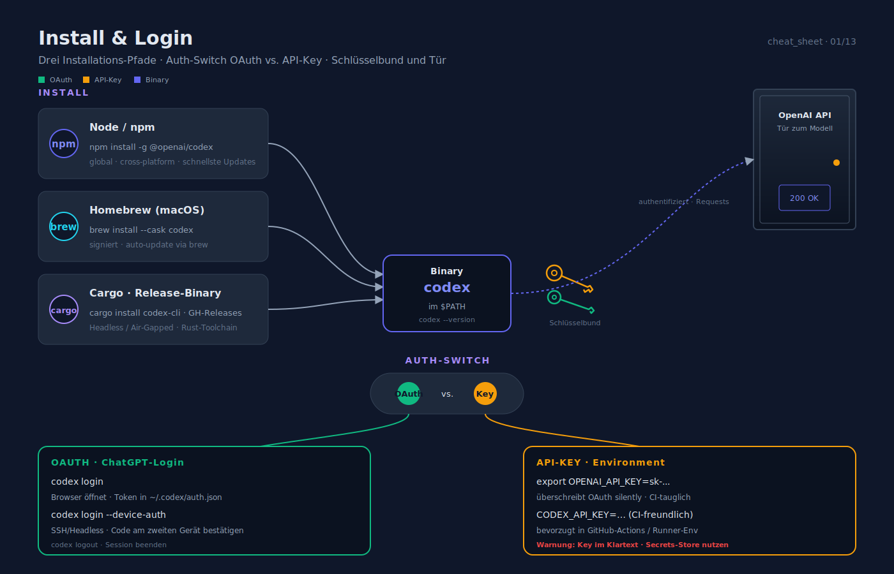

```bash
npm install -g @openai/codex     # oder: brew install --cask codex
codex login                      # ChatGPT-OAuth
codex login --device-auth        # SSH/Headless
codex logout
export OPENAI_API_KEY=sk-...     # alternativ: API-Key
```

## Start-Befehle

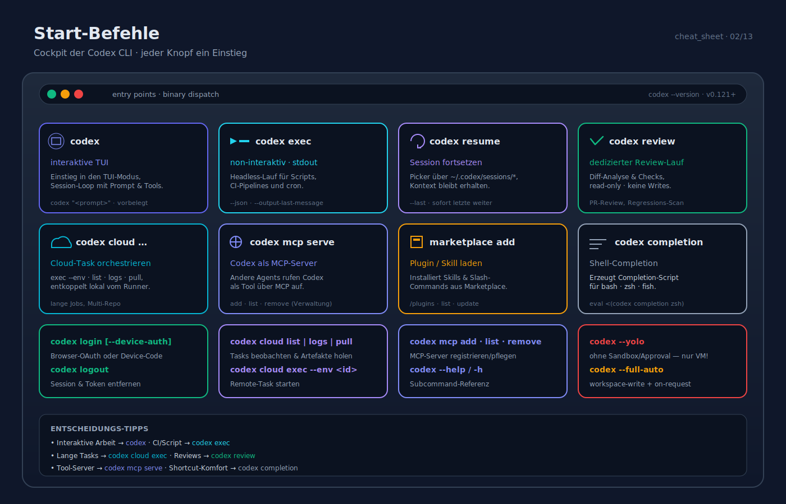

| Befehl | Wirkung |
|---|---|
| `codex` | interaktive TUI |
| `codex "<prompt>"` | TUI mit vorbelegtem Prompt |
| `codex exec "<prompt>"` | nicht-interaktiv (stdout) |
| `codex resume` | Picker letzter Sessions |
| `codex resume --last` | letzte Session direkt fortsetzen |
| `codex review` | dedizierter Review-Lauf |
| `codex mcp serve` | Codex als MCP-Server |
| `codex cloud exec --env <id> "<prompt>"` | Cloud-Task starten |
| `codex cloud list \| logs \| pull <id>` | Cloud-Task-Verwaltung |
| `codex mcp add \| list \| remove` | MCP-Server verwalten |
| `codex marketplace add <name>` | Plugin/Skill installieren |
| `codex completion bash\|zsh\|fish` | Shell-Completion |

## Wichtige Flags

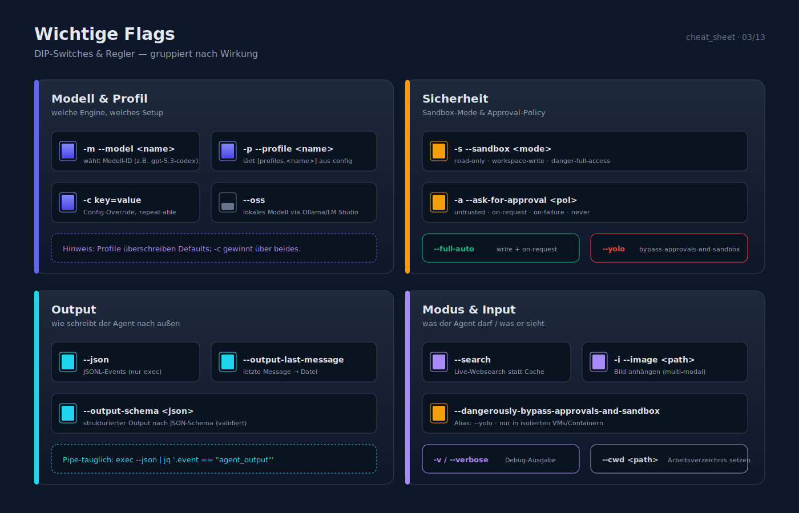

| Flag | Wirkung |
|---|---|
| `-m, --model <name>` | Modell |
| `-p, --profile <name>` | Profil |
| `-c key=value` | Config-Override |
| `-s, --sandbox <mode>` | `read-only` \| `workspace-write` \| `danger-full-access` |
| `-a, --ask-for-approval <pol>` | `untrusted` \| `on-request` \| `on-failure` \| `never` |
| `--full-auto` | `workspace-write` + `on-request` |
| `--yolo` / `--dangerously-bypass-approvals-and-sandbox` | ohne Sandbox & Approvals |
| `--search` | Live-Web-Search (statt cached) |
| `-i, --image <path>` | Bild anhängen |
| `--oss` | lokales OSS-Modell (Ollama/LM Studio) |
| `--json` | JSONL-Events in exec |
| `--output-last-message <file>` | letzte Message in Datei |
| `--output-schema <json>` | strukturierter Output |

## Slash-Commands (TUI)

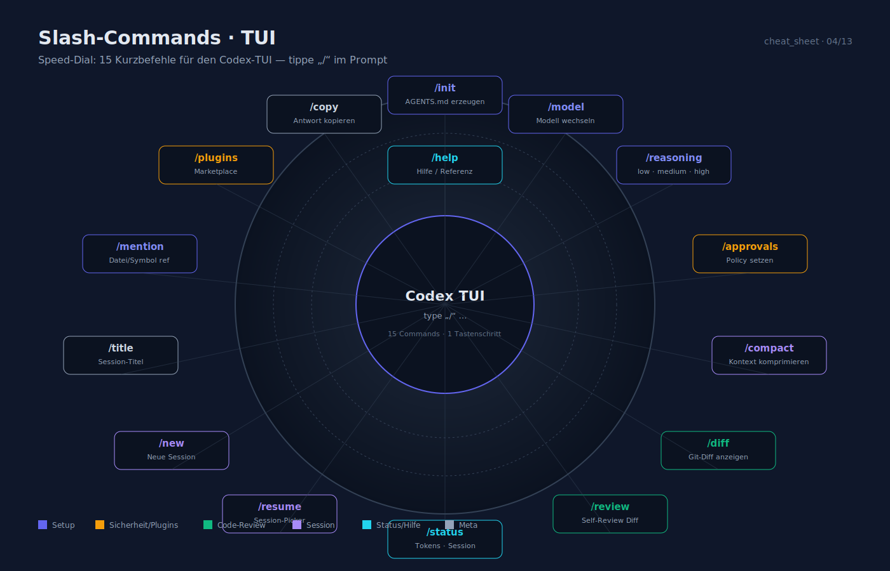

| Command | Kurzbeschreibung |
|---|---|
| `/init` | AGENTS.md-Gerüst erzeugen |
| `/model` | Modell wählen |
| `/reasoning` | Effort `low`/`medium`/`high` |
| `/approvals` | Policy setzen |
| `/compact` | Kontext komprimieren |
| `/diff` | Git-Diff anzeigen |
| `/review` | Self-Review der Änderungen |
| `/status` | Session-Status + Token-Usage |
| `/resume` | Session-Picker |
| `/new` | neue Session |
| `/title` | Session-Titel |
| `/mention` | Datei/Symbol referenzieren |
| `/plugins` | Marketplace |
| `/copy` | letzte Antwort kopieren |
| `/help` | Hilfe |

## Tastatur (TUI)

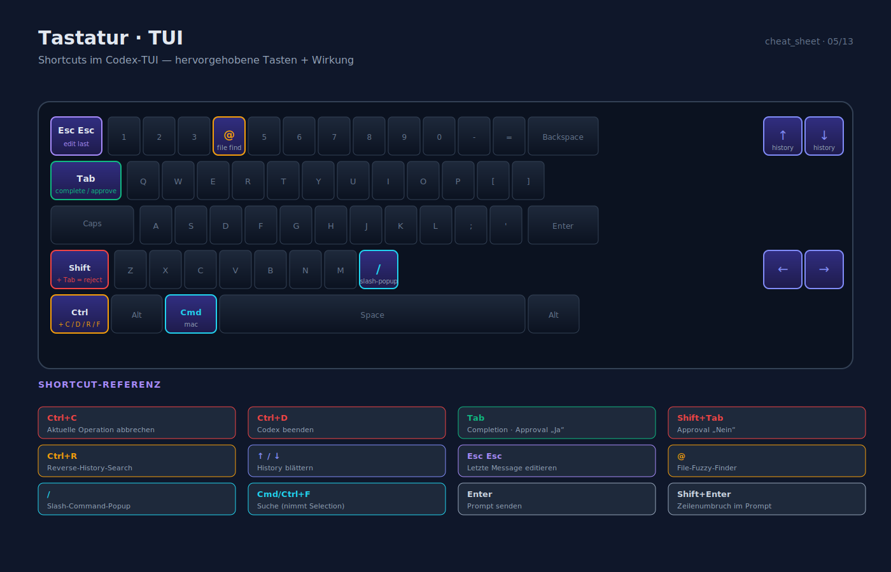

| Taste | Wirkung |
|---|---|
| `Ctrl+C` | aktuelle Op abbrechen |
| `Ctrl+D` | Codex beenden |
| `Tab` | Complete / Approval Ja |
| `Shift+Tab` | Approval Nein |
| `Ctrl+R` | Reverse-History-Search |
| `↑` / `↓` | History |
| `Esc Esc` | letzte Message bearbeiten |
| `@` | File-Fuzzy-Finder |
| `/` | Slash-Popup |
| `Cmd/Ctrl+F` | Suche (nimmt Selection) |

## Minimales `config.toml`

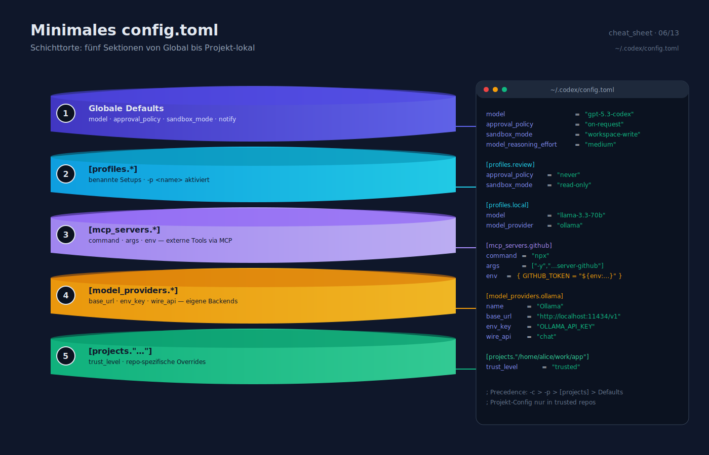

```toml
model                  = "gpt-5.3-codex"
approval_policy        = "on-request"
sandbox_mode           = "workspace-write"
model_reasoning_effort = "medium"
notify                 = []

[profiles.review]
approval_policy = "never"
sandbox_mode    = "read-only"

[profiles.local]
model          = "llama-3.3-70b"
model_provider = "ollama"

[mcp_servers.github]
command = "npx"
args    = ["-y", "@modelcontextprotocol/server-github"]
env     = { GITHUB_TOKEN = "${env:GITHUB_TOKEN}" }

[model_providers.ollama]
name     = "Ollama"
base_url = "http://localhost:11434/v1"
env_key  = "OLLAMA_API_KEY"
wire_api = "chat"

[projects."/home/alice/work/app"]
trust_level = "trusted"
```

## AGENTS.md-Skelett

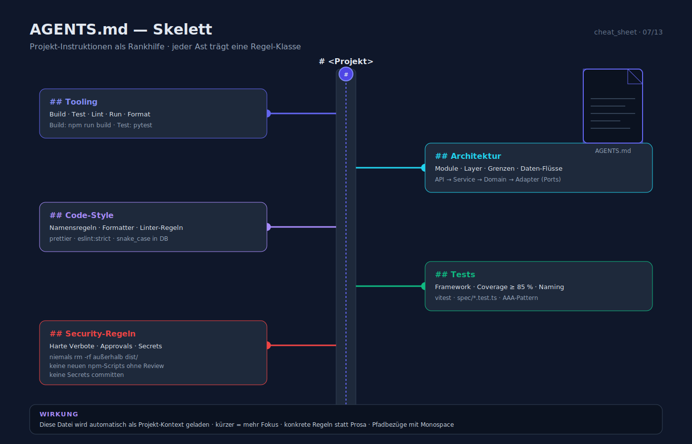

```markdown
# <Projekt>

## Tooling
- Build: `…`  Test: `…`  Lint: `…`  Run: `…`

## Architektur
- …

## Code-Style
- …

## Tests
- Framework: …  Coverage: ≥ 85 %

## Security-Regeln für Agenten
- niemals `rm -rf` außerhalb `dist/`
- keine neuen npm-Scripts ohne Review
```

## Notify-Payload (stdin)

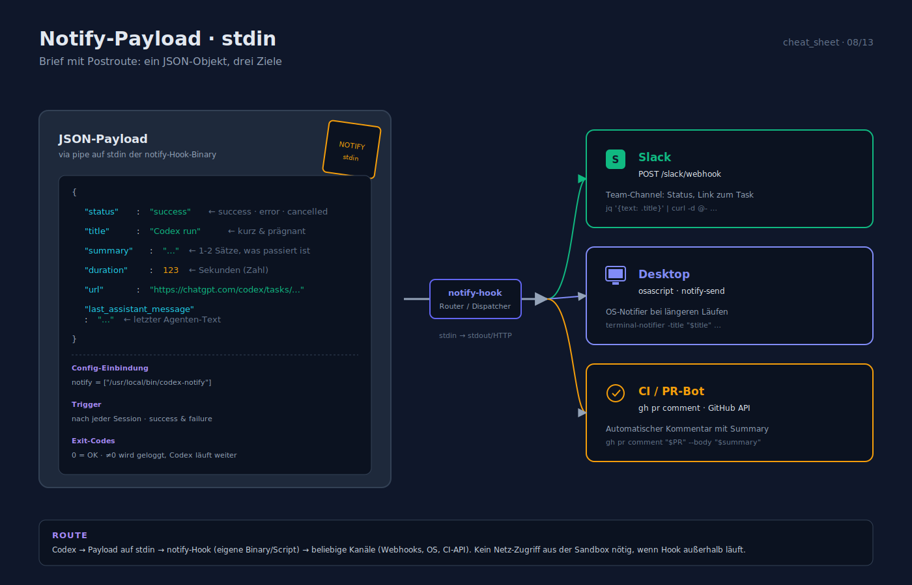

```json
{
  "status": "success",
  "title": "Codex run",
  "summary": "…",
  "duration": 123,
  "url": "https://chatgpt.com/codex/tasks/…",
  "last_assistant_message": "…"
}
```

## `openai/codex-action@v1` — Minimal

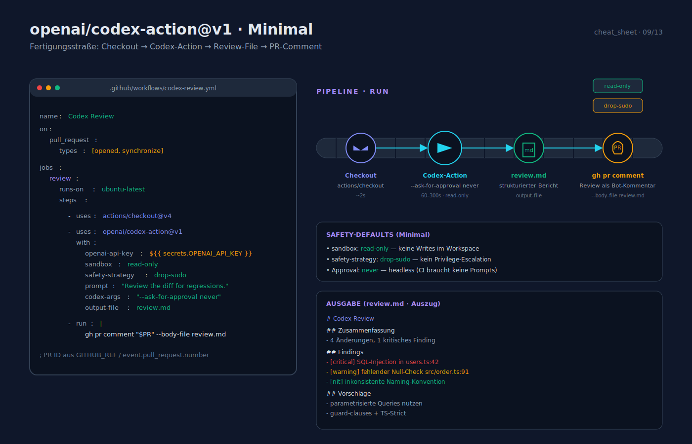

```yaml
- uses: openai/codex-action@v1
  with:
    openai-api-key: ${{ secrets.OPENAI_API_KEY }}
    sandbox: read-only
    safety-strategy: drop-sudo
    prompt: "Review the diff for regressions."
    codex-args: "--ask-for-approval never --model gpt-5.3-codex"
    output-file: review.md
```

## Modi-Cheat

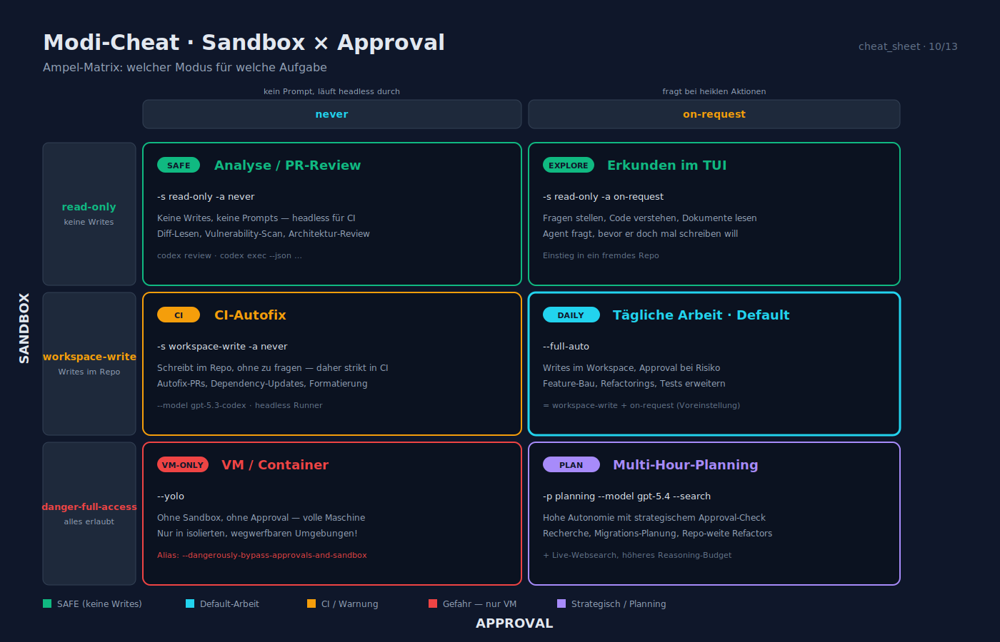

| Ziel | Kombination |
|---|---|
| Analyse / PR-Review | `-s read-only -a never` |
| Tägliche Arbeit | `--full-auto` (default) |
| CI-Autofix | `-s workspace-write -a never --model gpt-5.3-codex` |
| VM/Container | `--yolo` (nur dort!) |
| Multi-Hour-Planning | `-p planning --model gpt-5.4 --search` |

## Umgebungsvariablen

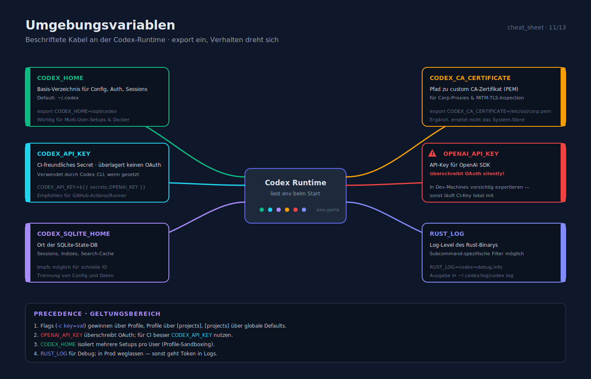

| Var | Zweck |
|---|---|
| `CODEX_HOME` | Basis-Verzeichnis |
| `CODEX_API_KEY` | CI-freundliches Secret |
| `CODEX_SQLITE_HOME` | SQLite-State |
| `CODEX_CA_CERTIFICATE` | Custom-CA PEM |
| `OPENAI_API_KEY` | ← überschreibt OAuth silently! |
| `RUST_LOG` | `codex=debug,info` |

## Dateipfade

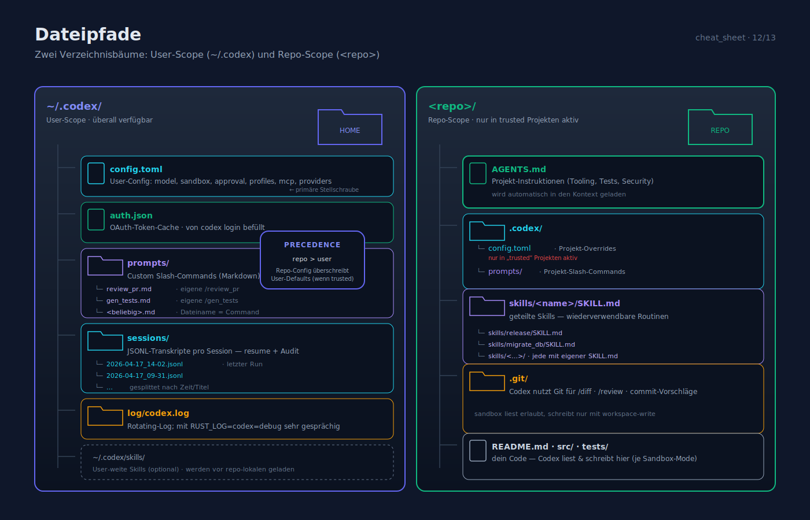

| Pfad | Zweck |
|---|---|
| `~/.codex/config.toml` | User-Config |
| `~/.codex/auth.json` | Token-Cache |
| `~/.codex/prompts/*.md` | Custom Slash-Commands |
| `~/.codex/sessions/*.jsonl` | Session-Transkripte |
| `~/.codex/log/codex.log` | Log-File |
| `<repo>/AGENTS.md` | Projekt-Instruktionen |
| `<repo>/.codex/config.toml` | Projekt-Config (nur trusted) |
| `<repo>/.codex/prompts/*.md` | Projekt-Slash-Commands |
| `<repo>/skills/<name>/SKILL.md` | geteilter Skill |

## 10-Sekunden-Workflow

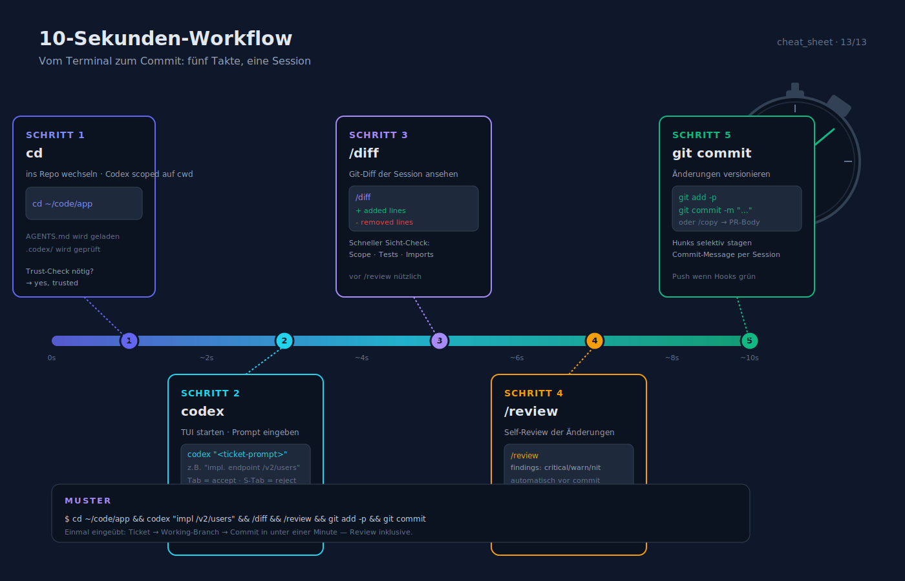

```bash
cd ~/code/app
codex                        # oder: codex "<ticket-style prompt>"
# … Prompt eingeben, Approvals durchklicken …
/diff                        # Review vor Commit
/review                      # Self-Review
git add -p && git commit
```

---

**Verwandte Dokumente**

- [installation_und_setup.md](installation_und_setup.md)
- [feature_uebersicht.md](feature_uebersicht.md)
- [konfiguration_und_anpassung.md](konfiguration_und_anpassung.md)
- [sicherheit_und_sandboxing.md](sicherheit_und_sandboxing.md)
- [integrationen_ide_ci_cd.md](integrationen_ide_ci_cd.md)
- [entwicklungs_lebenszyklus.md](entwicklungs_lebenszyklus.md)
- [praktische_workflows.md](praktische_workflows.md)
- [_quellen.md](_quellen.md)
