# Codex CLI — Effektive Softwareentwicklung im kompletten Lebenszyklus

> Stand: 2026-04-16

Dieses Dokument ist der **Playbook-Teil** der Deep Research: Wie baue ich mit Codex CLI Software **von der Idee bis zum deploybaren Artefakt**? Jede Phase bekommt ein klares Ziel, konkrete Befehle/Prompts, Best Practices und typische Fallstricke.

Die Kern-Philosophie: **Codex ist ein autonomer Agent — Deine Aufgabe ist Kontext-Engineering**. Du legst fest, was *gut* aussieht (AGENTS.md, Tests, Skills), und Codex optimiert autonom gegen dieses Ziel.

---

## Übersicht der Phasen

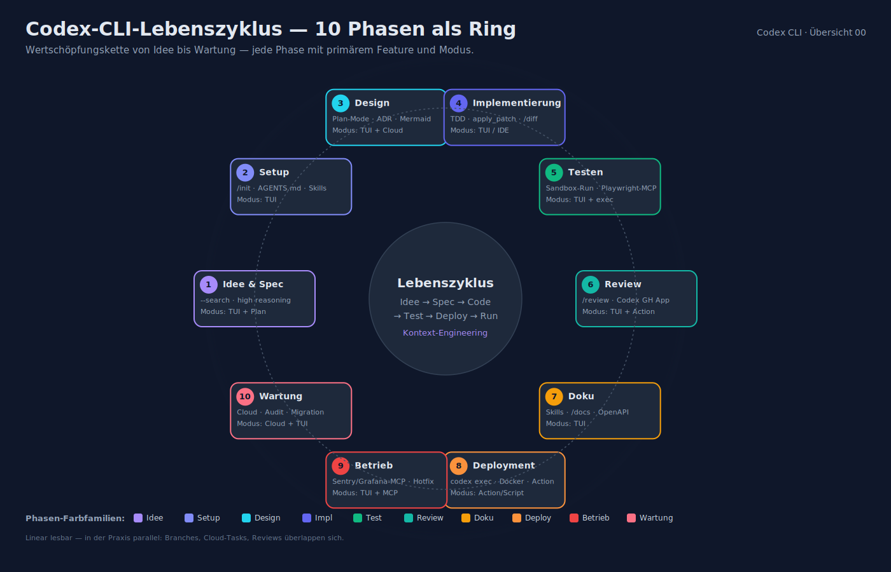

| # | Phase | Primäres Codex-Feature | Modus |
|---|---|---|---|
| 1 | Idee & Spec | `/init`, `--search`, high Reasoning | TUI + Plan |
| 2 | Projekt-Setup | `/init`, AGENTS.md, Skills | TUI |
| 3 | Design & Planung | Plan-Mode, ADR-Skill, Mermaid | TUI + Cloud |
| 4 | Implementierung | inkrementell, TDD, `apply_patch` | TUI / IDE |
| 5 | Testen & Verifikation | sandboxed Shell, Playwright-MCP | TUI + `exec` |
| 6 | Review & Qualität | `/review`, Codex GitHub App | TUI + Action |
| 7 | Dokumentation | Custom Skills, `/docs` Prompt | TUI |
| 8 | Deployment & Release | `codex exec` in CI, Docker-Template | Action/Script |
| 9 | Betrieb & Incident | Log-Analyse, Hotfix-Branch | TUI + MCP |
| 10 | Wartung & Migration | Repo-Exploration, Dependency-Audit | Cloud + TUI |

Diese Nummerierung ist linear zum Lesen; in der Praxis laufen Phasen **parallel** (Branches, Cloud-Tasks, Reviews).

---

## Phase 1 — Idee & Spezifikation

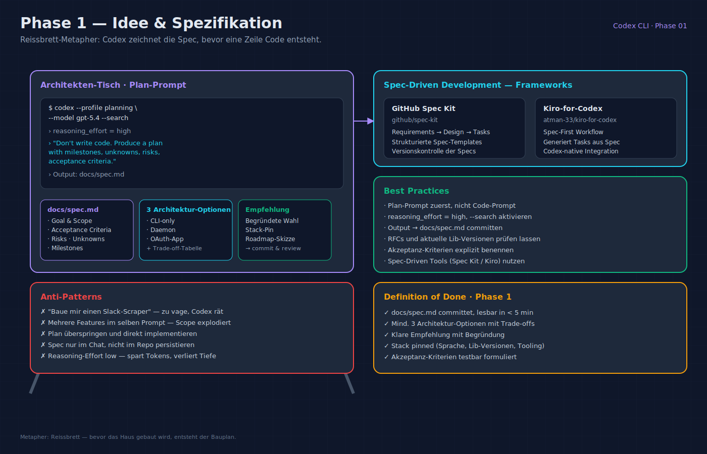

**Ziel**: Problem verstehen, Scope festlegen, Abnahme-Kriterien formulieren.

**Befehle / Prompts**:

```bash
codex --profile planning --model gpt-5.4 --search
```

Beispiel-Prompt:

> *"Ich will ein CLI-Tool, das Bilder aus Slack-Threads in ein lokales Archiv lädt. Erarbeite 3 Architektur-Optionen (CLI-only, Daemon, OAuth-App), ziehe Trade-offs und schlag die beste Option vor. Fokus: Python ≥ 3.11, Poetry, SQLite für Metadaten."*

**Best Practices**:

- **Plan-Prompt zuerst**: *"Don't write code. Produce a plan with milestones, unknowns, risks, and acceptance criteria."*
- `reasoning_effort = high` in dieser Phase — längere Denkzeit zahlt sich aus.
- Externes Wissen: `--search` zulassen, damit Codex RFCs und aktuelle Lib-Versionen prüft.
- Output in ein **Markdown-Dokument** (`docs/spec.md`) schreiben lassen und committen.
- **Spec-Driven Development** via GitHub Spec Kit (`github/spec-kit`) oder Kiro-for-Codex (`atman-33/kiro-for-codex`) für strukturiertes Requirements → Design → Tasks.

**Anti-Patterns**:

- "Baue mir einen Slack-Scraper" → zu vage; Codex rät.
- Mehrere Features gleichzeitig in einem Prompt — Scope explodiert.

---

## Phase 2 — Projekt-Setup

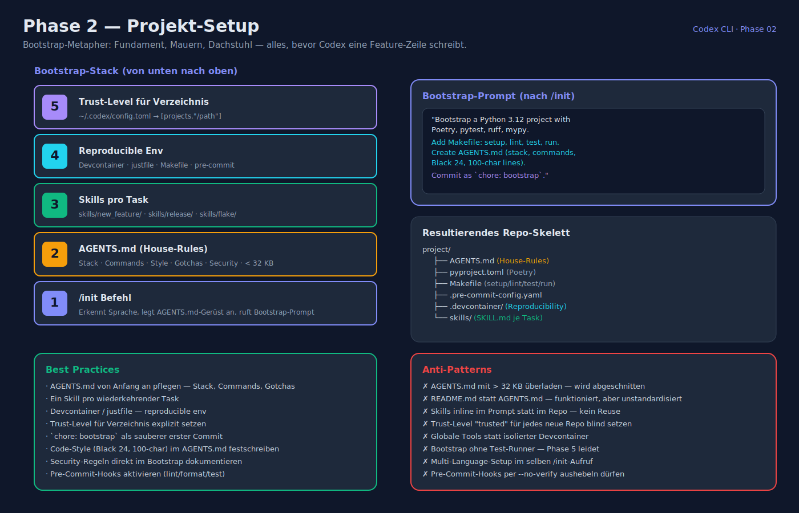

**Ziel**: Greenfield oder Brownfield startklar machen, AGENTS.md bereitstellen.

**Befehle**:

```bash
mkdir -p ~/code/slacker && cd ~/code/slacker
codex                      # Startet TUI
/init                      # legt AGENTS.md-Gerüst an
```

Beispiel-Prompt nach `/init`:

> *"Bootstrap a Python 3.12 project with Poetry, pytest, ruff, mypy. Add Makefile with `setup`, `lint`, `test`, `run`. Create AGENTS.md summarizing stack, commands and the house style (Black 24, 100-char lines). Commit as `chore: bootstrap`."*

**Best Practices**:

- `AGENTS.md` von Anfang an pflegen — Stacks, Commands, Gotchas, Security-Regeln.
- Ein **Skill pro wiederkehrender Task** (`skills/new_feature/`, `skills/release/`) im Repo.
- **Devcontainer** oder `justfile` für reproducible environments.
- **Trust-Level** für das Verzeichnis setzen (`~/.codex/config.toml` → `[projects."..."]`).

**Anti-Patterns**:

- AGENTS.md mit >32 KB überladen → wird abgeschnitten.
- README.md als Ersatz für AGENTS.md — funktioniert, aber unstandardisiert.

---

## Phase 3 — Design & Planung

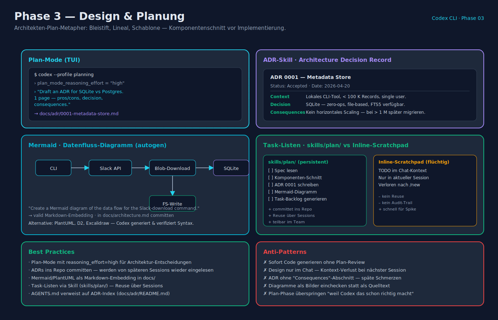

**Ziel**: Komponenten-Schnitt, Datenmodell, ADRs.

**Befehle**:

```bash
codex --profile planning
```

Prompts:

> *"Draft an ADR for choosing SQLite vs Postgres for the metadata store. 1 page, pros/cons, decision, consequences. Put it in `docs/adr/0001-metadata-store.md`."*

> *"Create a Mermaid diagram of the data flow for the Slack-download command: CLI → Slack API → Blob-Download → SQLite-Upsert → FS-Write."*

**Best Practices**:

- **Plan-Mode** (`plan_mode_reasoning_effort = "high"`) für Architektur-Entscheidungen.
- ADRs ins Repo committen — werden bei späteren Sessions via AGENTS.md wieder eingelesen.
- Visualisierung via Mermaid / PlantUML — Codex generiert valides Markdown-Embedding.
- **Task-Listen als Todo-Skill** (`skills/plan/`) versus Inline-Scratchpad.

**Anti-Patterns**:

- Sofort Code schreiben lassen, ohne Plan-Review.
- Design-Dokument nicht committen → Kontext-Verlust bei nächster Session.

---

## Phase 4 — Implementierung

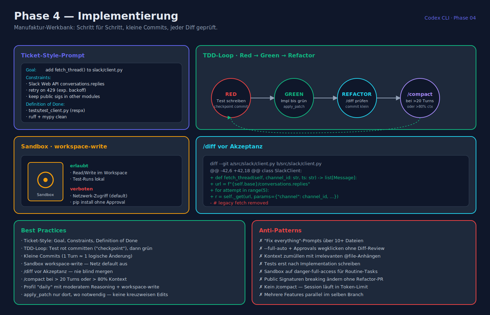

**Ziel**: Code schreiben, inkrementell, rückbaufähig.

**Befehle**:

```bash
codex --profile daily
```

Muster-Prompts (klein und spezifisch):

> *"In `src/slack/client.py`: add `fetch_thread(channel_id, thread_ts) -> list[Message]`. Use the Slack Web API (`conversations.replies`). Retry on 429 with exponential backoff. Tests in `tests/test_client.py` using `respx`. Do not touch public signatures in other modules."*

**Best Practices**:

- **Ticket-Style-Prompts**: klarer Goal, Constraints, Definition of Done (siehe [`praktische_workflows.md`](praktische_workflows.md)).
- **TDD-Loop**: Tests zuerst schreiben, rot committen ("checkpoint"), dann Implementation bis grün.
- **Kleine Commits** (1 Agent-Turn ≈ 1 logische Änderung). Git-Verlauf ist das Safety-Net.
- **Sandbox-Mode `workspace-write`** — Netzwerk default aus, so merkst Du frühzeitig, wenn Codex ungefragt `pip install` will.
- **`/diff` vor Akzeptanz**. Nie blind mergen.
- **`/compact`**, wenn die Session >~20 Turns hat oder Context >80 % ausgenutzt.

**Anti-Patterns**:

- "Fix everything"-Prompts über 10+ Dateien → Approval-Storm, schlechte Reviews.
- Approvals durch `--full-auto` wegklicken, ohne Diff anzusehen.
- Kontext zumüllen mit irrelevanten `@file`-Anhängen.

---

## Phase 5 — Testen & Verifikation

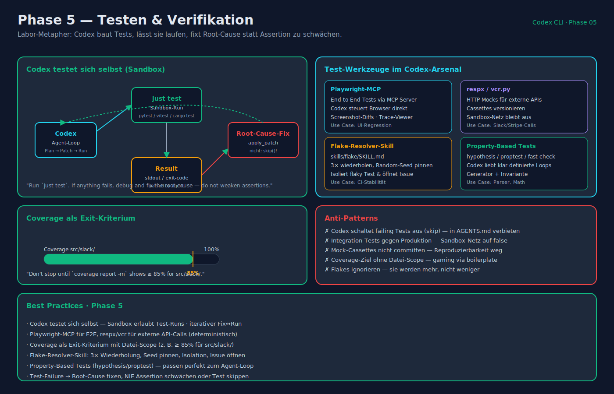

**Ziel**: Grüne Builds, realistische Tests, keine Flakiness.

**Befehle**:

```bash
codex "Run `just test`. If anything fails, debug and fix the root cause — do not weaken assertions."
```

**Best Practices**:

- **Codex testet sich selbst**: Sandbox erlaubt Test-Runs; Agent iteriert Fix ↔ Run bis grün.
- **Playwright-MCP** für E2E, **respx / vcr.py** für externe Calls.
- **Coverage als Exit-Kriterium**: *"Don't stop until `coverage report -m` shows ≥ 85 % for `src/slack/`."*
- **Flake-Resolver-Skill**: `skills/flake/SKILL.md` beschreibt, wie Codex Flakes isoliert (3× wiederholen, Random-Seed pinnen).
- **Property-Based Tests** (hypothesis/proptest) — Codex liebt sie, weil der Loop klar definiert ist.

**Anti-Patterns**:

- Codex schaltet failing Tests aus ("skip") — in AGENTS.md explizit verbieten.
- Integration-Tests gegen Produktion laufen lassen — Sandbox-Netzwerk auf `false` lassen, Mocks nutzen.

---

## Phase 6 — Review & Qualität

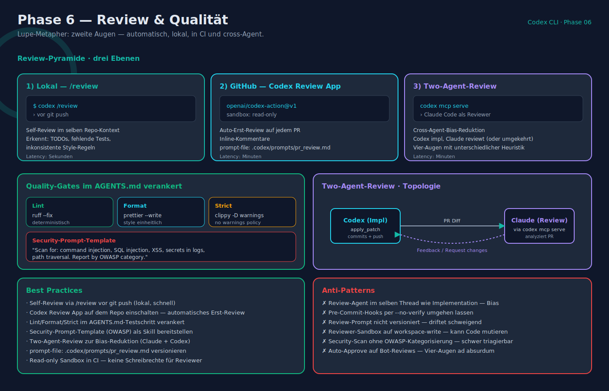

**Ziel**: Second-Pair-of-Eyes, Lint, Security, Regression.

**Befehle**:

```bash
# Lokal vor PR
codex /review

# In CI (siehe integrationen_ide_ci_cd.md)
# openai/codex-action@v1 mit sandbox: read-only und prompt-file: .codex/prompts/pr_review.md
```

**Best Practices**:

- **Self-Review via `/review`** *vor* `git push`.
- **Codex Review App** auf dem Repo einschalten — automatisches Erst-Review.
- **Lint/Format** im AGENTS.md-Testschritt verankert: `ruff --fix`, `prettier --write`, `clippy -D warnings`.
- **Security-Prompt-Template**: *"Scan for: command injection, SQL injection, XSS, secrets in logs, path traversal. Report by OWASP category."*
- **Two-Agent-Review**: Claude Code als Reviewer + Codex als Implementierer (oder umgekehrt) — `codex mcp serve` macht Codex zum Tool für andere Agenten.

**Anti-Patterns**:

- Review-Agent im selben Thread wie Implementation — Bias.
- Pre-Commit-Hooks, die Codex per `--no-verify` umgehen darf.

---

## Phase 7 — Dokumentation

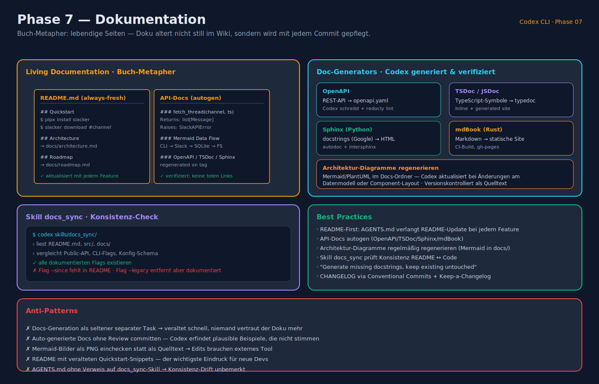

**Ziel**: Living Documentation ohne Zeitverlust.

**Befehle**:

```bash
codex "Generate missing docstrings (Google style) for all public functions in src/. Keep existing docstrings untouched."
codex "Summarize the changes since the last tag into CHANGELOG.md (Keep-a-Changelog format)."
```

**Best Practices**:

- **README-First-Policy**: AGENTS.md verlangt, dass Features die README erweitern.
- **API-Docs**: OpenAPI/TSDoc/Sphinx/mdBook — Codex generiert & verifiziert.
- **Architektur-Diagramme** regelmäßig regenerieren lassen (Mermaid im Docs-Ordner).
- **Skill `docs_sync`**: prüft, ob README und Code konsistent sind, und listet Deltas.

**Anti-Patterns**:

- Docs-Generation als separater, seltener Task → veraltet schnell.
- Auto-generierte Docs ohne Review committen.

---

## Phase 8 — Deployment & Release

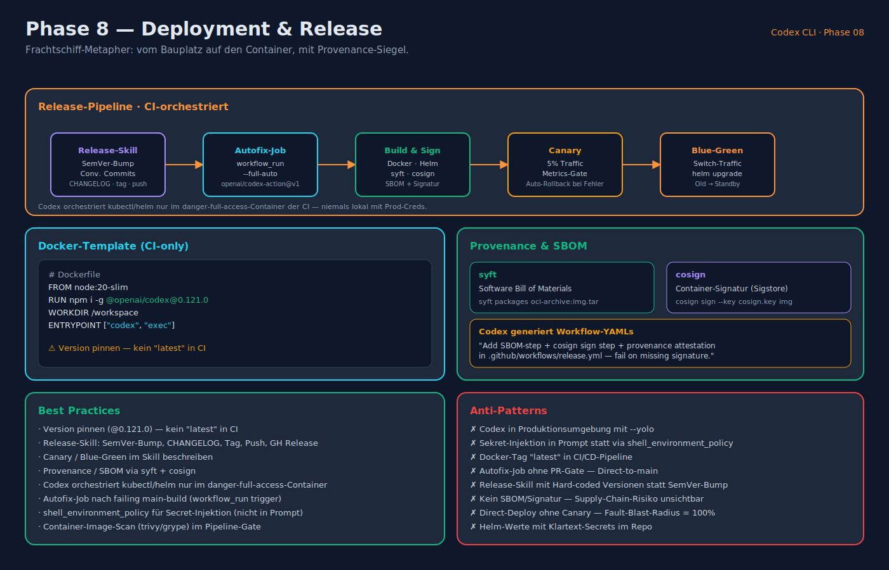

**Ziel**: Reproduzierbares Artefakt in Produktion.

**Befehle**:

```bash
# Release-Lauf via Skill
codex "Run the release skill: bump version according to semver based on Conventional Commits, update CHANGELOG, tag and push."
```

**CI-Pattern (GitHub Actions, siehe `integrationen_ide_ci_cd.md` §4)**:

- **Autofix-Job**: `workflow_run` + `openai/codex-action@v1` + `--full-auto`.
- **Release-Job**: getaggte Container-Images, Helm-Upgrade via Skill.

**Docker-Template**:

```dockerfile
FROM node:20-slim
RUN npm i -g @openai/codex@0.121.0
WORKDIR /workspace
ENTRYPOINT ["codex", "exec"]
```

**Best Practices**:

- **Version pinnen** (`@0.121.0`) — kein `latest` in CI.
- **Release-Skill** (`skills/release/SKILL.md`): SemVer-Bump, Changelog, Tag, Push, GitHub Release.
- **Canary / Blue-Green** im Skill beschreiben; Codex orchestriert via `kubectl`/`helm` nur im `danger-full-access`-Container.
- **Provenance / SBOM** via `syft`/`cosign`, Codex generiert Workflow-YAMLs.

**Anti-Patterns**:

- Codex in Produktionsumgebung mit `--yolo` — jede Sandbox-Lücke ist potenziell destruktiv.
- Sekret-Injektion in Prompt statt via `shell_environment_policy`.

---

## Phase 9 — Betrieb & Incident-Response

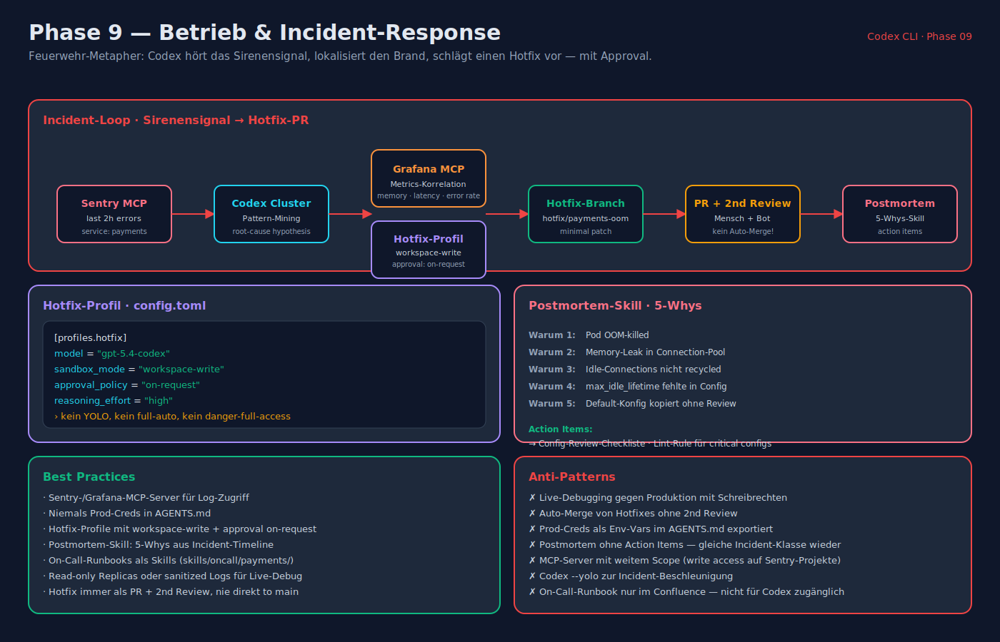

**Ziel**: Incidents schnell lokalisieren, dokumentieren, fixen.

**Befehle**:

```bash
codex "Pull the last 2h of error logs via the Sentry MCP (service `payments`). Cluster them, find the likely root cause, propose a minimal hotfix, open a PR on branch `hotfix/payments-oom`."
```

**Best Practices**:

- **Sentry-/Grafana-MCP-Server** für Log-Zugriff; niemals Prod-Creds in AGENTS.md.
- **Hotfix-Profile** mit `sandbox_mode = "workspace-write"` und `approval_policy = "on-request"` — kein YOLO.
- **Postmortem-Skill**: Codex generiert 5-Whys aus Incident-Timeline.
- **On-Call-Runbooks** als Skills (`skills/oncall/payments/`).

**Anti-Patterns**:

- Live-Debugging gegen Produktion — stets Read-only-Replicas oder sanitized Logs.
- Automatisches Merging von Hotfixes ohne 2nd Review.

---

## Phase 10 — Wartung & Migration

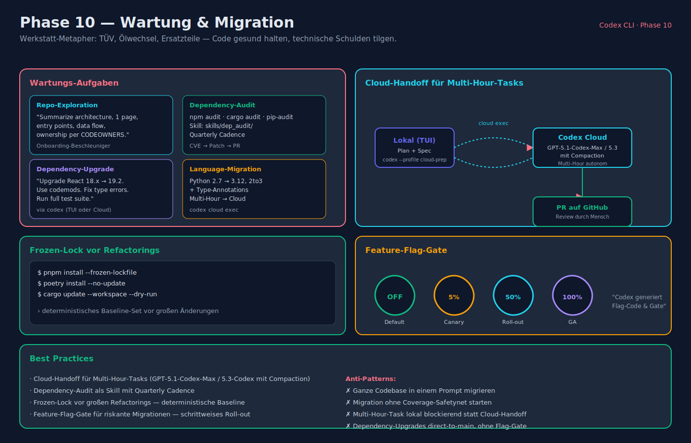

**Ziel**: Code gesund halten, technische Schulden reduzieren.

**Befehle**:

```bash
# Repo-Exploration
codex "Summarize the architecture of this repo in 1 page. Include entry points, data flow, and ownership (per CODEOWNERS)."

# Dependency Upgrade
codex "Upgrade React from 18.x to 19.2. Use the official codemods. Fix all type errors and breaking changes. Run the full test suite."

# Language-Migration (Multi-Hour, Cloud)
codex cloud exec --env python-mig "Port module `src/legacy/` from Python 2.7 to Python 3.12. Use `2to3`, add type annotations, run tests after each file."
```

**Best Practices**:

- **Cloud-Handoff** für Multi-Hour-Tasks — GPT-5.1-Codex-Max / 5.3-Codex mit Compaction.
- **Dependency-Audit** via `npm audit` / `cargo audit` / `pip-audit` im Skill.
- **Frozen-Lock** vor großen Refactorings (`pnpm install --frozen-lockfile`).
- **Feature-Flag-Gate**: riskante Migrationen hinter Flags ausrollen; Codex generiert den Flag-Code.

**Anti-Patterns**:

- Ganze Codebase in einem Prompt migrieren → Kontext-Overflow, Inkonsistenzen.
- Migration ohne Coverage-Safetynet starten.

---

## Meta — 10 Prinzipien für effektives Codex-Engineering

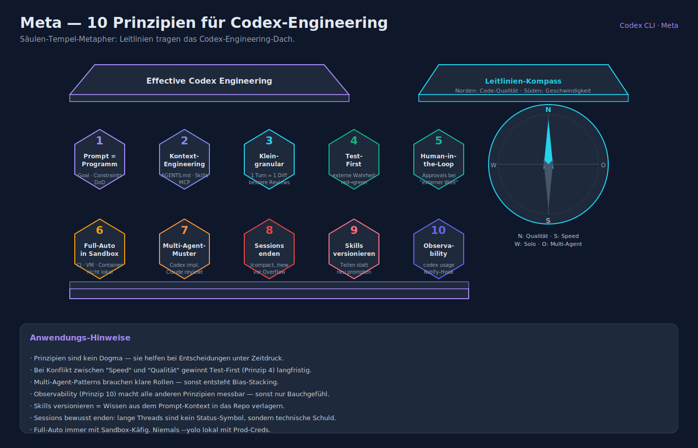

1. **Der Prompt ist das Programm**: So präzise wie ein Jira-Ticket — Goal, Constraints, Definition of Done.
2. **Kontext-Engineering statt Prompt-Engineering**: AGENTS.md + Skills + MCP zählen mehr als der eine clevere Prompt.
3. **Klein-granulare Tasks** → bessere Reviews, bessere Diffs, weniger Rollback-Schmerz.
4. **Test-First**: Tests sind die externe Wahrheit, gegen die Codex optimiert.
5. **Human-in-the-Loop bei Approvals** für alles, was Richtung "externe Welt" geht (Netz, PRs, Prod).
6. **Full-Auto nur in Sandboxes** (CI-Runner, VM, Container).
7. **Multi-Agent-Muster**: Codex implementiert, Claude/Codex reviewt — oder umgekehrt.
8. **Sessions bewusst enden**: `/compact` oder `/new` vor Kontext-Überlauf.
9. **Skills versionieren**: teilen statt neu prompten.
10. **Observability**: `codex usage`, Session-Logs, Notify-Hook — messbare Qualität.

---

## Multi-Agent & Delegationsmuster

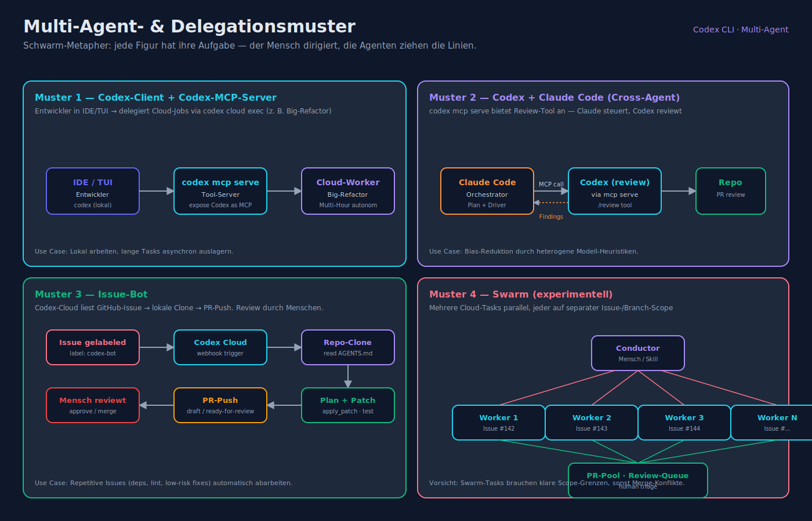

- **Codex-Client + Codex-MCP-Server**: Entwickler arbeitet mit Codex in der IDE, delegiert Cloud-Jobs via `codex cloud exec` (z. B. Big-Refactor).
- **Codex + Claude Code**: `codex mcp serve` bietet Review-Tool an; Claude steuert, Codex reviewt.
- **Issue-Bot**: Codex-Cloud liest GitHub-Issue → lokale Clone → PR-Push. Review durch Menschen.
- **Swarm** (experimental): mehrere Cloud-Tasks parallel, jeder auf separater Issue-/Branch-Scope.

---

## Lebenszyklus-Skizze für ein Greenfield-Projekt

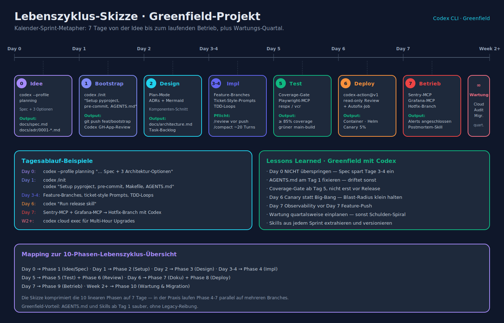

```text
Day 0 — Idee
  codex --profile planning "… Spec + 3 Architektur-Optionen"
  → docs/spec.md, docs/adr/0001-*.md

Day 1 — Bootstrap
  codex /init
  codex "Setup pyproject, pre-commit, Makefile, AGENTS.md"
  → git push feat/bootstrap; Review via Codex GH App

Day 2–5 — Implementation
  Feature-Branches, ticket-style Prompts, TDD-Loops
  codex /review vor jedem Push
  /compact alle ~20 Turns

Day 6 — Deployment
  CI: codex-action@v1 Review-Job (read-only) + Autofix-Job
  codex "Run release skill"
  → Container, Helm, Canary

Day 7 — Betrieb
  Sentry-MCP + Grafana-MCP
  Hotfix-Branch mit Codex
  Post-Incident-Review Skill

Week 2+ — Wartung
  codex cloud exec für Multi-Hour Upgrades
  Quarterly Dependency-Audit Skill
```

---

**Verwandte Dokumente**

- [installation_und_setup.md](installation_und_setup.md)
- [feature_uebersicht.md](feature_uebersicht.md)
- [konfiguration_und_anpassung.md](konfiguration_und_anpassung.md)
- [sicherheit_und_sandboxing.md](sicherheit_und_sandboxing.md)
- [integrationen_ide_ci_cd.md](integrationen_ide_ci_cd.md)
- [praktische_workflows.md](praktische_workflows.md)
- [cheat_sheet.md](cheat_sheet.md)
- [_quellen.md](_quellen.md)
