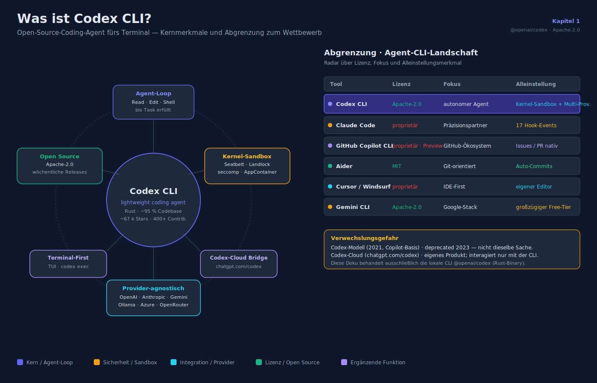
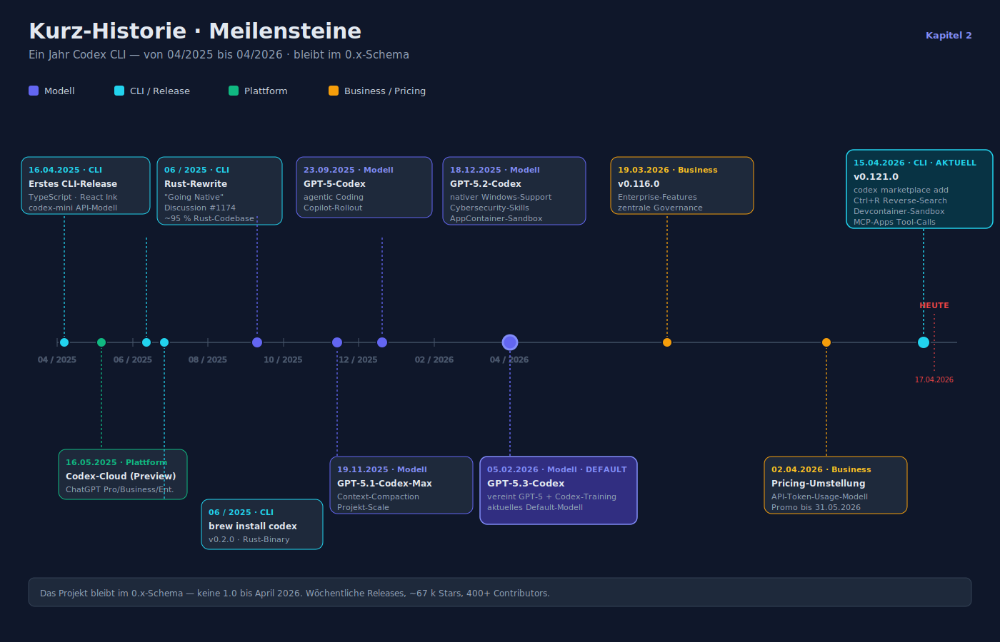
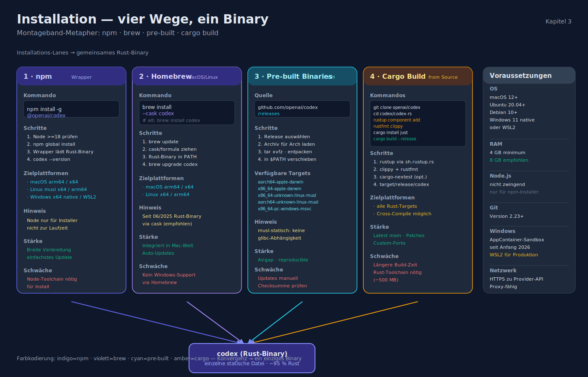
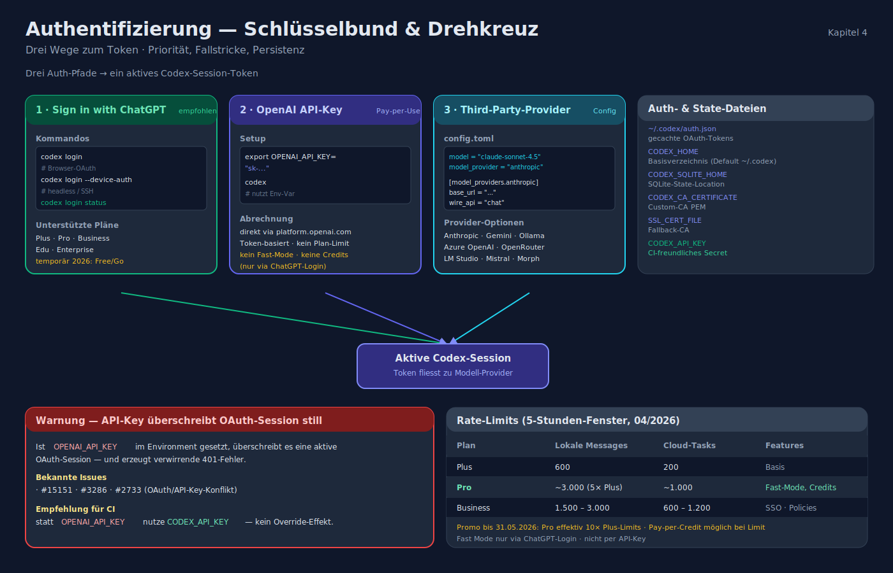
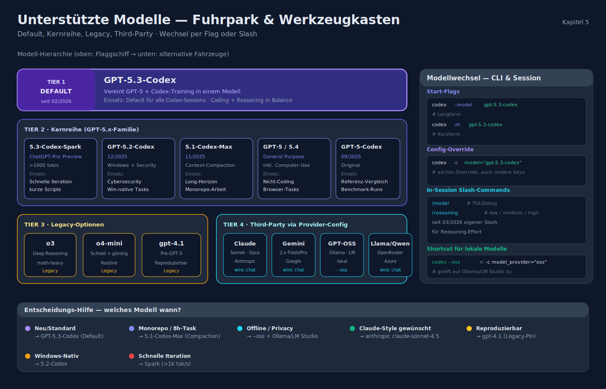
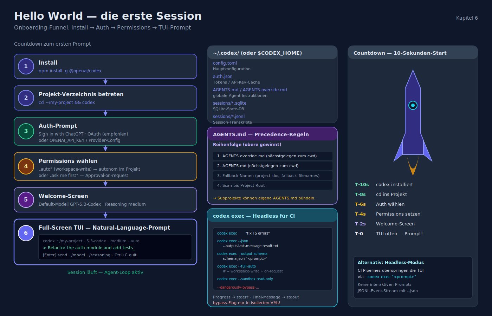
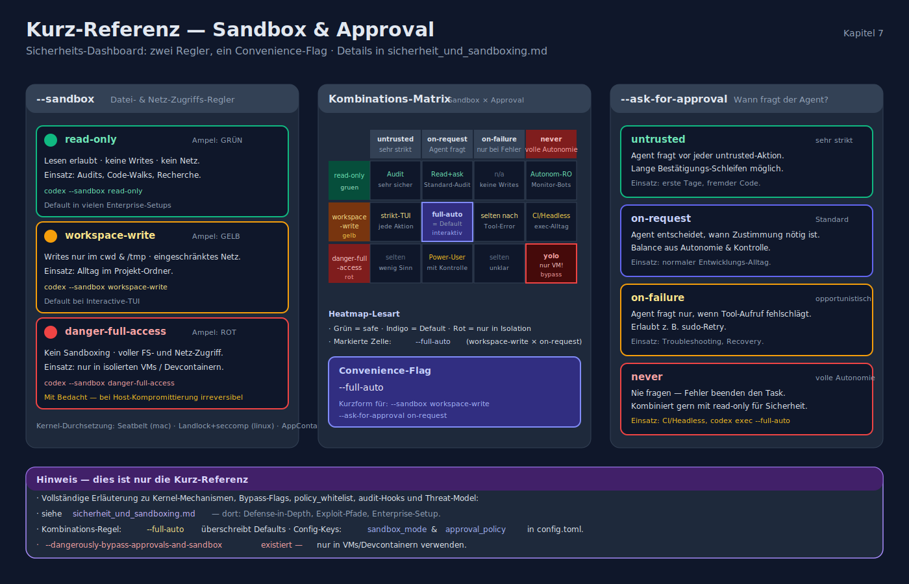

# Codex CLI — Installation, Authentifizierung und Grundlagen

> Stand: 2026-04-16 · Referenz: `@openai/codex` (Apache-2.0, Rust-basiert)

## 1. Was ist Codex CLI?



**Codex CLI** ist OpenAIs Open-Source-Coding-Agent für das Terminal. Offizielle Positionierung: *"lightweight coding agent that runs in your terminal"*. Das Projekt lebt im GitHub-Repo [`openai/codex`](https://github.com/openai/codex) unter **Apache-2.0** und ist einer der wenigen Frontier-Lab-Agents mit offenem Quellcode.

Kernmerkmale:

- **Lokaler Agent-Loop** — das Modell wird in einer Schleife aufgerufen, liest und editiert Dateien, führt Shell-Commands aus, bis ein Task abgeschlossen ist.
- **Kernel-Sandbox**: Apple Seatbelt (macOS), Landlock + seccomp (Linux), AppContainer (Windows nativ seit Anfang 2026).
- **Provider-agnostisch**: OpenAI (Default), Anthropic, Google Gemini, OpenRouter, Ollama, LM Studio, Azure OpenAI — konfigurierbar via `[model_providers]` in `config.toml`.
- **Open-Source**: ~67.000 GitHub-Stars, 400+ Contributors, wöchentliche Releases.
- **Codebasis**: ~95 % Rust (Rewrite von TypeScript seit Juni 2025).

### Abgrenzung

| Tool | Lizenz | Fokus | Besonderheit |
|---|---|---|---|
| **Codex CLI** | Apache-2.0 | autonomer Agent, Terminal-First | Kernel-Sandbox, Multi-Provider |
| Claude Code | proprietär | kollaborativer Präzisionspartner | 17 Hook-Events, feingranulare Steuerung |
| GitHub Copilot CLI | proprietär (Preview) | GitHub-Ökosystem (Issues, PRs) | tiefe GH-Integration |
| Aider | MIT | Git-orientiert, Auto-Commits | Python, provider-agnostisch |
| Cursor / Windsurf | proprietär | IDE-First | eigene Editor-Oberfläche |
| Gemini CLI | Apache-2.0 | Google-Stack | großzügiger Free-Tier |

**Verwechslungsgefahr**: Das alte *Codex-Modell* (2021, Copilot-Basis, 2023 deprecated) und die *Codex-Cloud* in ChatGPT (chatgpt.com/codex) sind **eigene Produkte**. Diese Doku behandelt die lokale CLI (`@openai/codex`), bezieht die Cloud aber dort ein, wo sie mit der CLI interagiert.

## 2. Kurz-Historie (Meilensteine)



| Datum | Meilenstein |
|---|---|
| 16.04.2025 | Erstes CLI-Release (TypeScript / React Ink / Node 22+); `codex-mini` API-Modell |
| 16.05.2025 | Codex-Cloud als Research Preview in ChatGPT Pro/Business/Enterprise |
| Juni 2025 | Ankündigung des Rust-Rewrites ("Codex CLI is Going Native", Discussion #1174) |
| Juni 2025 | `brew install codex` liefert Rust-Binary (v0.2.0) |
| 23.09.2025 | **GPT-5-Codex** Modell für agentic Coding; Copilot-Rollout |
| 19.11.2025 | **GPT-5.1-Codex-Max** mit Context-Compaction für Projekt-Scale-Arbeit |
| 18.12.2025 | **GPT-5.2-Codex** — nativer Windows-Support, Cybersecurity-Skills |
| 05.02.2026 | **GPT-5.3-Codex** (Default-Modell, vereint GPT-5 + Codex-Training) |
| 19.03.2026 | v0.116.0 — Enterprise-Features |
| 02.04.2026 | Pricing-Umstellung auf API-Token-Usage |
| 15.04.2026 | **v0.121.0** aktuell: `codex marketplace add`, Ctrl+R Reverse-Search, Devcontainer-Sandbox via bubblewrap, MCP-Apps Tool-Calls |

Das Projekt bleibt im **0.x-Schema**; es gibt bis April 2026 keine 1.0.

## 3. Installation



### 3.1 npm (Rust-Binary-Wrapper)

```bash
npm install -g @openai/codex
```

Der npm-Wrapper ist seit dem Rust-Rewrite ein dünner Loader für das native Binary. Node.js wird nicht mehr zur Laufzeit benötigt.

### 3.2 Homebrew (macOS / Linux)

```bash
brew install --cask codex
# ältere Formel
brew install codex
```

### 3.3 Pre-built Binaries

Downloads: <https://github.com/openai/codex/releases>

- `codex-aarch64-apple-darwin.tar.gz` · macOS Apple Silicon
- `codex-x86_64-apple-darwin.tar.gz` · macOS Intel
- Linux `x86_64-unknown-linux-musl` und `aarch64-unknown-linux-musl` (musl-statisch, keine glibc-Abhängigkeit)
- Windows x64 Native (seit Anfang 2026) + WSL2-Pfad

### 3.4 Cargo / Build from Source

```bash
git clone https://github.com/openai/codex.git
cd codex/codex-rs
curl --proto '=https' --tlsv1.2 -sSf https://sh.rustup.rs | sh -s -- -y
source "$HOME/.cargo/env"
rustup component add rustfmt clippy
cargo install just
cargo install --locked cargo-nextest    # optional
cargo build --release
./target/release/codex --version
```

### 3.5 Systemvoraussetzungen

| Bereich | Empfehlung |
|---|---|
| OS | macOS 12+, Ubuntu 20.04+/Debian 10+, Windows 11 (nativ oder WSL2) |
| RAM | 4 GB min., 8 GB empfohlen |
| Node.js | **nicht** zwingend (nur für npm-Installer) |
| Git | 2.23+ |
| Windows | Native Binary seit 2026 mit AppContainer; WSL2 empfohlen für Produktion |

## 4. Authentifizierung



Codex CLI unterstützt drei Auth-Pfade: **ChatGPT-OAuth**, **OpenAI-API-Key** und **Third-Party-Provider** via Config.

### 4.1 Sign in with ChatGPT (empfohlen für Einzelentwickler)

```bash
codex login                 # Browser-OAuth
codex login --device-auth   # Device-Code-Flow (headless / SSH)
codex login status          # aktueller Auth-Status
codex logout
```

Unterstützte Pläne: **Plus, Pro, Business, Edu, Enterprise** (temporär 2026: auch Free/Go).

Rate Limits (Stand 04/2026, modell- und planabhängig):

- GPT-5.3-Codex: **600–3.000 lokale Messages** und **200–1.200 Cloud-Tasks** je 5-h-Fenster.
- **ChatGPT Pro** ($100/Monat) ≈ 5× Plus-Limits; Promo bis 31.05.2026: effektiv 10×.
- Bei Limit-Erreichung können Plus/Pro-User zusätzliche Credits kaufen.
- Features wie *Fast Mode* (ChatGPT-Credits) gibt es nur via ChatGPT-Login, nicht per API-Key.

### 4.2 OpenAI API-Key (Pay-per-Use)

```bash
export OPENAI_API_KEY="sk-..."
codex
```

**Stolperstein**: `OPENAI_API_KEY` im Environment überschreibt eine aktive OAuth-Session **still** und erzeugt verwirrende 401-Fehler (Issues #15151, #3286, #2733). In CI besser das dedizierte `CODEX_API_KEY` verwenden.

### 4.3 Third-Party-Provider

Konfiguration in `~/.codex/config.toml`:

```toml
# Aktive Auswahl
model = "claude-sonnet-4.5"
model_provider = "anthropic"

[model_providers.anthropic]
name     = "Anthropic"
base_url = "https://api.anthropic.com/v1"
env_key  = "ANTHROPIC_API_KEY"
wire_api = "chat"

[model_providers.ollama]
name     = "Ollama"
base_url = "http://localhost:11434/v1"
env_key  = "OLLAMA_API_KEY"   # darf leer sein
wire_api = "chat"
```

Wire-API-Protokolle:

- `responses` — OpenAI, Azure OpenAI (native Responses-API)
- `chat` — alle anderen (Anthropic, Ollama, OpenRouter, Mistral, LM Studio, Morph …)

**Shortcut für lokale Modelle**: `--oss` ≡ `-c model_provider="oss"`.

### 4.4 Auth- und State-Dateien

| Datei / Var | Zweck |
|---|---|
| `~/.codex/auth.json` | gecachte OAuth-Tokens (File-basiert) |
| `CODEX_HOME` | Basisverzeichnis (Default `~/.codex`) |
| `CODEX_SQLITE_HOME` | SQLite-State-Location |
| `CODEX_CA_CERTIFICATE` | Custom-CA PEM |
| `SSL_CERT_FILE` | Fallback-CA |
| `CODEX_API_KEY` | CI-freundliches Secret |

## 5. Unterstützte Modelle



| Modell | Einsatz |
|---|---|
| **GPT-5.3-Codex** | Default seit 02/2026, vereint GPT-5 + Codex-Training |
| GPT-5.3-Codex-Spark | ChatGPT-Pro Research-Preview, >1000 tok/s |
| GPT-5.2-Codex | Starke Windows-/Cybersecurity-Performance |
| GPT-5.1-Codex / -Max | Long-Horizon-Tasks mit Compaction |
| GPT-5 / GPT-5.4 | General-Purpose inkl. Computer-Use |
| GPT-5-Codex | Original 09/2025 |
| o3, o4-mini, gpt-4.1 | Legacy-Optionen |
| Claude Sonnet/Opus, Gemini 2.x, GPT-OSS, Llama, Qwen | via Provider-Config |

Modellwechsel:

```bash
codex --model gpt-5.3-codex         # Flag
codex -m gpt-5.3-codex              # Kurzform
codex -c model="gpt-5.3-codex" ...  # Override
```

In einer Session:

```
/model        # TUI-Dialog
/reasoning    # Reasoning-Effort low / medium / high (eigener Slash seit 03/2026)
```

## 6. Hello World — die erste Session



```bash
npm install -g @openai/codex
cd ~/my-project
codex
```

Beim ersten Start:

1. **Auth-Prompt** → ChatGPT-OAuth oder API-Key.
2. **Permissions** → `auto` (workspace-write) oder "ask me first".
3. **Welcome-Screen** → Default-Modell + medium Reasoning.
4. **Full-Screen TUI** → Natural-Language-Prompt.

Config-/State-Dateien unter `~/.codex/` (oder `$CODEX_HOME`):

- `config.toml` — Hauptkonfiguration
- `auth.json` — Tokens / API-Key-Cache
- `AGENTS.md`, `AGENTS.override.md` — globale Agent-Instruktionen
- SQLite-State-DB für Sessions/History
- Session-Transkripte (JSONL)

### AGENTS.md — projektweite Instruktionen

`AGENTS.md` ist ein Branchen-Standard ([agents.md](https://agents.md)), getragen von OpenAI, Cursor, Amp, Google Jules, Factory u. a., inzwischen unter der Linux Foundation. Es beschreibt im Markdown-Format Build-, Test-, Run-Schritte, Architektur, Env-Vars, Style-Regeln.

**Precedence in Codex**:

1. `AGENTS.override.md` im Home-Dir schlägt `AGENTS.md` im Home-Dir.
2. Vom Project-Root abwärts bis zum aktuellen `cwd` wird auf jeder Ebene nach `AGENTS.override.md`, dann `AGENTS.md`, dann Fallback-Namen (`project_doc_fallback_filenames`) gesucht.
3. Die **nächstgelegene** Datei zum `cwd` gewinnt → Subprojekte können eigene Instruktionen bündeln.

### Non-Interactive (`codex exec`) — für Automation/CI

```bash
codex exec "fix all TypeScript errors"
codex exec --json --output-last-message result.txt "<prompt>"
codex exec --output-schema schema.json "<prompt>"
codex exec --full-auto "<prompt>"                     # workspace-write + on-request
codex exec --sandbox read-only "<prompt>"
```

- Progress auf `stderr`, finale Agent-Message auf `stdout`.
- `--json` liefert JSONL-Event-Stream — ideal für Pipelines.
- `--dangerously-bypass-approvals-and-sandbox` existiert, **nur in isolierten VMs** verwenden.

## 7. Kurz-Referenz: Sandbox & Approval (Details in `sicherheit_und_sandboxing.md`)



- `--sandbox read-only | workspace-write | danger-full-access`
- `--ask-for-approval untrusted | on-request | on-failure | never`
- `--full-auto` = `workspace-write` + `on-request`

---

**Verwandte Dokumente**

- [feature_uebersicht.md](feature_uebersicht.md)
- [konfiguration_und_anpassung.md](konfiguration_und_anpassung.md)
- [sicherheit_und_sandboxing.md](sicherheit_und_sandboxing.md)
- [integrationen_ide_ci_cd.md](integrationen_ide_ci_cd.md)
- [entwicklungs_lebenszyklus.md](entwicklungs_lebenszyklus.md)
- [praktische_workflows.md](praktische_workflows.md)
- [cheat_sheet.md](cheat_sheet.md)
- [_quellen.md](_quellen.md)
