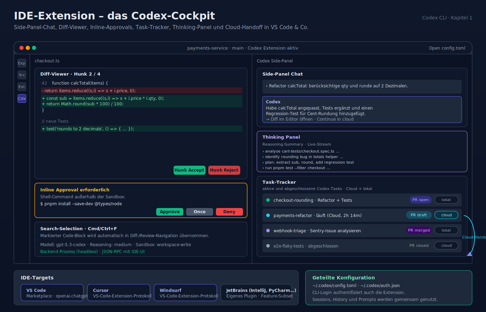
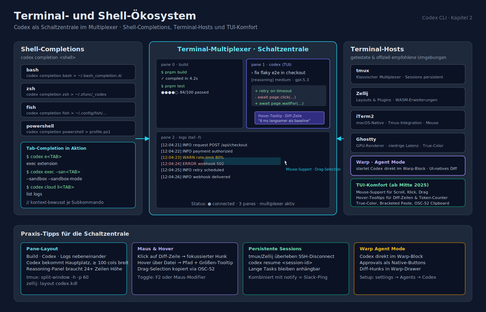
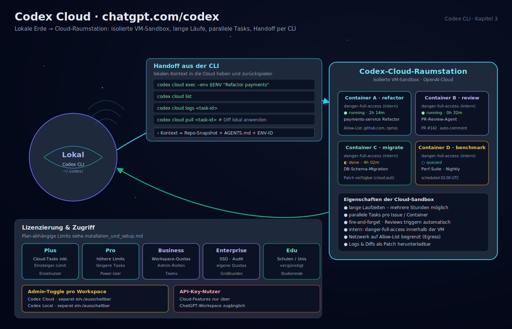
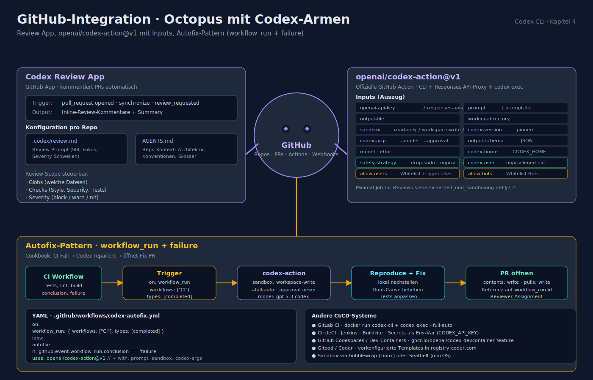
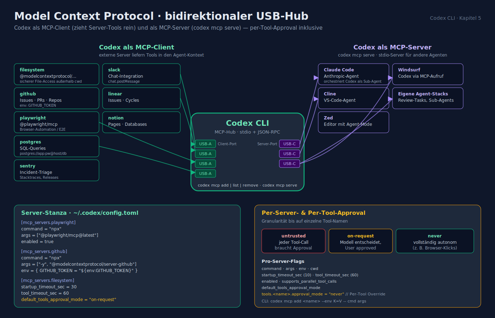
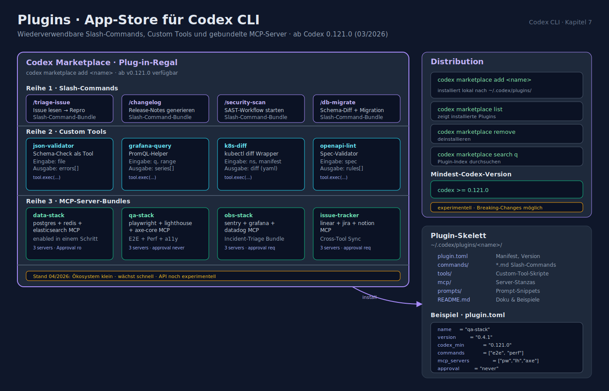
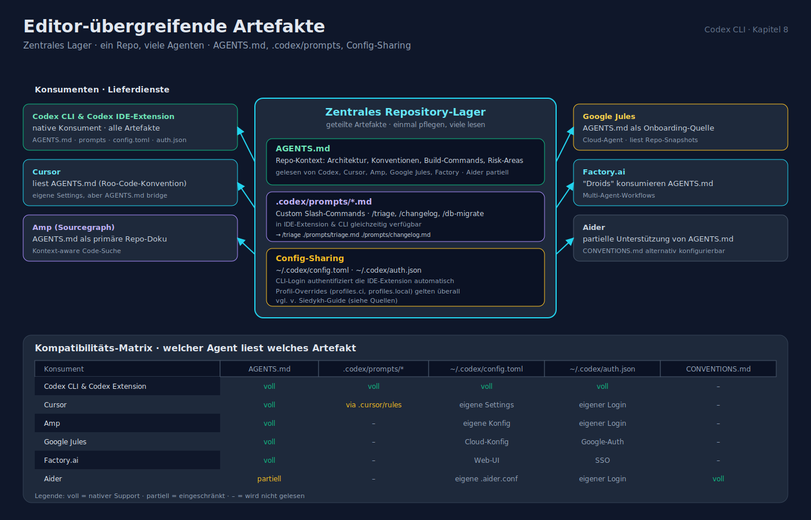
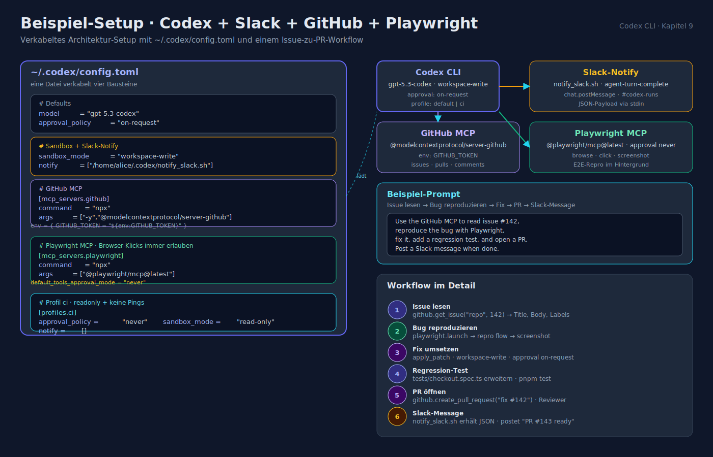
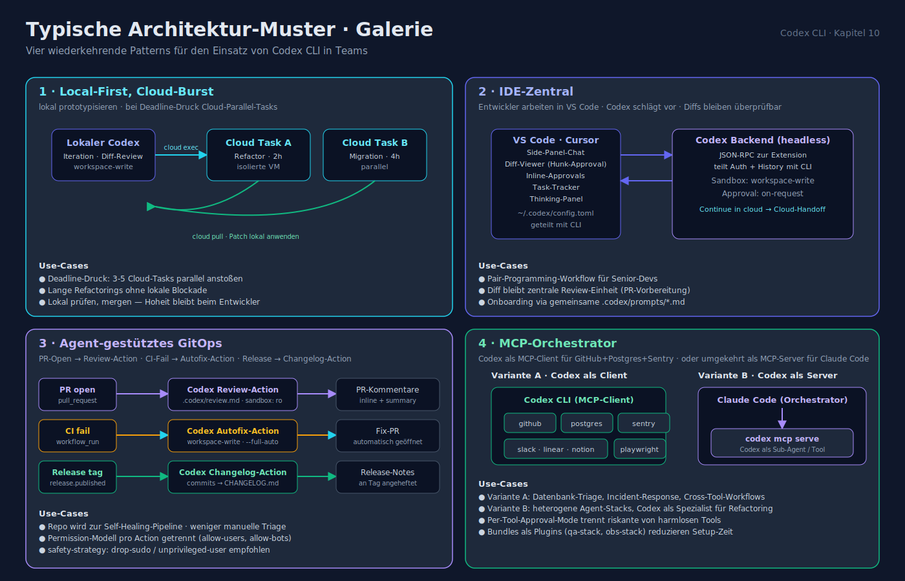

# Codex CLI — Integrationen: IDE, CI/CD, Cloud, MCP

> Stand: 2026-04-16

Codex CLI ist ein **Terminal-First-Agent**, dockt aber an vielen Stellen an das restliche Dev-Ökosystem an. Diese Seite zeigt die wichtigsten Integrationen, ihre Aktivierung und typische Use-Cases.

## 1. IDE-Extension (VS Code, Cursor, Windsurf)



### 1.1 Installation

- **VS Code Marketplace**: `openai.chatgpt` — gelistet als "Codex – OpenAI's coding agent".
- **Cursor / Windsurf** nutzen das VS Code Extension Protocol und installieren die gleiche Extension.
- **JetBrains**: separates Plugin (IntelliJ, PyCharm, GoLand, WebStorm) mit eingeschränkterer Feature-Matrix.
- **Visual Studio** (klassisch) wird als vollwertiges Target momentan noch nicht offiziell adressiert.

Die Extension **teilt die Konfiguration** mit der CLI (`~/.codex/config.toml`). Gear-Icon → "Open config.toml".

### 1.2 Kern-Features in der IDE

| Feature | Beschreibung |
|---|---|
| **Side-Panel Chat** | Codex-Session als Panel neben dem Editor; Prompts inline an ausgewählten Code. |
| **Diff-Viewer** | Agent-Änderungen als Diff anzeigen, Hunks einzeln akzeptieren/ablehnen. |
| **Inline Approvals** | Shell-Commands & Schreibaktionen werden im Panel zum Approve vorgelegt. |
| **Task-Tracker** | Liste aller aktiven/abgeschlossenen Tasks, inkl. PR-Status-Badges (draft/open/merged/closed). |
| **Thinking Panel** | Reasoning-Summary des Modells live im Panel. |
| **Cloud-Handoff** | "Continue in cloud" — Task an Codex Cloud delegieren, Progress im IDE verfolgen. |
| **Patches** | Diff-Download eines Cloud-Runs ins lokale Repo anwenden. |
| **Search-Selection** | Cmd/Ctrl+F startet mit markiertem Text → schnelle Diff-/Review-Navigation. |

### 1.3 Kommunikation Extension ↔ CLI

Die IDE-Extension startet lokal einen Codex-Backend-Prozess (headless), der über ein JSON-RPC-Protokoll (teils MCP-kompatibel) mit dem UI kommuniziert. Sessions, History und Auth werden aus `~/.codex` gelesen — ein Login in der CLI authentifiziert also auch die Extension.

## 2. Terminal-/Shell-Ökosystem



- **Shell-Completions**: `codex completion bash|zsh|fish|powershell` generiert Completion-Scripts.
- **tmux / Zellij / iTerm2 / Ghostty / Warp**: Codex ist kompatibel; Warps *Agent Mode* startet Codex direkt in einem Warp-Block.
- **Mouse-Support** in der TUI (ab Mitte 2025), inkl. Hover-Tooltip für Diff-Zeilen.

## 3. Codex Cloud (chatgpt.com/codex)



### 3.1 Was ist Codex Cloud?

Eine **isolierte VM-Sandbox** in der OpenAI-Cloud, die einen autonomen Codex-Agenten laufen lässt — "fire and forget". Geeignet für:

- Lang laufende Refactorings (mehrere Stunden).
- Parallele Tasks (mehrere Issues gleichzeitig, je ein Container).
- Review-Agenten, die automatisch auf PR-Events reagieren.

### 3.2 Handoff aus der CLI

```bash
# lokalen Kontext in die Cloud heben
codex cloud exec --env <ENV_ID> "Refactor the payments module"

# Cloud-Task-Status abfragen
codex cloud list
codex cloud logs <task-id>
codex cloud pull <task-id>   # Diff als Patch abrufen, lokal anwenden
```

**Wichtig**: Cloud-Tasks laufen ausschließlich unter `danger-full-access` **innerhalb** der Cloud-Sandbox — das Netzwerk ist begrenzt auf eine freigegebene Allow-List.

### 3.3 Lizenzierung

- **Plus, Pro, Business, Enterprise, Edu**: Cloud-Tasks inkludiert (plan-abhängige Limits; siehe `installation_und_setup.md`).
- **API-Key-Nutzer**: können Cloud-Features nur über ChatGPT-Workspace verwenden.
- **Admin-Controls**: separater Toggle "Codex Cloud" vs. "Codex Local" pro Workspace.

## 4. GitHub-Integration



### 4.1 Codex Review App

Eine GitHub App, die auf PRs automatisch kommentiert. Konfiguration pro Repo via `.codex/review.md` (Prompt) und `AGENTS.md` (Kontext). Review-Scope (welche Dateien, welche Checks) steuerbar.

### 4.2 Offizielle GitHub Action — `openai/codex-action@v1`

Installiert die CLI, startet einen sicheren Responses-API-Proxy und ruft `codex exec` mit definierten Permissions auf.

**Vollständige Inputs** (Auszug):

| Input | Zweck |
|---|---|
| `openai-api-key` | Auth (oder `responses-api-endpoint` für Azure) |
| `prompt` / `prompt-file` | Instruktion |
| `output-file` | Ziel für Agent-Output |
| `working-directory` | Repo-Root o. Subpfad |
| `sandbox` | `read-only` / `workspace-write` / `danger-full-access` |
| `codex-version` | fixe CLI-Version pinnen |
| `codex-args` | zusätzliche Flags (z. B. `--model`, `--ask-for-approval`) |
| `output-schema` / `output-schema-file` | JSON-Schema für strukturierten Output |
| `model` | Modell-Override |
| `effort` | Reasoning-Effort |
| `codex-home` | Custom `CODEX_HOME` |
| `safety-strategy` | `drop-sudo` (Default), `unprivileged-user`, `read-only`, `unsafe` |
| `codex-user` | User für unprivileged Execution |
| `allow-users` / `allow-bots` | Whitelist für Trigger |

**Minimaler Review-Job** siehe `sicherheit_und_sandboxing.md` §7.2.

**Autofix-Job für fehlgeschlagene CI** (Cookbook-Pattern):

```yaml
name: Codex Autofix
on:
  workflow_run:
    workflows: ["CI"]
    types: [completed]

jobs:
  autofix:
    if: ${{ github.event.workflow_run.conclusion == 'failure' }}
    permissions:
      contents: write
      pull-requests: write
    runs-on: ubuntu-latest
    steps:
      - uses: actions/checkout@v4
        with:
          ref: ${{ github.event.workflow_run.head_sha }}
      - uses: openai/codex-action@v1
        with:
          openai-api-key: ${{ secrets.OPENAI_API_KEY }}
          sandbox: workspace-write
          prompt: |
            The CI run ${{ github.event.workflow_run.id }} failed.
            Reproduce locally, fix the root cause, and open a PR
            referencing the original workflow run.
          codex-args: "--full-auto --model gpt-5.3-codex --ask-for-approval never"
```

### 4.3 Andere CI/CD-Systeme

- **GitLab CI**: `docker run` des offiziellen Codex-CLI-Images, `codex exec --full-auto --sandbox workspace-write`.
- **CircleCI / Jenkins / Buildkite**: analog; Secrets als Env-Var, `CODEX_API_KEY` bevorzugt.
- **GitHub Codespaces / Dev Containers**: Codex-CLI als Feature (`ghcr.io/openai/codex-devcontainer-feature`), Sandbox über bubblewrap.
- **Gitpod / Coder**: vorkonfigurierte Templates im `registry.coder.com`.

## 5. Model Context Protocol (MCP)



### 5.1 Codex als MCP-**Client**

Konfigurierte MCP-Server werden als Tools in den Agent-Kontext gehoben. Stanza:

```toml
[mcp_servers.playwright]
command = "npx"
args    = ["@playwright/mcp@latest"]
enabled = true

[mcp_servers.filesystem]
command = "npx"
args    = ["-y", "@modelcontextprotocol/server-filesystem", "/Users/alice/projects"]
env     = {}
startup_timeout_sec = 30
tool_timeout_sec    = 60

[mcp_servers.github]
command = "npx"
args    = ["-y", "@modelcontextprotocol/server-github"]
env     = { GITHUB_TOKEN = "${env:GITHUB_TOKEN}" }

[mcp_servers.postgres]
command = "npx"
args    = ["-y", "@modelcontextprotocol/server-postgres", "postgres://app:pw@localhost/dev"]
```

Oder per CLI anlegen:

```bash
codex mcp add github \
  --env GITHUB_TOKEN=$GITHUB_TOKEN -- \
  npx -y @modelcontextprotocol/server-github
codex mcp list
codex mcp remove github
```

Pro-Server-Flags:

| Key | Zweck |
|---|---|
| `command` | Executable |
| `args` | Argumente |
| `env` | Env-Variablen (mit `${env:…}`-Expansion) |
| `cwd` | Arbeitsverzeichnis |
| `startup_timeout_sec` | Default 10 |
| `tool_timeout_sec` | Default 60 |
| `enabled` | Default `true` |
| `supports_parallel_tool_calls` | Boolean |
| `default_tools_approval_mode` | `untrusted` / `on-request` / `never` |
| `tools.<name>.approval_mode` | Per-Tool Override |

### 5.2 Codex als MCP-**Server**

```bash
codex mcp serve   # stdio-MCP-Server, exponiert Codex-Tools
```

Damit können andere Agenten (Claude Code, Cline, Zed, Windsurf) Codex als Tool aufrufen — z. B. für Review-Tasks, während der eigene Agent die Session orchestriert.

### 5.3 Typische MCP-Server für Codex

| Server | Zweck |
|---|---|
| `@modelcontextprotocol/server-filesystem` | sicherer File-Access außerhalb des cwd |
| `@modelcontextprotocol/server-github` | Issues, PRs, Repos |
| `@playwright/mcp` | Browser-Automation / E2E |
| `@modelcontextprotocol/server-postgres` | SQL-Queries |
| `@modelcontextprotocol/server-sentry` | Incident-Triage |
| `@modelcontextprotocol/server-slack` | Chat-Integration |
| `@modelcontextprotocol/server-linear` / `-notion` | Task-Management |

## 6. Notify-Hook (Desktop / Chat / CI-Pings)


`notify` wird bei bestimmten Events (aktuell *agent-turn-complete*) aufgerufen. Nutze ein externes Script für Slack/Discord/Telegram.

```toml
# macOS — Sound-Ton
notify = ["bash", "-lc", "afplay /System/Library/Sounds/Blow.aiff"]

# Windows — PowerShell-Skript
notify = ["powershell", "-NoProfile", "-ExecutionPolicy", "Bypass", "-File", "C:\\Users\\User\\.codex\\notify.ps1"]

# Linux — eigener Slack-Wrapper
notify = ["/home/alice/.codex/notify_slack.sh"]
```

Das Skript erhält einen JSON-Payload auf `stdin`:

```json
{
  "status": "success",
  "title": "Codex run",
  "summary": "Finished refactor",
  "duration": 123,
  "url": "https://chatgpt.com/codex/tasks/...",
  "last_assistant_message": "All tests pass."
}
```

Ein Community-Slack-Notifier (Wangmerlyn/Codex-Slack-Notifier) zeigt ein vollständiges Setup via `chat.postMessage`.

## 7. Plugins (experimentell, ab 03/2026)



OpenAI-Devs-Seite listet unter `/codex/plugins` ein Plugin-Konzept für wiederverwendbare Slash-Commands, Custom Tools und gebundelte MCP-Server. Die Distribution läuft über den neuen `codex marketplace add <name>` Command (v0.121.0). Stand 04/2026 ist das Ökosystem klein, wächst aber schnell.

## 8. Editor-übergreifende Artefakte



- **AGENTS.md** — gelesen von Codex, Cursor, Amp, Google Jules, Factory, Aider (partiell).
- **`.codex/prompts/*.md`** — Custom Slash-Commands; wenn geteilt mit IDE-Extension, werden sie auch dort verfügbar.
- **Config-Sharing** zwischen CLI und IDE-Extension: siehe v. Siedykh-Guide (Quellen).

## 9. Beispiel-Setup: Codex + Slack + GitHub + Playwright



```toml
# ~/.codex/config.toml
model = "gpt-5.3-codex"
approval_policy = "on-request"
sandbox_mode    = "workspace-write"

notify = ["/home/alice/.codex/notify_slack.sh"]

[mcp_servers.github]
command = "npx"
args    = ["-y", "@modelcontextprotocol/server-github"]
env     = { GITHUB_TOKEN = "${env:GITHUB_TOKEN}" }

[mcp_servers.playwright]
command = "npx"
args    = ["@playwright/mcp@latest"]
default_tools_approval_mode = "never"   # Browser-Clicks immer erlauben

[profiles.ci]
approval_policy = "never"
sandbox_mode    = "read-only"
notify          = []
```

Prompt-Beispiel:

```
Use the GitHub MCP to read issue #142, reproduce the bug with Playwright,
fix it, add a regression test, and open a PR. Post a Slack message when done.
```

## 10. Typische Architektur-Muster



- **Local-First, Cloud-Burst**: lokal prototypisieren, bei Deadline-Druck Cloud-Parallel-Tasks.
- **IDE-Zentral**: Entwickler arbeiten in VS Code, Codex schlägt vor, Diffs bleiben überprüfbar.
- **Agent-gestütztes GitOps**: PR-Open → Review-Action, CI-Fail → Autofix-Action, Release → Changelog-Action.
- **MCP-Orchestrator**: Codex als MCP-Client für GitHub+Postgres+Sentry; oder umgekehrt als MCP-Server für Claude Code.

---

**Verwandte Dokumente**

- [installation_und_setup.md](installation_und_setup.md)
- [konfiguration_und_anpassung.md](konfiguration_und_anpassung.md)
- [sicherheit_und_sandboxing.md](sicherheit_und_sandboxing.md)
- [feature_uebersicht.md](feature_uebersicht.md)
- [entwicklungs_lebenszyklus.md](entwicklungs_lebenszyklus.md)
- [_quellen.md](_quellen.md)
