# Codex CLI — Konfiguration und Anpassung

> Stand: 2026-04-16 · Referenz: CLI v0.121.0

Dieses Dokument ist die **Konfigurations-Referenz** für Codex CLI. Die CLI und die IDE-Extension teilen sich denselben Config-Stack.

## 1. Config-Precedence (wichtig!)

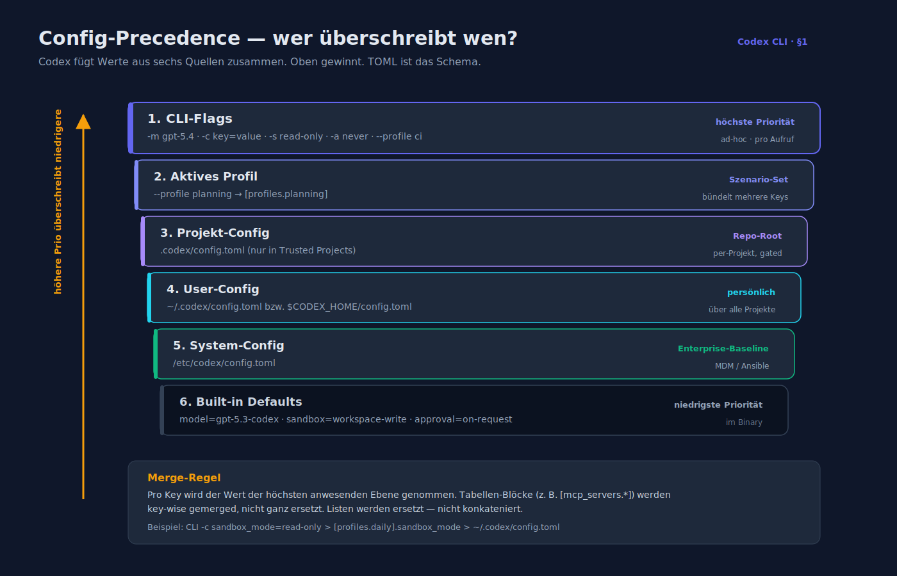

Codex fügt Werte aus mehreren Quellen zusammen. Von **höchster zu niedrigster** Priorität:

1. **CLI-Flags** (`-m`, `-c key=value`, `-s`, `-a`, …)
2. **Aktives Profil** (`--profile foo` → Block `[profiles.foo]`)
3. **Projekt-Config** `.codex/config.toml` im Repo-Root (**nur in Trusted Projects**)
4. **User-Config** `~/.codex/config.toml` (bzw. `$CODEX_HOME/config.toml`)
5. **System-Config** `/etc/codex/config.toml`
6. **Built-in Defaults**

Das Schema ist **TOML**. Alle Top-Level-Keys und Blöcke sind optional.

## 2. Top-Level-Keys

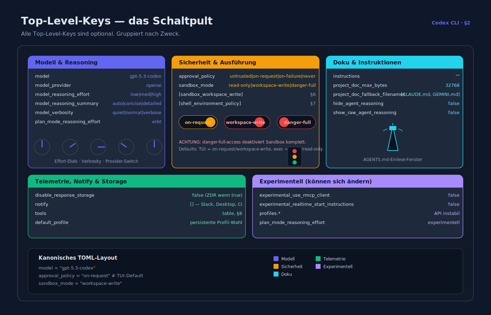

| Key | Typ | Default | Bedeutung |
|---|---|---|---|
| `model` | string | `"gpt-5.3-codex"` | Primäres Modell. |
| `model_provider` | string | `"openai"` | ID aus `[model_providers]` oder Built-in (`openai`, `ollama`, `lmstudio`). |
| `approval_policy` | string | `"on-request"` (TUI) / `"never"` (exec) | `untrusted` · `on-request` · `on-failure` · `never`. |
| `sandbox_mode` | string | `"workspace-write"` (TUI) / `"read-only"` (exec) | `read-only` · `workspace-write` · `danger-full-access`. |
| `model_reasoning_effort` | string | `"medium"` | `low` · `medium` · `high`. |
| `model_reasoning_summary` | string | `"concise"` | `auto` · `concise` · `detailed`. |
| `model_verbosity` | string | `"normal"` | `quiet` · `normal` · `verbose`. |
| `plan_mode_reasoning_effort` | string | folgt `model_reasoning_effort` | eigenes Effort-Level für Plan-Mode. |
| `project_doc_max_bytes` | int | `32768` | max. Größe von AGENTS.md, die eingelesen wird. |
| `project_doc_fallback_filenames` | list | `["CLAUDE.md", "GEMINI.md"]` | Alternative Dateinamen für Projekt-Instruktionen. |
| `disable_response_storage` | bool | `false` | Schaltet ZDR ein. |
| `notify` | list | `[]` | Notify-Hook-Command (siehe §9). |
| `hide_agent_reasoning` | bool | `false` | Thinking-Panel verbergen. |
| `show_raw_agent_reasoning` | bool | `false` | ungefilterte Reasoning-Tokens anzeigen. |
| `instructions` | string | `""` | globale System-Instruktionen (zusätzlich zu AGENTS.md). |
| `experimental_use_rmcp_client` | bool | `false` | native Rust-MCP-Client-Implementierung. |
| `experimental_realtime_start_instructions` | bool | `false` | Start-Briefing für geringere Latenz. |
| `tools` | table | `{}` | siehe §8. |

## 3. Profile — Konfigurations-Sets

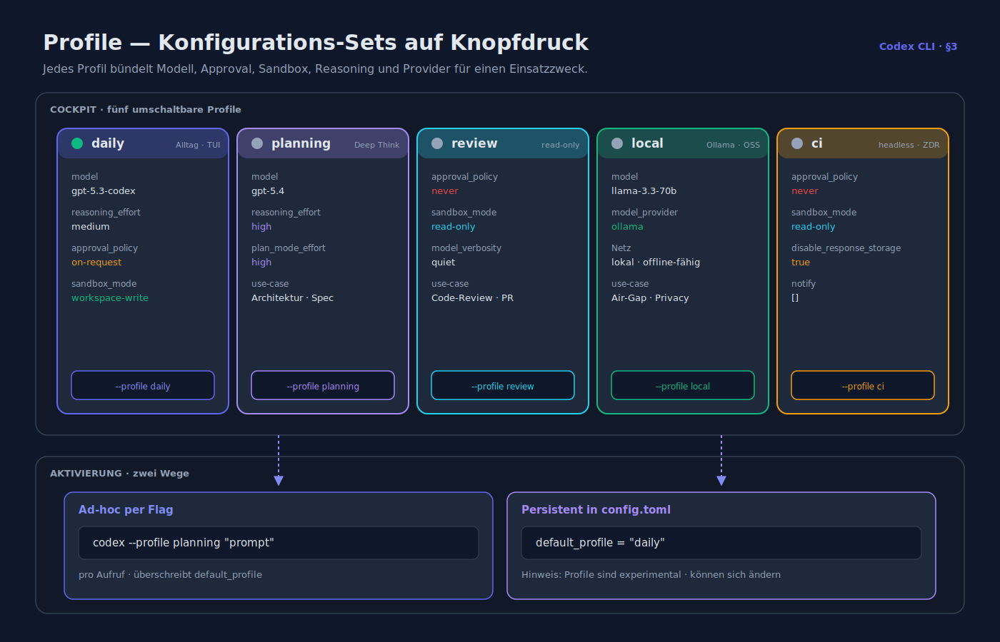

Profile bündeln Werte für bestimmte Szenarien (Daily, CI, Review, Local-OSS, Enterprise).

```toml
[profiles.daily]
model                   = "gpt-5.3-codex"
model_reasoning_effort  = "medium"
approval_policy         = "on-request"
sandbox_mode            = "workspace-write"

[profiles.planning]
model                   = "gpt-5.4"
model_reasoning_effort  = "high"
plan_mode_reasoning_effort = "high"

[profiles.review]
approval_policy         = "never"
sandbox_mode            = "read-only"
model_verbosity         = "quiet"

[profiles.local]
model                   = "llama-3.3-70b"
model_provider          = "ollama"

[profiles.ci]
approval_policy         = "never"
sandbox_mode            = "read-only"
disable_response_storage = true
notify                  = []
```

Aktivierung: `codex --profile planning "<prompt>"` oder persistent via `default_profile = "daily"`.

> *Hinweis*: Profile sind formell als *experimental* markiert und können sich ändern.

## 4. Model Providers

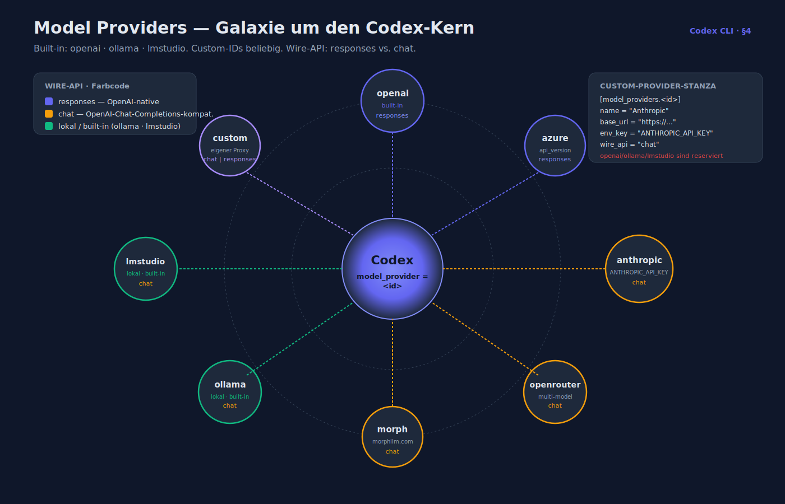

Built-in: `openai`, `ollama`, `lmstudio`. Custom-IDs jeden Namens möglich — die Built-in-IDs sind reserviert und dürfen **nicht** überschrieben werden.

```toml
[model_providers.anthropic]
name     = "Anthropic"
base_url = "https://api.anthropic.com/v1"
env_key  = "ANTHROPIC_API_KEY"
wire_api = "chat"              # "responses" oder "chat"

[model_providers.openrouter]
name     = "OpenRouter"
base_url = "https://openrouter.ai/api/v1"
env_key  = "OPENROUTER_API_KEY"
wire_api = "chat"

[model_providers.azure]
name       = "Azure OpenAI"
base_url   = "https://my-instance.openai.azure.com/openai"
env_key    = "AZURE_OPENAI_API_KEY"
wire_api   = "responses"
api_version = "2025-04-01-preview"

[model_providers.morph]
name     = "Morph"
base_url = "https://api.morphllm.com/v1"
env_key  = "MORPH_API_KEY"
wire_api = "chat"
```

Wire-API:

- `responses` — OpenAI-native Responses-API (inkl. Phase-Parameter, bester Codex-Support).
- `chat` — Chat-Completions-kompatibel (alle anderen Anbieter).

Aktivierung in einem Profil oder Top-Level:

```toml
model          = "claude-sonnet-4.5"
model_provider = "anthropic"
```

## 5. MCP-Server

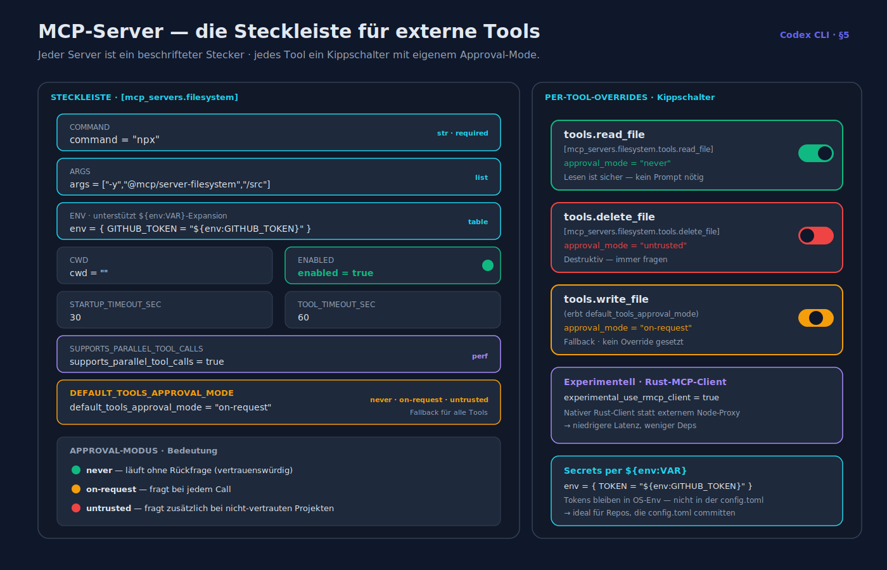

```toml
[mcp_servers.filesystem]
command = "npx"
args    = ["-y", "@modelcontextprotocol/server-filesystem", "/Users/alice/src"]
env     = {}
cwd     = ""
enabled = true
startup_timeout_sec = 30
tool_timeout_sec    = 60
supports_parallel_tool_calls = true
default_tools_approval_mode  = "on-request"  # "never" | "on-request" | "untrusted"

[mcp_servers.filesystem.tools.read_file]
approval_mode = "never"

[mcp_servers.filesystem.tools.delete_file]
approval_mode = "untrusted"
```

`env` erlaubt `${env:VAR}`-Expansion:

```toml
env = { GITHUB_TOKEN = "${env:GITHUB_TOKEN}" }
```

## 6. Sandbox-Workspace-Write

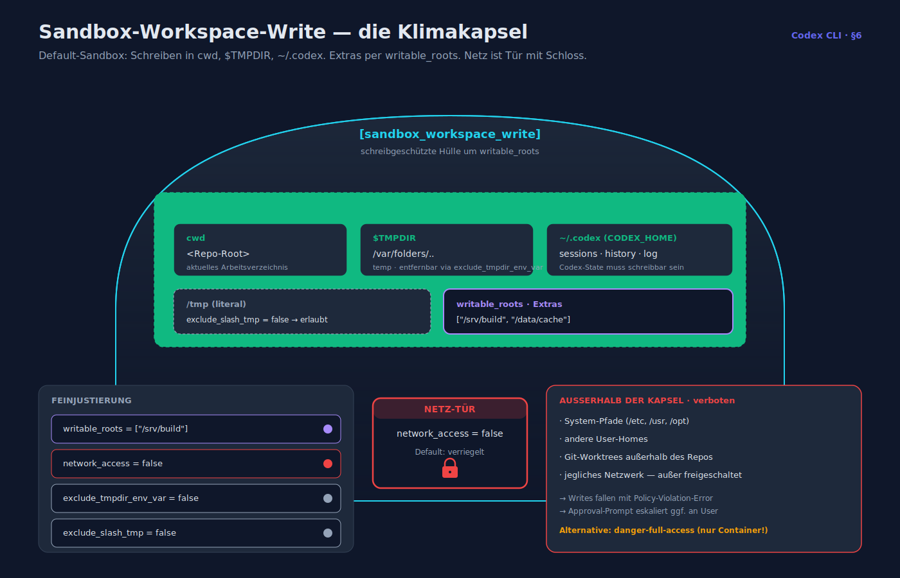

Feinjustierung des Default-Sandbox-Modes:

```toml
[sandbox_workspace_write]
network_access          = false          # Netz default blockiert
writable_roots          = ["/srv/build"] # zusätzliche Schreibpfade
exclude_tmpdir_env_var  = false          # /tmp via $TMPDIR ausschließen?
exclude_slash_tmp       = false          # literal /tmp ausschließen?
```

## 7. Shell-Environment-Policy

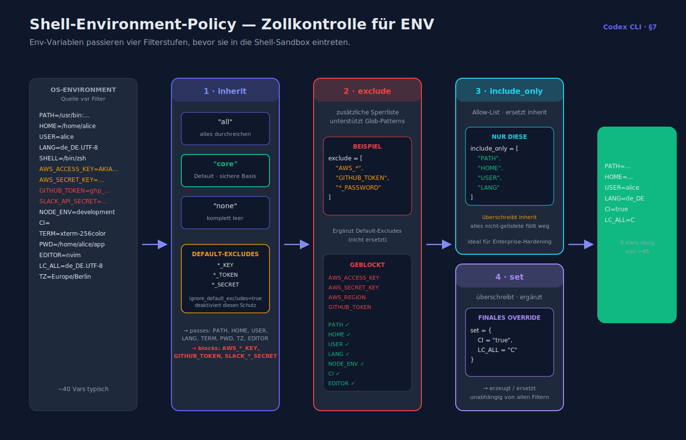

```toml
[shell_environment_policy]
inherit                 = "core"       # "all" | "core" | "none"
ignore_default_excludes = false        # Default schließt *_KEY/_TOKEN/_SECRET aus
exclude                 = ["AWS_*", "GITHUB_TOKEN"]
include_only            = ["PATH", "HOME", "USER", "LANG"]
set                     = { CI = "true" }
```

- `inherit = "core"` liefert nur wenige sichere Vars (PATH, HOME, USER, …).
- `exclude` ergänzt Glob-Patterns.
- `include_only` ersetzt `inherit` durch Allow-List.
- `set` überschreibt oder ergänzt.

## 8. Tools-Block

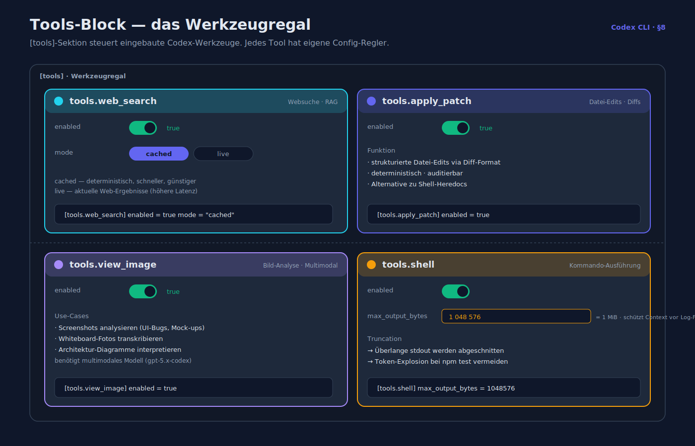

```toml
[tools]

[tools.web_search]
enabled  = true
mode     = "cached"     # "cached" | "live"

[tools.apply_patch]
enabled  = true

[tools.view_image]
enabled  = true

[tools.shell]
enabled  = true
max_output_bytes = 1048576
```

## 9. Notify-Hook

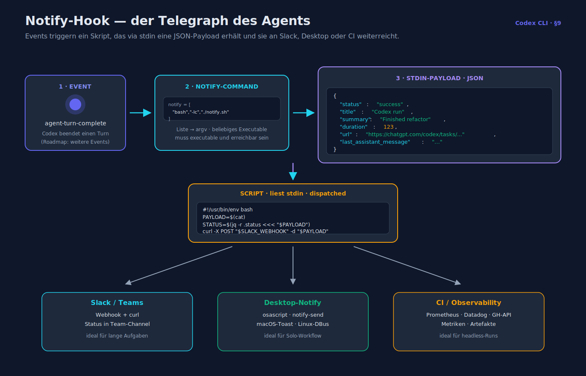

```toml
notify = ["bash", "-lc", "afplay /System/Library/Sounds/Blow.aiff"]
```

Events (Stand 04/2026): `agent-turn-complete`. Mehr in Roadmap.
Payload auf `stdin`:

```json
{
  "status": "success",
  "title": "Codex run",
  "summary": "Finished refactor",
  "duration": 123,
  "url": "https://chatgpt.com/codex/tasks/...",
  "last_assistant_message": "…"
}
```

## 10. History & TUI

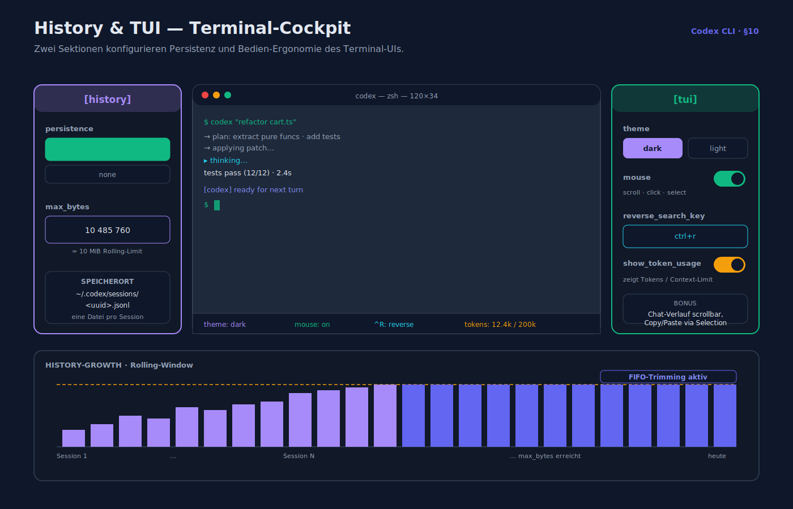

```toml
[history]
persistence = "save-all"   # "save-all" | "none"
max_bytes   = 10_485_760

[tui]
theme               = "dark"
mouse               = true
reverse_search_key  = "ctrl+r"
show_token_usage    = true
```

## 11. Projects & Workspace-Trust

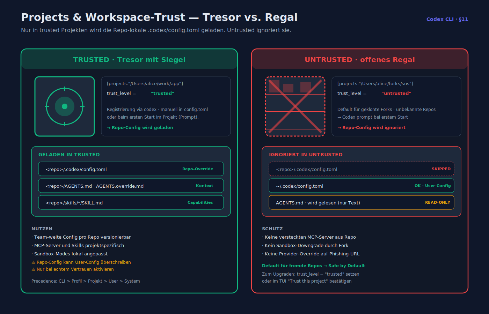

```toml
[projects."/Users/alice/work/app"]
trust_level = "trusted"   # "trusted" | "untrusted"

[projects."/Users/alice/forks/suspicious-repo"]
trust_level = "untrusted"
```

Nur in `trusted` Projekten wird `.codex/config.toml` im Repo geladen.

## 12. Environment-Variablen

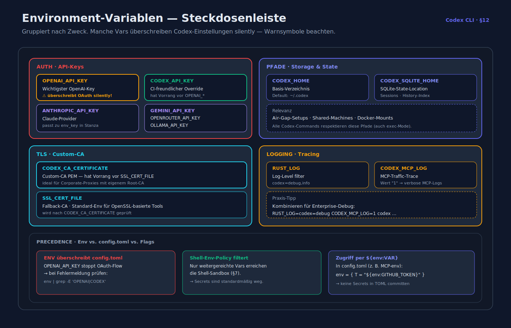

| Var | Zweck |
|---|---|
| `OPENAI_API_KEY` | API-Key (überschreibt OAuth silently!) |
| `CODEX_API_KEY` | CI-freundlicher Override |
| `CODEX_HOME` | Basis-Verzeichnis (Default `~/.codex`) |
| `CODEX_SQLITE_HOME` | SQLite-State-Location |
| `CODEX_CA_CERTIFICATE` | Custom-CA PEM (vor `SSL_CERT_FILE`) |
| `SSL_CERT_FILE` | Fallback-CA |
| `ANTHROPIC_API_KEY`, `GEMINI_API_KEY`, `OPENROUTER_API_KEY`, `OLLAMA_API_KEY` | je nach Provider |
| `RUST_LOG` | Log-Level (z. B. `codex=debug,info`) |

## 13. AGENTS.md — projektweite Anweisungen

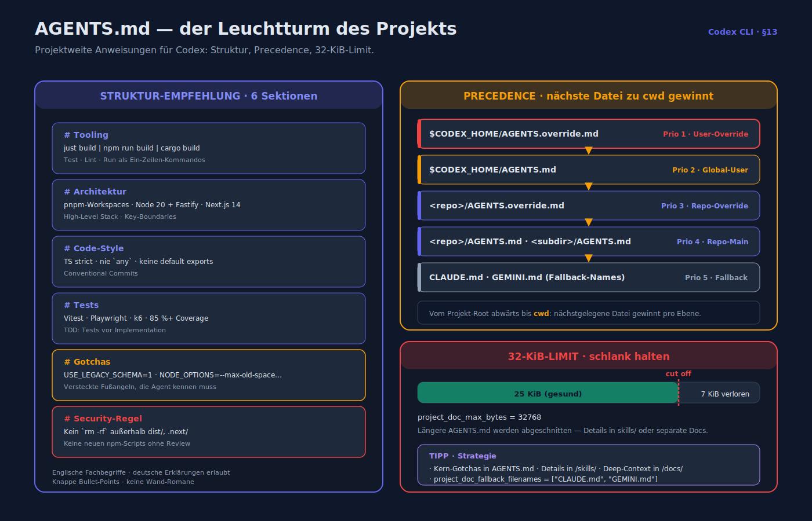

### 13.1 Struktur-Empfehlung

```markdown
# <Projektname>

## Tooling
- Build: `just build` | `npm run build` | `cargo build`
- Test: `just test`
- Lint: `just lint`
- Run: `just dev`

## Architektur
- Monorepo via pnpm workspaces
- Backend: Node 20 + Fastify + Postgres
- Frontend: Next.js 14 (App Router)
- Infra: AWS CDK (v2)

## Code-Style
- TypeScript strict
- ESLint: nie `any`, nie `eslint-disable`
- React-Komponenten: function-based, keine default exports
- Commit-Convention: Conventional Commits

## Tests
- Unit: Vitest · Integration: Playwright · Load: k6
- Deckungsgrad: 85 %+ für Kernmodule
- Tests werden **vor** der Implementation geschrieben (TDD)

## Gotchas
- Env-Flag `USE_LEGACY_SCHEMA=1` triggert die alte Datenbank-Migration.
- `pnpm install` schlägt ohne `NODE_OPTIONS=--max-old-space-size=4096` fehl.

## Security-Regel für Agenten
- Führe niemals `rm -rf` außerhalb von `dist/` oder `.next/` aus.
- Erzeuge keine neuen npm-Scripts ohne Review.
```

### 13.2 Precedence

1. `$CODEX_HOME/AGENTS.override.md` > `$CODEX_HOME/AGENTS.md`
2. Vom Project-Root abwärts bis zum `cwd` jeweils:
   - `AGENTS.override.md`
   - `AGENTS.md`
   - Fallback-Namen aus `project_doc_fallback_filenames` (z. B. `CLAUDE.md`)
3. **Nächstgelegene** Datei zum `cwd` gewinnt.

### 13.3 Max. Größe

`project_doc_max_bytes` = 32 KiB (Default). Längere Files werden abgeschnitten — AGENTS.md schlank halten, Details in Skill-Dateien auslagern.

## 14. Custom Prompts & Skills

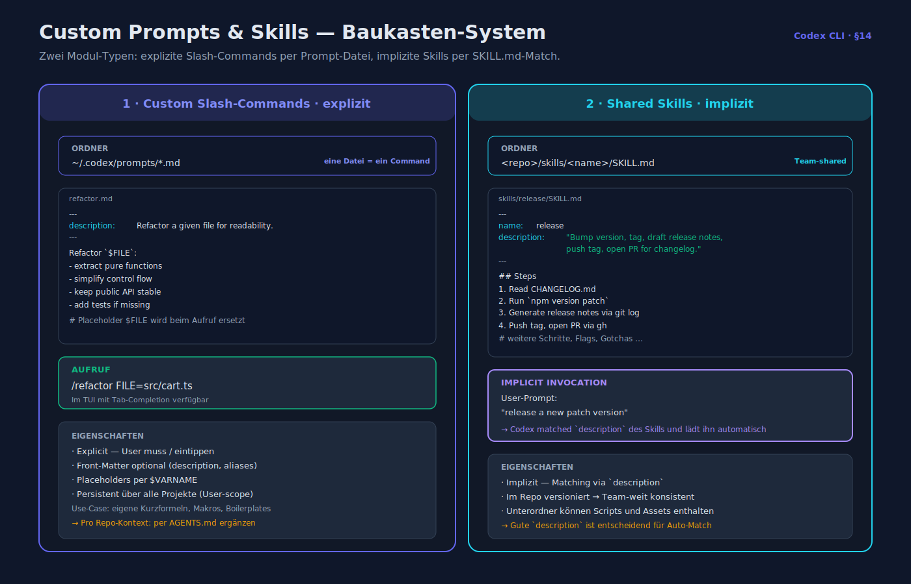

### 14.1 Custom Slash-Commands

Dateien in `~/.codex/prompts/*.md` werden Slash-Commands:

```markdown
---
description: Refactor a given file for readability.
---
Refactor `$FILE`:
- extract pure functions
- simplify control flow
- keep public API stable
- add tests if missing
```

Aufruf: `/refactor FILE=src/cart.ts`.

### 14.2 Shared Skills

Skill-Verzeichnis im Repo (z. B. `skills/release/SKILL.md`), ausgewählt automatisch, wenn der Task zur `description` passt. Siehe [`feature_uebersicht.md`](feature_uebersicht.md) §6.2.

## 15. Logging & Debugging

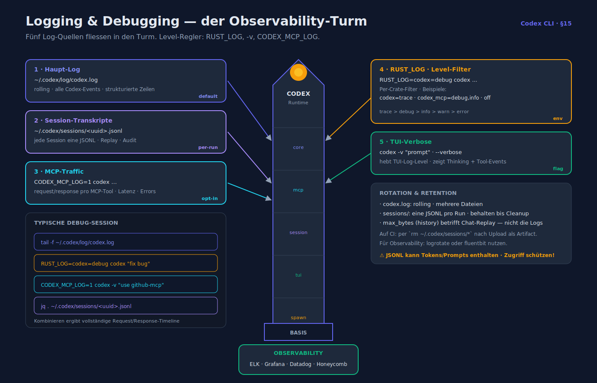

- **Codex Log**: `~/.codex/log/codex.log` (rolling).
- **Sessions**: `~/.codex/sessions/<uuid>.jsonl`.
- **RUST_LOG**: `RUST_LOG=codex=debug codex ...` für detaillierte Traces.
- **`-v` / `--verbose`** hebt das TUI-Log-Level.
- **MCP-Debug**: `CODEX_MCP_LOG=1 codex ...` (falls gesetzt, Info in Discussions-Thread #2150).

## 16. Full Sample `config.toml`

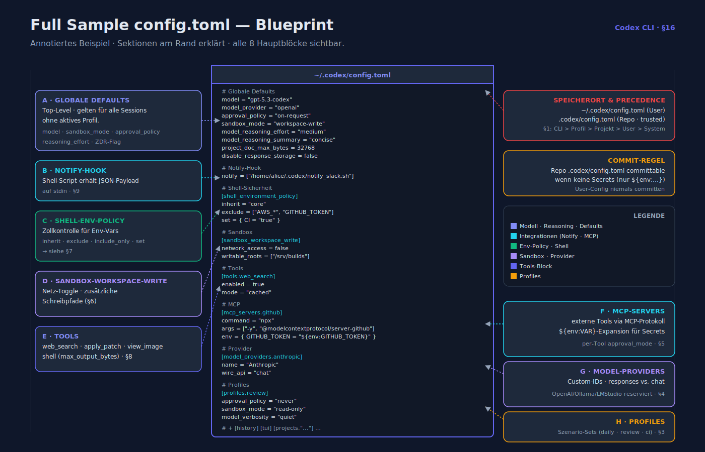

```toml
# Globale Defaults
model                   = "gpt-5.3-codex"
model_provider          = "openai"
approval_policy         = "on-request"
sandbox_mode            = "workspace-write"
model_reasoning_effort  = "medium"
model_reasoning_summary = "concise"
project_doc_max_bytes   = 32768
disable_response_storage = false

notify = ["/home/alice/.codex/notify_slack.sh"]

# Shell-Sicherheit
[shell_environment_policy]
inherit = "core"
exclude = ["AWS_*", "GITHUB_TOKEN"]
set     = { CI = "true" }

# Sandbox
[sandbox_workspace_write]
network_access = false
writable_roots = ["/srv/builds"]

# Tools
[tools.web_search]
enabled = true
mode    = "cached"

# MCP
[mcp_servers.github]
command = "npx"
args    = ["-y", "@modelcontextprotocol/server-github"]
env     = { GITHUB_TOKEN = "${env:GITHUB_TOKEN}" }

[mcp_servers.playwright]
command = "npx"
args    = ["@playwright/mcp@latest"]

# Provider
[model_providers.anthropic]
name     = "Anthropic"
base_url = "https://api.anthropic.com/v1"
env_key  = "ANTHROPIC_API_KEY"
wire_api = "chat"

# Profiles
[profiles.daily]
model = "gpt-5.3-codex"

[profiles.review]
approval_policy = "never"
sandbox_mode    = "read-only"
model_verbosity = "quiet"

[profiles.local]
model           = "llama-3.3-70b"
model_provider  = "ollama"

# Projects
[projects."/home/alice/work/app"]
trust_level = "trusted"

# History & TUI
[history]
persistence = "save-all"
max_bytes   = 10_485_760

[tui]
theme = "dark"
mouse = true
```

---

**Verwandte Dokumente**

- [installation_und_setup.md](installation_und_setup.md)
- [sicherheit_und_sandboxing.md](sicherheit_und_sandboxing.md)
- [integrationen_ide_ci_cd.md](integrationen_ide_ci_cd.md)
- [feature_uebersicht.md](feature_uebersicht.md)
- [_quellen.md](_quellen.md)
