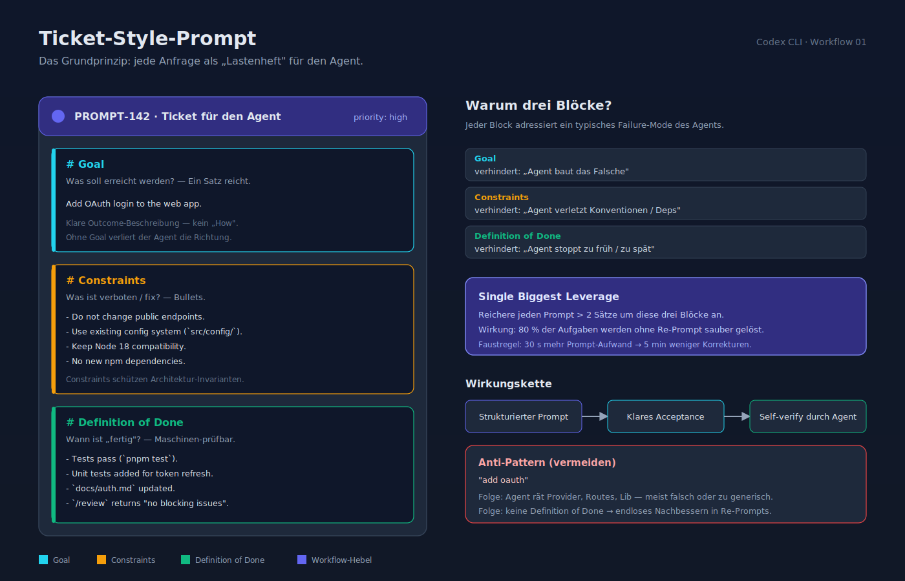
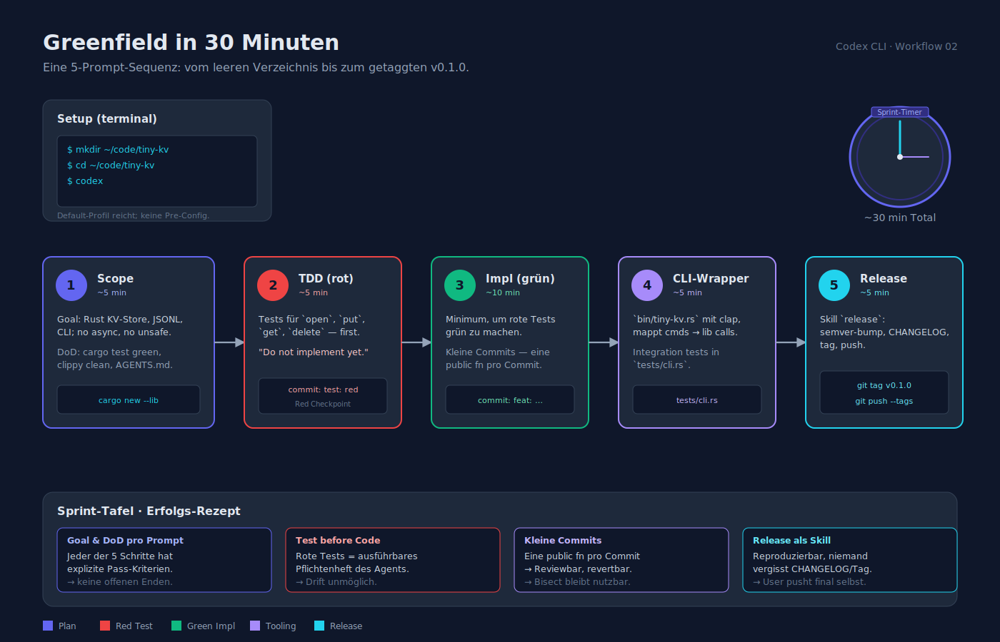
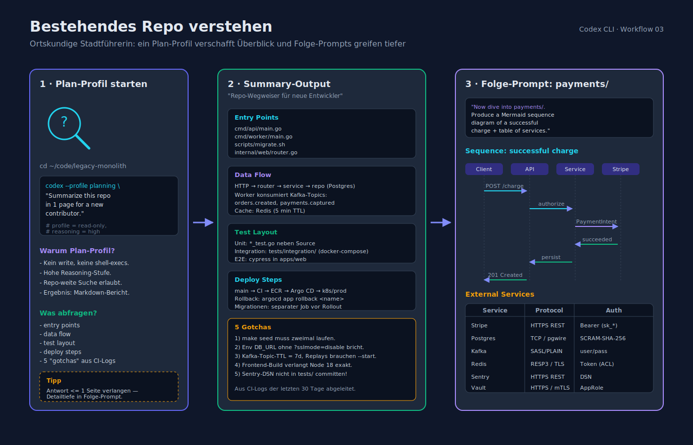
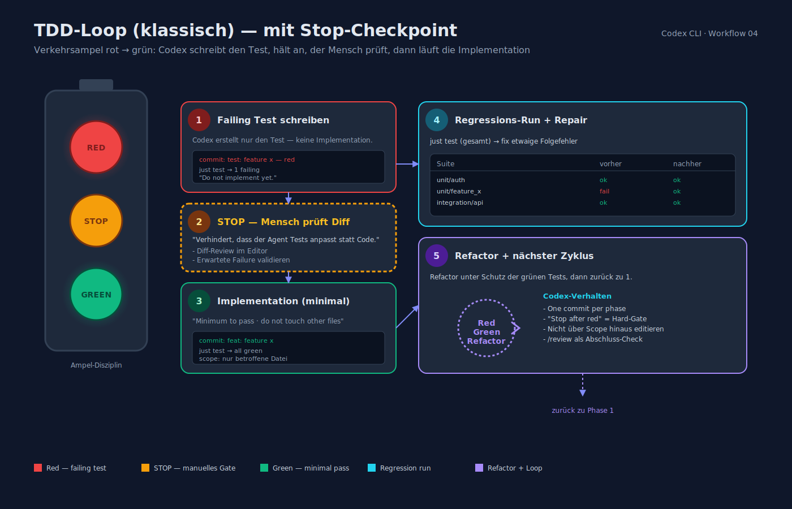
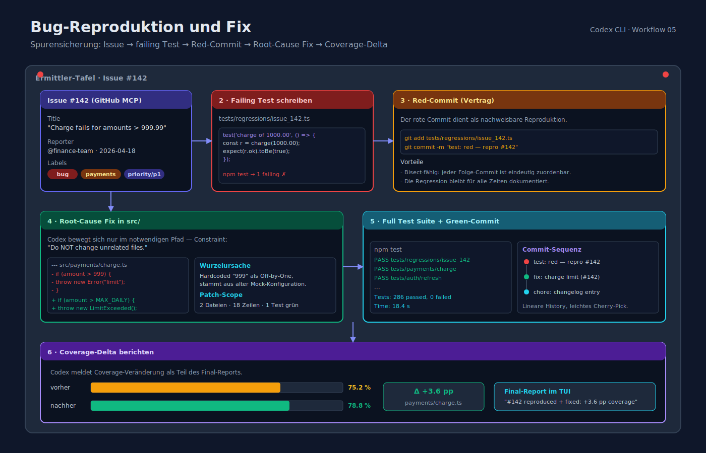
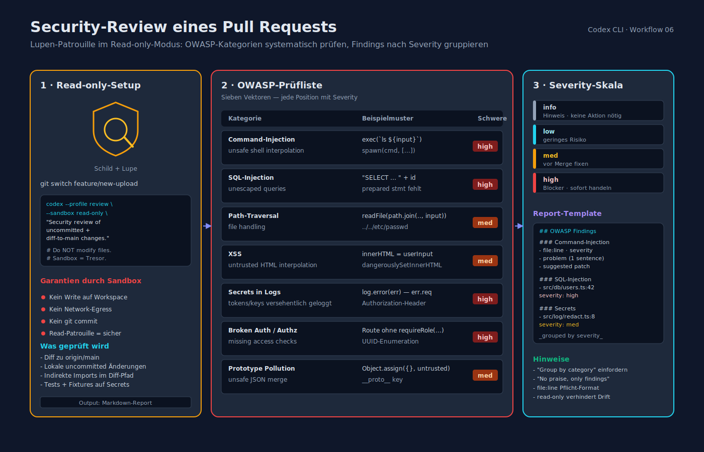
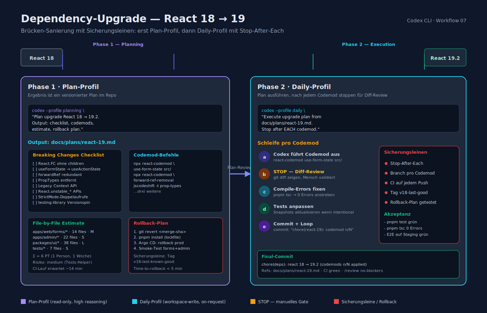
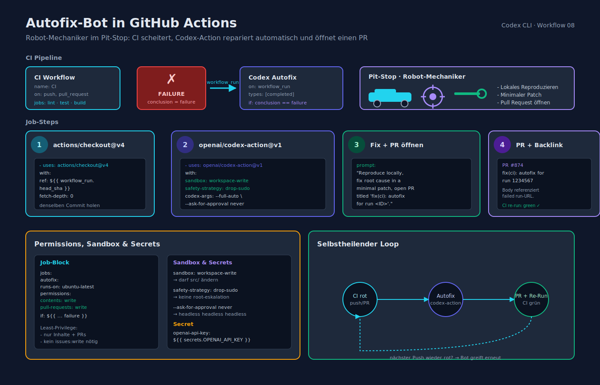
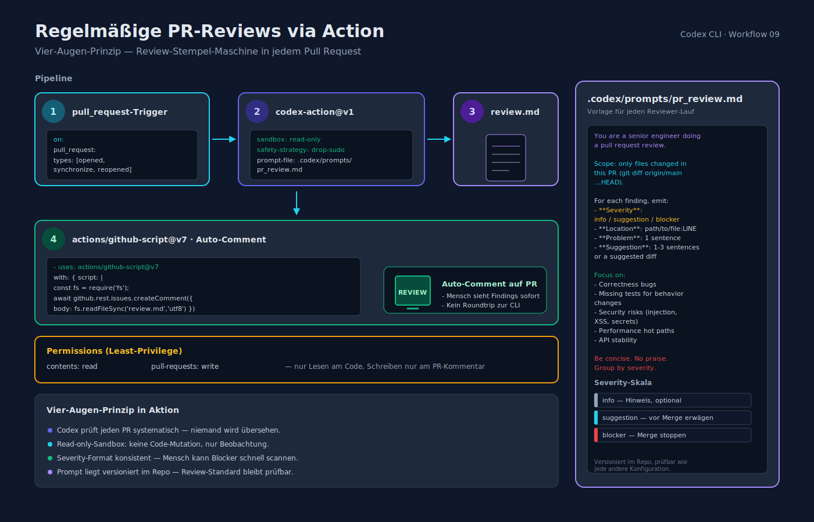

# Codex CLI — Praktische End-to-End-Workflows

> Stand: 2026-04-16

Dieses Dokument enthält **konkrete Rezepte** für häufige Entwicklungs-Situationen. Jedes Rezept ist so formuliert, dass Du es mit Copy-Paste (nach kleinen Anpassungen) direkt laufen lassen kannst.

Alle Beispiele gehen von `~/.codex/config.toml` mit Default-`gpt-5.3-codex` aus. Profile (`daily`, `planning`, `review`, `ci`) wie in [`konfiguration_und_anpassung.md`](konfiguration_und_anpassung.md) §3 empfohlen.

---

## 1. Ticket-Style-Prompt (das Grundprinzip)



**Format** (wirkt für 80 % aller Aufgaben):

```
# Goal
Add OAuth login to the web app.

# Constraints
- Do not change public endpoints.
- Use existing config system (`src/config/`).
- Keep Node 18 compatibility.
- No new npm dependencies.

# Definition of Done
- Tests pass (`pnpm test`).
- Unit tests added for token refresh.
- `docs/auth.md` updated.
- `/review` returns "no blocking issues".
```

Reichere jeden Prompt, der länger als 2 Sätze ist, um diese drei Blöcke an. Das ist der Single-Biggest-Leverage für Codex-Qualität.

---

## 2. Greenfield-Projekt in 30 Minuten



```bash
mkdir ~/code/tiny-kv && cd ~/code/tiny-kv
codex
```

Prompt 1 — Scope:

> *"Goal: small key-value store in Rust, persisted to JSONL, usable as CLI. Constraints: stable library, no async runtime, zero unsafe. Definition of Done: `cargo test` green, `cargo clippy -- -D warnings` clean, README + AGENTS.md populated. Start by laying out `cargo new --lib`, then generate AGENTS.md."*

Prompt 2 — TDD:

> *"Write `kv_store::open`, `put`, `get`, `delete` tests first. Commit as `test: red`. Do not implement yet."*

Prompt 3 — Implementation:

> *"Implement `kv_store` to make the red tests green. Keep commits small (one public fn per commit)."*

Prompt 4 — CLI-Wrapper:

> *"Add a thin `bin/tiny-kv.rs` using `clap`, mapping commands to library calls. Add integration tests in `tests/cli.rs`."*

Prompt 5 — Release:

> *"Run the release skill: semver-bump minor, write CHANGELOG, tag v0.1.0, push."*

---

## 3. Bestehendes Repo verstehen



```bash
cd ~/code/legacy-monolith
codex --profile planning "Summarize this repository in 1 page for a new contributor. Include: entry points, data flow, test layout, deploy steps, and any pitfalls you can find in CI logs. End with 5 'gotchas' you think a new dev would trip over."
```

Folge-Prompt für einen spezifischen Bereich:

> *"Now dive into the `payments/` module. Produce a Mermaid sequence diagram of a successful charge, and a table of external services touched (name, protocol, auth method)."*

---

## 4. TDD-Loop (klassisch)



```bash
codex --profile daily
```

```
1) Write a failing test for the behavior described below. Commit as `test: …`.
2) STOP. I will inspect the diff.
```

Nach Review:

```
Now implement the minimum to pass the new test. Do not touch other files.
Commit as `feat: …`. Then run `just test` and fix any regressions.
```

**Warum explizit stoppen?** Du willst Kontrolle über den roten Checkpoint, bevor Codex weiterläuft. Das verhindert, dass der Agent "Tests anpasst" statt Produktionscode.

---

## 5. Bug-Reproduktion und Fix



```bash
codex "Reproduce issue #142 (see below). Steps:
1. Read the issue via the GitHub MCP.
2. Write a failing test that captures the exact behavior (tests/regressions/issue_142.ts).
3. Commit the red test.
4. Fix the root cause in src/.
5. Do NOT change unrelated files.
6. Run full test suite. Report coverage delta."
```

Voraussetzung: GitHub-MCP-Server aktiv. Siehe [`integrationen_ide_ci_cd.md`](integrationen_ide_ci_cd.md) §5.

---

## 6. Security-Review eines Pull Requests



```bash
git switch feature/new-upload
codex --profile review "Security review of the uncommitted + uncommitted-to-main changes.
Look for:
- command injection / unsafe shell interpolation
- SQL injection / unescaped queries
- path traversal in file handling
- XSS (untrusted HTML interpolation)
- secrets in logs or error messages
- broken auth / missing authz
- prototype pollution / unsafe JSON merge
Report by OWASP category with file:line references and a severity (info/low/med/high).
Do NOT modify files."
```

`--sandbox read-only` stellt sicher, dass nichts verändert wird.

---

## 7. Dependency-Upgrade (React 18 → 19)



```bash
codex --profile planning "Plan the upgrade from React 18 to 19.2 for this app. Output:
- Breaking-changes checklist relevant to our code
- Codemod commands
- File-by-file estimate
- Rollback plan"
```

Nach Plan-Review:

```bash
codex --profile daily "Execute the upgrade plan from docs/plans/react-19.md. Apply codemods, fix compile errors, adjust tests, run full suite. Stop after each codemod so I can inspect the diff."
```

---

## 8. Autofix-Bot in GitHub Actions



`.github/workflows/codex-autofix.yml`:

```yaml
name: Codex Autofix
on:
  workflow_run:
    workflows: ["CI"]
    types: [completed]

jobs:
  autofix:
    if: ${{ github.event.workflow_run.conclusion == 'failure' }}
    permissions:
      contents: write
      pull-requests: write
    runs-on: ubuntu-latest
    steps:
      - uses: actions/checkout@v4
        with:
          ref: ${{ github.event.workflow_run.head_sha }}
          fetch-depth: 0
      - uses: openai/codex-action@v1
        with:
          openai-api-key: ${{ secrets.OPENAI_API_KEY }}
          sandbox: workspace-write
          safety-strategy: drop-sudo
          prompt: |
            Run ${{ github.event.workflow_run.id }} failed. Reproduce locally,
            fix the root cause in a minimal, well-reviewed patch, and open a PR
            titled "fix(ci): autofix for run ${{ github.event.workflow_run.id }}".
            Reference the failing workflow in the PR body.
          codex-args: "--full-auto --model gpt-5.3-codex --ask-for-approval never"
```

---

## 9. Regelmäßige PR-Reviews via Action



```yaml
name: Codex PR Review
on:
  pull_request:
    types: [opened, synchronize, reopened]

jobs:
  review:
    permissions:
      contents: read
      pull-requests: write
    runs-on: ubuntu-latest
    steps:
      - uses: actions/checkout@v4
        with:
          fetch-depth: 0
      - uses: openai/codex-action@v1
        with:
          openai-api-key: ${{ secrets.OPENAI_API_KEY }}
          sandbox: read-only
          safety-strategy: drop-sudo
          prompt-file: .codex/prompts/pr_review.md
          codex-args: "--ask-for-approval never --model gpt-5.3-codex"
          output-file: review.md
      - uses: actions/github-script@v7
        with:
          script: |
            const fs = require('fs');
            await github.rest.issues.createComment({
              issue_number: context.issue.number,
              owner: context.repo.owner,
              repo: context.repo.repo,
              body: fs.readFileSync('review.md', 'utf8')
            });
```

`.codex/prompts/pr_review.md`:

```markdown
You are a senior engineer doing a pull request review.

Scope: only files changed in this PR (use `git diff origin/main...HEAD`).

For each finding, emit:
- **Severity**: info / suggestion / blocker
- **Location**: `path/to/file:LINE`
- **Problem**: 1 sentence
- **Suggestion**: 1–3 sentences or a suggested diff

Focus on:
- Correctness bugs
- Missing tests for behavior changes
- Security risks (injection, XSS, secrets)
- Performance hot paths
- API stability

Be concise. No praise. Group by severity.
```

---

## 10. Slack-Notifier mit Notify-Hook

`~/.codex/notify_slack.sh`:

```bash
#!/usr/bin/env bash
set -euo pipefail

PAYLOAD=$(cat)

STATUS=$(echo "$PAYLOAD" | jq -r .status)
TITLE=$(echo "$PAYLOAD" | jq -r .title)
SUMMARY=$(echo "$PAYLOAD" | jq -r .summary)

curl -sS -X POST "$SLACK_WEBHOOK_URL" \
  -H 'content-type: application/json' \
  -d "{\"text\": \"*[$STATUS]* $TITLE\n$SUMMARY\"}"
```

`~/.codex/config.toml`:

```toml
notify = ["/Users/alice/.codex/notify_slack.sh"]
```

`SLACK_WEBHOOK_URL` via Keychain/1Password-CLI in die Shell injizieren — nie plaintext committen.

---

## 11. Multi-Agent: Codex + Claude als Reviewer

1. Starte Codex als MCP-Server:

```bash
codex mcp serve --profile review
```

2. In Claude Code die Codex-Instanz als Tool registrieren (Claude-Side Config):

```json
{
  "mcpServers": {
    "codex-reviewer": {
      "type": "stdio",
      "command": "codex",
      "args": ["mcp", "serve", "--profile", "review"]
    }
  }
}
```

3. Aus Claude: *"Use the `codex-reviewer` MCP to get a second opinion on the last commit. Summarize its findings."*

Umgekehrt funktioniert das analog — `codex` im Repo, mit Claude als MCP-Server in `~/.codex/config.toml`.

---

## 12. Cloud-Task: Multi-Hour Refactor

```bash
codex cloud exec --env python-mig \
  --prompt-file docs/plans/python3-migration.md \
  --label "py3-migration-q2"
codex cloud list              # Progress
codex cloud logs <task-id>    # live log tail
codex cloud pull <task-id>    # Patch abrufen
```

**Best Practice**: Der Plan-Markdown-File liegt im Repo, wird im Prompt referenziert — damit überprüfbar und versioniert.

---

## 13. Repo-weiter Refactor (Rename der Public API)

```bash
codex --profile daily "
# Goal
Rename public API method `UserStore.findById` to `getUserById` across all usages.

# Constraints
- Keep a deprecated alias `findById` that calls `getUserById` and logs a deprecation warning.
- Update all call sites in `src/`.
- Update docs in `docs/`.
- Do NOT touch `tests/fixtures/` or generated files.

# Definition of Done
- Full test suite green.
- `git grep -n 'findById\\b'` shows only the alias and deprecation message.
- CHANGELOG entry in `Changed` section.
- `/review` returns no blocking issues.
"
```

---

## 14. Release-Skill (beispielhafte Skill-Struktur)

`skills/release/SKILL.md`:

```markdown
---
name: release
description: Bump version, generate changelog, tag and push a release.
---
# Release-Skill

Inputs:
- `$BUMP` — "patch" | "minor" | "major"

Steps:
1. Verify tree is clean (`git status --porcelain`).
2. Compute next version from the latest git tag + `$BUMP`.
3. Update version in `pyproject.toml` / `package.json` / `Cargo.toml` (whichever applies).
4. Run the test suite.
5. Append unreleased entries from `CHANGELOG.md` to a new version heading.
6. `git commit -am "chore(release): vX.Y.Z"`.
7. `git tag vX.Y.Z`.
8. Ask the user to `git push origin main --tags` (never push on behalf without explicit approval).
```

Aufruf: *"Run the release skill with `$BUMP=minor`."*

---

## 15. Hotfix-Workflow

```bash
git switch main
git pull
git switch -c hotfix/payments-oom
codex --ask-for-approval on-request --sandbox workspace-write "
# Goal
Fix the out-of-memory seen in service `payments` — Sentry event ID abc123.

# Constraints
- Minimal change. No refactor.
- Add a regression test.
- Do not touch unrelated services.

# Definition of Done
- Failing test reproduces the OOM in CI.
- Fix makes it green.
- PR body references the Sentry event.
"
```

---

## 16. Dokumentations-Sync

```bash
codex "
# Goal
Ensure README and docs/ reflect the current public API.

# Constraints
- Do not add new docs sections.
- Keep tone consistent with existing text.

# Definition of Done
- README has accurate install, quickstart, and config snippets.
- Any function signatures shown match `src/` exactly.
- CI doc-lint passes (`mkdocs build --strict` or equivalent).
"
```

---

## 17. Cost-/Token-Management

- **`/status`** zeigt Token-Verbrauch der Session.
- **`codex usage`** (falls aktiviert) fasst Tageswerte zusammen.
- In CI: `--model gpt-5.3-codex` (Standard) reicht für die meisten Autofix-Jobs; `gpt-5.4` nur für komplexe Planungen.
- **Reasoning-Effort "low"** wenn der Task offensichtlich ist (z. B. Code-Formatierung).
- `/compact` nach ~20 Turns reduziert Kontext-Kosten.

---

## 18. Lokale OSS-Modelle für Privacy

`~/.codex/config.toml`:

```toml
[profiles.local]
model          = "llama-3.3-70b-instruct"
model_provider = "ollama"
approval_policy = "on-request"
sandbox_mode    = "workspace-write"

[model_providers.ollama]
name     = "Ollama"
base_url = "http://localhost:11434/v1"
env_key  = "OLLAMA_API_KEY"
wire_api = "chat"
```

Start:

```bash
ollama serve &
ollama pull llama3.3:70b-instruct
codex --profile local
```

Geeignet für sensible Codebasen (Offline-Einsatz). Qualität reicht für lokale Edits, nicht immer für komplexe Refactorings.

---

**Verwandte Dokumente**

- [entwicklungs_lebenszyklus.md](entwicklungs_lebenszyklus.md)
- [cheat_sheet.md](cheat_sheet.md)
- [integrationen_ide_ci_cd.md](integrationen_ide_ci_cd.md)
- [sicherheit_und_sandboxing.md](sicherheit_und_sandboxing.md)
- [_quellen.md](_quellen.md)
