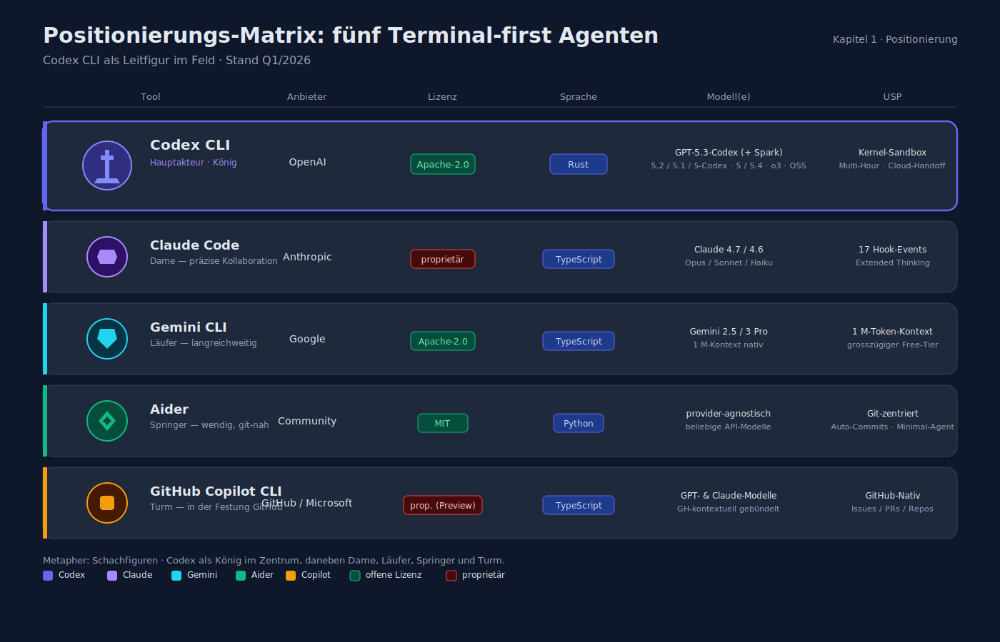
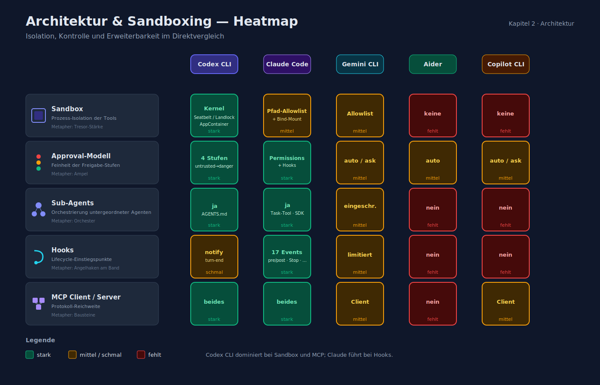
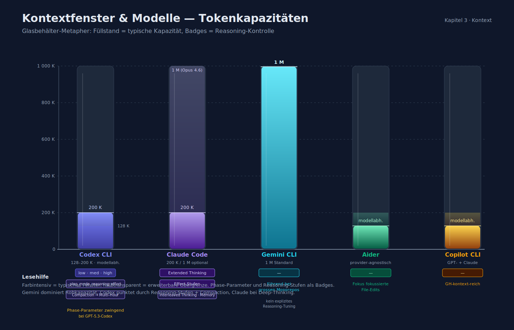
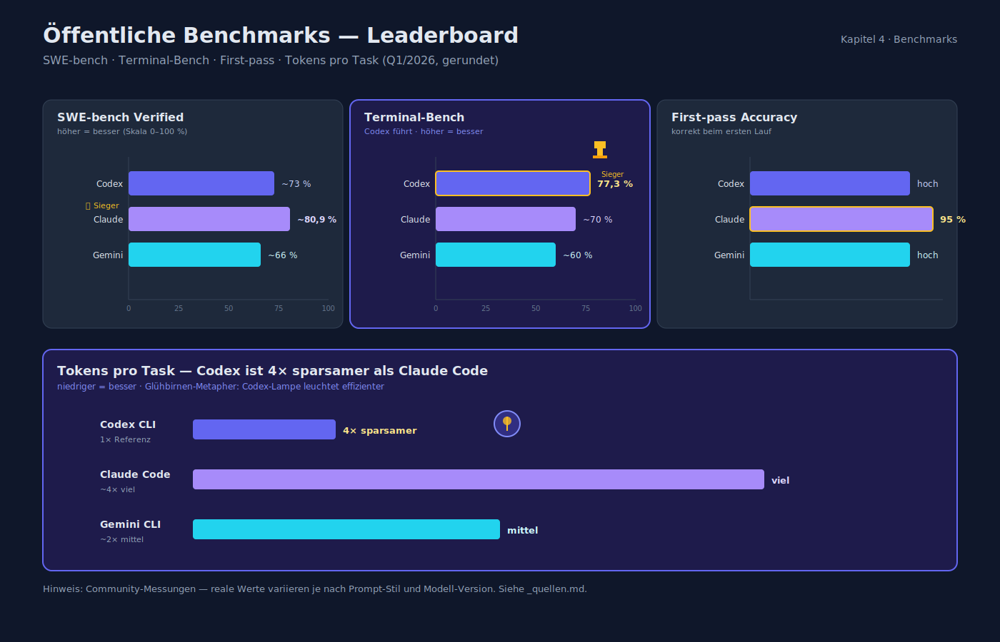
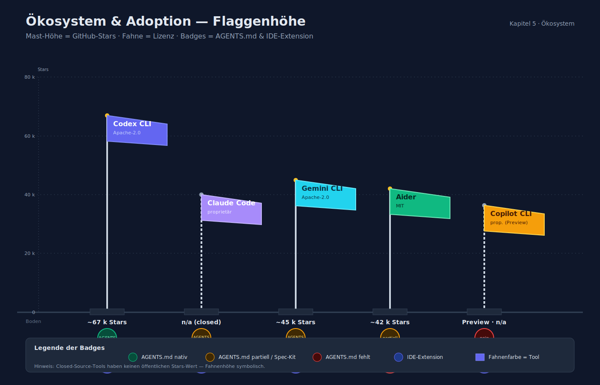
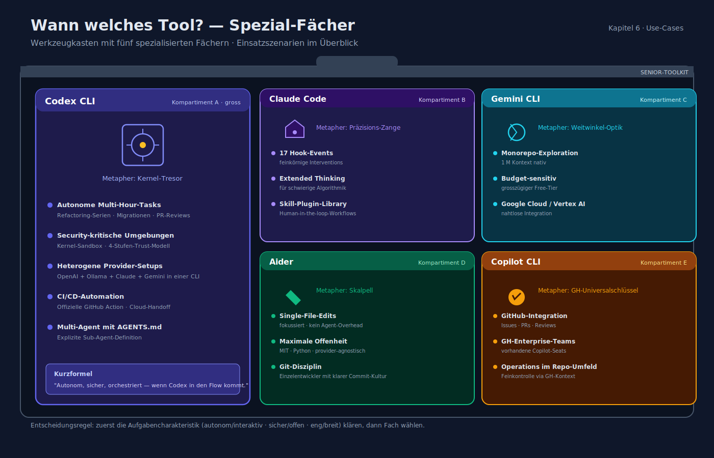
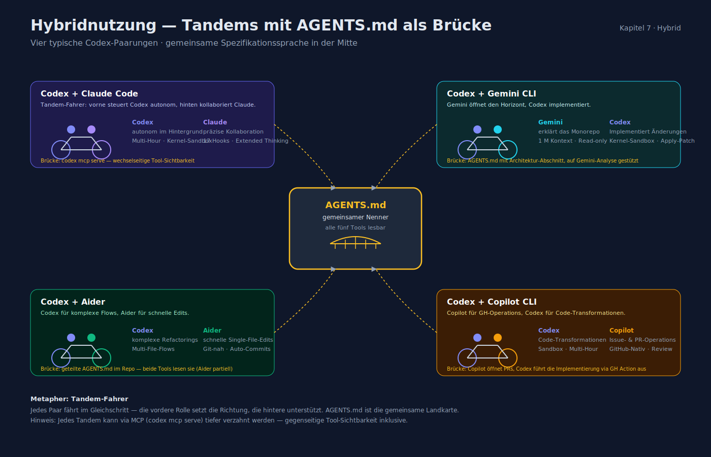

# Codex CLI — Vergleich zu Alternativen

> Stand: 2026-04-16 · Datenbasis: offizielle Docs + öffentliche Benchmark-/Adoption-Zahlen (Q1/2026)

Dieses Dokument ordnet Codex CLI im Feld der **Terminal-first Coding-Agenten** ein. Gegenspieler: Claude Code (Anthropic), Gemini CLI (Google), Aider (Community), GitHub Copilot CLI. Fokus ist **Entscheidungsunterstützung** — nicht Beliebtheitswettbewerb.

## 1. Positionierungs-Matrix



| Tool | Anbieter | Lizenz | Sprache | Modell(e) | USP |
|---|---|---|---|---|---|
| **Codex CLI** | OpenAI | Apache-2.0 | Rust | GPT-5.3-Codex (+ Spark), GPT-5.2/5.1/5-Codex, GPT-5/5.4, o3, OSS | Kernel-Sandbox, autonome Multi-Hour-Tasks, Cloud-Handoff |
| **Claude Code** | Anthropic | proprietär | TypeScript | Claude 4.7 / 4.6 (Opus/Sonnet/Haiku) | Tiefes Reasoning, 17 Hook-Events, präzise Kollaboration |
| **Gemini CLI** | Google | Apache-2.0 | TypeScript | Gemini 2.5/3 Pro | 1 M-Token-Kontext, großzügiger Free-Tier |
| **Aider** | Community | MIT | Python | provider-agnostisch | Git-zentriert, Auto-Commits, Minimal-Agent |
| **GitHub Copilot CLI** | GitHub/Microsoft | proprietär (Preview) | TypeScript | GPT- + Claude-Modelle | GitHub-Nativ (Issues/PRs/Repos) |

## 2. Architektur & Sandboxing



| Aspekt | Codex CLI | Claude Code | Gemini CLI | Aider | Copilot CLI |
|---|---|---|---|---|---|
| Sandbox | Kernel (Seatbelt/Landlock/AppContainer) | Pfad-Allowlist + Bind-Mount | Allowlist | keine | keine |
| Approval-Modell | 4 Stufen | Permissions + Hooks | auto/ask | auto | auto/ask |
| Sub-Agents | ja (AGENTS.md) | ja (Task-Tool, SDK) | eingeschränkt | nein | nein |
| Hooks | `notify` (turn-end) | 17 Events (pre/post-Tool, UserPromptSubmit, SessionStart, Stop, Notification, …) | limit. | nein | nein |
| MCP Client/Server | beides | beides | Client | nein | Client |

## 3. Kontextfenster & Modelle (typisch)



| Tool | Kontext | Reasoning-Tuning | Notizen |
|---|---|---|---|
| Codex CLI | 128 K–200 K (modellabhängig); Compaction bis Multi-Hour | `low/medium/high` + `plan_mode_reasoning_effort` | Phase-Parameter zwingend bei GPT-5.3-Codex |
| Claude Code | 200 K (1 M mit Opus 4.6) | Extended Thinking + Effort | Interleaved thinking, Memory Tool |
| Gemini CLI | 1 M Standard | – | führend bei großen Monorepos |
| Aider | modellabhängig | – | Fokus auf fokussierte File-Edits |
| Copilot CLI | modellabhängig | – | GH-kontext-reich |

## 4. Öffentliche Benchmarks (gerundet)



| Benchmark | Codex CLI | Claude Code | Gemini CLI |
|---|---|---|---|
| SWE-bench Verified | ~73 % | ~80,9 % | ~66 % |
| Terminal-Bench | **77,3 %** | ~70 % | ~60 % |
| First-pass Accuracy | hoch | **95 %** | hoch |
| Tokens pro Task | **4× sparsamer als Claude Code** | viel | mittel |

(Zahlen basieren auf Community-Messungen Q1/2026, siehe Quellen in `_quellen.md`.)

## 5. Ökosystem & Adoption



| Metrik | Codex | Claude Code | Gemini CLI | Aider |
|---|---|---|---|---|
| GitHub-Stars | ~67 k | n/a (closed) | ~45 k | ~42 k |
| Lizenz | Apache-2.0 | proprietär | Apache-2.0 | MIT |
| AGENTS.md-Support | nativ | über Spec-Kit | über Spec-Kit | partiell |
| IDE-Extension | VS Code/Cursor/Windsurf/JetBrains | VS Code + Claude Desktop | VS Code | nein (CLI-only) |

## 6. Wann welches Tool?



### Codex CLI passt am besten bei …

- **Autonomen, lang laufenden Tasks** (Refactoring-Serien, Migrationen, automatisches PR-Review).
- **Security-kritischen Umgebungen** (Kernel-Sandbox, Trust-Modell).
- **Heterogenen Provider-Setups** (eine CLI für OpenAI + Ollama + Claude + Gemini).
- **CI/CD-Automation** mit der offiziellen GitHub Action und Cloud-Handoff.
- **Multi-Agent** mit expliziter Sub-Agent-Definition in AGENTS.md.

### Claude Code ist besser bei …

- **Feinkörniger, kontrollierter Kollaboration** (17 Hook-Events für exakte Interventions).
- **Extended Thinking** für schwierige Logik/Algorithmik.
- **Skill-System** mit tief integrierter Plugin-Library.
- Workflows, bei denen Menschen kontinuierlich im Loop sind.

### Gemini CLI ist besser bei …

- **Monorepo-Exploration** (1 M Context nativ).
- **Budget-sensitiven Projekten** (großzügiger Free-Tier).
- Integration mit Google Cloud / Vertex AI.

### Aider ist besser bei …

- **Fokussierten Single-File-Edits** ohne Agent-Overhead.
- **Maximaler Offenheit** (MIT, Python, provider-agnostisch).
- Git-orientierten Einzelentwicklern mit klarer Commit-Disziplin.

### Copilot CLI ist besser bei …

- **Tiefer GitHub-Integration** (Issue/PR/Review-Workflows).
- Teams, die ohnehin bei GitHub Enterprise sind und Copilot-Seats haben.

## 7. Hybridnutzung — die typischen Kombinationen



- **Codex + Claude Code**: Codex autonom im Hintergrund, Claude für präzise Kollaboration; via `codex mcp serve` gegenseitig als Tool sichtbar.
- **Codex + Aider**: Codex für komplexe Flows, Aider für schnelle Edits; teilen sich AGENTS.md.
- **Codex + Gemini**: Gemini für "erklär mir das Monorepo", Codex für die Implementation.
- **Codex + Copilot CLI**: Copilot für GH-Operations, Codex für Code-Transformationen.

AGENTS.md ist der **gemeinsame Nenner** — alle fünf Tools können sie lesen (Aider partiell, siehe Versionshinweis).

## 8. Entscheidungs-Flowchart (kompakt)

```text
Brauchst Du Kernel-Sandbox & autonome Multi-Hour-Tasks?
 ├── ja ──► Codex CLI
 └── nein ──► Brauchst Du 1 M Kontext ohne Aufpreis?
              ├── ja ──► Gemini CLI
              └── nein ──► Brauchst Du 17 Hook-Events / Extended Thinking?
                           ├── ja ──► Claude Code
                           └── nein ──► Brauchst Du Minimalismus + MIT + Python?
                                        ├── ja ──► Aider
                                        └── nein ──► Bist Du GitHub-Nativ?
                                                     └── ja ──► Copilot CLI
```

## 9. Migrationspfade

### Von Aider zu Codex CLI

- `.aider.conf.yml` → Äquivalente in `~/.codex/config.toml` mappen (model/provider).
- `.aider/CONVENTIONS.md` → `AGENTS.md`.
- Auto-Commit-Diszplin: in AGENTS.md festlegen, dass Codex Commits pro Turn macht.

### Von Claude Code zu Codex CLI

- `.claude/settings.json` → `~/.codex/config.toml` (Approvals, MCP-Server).
- Hooks — Codex hat nur `notify`; die restliche Logik via Wrapper-Skripts.
- `CLAUDE.md` → `AGENTS.md` (Codex liest via `project_doc_fallback_filenames` CLAUDE.md standardmäßig mit).

### Von Copilot CLI zu Codex CLI

- Installation parallel; Auth getrennt.
- Copilot-spezifische Slash-Commands durch AGENTS.md-Prompts / Skills ersetzen.

## 10. Risiken und offene Punkte (Codex CLI)

- **0.x-Schema**: breaking changes zwischen Minor-Versions möglich.
- **OAuth-Override durch `OPENAI_API_KEY`** (still) — in CI `CODEX_API_KEY` nutzen.
- **Auth-Token im File** (`auth.json`) — nicht OS-Keychain.
- **Cloud-Privacy**: ZDR nur für Enterprise/Edu garantiert; Plus/Pro nutzt Default-Policy.
- **Experimentelle Features** (Profile, rmcp-Client) können sich ändern.
- **Phase-Parameter** — bei direkter Nutzung der Responses-API ohne CLI leicht zu vergessen.

---

**Verwandte Dokumente**

- [installation_und_setup.md](installation_und_setup.md)
- [senior_developer_guide.md](senior_developer_guide.md)
- [feature_uebersicht.md](feature_uebersicht.md)
- [sicherheit_und_sandboxing.md](sicherheit_und_sandboxing.md)
- [_quellen.md](_quellen.md)
