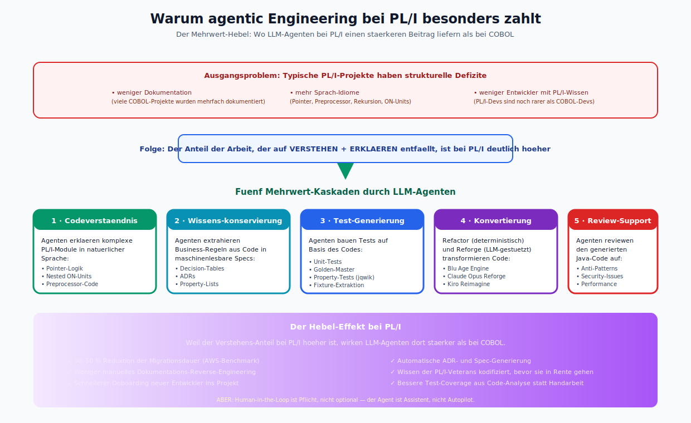
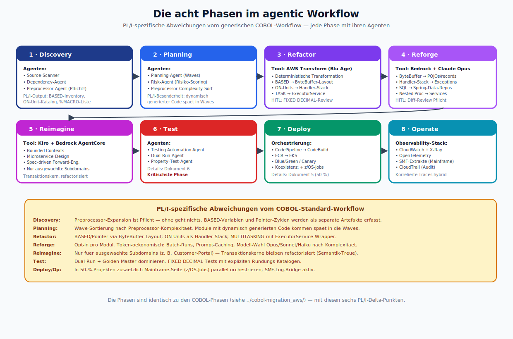
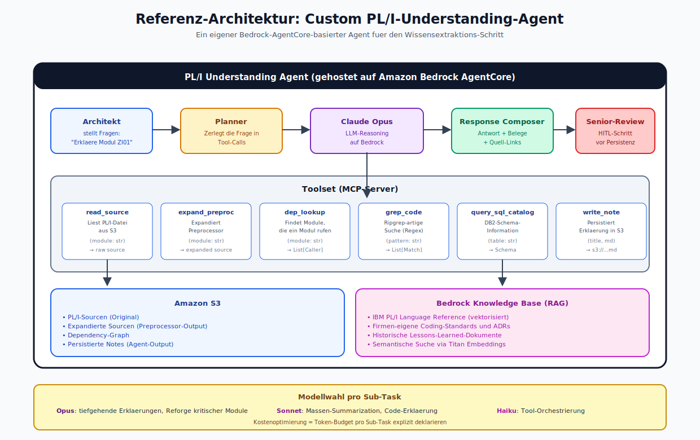
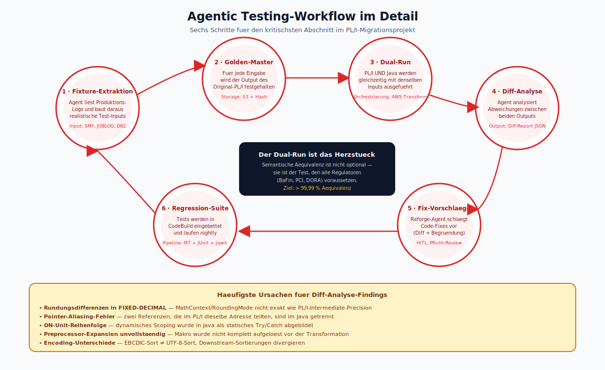
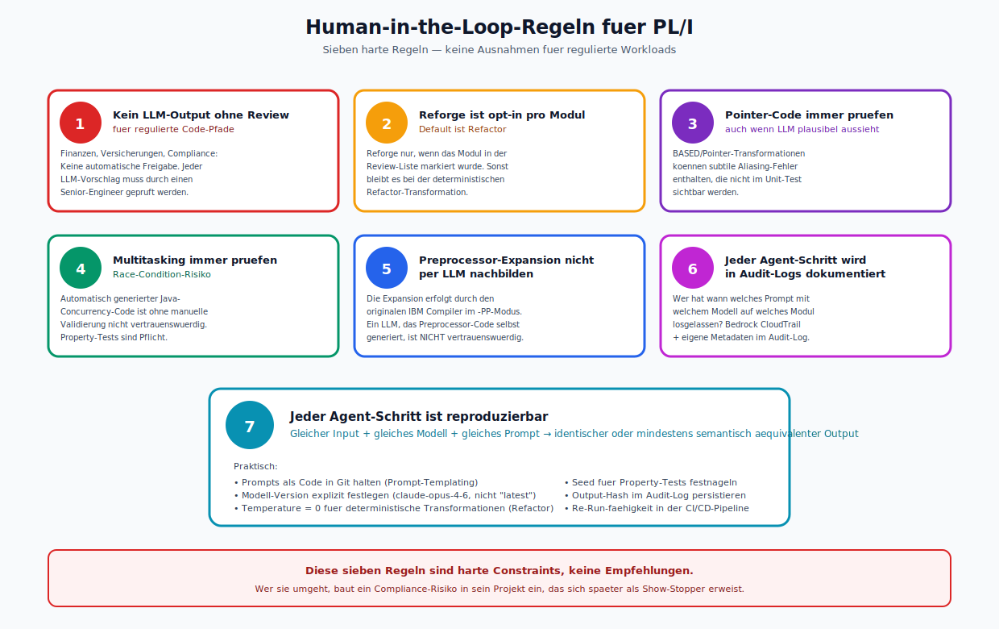
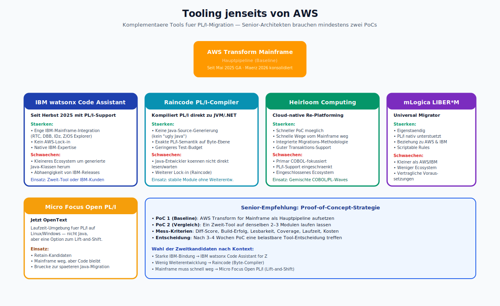
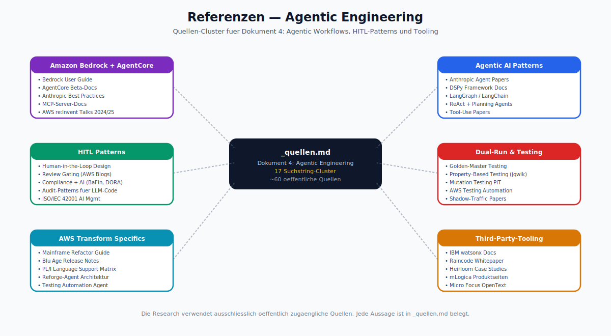

# Agentic-Engineering-Workflows für PL/I-Migration

> Dokument 4 der PL/I-zu-Java-Research | Stand: April 2026
>
> Dieses Dokument zeigt, wie die agentic-AI-Workflows aus AWS Transform, Amazon Q, Bedrock AgentCore und Kiro konkret für PL/I-Projekte eingesetzt werden — einschließlich der PL/I-Besonderheiten, die generische COBOL-Workflows nicht abdecken.

---

## 1. Warum agentic Engineering bei PL/I besonders zahlt



*Der Hebel-Effekt in einem Bild: Oben das Ausgangsproblem (weniger Doku, mehr Idiome, weniger Entwickler), in der Mitte die logische Folge (Verstehen dominiert), darunter die fuenf Mehrwert-Kaskaden und unten die messbaren Benefits. Zentrale Botschaft: LLM-Agenten wirken bei PL/I staerker als bei COBOL — gerade weil PL/I mehr Erklaerungsbedarf hat.*

PL/I-Projekte haben typisch:
- **weniger dokumentation** als COBOL-Projekte (die wurden über Jahrzehnte hinweg mehrfach dokumentiert),
- **mehr Sprach-Idiome** (Pointer, Preprocessor, Rekursion),
- **weniger verfügbare Entwickler** mit aktivem PL/I-Wissen.

Daraus folgt: der Anteil der Arbeit, der auf **Verstehen** und **Erklären** entfällt, ist bei PL/I deutlich höher als bei COBOL. Genau dort sind LLM-Agenten besonders stark.

Erwartbare Mehrwerte:
1. **Codeverständnis**: Agenten erklären komplexe PL/I-Module (Pointer-Logik, nested ON-Units, Präprozessor-Code) in natürlicher Sprache.
2. **Wissenskonservierung**: Agenten extrahieren Business-Regeln aus PL/I-Code in maschinenlesbare Spezifikationen.
3. **Automatisierte Test-Generierung**: Agenten bauen Golden-Master- und Property-Tests auf Basis des Codes.
4. **Konvertierung**: Refactor- und Reforge-Agenten transformieren Code deterministisch oder LLM-gestützt.
5. **Review-Support**: Agenten reviewen den generierten Java-Code auf Anti-Patterns.

---

## 2. Die acht Phasen im agentic Workflow



*Alle acht Phasen mit ihren Agenten als Karten, plus das gelb unterlegte PL/I-Delta — wo sich der Workflow vom generischen COBOL-Standard unterscheidet. Farbcodierung der Karten reflektiert die Rolle (Discovery blau, Refactor violett, Test rot, Deploy gruen …).*

Die acht Phasen sind identisch zu den COBOL-Phasen (siehe `../cobol-migration_aws/`). Hier die PL/I-spezifischen Abweichungen.

### 2.1 Discovery

**Ziel:** Das Projekt vollständig scannen und einen Dependency-Graphen erstellen.

**Agenten:**
- **Source-Scanner-Agent**: liest PL/I-Sourcen, Includes (%INCLUDE), JCL, DB2-DCLGENs, CICS-BMS-Maps, MQ-Definitionen.
- **Dependency-Agent**: baut den Graphen auf — besondere Herausforderung bei PL/I: **dynamische** Aufrufe über PROCEDURE-Pointer und FETCH/RELEASE von überladbaren Prozeduren.
- **Preprocessor-Agent**: führt die %-Expansion durch — entweder via originalem Compiler oder via Nachbildung. **Pflicht** für PL/I.

**PL/I-spezifischer Output:**
- Liste aller `BASED`-Variablen und deren Pointer-Lebenszyklen.
- Inventur aller `ON`-Units je Prozedur.
- Liste aller CICS- und SQL-Statements.
- Preprocessor-Makro-Katalog (welches Makro expandiert zu welchem Code?).

### 2.2 Planning

**Ziel:** Die Wave-Planung.

**Agenten:**
- **Planning-Agent** (Default in AWS Transform) generiert Waves basierend auf Dependency-Graph und Komplexitäts-Metriken.
- **Risk-Agent** markiert besonders riskante Module: dichte Pointer-Arithmetik, MULTITASKING, komplexe ON-Units.

**PL/I-Besonderheit:** Das Planning muss explizit nach **Preprocessor-Komplexität** sortieren. Module mit stark dynamisch erzeugtem Code kommen **später** in den Wave-Plan, weil sie die höchste Fehlerrate bei automatischer Transformation haben.

### 2.3 Refactor (deterministisch)

**Ziel:** PL/I-Code strukturerhaltend nach Java transformieren.

**Tool:** AWS Transform for Mainframe Refactor (Blu Age Engine).

**Input:** Expandierter PL/I-Source + Metadaten + Dependency-Graph.

**Output:** Java-Klassen, die strukturell dem PL/I-Original entsprechen. BASED-Variablen werden per ByteBuffer-Layout abgebildet, ON-Units als expliziter Handler-Stack, MULTITASKING mit Standard-ExecutorService-Wrappern.

**Human-in-the-Loop:** Senior-Engineers reviewen insbesondere:
- FIXED-DECIMAL-Arithmetik-Ergebnisse
- Pointer-Mapping-Entscheidungen
- Multitasking-Patterns

### 2.4 Reforge (LLM-basiert)

**Ziel:** Den refactorten Java-Code idiomatischer machen.

**Tool:** Amazon Bedrock + Claude Opus/Sonnet als Reforge-Agent, gesteuert über AWS Transform.

**Typische Transformationen:**
- ByteBuffer-Layouts zu POJOs / records.
- Expliziter Handler-Stack zu echten Java-Exceptions (wenn Semantik erhalten bleibt).
- Nested procedures zu Service-Klassen.
- SQL-Statements zu Spring-Data-Repositories.

**Human-in-the-Loop (Pflicht):** Jeder Reforge-Output muss von einem Senior-Engineer gegen den Refactor-Output geprüft werden. Gleiches gilt für alle LLM-basierten Refactorings: **Diff-Review** im Pull-Request-Workflow.

**Token-Ökonomie:** Reforge ist der größte LLM-Kostenblock. Batch-Runs auf Modul-Ebene + Prompt-Caching sind entscheidend.

### 2.5 Reimagine

**Ziel:** Den Code auf bounded contexts aufteilen und Richtung Microservices denken.

**Tool:** Kiro (spec-driven) + Bedrock AgentCore.

**Für PL/I-Projekte** ist Reimagine oft **nicht für den gesamten Code** sinnvoll, sondern nur für ausgewählte Subdomains (z. B. Kundenverwaltung, Product-Catalog). Der transaktionale Kern (Policies, Accounts) bleibt refactorisiert — hier ist die Semantik-Treue wichtiger als die "Schönheit" des Codes.

### 2.6 Test

**Ziel:** Testabdeckung sicherstellen. (Details siehe Dokument 6.)

**Agenten:**
- **Testing Automation Agent** (AWS Transform) generiert Unit- und Integration-Tests.
- **Dual-Run-Agent** vergleicht die Ergebnisse der PL/I-Quelle mit dem neuen Java-Code bei identischen Eingaben.
- **Property-Test-Agent** generiert property-basierte Tests auf Basis der Business-Regeln.

### 2.7 Deploy

**Ziel:** Die neuen Java-Services ausrollen.

Orchestrierung über CodePipeline → CodeBuild → ECR → EKS. Bei Koexistenz (siehe Dokument 5) zusätzlich Mainframe-Seite über z/OS-Jobs.

### 2.8 Operate

**Ziel:** Betrieb.

Observability-Stack: CloudWatch + X-Ray + OpenTelemetry, korreliert mit Mainframe-Logs über SMF-Extrakte.

---

## 3. Referenz-Architektur: Custom PL/I-Understanding-Agent



*Die komplette Referenz-Architektur in einem Bild: Oben der Flow Architekt → Planner → Claude Opus → Response Composer → Senior-Review. Darunter das Toolset (6 MCP-Tools) und die Storage-Layer (S3 fuer Sourcen/Notes, Bedrock Knowledge Base fuer RAG). Unten der Modellwahl-Banner fuer Opus/Sonnet/Haiku.*

Für den Wissensextraktionsschritt (siehe Abschnitt 1) lohnt sich ein **eigener Agent auf Bedrock AgentCore**. Architektur:

```
           ┌────────────────────────────────────────────┐
           │            PL/I Understanding Agent        │
           │                                            │
           │   ┌────────────┐    ┌─────────────────┐   │
           │   │  Planner   │──▶ │   Claude Opus   │   │
           │   └────────────┘    └─────────────────┘   │
           │          │                  │             │
           │          ▼                  ▼             │
           │   ┌────────────────────────────────────┐  │
           │   │           Tools (MCP)              │  │
           │   ├────────────────────────────────────┤  │
           │   │ read_source    dep_lookup          │  │
           │   │ expand_preproc grep_code           │  │
           │   │ explain_dq3    query_sql_catalog   │  │
           │   └────────────────────────────────────┘  │
           │          │                  │             │
           │          ▼                  ▼             │
           │   ┌────────────┐    ┌─────────────────┐   │
           │   │     S3     │    │  Bedrock KB     │   │
           │   │ (Sourcen)  │    │ (Dokumentation) │   │
           │   └────────────┘    └─────────────────┘   │
           └────────────────────────────────────────────┘
```

**Toolset des Agents (MCP-Server):**

| Tool | Funktion |
|------|----------|
| `read_source(module)` | liest eine PL/I-Datei aus S3 |
| `expand_preproc(module)` | liefert expandierten Source |
| `dep_lookup(module)` | liefert alle Module, die das aufgerufene Modul nutzen |
| `grep_code(pattern)` | ripgrep-artige Suche über den Source-Korpus |
| `query_sql_catalog(table)` | zeigt DB2-Schema-Information |
| `explain_dq3(name)` | erklärt ein spezifisches DQ-Konstrukt (z. B. LABEL, WHEN) |
| `write_note(title, md)` | legt eine Erklärung als Artefakt in S3 ab |

Der Agent wird per **Human-In-the-Loop** orchestriert: ein Architekt stellt Fragen ("Erkläre mir den Zinsrechner in Modul ZI01"), der Agent schlägt die Antwort auf Basis des Codes vor, der Architekt reviewt.

**Modellwahl:**
- Claude Opus für tiefgehende Erklärungen und Reforge.
- Claude Sonnet für Massen-Verarbeitung und Summarization.
- Claude Haiku für billige Tool-Orchestrierung (kleine sub-tasks).

---

## 4. Agentic Testing-Workflow im Detail



*Sechs-stufiger Kreislauf von Fixture-Extraktion bis Regression-Suite, mit dem Dual-Run im Zentrum als Herzstueck. Der gelbe Banner unten zaehlt die fuenf haeufigsten Diff-Ursachen auf — FIXED-DECIMAL, Pointer-Aliasing, ON-Unit-Reihenfolge, unvollstaendige Preprocessor-Expansion, Encoding-Unterschiede.*

Der Test-Workflow ist der kritischste Schritt im PL/I-Kontext. Aufbau:

1. **Test-Fixture-Extraktion**: Der Agent liest Produktions-Logs und baut daraus realistische Test-Eingaben.
2. **Golden-Master-Aufnahme**: Für jede Eingabe wird der Output des Original-PL/I-Codes festgehalten.
3. **Dual-Run**: Für jede Eingabe wird sowohl das Original als auch der generierte Java-Code ausgeführt, die Outputs werden verglichen.
4. **Diff-Analyse**: Der Agent analysiert Abweichungen. Häufigste Ursachen:
   - Rundungsdifferenzen in FIXED-DECIMAL
   - Pointer-Aliasing-Fehler
   - ON-Unit-Reihenfolge
   - Preprocessor-Expansion unvollständig
5. **Fix-Vorschläge**: Der Reforge-Agent schlägt Code-Fixes vor.
6. **Regression-Suite**: Die Tests werden in CodeBuild eingebettet.

---

## 5. Human-in-the-Loop-Regeln für PL/I



*Sieben nummerierte Regeln als Karten, farbcodiert nach Thema (regulierte Pfade rot, Reforge gelb, Pointer violett, Multitasking gruen, Preprocessor blau, Audit pink, Reproduzierbarkeit cyan). Regel 7 ("Reproduzierbarkeit") ist breit gezogen, weil sie am meisten Detail braucht. Der rote Banner unten macht klar: harte Constraints, keine Empfehlungen.*

Harte Regeln für agentic Workflows bei PL/I:

1. **Kein LLM-Output ohne Review** für regulierte Code-Pfade (Finanzen, Versicherungen, Compliance).
2. **Reforge ist opt-in pro Modul.** Default ist Refactor (deterministisch). Reforge nur, wenn das Modul in der Review-Liste markiert wurde.
3. **Pointer-Code immer manuell prüfen.** Auch wenn die LLM-Transformation plausibel aussieht.
4. **Multitasking-Code immer manuell prüfen.** Race-Condition-Risiko.
5. **Preprocessor-Expansion wird nicht durch LLM nachgebildet**, sondern durch den originalen Compiler.
6. **Jeder Agent-Schritt wird in Audit-Logs dokumentiert** — Wer hat wann welches Prompt mit welchem Modell auf welches Modul losgelassen? (Bedrock CloudTrail, plus eigene Metadaten.)
7. **Jeder Agent-Schritt ist reproduzierbar** — gleicher Input, gleiches Modell, gleiche Prompts → idealerweise identischer oder mindestens semantisch äquivalenter Output.

---

## 6. Tooling jenseits von AWS



*Fuenf Alternativ-Tools mit Staerken und Schwaechen: IBM watsonx Code Assistant for Z, Raincode PL/I-Compiler, Heirloom, mLogica LIBER*M, Micro Focus Open PL/I. Oben als Referenz der Baseline-Tool "AWS Transform for Mainframe". Unten die Senior-Empfehlung zur PoC-Strategie mit zwei parallelen Tool-Piloten.*

Für PL/I gibt es weitere Tools, die komplementär zu AWS Transform eingesetzt werden können:

- **IBM watsonx Code Assistant for Z**: hat eigene PL/I-Unterstützung (seit Herbst 2025).
- **Heirloom Computing**: COBOL-fokussiert, PL/I teilweise.
- **Raincode PL/I-Compiler für .NET/JVM**: Transpiliert PL/I direkt zu JVM-Bytecode (ohne Java-Source).
- **Micro Focus Open PL/I** (jetzt OpenText): Laufzeitumgebung für PL/I auf Linux/Windows, nicht-Java, aber relevant für Lift-and-Shift-Szenarien.
- **mLogica LIBER*M Universal Migrator**: eigenständiger Migrator mit PL/I-Support.

Für Senior-Architekten lohnt ein Proof-of-Concept mit **mindestens zwei** Tools, um die Tool-Qualität für die eigene Codebasis zu messen. AWS Transform für die Hauptpipeline, ein Zweit-Tool (z. B. watsonx oder mLogica) als Referenz.

---

## 7. Referenzen



*Sechs Quellen-Cluster um `_quellen.md` herum: Amazon Bedrock + AgentCore, Agentic AI Patterns, HITL Patterns, Dual-Run &amp; Testing, AWS Transform Specifics, Third-Party-Tooling. Zusammen ~60 oeffentliche Quellen ueber 17 Suchstring-Gruppen.*

Siehe `_quellen.md`.
