# Erweiterter Lösungshorizont für PL/I-zu-Java-Migrationen

> Dokument 8 der PL/I-zu-Java-Research | Stand: April 2026
>
> Dieses Dokument ist ein bewusst bunter Strauß an Methoden, Ideen und Optionen, die Senior-Architekten in Betracht ziehen sollten — jenseits des Standard-AWS-Transform-Pfads.

---

## 1. Die sieben Rs im PL/I-Kontext

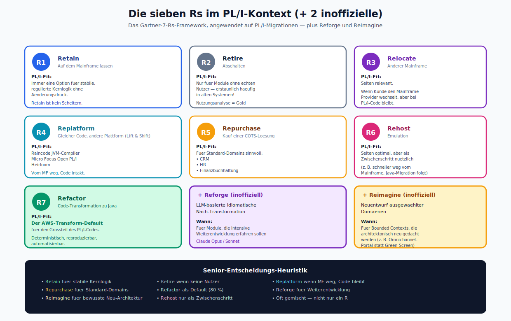

*Die sieben offiziellen Rs (Retain, Retire, Relocate, Replatform, Repurchase, Rehost, Refactor) als nummerierte Karten — plus die beiden inoffiziellen Erweiterungen Reforge (LLM-basiert) und Reimagine (spec-driven). Unten die Senior-Entscheidungs-Heuristik als Farbmatrix.*

Das bekannte 7-Rs-Framework (Gartner) ist auch für PL/I relevant, hat aber pro Option spezifische Bedeutungen.

| R | Bedeutung | PL/I-Fit |
|---|-----------|----------|
| **Retain** | Auf dem Mainframe lassen | Immer eine Option für stabile, regulierte Kernlogik ohne Änderungsdruck |
| **Retire** | Abschalten | Nur für Module ohne echten Nutzer — erstaunlich häufig in alten Systemen |
| **Relocate** | Auf anderen Mainframe verschieben | Selten relevant |
| **Replatform** | Gleicher Code, andere Plattform (Lift & Shift) | Raincode JVM-Compiler, Micro Focus Open PL/I, Heirloom |
| **Repurchase** | Kauf einer COTS-Lösung | Für Standard-Domänen (CRM, HR, Finanzbuchhaltung) sinnvoll |
| **Rehost** | Emulation auf neuer Plattform | Rarely optimal, aber als Zwischenschritt nützlich |
| **Refactor** | Code-Transformation zu Java | Der AWS-Transform-Default für PL/I |

Zusätzlich zwei "inoffizielle Rs":
- **Reforge** — LLM-basierte idiomatische Nach-Transformation.
- **Reimagine** — Neuentwurf ausgewählter Domänen (Kiro, Microservices).

### 1.1 Wann welche Option?

- **Retain:** Module, die stabil laufen, keine Wartung brauchen, und deren Plattform-Kosten akzeptabel sind.
- **Retire:** Ergebnis einer Nutzungsanalyse — wenn kein User auf ein Modul zugreift, raus damit.
- **Replatform (Raincode/Heirloom):** Wenn die Java-Übersetzung zu riskant ist, aber man vom Mainframe weg will.
- **Repurchase:** Wenn die PL/I-Lösung kein Differenzierungsmerkmal mehr ist (z. B. Standard-Buchhaltung).
- **Refactor:** Der Default für den Großteil des PL/I-Codes.
- **Reforge:** Für Module, die intensive Weiterentwicklung erfahren sollen.
- **Reimagine:** Für Bounded Contexts, die architektonisch neu gedacht werden (z. B. Omnichannel-Kundenportal statt Green-Screen).

---

## 2. Alternative Tool-Ökosysteme

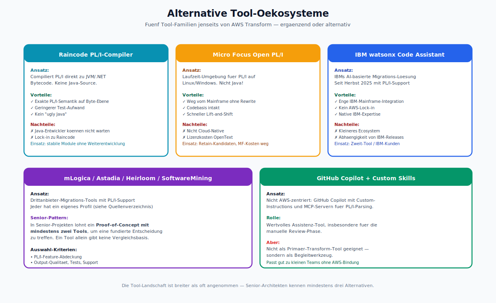

*Fuenf alternative Tool-Familien: Raincode (Byte-Compiler), Micro Focus Open PL/I (Lift-and-Shift), IBM watsonx (AI-gestuetzt), mLogica/Astadia/Heirloom (Drittanbieter), GitHub Copilot + Custom Skills. Jede mit Vorteilen und Nachteilen.*

### 2.1 Raincode PL/I-Compiler für JVM/.NET

Ein .NET/JVM-Compiler, der PL/I direkt zu Bytecode kompiliert. Vorteile:
- Keine Java-Source-Generierung, d. h. kein "ugly Java".
- Exakte PL/I-Semantik auf Byte-Ebene.
- Geringeres Testaufwand, weil der Compiler die Semantik garantiert.

Nachteile:
- Java-Entwickler können den Code nicht direkt lesen/warten.
- Weiterer Lock-in (auf Raincode).
- Nicht "Java" im Sinne idiomatischer Java-Entwicklung.

**Einsatz:** für Module, die stabil bleiben sollen und deren Weiterentwicklung minimal ist.

### 2.2 Micro Focus Open PL/I (OpenText)

Eine Laufzeit-Umgebung für PL/I auf Linux/Windows. Das ist nicht Java, aber eine Option, um vom Mainframe wegzukommen, ohne die Codebasis zu ändern.

**Einsatz:** für "Retain"-Kandidaten, bei denen der Mainframe aus Kostengründen weg soll, aber die Codebasis intakt bleibt.

### 2.3 IBM watsonx Code Assistant for Z

IBMs eigene AI-basierte Migrations-Lösung. Seit Herbst 2025 mit PL/I-Support. Vorteile:
- Enge Integration mit IBM-Mainframe-Tooling (RTC, DBB, IDz).
- Kein AWS-Lock-in.
- Native IBM-Expertise.

Nachteile:
- Weniger Ecosystem um die generierten Java-Klassen herum.
- Abhängigkeit von IBM-Releases.

**Einsatz:** als Zweit-Tool oder in Projekten mit starker IBM-Bindung.

### 2.4 mLogica, Astadia, Heirloom, SoftwareMining

Drittanbieter-Migrations-Tools, die PL/I unterstützen. Jeder hat ein eigenes Profil (siehe Quellenverzeichnis). In Senior-Projekten lohnt ein **Proof-of-Concept mit mindestens zwei Tools**, um eine fundierte Entscheidung zu treffen.

### 2.5 GitHub Copilot + Custom Skills

Nicht AWS-zentriert: GitHub Copilot mit Custom-Instructions und MCP-Servern für PL/I-Parsing kann ein wertvolles Assistenz-Tool sein, insbesondere für die manuelle Review-Phase. Nicht als Primär-Transform-Tool, sondern als Begleitwerkzeug.

---

## 3. Hybrid-Strategien

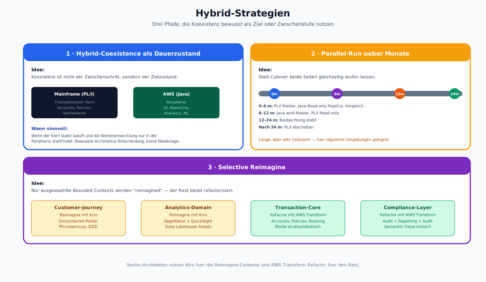

*Drei Patterns: Hybrid-Coexistence als Dauerzustand (Kern auf PL/I, Peripherie auf Java), Parallel-Run ueber Monate (mit Timeline 0–24m), Selective Reimagine (Kombination aus Reimagine- und Refactor-Regionen). Bewusste Architektur-Entscheidungen, keine Niederlagen.*

### 3.1 Hybrid-Coexistence als Dauerzustand

In manchen Fällen ist Koexistenz nicht der Zwischenschritt, sondern der **Zielzustand**. Bestimmte transaktionale Kerne bleiben auf PL/I (wo sie unverändert laufen), die Peripherie (UI, Reporting, Analytics) läuft auf Java/AWS. Das ist ein bewusstes Architektur-Entscheidung, nicht eine Niederlage.

### 3.2 Parallel-Run über Monate

Statt cutover beide Seiten gleichzeitig laufen lassen, die alte als "Source of Truth" und die neue als "Read-only Replica". Ergebnisse vergleichen. Nach X Monaten (typisch 6–12) Role-Swap: Java wird Master, PL/I wird Read-only. Nach weiteren X Monaten PL/I abschalten.

### 3.3 Selective Reimagine

Nur ausgewählte Bounded Contexts werden "reimagined" (z. B. die Customer-Journey), der Rest bleibt refactorisiert. Senior-Architekten nutzen Kiro für die Reimagine-Contexte und AWS Transform Refactor für den Rest.

---

## 4. Methodische Ideen

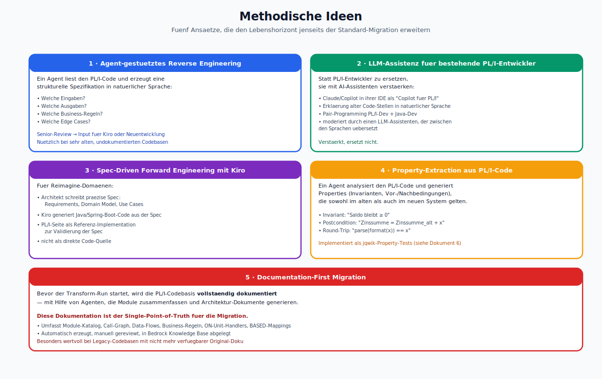

*Fuenf methodische Ansaetze: Agent-gestuetztes Reverse Engineering, LLM-Assistenz fuer PL/I-Entwickler, Spec-Driven Forward Engineering mit Kiro, Property-Extraction aus PL/I-Code, Documentation-First Migration.*

### 4.1 Agent-gestütztes Reverse Engineering

Ein Agent liest den PL/I-Code und erzeugt eine **strukturelle Spezifikation** in natürlicher Sprache:
- Welche Eingaben?
- Welche Ausgaben?
- Welche Business-Regeln?
- Welche Edge Cases?

Diese Spezifikation wird von Senior-Engineers reviewt und kann dann als Input für Kiro oder für eine manuelle Neuentwicklung dienen. Besonders nützlich, wenn der Code sehr alt und undokumentiert ist.

### 4.2 LLM-Assistenz für bestehende PL/I-Entwickler

Statt PL/I-Entwickler zu ersetzen, sie mit AI-Assistenten verstärken:
- Claude/Copilot in ihrer IDE als "Copilot für PL/I"
- Erklärung alter Code-Stellen in natürlicher Sprache
- Pair-Programming zwischen PL/I- und Java-Entwicklern, moderiert durch einen LLM-Assistenten, der zwischen den Sprachen übersetzt

### 4.3 Spec-Driven Forward Engineering mit Kiro

Für Reimagine-Domänen: der Architekt schreibt eine präzise Spezifikation (Requirements, Domain Model, Use Cases), Kiro generiert den Java/Spring-Boot-Code auf Basis dieser Spezifikation. Die PL/I-Seite wird als **Referenz-Implementation** genutzt, um die Spec zu validieren — nicht als direkte Code-Quelle.

### 4.4 Property-Extraction aus PL/I-Code

Ein Agent analysiert den PL/I-Code und generiert **Properties** (Invarianten, Vor- und Nachbedingungen), die sowohl im alten als auch im neuen System gelten müssen. Diese Properties werden als Property-Tests (jqwik) implementiert.

### 4.5 Documentation-First Migration

Bevor der Transform-Run startet, wird die PL/I-Codebasis **vollständig dokumentiert** — mit Hilfe von Agenten, die Module zusammenfassen und Architektur-Dokumente generieren. Diese Dokumentation ist der **Single-Point-of-Truth** für die Migration.

---

## 5. Team- und Organisations-Ideen

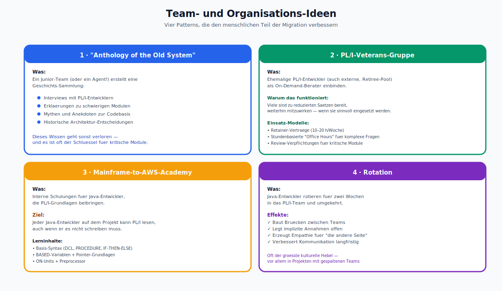

*Vier Patterns fuer den menschlichen Teil: Anthology of the Old System (Wissensarchiv), PL/I-Veterans-Gruppe (Retiree-Pool), Mainframe-to-AWS-Academy (Java-Devs lernen PL/I lesen), Rotation (zwei Wochen im anderen Team).*

### 5.1 "Anthology of the Old System"

Ein Junior-Team (oder ein Agent!) erstellt eine **Geschichts-Sammlung**: Interviews mit PL/I-Entwicklern, Erklärungen zu schwierigen Modulen, Mythen und Anekdoten zur Codebasis. Dieses Wissen geht sonst verloren.

### 5.2 PL/I-Veterans-Gruppe

Ehemalige PL/I-Entwickler (auch externe, Retiree-Pool) als On-Demand-Berater einbinden. Viele sind zu reduzierten Sätzen bereit, weiterhin mitzuwirken — wenn sie sinnvoll eingesetzt werden.

### 5.3 Mainframe-to-AWS-Academy

Interne Schulungen für Java-Entwickler, die PL/I-Grundlagen beibringen. Ziel: jeder Java-Developer auf dem Projekt kann PL/I **lesen**, auch wenn er es nicht schreiben muss.

### 5.4 Rotation

Java-Entwickler rotieren für zwei Wochen in das PL/I-Team und umgekehrt. Das baut Brücken und legt implizite Annahmen offen.

---

## 6. Außergewöhnliche technische Optionen

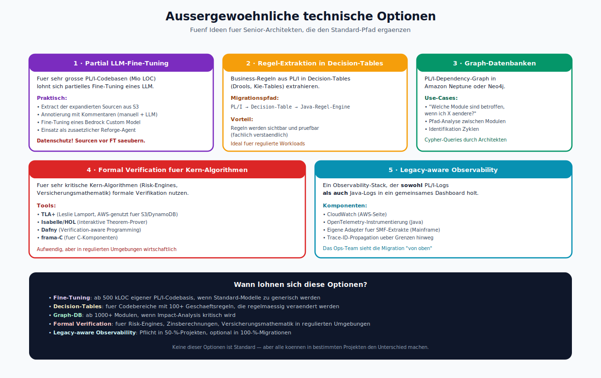

*Fuenf aussergewoehnliche Optionen: Partial LLM-Fine-Tuning (ab 500 kLOC), Regel-Extraktion in Decision-Tables (Drools), Graph-Datenbanken (Neptune/Neo4j), Formal Verification (TLA+, Dafny), Legacy-aware Observability. Unten eine Entscheidungs-Matrix mit "Wann lohnt sich was?".*

### 6.1 Partial LLM-Fine-Tuning

Für sehr große PL/I-Codebasen (Millionen LOC) lohnt sich ein **partielles Fine-Tuning** eines LLM auf dem unternehmens-spezifischen PL/I-Code. Das verbessert Erklärungs- und Reforge-Qualität erheblich.

Praktisch:
- Extract der expandierten Sourcen aus S3.
- Annotieren mit Kommentaren (teilweise automatisiert, teilweise manuell).
- Fine-Tuning eines Bedrock Custom Model (oder on-prem mit OSS-Modellen).
- Einsatz als zusätzlicher Reforge-Agent.

**Achtung:** Datenschutz. PL/I-Sourcen enthalten oft Kundennamen, Kontonummern, Geschäftsgeheimnisse. Fine-Tuning-Daten müssen vorher gesäubert werden.

### 6.2 Regel-Extraktion in Decision-Tables

Für Business-Regeln, die tief im PL/I-Code stecken (verschachtelte IFs, komplexe CASE-Statements), lohnt die Extraktion in **Decision-Tables** (z. B. Drools, Kie-Tables). Die Migration zu Java wird dadurch indirekt: erst PL/I → Decision-Table → Java-Regel-Engine.

Vorteil: Die Regeln werden **sichtbar**, können von Fachabteilungen geprüft und später angepasst werden, ohne dass Java-Entwickler involviert sind.

### 6.3 Graph-Datenbanken für Dependency-Analyse

Der PL/I-Dependency-Graph kann in einer Graph-Datenbank (Amazon Neptune, Neo4j) abgelegt werden. Architekten nutzen Graph-Queries, um Fragen wie "welche Module sind betroffen, wenn ich Modul X ändere" zu beantworten.

### 6.4 Formal Verification für Kern-Algorithmen

Für sehr kritische Kern-Algorithmen (z. B. Risk-Engines, Versicherungsmathematik) kann formale Verifikation sinnvoll sein. Tools: TLA+, Isabelle, Dafny, frama-C. Die Java-Implementierung wird gegen die formale Spezifikation geprüft. Das ist aufwendig, aber in regulierten Umgebungen durchaus wirtschaftlich.

### 6.5 Legacy-aware Observability

Ein Observability-Stack, der **sowohl** PL/I-Logs **als auch** Java-Logs in ein gemeinsames Dashboard holt (CloudWatch + OpenTelemetry + eigene Adapter für SMF-Extrakte). So sieht das Betriebsteam, wie die Migration **von oben** aussieht.

---

## 7. Budgetäre und finanzielle Ideen

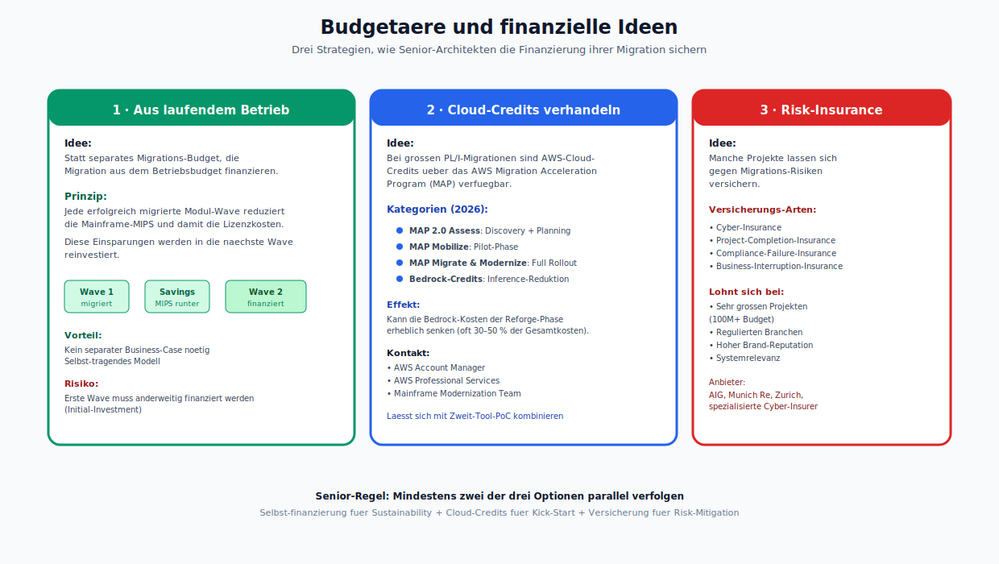

*Drei Strategien: Finanzierung aus laufendem Betrieb (MIPS-Ersparnis reinvestieren), Cloud-Credits ueber AWS MAP verhandeln, Risk-Insurance fuer sehr grosse Projekte. Unten die Senior-Regel: mindestens zwei parallel verfolgen.*

### 7.1 Migration aus laufendem Betrieb finanzieren

Statt ein separates Migrations-Budget aufzustellen, die Migration aus dem laufenden Betriebsbudget finanzieren: jede erfolgreich migrierte Modul-Wave reduziert die Mainframe-MIPS und damit die Lizenzkosten. Diese Einsparungen werden in die nächste Wave reinvestiert.

### 7.2 Cloud-Credits verhandeln

Bei großen PL/I-Migrationen sind AWS-Cloud-Credits über das AWS Migration Acceleration Program (MAP) verfügbar. Das kann die Bedrock-Kosten der Reforge-Phase erheblich senken.

### 7.3 Risk-Insurance

Manche Projekte lassen sich gegen Migrations-Risiken versichern (cyber insurance + project insurance). Lohnenswert bei sehr großen, regulierten Projekten.

---

## 8. Was NICHT mehr zeitgemäß ist

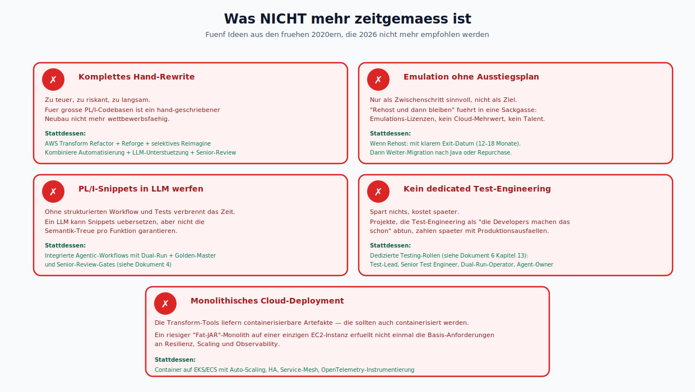

*Fuenf rote Warnkarten mit "&#10007;"-Icons: Komplettes Hand-Rewrite, Emulation ohne Ausstiegsplan, PL/I-Snippets in LLM werfen, kein dedicated Test-Engineering, monolithisches Cloud-Deployment. Jede mit "Stattdessen:"-Gegenempfehlung.*

Einige Ideen, die in den frühen 2020ern noch genannt wurden, sind 2026 nicht mehr empfohlen:

- **Komplettes Hand-Rewrite.** Zu teuer, zu riskant, zu langsam.
- **Emulation ohne Ausstiegsplan.** Nur als Zwischenschritt sinnvoll, nicht als Ziel.
- **Einzelne PL/I-Snippets per Prompt in einen LLM werfen und den Output einfach verwenden.** Ohne strukturiertes Workflow und Tests verbrennt das Zeit.
- **Migrationsprojekte ohne dedicated Test-Engineering.** Spart nichts, kostet später.
- **Ein monolithisches Cloud-Deployment der transformierten Anwendung.** Die Transform-Tools liefern containerisierbare Artefakte; die sollten auch containerisiert werden.

---

## 9. Leitfragen für die Entscheidung

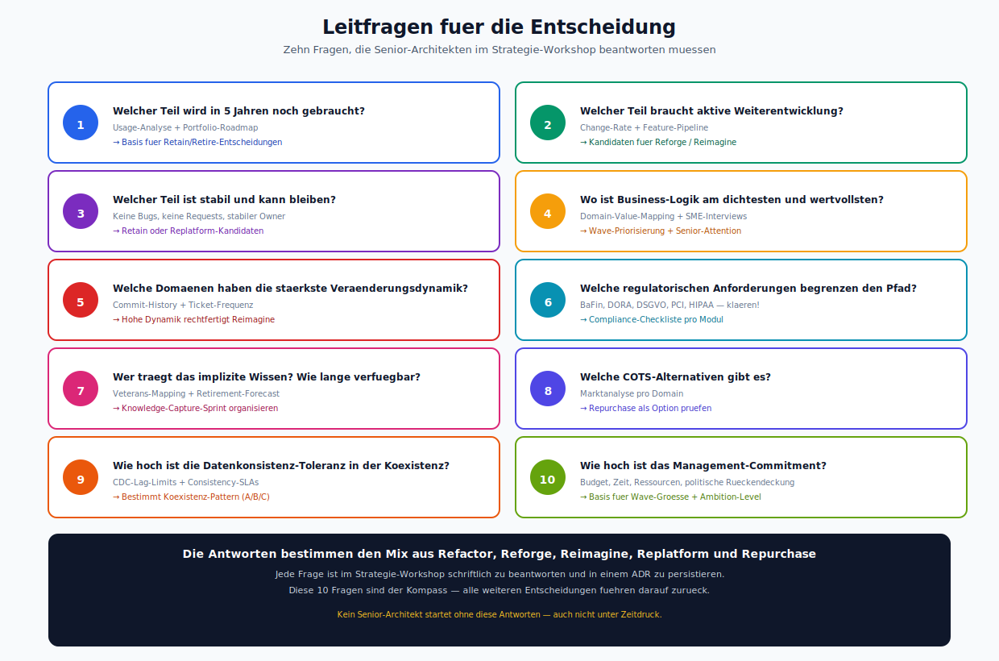

*Zehn nummerierte Leitfragen als Karten: 5-Jahres-Nutzen, Weiterentwicklungs-Bedarf, Stabilitaet, Business-Wert, Veraenderungsdynamik, Regulatorik, impl. Wissen, COTS-Alternativen, Konsistenz-Toleranz, Management-Commitment. Jede mit Input-Quelle und "&#8594; Auswirkung".*

Senior-Architekten, die den Lösungsraum sondieren, können sich an folgenden Fragen orientieren:

1. Welcher Teil der PL/I-Codebasis wird in 5 Jahren noch gebraucht?
2. Welcher Teil braucht aktive Weiterentwicklung?
3. Welcher Teil ist stabil und kann bleiben?
4. Wo ist die Business-Logik am dichtesten und am wertvollsten?
5. Welche Domänen haben die stärkste Veränderungsdynamik?
6. Welche regulatorischen Anforderungen begrenzen den Lösungsraum?
7. Wer sind die Träger des impliziten Wissens? Wie lange sind sie noch verfügbar?
8. Welche COTS-Alternativen gibt es für welche Domänen?
9. Wie hoch ist die Toleranz für Datenkonsistenz-Risiken in einer Koexistenzphase?
10. Wie hoch ist das Management-Commitment für die Migration?

Die Antworten darauf bestimmen den Mix aus Refactor, Reforge, Reimagine, Replatform und Repurchase.

---

## 10. Zusammenfassung des Lösungshorizonts

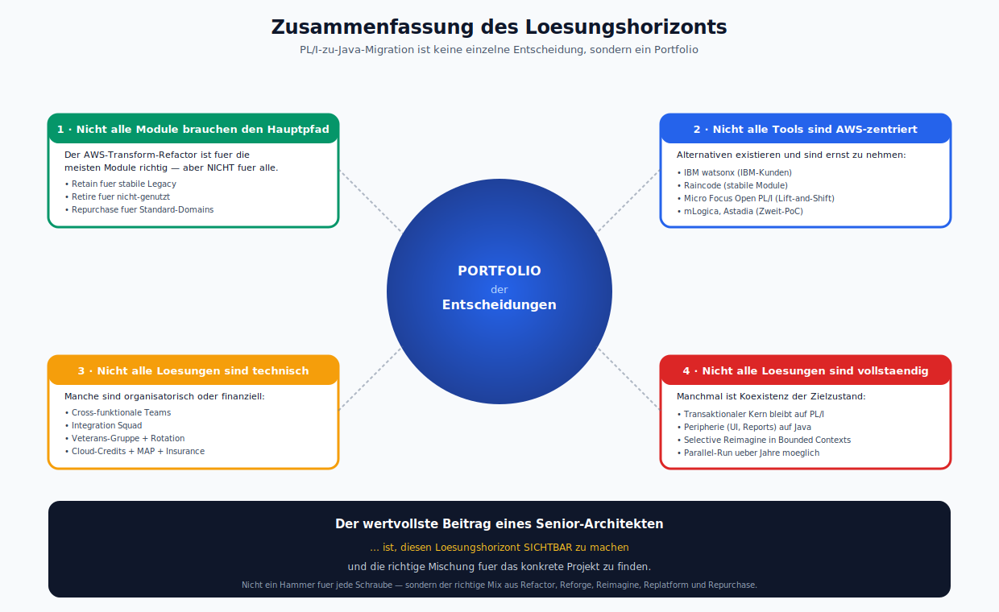

*Zentraler Kreis "PORTFOLIO der Entscheidungen", umgeben von vier Kernaussagen: "Nicht alle Module brauchen den Hauptpfad", "Nicht alle Tools sind AWS-zentriert", "Nicht alle Loesungen sind technisch", "Nicht alle Loesungen sind vollstaendig". Unten die Kernaussage zum Beitrag eines Senior-Architekten.*

PL/I-zu-Java-Migration ist **keine einzelne Entscheidung**, sondern ein **Portfolio** an Entscheidungen. Der Hauptpfad (AWS Transform Refactor) ist für die meisten Module richtig, aber:
- Nicht alle Module brauchen den Hauptpfad.
- Nicht alle Tools sind AWS-zentriert.
- Nicht alle Lösungen sind technisch — manche sind organisatorisch oder finanziell.
- Nicht alle Lösungen sind vollständig — manchmal ist Koexistenz der Zielzustand.

Der wertvollste Beitrag eines Senior-Architekten ist, diesen Lösungshorizont **sichtbar** zu machen und die richtige Mischung für das konkrete Projekt zu finden.

---

## 11. Referenzen

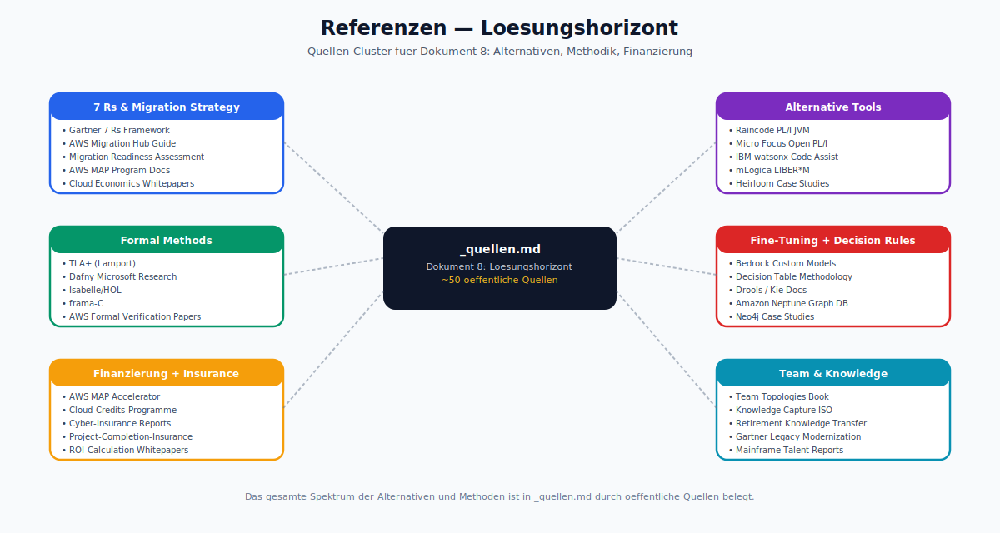

*Sechs Quellen-Cluster: 7 Rs &amp; Migration Strategy, Alternative Tools, Formal Methods, Fine-Tuning + Decision Rules, Finanzierung + Insurance, Team &amp; Knowledge. ~50 oeffentliche Quellen in `_quellen.md`.*

Siehe `_quellen.md`.
