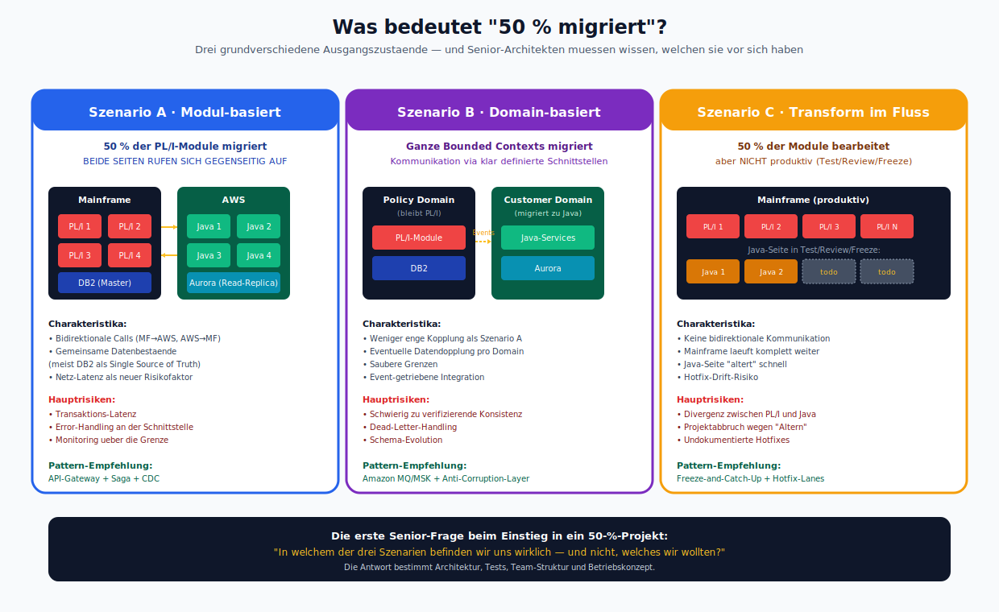
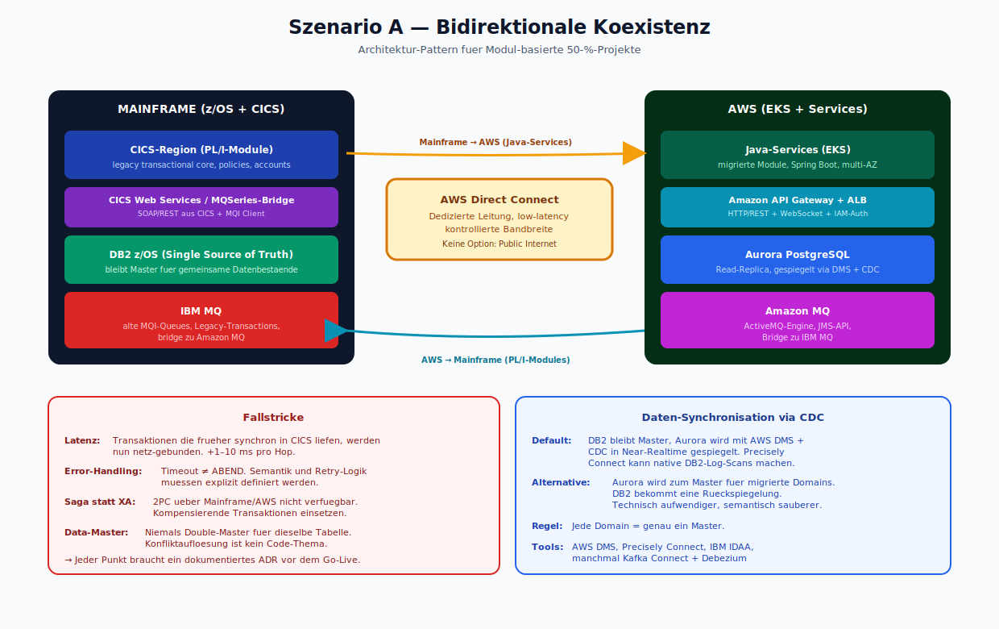
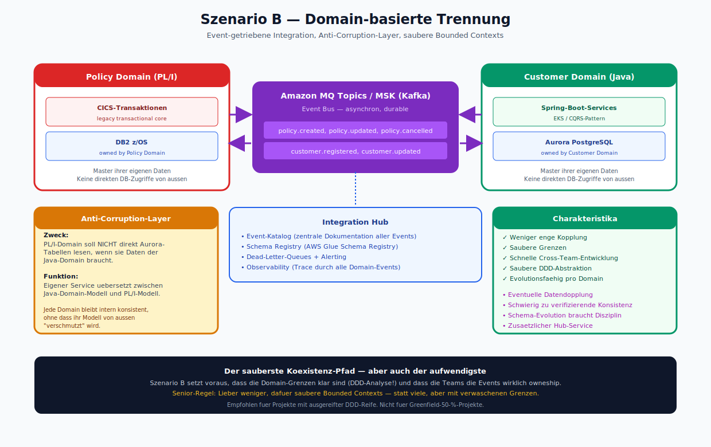
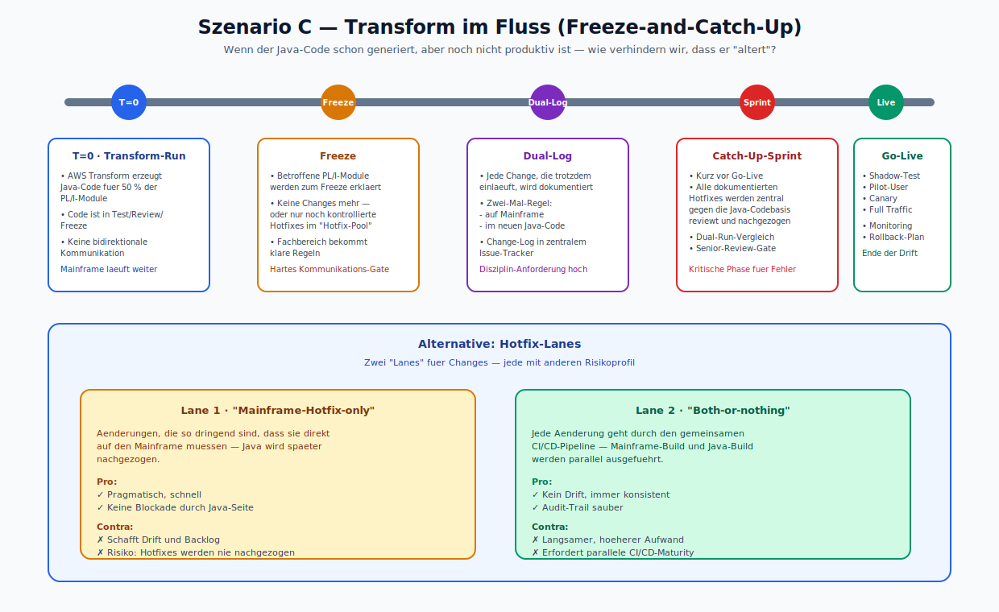
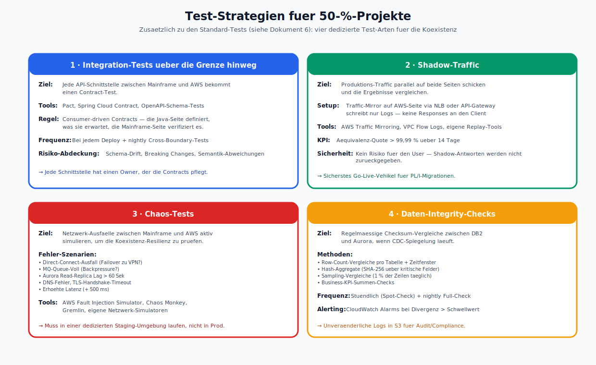
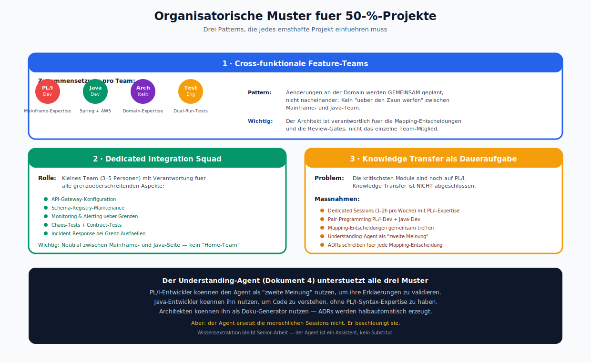
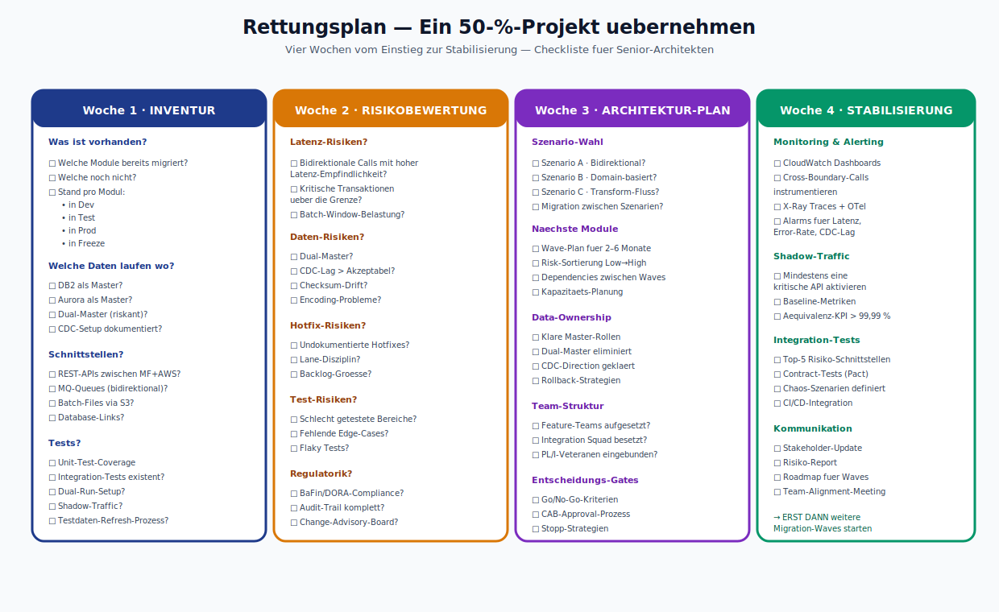
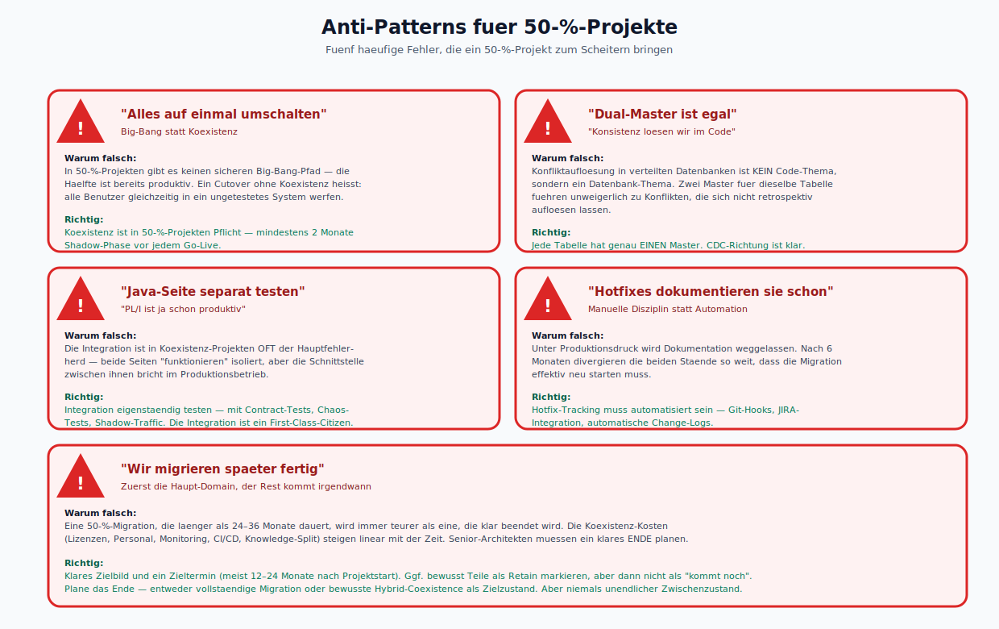
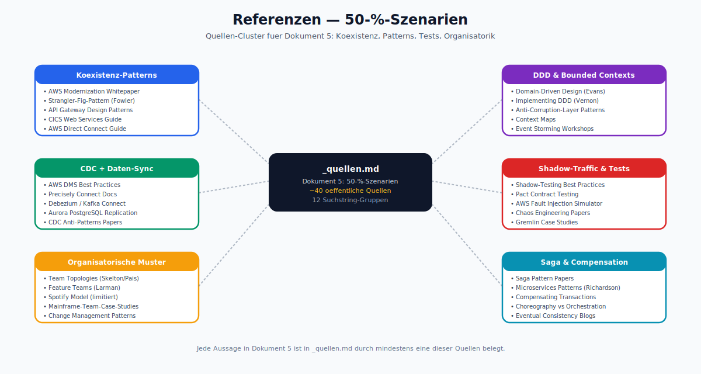

# Migrations-Szenarien für 50-Prozent-Projekte

> Dokument 5 der PL/I-zu-Java-Research | Stand: April 2026
>
> Dieses Dokument beschreibt Patterns für Projekte, in denen die PL/I-zu-Java-Migration bereits zu ungefähr 50 % abgeschlossen ist.

---

## 1. Was bedeutet "50 %"?



*Drei grundverschiedene Ausgangszustaende als Karten mit Mini-Diagrammen: A (Modul-basiert mit bidirektionalen Calls), B (Domain-basiert mit Event-Integration), C (Transform im Fluss mit Java in Test/Review). Die erste Senior-Frage beim Einstieg lautet: "Welches Szenario ist es wirklich?"*

"50 % migriert" ist kein einheitlicher Zustand. In der Praxis gibt es mindestens drei unterschiedliche Ausprägungen:

### 1.1 Szenario A: Modul-basierte 50 %

Die Hälfte der PL/I-Module ist bereits nach Java migriert und produktiv auf AWS. Die andere Hälfte läuft weiter auf dem Mainframe. **Beide Seiten rufen sich gegenseitig auf.**

Charakteristika:
- Bidirektionale Calls (Mainframe → AWS und AWS → Mainframe)
- Gemeinsame Datenbestände (meist DB2 auf Mainframe als Single Source of Truth)
- Netz-Latenz als neuer Risikofaktor

### 1.2 Szenario B: Domain-basierte 50 %

Einige Geschäftsdomänen (Bounded Contexts) sind vollständig auf Java migriert, andere sind vollständig auf PL/I geblieben. Die Kommunikation zwischen den Domänen läuft über **klar definierte Schnittstellen** (Events, Messages, REST-Aufrufe).

Charakteristika:
- Weniger enge Kopplung als Szenario A
- Eventuelle Datendopplung (eine Domain hält ihre Daten in Aurora, die andere in DB2)
- Saubere Grenzen, aber schwierig zu verifizierende Konsistenz

### 1.3 Szenario C: Hälftig-abgeschlossene Transformation

Das Transform-Werkzeug hat 50 % der Module bearbeitet. Diese sind noch **nicht produktiv**, sondern in Test, Review oder Freeze. Der Mainframe läuft komplett weiter.

Charakteristika:
- Keine bidirektionale Kommunikation, aber
- Die Java-Seite "altert" schnell: Tage/Wochen nach dem Transform-Run können sich Anforderungen geändert haben und der Java-Code muss nachgezogen werden.

---

## 2. Architektur-Patterns für Szenario A (bidirektionale Koexistenz)



*Die komplette Architektur: Mainframe-Seite mit CICS, DB2, IBM MQ — AWS-Seite mit EKS, API Gateway, Aurora, Amazon MQ — dazwischen AWS Direct Connect. Die beiden bidirektionalen Pfeile zeigen die Aufruf-Richtungen. Unten die Fallstricke und die CDC-Sync-Strategie als zwei getrennte Info-Boxen.*

### 2.1 API-Gateway zwischen Mainframe und AWS

Jede Seite exponiert klar definierte Schnittstellen über ein zentrales Gateway:

```
  Mainframe                                          AWS
  ┌──────────────┐      REST / JMS                ┌──────────────┐
  │  PL/I-Module │ ◀─────────────────────────────▶│ Java-Services│
  │   (CICS)     │      via API-Gateway            │   (EKS)      │
  └──────────────┘                                  └──────────────┘
          │                                                │
          └─────────── Direct Connect ─────────────────────┘
```

**Tools:**
- Auf AWS-Seite: Amazon API Gateway (REST) + Amazon MQ (Messaging).
- Auf Mainframe-Seite: CICS-Web-Services oder MQSeries.
- Dazwischen: AWS Direct Connect als stabile, latenz-kontrollierte Leitung.

**Fallstricke:**
- Jeder bidirektionale Call erhöht die Latenz. Transaktionen, die früher synchron im selben CICS-Region liefen, werden nun netz-gebunden.
- Error-Handling an der Schnittstelle: ein Timeout ist kein lokaler ABEND, sondern eine Netzwerkfehler-Condition — die Semantik unterscheidet sich.

### 2.2 Compensating Transactions statt XA

Zwei-Phasen-Commit über Mainframe und AWS hinweg ist in den meisten Produkten entweder nicht verfügbar oder nicht empfohlen. Stattdessen **Saga-Pattern** mit kompensierenden Transaktionen:

- Jeder Teilschritt ist idempotent.
- Wenn ein Teilschritt fehlschlägt, werden die vorhergehenden Schritte durch eine explizite Kompensations-Operation rückgängig gemacht.
- Auditing erforderlich.

### 2.3 Daten-Synchronisation via CDC

Wenn beide Seiten dieselben Daten lesen müssen, bekommt eine Seite eine **Read Replica** der anderen:

- **Default:** DB2 bleibt Master, Aurora wird mit AWS DMS + CDC (Change Data Capture) in Near-Realtime gespiegelt. Precisely Connect kann native DB2-Log-Scans machen.
- **Alternative:** Aurora wird zum Master (für die migrierten Domains), DB2 bekommt eine Rückspiegelung. Technisch aufwendiger, aber semantisch sauberer, weil jede Domain nur **einen** Master hat.

**Wichtige Regel:** Vermeide Double-Master für dieselbe Tabelle. Das führt unweigerlich zu Konflikten.

---

## 3. Architektur-Patterns für Szenario B (Domain-basierte Trennung)



*Zwei Bounded Contexts (Policy Domain in PL/I, Customer Domain in Java) kommunizieren ueber einen Event-Bus (Amazon MQ/MSK). Darunter der Integration Hub mit Schema-Registry und DLQ. Links der Anti-Corruption-Layer und rechts die Charakteristika-Checkliste.*

### 3.1 Event-getriebene Integration

Domain-übergreifende Kommunikation läuft asynchron über Events:

```
  ┌────────────────┐              ┌────────────────┐
  │ Policy Domain  │              │  Customer      │
  │   (PL/I, DB2)  │              │  Domain        │
  │                │              │  (Java, Aurora)│
  └───────┬────────┘              └───────┬────────┘
          │                                │
          │        Amazon MQ (Topics)      │
          └────────────┬───────────────────┘
                       ▼
            ┌───────────────────────┐
            │    Integration Hub    │
            │   (Event-Katalog,     │
            │    Schema Registry)   │
            └───────────────────────┘
```

**Tools:**
- Amazon MQ mit Topics (oder Amazon MSK/Kafka).
- Schema-Registry (AWS Glue Schema Registry) für Vorwärts- und Rückwärtskompatibilität.
- Ein zentraler Integration-Hub-Service als Beobachter aller Domänen-Events (Dead-Letter, Retry, Monitoring).

### 3.2 Anti-Corruption-Layer

Wenn die PL/I-Domain Daten der Java-Domain lesen muss, wird nicht direkt auf Aurora zugegriffen — stattdessen läuft ein **Anti-Corruption-Layer** als eigener Service, der das Java-Domain-Modell ins PL/I-Modell übersetzt. So bleibt jede Domain intern konsistent.

---

## 4. Architektur-Patterns für Szenario C (Transform im Fluss)



*Oben die Timeline mit den fuenf Milestones (T=0, Freeze, Dual-Log, Sprint, Go-Live). Darunter die Alternative "Hotfix-Lanes" mit Lane 1 (pragmatisch, riskant) und Lane 2 (sauber, aufwendiger) im direkten Vergleich.*

### 4.1 Freeze-and-Catch-Up

**Problem:** Der transformierte Java-Code altert zwischen dem Transform-Run und dem produktiven Deploy. In dieser Zeit können auf dem Mainframe neue Changes entstehen.

**Lösung:**
1. **Freeze:** Die betroffenen PL/I-Module werden zum Freeze erklärt. Keine Changes mehr auf dem Mainframe, oder nur noch in einem kontrollierten "Hotfix"-Pool.
2. **Dual-Log:** Jede Change, die trotzdem einläuft, wird dokumentiert und muss **zwei Mal** eingebracht werden: auf dem Mainframe und im neuen Java-Code.
3. **Catch-Up-Sprint:** Kurz vor dem Go-Live werden alle dokumentierten Hotfixes einmal zentral gegen die Java-Codebasis reviewt und nachgezogen.

### 4.2 Hotfix-Lanes

Alternativ: es gibt zwei "Lanes" für Changes:
- Lane 1: "Mainframe-Hotfix-only" — Änderungen, die so dringend sind, dass sie direkt auf den Mainframe müssen, und die erst später auf Java nachgezogen werden.
- Lane 2: "Both-or-nothing" — jede Änderung geht durch den gemeinsamen CI/CD-Pipeline, die sowohl den Mainframe-Build als auch den Java-Build ausführt.

Lane 2 ist sauberer, aber aufwendiger. Lane 1 ist pragmatisch, schafft aber Risiken.

---

## 5. Test-Strategien für 50-%-Projekte



*Vier dedizierte Test-Arten fuer die Koexistenz: Integration-Tests ueber die Grenze, Shadow-Traffic, Chaos-Tests, Daten-Integrity-Checks. Jede Karte zeigt Ziel, Tools, Frequenz, Risiko-Abdeckung und eine konkrete Senior-Regel.*

Zusätzlich zu den Standard-Tests (siehe Dokument 6):

1. **Integration-Tests über die Grenze hinweg.** Jede API-Schnittstelle zwischen Mainframe und AWS bekommt einen Contract-Test mit Pact oder einem ähnlichen Werkzeug.
2. **Shadow-Traffic.** Produktions-Traffic wird zur Sicherheit parallel auf beide Seiten geschickt und die Ergebnisse verglichen.
3. **Chaos-Tests.** Netzwerk-Ausfälle zwischen Mainframe und AWS aktiv simulieren, um zu sehen, wie die Koexistenz reagiert.
4. **Daten-Integrity-Checks.** Regelmäßige Checksum-Vergleiche zwischen DB2 und Aurora, wenn CDC-Spiegelung läuft.

---

## 6. Organisatorische Muster



*Drei Muster als Karten: Cross-funktionale Feature-Teams (mit PL/I-Dev, Java-Dev, Architekt, Test-Engineer als Icons), Dedicated Integration Squad (neutral zwischen Mainframe- und Java-Seite), Knowledge Transfer als Daueraufgabe. Unten die Rolle des Understanding-Agents als verstaerkendes Element.*

Auf Team-Ebene brauchen 50-%-Projekte spezifische Strukturen:

### 6.1 Cross-funktionale Feature-Teams

Jedes Team hat mindestens einen PL/I-Entwickler, einen Java-Entwickler und einen Architekten. Änderungen an der Domain werden **gemeinsam** geplant, nicht nacheinander.

### 6.2 Dedicated Integration Squad

Ein kleines Team (3–5 Personen), das die Verantwortung für alle grenzüberschreitenden Aspekte hat: API-Gateway, Schema-Registry, Monitoring, Alerting, Chaos-Tests. Dieses Team ist neutral zwischen Mainframe- und Java-Seite.

### 6.3 Knowledge Transfer ist Daueraufgabe

In 50-%-Projekten ist der Knowledge-Transfer von PL/I-Entwicklern zu Java-Entwicklern nicht abgeschlossen — oft im Gegenteil: die **kritischsten** Module sind noch auf PL/I. Plane dedicated sessions ein, in denen PL/I-Entwickler ihren Code den Java-Entwicklern erklären und beide gemeinsam Mapping-Entscheidungen treffen.

Unterstützung durch Agenten: der **Understanding-Agent** aus Dokument 4 hilft hier, die Last zu reduzieren — PL/I-Entwickler können den Agent als "zweite Meinung" nutzen.

---

## 7. Rettungsplan: Ein 50-%-Projekt übernehmen



*Vier Spalten fuer vier Wochen (Inventur, Risikobewertung, Architektur-Plan, Stabilisierung), jede mit einer Checklisten-Struktur. Der Plan ist sequenziell — erst danach duerfen weitere Migration-Waves starten.*

Wenn du als Senior-Architekt in ein laufendes 50-%-Projekt kommst, arbeite die folgenden Punkte in den ersten vier Wochen ab:

1. **Woche 1 — Inventur:**
   - Welche Module sind bereits migriert? Welche nicht? In welchem Stand (in Dev / in Test / in Prod)?
   - Welche Daten laufen wo? (DB2 als Master? Aurora als Master? Dual-Master?)
   - Welche Schnittstellen zwischen Mainframe und AWS existieren?
   - Welche Test-Suites existieren?

2. **Woche 2 — Risikobewertung:**
   - Wo sind bidirektionale Calls mit hoher Latenz-Empfindlichkeit?
   - Wo gibt es Dual-Master?
   - Wo gibt es Hotfix-Lanes ohne Dokumentation?
   - Welche Codebereiche sind besonders schlecht getestet?

3. **Woche 3 — Architektur-Plan:**
   - Soll das Projekt als Szenario A, B oder C weitergeführt werden?
   - Welche Module werden als nächstes migriert?
   - Welche Data-Ownership-Regeln gelten?

4. **Woche 4 — Stabilisierung:**
   - Monitoring & Alerting für alle Cross-Boundary-Calls einrichten.
   - Shadow-Traffic für mindestens eine kritische API aktivieren.
   - Integration-Tests für die Top-5-Risikoschnittstellen schreiben.

Erst wenn diese Stabilisierung steht, weitere Migrations-Waves starten.

---

## 8. Anti-Patterns



*Fuenf rote Warnkarten mit "!"-Icons: Big Bang, Dual-Master ignorieren, Integration-Tests separat, Hotfix-Doku auf manuelle Disziplin verlassen, Migration verschleppen. Jede Karte mit "Warum falsch?" und "Richtig:" Gegenueberstellung.*

- **"Alles auf einmal umschalten":** nein. Koexistenz ist in 50-%-Projekten Pflicht.
- **"Dual-Master ist egal, wir sorgen für Konsistenz im Code":** nein. Konfliktauflösung in verteilten Datenbanken ist kein Code-Thema.
- **"Wir testen die Java-Seite separat, die PL/I-Seite ist ja schon produktiv":** nein. Die Integration ist oft der Hauptfehler-Herd, sie muss eigenständig getestet werden.
- **"Wir verlassen uns auf die Mainframe-Entwickler, um die Hotfixes zu dokumentieren":** nein. Hotfix-Tracking muss automatisiert sein.
- **"Wir migrieren später fertig, jetzt ist erst mal die Haupt-Domain dran":** eine 50-%-Migration, die länger als 24–36 Monate dauert, wird immer teurer als eine, die klar beendet wird. Plane das Ende.

---

## 9. Referenzen



*Sechs Quellen-Cluster rund um `_quellen.md`: Koexistenz-Patterns, DDD &amp; Bounded Contexts, CDC + Daten-Sync, Shadow-Traffic &amp; Tests, Organisatorische Muster, Saga &amp; Compensation. ~40 oeffentliche Quellen.*

Siehe `_quellen.md`.
