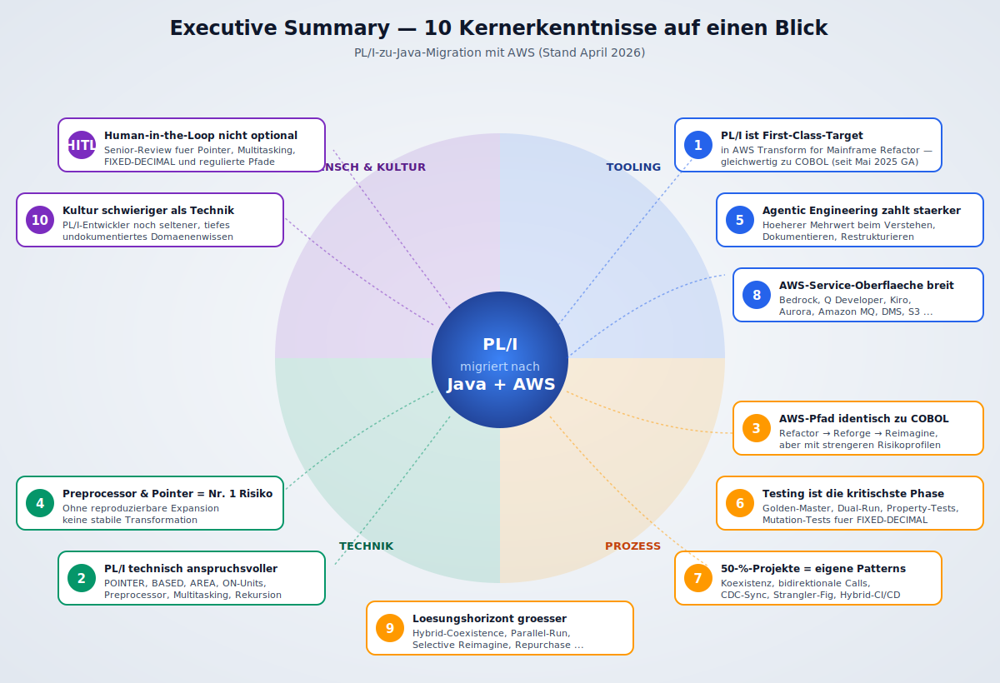
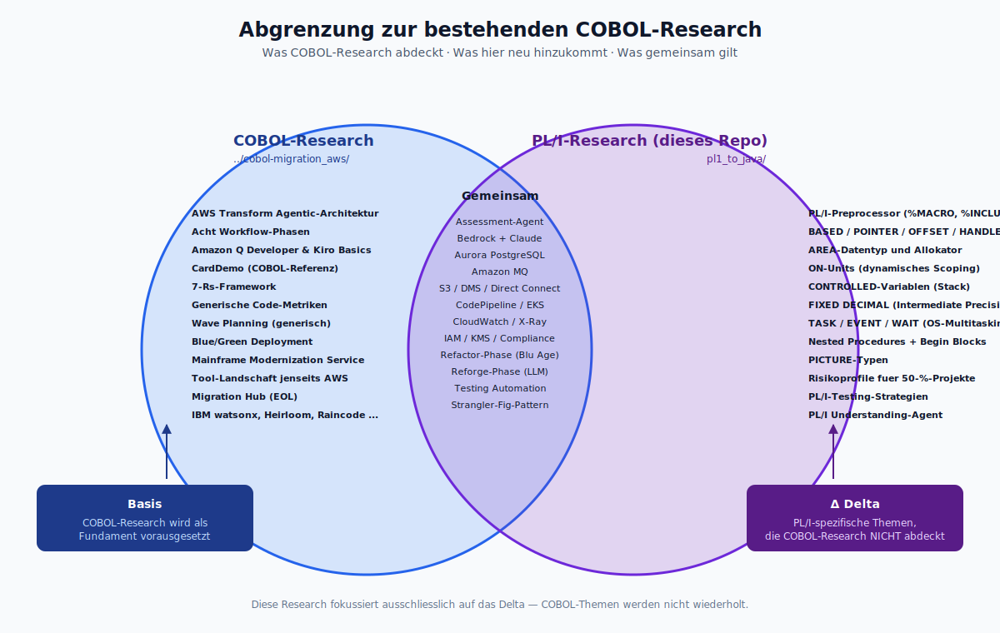
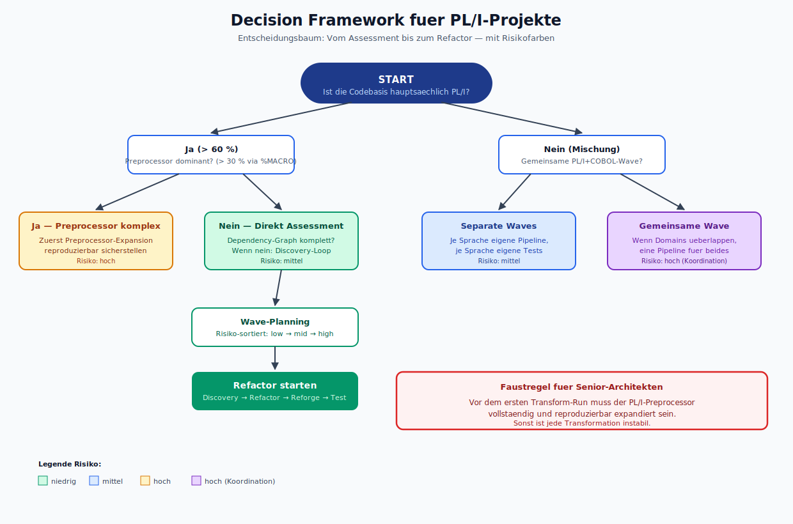
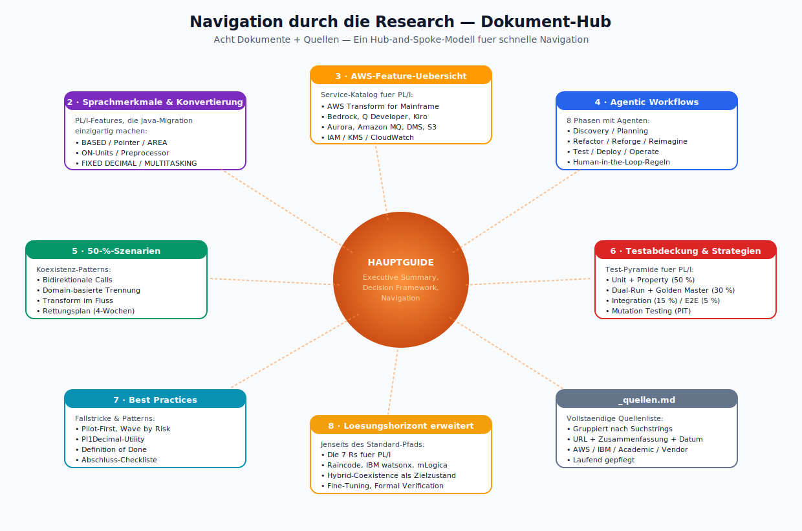
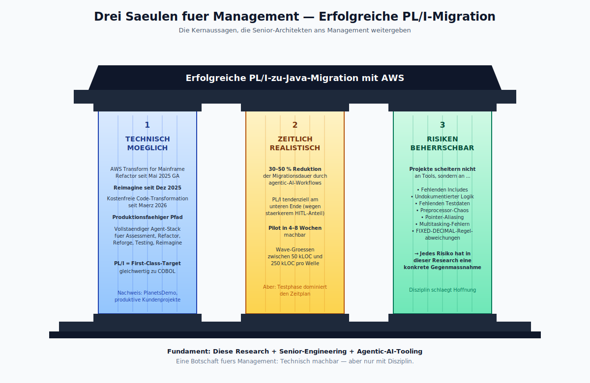
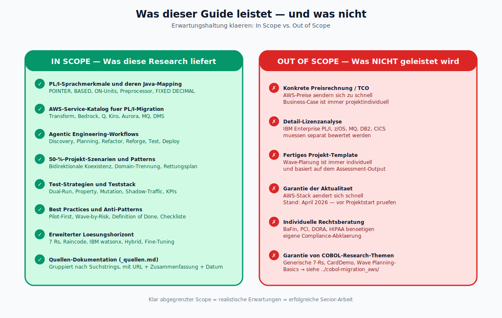
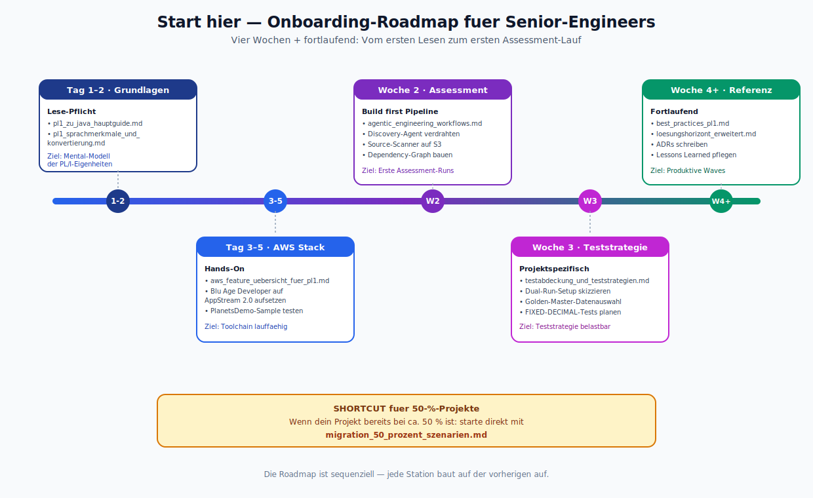
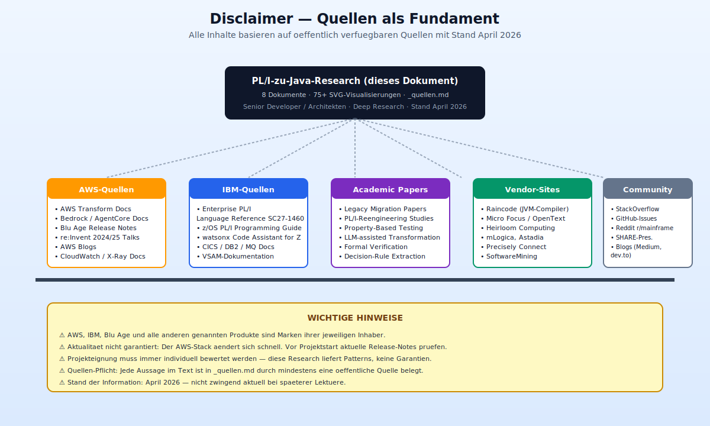

# PL/I zu Java Migration mit AWS — Hauptguide

> Stand: April 2026 | Zielgruppe: Senior Developer & Senior Architekten
>
> Dieser Guide ist der zentrale Einstiegspunkt für die Deep Research zu PL/I-zu-Java-Migrationen mit AWS-Tooling und agentic engineering. Er baut auf der existierenden COBOL-Research in `../cobol-migration_aws/` auf und konzentriert sich auf die PL/I-spezifischen Aspekte, die dort nicht behandelt wurden.

---

## Inhaltsverzeichnis dieser Research

Diese Research umfasst acht Dokumente, die jeweils einen klar abgegrenzten Themenbereich abdecken:

| Dokument | Inhalt |
|----------|--------|
| **pl1_zu_java_hauptguide.md** (dieses Dokument) | Executive Summary, Decision Framework, Navigation |
| **pl1_sprachmerkmale_und_konvertierung.md** | PL/I-Sprachmerkmale, die Java-Migration einzigartig machen, und deren Mapping nach Java |
| **aws_feature_uebersicht_fuer_pl1.md** | Vollstaendige AWS-Feature-Uebersicht fuer eine PL/I-Migration (Service-Katalog) |
| **agentic_engineering_workflows.md** | Agentic-Engineering-Workflows mit AWS Transform, Amazon Q, Bedrock AgentCore, Kiro |
| **migration_50_prozent_szenarien.md** | Szenarien und Patterns fuer Projekte, die bereits zu ca. 50 % migriert sind |
| **testabdeckung_und_teststrategien.md** | Teststrategien und Testabdeckung fuer PL/I-zu-Java mit agentic engineering |
| **best_practices_pl1.md** | PL/I-spezifische Best Practices, Fallstricke und Architektur-Patterns |
| **loesungshorizont_erweitert.md** | Bunter Strauss an Methoden und Ideen zur Erweiterung des Loesungshorizonts |
| **_quellen.md** | Vollstaendige Quellenliste mit URLs, Zusammenfassungen und Suchstrings |

---

## 1. Executive Summary



*Die zehn Kernerkenntnisse dieser Research auf einen Blick — gruppiert nach den vier Dimensionen Tooling, Prozess, Technik und Mensch/Kultur. Das zentrale Motiv (PL/I → Java + AWS) ist der gemeinsame Nenner aller Erkenntnisse.*

PL/I ist nach COBOL die **zweitwichtigste Mainframe-Sprache** und in Banken, Versicherungen, Behoerden und Industrie weit verbreitet. Weltweit werden PL/I-Codebasen auf **mehrere zehn Milliarden Lines of Code** geschaetzt — vor allem in IBM Enterprise PL/I auf z/OS. Waehrend COBOL die Mehrheitssprache bleibt, ist PL/I in vielen kritischen Kernsystemen tief verankert, insbesondere in risikoarmer, transaktionsorientierter Kernlogik (Accounts, Policies, Settlements).

### 1.1 Die wichtigsten Erkenntnisse auf einen Blick

1. **PL/I ist ein First-Class-Target in AWS Transform for Mainframe.** AWS Blu Age (seit Maerz 2026 offiziell **AWS Transform for Mainframe Refactor** genannt) unterstuetzt PL/I gleichwertig zu COBOL: Assessment, Refactor, Reforge, Reimagine und Testing Automation funktionieren auch fuer PL/I. Grundlage ist der **Mainframe Dependencies Engine**, der PL/I-Dependencies (INCLUDE, CALL, ENTRY, CICS) explizit auswertet.

2. **PL/I ist aber technisch anspruchsvoller als COBOL.** Pointer-Arithmetik (POINTER, OFFSET, HANDLE), BASED-Variablen, AREA-Datentypen, der Preprocessor (%INCLUDE, %MACRO, %PROCEDURE), ON-Units, Rekursion, nested BEGIN-Bloecke und echtes OS-Multitasking (TASK, EVENT, WAIT) haben keine direkten Java-Entsprechungen. Diese Features machen PL/I-Migrationen **aufwendiger und risikoreicher** als reine COBOL-Projekte.

3. **Der AWS-Empfohlene-Pfad fuer PL/I ist identisch zu COBOL:** Refactor (deterministisch, via Blu Age Engine) → Reforge (LLM-basiert, idiomatisches Java) → optional Reimagine (Kiro, Microservices). Die End-to-End-Phasen (Discovery → Planning → Transform → Test → Deploy → Operate) gelten unveraendert, die **Risikoprofile und Qualitaetsgates** sind jedoch strenger.

4. **Preprocessor und Pointer sind die zwei groessten Stolperfallen.** Ohne vollstaendige Expansion des PL/I-Preprocessors gibt es keine verlaessliche Transformation. BASED-Variablen muessen auf typsichere Java-Container abgebildet werden (z. B. ByteBuffer mit Layout-Metadaten), was bei dichter Pointer-Arithmetik deutlichen manuellen Review erfordert.

5. **Agentic Engineering zahlt sich bei PL/I staerker aus als bei COBOL.** Weil PL/I-Code komplexer, heterogener und schlechter dokumentiert ist, liefern KI-Agenten (Assessment-Agent, Planungs-Agent, Reforge-LLM, Kiro) einen besonders hohen Mehrwert beim **Verstehen**, **Dokumentieren** und **Restrukturieren** der Codebasis. Human-in-the-Loop ist fuer PL/I **nicht optional**, sondern explizit notwendig, insbesondere bei regulierten Code-Pfaden.

6. **PL/I-Testing ist die kritischste Phase.** PL/I-FIXED-DECIMAL-Semantik mit exakter Rundung, ON-Unit-Verhalten, Preprocessor-generierter Code und Pointer-Zugriffe erzeugen viele **non-obvious Edge Cases**, die nur durch systematisches Golden-Master-Testing, Dual-Run und Property-basierte Tests gefunden werden. Der AWS Transform Testing Automation-Agent generiert die Basis-Suites, Senior-Engineering ergaenzt sie um Differential-Testing und Mutation-Tests.

7. **50-Prozent-Projekte brauchen andere Patterns als Greenfield.** Wenn die Haelfte des PL/I-Codes bereits nach Java migriert ist, werden Koexistenz, bidirektionale Calls (PL/I auf dem Mainframe ruft Java-Services; Java-Services rufen PL/I-Module), Datensynchronisation via CDC (Precisely, AWS DMS) und hybrides CI/CD zu den zentralen Architektur-Themen. Der Strangler-Fig-Ansatz, sauber orchestriert ueber AWS Direct Connect und Amazon MQ, ist hier Pflicht.

8. **Die AWS-Service-Oberflaeche ist breit.** Jenseits von AWS Transform und Blu Age brauchen reale PL/I-Projekte eine Kombination aus Amazon Bedrock (fuer Custom-Agents), Amazon Q Developer (IDE-Integration), Kiro (Forward Engineering), Aurora PostgreSQL (DB2-Ersatz), Amazon MQ (MQSeries-Ersatz), Amazon S3 (Quellcode, Testdaten, Artefakte), AWS DMS + Precisely Connect (Datenmigration), AWS CodePipeline, CloudWatch und X-Ray. Jeder Service hat im PL/I-Kontext eine spezifische Rolle.

9. **Der Loesungshorizont fuer Senior-Teams ist groesser als oft angenommen.** Neben der rein technischen Migration gibt es alternative Wege: Hybrid-Coexistence auf unbestimmte Zeit, Domain-Reimagine nur fuer ausgewaehlte Bounded Contexts, Parallel-Run von PL/I und Java ueber Jahre, Einsatz von AI-basiertem Regeltraining auf PL/I-Patterns, Einsatz von LLM-Assistenten fuer Pair-Programming mit bestehenden PL/I-Entwicklern etc.

10. **Die kulturelle Herausforderung ist schwieriger als die technische.** PL/I-Entwickler sind noch seltener als COBOL-Entwickler; sie haben oft tiefes, undokumentiertes Domaenenwissen. Ihr Wissen muss in der Migration erfasst, konserviert und an die Java-Teams weitergegeben werden. Agentic Engineering kann diesen Transfer beschleunigen, ersetzt ihn aber nicht.

---

## 2. Abgrenzung zur COBOL-Research



*Venn-Diagramm der Zustaendigkeiten: Links die bestehende COBOL-Research als Fundament, in der Mitte die gemeinsamen Themen (AWS Transform, Bedrock, Aurora …), rechts das reine PL/I-Delta (Preprocessor, Pointer, ON-Units, FIXED DECIMAL …), das diese Research neu abdeckt.*

Die bestehende COBOL-Research in `../cobol-migration_aws/` deckt die folgenden Themen **vollstaendig** ab und wird hier **nicht wiederholt**:

- AWS Transform als Agentic-AI-Service (Architektur, Agenten-Rollen, Bedrock-Integration)
- Die acht Workflow-Phasen (Discovery, Planning, Refactor, Reforge, Reimagine, Test, Deploy, Operate)
- Amazon Q Developer und Kiro als Entwickler-Erlebnisse
- CardDemo als COBOL-Referenzanwendung
- Das 7-Rs-Framework, Entscheidungsmatrix Refactor vs. Replatform
- Generische Code-Metriken (LOC, Cyclomatic Complexity, Halstead)
- Generische Best Practices (Wave Planning, Pilot-Projekt, Blue/Green Deployment)
- AWS Mainframe Modernization Service und Rocket Software Replatforming
- AWS Migration Hub (EOL fuer Neukunden seit November 2025)
- Die Tool-Landschaft jenseits AWS (IBM watsonx, Heirloom, Raincode, SoftwareMining, Astadia, mLogica etc.)

Dieser PL/I-Guide fokussiert ausschliesslich auf das **Delta**: Was ist bei PL/I anders, besonders, schwerer oder mit zusaetzlichen Schritten verbunden?

---

## 3. Decision Framework fuer PL/I-Projekte



*Der vollstaendige Entscheidungsbaum mit Risikofarben: grun = niedrig, blau = mittel, gelb/orange = hoch, violett = hoch durch Koordinationsaufwand. Die rote Banner-Faustregel ist der unverrueckbare Anker fuer jeden Transform-Lauf.*

![PL/I Decision Framework — Text-Diagramm]

```
                   Ist die Codebasis hauptsaechlich PL/I?
                                   │
                 ┌─────────────────┴─────────────────┐
                 ▼                                   ▼
           Ja (> 60%)                      Nein (Mischung)
                 │                                   │
                 ▼                                   ▼
   Preprocessor dominant?                Gemeinsame PL/I+COBOL-Wave?
   (> 30% Code via %MACRO)                          │
                 │                       ┌──────────┴──────────┐
     ┌───────────┴───────────┐           ▼                     ▼
     ▼                       ▼      Separate Waves        Gemeinsam
  Zuerst                  Direkt        je Sprache         (wenn Domains
  Preprocessor         Assessment                           ueberlappen)
  expandieren             │
     │                    ▼
     ▼              Dependency-Graph
  Standardpfad        komplett?
                          │
              ┌───────────┴───────────┐
              ▼                       ▼
          Ja               Nein — fehlende Artefakte
              │                       │
              ▼                       ▼
       Wave-Planning             Discovery-Loop
              │                  (zusaetzliche
              ▼                   Scans)
      Refactor starten
```

Die wichtigste Faustregel fuer Senior-Architekten:

> **Vor dem ersten Transform-Run muss der PL/I-Preprocessor vollstaendig und reproduzierbar expandiert sein. Sonst ist jede Transformation instabil.**

---

## 4. Navigation durch die Research



*Hub-and-Spoke-Karte der gesamten Research: Der Hauptguide im Zentrum, die acht Fachdokumente als Satelliten mit Inhalts-Sneak-Peek, dazu `_quellen.md` als persistente Belegstelle. Farbcode pro Dokument zur schnelleren Wiedererkennung.*

| Du moechtest ... | Lies ... |
|------------------|---------|
| ... einen Gesamtueberblick (du bist hier) | `pl1_zu_java_hauptguide.md` |
| ... PL/I-Sprachfeatures und deren Java-Mapping verstehen | `pl1_sprachmerkmale_und_konvertierung.md` |
| ... wissen, welche AWS-Services in welcher Phase relevant sind | `aws_feature_uebersicht_fuer_pl1.md` |
| ... die agentic-AI-Workflows konkret umsetzen | `agentic_engineering_workflows.md` |
| ... ein 50-Prozent-Projekt retten oder weiterfuehren | `migration_50_prozent_szenarien.md` |
| ... eine belastbare Teststrategie bauen | `testabdeckung_und_teststrategien.md` |
| ... Fallstricke und Patterns kennen | `best_practices_pl1.md` |
| ... deinen Loesungshorizont erweitern | `loesungshorizont_erweitert.md` |
| ... alle Quellen nachlesen | `_quellen.md` |

---

## 5. Kernaussagen fuer Management



*Die klassische Metapher: drei tragende Saeulen halten den Architrav "Erfolgreiche PL/I-zu-Java-Migration". Saeule 1 (Technisch moeglich), Saeule 2 (Zeitlich realistisch), Saeule 3 (Risiken beherrschbar). Das Fundament darunter: diese Research plus Senior-Engineering plus Agentic-AI-Tooling.*

Diese Research ist technisch — aber Senior-Architekten muessen sie auch ans Management vermitteln koennen. Die drei Kernaussagen sind:

1. **Technisch moeglich.** PL/I-Migration mit AWS Transform ist nicht nur moeglich, sondern seit Mai 2025 (GA AWS Transform) und Dezember 2025 (Reimagine-Capabilities) ein produktionsfaehiger Pfad. Seit Maerz 2026 ist die Konsolidierung unter dem Namen "AWS Transform for Mainframe Refactor" vollzogen, die Code-Transformation wird zudem **zum Nulltarif** angeboten (Pricing-Change im Rahmen der Konsolidierung).

2. **Zeitlich realistisch.** AWS-Erfahrungen zeigen Reduktion der Migrationsdauer um **30–50 %** durch den agentic-AI-Ansatz — fuer PL/I liegen die Einsparungen tendenziell am unteren Ende dieses Spektrums (staerkere Human-in-the-Loop-Anteile).

3. **Risiken beherrschbar — mit Disziplin.** PL/I-Projekte scheitern typischerweise nicht an Tools, sondern an: fehlenden Copybooks und Includes, undokumentierter Business-Logik, fehlenden Testdaten, Preprocessor-Chaos, Pointer-Aliasing, Multitasking-Fehlern und regulatorischen Anforderungen an exakte Dezimalarithmetik. Jedes dieser Risiken hat in dieser Research eine konkrete Gegenmassnahme.

---

## 6. Was dieser Guide NICHT leistet



*Gegenueberstellung In-Scope/Out-of-Scope als zwei Inseln. Links die Themen, die diese Research liefert; rechts die Themen, die sie bewusst nicht abdeckt. Erwartungsmanagement ist Teil von Senior-Arbeit.*

- **Keine Preisrechnung**: AWS-Preise aendern sich schnell, und ein realistischer TCO-Business-Case ist immer projektindividuell.
- **Keine Detail-Lizenzanalyse**: IBM Enterprise PL/I-Lizenzen, z/OS-Lizenzen und Third-Party-Dependencies (MQ, DB2, CICS) muessen separat bewertet werden.
- **Kein fertiges Projekt-Template**: Jedes Projekt braucht eine individuelle Wave-Planung basierend auf dem Assessment-Output.
- **Keine Garantie der Aktualitaet**: Der AWS-Stack aendert sich schnell. Stand dieser Research: April 2026. Vor Projektstart immer die aktuellen AWS-Release-Notes und die Blu Age Release Notes pruefen.

---

## 7. Start hier



*Zeitstrahl vom ersten Lesetag bis zum ersten produktiven Wave: Tag 1–2 Grundlagen, Tag 3–5 AWS-Stack-Handson, Woche 2 Assessment-Pipeline, Woche 3 Teststrategie, Woche 4+ Referenz und Waves. Der gelbe Shortcut-Balken verweist 50-%-Projekte direkt auf das richtige Dokument.*

Wenn du Senior Developer oder Senior Architekt bist und gerade ein PL/I-Migrationsprojekt startest oder uebernimmst:

1. **Tag 1–2:** Lies dieses Hauptdokument und `pl1_sprachmerkmale_und_konvertierung.md`.
2. **Tag 3–5:** Studiere `aws_feature_uebersicht_fuer_pl1.md` und teste parallel einen Blu Age Developer-Setup auf AppStream 2.0 mit dem PlanetsDemo-Sample.
3. **Woche 2:** Baue auf Basis von `agentic_engineering_workflows.md` eine erste Assessment-Pipeline.
4. **Woche 3:** Entwickle mit `testabdeckung_und_teststrategien.md` deine projektspezifische Teststrategie.
5. **Woche 4+:** Nutze `best_practices_pl1.md` und `loesungshorizont_erweitert.md` als fortlaufende Referenz.

Wenn dein Projekt bereits bei ca. 50 % ist: starte mit `migration_50_prozent_szenarien.md`.

---

## 8. Disclaimer



*Das Research-Dokument steht auf fuenf Quellen-Saeulen: AWS, IBM, Academic Papers, Vendor-Sites, Community. Der gelbe Warnbanner unten haelt die Disclaimer-Kernpunkte fest — Marken, Aktualitaet, Projekteignung, Quellen-Pflicht, Stand April 2026.*

Alle Inhalte in dieser Research basieren auf oeffentlich verfuegbaren Quellen (AWS-Dokumentation, AWS-Blogs, IBM-Dokumentation, akademische Paper, Tool-Hersteller-Websites) mit Stand April 2026. Die konkrete Eignung fuer ein bestimmtes Projekt muss immer individuell bewertet werden. AWS, IBM, Blu Age und alle anderen genannten Produkte sind Marken der jeweiligen Inhaber.

---

**Viel Erfolg bei der Modernisierung!**
