# Testabdeckung und Teststrategien für PL/I-zu-Java

> Dokument 6 der PL/I-zu-Java-Research | Stand: April 2026
>
> Dieses Dokument beschreibt die Teststrategie, die für eine qualitativ belastbare PL/I-zu-Java-Migration notwendig ist. Teststrategie ist bei PL/I-Projekten die **kritischste** Disziplin.

---

## 1. Warum Testing der Engpass ist

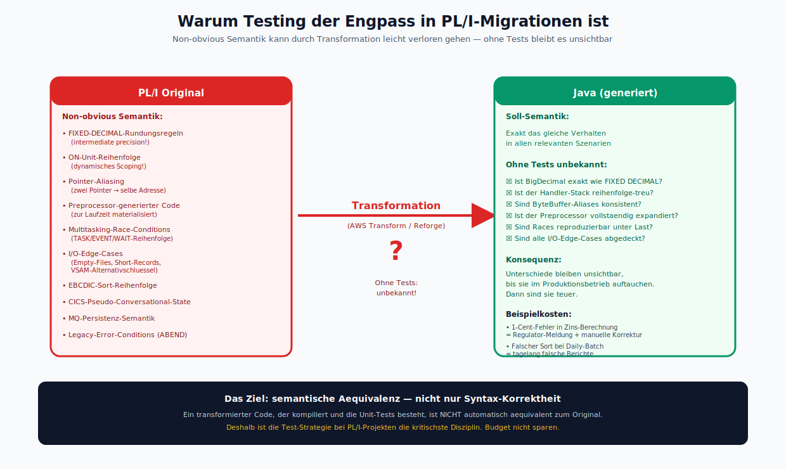

*Gegenueberstellung: PL/I-Original mit non-obvious Semantik (FIXED-DECIMAL, ON-Units, Pointer-Aliasing, Preprocessor, Multitasking, I/O-Edges) → Transformation → Java mit unbekannter Semantik. Ohne Tests bleibt jeder Semantik-Drift unsichtbar, bis er im Produktionsbetrieb auftaucht.*

In einer PL/I-zu-Java-Migration entsteht neuer Java-Code, der ein bestehendes, getestetes (oder zumindest produktiv laufendes) PL/I-System ablösen soll. Das Ziel ist **semantische Äquivalenz** — das neue System muss sich in **allen relevanten Szenarien** exakt wie das alte verhalten.

Die Gefahr: PL/I-Code enthält **non-obvious Semantik**, die durch die Transformation leicht verloren geht:
- FIXED-DECIMAL-Rundungsregeln (exakte Dezimalarithmetik)
- ON-Unit-Reihenfolge und dynamisches Scoping
- Pointer-Aliasing (zwei Pointer zeigen auf dieselbe Adresse)
- Preprocessor-generierter Code
- Multitasking-Race-Conditions
- Edge-Cases bei I/O (Empty-Files, Short-Records, VSAM-KSDS-Alternativschlüssel)

Ohne systematisches Testing bleiben diese Unterschiede unsichtbar, bis sie im Produktionsbetrieb auftauchen. Dann sind sie **teuer**.

---

## 2. Test-Pyramide für PL/I-zu-Java

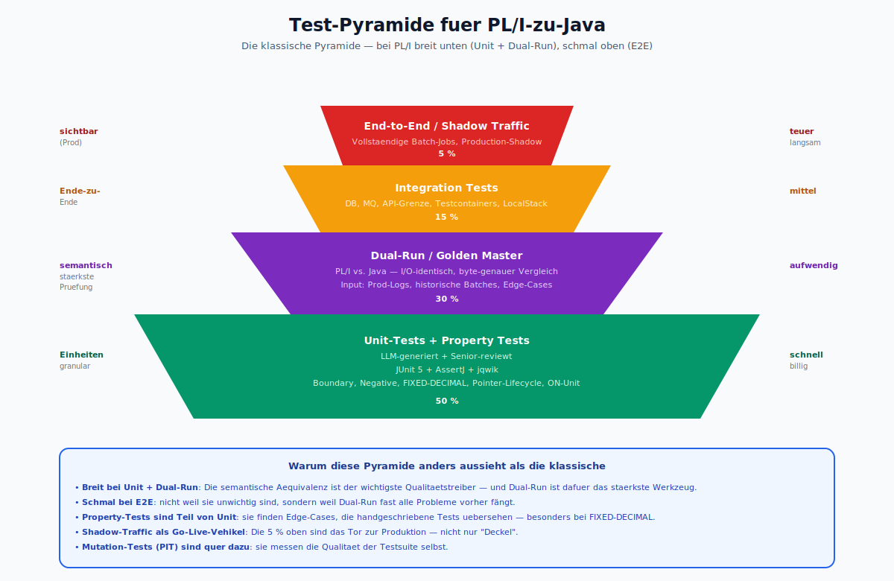

*Die Pyramide in ihrer PL/I-Auspraegung: breit unten (Unit 50 %, Dual-Run 30 %), schmal oben (Integration 15 %, E2E 5 %). Die Besonderheit: Dual-Run ist die semantisch staerkste Pruefung — deshalb breit, nicht oben. Die Insight-Box erklaert die Abweichung von der klassischen Pyramide.*

```
                    ╱‾‾‾‾‾‾‾‾‾‾‾‾‾‾╲
                   ╱ End-to-End /  ╲        5 %
                  ╱   Production    ╲
                 ╱  Shadow Traffic   ╲
                ╱──────────────────────╲
               ╱  Integration Tests    ╲    15 %
              ╱ (DB, MQ, API-Grenze)    ╲
             ╱──────────────────────────╲
            ╱   Dual-Run / Golden Master ╲  30 %
           ╱    (PL/I vs. Java, I/O-     ╲
          ╱     identisch)                ╲
         ╱──────────────────────────────────╲
        ╱    Unit-Tests + Property Tests    ╲  50 %
       ╱   (LLM-generiert + Senior reviews)  ╲
      ╱──────────────────────────────────────╲
```

Die Pyramide ist bei PL/I **breit** bei Unit- und Dual-Run-Tests. Integration und E2E machen einen kleineren Anteil aus — nicht weil sie unwichtig wären, sondern weil Golden-Master-Dual-Run die **semantisch stärkste** Prüfung liefert.

---

## 3. Unit-Tests (50 %)

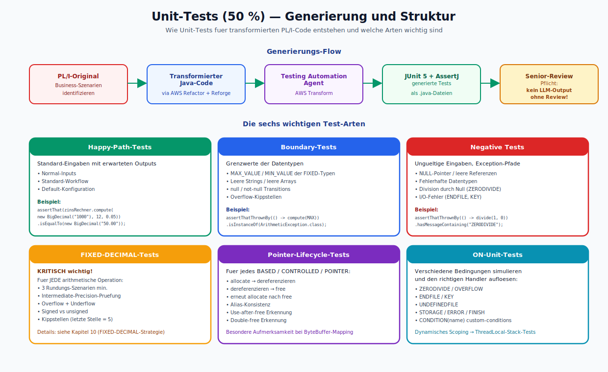

*Oben der Generierungs-Flow (PL/I → Java → Testing Agent → JUnit+AssertJ → Senior-Review). Darunter die sechs wichtigen Test-Arten als Karten: Happy-Path, Boundary, Negative, FIXED-DECIMAL, Pointer-Lifecycle, ON-Unit. Jede Karte mit einem kurzen Code-Beispiel.*

**Generierung:**

1. Der AWS Transform Testing Automation Agent (oder ein Custom-Agent auf Bedrock) erzeugt Unit-Tests auf Basis der transformierten Java-Klassen.
2. Der Agent liest auch das PL/I-Original, um Business-Logik-Szenarien zu identifizieren.
3. Die generierten Tests werden mit **JUnit 5** + **AssertJ** geschrieben.
4. Jeder Test wird von einem Senior-Engineer reviewt — **kein LLM-Output ohne Review**.

**Testarten:**

- **Happy-Path-Tests:** Standard-Eingaben, erwartete Outputs.
- **Boundary-Tests:** Grenzwerte (MAX/MIN FIXED, leere Strings, null-Arrays).
- **Negative Tests:** Ungültige Eingaben, Exception-Pfade.
- **FIXED-DECIMAL-Tests:** kritisch wichtig — für jede arithmetische Operation ein Test mit mindestens drei Rundungs-Szenarien.
- **Pointer-Lifecycle-Tests:** allocate, dereferenzieren, free, erneut allocate.
- **ON-Unit-Tests:** verschiedene Bedingungen simulieren und den richtigen Handler auslösen.

---

## 4. Property-Based Testing

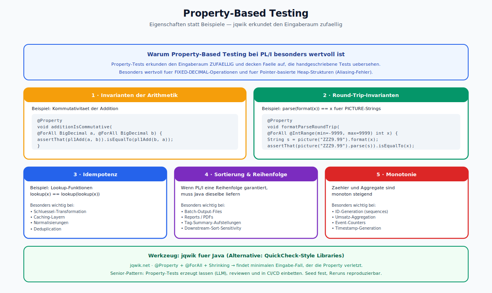

*Fuenf Property-Beispiele mit Code-Snippets: Invarianten der Arithmetik (Kommutativitaet), Round-Trip (parse/format), Idempotenz, Sortierung/Reihenfolge, Monotonie. Das Tool jqwik steht unten als empfohlene Java-Library.*

**Warum:** Property-Tests erkunden den Eingaberaum zufällig und decken Fälle auf, die handgeschriebene Tests übersehen.

**Tool:** **jqwik** für Java. Alternativ **QuickCheck-Style** Libraries.

**Beispiele für Properties:**

- **Invarianten der Arithmetik:** `add(a, b) == add(b, a)` für FIXED DECIMAL, innerhalb des definierten MathContext.
- **Round-Trip-Invarianten:** `parse(format(x)) == x` für PICTURE-Strings.
- **Idempotenz von Lookup-Funktionen.**
- **Sortierung / Reihenfolge:** wenn die PL/I-Ursprungsfunktion eine bestimmte Reihenfolge garantiert, muss die Java-Fassung dieselbe Reihenfolge liefern.
- **Monotonie** von Zähl- und Aggregationsfunktionen.

Property-Tests sind besonders wertvoll für FIXED-DECIMAL-Operationen und für Pointer-basiert-heap-Strukturen, wo Aliasing-Fehler nur bei bestimmten Inputs sichtbar werden.

---

## 5. Dual-Run und Golden Master (30 %)

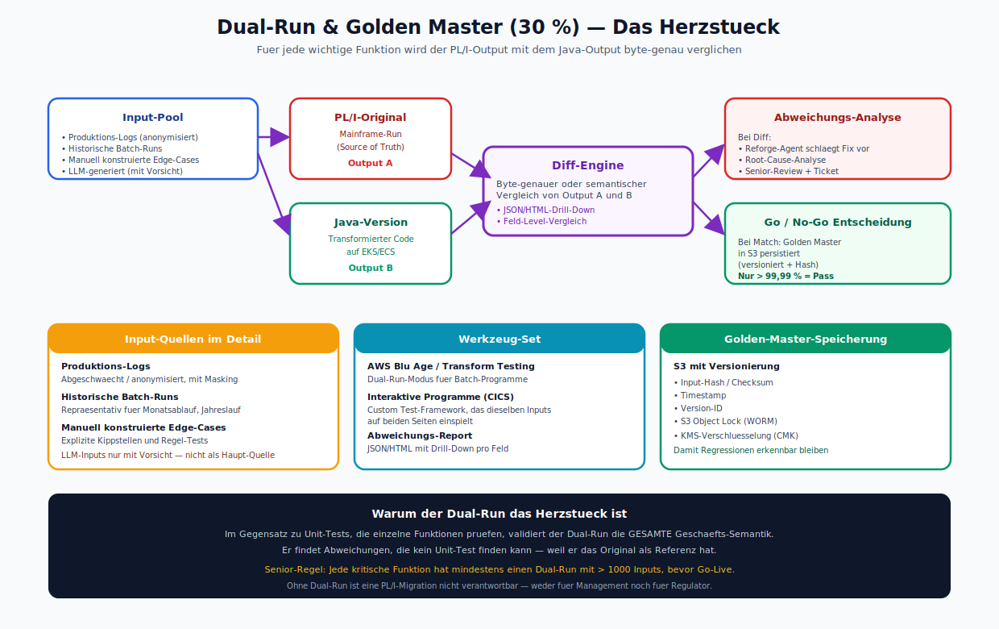

*Der komplette Dual-Run-Flow: Input-Pool → PL/I-Original + Java-Version parallel → Diff-Engine → Abweichungs-Analyse oder Golden-Master-Persistierung. Darunter die drei Detail-Karten fuer Input-Quellen, Werkzeug-Set und Golden-Master-Speicherung.*

Das Herzstück der PL/I-Migration. Idee:
1. Für jede wichtige Funktion/jede Transaktion wird ein Satz realistischer Test-Inputs zusammengestellt.
2. Jeder Input wird **sowohl** auf dem PL/I-Original **als auch** auf der Java-Version ausgeführt.
3. Die Outputs werden byte-genau oder semantisch verglichen.
4. Abweichungen werden analysiert.

**Input-Quellen:**

- Produktions-Logs (abgeschwächt / anonymisiert).
- Historische Batch-Runs.
- Manuell konstruierte Edge Cases.
- LLM-generierte Inputs (mit Vorsicht; der Agent kann unrealistische Inputs erzeugen).

**Werkzeug-Set:**

- **AWS Blu Age / Transform Testing Automation** bietet einen Dual-Run-Modus für Batch-Programme.
- Für interaktive Programme (CICS-Transaktionen) muss der Dual-Run mit einem Testframework nachgebaut werden, das dieselben Inputs auf beiden Seiten einspielt.
- Abweichungs-Report als JSON/HTML mit Drill-Down pro Feld.

**Golden-Master-Speicherung:** S3 mit Versionierung, inkl. Hash/Checksum der Eingabe, damit Regressionen erkennbar bleiben.

---

## 6. Integration-Tests (15 %)

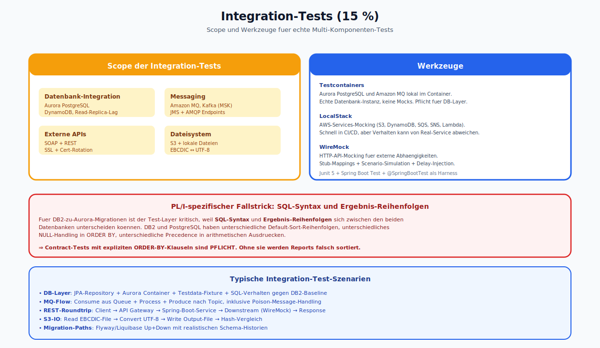

*Zwei Karten: links der Scope (DB, Messaging, APIs, Filesystem), rechts die Tools (Testcontainers, LocalStack, WireMock). Darunter die Warnung zu DB2-vs-PostgreSQL SQL-Syntax-Unterschieden und die typischen Test-Szenarien.*

**Scope:**
- Datenbank-Integration (Aurora PostgreSQL, DynamoDB).
- Messaging (Amazon MQ, Kafka).
- Externe APIs.
- Dateisystem (S3, lokale Dateien).

**Tools:**
- **Testcontainers** für Aurora und MQ.
- **LocalStack** für AWS-Services-Mocking.
- **WireMock** für externe HTTP-APIs.

**PL/I-spezifisch:** Für DB2-zu-Aurora-Migrationen ist der Test-Layer kritisch, weil **SQL-Syntax** und **Ergebnis-Reihenfolgen** sich zwischen den beiden Datenbanken unterscheiden können. Contract-Tests mit expliziten ORDER-BY-Klauseln sind Pflicht.

---

## 7. End-to-End- und Shadow-Tests (5 %)

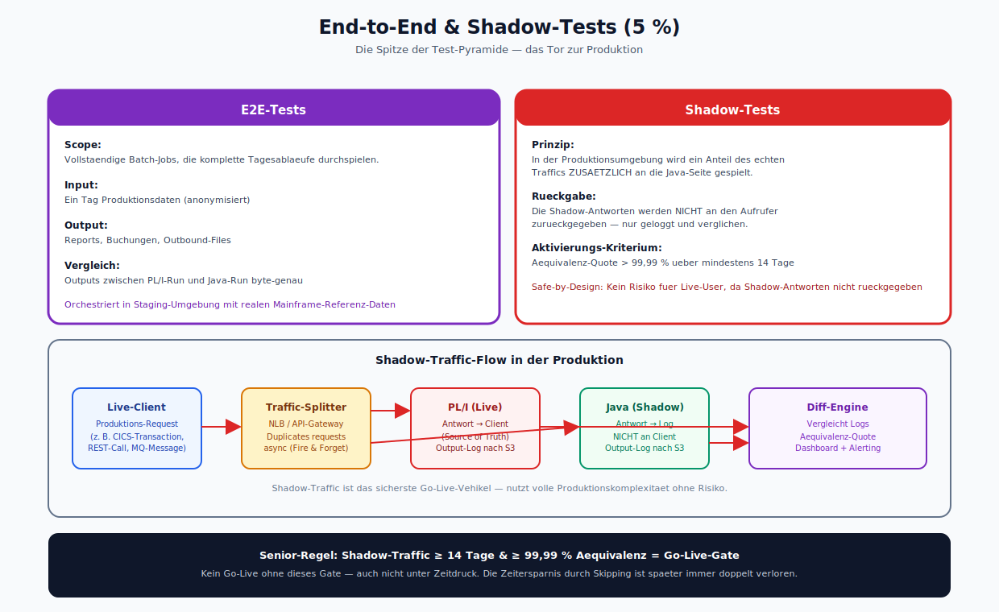

*Oben die Gegenueberstellung E2E (vollstaendige Batch-Jobs mit bekannten Inputs) vs. Shadow-Tests (Produktions-Traffic parallel auf beide Seiten). Unten der detaillierte Shadow-Traffic-Flow mit Traffic-Splitter, PL/I-Live, Java-Shadow und Diff-Engine. Senior-Regel: 14 Tage + 99,99 % Aequivalenz = Go-Live-Gate.*

**E2E-Tests:**
- Vollständige Batch-Jobs, die komplette Tagesläufe durchspielen.
- Eingabe: ein Tag Produktionsdaten, Ausgabe: Report, Buchungen, Outbound-Files.
- Vergleich: Outputs zwischen PL/I-Run und Java-Run.

**Shadow-Tests:**
- In der Produktionsumgebung wird ein Anteil des echten Traffics **zusätzlich** an die Java-Seite gespielt.
- Die Antworten werden nicht an den Aufrufer zurückgegeben (Shadow), sondern nur geloggt und mit den PL/I-Antworten verglichen.
- Ab einer definierten Äquivalenz-Quote (z. B. > 99,99 %) wird das Java-System aktiviert.

Shadow-Traffic ist das **sicherste Go-Live-Vehikel** für PL/I-Migrationen, weil es die vollständige Produktionskomplexität nutzt, ohne Risiken zu produzieren.

---

## 8. Mutation Testing

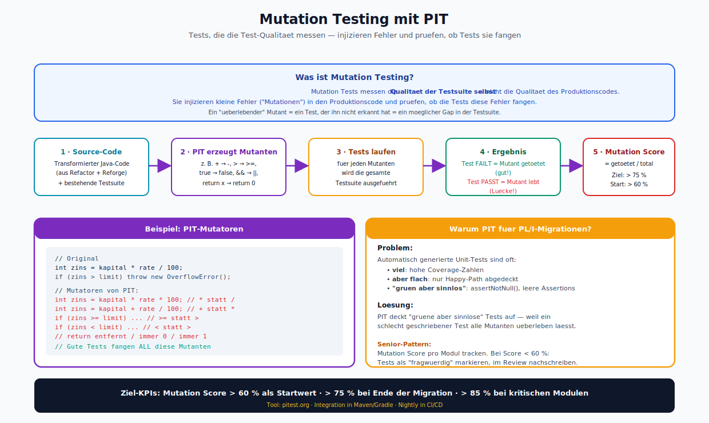

*Oben das Prinzip (Tests, die die Test-Qualitaet messen). Darunter der fuenfstufige Flow (Source → PIT erzeugt Mutanten → Tests laufen → Ergebnis → Mutation Score). Rechts das konkrete Code-Beispiel mit PIT-Mutatoren und die PL/I-spezifische Motivation ("gruene aber sinnlose" Tests aufdecken).*

**Warum:** Mutation Tests messen die Qualität der Testsuite selbst — sie injizieren kleine Fehler in den Produktionscode und prüfen, ob die Tests diese Fehler fangen.

**Tool:** **PIT (pitest.org)** für Java.

**Einsatz im PL/I-Kontext:** Besonders für transformierten Code sinnvoll, weil die automatisch generierten Unit-Tests oft **zu viel**, aber nicht **tief** genug testen. Mutation Tests decken "grüne aber sinnlose" Tests auf.

---

## 9. Test-Daten-Management

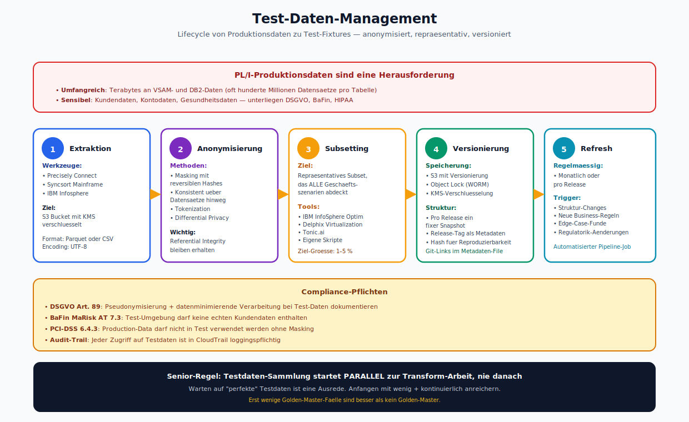

*Fuenf Stationen im Lifecycle: Extraktion → Anonymisierung → Subsetting → Versionierung → Refresh. Oben die Problem-Definition (umfangreich, sensibel, proprietaer), unten die Compliance-Pflichten (DSGVO Art. 89, BaFin MaRisk, PCI-DSS 6.4.3) und die Senior-Regel: parallel zur Transform-Arbeit starten.*

PL/I-Produktionsdaten sind oft:
- umfangreich (Terabytes an VSAM- und DB2-Daten),
- sensibel (Kunden-, Konto-, Gesundheits-Daten),
- in proprietären Formaten (EBCDIC, gepackte Dezimalzahlen).

**Strategie:**
1. **Extraktion:** mit Precisely Connect oder Syncsort aus dem Mainframe in S3.
2. **Anonymisierung:** Masking mit reversiblen Hashes, konsistent über Datensätze hinweg.
3. **Subsetting:** ein **repräsentatives** Subset, das alle Geschäftsszenarien abdeckt. Tools: **IBM InfoSphere Optim**, **Delphix**, eigene Skripte.
4. **Versionierung:** S3 mit Versionierung, pro Release ein fixer Snapshot.
5. **Refresh:** regelmäßige Aktualisierung der Snapshots, besonders bei strukturellen Änderungen in Produktionsdaten.

---

## 10. Kritische FIXED-DECIMAL-Teststrategie

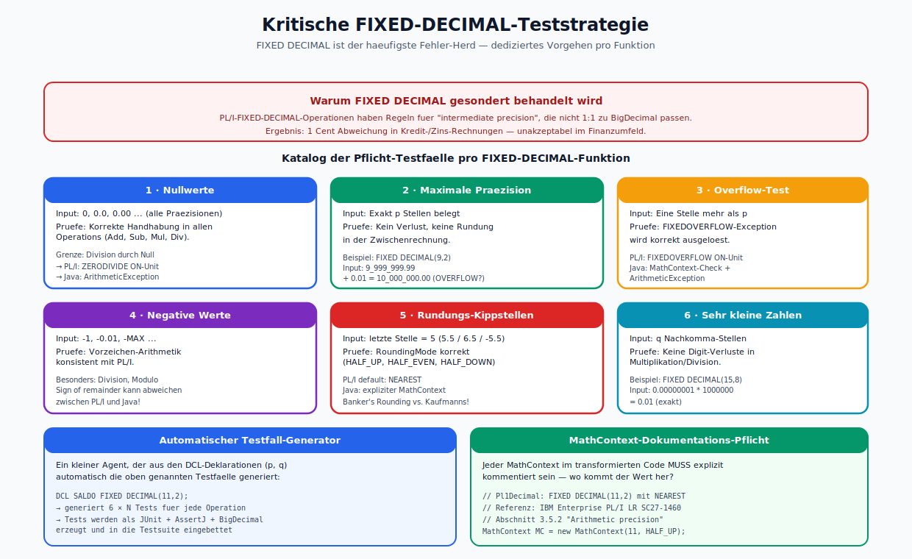

*Sechs Kategorien der Pflicht-Testfaelle: Nullwerte, Maximale Praezision, Overflow-Test, Negative Werte, Rundungs-Kippstellen, Sehr kleine Zahlen. Unten der automatische Testfall-Generator und die MathContext-Dokumentations-Pflicht mit Code-Beispiel.*

Weil FIXED DECIMAL der häufigste Fehler-Herd ist, hier ein dediziertes Vorgehen:

1. **Für jede PL/I-Funktion mit FIXED-DECIMAL-Arithmetik** wird ein Katalog von Test-Inputs erstellt, die mindestens folgende Fälle abdecken:
   - Nullwerte
   - Maximale Präzision (genau p Stellen)
   - Eine Stelle mehr als p (Overflow-Test)
   - Negative Werte
   - Rundungs-Kippstellen (letzte Stelle ist 5)
   - Sehr kleine Zahlen (q Nachkomma-Stellen)
2. **Dual-Run:** PL/I- und Java-Output direkt verglichen, auf Cent genau.
3. **Automatischer Generator:** Ein kleiner Agent, der aus den DCL-Deklarationen (p, q) automatisch die oben genannten Testfälle generiert.
4. **Dokumentation des RoundingMode:** jeder Java-MathContext im transformierten Code muss explizit kommentiert sein, wo der Wert herkommt und warum er gewählt wurde.

---

## 11. Testing im CI/CD-Pipeline

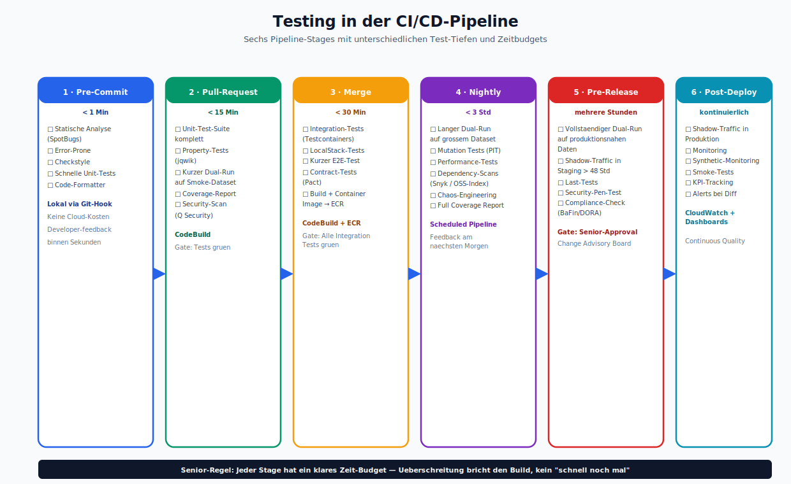

*Sechs Pipeline-Stages als vertikale Spalten: Pre-Commit (&lt; 1 Min), Pull-Request (&lt; 15 Min), Merge (&lt; 30 Min), Nightly (&lt; 3 Std), Pre-Release (mehrere Std), Post-Deploy (kontinuierlich). Jede Spalte mit Checkliste, Tool und Zeit-Budget.*

**Pipeline-Schritte:**

1. **Pre-Commit:** statische Analyse (SpotBugs, Error-Prone), schnelle Unit-Tests.
2. **Pull-Request:** kompletter Unit-Test-Suite + Property-Tests + kurzer Dual-Run auf einem Smoke-Dataset.
3. **Merge:** Integration-Tests mit Testcontainers + kurzer E2E-Testlauf.
4. **Nightly:** langer Dual-Run auf einem größeren Dataset + Mutation-Tests.
5. **Pre-Release:** vollständiger Dual-Run auf produktionsnahen Daten + Shadow-Traffic in Staging.
6. **Post-Deploy:** Shadow-Traffic in Produktion, Monitoring.

---

## 12. KPIs

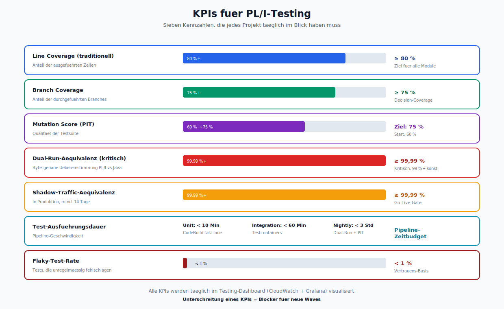

*Sieben KPIs als horizontale Balken-Gauges: Line Coverage, Branch Coverage, Mutation Score, Dual-Run-Aequivalenz, Shadow-Traffic-Aequivalenz, Test-Ausfuehrungsdauer, Flaky-Test-Rate. Jeder mit Soll-Wert und aktueller Visualisierung.*

Empfohlene Kennzahlen für eine PL/I-Migration:

- **Line Coverage** (traditional): 80 %+ auf dem transformierten Java-Code.
- **Branch Coverage:** 75 %+
- **Mutation Score** (PIT): 60 %+ als Startwert, ziel 75 %+
- **Dual-Run-Äquivalenz:** 99,99 %+ für kritische Module, 99 %+ für nicht-kritische.
- **Shadow-Traffic-Äquivalenz:** 99,99 %+ über mindestens 14 Tage, bevor Go-Live.
- **Test-Ausführungsdauer:** Unit-Tests < 10 Min, Integration-Tests < 60 Min.
- **Flaky-Test-Rate:** < 1 %.

---

## 13. Rollen im Test-Team

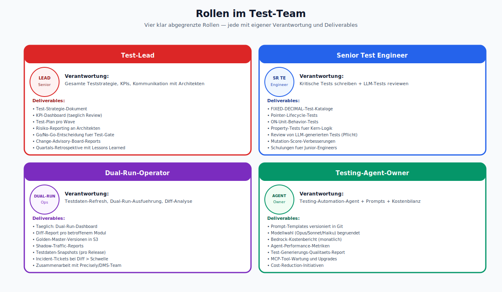

*Vier Rollen als Karten: Test-Lead, Senior Test Engineer, Dual-Run-Operator, Testing-Agent-Owner. Jede Karte mit Verantwortung und konkreten Deliverables. Die Rollen ergaenzen sich, ueberschneiden sich aber nicht.*

- **Test-Lead:** verantwortet Strategie, KPIs, Kommunikation mit Architekten.
- **Senior-Test-Engineer:** schreibt kritische Tests, reviewt LLM-generierte Tests.
- **Dual-Run-Operator:** verantwortet Testdaten-Refresh, Dual-Run-Ausführung, Diff-Analyse.
- **Testing-Agent-Owner:** kümmert sich um den Testing-Automation-Agent, seine Prompts und seine Kostenbilanz.

---

## 14. Was agentic Engineering im Testing leistet — und was nicht

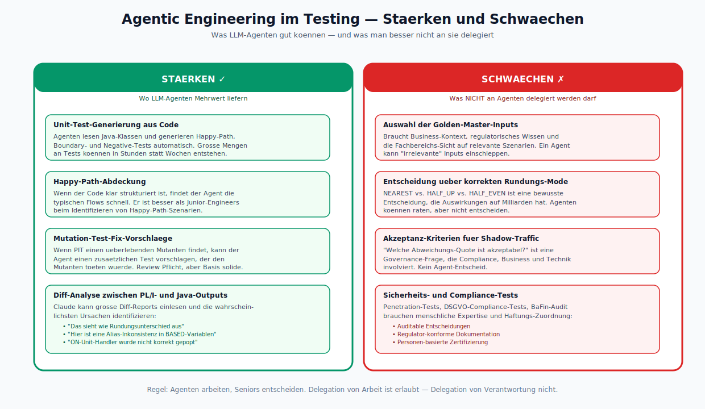

*Zwei Spalten: Links die Staerken (Unit-Test-Generierung, Happy-Path-Abdeckung, Mutation-Fix-Vorschlaege, Diff-Analyse). Rechts die Schwaechen (Golden-Master-Auswahl, Rundungs-Mode-Entscheidung, Shadow-Akzeptanz, Security/Compliance-Tests). Regel unten: Agenten arbeiten, Seniors entscheiden.*

**Stärken:**
- Unit-Test-Generierung aus Code.
- Happy-Path-Abdeckung.
- Mutation-Test-Fix-Vorschläge.
- Diff-Analyse zwischen PL/I- und Java-Outputs.

**Schwächen (nicht an Agents delegieren):**
- Auswahl der Golden-Master-Inputs (braucht Business-Kontext).
- Entscheidung, welcher Rundungs-Mode korrekt ist.
- Akzeptanz-Kriterien für Shadow-Traffic.
- Sicherheits- und Compliance-Tests.

---

## 15. Referenzen

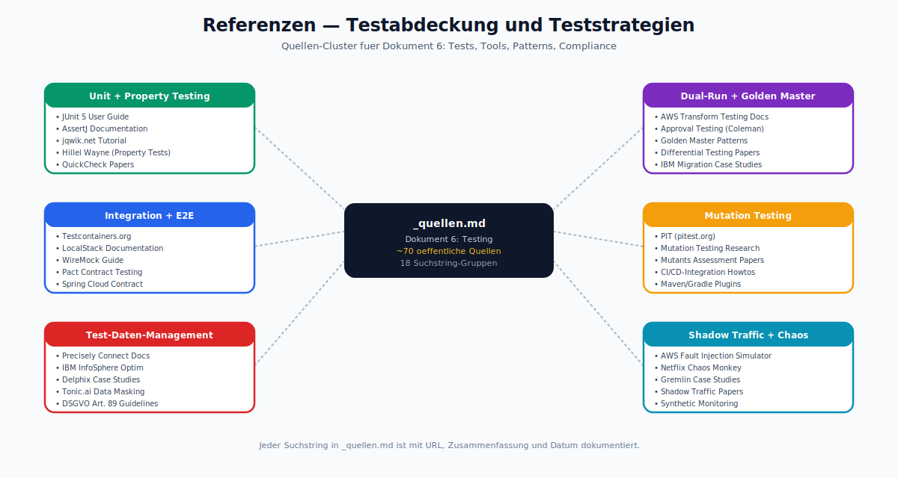

*Sechs Quellen-Cluster: Unit+Property Testing, Dual-Run+Golden Master, Integration+E2E, Mutation Testing, Test-Daten-Management, Shadow Traffic+Chaos. ~70 oeffentliche Quellen, 18 Suchstring-Gruppen in `_quellen.md`.*

Siehe `_quellen.md`.
