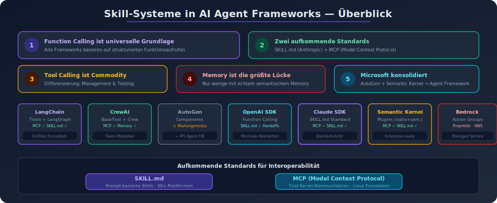

# Skill-Systeme in AI Agent Frameworks - Uebersicht

## Recherche-Datum
2026-04-05

## Visualisierung

## Zusammenfassung

Diese Recherche analysiert die Skill- und Tool-Systeme von sieben fuehrenden AI Agent Frameworks. Die wichtigsten Erkenntnisse:

1. **Function Calling ist die universelle Grundlage** aller Frameworks. Jedes Framework erlaubt LLMs, strukturierte Funktionsaufrufe zu generieren.

2. **Zwei aufkommende Standards** praeegen die Landschaft:
   - **SKILL.md** (Anthropic, Dezember 2025): Offener Standard fuer prompt-basierte Agent Skills, adoptiert von Claude, OpenAI Codex, VS Code, Cursor, Gemini CLI und Microsoft.
   - **MCP (Model Context Protocol)**: Offener Standard fuer Tool-Server-Kommunikation, adoptiert von LangChain, CrewAI, Semantic Kernel und Claude.

3. **Tool Calling ist Commodity** - die Differenzierung liegt bei Tool-Management, Credential-Handling und Testing.

4. **Memory bleibt die groesste Luecke** - nur wenige Frameworks bieten echtes semantisches Memory.

5. **Microsoft konsolidiert** AutoGen und Semantic Kernel zum "Microsoft Agent Framework" (GA geplant Q1 2026).

## Dateien in diesem Verzeichnis

| Datei | Inhalt |
|-------|--------|
| `00_uebersicht.md` | Diese Uebersicht |
| `01_langchain_langgraph.md` | LangChain/LangGraph Tools und Skills Architektur |
| `02_crewai.md` | CrewAI Skills/Tools System |
| `03_autogpt_autogen.md` | AutoGPT Components und AutoGen Skills |
| `04_openai_agents_sdk.md` | OpenAI Agents SDK Tool/Function Calling |
| `05_claude_agent_sdk.md` | Anthropic Claude Agent SDK und SKILL.md Standard |
| `06_semantic_kernel.md` | Microsoft Semantic Kernel Skills/Plugins |
| `07_amazon_bedrock_agents.md` | Amazon Bedrock Agents Action Groups |
| `08_vergleich_und_best_practices.md` | Vergleichsmatrix und Best Practices |
| `_quellen.md` | Alle genutzten Quellen mit URLs und Zusammenfassungen |
