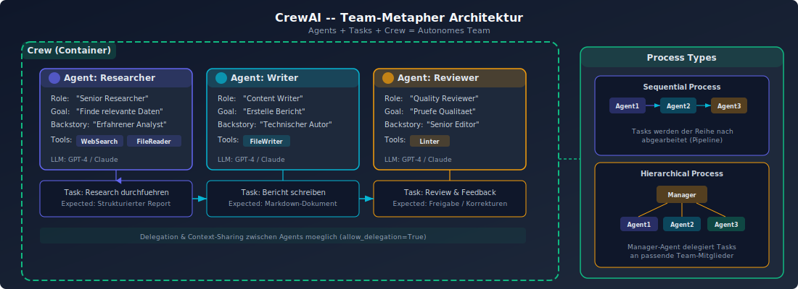

# CrewAI - Skills und Tools System

## Ueberblick

CrewAI verfolgt ein "organisatorisches Architektur"-Paradigma, bei dem Entwickler "Mitarbeiter (Agents)" mit Hintergrundgeschichten und Skills definieren, "Tasks" mit erwarteten Ergebnissen formulieren und diese zu einem "Team (Crew)" zusammenstellen.

## Kern-Architektur



### Agents
- **Role:** Die Funktion des Agents (z.B. "Senior Research Analyst")
- **Goal:** Das Ziel im OKR-Stil
- **Backstory:** Der "Lebenslauf" des Agents
- **Tools:** Die Skills/Faehigkeiten des Agents

### Tasks
- **Description:** Anforderungsdokument fuer die Aufgabe
- **Expected Output:** Lieferstandard
- Jede Task wird einem spezifischen Agent zugewiesen

### Crew
- Container, der Agents und Tasks koordiniert
- Bestimmt die Ausfuehrungsreihenfolge (Process)

### Process-Typen
- **Sequential:** Tasks werden nacheinander in fester Reihenfolge ausgefuehrt
- **Hierarchical:** Ein Manager Agent weist Tasks dynamisch zu

## Tools-System

### Architektur
CrewAI implementiert eine modulare Tool-Architektur, die das Core Framework von den Tool-Implementierungen trennt. Agents und Tasks konsumieren Tools ueber das `BaseTool`-Interface.

### Tool-Erstellung
Zwei Patterns fuer die Tool-Erstellung:

1. **`@tool` Decorator** - fuer einfache Funktionen:
   ```python
   @tool("Search Tool")
   def search(query: str) -> str:
       """Durchsucht das Web nach Informationen."""
       return search_engine.search(query)
   ```

2. **`BaseTool` Subclassing** - fuer komplexe Implementierungen mit State Management:
   ```python
   class MyCustomTool(BaseTool):
       name: str = "Custom Tool"
       description: str = "Beschreibung"
       def _run(self, argument: str) -> str:
           return result
   ```

### Built-in Tool-Kategorien (80+ Tools)
- **File Operations:** DirectoryReadTool, FileReadTool, FileWriterTool
- **Web Tools:** ScrapeWebsiteTool, WebsiteSearchTool
- **Search Integration:** SerperDevTool, EXASearchTool
- **Document Processing:** PDFSearchTool, DOCXSearchTool
- **Data Tools:** CSVSearchTool, JSONSearchTool
- **Database Tools:** PGSearchTool
- **RAG Tools:** RagTool
- **Spezialisierte Tools:** CodeInterpreterTool, DALL-E Tool, YoutubeVideoSearchTool

## MCP-Unterstuetzung

CrewAI hat native MCP-Unterstuetzung in den letzten 6 Monaten eingefuehrt, was die Integration mit externen Tool-Servern deutlich vereinfacht.

## Built-in Memory

CrewAI ist eines der wenigen Frameworks, das echtes eingebautes Memory mitbringt (nicht nur State-Checkpointing), was fuer kontextbewusste Agent-Interaktionen wichtig ist.

## Staerken und Schwaechen

### Staerken
- Intuitive "Team"-Metapher fuer Multi-Agent-Systeme
- 80+ vorgefertigte Tools
- Echtes Built-in Memory
- Native MCP-Unterstuetzung
- Aktive Weiterentwicklung (im Gegensatz zu AutoGen)

### Schwaechen
- Weniger flexibel als LangGraph fuer komplexe Orchestrierung
- Hierarchischer Process kann bei vielen Agents unuebersichtlich werden
- Geringere Community-Groesse als LangChain
