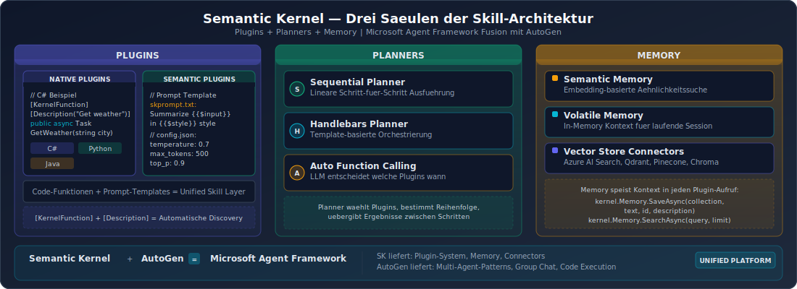

# Microsoft Semantic Kernel - Skills/Plugins Architektur

## Ueberblick

Semantic Kernel ist Microsofts AI-Orchestrierungs-Framework mit ueber 27.000 GitHub Stars (Stand 2026). Es ermoeglicht die Definition von Skills (wiederverwendbare Funktionen), die Erstellung semantischer Funktionen (natuerlichsprachliche Prompts) und den Aufbau komplexer Workflows.

## Kern-Architektur



Die Architektur basiert auf drei Saeulen:

### 1. Plugins (Skills)
- Kapseln AI-Faehigkeiten in wiederverwendbare Einheiten
- Jedes Plugin enthaelt eine oder mehrere Funktionen
- Funktionen koennen **nativ** (Code) oder **semantisch** (Prompts) sein

### 2. Planners
- Orchestrieren Multi-Step-Operationen
- Bestimmen automatisch, welche Plugins in welcher Reihenfolge aufgerufen werden
- Verschiedene Planner-Strategien verfuegbar

### 3. Memory
- Stellt Kontext und Personalisierung bereit
- Unterstuetzt verschiedene Memory-Backends

## Plugin-System im Detail

### Native Plugins
In C#, Python oder Java geschriebene Funktionen:
```python
@kernel_function(description="Sucht nach Informationen")
def search(self, query: str) -> str:
    return search_engine.query(query)
```

### Semantic Plugins
Prompt-basierte Funktionen mit Template-Syntax:
```
Fasse den folgenden Text zusammen: {{$input}}
```

### Function Calling Mechanismus
1. AI-Modell erkennt den Bedarf fuer eine spezifische Funktion
2. Modell fordert die Funktion namentlich an
3. Semantic Kernel routet die Anfrage zum entsprechenden Plugin
4. Ergebnis wird zurueck ans Modell gegeben

### Plugin-Erstellung
Plugins koennen erstellt werden ueber:
- **Nativen Code** (C#, Python, Java)
- **OpenAPI-Spezifikationen** (Import bestehender APIs)
- **MCP Server** fuer breitere Interoperabilitaet

## Microsoft Agent Framework (ab Oktober 2025)

### Fusion mit AutoGen
- Semantic Kernel und AutoGen wurden zum "Microsoft Agent Framework" zusammengefuehrt
- Semantic Kernel liefert die produktionsreife Grundlage
- AutoGen bringt dynamische Multi-Agent-Orchestrierung ein
- Ziel: GA bis Ende Q1 2026

### Auswirkungen auf das Plugin-System
- Plugins bleiben das zentrale Erweiterungskonzept
- Zusaetzlich: Agent Skills Standard (SKILL.md) wird unterstuetzt
- Native MCP-Integration
- Azure AI Foundry als Cloud-Deployment-Plattform

## Aktuelle Entwicklungen (2025/2026)

- Enhanced Streaming Response Support
- Verbessertes Error Handling
- Erweiterte Connector-Bibliotheken fuer neue AI-Services
- Multi-modale AI-Unterstuetzung (Text, Bilder, Audio) in Entwicklung
- Integration mit Microsoft Semantic Workbench (visuelle Entwicklungsumgebung)
- Hunderte Community-Plugins fuer Salesforce, Slack, Jira, Google Workspace etc.

## Sprachen-Unterstuetzung

- **C# / .NET** (primaere Implementierung)
- **Python**
- **Java**

## Staerken und Schwaechen

### Staerken
- Enterprise-ready mit Microsoft-Support
- Starke Azure-Integration
- Flexible Plugin-Architektur (nativ + semantisch)
- OpenAPI-Import fuer bestehende APIs
- Multi-Language-Support (C#, Python, Java)
- Planner fuer automatische Orchestrierung

### Schwaechen
- Starke Bindung an Microsoft-Ecosystem
- Komplexere Einrichtung als leichtgewichtige Alternativen
- Unsichere Zukunft als eigenstaendiges Produkt vs. Microsoft Agent Framework
- C#-zentrische Dokumentation (Python/Java hinken nach)
