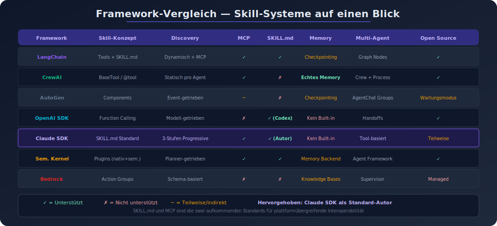

# Vergleich der Skill-Systeme: Gemeinsamkeiten, Unterschiede, Best Practices

## Vergleichsmatrix

| Kriterium | LangChain/LangGraph | CrewAI | AutoGen | OpenAI Agents SDK | Claude Agent SDK | Semantic Kernel | Bedrock Agents |
|-----------|-------------------|--------|---------|-------------------|-----------------|----------------|---------------|
| **Skill-Konzept** | Tools + Skills (SKILL.md) | Tools (BaseTool/@tool) | Components + Extensions | Function Calling + Hosted Tools | Agent Skills (SKILL.md) | Plugins (nativ + semantisch) | Action Groups |
| **Registrierung** | Decorator / BaseTool / MCP | Decorator / BaseTool | Extensions Layer | @function_tool / Hosted | SKILL.md Verzeichnisse | Kernel Functions / OpenAPI | OpenAPI / Function Details |
| **Discovery** | Dynamisch + MCP | Statisch pro Agent | Event-getrieben | Modell-getrieben | 3-Stufen Progressive Disclosure | Planner-getrieben | Schema-basiert |
| **MCP-Support** | Ja (langchain-mcp-adapters) | Ja (nativ) | Ja (ueber Studio) | Nein (eigenes System) | Ja (nativ) | Ja (nativ) | Nein |
| **SKILL.md** | Ja | Nein | Nein | Ja (Codex) | Ja (Standard-Autor) | Ja (Agent Framework) | Nein |
| **Memory** | Checkpointing | Echtes Memory | Checkpointing | Kein Built-in | Kein Built-in | Memory Backend | Knowledge Bases |
| **Multi-Agent** | LangGraph Nodes | Crew + Process | AgentChat Groups | Handoffs | Tool-basiert | Agent Framework | Supervisor + Subagents |
| **Sprachen** | Python, JS | Python | Python, .NET | Python, TypeScript | Python, TypeScript | C#, Python, Java | Sprachagnostisch (API) |
| **Open Source** | Ja | Ja | Ja (Wartungsmodus) | Ja | Teilweise | Ja | Nein (Managed Service) |

## Gemeinsamkeiten aller Frameworks

### 1. Function Calling als Grundlage
Alle Frameworks basieren auf dem Prinzip, dass LLMs strukturierte Funktionsaufrufe generieren. Das Modell erhaelt Funktionsdefinitionen (Name, Beschreibung, Parameter-Schema) und entscheidet eigenstaendig, wann welche Funktion aufgerufen wird.

### 2. Schema-basierte Tool-Definition
Jedes Framework nutzt ein Schema (JSON Schema, Pydantic, OpenAPI), um Tools zu beschreiben. Dies ermoeglicht dem Modell, die korrekte Parameterisierung zu generieren.

### 3. Modularer Aufbau
Skills/Tools sind in allen Frameworks als eigenstaendige, wiederverwendbare Module konzipiert, die unabhaengig entwickelt, getestet und deployt werden koennen.

### 4. Beschreibungs-getriebene Auswahl
In allen Frameworks waehlt das LLM Tools basierend auf deren textueller Beschreibung aus. Die Qualitaet der Tool-Beschreibung ist daher entscheidend fuer die korrekte Nutzung.

## Wesentliche Unterschiede

### Abstraktionsebene

| Ebene | Frameworks | Beschreibung |
|-------|-----------|--------------|
| **Low-Level (Function Calling)** | OpenAI Agents SDK | Direktes Function Calling, minimale Abstraktion |
| **Mid-Level (Tools)** | LangChain, CrewAI, Bedrock | Tool-Abstraktionen mit Typ-Sicherheit und Validierung |
| **High-Level (Skills/Plugins)** | Claude Agent SDK, Semantic Kernel | Prompt-basierte Spezialisierungen mit Metadaten und Discovery |

### Prompt-basiert vs. Code-basiert

- **Prompt-basierte Skills** (Claude SKILL.md, Semantic Kernel Semantic Functions): Instruktionen in natuerlicher Sprache, die das Verhalten des Agents steuern
- **Code-basierte Tools** (LangChain, CrewAI, OpenAI): Python/JS-Funktionen, die tatsaechlich Code ausfuehren

### Offene Standards vs. proprietaere Systeme

- **Offener Standard:** SKILL.md (Anthropic) - plattformuebergreifend nutzbar
- **MCP (Model Context Protocol):** Offener Standard fuer Tool-Server-Kommunikation
- **Proprietaer:** Bedrock Action Groups, OpenAI Hosted Tools

## SKILL.md als aufkommender Standard

Der von Anthropic eingefuehrte SKILL.md-Standard hat sich als de-facto-Standard fuer prompt-basierte Agent Skills etabliert:

- **Unterstuetzt von:** Claude Code, OpenAI Codex, VS Code/Copilot, Cursor, Gemini CLI, Microsoft Agent Framework
- **Vorteile:**
  - Plattformuebergreifende Portabilitaet
  - Token-effizientes 3-Stufen-Discovery
  - Einfache Erstellung (nur Markdown)
  - Versionierbar in Git
- **Einschraenkungen:**
  - Primaer prompt-basiert, nicht fuer komplexe Code-Ausfuehrung
  - Junger Standard (Dezember 2025)

## MCP als Tool-Interoperabilitaets-Standard

Das Model Context Protocol (MCP) hat sich als Standard fuer die Tool-Server-Kommunikation durchgesetzt:

- **Adoptiert von:** LangChain, CrewAI, Semantic Kernel, Claude
- **Nicht adoptiert:** OpenAI (eigenes System), Bedrock (AWS-nativ)
- **Vorteile:** Ein Tool-Server funktioniert mit jedem MCP-kompatiblen Client
- **Architektur:** Host-Client-Pattern mit Multi-Server-Support

## Trend-Analyse 2026

### 1. Tool Calling ist Commodity
Alle Frameworks bieten zuverlaessiges Tool Calling. Die Differenzierung liegt bei:
- Management von vielen Tools ueber mehrere Agents
- Credential-Rotation
- Testing von Tool-Interaktionen vor dem Deployment

### 2. Memory ist die groesste Luecke
Nur wenige Frameworks (CrewAI, Google ADK) bieten echtes semantisches Memory. Die meisten beschraenken sich auf State-Checkpointing.

### 3. Konvergenz durch Standards
SKILL.md und MCP fuehren zu einer Konvergenz: Skills und Tools werden zunehmend plattformuebergreifend wiederverwendbar.

### 4. Multi-Agent wird Standard
Alle grossen Frameworks unterstuetzen Multi-Agent-Szenarien, wenn auch mit unterschiedlichen Ansaetzen (Graph, Crew, Supervisor, Handoff).

## Best Practices

### 1. Tool-Beschreibungen optimieren
Die Beschreibung ist das Wichtigste an einem Tool. Sie muss klar, praezise und fuer das LLM verstaendlich sein. Schlechte Beschreibungen fuehren zu falscher Tool-Auswahl.

### 2. Nicht zu viele Tools gleichzeitig
Ab ca. 15-20 Tools sinkt die Auswahlqualitaet des LLMs. Besser: Tools thematisch gruppieren und nur relevante Gruppen laden.

### 3. SKILL.md fuer plattformuebergreifende Skills nutzen
Wenn eine Skill plattformuebergreifend funktionieren soll, ist SKILL.md der empfohlene Standard.

### 4. MCP fuer Tool-Server verwenden
Fuer wiederverwendbare Tool-Server ist MCP der beste Ansatz, da er die groesste Framework-Kompatibilitaet bietet.

### 5. Structured Outputs aktivieren
Wo verfuegbar (OpenAI, Claude), Structured Outputs nutzen fuer zuverlaessige Parameter-Generierung.

### 6. Testing vor Deployment
Tool-Interaktionen systematisch testen, bevor sie in Produktion gehen. Besonders wichtig bei Multi-Agent-Systemen, wo Fehler kaskadieren koennen.

### 7. Progressive Disclosure anwenden
Nicht alle Tool-Beschreibungen beim Start laden. Das 3-Stufen-Modell von SKILL.md (Name -> Instruktionen -> Ressourcen) ist auch fuer eigene Systeme ein gutes Pattern.

### 8. Framework-Wahl nach Anwendungsfall

| Anwendungsfall | Empfehlung |
|----------------|-----------|
| Komplexe Orchestrierung | LangGraph |
| Team-basierte Multi-Agent-Systeme | CrewAI |
| Minimale Abstraktion, schneller Start | OpenAI Agents SDK |
| Plattformuebergreifende Skills | Claude Agent SDK (SKILL.md) |
| Enterprise / Microsoft-Ecosystem | Semantic Kernel / Microsoft Agent Framework |
| AWS-native Loesung | Amazon Bedrock Agents |
| Visuelle Agent-Erstellung | AutoGen Studio (Wartungsmodus beachten) |
