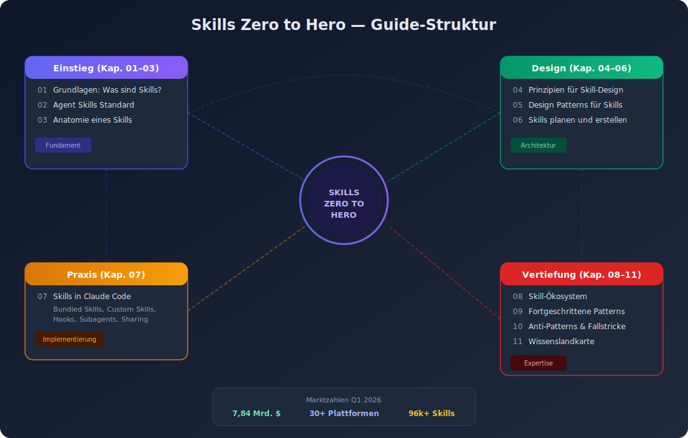

# Skills Zero to Hero — Vollständiger Guide

> Ein umfassender Guide für Senior Developer und Senior Architekten zum Thema Skills im Agentic Engineering.
> Stand: 2026-04-05

---

## Guide-Struktur Visualisierung

---

## Zielgruppe

Dieser Guide richtet sich an erfahrene Software-Entwickler und -Architekten, die Skills im Kontext von Agentic Engineering verstehen, planen und erstellen wollen. Vorausgesetzt werden Grundkenntnisse in LLM-basierter Entwicklung und Agent-Architektur.

---

## Inhaltsverzeichnis

| Nr. | Dokument | Inhalt |
|-----|----------|--------|
| 01 | [Grundlagen: Was sind Skills?](01_grundlagen_skills.md) | Definition, Abgrenzung, Einordnung im Agentic Engineering |
| 02 | [Der Agent Skills Standard](02_agent_skills_standard.md) | Offener Standard, Spezifikation, Cross-Platform-Adoption |
| 03 | [Anatomie eines Skills](03_skill_anatomie.md) | SKILL.md, Frontmatter, Verzeichnisstruktur, Lebenszyklus |
| 04 | [Prinzipien für Skill-Design](04_skill_prinzipien.md) | Kernprinzipien, Conciseness, Progressive Disclosure, Freedom Levels |
| 05 | [Design Patterns für Skills](05_skill_patterns.md) | Template, Workflow, Conditional, Feedback-Loop, Composition Patterns |
| 06 | [Skills planen und erstellen](06_skill_planung_erstellung.md) | Methodik, Evaluation-Driven Development, iterativer Prozess |
| 07 | [Skills in Claude Code](07_claude_code_skills.md) | Bundled Skills, Custom Skills, Invocation, Subagents, Hooks |
| 08 | [Skill-Ökosystem und Frameworks](08_skill_oekosystem.md) | MCP, Agent Skills Standard, Plattformen, Cross-Tool-Kompatibilität |
| 09 | [Fortgeschrittene Patterns](09_advanced_patterns.md) | Dynamic Context Injection, Shell Preprocessing, Multi-Agent Skills |
| 10 | [Anti-Patterns und Fallstricke](10_anti_patterns.md) | Häufige Fehler, Security-Risiken, Performance-Fallen |
| 11 | [Wissenslandkarte](11_skill_landkarte.md) | Vollständige Landkarte aller Wissenspunkte zu Skills |

---

## Kernaussagen

1. **Skills sind das zentrale Abstraktionsmittel** im Agentic Engineering — sie verpacken prozedurales Wissen in wiederverwendbare, entdeckbare Module.

2. **Der Agent Skills Standard** (agentskills.io) hat sich als offener, plattformübergreifender Standard etabliert, adoptiert von über 30 Agent-Produkten (Claude Code, VS Code Copilot, OpenAI Codex, Cursor, JetBrains Junie u.v.m.).

3. **Flow Engineering** hat Prompt Engineering als höchstwertiges Arbeitsfeld abgelöst — die Gestaltung von Kontrollflüssen, Zustandsübergängen und Entscheidungsgrenzen um LLM-Aufrufe herum ist die zentrale Architektur-Disziplin 2026.

4. **Skills folgen dem Prinzip der progressiven Offenlegung** — nur relevante Informationen werden zur Laufzeit in das Context Window geladen, um Token-Effizienz zu maximieren.

5. **Evaluation-Driven Development** ist der empfohlene Ansatz für Skill-Erstellung — erst Evaluierungen erstellen, dann den minimalen Skill schreiben, der diese besteht.

---

## Marktzahlen und Kontext (Stand Q1 2026)

- **Enterprise Agentic AI Markt**: 7,51 Mrd. USD (CAGR 27,3%)
- **AI-Agent-Markt gesamt**: 7,84 Mrd. USD, Prognose 52,62 Mrd. USD bis 2030
- **Gartner**: 40% der Enterprise-Anwendungen werden bis Ende 2026 AI Agents einbetten
- **Agent Skills Standard**: 30+ Plattformen, 96.000+ Skills auf Community-Hubs
- **Reifegradlücke**: Nur 14% der Unternehmen haben produktionsreife Agentic-AI-Lösungen
- **Sicherheit**: 341 bösartige Skills identifiziert, 82% der MCP-Server anfällig für Path Traversal

---

## Ergänzende Recherche-Ergebnisse

Die Subagenten-Recherche hat zusätzliche Verzeichnisse mit vertieftem Material erstellt:

| Verzeichnis | Inhalt |
|------------|--------|
| `agent_doc/claude_code_skill_system/` | Claude Code Skill-System Übersicht |
| `agent_doc/skill_systeme_frameworks/` | 8 Framework-Vergleiche (LangChain, CrewAI, OpenAI, etc.) |
| `agent_doc/skill_design_best_practices/` | Recherche zu Skill Design Best Practices |
| `agent_doc/mcp_und_tool_protokolle/` | MCP Spezifikation und Tool-Protokolle |
| `agent_doc/agentic_ai_trends_2025_2026/` | Aktuelle Trends und Marktdaten |

---

## Leseempfehlung

- **Einstieg**: Kapitel 01–03 für Grundverständnis
- **Design und Architektur**: Kapitel 04–06 für Skill-Design-Kompetenz
- **Praxis**: Kapitel 07 für Claude-Code-spezifische Implementierung
- **Vertiefung**: Kapitel 08–10 für fortgeschrittene Themen
- **Referenz**: Kapitel 11 als Wissenslandkarte für den schnellen Zugriff
