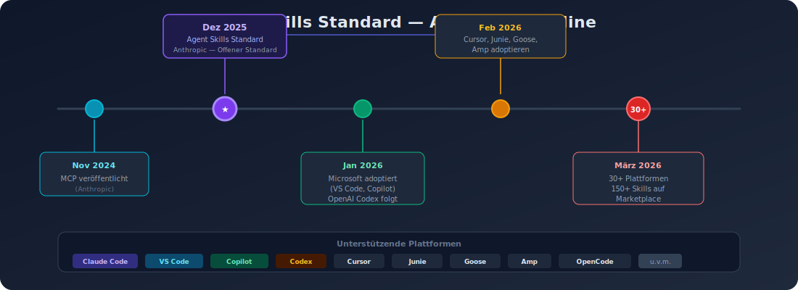
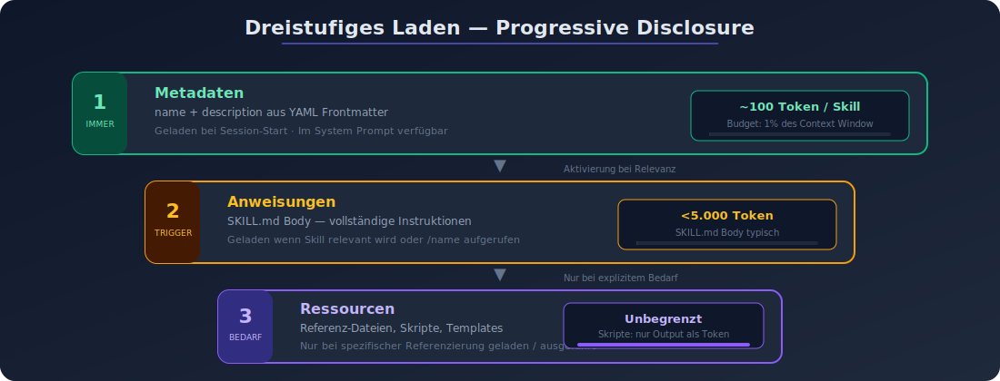
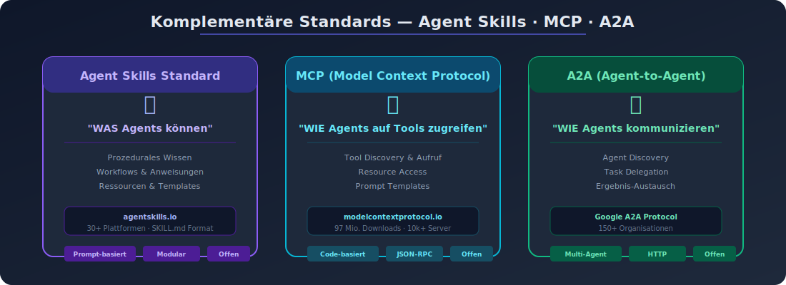

# 02 — Der Agent Skills Standard

## Überblick

Der **Agent Skills Standard** ist ein offener, plattformübergreifender Standard für die Definition und Verteilung von AI Agent Skills. Ursprünglich von Anthropic im Dezember 2025 veröffentlicht, wird er als unabhängiger offener Standard unter agentskills.io gepflegt.

> "Agent Skills are a simple, open format for giving agents new capabilities and expertise."
> — agentskills.io

---

## Geschichte und Adoption



### Timeline

| Datum | Ereignis |
|-------|----------|
| November 2024 | Anthropic veröffentlicht MCP (Model Context Protocol) |
| Dezember 2025 | Anthropic veröffentlicht Agent Skills als offenen Standard |
| Januar 2026 | Microsoft adoptiert Agent Skills in VS Code und GitHub Copilot |
| Januar 2026 | OpenAI integriert Agent Skills in Codex |
| Februar 2026 | Cursor, JetBrains Junie, Goose, Amp adoptieren den Standard |
| März 2026 | Über 30 Agent-Produkte unterstützen Agent Skills |
| März 2026 | claudemarketplace.com listet über 150 Skills |

### Unterstützende Plattformen

**Anthropic-Ökosystem:**
- Claude Code (CLI, Desktop, Web, IDE-Extensions)
- Claude.ai (Pro, Max, Team, Enterprise)
- Claude API (v1/skills Endpoints)
- Claude Agent SDK (Python, TypeScript)

**Microsoft/GitHub:**
- VS Code Copilot
- GitHub Copilot

**OpenAI:**
- Codex

**Weitere:**
- Cursor, JetBrains Junie, Goose, Amp, OpenCode u.v.m.

---

## Spezifikation

### Kernstruktur

Jeder Skill ist ein **Verzeichnis** mit einer `SKILL.md`-Datei als Einstiegspunkt:

```
my-skill/
├── SKILL.md           # Hauptanweisungen (erforderlich)
├── reference.md       # Detaillierte Referenz (optional)
├── examples.md        # Beispiele (optional)
└── scripts/
    └── helper.py      # Ausführbares Skript (optional)
```

### SKILL.md Format

Die `SKILL.md`-Datei besteht aus zwei Teilen:

1. **YAML Frontmatter** (zwischen `---`-Markern): Metadaten für Discovery
2. **Markdown Body**: Anweisungen, die der Agent befolgt

```yaml
---
name: my-skill-name
description: Beschreibung, was der Skill tut und wann er verwendet werden soll
---

# My Skill Name

## Anweisungen
[Klare, schrittweise Anleitung für den Agent]

## Beispiele
[Konkrete Beispiele für die Verwendung]
```

### Pflichtfelder

| Feld | Anforderung | Beschreibung |
|------|------------|-------------|
| `name` | Max. 64 Zeichen, lowercase, Buchstaben/Zahlen/Bindestriche | Eindeutiger Identifikator, wird zum `/slash-command` |
| `description` | Max. 1024 Zeichen, nicht leer | Was der Skill tut und wann er verwendet werden soll |

**Wichtige Einschränkungen für `name`:**
- Nur Kleinbuchstaben, Zahlen und Bindestriche
- Keine XML-Tags
- Keine reservierten Wörter ("anthropic", "claude")
- Muss mit dem Verzeichnisnamen übereinstimmen

**Wichtige Einschränkungen für `description`:**
- Keine XML-Tags
- In dritter Person schreiben (nicht "I can help" oder "You can use")
- Schlüsselbegriffe einschließen, die zur Aktivierung führen

### Optionale Felder (Claude Code-spezifisch)

| Feld | Beschreibung |
|------|-------------|
| `argument-hint` | Hinweis für Autocomplete (z.B. `[issue-number]`) |
| `disable-model-invocation` | `true` → nur manuelle Invocation via `/name` |
| `user-invocable` | `false` → versteckt im `/`-Menü, nur für Agent-Nutzung |
| `allowed-tools` | Erlaubte Tools ohne Bestätigung (Space-separated oder YAML-Liste) |
| `model` | Modell-Override für diesen Skill |
| `effort` | Effort-Level: `low`, `medium`, `high`, `max` |
| `context` | `fork` → Ausführung in isoliertem Subagent-Kontext |
| `agent` | Subagent-Typ bei `context: fork` (z.B. `Explore`, `Plan`) |
| `hooks` | Skill-spezifische Lifecycle-Hooks |
| `paths` | Glob-Patterns zur kontextabhängigen Aktivierung |
| `shell` | Shell für Inline-Befehle (`bash` oder `powershell`) |

---

## Discovery-Mechanismus

### Dreistufiges Laden (Progressive Disclosure)



Der Agent Skills Standard implementiert ein dreistufiges Ladekonzept:

```
Level 1: Metadaten          → Immer geladen (~100 Token pro Skill)
         name + description    Im System Prompt bei Start

Level 2: Anweisungen        → Bei Aktivierung geladen (<5k Token)
         SKILL.md Body        Wenn der Skill relevant wird

Level 3: Ressourcen         → Bei Bedarf geladen (unbegrenzt)
         Referenz-Dateien     Nur wenn spezifisch referenziert
         Skripte              Ausgeführt, nicht in Kontext geladen
```

### Token-Budget für Discovery

Skill-Beschreibungen werden in den Kontext geladen, damit der Agent weiß, welche Skills verfügbar sind. Das Budget skaliert dynamisch:

- **Standard**: 1% des Context Window
- **Fallback**: 8.000 Zeichen
- **Pro Skill**: Max. 250 Zeichen für die Beschreibung
- **Konfigurierbar** via `SLASH_COMMAND_TOOL_CHAR_BUDGET`

### Automatische Discovery

- Bei Session-Start werden alle `name` + `description` Felder geladen
- Agent entscheidet basierend auf Beschreibung, welche Skills relevant sind
- Bei Aktivierung wird `SKILL.md` Body gelesen
- Weitere Dateien werden nur bei expliziter Referenzierung geladen

---

## Skill-Speicherorte und Prioritäten

### Speicherhierarchie

| Ebene | Pfad | Geltungsbereich |
|-------|------|----------------|
| Enterprise | Managed Settings | Alle Nutzer der Organisation |
| Personal | `~/.claude/skills/<name>/SKILL.md` | Alle Projekte des Nutzers |
| Projekt | `.claude/skills/<name>/SKILL.md` | Nur dieses Projekt |
| Plugin | `<plugin>/skills/<name>/SKILL.md` | Wo das Plugin aktiviert ist |

**Prioritätsregel**: Enterprise > Personal > Projekt. Plugin-Skills nutzen `plugin-name:skill-name` Namespace und können nicht kollidieren.

### Monorepo-Unterstützung

Automatische Discovery aus verschachtelten Verzeichnissen:
- Bearbeitung in `packages/frontend/` → Skills aus `packages/frontend/.claude/skills/` werden entdeckt
- Ermöglicht paketspezifische Skills in Monorepo-Setups

---

## String-Substitution

Skills unterstützen dynamische Variablen:

| Variable | Beschreibung |
|----------|-------------|
| `$ARGUMENTS` | Alle übergebenen Argumente |
| `$ARGUMENTS[N]` | N-tes Argument (0-basiert) |
| `$N` | Kurzform für `$ARGUMENTS[N]` |
| `${CLAUDE_SESSION_ID}` | Aktuelle Session-ID |
| `${CLAUDE_SKILL_DIR}` | Verzeichnis der SKILL.md-Datei |

**Beispiel:**
```yaml
---
name: migrate-component
description: Migriert eine Komponente zwischen Frameworks
---

Migriere die $0 Komponente von $1 nach $2.
Bewahre alle bestehenden Verhaltensweisen und Tests.
```

Aufruf: `/migrate-component SearchBar React Vue`

---

## Beziehung zu MCP und A2A



### Komplementäre Standards

```
┌────────────────────────────────────────────────┐
│              Agentic AI Infrastruktur            │
│                                                  │
│  ┌──────────────────┐                           │
│  │  Agent Skills     │  Was Agents können        │
│  │  (agentskills.io) │  (prozedurales Wissen)    │
│  └──────────────────┘                           │
│                                                  │
│  ┌──────────────────┐                           │
│  │  MCP              │  Wie Agents auf Tools     │
│  │  (modelcontextprotocol.io) │  zugreifen       │
│  └──────────────────┘                           │
│                                                  │
│  ┌──────────────────┐                           │
│  │  A2A              │  Wie Agents miteinander   │
│  │  (Google)         │  kommunizieren            │
│  └──────────────────┘                           │
└────────────────────────────────────────────────┘
```

- **Agent Skills**: Definiert *was* ein Agent kann (Wissen, Workflows, Ressourcen)
- **MCP**: Definiert *wie* ein Agent auf externe Tools und Daten zugreift
- **A2A**: Definiert *wie* Agents miteinander kommunizieren

---

## Zusammenfassung

Der Agent Skills Standard ist ein bewusst einfach gehaltener Standard — die gesamte Spezifikation ist in wenigen Minuten lesbar. Diese Einfachheit ist beabsichtigt: Skills sollen leicht zu erstellen, zu teilen und plattformübergreifend zu nutzen sein. Die breite Adoption durch über 30 Produkte bestätigt, dass der Standard ein echtes Bedürfnis adressiert.
