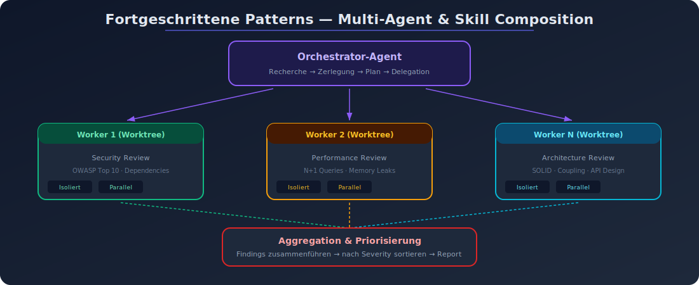

# 09 — Fortgeschrittene Patterns

## Überblick

Dieses Kapitel behandelt fortgeschrittene Skill-Patterns für Senior-Architekten, die über die Grundlagen hinausgehen: Multi-Agent Skills, Skill Composition, Enterprise-Patterns und die Integration von Skills in größere agentic Systeme.

---

## Pattern: Multi-Agent Skill Orchestration



### Problem
Komplexe Aufgaben erfordern mehrere spezialisierte Agents, die koordiniert zusammenarbeiten.

### Lösung: Batch-Skill als Orchestrator

Der `/batch`-Skill in Claude Code ist das Referenzbeispiel:

```
User: /batch migrate src/ from Solid to React

┌────────────────────────────────────────────┐
│ Orchestrator-Agent                          │
│                                             │
│ 1. Codebase recherchieren                  │
│ 2. Aufgabe in 5-30 Einheiten zerlegen      │
│ 3. Plan präsentieren                       │
│ 4. Bei Genehmigung:                        │
│                                             │
│    ┌─────────┐ ┌─────────┐ ┌─────────┐   │
│    │Worker 1 │ │Worker 2 │ │Worker N │   │
│    │(Worktree)│ │(Worktree)│ │(Worktree)│   │
│    │Component│ │Component│ │Component│   │
│    │A migr.  │ │B migr.  │ │N migr.  │   │
│    └────┬────┘ └────┬────┘ └────┬────┘   │
│         │           │           │         │
│         ▼           ▼           ▼         │
│    Tests laufen  Tests laufen  Tests laufen│
│    PR erstellen  PR erstellen  PR erstellen│
└────────────────────────────────────────────┘
```

### Eigene Multi-Agent Skills

```yaml
---
name: parallel-review
description: Führt paralleles Code-Review mit drei spezialisierten Agents durch
context: fork
---

Führe drei parallele Reviews durch:

## Agent 1: Security Review
- OWASP Top 10 prüfen
- Dependency-Vulnerabilities
- Auth/AuthZ Patterns

## Agent 2: Performance Review
- N+1 Queries
- Memory Leaks
- Algorithmic Complexity

## Agent 3: Architecture Review
- SOLID-Prinzipien
- Coupling/Cohesion
- API-Design

Aggregiere Findings und priorisiere nach Severity.
```

---

## Pattern: Skill Composition

### Problem
Einzelne Skills müssen für komplexe Workflows zusammenarbeiten.

### Lösung: Skills referenzieren andere Skills

```yaml
---
name: release
description: Vollständiger Release-Prozess
disable-model-invocation: true
---

Führe den vollständigen Release-Prozess durch:

1. /simplify — Code-Qualität der letzten Änderungen prüfen
2. Tests ausführen und sicherstellen, dass alle grün sind
3. Version bumpen gemäß Semantic Versioning
4. Changelog generieren aus Commit-Messages
5. /commit — Commit erstellen
6. Tag erstellen
7. Build und Deploy auslösen
```

### Horizontale vs. vertikale Composition

**Horizontal** — Skills arbeiten unabhängig am gleichen Problem:
```
Input → [Security-Skill]  ──┐
Input → [Performance-Skill] ─┼→ Aggregation → Output
Input → [Style-Skill]       ──┘
```

**Vertikal** — Skills arbeiten sequentiell, Output wird Input des nächsten:
```
Input → [Analyse-Skill] → [Plan-Skill] → [Execute-Skill] → Output
```

---

## Pattern: Verifiable Intermediate Outputs

### Problem
Bei komplexen Batch-Operationen können Fehler erst nach der Ausführung auffallen.

### Lösung
Einen maschinenprüfbaren Zwischenplan erstellen, bevor die eigentliche Ausführung beginnt.

```
1. Analyse     → Ist-Zustand erfassen
2. Plan        → changes.json generieren
3. Validierung → python validate_plan.py changes.json
4. Execution   → Nur bei PASS
5. Verifikation → Ergebnis prüfen
```

### Implementierung

```yaml
---
name: batch-update
description: Führt validierte Batch-Updates auf Dateien durch
scripts:
---

## Workflow

1. Analysiere die betroffenen Dateien
2. Erstelle `changes.json` mit folgendem Format:

```json
{
  "changes": [
    {
      "file": "src/component.tsx",
      "action": "modify",
      "description": "Import-Statement ändern",
      "before": "import { X } from 'old'",
      "after": "import { X } from 'new'"
    }
  ]
}
```

3. Validiere: `python scripts/validate_changes.py changes.json`
4. Bei PASS: Änderungen anwenden
5. Alle Tests ausführen
6. Bei Fehlern: Zurück zu Schritt 2
```

---

## Pattern: Skill-driven Observability

### Problem
Bei komplexen Agent-Workflows fehlt die Nachvollziehbarkeit — was hat der Agent getan und warum?

### Lösung: Logging und Tracking als Skill-Feature

```yaml
---
name: session-logger
description: Loggt Agent-Aktivität für die aktuelle Session
---

Logge Folgendes in logs/${CLAUDE_SESSION_ID}.log:

$ARGUMENTS

Format pro Eintrag:
```
[TIMESTAMP] [ACTION] [DETAIL]
```
```

### Audit-Trail Pattern

```yaml
---
name: audited-change
description: Führt auditierbare Änderungen durch
disable-model-invocation: true
---

Bevor du Änderungen durchführst:

1. Erstelle audit_log.md mit:
   - Timestamp
   - Beschreibung der geplanten Änderung
   - Betroffene Dateien
   - Begründung

2. Führe die Änderung durch

3. Ergänze audit_log.md mit:
   - Tatsächlich durchgeführte Änderungen
   - Diff-Summary
   - Test-Ergebnisse
```

---

## Pattern: Context-Aware Skill Activation

### Problem
Ein Skill soll nur in bestimmten Teilen der Codebase aktiv sein.

### Lösung: `paths`-Feld für kontextabhängige Aktivierung

```yaml
---
name: react-conventions
description: React-Coding-Konventionen für Frontend-Komponenten
paths:
  - "src/components/**/*.tsx"
  - "src/pages/**/*.tsx"
---

## React-Konventionen

- Functional Components mit Hooks
- Props-Interface immer definieren
- Custom Hooks in src/hooks/ extrahieren
- Keine inline Styles, immer CSS Modules
```

```yaml
---
name: api-conventions
description: API-Design-Konventionen für Backend-Endpoints
paths:
  - "src/api/**/*.ts"
  - "src/routes/**/*.ts"
---

## API-Konventionen

- RESTful Naming
- Zod für Input-Validierung
- Konsistente Error-Response-Formate
- Rate Limiting auf allen Endpoints
```

---

## Pattern: Skill als Knowledge Base

### Problem
Domänenspezifisches Wissen ist verstreut und muss dem Agent strukturiert zugänglich sein.

### Lösung: Skill mit domain-organisiertem Referenzmaterial

```
domain-knowledge/
├── SKILL.md              # Navigation und Quick-Reference
├── reference/
│   ├── glossary.md       # Fachbegriffe und Definitionen
│   ├── architecture.md   # System-Architektur
│   ├── data_model.md     # Datenmodell und Beziehungen
│   ├── business_rules.md # Geschäftsregeln
│   └── api_contracts.md  # API-Verträge
└── scripts/
    └── check_schema.py   # Schema-Validierung
```

```yaml
---
name: domain-knowledge
description: Domänenwissen für das Projekt — Architektur, Datenmodell,
  Geschäftsregeln. Aktiviert bei domänenspezifischen Fragen.
user-invocable: false
---

# Domänenwissen

## Quick Reference
- **Glossar**: [reference/glossary.md](reference/glossary.md)
- **Architektur**: [reference/architecture.md](reference/architecture.md)
- **Datenmodell**: [reference/data_model.md](reference/data_model.md)
- **Geschäftsregeln**: [reference/business_rules.md](reference/business_rules.md)
- **API-Verträge**: [reference/api_contracts.md](reference/api_contracts.md)
```

---

## Pattern: Enterprise Skill Governance

### Problem
In Enterprise-Umgebungen müssen Skills zentral verwaltet, auditiert und kontrolliert werden.

### Lösung: Managed Skills + Permission-Regeln

```
Enterprise Skill Management:

1. Managed Settings → Enterprise-Skills zentral verteilen
2. Permission Rules → Welche Skills wer nutzen darf
3. disableSkillShellExecution → Shell-Befehle in Skills deaktivieren
4. Audit Logging → Skill-Nutzung nachverfolgen
```

### Permission-Regeln für Teams

```
# Erlaubt: Nur genehmigte Skills
Skill(code-review)
Skill(test-runner)
Skill(commit)

# Verboten: Risikoreiche Skills
Skill(deploy *)
Skill(database-migration *)
```

### Skill-Versionierung in Git

```
.claude/skills/
├── deploy-v2/
│   ├── SKILL.md           # Aktuelle Version
│   └── CHANGELOG.md       # Änderungshistorie
```

---

## Pattern: Agentic Workflow Patterns mit Skills

### Pattern: Evaluator-Optimizer mit Skills

```yaml
---
name: quality-gate
description: Iteratives Verbesserungspattern — generiert, evaluiert, verbessert
context: fork
---

## Workflow

1. **Generiere** initialen Output für: $ARGUMENTS
2. **Evaluiere** gegen Qualitätskriterien:
   - Korrektheit
   - Vollständigkeit
   - Code-Qualität
   - Test-Abdeckung
3. **Falls Kriterien nicht erfüllt**:
   - Konkrete Verbesserungsvorschläge
   - Überarbeite basierend auf Feedback
   - Zurück zu Schritt 2
4. **Maximum 3 Iterationen**
5. **Abschluss**: Zusammenfassung der Qualitätsbewertung
```

### Pattern: Routing mit Skills

```yaml
---
name: task-router
description: Analysiert Anfragen und routet zum passenden Skill
user-invocable: false
---

Analysiere die Anfrage und entscheide:

**Code-Änderung?** → Verwende den Implementierungs-Workflow
**Bug-Fix?** → Verwende den Debugging-Workflow
**Code-Review?** → Verwende /simplify
**Deployment?** → Verwende /deploy
**Dokumentation?** → Verwende den Dokumentations-Workflow
```

---

## Zusammenfassung: Fortgeschrittene Patterns

| Pattern | Anwendungsfall | Komplexität |
|---------|---------------|-------------|
| Multi-Agent Orchestration | Parallele, spezialisierte Arbeit | Hoch |
| Skill Composition | Komplexe Workflows aus Einzel-Skills | Mittel |
| Verifiable Intermediate Outputs | Risikoreiche Batch-Operationen | Mittel |
| Skill-driven Observability | Auditierung und Nachvollziehbarkeit | Niedrig |
| Context-Aware Activation | Codebase-spezifische Konventionen | Niedrig |
| Knowledge Base | Domänenwissen strukturiert | Mittel |
| Enterprise Governance | Zentrale Verwaltung und Kontrolle | Hoch |
| Evaluator-Optimizer | Iterative Qualitätsverbesserung | Mittel |
| Routing | Anfragen-Klassifikation | Mittel |
